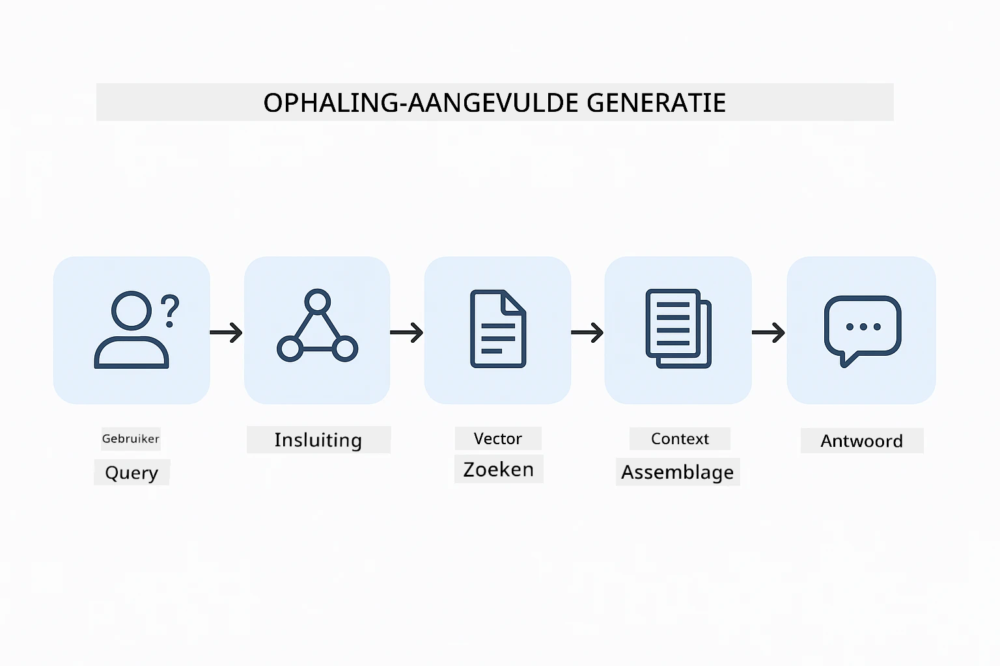
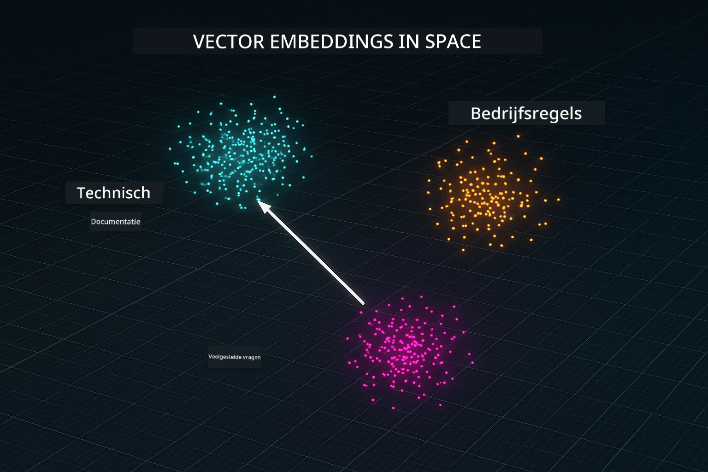
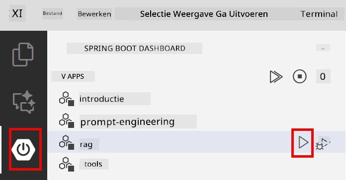
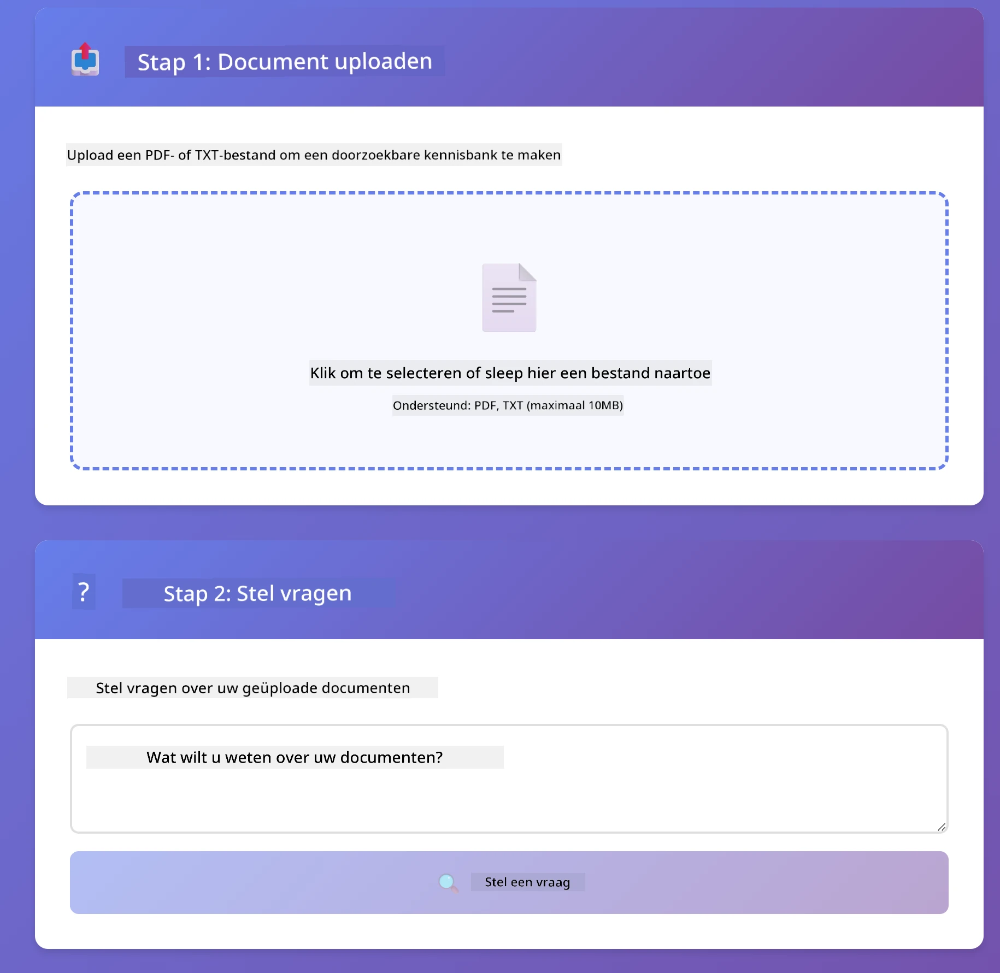
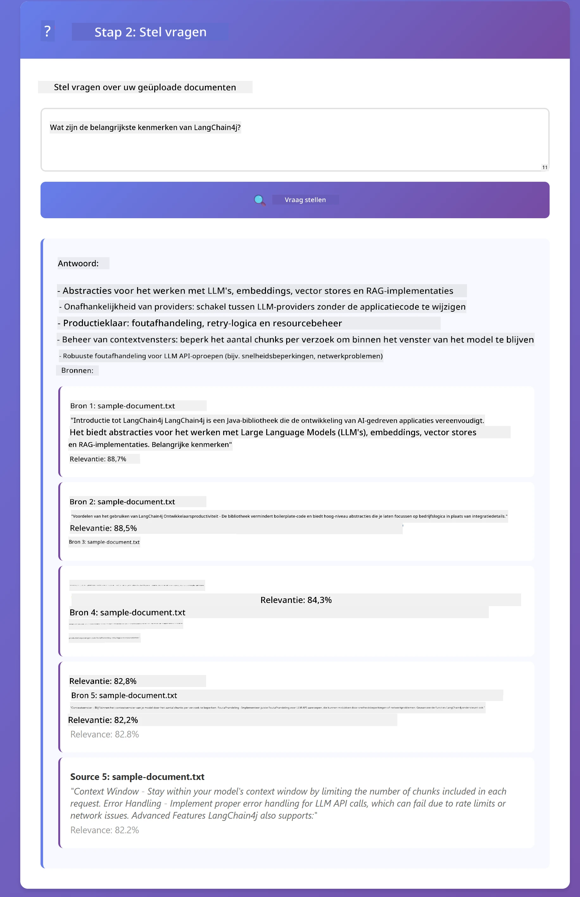

# Module 03: RAG (Retrieval-Augmented Generation)

## Inhoudsopgave

- [Video Walkthrough](#video-walkthrough)
- [Wat Je Zal Leren](#wat-je-zal-leren)
- [Vereisten](#vereisten)
- [RAG Begrijpen](#rag-begrijpen)
  - [Welke RAG Aanpak Gebruikt Deze Tutorial?](#welke-rag-aanpak-gebruikt-deze-tutorial)
- [Hoe Het Werkt](#hoe-het-werkt)
  - [Documentverwerking](#documentverwerking)
  - [Embeddings Maken](#embeddings-maken)
  - [Semantisch Zoeken](#semantisch-zoeken)
  - [Antwoordgeneratie](#antwoord-generatie)
- [De Applicatie Uitvoeren](#de-applicatie-starten)
- [De Applicatie Gebruiken](#de-applicatie-gebruiken)
  - [Upload Een Document](#upload-een-document)
  - [Stel Vragen](#stel-vragen)
  - [Controleer Bronverwijzingen](#controleer-bronverwijzingen)
  - [Experimenteer met Vragen](#experimenteer-met-vragen)
- [Belangrijke Concepten](#kernconcepten)
  - [Chunking Strategie](#chunking-strategie)
  - [Similariteit Scores](#similariteitscores)
  - [In-Memory Opslag](#in-memory-opslag)
  - [Contextvenster Beheer](#contextvensterbeheer)
- [Wanneer RAG Belangrijk Is](#wanneer-rag-belangrijk-is)
- [Volgende Stappen](#volgende-stappen)

## Video Walkthrough

Bekijk deze live sessie die uitlegt hoe je aan de slag gaat met deze module:

<a href="https://www.youtube.com/watch?v=_olq75ZH_eY"></a>

## Wat Je Zal Leren

In de vorige modules heb je geleerd hoe je gesprekken voert met AI en je prompts effectief structureert. Maar er is een fundamentele beperking: taalmodellen weten alleen wat ze tijdens de training geleerd hebben. Ze kunnen geen vragen beantwoorden over het beleid van je bedrijf, je projectdocumentatie of enige informatie waarop ze niet getraind zijn.

RAG (Retrieval-Augmented Generation) lost dit probleem op. In plaats van te proberen het model je informatie te leren (wat duur en onpraktisch is), geef je het de mogelijkheid om door je documenten te zoeken. Wanneer iemand een vraag stelt, vindt het systeem relevante informatie en voegt die toe aan de prompt. Het model beantwoordt dan op basis van die opgehaalde context.

Zie RAG als het geven van een referentiebibliotheek aan het model. Wanneer je een vraag stelt, doet het systeem het volgende:

1. **Gebruikersvraag** - Je stelt een vraag
2. **Embedding** - Zet je vraag om in een vector
3. **Vectorzoektocht** - Vindt vergelijkbare documentstukken
4. **Context Samenstellen** - Voegt relevante stukken toe aan de prompt
5. **Antwoord** - LLM genereert een antwoord op basis van de context

Dit baseert de antwoorden van het model op jouw daadwerkelijke data in plaats van te vertrouwen op trainingskennis of zelf antwoorden te verzinnen.

## Vereisten

- Voltooide [Module 01 - Introductie](../01-introduction/README.md) (Azure OpenAI resources gedeployed, inclusief het `text-embedding-3-small` embedding model)
- `.env` bestand in de rootmap met Azure-gegevens (aangemaakt door `azd up` in Module 01)

> **Opmerking:** Als je Module 01 niet hebt voltooid, volg dan eerst de implementatie-instructies daar. Het `azd up` commando zet zowel het GPT chatmodel als het embedding model, gebruikt in deze module, uit.

## RAG Begrijpen

De onderstaande afbeelding illustreert het kernconcept: in plaats van alleen te vertrouwen op de trainingsdata van het model, geeft RAG het een referentiebibliotheek van je documenten om te raadplegen voordat het een antwoord genereert.


*Deze afbeelding toont het verschil tussen een standaard LLM (die gokt op basis van trainingsdata) en een RAG-verbeterd LLM (die eerst je documenten raadpleegt).*

Hier zie je hoe de onderdelen end-to-end verbonden zijn. De vraag van een gebruiker stroomt door vier fasen — embedding, vectorzoektocht, contextsamenstelling en antwoordgeneratie — elk bouwt voort op de vorige:



*Deze afbeelding toont de end-to-end RAG-pijplijn — een gebruikersvraag stroomt door embedding, vectorzoektocht, contextsamenstelling en antwoordgeneratie.*

De rest van deze module doorloopt elke fase in detail, met code die je kunt uitvoeren en aanpassen.

### Welke RAG Aanpak Gebruikt Deze Tutorial?

LangChain4j biedt drie manieren om RAG te implementeren, elk met een ander abstractieniveau. De onderstaande afbeelding vergelijkt ze naast elkaar:


*Deze afbeelding vergelijkt de drie LangChain4j RAG-aanpakken — Easy, Native en Advanced — met hun belangrijkste componenten en wanneer je ze gebruikt.*

| Aanpak | Wat Het Doet | Afweging |
|---|---|---|
| **Easy RAG** | Verbindt alles automatisch via `AiServices` en `ContentRetriever`. Je annoteert een interface, koppelt een retriever en LangChain4j handelt embedding, zoeken en promptopbouw achter de schermen af. | Minimaal code, maar je ziet niet wat er bij elke stap gebeurt. |
| **Native RAG** | Je roept het embeddingmodel aan, zoekt in de opslag, bouwt de prompt en genereert zelf het antwoord — expliciet stap voor stap. | Meer code, maar elke fase is zichtbaar en aanpasbaar. |
| **Advanced RAG** | Gebruikt het `RetrievalAugmentor`-framework met inplugbare querytransformers, routers, herbeoordelaars en inhoudsinjectoren voor productieklare pijplijnen. | Maximale flexibiliteit, maar aanzienlijk meer complexiteit. |

**Deze tutorial gebruikt de Native aanpak.** Elke stap van de RAG-pijplijn — het embedden van de query, zoeken in de vectoropslag, assembleren van de context en genereren van het antwoord — is expliciet uitgeschreven in [`RagService.java`](../../../03-rag/src/main/java/com/example/langchain4j/rag/service/RagService.java). Dit is bewust zo: als leerresource is het belangrijker dat je elke fase ziet en begrijpt dan dat de code minimaal is. Zodra je vertrouwd bent met hoe de onderdelen samenwerken, kun je overstappen naar Easy RAG voor snelle prototypes of Advanced RAG voor productiesystemen.

> **💡 Benieuwd naar Easy RAG?** LangChain4j biedt ook een *Easy RAG* aanpak waarbij `AiServices` en een `ContentRetriever` automatisch embedding, zoeken en promptopbouw beheren. Deze module kiest de expliciete weg — waarbij die pijplijn wordt opengemaakt zodat je elke fase zelf kunt zien en aansturen.

De onderstaande afbeelding toont de Easy RAG-pijplijn. Let op hoe `AiServices` en `EmbeddingStoreContentRetriever` alle complexiteit verbergen — je laadt een document, koppelt een retriever en krijgt antwoorden. De Native aanpak in deze module maakt elk van die verborgen stappen open:


*Deze afbeelding toont de Easy RAG-pijplijn. Vergelijk dit met de Native aanpak gebruikt in deze module: Easy RAG verbergt embedding, ophalen en promptopbouw achter `AiServices` en `ContentRetriever` — je laadt een document, koppelt een retriever en krijgt antwoorden. De Native aanpak in deze module maakt die pijplijn open zodat je elke stap (embed, zoek, stel context samen, genereer) zelf aanroept, wat volledige zichtbaarheid en controle geeft.*

## Hoe Het Werkt

De RAG-pijplijn in deze module bestaat uit vier fasen die telkens opeenvolgend lopen als een gebruiker een vraag stelt. Eerst wordt een geüpload document **geparseerd en opgedeeld** in hanteerbare stukken. Die stukken worden vervolgens omgezet in **vectorembeddings** en opgeslagen zodat ze wiskundig vergeleken kunnen worden. Wanneer een vraag binnenkomt, voert het systeem een **semantische zoekopdracht** uit om de meest relevante stukken te vinden, en geeft die tenslotte door als context aan de LLM voor **antwoordgeneratie**. De onderstaande secties doorlopen elke fase met daadwerkelijke code en diagrammen. Laten we naar de eerste stap kijken.

### Documentverwerking

[DocumentService.java](../../../03-rag/src/main/java/com/example/langchain4j/rag/service/DocumentService.java)

Wanneer je een document uploadt, parsed het systeem dit (PDF of platte tekst), voegt metadata toe zoals de bestandsnaam, en verdeelt het document in stukken — kleinere segmenten die comfortabel in het contextvenster van het model passen. Deze stukken overlappen licht zodat er geen context verloren gaat op de grenzen.

```java
// Parse het geüploade bestand en verpak het in een LangChain4j Document
Document document = Document.from(content, metadata);

// Splits in stukken van 300 tokens met een overlap van 30 tokens
DocumentSplitter splitter = DocumentSplitters
    .recursive(300, 30);

List<TextSegment> segments = splitter.split(document);
```

De onderstaande afbeelding toont hoe dit visueel werkt. Let op hoe elk stuk enkele tokens deelt met zijn buren — de overlap van 30 tokens zorgt ervoor dat geen belangrijke context tussen de mazen valt:


*Deze afbeelding toont een document opgesplitst in stukken van 300 tokens met 30 tokens overlap, die context aan de chunkgrenzen behoudt.*

> **🤖 Probeer met [GitHub Copilot](https://github.com/features/copilot) Chat:** Open [`DocumentService.java`](../../../03-rag/src/main/java/com/example/langchain4j/rag/service/DocumentService.java) en vraag:
> - "Hoe splitst LangChain4j documenten in stukken en waarom is overlap belangrijk?"
> - "Wat is de optimale chunksize voor verschillende documenten en waarom?"
> - "Hoe ga ik om met documenten in meerdere talen of met speciale opmaak?"

### Embeddings Maken

[LangChainRagConfig.java](../../../03-rag/src/main/java/com/example/langchain4j/rag/config/LangChainRagConfig.java)

Elk stuk wordt omgezet in een numerieke representatie, een embedding genoemd — in wezen een betekenis-naar-getallen-omzetter. Het embeddingmodel is niet “intelligent” zoals een chatmodel; het kan geen instructies volgen, redeneren of vragen beantwoorden. Wat het wel kan, is tekst in een wiskundige ruimte plaatsen waar vergelijkbare betekenissen dicht bij elkaar liggen — “auto” dicht bij “voertuig,” “terugbetalingsbeleid” dicht bij “mijn geld terug.” Zie een chatmodel als een persoon met wie je praat; een embeddingmodel is een extreem goed archiefsysteem.

De onderstaande afbeelding visualiseert dit concept — tekst gaat erin, numerieke vectoren komen eruit, en gelijke betekenissen produceren nabijgelegen vectoren:


*Deze afbeelding toont hoe een embeddingmodel tekst omzet in numerieke vectoren, waarbij gelijke betekenissen — zoals "auto" en "voertuig" — dicht bij elkaar in de vectorruimte geplaatst worden.*

```java
@Bean
public EmbeddingModel embeddingModel() {
    return OpenAiOfficialEmbeddingModel.builder()
        .baseUrl(azureOpenAiEndpoint)
        .apiKey(azureOpenAiKey)
        .modelName(azureEmbeddingDeploymentName)
        .build();
}

EmbeddingStore<TextSegment> embeddingStore = 
    new InMemoryEmbeddingStore<>();
```

Het klassendiagram hieronder toont de twee aparte stromen in een RAG-pijplijn en de LangChain4j-klassen die ze implementeren. De **inname-stroom** (loopt één keer bij upload) splitst het document, embedt de chunks en slaat ze op via `.addAll()`. De **query-stroom** (loopt elke keer als een gebruiker vraagt) embedt de vraag, zoekt in de opslag via `.search()`, en geeft de bijpassende context door aan het chatmodel. Beide stromen komen samen bij de gedeelde `EmbeddingStore<TextSegment>` interface:


*Deze afbeelding toont de twee stromen in een RAG-pijplijn — inname en query — en hoe ze via een gedeelde EmbeddingStore verbonden zijn.*

Zodra embeddings zijn opgeslagen, clustert vergelijkbare inhoud natuurlijk samen in vectorruimte. De onderstaande visualisatie toont hoe documenten over gerelateerde onderwerpen bijeen komen als nabijgelegen punten, wat semantisch zoeken mogelijk maakt:



*Deze visualisatie toont hoe gerelateerde documenten samenklonteren in 3D vectorruimte, met onderwerpen zoals Technische Docs, Bedrijfsregels en Veelgestelde Vragen als afzonderlijke groepen.*

Wanneer een gebruiker zoekt, volgt het systeem vier stappen: embed de documenten één keer, embed de query bij elke zoekopdracht, vergelijk de queryvector met alle opgeslagen vectoren met behulp van cosine similarity, en retourneer de top-K hoogst scorende stukken. De onderstaande afbeelding doorloopt elke stap en de betrokken LangChain4j-klassen:


*Deze afbeelding toont het vierstappenproces van embedding search: embed documenten, embed de query, vergelijk vectoren met cosine similarity en geef de top-K resultaten terug.*

### Semantisch Zoeken

[RagService.java](../../../03-rag/src/main/java/com/example/langchain4j/rag/service/RagService.java)

Wanneer je een vraag stelt, wordt die vraag ook omgezet in een embedding. Het systeem vergelijkt de embedding van je vraag met alle embeddings van de documentstukken. Het vindt de stukken met de meest vergelijkbare betekenissen - niet alleen hetzelfde zoekwoord, maar daadwerkelijke semantische gelijkenis.

```java
Embedding queryEmbedding = embeddingModel.embed(question).content();

EmbeddingSearchRequest searchRequest = EmbeddingSearchRequest.builder()
    .queryEmbedding(queryEmbedding)
    .maxResults(5)
    .minScore(0.5)
    .build();

EmbeddingSearchResult<TextSegment> searchResult = embeddingStore.search(searchRequest);
List<EmbeddingMatch<TextSegment>> matches = searchResult.matches();

for (EmbeddingMatch<TextSegment> match : matches) {
    String relevantText = match.embedded().text();
    double score = match.score();
}
```

De onderstaande afbeelding vergelijkt semantisch zoeken met traditioneel zoeken op sleutelwoorden. Een zoekopdracht op “voertuig” mist een stuk over “auto’s en vrachtwagens,” maar semantisch zoeken begrijpt dat ze hetzelfde betekenen en geeft het als een hoog scorende match terug:


*Deze afbeelding vergelijkt zoeken op sleutelwoorden met semantisch zoeken, waarbij semantisch zoeken conceptueel gerelateerde inhoud teruggeeft ook als exacte sleutelwoorden verschillen.*

Onder de motorkap wordt gelijkenis gemeten met cosine similarity — in feite wordt gevraagd "wijzen deze twee pijlen in dezelfde richting?" Twee stukken kunnen totaal verschillende woorden gebruiken, maar als ze hetzelfde betekenen wijzen hun vectoren in dezelfde richting en scoren ze dicht bij 1.0:


*Dit diagram illustreert cosine similarity als de hoek tussen embedding-vectoren — meer uitgelijnde vectoren scoren dichter bij 1.0, wat een hogere semantische gelijkenis aangeeft.*

> **🤖 Probeer met [GitHub Copilot](https://github.com/features/copilot) Chat:** Open [`RagService.java`](../../../03-rag/src/main/java/com/example/langchain4j/rag/service/RagService.java) en vraag:
> - "Hoe werkt similarity search met embeddings en wat bepaalt de score?"
> - "Welke similariteitsdrempel moet ik gebruiken en hoe beïnvloedt dit de resultaten?"
> - "Hoe handel ik gevallen af waarin geen relevante documenten worden gevonden?"

### Antwoord Generatie

[RagService.java](../../../03-rag/src/main/java/com/example/langchain4j/rag/service/RagService.java)

De meest relevante chunks worden samengevoegd tot een gestructureerde prompt die expliciete instructies, de opgehaalde context en de vraag van de gebruiker bevat. Het model leest deze specifieke chunks en antwoordt op basis van die informatie — het kan alleen gebruiken wat voor hem ligt, wat hallucinaties voorkomt.

```java
String context = matches.stream()
    .map(match -> match.embedded().text())
    .collect(Collectors.joining("\n\n"));

String prompt = String.format("""
    Answer the question based on the following context.
    If the answer cannot be found in the context, say so.

    Context:
    %s

    Question: %s

    Answer:""", context, request.question());

String answer = chatModel.chat(prompt);
```

Het onderstaande diagram toont deze samenstelling in actie — de chunks met de hoogste score uit de zoekstap worden geïnjecteerd in de promptsjabloon, en het `OpenAiOfficialChatModel` genereert een onderbouwd antwoord:


*Dit diagram toont hoe de chunks met de hoogste score worden samengevoegd tot een gestructureerde prompt, zodat het model een onderbouwd antwoord kan genereren vanuit jouw data.*

## De Applicatie Starten

**Controleer de deployment:**

Zorg dat het `.env` bestand in de hoofdmap bestaat met Azure-gegevens (aangemaakt tijdens Module 01). Voer het volgende uit vanuit de modulemap (`03-rag/`):

**Bash:**
```bash
cat ../.env  # Moet AZURE_OPENAI_ENDPOINT, API_KEY, DEPLOYMENT weergeven
```

**PowerShell:**
```powershell
Get-Content ..\.env  # Moet AZURE_OPENAI_ENDPOINT, API_KEY, DEPLOYMENT tonen
```

**Start de applicatie:**

> **Opmerking:** Als je alle applicaties al gestart hebt via `./start-all.sh` vanuit de hoofdmap (zoals beschreven in Module 01), draait deze module al op poort 8081. Je kunt de onderstaande startcommando's overslaan en direct naar http://localhost:8081 gaan.

**Optie 1: Spring Boot Dashboard gebruiken (aanbevolen voor VS Code-gebruikers)**

De devcontainer bevat de Spring Boot Dashboard-extensie, die een visuele interface biedt om alle Spring Boot-applicaties te beheren. Je vindt deze in de Activiteitenbalk links in VS Code (zoek het Spring Boot-icoon).

Via het Spring Boot Dashboard kun je:
- Alle beschikbare Spring Boot-applicaties in de workspace zien
- Applicaties starten/stoppen met één klik
- Applicatielogs realtime bekijken
- Applicatiestatus monitoren

Klik simpelweg op de afspeelknop naast “rag” om deze module te starten, of start alle modules tegelijk.



*Deze schermafbeelding toont het Spring Boot Dashboard in VS Code, waar je applicaties visueel kunt starten, stoppen en monitoren.*

**Optie 2: Shell scripts gebruiken**

Start alle webapplicaties (modules 01-04):

**Bash:**
```bash
cd ..  # Vanuit de hoofdmap
./start-all.sh
```

**PowerShell:**
```powershell
cd ..  # Vanaf rootdirectory
.\start-all.ps1
```

Of start alleen deze module:

**Bash:**
```bash
cd 03-rag
./start.sh
```

**PowerShell:**
```powershell
cd 03-rag
.\start.ps1
```

Beide scripts laden automatisch omgevingsvariabelen uit het `.env` bestand in de hoofdmap en bouwen de JAR’s indien die nog niet bestaan.

> **Opmerking:** Als je liever alle modules handmatig bouwt voordat je start:
>
> **Bash:**
> ```bash
> cd ..  # Go to root directory
> mvn clean package -DskipTests
> ```
>
> **PowerShell:**
> ```powershell
> cd ..  # Go to root directory
> mvn clean package -DskipTests
> ```

Open http://localhost:8081 in je browser.

**Om te stoppen:**

**Bash:**
```bash
./stop.sh  # Alleen deze module
# Of
cd .. && ./stop-all.sh  # Alle modules
```

**PowerShell:**
```powershell
.\stop.ps1  # Alleen deze module
# Of
cd ..; .\stop-all.ps1  # Alle modules
```

## De Applicatie Gebruiken

De applicatie biedt een webinterface voor het uploaden van documenten en het stellen van vragen.

<a href="images/rag-homepage.png"></a>

*Deze schermafbeelding toont de RAG applicatie-interface waar je documenten uploadt en vragen stelt.*

### Upload een Document

Begin met het uploaden van een document - TXT-bestanden zijn het beste voor testen. Er is een `sample-document.txt` beschikbaar in deze map met informatie over LangChain4j features, RAG implementatie, en best practices - perfect om het systeem te testen.

Het systeem verwerkt je document, splitst het in chunks en maakt embeddings voor elke chunk. Dit gebeurt automatisch bij het uploaden.

### Stel Vragen

Stel nu specifieke vragen over de inhoud van het document. Probeer iets feitelijks wat duidelijk in het document staat. Het systeem zoekt naar relevante chunks, verwerkt die in de prompt en genereert een antwoord.

### Controleer Bronverwijzingen

Merk op dat elk antwoord bronverwijzingen bevat met similariteitsscores. Deze scores (0 tot 1) tonen hoe relevant elke chunk was voor je vraag. Hogere scores betekenen betere overeenkomsten. Zo kun je het antwoord verifiëren met het bronmateriaal.

<a href="images/rag-query-results.png"></a>

*Deze screenshot toont queryresultaten met het gegenereerde antwoord, bronverwijzingen, en relevantiescores voor elke opgehaalde chunk.*

### Experimenteer met Vragen

Probeer verschillende soorten vragen:
- Specifieke feiten: “Wat is het hoofdt onderwerp?”
- Vergelijkingen: “Wat is het verschil tussen X en Y?”
- Samenvattingen: “Vat de belangrijkste punten over Z samen”

Bekijk hoe de relevantiescores veranderen afhankelijk van hoe goed je vraag aansluit bij de documentinhoud.

## Kernconcepten

### Chunking Strategie

Documenten worden opgedeeld in chunks van 300 tokens met een overlap van 30 tokens. Deze balans zorgt ervoor dat elke chunk voldoende context bevat om betekenisvol te zijn, terwijl ze klein genoeg blijven om meerdere chunks in een prompt op te nemen.

### Similariteitscores

Elke opgehaalde chunk bevat een similariteitsscore tussen 0 en 1 die aangeeft hoe nauw deze overeenkomt met de vraag van de gebruiker. Het onderstaande diagram visualiseert de scorebereiken en hoe het systeem deze gebruikt om resultaten te filteren:


*Dit diagram toont scorebereiken van 0 tot 1, met een minimumdrempel van 0.5 die irrelevante chunks filtert.*

Scores lopen van 0 tot 1:
- 0.7-1.0: Zeer relevant, exacte match
- 0.5-0.7: Relevant, goede context
- Lager dan 0.5: Gefilterd, te verschillend

Het systeem haalt alleen chunks op boven de minimumdrempel om kwaliteit te waarborgen.

Embeddings werken goed wanneer betekenissen duidelijk clusteren, maar hebben blinde vlekken. Het onderstaande diagram toont veelvoorkomende faalwijzen — te grote chunks produceren vage vectoren, te kleine chunks missen context, ambiguë termen wijzen naar meerdere clusters, en exact-match zoekopdrachten (ID’s, onderdelen nummers) werken helemaal niet met embeddings:


*Dit diagram toont veelvoorkomende faalwijzen bij embeddings: chunks zijn te groot, chunks zijn te klein, ambiguïteit verwijst naar meerdere clusters, en exact-match zoekopdrachten zoals ID’s.*

### In-Memory Opslag

Deze module gebruikt geheugenopslag voor eenvoud. Bij herstart van de applicatie gaan geüploade documenten verloren. Productiesystemen gebruiken persistente vectordatabases zoals Qdrant of Azure AI Search.

### Contextvensterbeheer

Elk model heeft een maximaal contextvenster. Je kunt niet elke chunk van een groot document in de prompt opnemen. Het systeem haalt de top N meest relevante chunks op (standaard 5) om binnen de limieten te blijven en toch voldoende context voor accurate antwoorden te bieden.

## Wanneer RAG Belangrijk Is

RAG is niet altijd de juiste aanpak. De onderstaande beslisgids helpt te bepalen wanneer RAG waarde toevoegt versus wanneer simpelere methodes — zoals content direct in de prompt opnemen of vertrouwen op ingebouwde kennis van het model — voldoende zijn:


*Dit diagram toont een beslisgids voor wanneer RAG waarde toevoegt versus wanneer simpelere benaderingen volstaan.*

## Volgende Stappen

**Volgende Module:** [04-tools - AI Agents met Tools](../04-tools/README.md)

---

**Navigatie:** [← Vorige: Module 02 - Prompt Engineering](../02-prompt-engineering/README.md) | [Terug naar Hoofd](../README.md) | [Volgende: Module 04 - Tools →](../04-tools/README.md)

---

<!-- CO-OP TRANSLATOR DISCLAIMER START -->
**Disclaimer**:
Dit document is vertaald met behulp van de AI vertaaldienst [Co-op Translator](https://github.com/Azure/co-op-translator). Hoewel we streven naar nauwkeurigheid, dient u er rekening mee te houden dat geautomatiseerde vertalingen fouten of onnauwkeurigheden kunnen bevatten. Het originele document in de oorspronkelijke taal moet worden beschouwd als de gezaghebbende bron. Voor kritieke informatie wordt professionele menselijke vertaling aanbevolen. Wij zijn niet aansprakelijk voor eventuele misverstanden of verkeerde interpretaties die voortvloeien uit het gebruik van deze vertaling.
<!-- CO-OP TRANSLATOR DISCLAIMER END -->