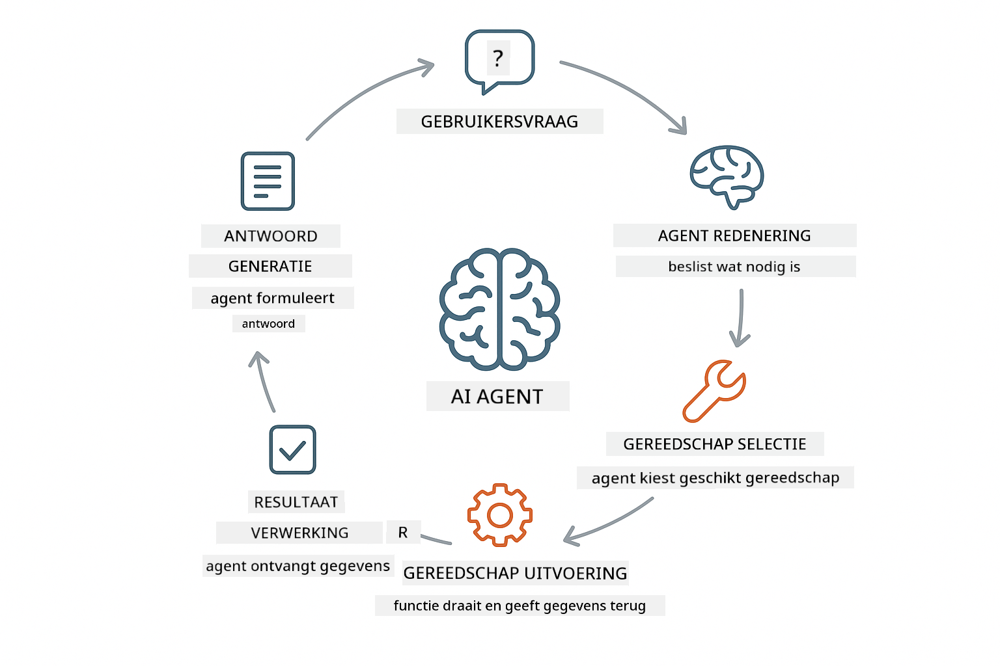
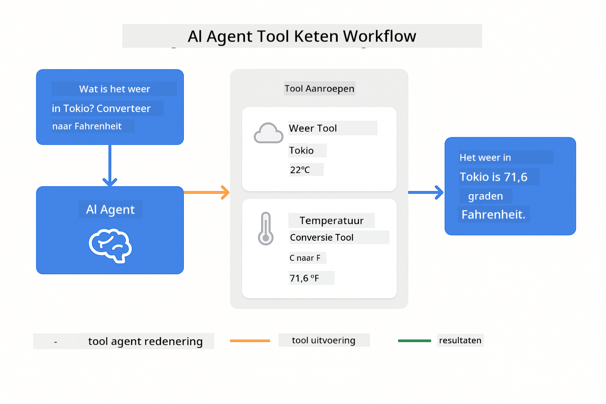
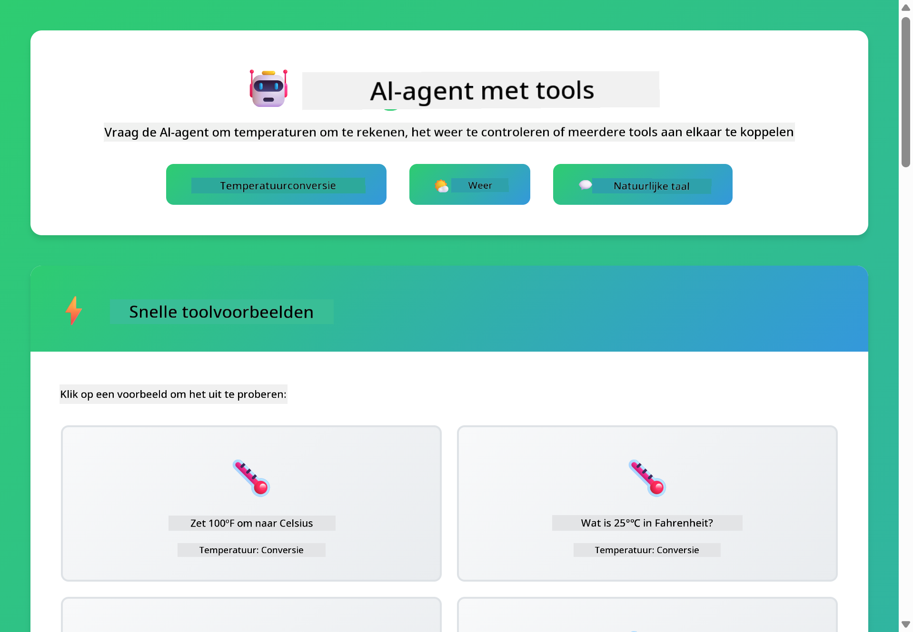

<!--
CO_OP_TRANSLATOR_METADATA:
{
  "original_hash": "844788938b26242f3cc54ce0d0951bea",
  "translation_date": "2026-01-06T00:05:38+00:00",
  "source_file": "04-tools/README.md",
  "language_code": "nl"
}
-->
# Module 04: AI-agenten met tools

## Inhoudsopgave

- [Wat je zult leren](../../../04-tools)
- [Vereisten](../../../04-tools)
- [AI-agenten met tools begrijpen](../../../04-tools)
- [Hoe tool-aanroepen werken](../../../04-tools)
  - [Tooldefinities](../../../04-tools)
  - [Besluitvorming](../../../04-tools)
  - [Uitvoering](../../../04-tools)
  - [Responsgeneratie](../../../04-tools)
- [Tool chaining](../../../04-tools)
- [De applicatie draaien](../../../04-tools)
- [De applicatie gebruiken](../../../04-tools)
  - [Probeer eenvoudige toolgebruik](../../../04-tools)
  - [Test tool chaining](../../../04-tools)
  - [Bekijk het gesprekstraject](../../../04-tools)
  - [Experimenteer met verschillende verzoeken](../../../04-tools)
- [Belangrijke concepten](../../../04-tools)
  - [ReAct-patroon (Redeneren en Handelen)](../../../04-tools)
  - [Toolbeschrijvingen zijn belangrijk](../../../04-tools)
  - [Sessiebeheer](../../../04-tools)
  - [Foutafhandeling](../../../04-tools)
- [Beschikbare tools](../../../04-tools)
- [Wanneer gebruik je tool-gebaseerde agenten](../../../04-tools)
- [Volgende stappen](../../../04-tools)

## Wat je zult leren

Tot nu toe heb je geleerd hoe je gesprekken voert met AI, prompts effectief structureert en reacties in jouw documenten verankert. Maar er is nog een fundamentele beperking: taalmodellen kunnen alleen tekst genereren. Ze kunnen het weer niet controleren, geen berekeningen uitvoeren, geen databases bevragen of communiceren met externe systemen.

Tools veranderen dit. Door het model toegang te geven tot functies die het kan aanroepen, transformeer je het van een tekstgenerator in een agent die acties kan ondernemen. Het model beslist wanneer het een tool nodig heeft, welke tool te gebruiken en welke parameters mee te geven. Je code voert de functie uit en retourneert het resultaat. Het model verwerkt dat resultaat in zijn antwoord.

## Vereisten

- Module 01 afgerond (Azure OpenAI-resources gedeployed)
- `.env` bestand in de hoofdmap met Azure-referenties (aangemaakt door `azd up` in Module 01)

> **Opmerking:** Als je Module 01 niet hebt afgerond, volg daar eerst de implementatie-instructies.

## AI-agenten met tools begrijpen

> **📝 Opmerking:** De term "agenten" in deze module verwijst naar AI-assistenten met tool-aanroeppmogelijkheden. Dit is anders dan de **Agentic AI**-patronen (autonome agenten met planning, geheugen en meervoudige redeneringsstappen) die we behandelen in [Module 05: MCP](../05-mcp/README.md).

Een AI-agent met tools volgt een redeneren-en-handelen-patroon (ReAct):

1. Gebruiker stelt een vraag
2. Agent overweegt wat het moet weten
3. Agent beslist of er een tool nodig is om te antwoorden
4. Zo ja, agent roept de juiste tool aan met de juiste parameters
5. Tool voert uit en retourneert data
6. Agent verwerkt het resultaat en geeft het definitieve antwoord



*Het ReAct-patroon - hoe AI-agenten afwisselen tussen redeneren en handelen om problemen op te lossen*

Dit gebeurt automatisch. Je definieert de tools en hun beschrijvingen. Het model regelt de besluitvorming over wanneer en hoe deze te gebruiken.

## Hoe tool-aanroepen werken

### Tooldefinities

[WeatherTool.java](../../../04-tools/src/main/java/com/example/langchain4j/agents/tools/WeatherTool.java) | [TemperatureTool.java](../../../04-tools/src/main/java/com/example/langchain4j/agents/tools/TemperatureTool.java)

Je definieert functies met duidelijke beschrijvingen en parameterspecificaties. Het model ziet deze beschrijvingen in zijn systeem-prompt en begrijpt wat elke tool doet.

```java
@Component
public class WeatherTool {
    
    @Tool("Get the current weather for a location")
    public String getCurrentWeather(@P("Location name") String location) {
        // Je weeropzoeklogica
        return "Weather in " + location + ": 22°C, cloudy";
    }
}

@AiService
public interface Assistant {
    String chat(@MemoryId String sessionId, @UserMessage String message);
}

// Assistent wordt automatisch gekoppeld door Spring Boot met:
// - ChatModel bean
// - Alle @Tool-methoden van @Component-klassen
// - ChatMemoryProvider voor sessiebeheer
```

> **🤖 Probeer met [GitHub Copilot](https://github.com/features/copilot) Chat:** Open [`WeatherTool.java`](../../../04-tools/src/main/java/com/example/langchain4j/agents/tools/WeatherTool.java) en vraag:
> - "Hoe kan ik een echte weer-API zoals OpenWeatherMap integreren in plaats van mockdata?"
> - "Wat maakt een goede toolbeschrijving die de AI helpt de tool correct te gebruiken?"
> - "Hoe handel ik API-fouten en snelheidslimieten af in toolimplementaties?"

### Besluitvorming

Wanneer een gebruiker vraagt "Wat is het weer in Seattle?", herkent het model dat het de weertool nodig heeft. Het genereert een functie-aanroep met de parameter locatie op "Seattle".

### Uitvoering

[AgentService.java](../../../04-tools/src/main/java/com/example/langchain4j/agents/service/AgentService.java)

Spring Boot injecteert automatisch de declaratieve `@AiService`-interface met alle geregistreerde tools, en LangChain4j voert de tool-aanroepen automatisch uit.

> **🤖 Probeer met [GitHub Copilot](https://github.com/features/copilot) Chat:** Open [`AgentService.java`](../../../04-tools/src/main/java/com/example/langchain4j/agents/service/AgentService.java) en vraag:
> - "Hoe werkt het ReAct-patroon en waarom is het effectief voor AI-agenten?"
> - "Hoe besluit de agent welke tool te gebruiken en in welke volgorde?"
> - "Wat gebeurt er als de uitvoering van een tool mislukt - hoe kan ik fouten robuust afhandelen?"

### Responsgeneratie

Het model ontvangt de weergegevens en formatteert deze in een natuurlijk taalantwoord voor de gebruiker.

### Waarom Declaratieve AI Services gebruiken?

Deze module gebruikt LangChain4j’s Spring Boot-integratie met declaratieve `@AiService`-interfaces:

- **Spring Boot auto-wiring** – ChatModel en tools worden automatisch geïnjecteerd
- **@MemoryId-patroon** – Automatisch sessiegebaseerd geheugenbeheer
- **Enkele instantie** – Assistent wordt één keer aangemaakt en hergebruikt voor betere prestaties
- **Typesafe uitvoering** – Java-methoden worden direct aangeroepen met typeconversie
- **Multi-turn orchestratie** – Regelt tool chaining automatisch
- **Zero boilerplate** – Geen handmatige AiServices.builder() calls of geheugen-HashMap

Alternatieve benaderingen (handmatige `AiServices.builder()`) vergen meer code en missen Spring Boot integratievoordelen.

## Tool chaining

**Tool chaining** – De AI kan meerdere tools na elkaar aanroepen. Vraag "Wat is het weer in Seattle en moet ik een paraplu meenemen?" en zie hoe het `getCurrentWeather` aanroept met een redenering over regenkleding.

<a href="images/tool-chaining.png"></a>

*Sequentiële tool-aanroepen - de output van de ene tool voedt de volgende beslissing*

**Graceful Failures** – Vraag het weer in een stad die niet in de mockdata staat. De tool geeft een foutmelding terug en de AI legt uit dat het niet kan helpen. Tools falen veilig.

Dit gebeurt in één gespreksturn. De agent orkestreert meerdere toolaanroepen autonoom.

## De applicatie draaien

**Controleer deployment:**

Zorg dat het `.env`-bestand zich in de hoofdmap bevindt met Azure-referenties (aangemaakt tijdens Module 01):
```bash
cat ../.env  # Moet AZURE_OPENAI_ENDPOINT, API_KEY, DEPLOYMENT tonen
```

**Start de applicatie:**

> **Opmerking:** Als je al alle applicaties gestart hebt met `./start-all.sh` uit Module 01, dan draait deze module al op poort 8084. Je kunt onderstaande startcommando’s overslaan en rechtstreeks naar http://localhost:8084 gaan.

**Optie 1: Spring Boot Dashboard gebruiken (aanbevolen voor VS Code gebruikers)**

De devcontainer bevat de Spring Boot Dashboard-extensie, die een visuele interface biedt om alle Spring Boot-applicaties te beheren. Je vindt het in de Activiteitenbalk links in VS Code (zoek het Spring Boot-icoon).

Vanuit het Spring Boot Dashboard kun je:
- Alle beschikbare Spring Boot-applicaties in de workspace zien
- Applicaties starten/stoppen met één klik
- Applicatielogs in realtime bekijken
- Applicatiestatus monitoren

Klik simpelweg op de afspeelknop naast "tools" om deze module te starten, of start alle modules in één keer.


**Optie 2: Shell scripts gebruiken**

Start alle webapplicaties (modules 01-04):

**Bash:**
```bash
cd ..  # Vanuit de hoofdmap
./start-all.sh
```

**PowerShell:**
```powershell
cd ..  # Vanuit de hoofdmap
.\start-all.ps1
```

Of start alleen deze module:

**Bash:**
```bash
cd 04-tools
./start.sh
```

**PowerShell:**
```powershell
cd 04-tools
.\start.ps1
```

Beide scripts laden automatisch omgevingsvariabelen vanuit het root `.env`-bestand en bouwen de JAR’s als ze niet bestaan.

> **Opmerking:** Als je alle modules handmatig wilt bouwen voordat je start:
>
> **Bash:**
> ```bash
> cd ..  # Go to root directory
> mvn clean package -DskipTests
> ```
>
> **PowerShell:**
> ```powershell
> cd ..  # Go to root directory
> mvn clean package -DskipTests
> ```

Open http://localhost:8084 in je browser.

**Om te stoppen:**

**Bash:**
```bash
./stop.sh  # Alleen deze module
# Of
cd .. && ./stop-all.sh  # Alle modules
```

**PowerShell:**
```powershell
.\stop.ps1  # Alleen deze module
# Of
cd ..; .\stop-all.ps1  # Alle modules
```

## De applicatie gebruiken

De applicatie biedt een webinterface waar je kunt communiceren met een AI-agent die toegang heeft tot weer- en temperatuurconversietools.

<a href="images/tools-homepage.png"></a>

*De AI Agent Tools-interface - snelle voorbeelden en chatinterface om met tools te interageren*

### Probeer eenvoudige toolgebruik

Begin met een eenvoudige vraag: "Converteer 100 graden Fahrenheit naar Celsius". De agent herkent dat het de temperatuurconversietool nodig heeft, roept deze aan met de juiste parameters en geeft het resultaat terug. Let op hoe natuurlijk dit aanvoelt – je hoefde niet op te geven welke tool te gebruiken of hoe je deze moest aanroepen.

### Test tool chaining

Probeer nu iets complexers: "Wat is het weer in Seattle en converteer het naar Fahrenheit?" Kijk hoe de agent dit stap voor stap doet. Eerst vraagt het het weer op (in Celsius), herkent dan dat het naar Fahrenheit moet omzetten, roept de conversietool aan en combineert beide resultaten tot één antwoord.

### Bekijk het gesprekstraject

De chatinterface houdt de gespreksgeschiedenis bij, zodat je meerturn-interacties kunt voeren. Je kunt alle vorige vragen en antwoorden terugzien, wat het makkelijk maakt het gesprek te volgen en te begrijpen hoe de agent context opbouwt over meerdere uitwisselingen.

<a href="images/tools-conversation-demo.png"></a>

*Meerturn-gesprek met eenvoudige conversies, weeropvragingen en tool chaining*

### Experimenteer met verschillende verzoeken

Probeer diverse combinaties:
- Weeropvragingen: "Wat is het weer in Tokio?"
- Temperatuurconversies: "Wat is 25°C in Kelvin?"
- Gecombineerde vragen: "Controleer het weer in Parijs en vertel me of het boven de 20°C is"

Let op hoe de agent natuurlijke taal interpreteert en omzet in passende tool-aanroepen.

## Belangrijke concepten

### ReAct-patroon (Redeneren en Handelen)

De agent wisselt af tussen redeneren (beslissen wat te doen) en handelen (tools gebruiken). Dit patroon maakt autonome probleemoplossing mogelijk in plaats van alleen reageren op instructies.

### Toolbeschrijvingen zijn belangrijk

De kwaliteit van je toolbeschrijvingen bepaalt hoe goed de agent ze gebruikt. Duidelijke, specifieke beschrijvingen helpen het model te begrijpen wanneer en hoe elke tool aan te roepen.

### Sessiebeheer

De `@MemoryId`-annotatie maakt automatisch sessiegebaseerd geheugenbeheer mogelijk. Elke sessie-ID krijgt een eigen `ChatMemory`-instantie beheerd door de `ChatMemoryProvider`-bean, waardoor handmatig geheugenbeheer overbodig wordt.

### Foutafhandeling

Tools kunnen falen – API’s kunnen time-outs geven, parameters ongeldig zijn, of externe services kunnen uitvallen. Productieagenten hebben foutafhandeling nodig zodat het model problemen kan uitleggen of alternatieven kan proberen.

## Beschikbare tools

**Weertools** (mockdata ter demonstratie):
- Huidig weer opvragen voor een locatie
- Meerdaagse weersvoorspelling opvragen

**Temperatuurconversietools**:
- Celsius naar Fahrenheit
- Fahrenheit naar Celsius
- Celsius naar Kelvin
- Kelvin naar Celsius
- Fahrenheit naar Kelvin
- Kelvin naar Fahrenheit

Dit zijn eenvoudige voorbeelden, maar het patroon breidt uit naar elke functie: databasequeries, API-aanroepen, berekeningen, bestandsoperaties of systeemcommando’s.

## Wanneer gebruik je tool-gebaseerde agenten

**Gebruik tools wanneer:**
- Antwoorden real-time data vereisen (weer, beurskoersen, voorraad)
- Je berekeningen nodig hebt die verder gaan dan simpele wiskunde
- Toegang tot databases of API’s nodig is
- Acties moeten worden ondernomen (e-mails verzenden, tickets aanmaken, records bijwerken)
- Meerdere gegevensbronnen gecombineerd moeten worden

**Gebruik geen tools wanneer:**
- Vragen beantwoord kunnen worden uit algemene kennis
- Het antwoord puur conversatief is
- Tool latency de ervaring te traag maakt

## Volgende stappen

**Volgende module:** [05-mcp - Model Context Protocol (MCP)](../05-mcp/README.md)

---

**Navigatie:** [← Vorige: Module 03 - RAG](../03-rag/README.md) | [Terug naar Hoofdmenu](../README.md) | [Volgende: Module 05 - MCP →](../05-mcp/README.md)

---

<!-- CO-OP TRANSLATOR DISCLAIMER START -->
**Disclaimer**:
Dit document is vertaald met behulp van de AI vertaaldienst [Co-op Translator](https://github.com/Azure/co-op-translator). Hoewel wij streven naar nauwkeurigheid, dient u er rekening mee te houden dat geautomatiseerde vertalingen fouten of onnauwkeurigheden kunnen bevatten. Het originele document in de oorspronkelijke taal wordt beschouwd als de gezaghebbende bron. Voor belangrijke informatie wordt professionele menselijke vertaling aanbevolen. Wij zijn niet aansprakelijk voor misverstanden of verkeerde interpretaties die voortvloeien uit het gebruik van deze vertaling.
<!-- CO-OP TRANSLATOR DISCLAIMER END -->