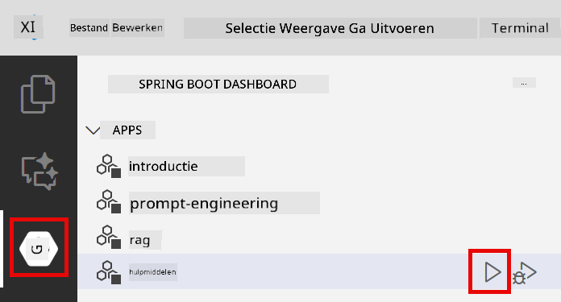
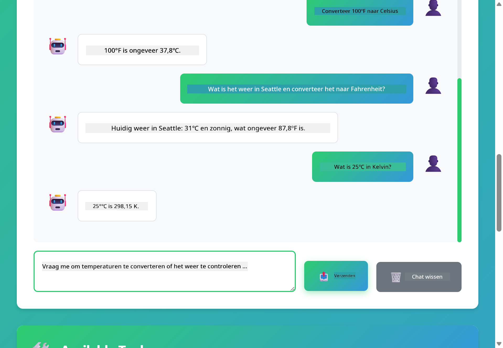

<!--
CO_OP_TRANSLATOR_METADATA:
{
  "original_hash": "aa23f106e7f53270924c9dd39c629004",
  "translation_date": "2025-12-13T19:05:27+00:00",
  "source_file": "04-tools/README.md",
  "language_code": "nl"
}
-->
# Module 04: AI-agenten met Tools

## Inhoudsopgave

- [Wat je zult leren](../../../04-tools)
- [Vereisten](../../../04-tools)
- [AI-agenten met Tools begrijpen](../../../04-tools)
- [Hoe Tool-aanroepen werken](../../../04-tools)
  - [Tooldefinities](../../../04-tools)
  - [Besluitvorming](../../../04-tools)
  - [Uitvoering](../../../04-tools)
  - [Responsgeneratie](../../../04-tools)
- [Toolketting](../../../04-tools)
- [De applicatie uitvoeren](../../../04-tools)
- [De applicatie gebruiken](../../../04-tools)
  - [Probeer eenvoudige toolgebruik](../../../04-tools)
  - [Test toolketting](../../../04-tools)
  - [Bekijk het gesprekverloop](../../../04-tools)
  - [Observeer het redeneren](../../../04-tools)
  - [Experimenteer met verschillende verzoeken](../../../04-tools)
- [Belangrijke concepten](../../../04-tools)
  - [ReAct-patroon (Redeneren en Handelen)](../../../04-tools)
  - [Toolbeschrijvingen zijn belangrijk](../../../04-tools)
  - [Sessiebeheer](../../../04-tools)
  - [Foutafhandeling](../../../04-tools)
- [Beschikbare tools](../../../04-tools)
- [Wanneer gebruik je tool-gebaseerde agenten](../../../04-tools)
- [Volgende stappen](../../../04-tools)

## Wat je zult leren

Tot nu toe heb je geleerd hoe je gesprekken met AI voert, prompts effectief structureert en antwoorden baseert op je documenten. Maar er is nog een fundamentele beperking: taalmodellen kunnen alleen tekst genereren. Ze kunnen het weer niet controleren, geen berekeningen uitvoeren, geen databases raadplegen of met externe systemen communiceren.

Tools veranderen dit. Door het model toegang te geven tot functies die het kan aanroepen, transformeer je het van een tekstgenerator naar een agent die acties kan ondernemen. Het model beslist wanneer het een tool nodig heeft, welke tool te gebruiken en welke parameters door te geven. Jouw code voert de functie uit en geeft het resultaat terug. Het model verwerkt dat resultaat in zijn antwoord.

## Vereisten

- Module 01 voltooid (Azure OpenAI-resources gedeployed)
- `.env`-bestand in de hoofdmap met Azure-gegevens (gemaakt door `azd up` in Module 01)

> **Opmerking:** Als je Module 01 nog niet hebt voltooid, volg dan eerst de deploymentinstructies daar.

## AI-agenten met Tools begrijpen

Een AI-agent met tools volgt een redeneren en handelen patroon (ReAct):

1. Gebruiker stelt een vraag
2. Agent redeneert over wat het moet weten
3. Agent beslist of het een tool nodig heeft om te antwoorden
4. Zo ja, agent roept de juiste tool aan met de juiste parameters
5. Tool voert uit en geeft data terug
6. Agent verwerkt het resultaat en geeft het definitieve antwoord


*Het ReAct-patroon - hoe AI-agenten afwisselen tussen redeneren en handelen om problemen op te lossen*

Dit gebeurt automatisch. Je definieert de tools en hun beschrijvingen. Het model regelt de besluitvorming over wanneer en hoe ze te gebruiken.

## Hoe Tool-aanroepen werken

**Tooldefinities** - [WeatherTool.java](../../../04-tools/src/main/java/com/example/langchain4j/agents/tools/WeatherTool.java) | [TemperatureTool.java](../../../04-tools/src/main/java/com/example/langchain4j/agents/tools/TemperatureTool.java)

Je definieert functies met duidelijke beschrijvingen en parameterspecificaties. Het model ziet deze beschrijvingen in zijn systeem-prompt en begrijpt wat elke tool doet.

```java
@Component
public class WeatherTool {
    
    @Tool("Get the current weather for a location")
    public String getCurrentWeather(@P("Location name") String location) {
        // Je weeropzoeklogica
        return "Weather in " + location + ": 22°C, cloudy";
    }
}

@AiService
public interface Assistant {
    String chat(@MemoryId String sessionId, @UserMessage String message);
}

// Assistent wordt automatisch verbonden door Spring Boot met:
// - ChatModel bean
// - Alle @Tool-methoden van @Component-klassen
// - ChatMemoryProvider voor sessiebeheer
```

> **🤖 Probeer met [GitHub Copilot](https://github.com/features/copilot) Chat:** Open [`WeatherTool.java`](../../../04-tools/src/main/java/com/example/langchain4j/agents/tools/WeatherTool.java) en vraag:
> - "Hoe integreer ik een echte weer-API zoals OpenWeatherMap in plaats van mockdata?"
> - "Wat maakt een goede toolbeschrijving die de AI helpt deze correct te gebruiken?"
> - "Hoe ga ik om met API-fouten en rate limits in toolimplementaties?"

**Besluitvorming**

Wanneer een gebruiker vraagt "Wat is het weer in Seattle?", herkent het model dat het de weertool nodig heeft. Het genereert een functieaanroep met de locatieparameter ingesteld op "Seattle".

**Uitvoering** - [AgentService.java](../../../04-tools/src/main/java/com/example/langchain4j/agents/service/AgentService.java)

Spring Boot verbindt automatisch de declaratieve `@AiService` interface met alle geregistreerde tools, en LangChain4j voert tool-aanroepen automatisch uit.

> **🤖 Probeer met [GitHub Copilot](https://github.com/features/copilot) Chat:** Open [`AgentService.java`](../../../04-tools/src/main/java/com/example/langchain4j/agents/service/AgentService.java) en vraag:
> - "Hoe werkt het ReAct-patroon en waarom is het effectief voor AI-agenten?"
> - "Hoe beslist de agent welke tool te gebruiken en in welke volgorde?"
> - "Wat gebeurt er als een tooluitvoering faalt - hoe moet ik fouten robuust afhandelen?"

**Responsgeneratie**

Het model ontvangt de weerdata en formatteert deze in een natuurlijk taalantwoord voor de gebruiker.

### Waarom declaratieve AI-services gebruiken?

Deze module gebruikt LangChain4j's Spring Boot-integratie met declaratieve `@AiService` interfaces:

- **Spring Boot auto-wiring** - ChatModel en tools worden automatisch geïnjecteerd
- **@MemoryId-patroon** - Automatisch sessie-gebaseerd geheugenbeheer
- **Enkele instantie** - Assistent wordt één keer gemaakt en hergebruikt voor betere prestaties
- **Type-veilige uitvoering** - Java-methoden worden direct aangeroepen met typeconversie
- **Multi-turn orkestratie** - Behandelt toolketting automatisch
- **Zero boilerplate** - Geen handmatige AiServices.builder() aanroepen of geheugen-HashMap

Alternatieve benaderingen (handmatige `AiServices.builder()`) vereisen meer code en missen de voordelen van Spring Boot-integratie.

## Toolketting

**Toolketting** - De AI kan meerdere tools achtereenvolgens aanroepen. Vraag "Wat is het weer in Seattle en moet ik een paraplu meenemen?" en zie hoe het `getCurrentWeather` aanroept met redenering over regenuitrusting.

<a href="images/tool-chaining.png"></a>

*Opeenvolgende tool-aanroepen - de output van de ene tool voedt de volgende beslissing*

**Graceful Failures** - Vraag het weer op in een stad die niet in de mockdata staat. De tool geeft een foutmelding terug en de AI legt uit dat het niet kan helpen. Tools falen veilig.

Dit gebeurt in één gespreksronde. De agent orkestreert meerdere tool-aanroepen autonoom.

## De applicatie uitvoeren

**Controleer deployment:**

Zorg dat het `.env`-bestand in de hoofdmap bestaat met Azure-gegevens (gemaakt tijdens Module 01):
```bash
cat ../.env  # Moet AZURE_OPENAI_ENDPOINT, API_KEY, DEPLOYMENT tonen
```

**Start de applicatie:**

> **Opmerking:** Als je alle applicaties al gestart hebt met `./start-all.sh` uit Module 01, draait deze module al op poort 8084. Je kunt de startcommando's hieronder overslaan en direct naar http://localhost:8084 gaan.

**Optie 1: Gebruik Spring Boot Dashboard (aanbevolen voor VS Code-gebruikers)**

De devcontainer bevat de Spring Boot Dashboard-extensie, die een visuele interface biedt om alle Spring Boot-applicaties te beheren. Je vindt deze in de Activiteitenbalk aan de linkerkant van VS Code (zoek het Spring Boot-icoon).

Vanuit het Spring Boot Dashboard kun je:
- Alle beschikbare Spring Boot-applicaties in de workspace zien
- Applicaties starten/stoppen met één klik
- Applicatielogs realtime bekijken
- Applicatiestatus monitoren

Klik simpelweg op de play-knop naast "tools" om deze module te starten, of start alle modules tegelijk.



**Optie 2: Gebruik shell-scripts**

Start alle webapplicaties (modules 01-04):

**Bash:**
```bash
cd ..  # Vanuit de hoofdmap
./start-all.sh
```

**PowerShell:**
```powershell
cd ..  # Vanuit de hoofdmap
.\start-all.ps1
```

Of start alleen deze module:

**Bash:**
```bash
cd 04-tools
./start.sh
```

**PowerShell:**
```powershell
cd 04-tools
.\start.ps1
```

Beide scripts laden automatisch omgevingsvariabelen uit het `.env`-bestand in de hoofdmap en bouwen de JARs als die nog niet bestaan.

> **Opmerking:** Als je alle modules handmatig wilt bouwen voor het starten:
>
> **Bash:**
> ```bash
> cd ..  # Go to root directory
> mvn clean package -DskipTests
> ```
>
> **PowerShell:**
> ```powershell
> cd ..  # Go to root directory
> mvn clean package -DskipTests
> ```

Open http://localhost:8084 in je browser.

**Om te stoppen:**

**Bash:**
```bash
./stop.sh  # Alleen deze module
# Of
cd .. && ./stop-all.sh  # Alle modules
```

**PowerShell:**
```powershell
.\stop.ps1  # Alleen deze module
# Of
cd ..; .\stop-all.ps1  # Alle modules
```

## De applicatie gebruiken

De applicatie biedt een webinterface waar je kunt communiceren met een AI-agent die toegang heeft tot weer- en temperatuurconversietools.

<a href="images/tools-homepage.png"></a>

*De AI Agent Tools-interface - snelle voorbeelden en chatinterface om met tools te interacteren*

**Probeer eenvoudige toolgebruik**

Begin met een eenvoudige vraag: "Converteer 100 graden Fahrenheit naar Celsius". De agent herkent dat het de temperatuurconversietool nodig heeft, roept deze aan met de juiste parameters en geeft het resultaat terug. Merk op hoe natuurlijk dit aanvoelt - je hebt niet gespecificeerd welke tool te gebruiken of hoe deze aan te roepen.

**Test toolketting**

Probeer nu iets complexers: "Wat is het weer in Seattle en converteer het naar Fahrenheit?" Kijk hoe de agent dit in stappen afhandelt. Eerst haalt het het weer op (dat Celsius teruggeeft), herkent dat het naar Fahrenheit moet converteren, roept de conversietool aan en combineert beide resultaten in één antwoord.

**Bekijk het gesprekverloop**

De chatinterface bewaart de gespreksgeschiedenis, zodat je multi-turn interacties kunt voeren. Je ziet alle eerdere vragen en antwoorden, wat het makkelijk maakt het gesprek te volgen en te begrijpen hoe de agent context opbouwt over meerdere uitwisselingen.

<a href="images/tools-conversation-demo.png"></a>

*Multi-turn gesprek met eenvoudige conversies, weeropvragingen en toolketting*

**Experimenteer met verschillende verzoeken**

Probeer diverse combinaties:
- Weeropvragingen: "Wat is het weer in Tokio?"
- Temperatuurconversies: "Wat is 25°C in Kelvin?"
- Gecombineerde vragen: "Check het weer in Parijs en vertel me of het boven de 20°C is"

Merk op hoe de agent natuurlijke taal interpreteert en omzet in passende tool-aanroepen.

## Belangrijke concepten

**ReAct-patroon (Redeneren en Handelen)**

De agent wisselt af tussen redeneren (beslissen wat te doen) en handelen (tools gebruiken). Dit patroon maakt autonome probleemoplossing mogelijk in plaats van alleen reageren op instructies.

**Toolbeschrijvingen zijn belangrijk**

De kwaliteit van je toolbeschrijvingen beïnvloedt direct hoe goed de agent ze gebruikt. Duidelijke, specifieke beschrijvingen helpen het model te begrijpen wanneer en hoe elke tool aan te roepen.

**Sessiebeheer**

De `@MemoryId`-annotatie maakt automatisch sessie-gebaseerd geheugenbeheer mogelijk. Elke sessie-ID krijgt een eigen `ChatMemory`-instantie beheerd door de `ChatMemoryProvider` bean, waardoor handmatige geheugentracking overbodig is.

**Foutafhandeling**

Tools kunnen falen - API's kunnen time-outs geven, parameters kunnen ongeldig zijn, externe services kunnen uitvallen. Productie-agenten hebben foutafhandeling nodig zodat het model problemen kan uitleggen of alternatieven kan proberen.

## Beschikbare tools

**Weertools** (mockdata voor demonstratie):
- Huidig weer ophalen voor een locatie
- Meerdaagse voorspelling ophalen

**Temperatuurconversietools**:
- Celsius naar Fahrenheit
- Fahrenheit naar Celsius
- Celsius naar Kelvin
- Kelvin naar Celsius
- Fahrenheit naar Kelvin
- Kelvin naar Fahrenheit

Dit zijn eenvoudige voorbeelden, maar het patroon is toepasbaar op elke functie: databasequeries, API-aanroepen, berekeningen, bestandsbewerkingen of systeemcommando's.

## Wanneer gebruik je tool-gebaseerde agenten

**Gebruik tools wanneer:**
- Antwoorden real-time data vereisen (weer, aandelenkoersen, voorraad)
- Je berekeningen moet uitvoeren die verder gaan dan simpele wiskunde
- Toegang tot databases of API's nodig is
- Acties moeten worden ondernomen (e-mails verzenden, tickets aanmaken, records bijwerken)
- Meerdere databronnen gecombineerd moeten worden

**Gebruik geen tools wanneer:**
- Vragen beantwoord kunnen worden uit algemene kennis
- Het antwoord puur conversatiegericht is
- Tool-latentie de ervaring te traag maakt

## Volgende stappen

**Volgende module:** [05-mcp - Model Context Protocol (MCP)](../05-mcp/README.md)

---

**Navigatie:** [← Vorige: Module 03 - RAG](../03-rag/README.md) | [Terug naar hoofdmenu](../README.md) | [Volgende: Module 05 - MCP →](../05-mcp/README.md)

---

<!-- CO-OP TRANSLATOR DISCLAIMER START -->
**Disclaimer**:  
Dit document is vertaald met behulp van de AI-vertalingsdienst [Co-op Translator](https://github.com/Azure/co-op-translator). Hoewel we streven naar nauwkeurigheid, dient u er rekening mee te houden dat geautomatiseerde vertalingen fouten of onnauwkeurigheden kunnen bevatten. Het originele document in de oorspronkelijke taal moet als de gezaghebbende bron worden beschouwd. Voor cruciale informatie wordt professionele menselijke vertaling aanbevolen. Wij zijn niet aansprakelijk voor eventuele misverstanden of verkeerde interpretaties die voortvloeien uit het gebruik van deze vertaling.
<!-- CO-OP TRANSLATOR DISCLAIMER END -->