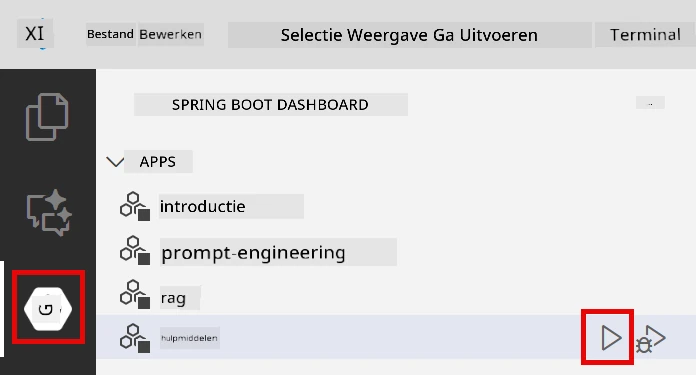
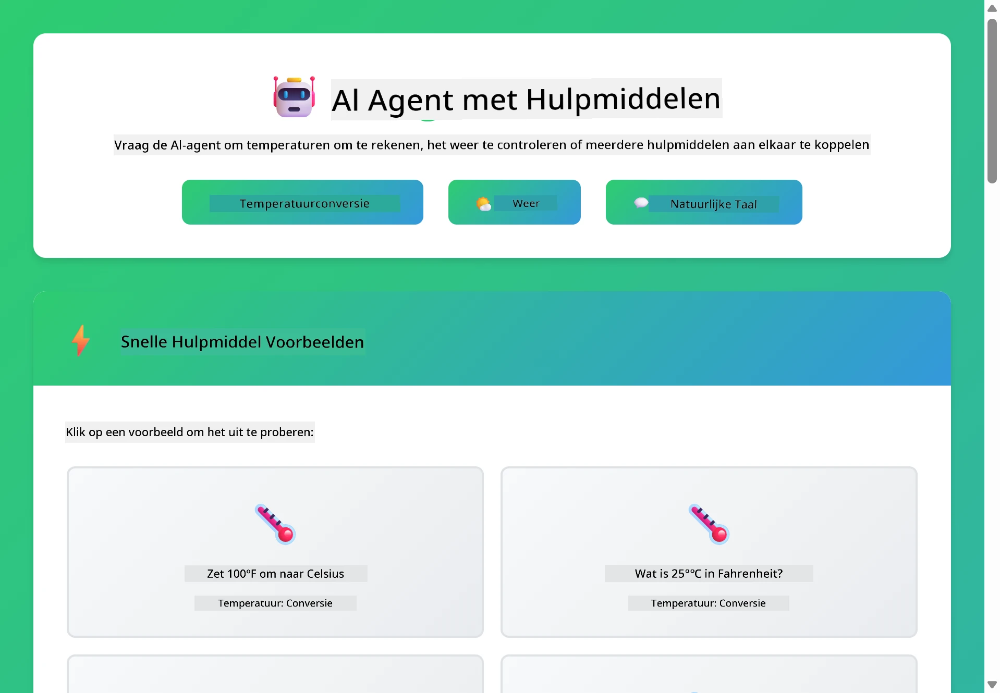
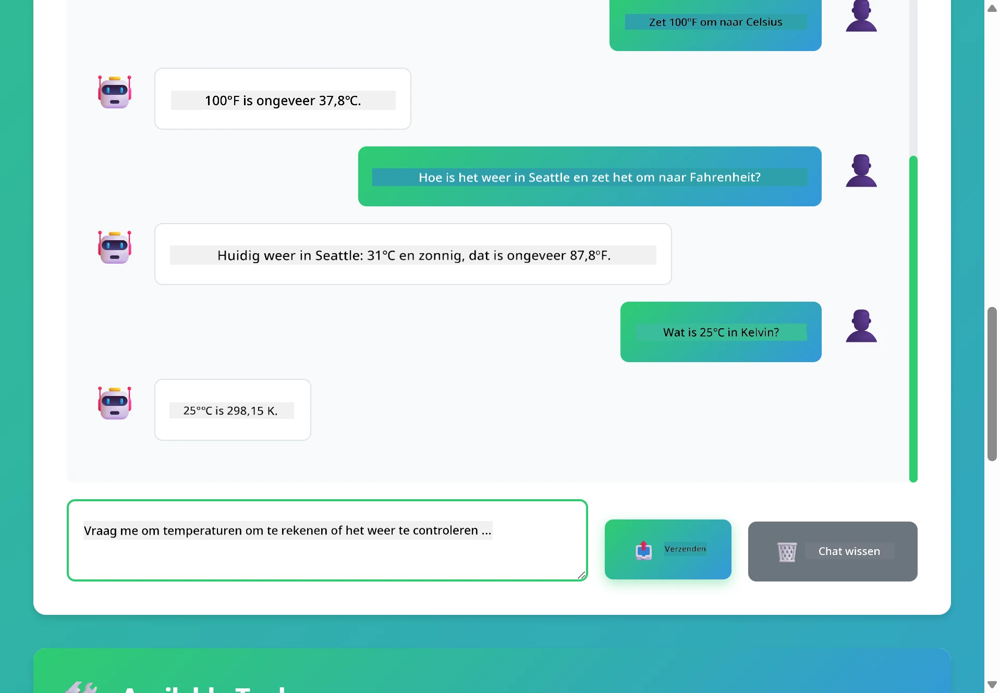

# Module 04: AI-agenten met Tools

## Inhoudsopgave

- [Video Walkthrough](#video-walkthrough)
- [Wat je zult leren](#wat-je-zult-leren)
- [Vereisten](#vereisten)
- [Begrip van AI-agenten met Tools](#begrip-van-ai-agenten-met-tools)
- [Hoe Tool Calling Werkt](#hoe-tool-calling-werkt)
  - [Tooldefinities](#tooldefinities)
  - [Besluitvorming](#besluitvorming)
  - [Uitvoering](#uitvoering)
  - [Responsegeneratie](#responsegeneratie)
  - [Architectuur: Spring Boot Auto-Wiring](#architectuur-spring-boot-auto-wiring)
- [Tool Chaining](#tool-chaining)
- [De Applicatie Uitvoeren](#de-applicatie-uitvoeren)
- [Gebruik van de Applicatie](#gebruik-van-de-applicatie)
  - [Probeer simpele toolgebruik](#probeer-simpele-toolgebruik)
  - [Test tool chaining](#test-tool-koppeling)
  - [Bekijk het gesprekverloop](#bekijk-het-gesprekverloop)
  - [Experimenteer met verschillende verzoeken](#experimenteer-met-verschillende-verzoeken)
- [Belangrijke Concepten](#belangrijke-concepten)
  - [ReAct-patroon (Redeneren en Handelen)](#react-patroon-redeneren-en-handelen)
  - [Beschrijvingen van Tools zijn Belangrijk](#beschrijvingen-van-tools-zijn-belangrijk)
  - [Sessiebeheer](#sessiebeheer)
  - [Foutenafhandeling](#foutenafhandeling)
- [Beschikbare Tools](#beschikbare-tools)
- [Wanneer te Gebruiken Tool-gebaseerde Agenten](#wanneer-te-gebruiken-tool-gebaseerde-agenten)
- [Tools vs RAG](#tools-versus-rag)
- [Volgende Stappen](#volgende-stappen)

## Video Walkthrough

Bekijk deze live sessie die uitlegt hoe je aan de slag gaat met deze module:

<a href="https://www.youtube.com/watch?v=O_J30kZc0rw"></a>

## Wat je zult leren

Tot nu toe heb je geleerd hoe je gesprekken voert met AI, prompts effectief structureert en antwoorden baseert op jouw documenten. Maar er is nog een fundamentele beperking: taalmodellen kunnen alleen tekst genereren. Ze kunnen het weer niet checken, geen berekeningen uitvoeren, geen databases bevragen of interacteren met externe systemen.

Tools veranderen dit. Door het model toegang te geven tot functies die het kan aanroepen, verander je het van een tekstgenerator in een agent die acties kan ondernemen. Het model besluit wanneer het een tool nodig heeft, welke tool te gebruiken en welke parameters te geven. Jouw code voert de functie uit en retourneert het resultaat. Het model verwerkt dat resultaat in zijn antwoord.

## Vereisten

- Voltooide [Module 01 - Introductie](../01-introduction/README.md) (Azure OpenAI-resources gedeployed)
- Voltooide vorige modules aanbevolen (deze module verwijst naar [RAG-concepten uit Module 03](../03-rag/README.md) in de vergelijking Tools vs RAG)
- `.env` bestand in de rootmap met Azure-gegevens (aangemaakt door `azd up` in Module 01)

> **Opmerking:** Als je Module 01 niet hebt voltooid, volg dan eerst de deploymentinstructies daar.

## Begrip van AI-agenten met Tools

> **📝 Opmerking:** De term "agenten" in deze module verwijst naar AI-assistenten die zijn uitgebreid met tool-aanroep-mogelijkheden. Dit is anders dan de **Agentic AI** patronen (autonome agenten met planning, geheugen en meerstaps redenering) die we behandelen in [Module 05: MCP](../05-mcp/README.md).

Zonder tools kan een taalmodel alleen tekst genereren uit zijn trainingsdata. Vraag het om het huidige weer, en het moet raden. Geef het tools, en het kan een weer-API aanroepen, berekeningen uitvoeren of een database raadplegen – en die echte resultaten verwerken in zijn antwoord.


*Zonder tools kan het model alleen gokken – met tools kan het API’s aanroepen, berekeningen uitvoeren en realtime data retourneren.*

Een AI-agent met tools volgt een **Redeneren en Handelen (ReAct)** patroon. Het model reageert niet alleen — het denkt na over wat het nodig heeft, handelt door een tool aan te roepen, observeert het resultaat, en beslist dan of het opnieuw moet handelen of het finale antwoord geeft:

1. **Redeneer** — De agent analyseert de vraag van de gebruiker en bepaalt welke informatie het nodig heeft
2. **Handel** — De agent kiest de juiste tool, genereert correcte parameters en roept deze aan
3. **Observeer** — De agent ontvangt de output van de tool en evalueert het resultaat
4. **Herhaal of Reageer** — Als meer data nodig is, herhaalt de agent; anders stelt het een natuurlijk antwoord samen


*De ReAct-cyclus — de agent redeneert over wat te doen, handelt door een tool aan te roepen, observeert het resultaat, en herhaalt totdat het het uiteindelijke antwoord kan geven.*

Dit gebeurt automatisch. Jij definieert de tools en hun beschrijvingen. Het model bepaalt wanneer en hoe ze te gebruiken.

## Hoe Tool Calling Werkt

### Tooldefinities

[WeatherTool.java](../../../04-tools/src/main/java/com/example/langchain4j/agents/tools/WeatherTool.java) | [TemperatureTool.java](../../../04-tools/src/main/java/com/example/langchain4j/agents/tools/TemperatureTool.java)

Je definieert functies met duidelijke beschrijvingen en parameterspecificaties. Het model ziet deze beschrijvingen in zijn systeem-prompt en begrijpt wat elke tool doet.

```java
@Component
public class WeatherTool {
    
    @Tool("Get the current weather for a location")
    public String getCurrentWeather(@P("Location name") String location) {
        // Je weeropzoeklogica
        return "Weather in " + location + ": 22°C, cloudy";
    }
}

@AiService
public interface Assistant {
    String chat(@MemoryId String sessionId, @UserMessage String message);
}

// Assistant is automatisch verbonden door Spring Boot met:
// - ChatModel bean
// - Alle @Tool-methoden van @Component-klassen
// - ChatMemoryProvider voor sessiebeheer
```

Het onderstaande diagram breekt elke annotatie af en laat zien hoe elk onderdeel de AI helpt begrijpen wanneer de tool aan te roepen en welke argumenten mee te geven:


*Anatomie van een tooldefinitie — @Tool vertelt de AI wanneer het te gebruiken, @P beschrijft elke parameter, en @AiService verbindt alles bij de start.*

> **🤖 Probeer met [GitHub Copilot](https://github.com/features/copilot) Chat:** Open [`WeatherTool.java`](../../../04-tools/src/main/java/com/example/langchain4j/agents/tools/WeatherTool.java) en vraag:
> - "Hoe integreer ik een echte weer-API zoals OpenWeatherMap in plaats van mock-gegevens?"
> - "Wat maakt een goede toolbeschrijving die de AI helpt het correct te gebruiken?"
> - "Hoe behandel ik API-fouten en ratelimieten in toolimplementaties?"

### Besluitvorming

Wanneer een gebruiker vraagt "Wat is het weer in Seattle?", kiest het model niet willekeurig een tool. Het vergelijkt de intentie van de gebruiker met elke toolbeschrijving waar het toegang toe heeft, scoort ze op relevantie, en selecteert de beste match. Vervolgens genereert het een gestructureerde functieroep met de juiste parameters – in dit geval `location` op `"Seattle"` gezet.

Als geen enkele tool bij het verzoek past, valt het model terug op kennis uit eigen database. Als er meerdere tools passen, kiest het de meest specifieke.


*Het model evalueert elke beschikbare tool op basis van de intentie van de gebruiker en selecteert de beste match — daarom zijn duidelijke, specifieke toolbeschrijvingen belangrijk.*

### Uitvoering

[AgentService.java](../../../04-tools/src/main/java/com/example/langchain4j/agents/service/AgentService.java)

Spring Boot auto-wiret de declaratieve `@AiService` interface met alle geregistreerde tools, en LangChain4j voert tool-aanroepen automatisch uit. Achter de schermen verloopt een volledige tool-aanroep via zes stadia — van de natuurlijke taalvraag van de gebruiker tot een natuurlijk taalantwoord:


*De end-to-end flow — de gebruiker stelt een vraag, het model selecteert een tool, LangChain4j voert deze uit, en het model verweeft het resultaat in een natuurlijk antwoord.*

Achter de schermen voert `AiServices` dezelfde tool-aanroep lus voor elke tool uit — hier geïllustreerd met een simpele `Calculator`. Het onderstaande sequentiediagram laat precies zien wat er onderhuids gebeurt:


*De tool-aanroep lus — `AiServices` stuurt jouw bericht en toolschema’s naar de LLM, de LLM antwoordt met een functieroep zoals `add(42, 58)`, LangChain4j voert de `Calculator` methode lokaal uit, en geeft het resultaat terug voor het finale antwoord.*

> **🤖 Probeer met [GitHub Copilot](https://github.com/features/copilot) Chat:** Open [`AgentService.java`](../../../04-tools/src/main/java/com/example/langchain4j/agents/service/AgentService.java) en vraag:
> - "Hoe werkt het ReAct-patroon en waarom is het effectief voor AI-agenten?"
> - "Hoe beslist de agent welke tool te gebruiken en in welke volgorde?"
> - "Wat gebeurt er als een tool-uitvoering faalt - hoe behandel ik fouten robuust?"

### Responsegeneratie

Het model ontvangt de weerdata en formatteert het tot een natuurlijk taalantwoord aan de gebruiker.

### Architectuur: Spring Boot Auto-Wiring

Deze module gebruikt LangChain4j’s Spring Boot-integratie met declaratieve `@AiService` interfaces. Bij het opstarten ontdekt Spring Boot elke `@Component` met `@Tool`-methoden, jouw `ChatModel` bean en de `ChatMemoryProvider` — en verbindt ze allemaal in één `Assistant` interface zonder boilerplate.


*De @AiService interface verbindt ChatModel, toolcomponenten en memory provider — Spring Boot regelt alle wiring automatisch.*

Hier is de volledige request lifecycle als sequentiediagram — van de HTTP-aanvraag via controller, service, en auto-wired proxy tot aan de tooluitvoering en terug:


*De complete Spring Boot request lifecycle — HTTP-verzoek stroomt via controller en service naar de auto-wired Assistant proxy, die de LLM- en tool-aanroepen automatisch orkestreert.*

Belangrijke voordelen van deze aanpak:

- **Spring Boot auto-wiring** — ChatModel en tools automatisch geïnjecteerd
- **@MemoryId-patroon** — Automatisch sessiegebaseerd geheugenbeheer
- **Enkele instantie** — Assistant wordt één keer gemaakt en hergebruikt voor betere prestaties
- **Type-veilige uitvoering** — Java-methoden worden direct aangeroepen met typeconversie
- **Multi-turn orkestratie** — Handelt tool chaining automatisch af
- **Zero boilerplate** — Geen handmatige `AiServices.builder()` aanroepen of geheugen HashMap

Alternatieve benaderingen (handmatige `AiServices.builder()`) vergen meer code en missen de voordelen van Spring Boot-integratie.

## Tool Chaining

**Tool chaining** — De echte kracht van tool-gebaseerde agenten blijkt wanneer een enkele vraag meerdere tools vereist. Vraag "Wat is het weer in Seattle in Fahrenheit?" en de agent schakelt automatisch twee tools aan: eerst roept hij `getCurrentWeather` aan om de temperatuur in Celsius op te halen, daarna geeft hij die waarde door aan `celsiusToFahrenheit` voor conversie — alles in één gespreksturn.


*Tool chaining in actie — de agent roept eerst getCurrentWeather aan, geeft het Celsius-resultaat door aan celsiusToFahrenheit, en levert een gecombineerd antwoord.*

**Graceful Failures** — Vraag naar het weer in een stad die niet in de mockdata staat. De tool retourneert een foutmelding, en de AI legt uit dat het niet kan helpen in plaats van te crashen. Tools falen veilig. Het onderstaande diagram toont het verschil tussen beide benaderingen — met correcte foutenafhandeling vangt de agent de exceptie op en reageert behulpzaam, zonder daarvan crasht de hele applicatie:


*Wanneer een tool faalt, vangt de agent de fout op en reageert met een behulpzame uitleg in plaats van te crashen.*

Dit gebeurt in één gespreksturn. De agent orkestreert meerdere tool-aanroepen autonoom.

## De Applicatie Uitvoeren

**Controleer deployment:**

Zorg dat het `.env` bestand aanwezig is in de rootmap met Azure-gegevens (aangemaakt tijdens Module 01). Voer dit uit vanuit de modulemap (`04-tools/`):

**Bash:**
```bash
cat ../.env  # Moet AZURE_OPENAI_ENDPOINT, API_KEY, DEPLOYMENT weergeven
```

**PowerShell:**
```powershell
Get-Content ..\.env  # Zou AZURE_OPENAI_ENDPOINT, API_SLEUTEL, IMPLEMENTATIE moeten tonen
```

**Start de applicatie:**

> **Opmerking:** Als je al alle applicaties hebt gestart met `./start-all.sh` vanuit de rootmap (zoals beschreven in Module 01), draait deze module al op poort 8084. Je kunt onderstaande startcommando’s overslaan en direct naar http://localhost:8084 gaan.

**Optie 1: Gebruik Spring Boot Dashboard (aanbevolen voor VS Code-gebruikers)**

De dev container bevat de Spring Boot Dashboard extensie, die een visuele interface biedt om alle Spring Boot-applicaties te beheren. Je vindt het in de Activity Bar links in VS Code (zoek naar het Spring Boot-icoon).

Vanaf het Spring Boot Dashboard kun je:
- Alle beschikbare Spring Boot-applicaties in de workspace zien
- Applicaties starten/stoppen met één klik
- Applicatielogs in realtime bekijken
- Applicatiestatus monitoren

Klik gewoon op de afspeelknop naast "tools" om deze module te starten, of start alle modules tegelijk.

Zo ziet het Spring Boot Dashboard eruit in VS Code:


*Het Spring Boot Dashboard in VS Code — start, stop en beheer alle modules vanaf één plek*

**Optie 2: Shell-scripts gebruiken**

Start alle webapplicaties (modules 01-04):

**Bash:**
```bash
cd ..  # Vanuit de root directory
./start-all.sh
```

**PowerShell:**
```powershell
cd ..  # Vanuit de hoofdmap
.\start-all.ps1
```

Of start alleen deze module:

**Bash:**
```bash
cd 04-tools
./start.sh
```

**PowerShell:**
```powershell
cd 04-tools
.\start.ps1
```

Beide scripts laden automatisch omgeving variabelen uit het root `.env`-bestand en bouwen de JARs als ze niet bestaan.

> **Opmerking:** Als je alle modules liever handmatig bouwt voordat je ze start:
>
> **Bash:**
> ```bash
> cd ..  # Go to root directory
> mvn clean package -DskipTests
> ```
>
> **PowerShell:**
> ```powershell
> cd ..  # Go to root directory
> mvn clean package -DskipTests
> ```

Open http://localhost:8084 in je browser.

**Om te stoppen:**

**Bash:**
```bash
./stop.sh  # Alleen deze module
# Of
cd .. && ./stop-all.sh  # Alle modules
```

**PowerShell:**
```powershell
.\stop.ps1  # Alleen deze module
# Of
cd ..; .\stop-all.ps1  # Alle modules
```

## De Applicatie Gebruiken

De applicatie biedt een webinterface waar je kunt communiceren met een AI-agent die toegang heeft tot weer- en temperatuurconversietools. Zo ziet de interface eruit — met snelstartvoorbeelden en een chatpaneel om verzoeken te verzenden:

<a href="images/tools-homepage.png"></a>

*De AI Agent Tools-interface - snelle voorbeelden en chatinterface voor interactie met tools*

### Probeer Eenvoudig Toolgebruik

Begin met een eenvoudige opdracht: "Converteer 100 graden Fahrenheit naar Celsius". De agent herkent dat hij de temperatuurconversietool nodig heeft, roept deze op met de juiste parameters en retourneert het resultaat. Merk op hoe natuurlijk dit aanvoelt - je hoefde niet aan te geven welke tool te gebruiken of hoe die aan te roepen.

### Test Tool Koppeling

Probeer nu iets complexers: "Wat is het weer in Seattle en converteer het naar Fahrenheit?" Kijk hoe de agent dit in stappen uitwerkt. Eerst haalt hij het weer op (wat Celsius teruggeeft), herkent dat het moet worden omgezet naar Fahrenheit, roept de conversietool aan en combineert beide resultaten in één antwoord.

### Zie Het Gespreksverloop

De chatinterface bewaart de geschiedenis van het gesprek, waardoor je meerdere beurten kunt voeren. Je ziet alle eerdere vragen en antwoorden, wat het makkelijk maakt het gesprek te volgen en te begrijpen hoe de agent context opbouwt over meerdere uitwisselingen.

<a href="images/tools-conversation-demo.png"></a>

*Meerdere beurten gesprek met eenvoudige conversies, weeropvragingen en toolkoppelingen*

### Experimenteer met Verschillende Verzoeken

Probeer verschillende combinaties:
- Weeropvragingen: "Wat is het weer in Tokio?"
- Temperatuurconversies: "Wat is 25°C in Kelvin?"
- Gecombineerde vragen: "Check het weer in Parijs en vertel me of het boven de 20°C is"

Let op hoe de agent natuurlijke taal interpreteert en vertaalt naar passende tool-aanroepen.

## Belangrijke Concepten

### ReAct-patroon (Redeneren en Handelen)

De agent wisselt af tussen redeneren (beslissen wat te doen) en handelen (tools gebruiken). Dit patroon maakt autonome probleemoplossing mogelijk in plaats van alleen reageren op opdrachten.

### Toolbeschrijvingen Zijn Belangrijk

De kwaliteit van je toolbeschrijvingen beïnvloedt direct hoe goed de agent ze gebruikt. Duidelijke, specifieke beschrijvingen helpen het model te begrijpen wanneer en hoe elke tool aan te roepen.

### Sessiebeheer

De `@MemoryId`-annotatie maakt automatische sessiegebaseerde geheugenbeheer mogelijk. Elke sessie-ID krijgt een eigen `ChatMemory`-instantie beheerd door de `ChatMemoryProvider` bean, zodat meerdere gebruikers tegelijk met de agent kunnen communiceren zonder dat hun gesprekken in elkaar overlopen. Het volgende diagram toont hoe meerdere gebruikers worden gerouteerd naar geïsoleerde geheugenopslag gebaseerd op hun sessie-IDs:


*Elke sessie-ID correspondeert met een geïsoleerde gesprekshistorie — gebruikers zien nooit elkaars berichten.*

### Foutafhandeling

Tools kunnen falen — API’s kunnen time-outs geven, parameters kunnen ongeldig zijn, externe diensten kunnen uitvallen. Productie-agents hebben foutafhandeling nodig zodat het model problemen kan uitleggen of alternatieven kan proberen in plaats van de hele applicatie te laten crashen. Wanneer een tool een uitzondering gooit, vangt LangChain4j die op en geeft het foutbericht terug aan het model, dat vervolgens het probleem in natuurlijke taal kan uitleggen.

## Beschikbare Tools

Het onderstaande diagram toont het brede ecosysteem van tools die je kunt bouwen. Deze module demonstreert weer- en temperatuurtools, maar hetzelfde `@Tool` patroon werkt voor elke Java-methode — van databasequeries tot betalingsverwerking.


*Elke Java-methode geannoteerd met @Tool wordt beschikbaar voor de AI — het patroon breidt zich uit naar databases, API’s, e-mail, bestandsoperaties en meer.*

## Wanneer Gebruik Je Tool-gebaseerde Agents

Niet elk verzoek heeft tools nodig. De beslissing hangt af van of de AI met externe systemen moet communiceren of de vraag uit zijn eigen kennis kan beantwoorden. De volgende gids vat samen wanneer tools waarde toevoegen en wanneer ze onnodig zijn:


*Een snelle beslissingsgids — tools zijn voor realtime data, berekeningen en acties; algemene kennis en creatieve taken hebben ze niet nodig.*

## Tools versus RAG

Modules 03 en 04 breiden beiden uit wat de AI kan, maar op fundamenteel verschillende manieren. RAG geeft het model toegang tot **kennis** door documenten op te halen. Tools geven het model de mogelijkheid om **acties** uit te voeren door functies aan te roepen. Het onderstaande diagram vergelijkt deze twee benaderingen naast elkaar — van hoe elke workflow werkt tot de voor- en nadelen:


*RAG haalt informatie op uit statische documenten — Tools voeren acties uit en halen dynamische, realtime data op. Veel productiesystemen combineren beide.*

In de praktijk combineren veel productiesystemen beide benaderingen: RAG voor het onderbouwen van antwoorden met je documentatie, en Tools om live data op te halen of bewerkingen uit te voeren.

## Volgende Stappen

**Volgende Module:** [05-mcp - Model Context Protocol (MCP)](../05-mcp/README.md)

---

**Navigatie:** [← Vorige: Module 03 - RAG](../03-rag/README.md) | [Terug naar Begin](../README.md) | [Volgende: Module 05 - MCP →](../05-mcp/README.md)

---

<!-- CO-OP TRANSLATOR DISCLAIMER START -->
**Disclaimer**:
Dit document is vertaald met behulp van de AI vertaaldienst [Co-op Translator](https://github.com/Azure/co-op-translator). Hoewel we streven naar nauwkeurigheid, dient u er rekening mee te houden dat geautomatiseerde vertalingen fouten of onnauwkeurigheden kunnen bevatten. Het originele document in de oorspronkelijke taal moet worden beschouwd als de gezaghebbende bron. Voor kritieke informatie wordt professionele menselijke vertaling aanbevolen. Wij zijn niet aansprakelijk voor eventuele misverstanden of verkeerde interpretaties die voortvloeien uit het gebruik van deze vertaling.
<!-- CO-OP TRANSLATOR DISCLAIMER END -->