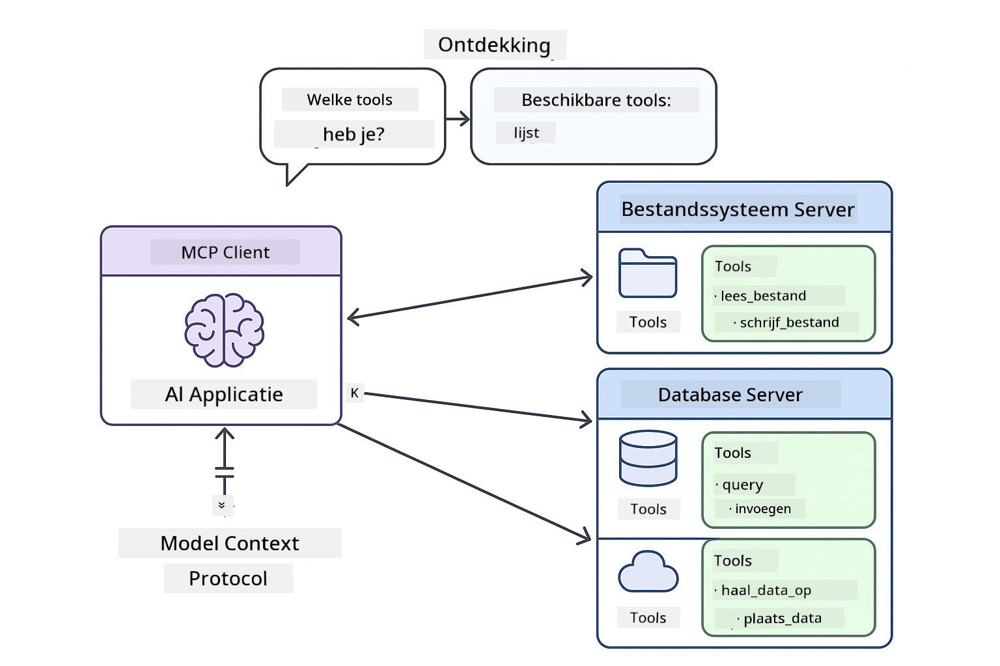

<!--
CO_OP_TRANSLATOR_METADATA:
{
  "original_hash": "c25ec1f10ef156c53e190cdf8b0711ab",
  "translation_date": "2025-12-13T17:57:29+00:00",
  "source_file": "05-mcp/README.md",
  "language_code": "nl"
}
-->
# Module 05: Model Context Protocol (MCP)

## Inhoudsopgave

- [Wat je zult leren](../../../05-mcp)
- [MCP begrijpen](../../../05-mcp)
- [Hoe MCP werkt](../../../05-mcp)
  - [Server-Client Architectuur](../../../05-mcp)
  - [Tool Discovery](../../../05-mcp)
  - [Transportmechanismen](../../../05-mcp)
- [Vereisten](../../../05-mcp)
- [Wat deze module behandelt](../../../05-mcp)
- [Snel aan de slag](../../../05-mcp)
  - [Voorbeeld 1: Remote Calculator (Streamable HTTP)](../../../05-mcp)
  - [Voorbeeld 2: Bestandsbewerkingen (Stdio)](../../../05-mcp)
  - [Voorbeeld 3: Git-analyse (Docker)](../../../05-mcp)
- [Belangrijke concepten](../../../05-mcp)
  - [Transportselectie](../../../05-mcp)
  - [Tool Discovery](../../../05-mcp)
  - [Sessiebeheer](../../../05-mcp)
  - [Cross-platform overwegingen](../../../05-mcp)
- [Wanneer MCP te gebruiken](../../../05-mcp)
- [MCP-ecosysteem](../../../05-mcp)
- [Gefeliciteerd!](../../../05-mcp)
  - [Wat nu?](../../../05-mcp)
- [Probleemoplossing](../../../05-mcp)

## Wat je zult leren

Je hebt conversatie-AI gebouwd, prompts beheerst, antwoorden gebaseerd op documenten en agents met tools gemaakt. Maar al die tools waren op maat gemaakt voor jouw specifieke toepassing. Wat als je je AI toegang kon geven tot een gestandaardiseerd ecosysteem van tools die iedereen kan maken en delen?

Het Model Context Protocol (MCP) biedt precies dat - een standaardmanier voor AI-toepassingen om externe tools te ontdekken en te gebruiken. In plaats van voor elke databron of service aangepaste integraties te schrijven, verbind je met MCP-servers die hun mogelijkheden in een consistent formaat blootstellen. Je AI-agent kan deze tools dan automatisch ontdekken en gebruiken.


*Voor MCP: complexe punt-tot-punt integraties. Na MCP: één protocol, eindeloze mogelijkheden.*

## MCP begrijpen

MCP lost een fundamenteel probleem op in AI-ontwikkeling: elke integratie is maatwerk. Wil je toegang tot GitHub? Maatwerkcode. Wil je bestanden lezen? Maatwerkcode. Wil je een database bevragen? Maatwerkcode. En geen van deze integraties werkt met andere AI-toepassingen.

MCP standaardiseert dit. Een MCP-server stelt tools beschikbaar met duidelijke beschrijvingen en schema's. Elke MCP-client kan verbinden, beschikbare tools ontdekken en gebruiken. Eén keer bouwen, overal gebruiken.



*Model Context Protocol architectuur - gestandaardiseerde tool discovery en uitvoering*

## Hoe MCP werkt

**Server-Client Architectuur**

MCP gebruikt een client-server model. Servers bieden tools aan - bestanden lezen, databases bevragen, API's aanroepen. Clients (jouw AI-toepassing) verbinden met servers en gebruiken hun tools.

**Tool Discovery**

Wanneer je client verbinding maakt met een MCP-server, vraagt die: "Welke tools heb je?" De server reageert met een lijst van beschikbare tools, elk met beschrijvingen en parameterschema's. Je AI-agent kan dan beslissen welke tools te gebruiken op basis van gebruikersverzoeken.

**Transportmechanismen**

MCP definieert twee transportmechanismen: HTTP voor remote servers, Stdio voor lokale processen (inclusief Docker-containers):


*MCP transportmechanismen: HTTP voor remote servers, Stdio voor lokale processen (inclusief Docker-containers)*

**Streamable HTTP** - [StreamableHttpDemo.java](../../../05-mcp/src/main/java/com/example/langchain4j/mcp/StreamableHttpDemo.java)

Voor remote servers. Je applicatie maakt HTTP-verzoeken naar een server die ergens op het netwerk draait. Gebruikt Server-Sent Events voor realtime communicatie.

```java
McpTransport httpTransport = new StreamableHttpMcpTransport.Builder()
    .url("http://localhost:3001/mcp")
    .timeout(Duration.ofSeconds(60))
    .logRequests(true)
    .logResponses(true)
    .build();
```

> **🤖 Probeer met [GitHub Copilot](https://github.com/features/copilot) Chat:** Open [`StreamableHttpDemo.java`](../../../05-mcp/src/main/java/com/example/langchain4j/mcp/StreamableHttpDemo.java) en vraag:
> - "Hoe verschilt MCP van directe toolintegratie zoals in Module 04?"
> - "Wat zijn de voordelen van MCP voor het delen van tools tussen applicaties?"
> - "Hoe ga ik om met verbindingsfouten of time-outs naar MCP-servers?"

**Stdio** - [StdioTransportDemo.java](../../../05-mcp/src/main/java/com/example/langchain4j/mcp/StdioTransportDemo.java)

Voor lokale processen. Je applicatie start een server als subprocess en communiceert via standaardinvoer/-uitvoer. Handig voor toegang tot het bestandssysteem of commandoregeltools.

```java
McpTransport stdioTransport = new StdioMcpTransport.Builder()
    .command(List.of(
        npmCmd, "exec",
        "@modelcontextprotocol/server-filesystem@0.6.2",
        resourcesDir
    ))
    .logEvents(false)
    .build();
```

> **🤖 Probeer met [GitHub Copilot](https://github.com/features/copilot) Chat:** Open [`StdioTransportDemo.java`](../../../05-mcp/src/main/java/com/example/langchain4j/mcp/StdioTransportDemo.java) en vraag:
> - "Hoe werkt Stdio transport en wanneer gebruik ik het in plaats van HTTP?"
> - "Hoe beheert LangChain4j de levenscyclus van opgestarte MCP-serverprocessen?"
> - "Wat zijn de beveiligingsimplicaties van AI toegang geven tot het bestandssysteem?"

**Docker (gebruikt Stdio)** - [GitRepositoryAnalyzer.java](../../../05-mcp/src/main/java/com/example/langchain4j/mcp/GitRepositoryAnalyzer.java)

Voor gecontaineriseerde services. Gebruikt stdio transport om te communiceren met een Docker-container via `docker run`. Goed voor complexe afhankelijkheden of geïsoleerde omgevingen.

```java
McpTransport dockerTransport = new StdioMcpTransport.Builder()
    .command(List.of(
        "docker", "run",
        "-e", "GITHUB_PERSONAL_ACCESS_TOKEN=" + System.getenv("GITHUB_TOKEN"),
        "-v", volumeMapping,
        "-i", "mcp/git"
    ))
    .logEvents(true)
    .build();
```

> **🤖 Probeer met [GitHub Copilot](https://github.com/features/copilot) Chat:** Open [`GitRepositoryAnalyzer.java`](../../../05-mcp/src/main/java/com/example/langchain4j/mcp/GitRepositoryAnalyzer.java) en vraag:
> - "Hoe isoleert Docker transport MCP-servers en wat zijn de voordelen?"
> - "Hoe configureer ik volume mounts om data te delen tussen host en MCP-containers?"
> - "Wat zijn best practices voor het beheren van Docker-gebaseerde MCP-serverlevenscycli in productie?"

## De voorbeelden uitvoeren

### Vereisten

- Java 21+, Maven 3.9+
- Node.js 16+ en npm (voor MCP-servers)
- **Docker Desktop** - Moet **DRAAIEN** voor Voorbeeld 3 (niet alleen geïnstalleerd)
- GitHub Personal Access Token geconfigureerd in `.env` bestand (uit Module 00)

> **Opmerking:** Als je je GitHub-token nog niet hebt ingesteld, zie [Module 00 - Quick Start](../00-quick-start/README.md) voor instructies.

> **⚠️ Docker-gebruikers:** Controleer vóór het uitvoeren van Voorbeeld 3 of Docker Desktop draait met `docker ps`. Zie je verbindingsfouten, start Docker Desktop en wacht ~30 seconden voor initialisatie.

## Snel aan de slag

**Met VS Code:** Klik met de rechtermuisknop op een demo-bestand in de Verkenner en selecteer **"Run Java"**, of gebruik de launch-configuraties in het Run and Debug-paneel (zorg dat je token eerst in het `.env` bestand staat).

**Met Maven:** Je kunt ook vanaf de commandoregel draaien met onderstaande voorbeelden.

**⚠️ Belangrijk:** Sommige voorbeelden hebben vereisten (zoals het starten van een MCP-server of het bouwen van Docker-images). Controleer de vereisten per voorbeeld voordat je begint.

### Voorbeeld 1: Remote Calculator (Streamable HTTP)

Dit demonstreert netwerkgebaseerde toolintegratie.

**⚠️ Vereiste:** Je moet eerst de MCP-server starten (zie Terminal 1 hieronder).

**Terminal 1 - Start de MCP-server:**

**Bash:**
```bash
git clone https://github.com/modelcontextprotocol/servers.git
cd servers/src/everything
npm install
node dist/streamableHttp.js
```

**PowerShell:**
```powershell
git clone https://github.com/modelcontextprotocol/servers.git
cd servers/src/everything
npm install
node dist/streamableHttp.js
```

**Terminal 2 - Voer het voorbeeld uit:**

**Met VS Code:** Klik met de rechtermuisknop op `StreamableHttpDemo.java` en selecteer **"Run Java"**.

**Met Maven:**

**Bash:**
```bash
export GITHUB_TOKEN=your_token_here
cd 05-mcp
mvn compile exec:java -Dexec.mainClass=com.example.langchain4j.mcp.StreamableHttpDemo
```

**PowerShell:**
```powershell
$env:GITHUB_TOKEN=your_token_here
cd 05-mcp
mvn --% compile exec:java -Dexec.mainClass=com.example.langchain4j.mcp.StreamableHttpDemo
```

Bekijk hoe de agent beschikbare tools ontdekt en gebruik vervolgens de calculator om optellingen uit te voeren.

### Voorbeeld 2: Bestandsbewerkingen (Stdio)

Dit demonstreert lokale subprocess-gebaseerde tools.

**✅ Geen vereisten nodig** - de MCP-server wordt automatisch gestart.

**Met VS Code:** Klik met de rechtermuisknop op `StdioTransportDemo.java` en selecteer **"Run Java"**.

**Met Maven:**

**Bash:**
```bash
export GITHUB_TOKEN=your_token_here
cd 05-mcp
mvn compile exec:java -Dexec.mainClass=com.example.langchain4j.mcp.StdioTransportDemo
```

**PowerShell:**
```powershell
$env:GITHUB_TOKEN=your_token_here
cd 05-mcp
mvn --% compile exec:java -Dexec.mainClass=com.example.langchain4j.mcp.StdioTransportDemo
```

De applicatie start automatisch een filesystem MCP-server en leest een lokaal bestand. Let op hoe het subprocessbeheer voor je wordt afgehandeld.

**Verwachte output:**
```
Assistant response: The content of the file is "Kaboom!".
```

### Voorbeeld 3: Git-analyse (Docker)

Dit demonstreert gecontaineriseerde toolservers.

**⚠️ Vereisten:** 
1. **Docker Desktop moet DRAAIEN** (niet alleen geïnstalleerd)
2. **Windows-gebruikers:** WSL 2 modus aanbevolen (Docker Desktop Instellingen → Algemeen → "Use the WSL 2 based engine"). Hyper-V modus vereist handmatige configuratie van bestandsdeling.
3. Je moet eerst de Docker-image bouwen (zie Terminal 1 hieronder)

**Controleer of Docker draait:**

**Bash:**
```bash
docker ps  # Moet de lijst met containers tonen, geen foutmelding
```

**PowerShell:**
```powershell
docker ps  # Moet de lijst met containers tonen, geen foutmelding
```

Zie je een fout als "Cannot connect to Docker daemon" of "The system cannot find the file specified", start dan Docker Desktop en wacht tot het is geïnitialiseerd (~30 seconden).

**Probleemoplossing:**
- Als de AI een lege repository of geen bestanden meldt, werkt de volume mount (`-v`) niet.
- **Windows Hyper-V gebruikers:** Voeg de projectmap toe aan Docker Desktop Instellingen → Resources → File sharing, en herstart Docker Desktop.
- **Aanbevolen oplossing:** Schakel over naar WSL 2 modus voor automatische bestandsdeling (Instellingen → Algemeen → "Use the WSL 2 based engine" inschakelen).

**Terminal 1 - Bouw de Docker-image:**

**Bash:**
```bash
cd servers/src/git
docker build -t mcp/git .
```

**PowerShell:**
```powershell
cd servers/src/git
docker build -t mcp/git .
```

**Terminal 2 - Voer de analyzer uit:**

**Met VS Code:** Klik met de rechtermuisknop op `GitRepositoryAnalyzer.java` en selecteer **"Run Java"**.

**Met Maven:**

**Bash:**
```bash
export GITHUB_TOKEN=your_token_here
cd 05-mcp
mvn compile exec:java -Dexec.mainClass=com.example.langchain4j.mcp.GitRepositoryAnalyzer
```

**PowerShell:**
```powershell
$env:GITHUB_TOKEN=your_token_here
cd 05-mcp
mvn --% compile exec:java -Dexec.mainClass=com.example.langchain4j.mcp.GitRepositoryAnalyzer
```

De applicatie start een Docker-container, mount je repository en analyseert de structuur en inhoud via de AI-agent.

## Belangrijke concepten

**Transportselectie**

Kies op basis van waar je tools zich bevinden:
- Remote services → Streamable HTTP
- Lokale bestandsysteem → Stdio
- Complexe afhankelijkheden → Docker

**Tool Discovery**

MCP-clients ontdekken automatisch beschikbare tools bij verbinding. Je AI-agent ziet toolbeschrijvingen en beslist welke te gebruiken op basis van de gebruikersvraag.

**Sessiebeheer**

Streamable HTTP transport onderhoudt sessies, wat toestaat om stateful interacties met remote servers te hebben. Stdio en Docker transports zijn meestal stateless.

**Cross-platform overwegingen**

De voorbeelden behandelen platformverschillen automatisch (Windows vs Unix commando’s, padconversies voor Docker). Dit is belangrijk voor productie-implementaties in verschillende omgevingen.

## Wanneer MCP te gebruiken

**Gebruik MCP wanneer:**
- Je bestaande tool-ecosystemen wilt benutten
- Tools bouwt die door meerdere applicaties gebruikt worden
- Derde-partij services integreert met standaardprotocollen
- Je toolimplementaties wilt wisselen zonder codewijzigingen

**Gebruik aangepaste tools (Module 04) wanneer:**
- Je applicatiespecifieke functionaliteit bouwt
- Prestaties kritisch zijn (MCP voegt overhead toe)
- Je tools eenvoudig zijn en niet hergebruikt worden
- Je volledige controle over uitvoering nodig hebt


## MCP-ecosysteem

Het Model Context Protocol is een open standaard met een groeiend ecosysteem:

- Officiële MCP-servers voor veelvoorkomende taken (bestandssysteem, Git, databases)
- Community-servers voor diverse services
- Gestandaardiseerde toolbeschrijvingen en schema's
- Cross-framework compatibiliteit (werkt met elke MCP-client)

Deze standaardisatie betekent dat tools gebouwd voor één AI-toepassing ook met andere werken, wat een gedeeld ecosysteem van mogelijkheden creëert.

## Gefeliciteerd!

Je hebt de LangChain4j voor Beginners cursus voltooid. Je hebt geleerd:

- Hoe je conversatie-AI bouwt met geheugen (Module 01)
- Prompt engineering patronen voor verschillende taken (Module 02)
- Antwoorden in je documenten verankeren met RAG (Module 03)
- AI-agents maken met aangepaste tools (Module 04)
- Gestandaardiseerde tools integreren via MCP (Module 05)

Je hebt nu de basis om productie-waardige AI-toepassingen te bouwen. De concepten die je hebt geleerd zijn van toepassing ongeacht specifieke frameworks of modellen - het zijn fundamentele patronen in AI-engineering.

### Wat nu?

Na het voltooien van de modules, verken de [Testing Guide](../docs/TESTING.md) om LangChain4j testconcepten in actie te zien.

**Officiële bronnen:**
- [LangChain4j Documentatie](https://docs.langchain4j.dev/) - Uitgebreide handleidingen en API-referentie
- [LangChain4j GitHub](https://github.com/langchain4j/langchain4j) - Broncode en voorbeelden
- [LangChain4j Tutorials](https://docs.langchain4j.dev/tutorials/) - Stapsgewijze tutorials voor diverse use cases

Bedankt voor het volgen van deze cursus!

---

**Navigatie:** [← Vorige: Module 04 - Tools](../04-tools/README.md) | [Terug naar hoofdmenu](../README.md)

---

## Probleemoplossing

### PowerShell Maven Command Syntax
**Probleem**: Maven-commando's falen met de fout `Unknown lifecycle phase ".mainClass=..."`

**Oorzaak**: PowerShell interpreteert `=` als een variabele-toewijzingsoperator, waardoor de Maven-eigenschapssyntaxis wordt verbroken

**Oplossing**: Gebruik de stop-parsing-operator `--%` vóór het Maven-commando:

**PowerShell:**
```powershell
mvn --% compile exec:java -Dexec.mainClass=com.example.langchain4j.mcp.StreamableHttpDemo
```

**Bash:**
```bash
mvn compile exec:java -Dexec.mainClass=com.example.langchain4j.mcp.StreamableHttpDemo
```

De `--%`-operator vertelt PowerShell om alle resterende argumenten letterlijk door te geven aan Maven zonder interpretatie.

### Problemen met Docker-verbinding

**Probleem**: Docker-commando's falen met "Cannot connect to Docker daemon" of "The system cannot find the file specified"

**Oorzaak**: Docker Desktop draait niet of is niet volledig geïnitialiseerd

**Oplossing**: 
1. Start Docker Desktop
2. Wacht ~30 seconden voor volledige initialisatie
3. Controleer met `docker ps` (moet een lijst met containers tonen, geen fout)
4. Voer daarna je voorbeeld uit

### Windows Docker Volume Mounting

**Probleem**: Git repository analyzer meldt lege repository of geen bestanden

**Oorzaak**: Volume mount (`-v`) werkt niet vanwege bestandsshares-configuratie

**Oplossing**:
- **Aanbevolen:** Schakel over naar WSL 2-modus (Docker Desktop Instellingen → Algemeen → "Use the WSL 2 based engine")
- **Alternatief (Hyper-V):** Voeg projectmap toe aan Docker Desktop Instellingen → Resources → File sharing, start daarna Docker Desktop opnieuw op

---

<!-- CO-OP TRANSLATOR DISCLAIMER START -->
**Disclaimer**:  
Dit document is vertaald met behulp van de AI-vertalingsdienst [Co-op Translator](https://github.com/Azure/co-op-translator). Hoewel we streven naar nauwkeurigheid, dient u er rekening mee te houden dat geautomatiseerde vertalingen fouten of onnauwkeurigheden kunnen bevatten. Het originele document in de oorspronkelijke taal moet als de gezaghebbende bron worden beschouwd. Voor cruciale informatie wordt professionele menselijke vertaling aanbevolen. Wij zijn niet aansprakelijk voor eventuele misverstanden of verkeerde interpretaties die voortvloeien uit het gebruik van deze vertaling.
<!-- CO-OP TRANSLATOR DISCLAIMER END -->