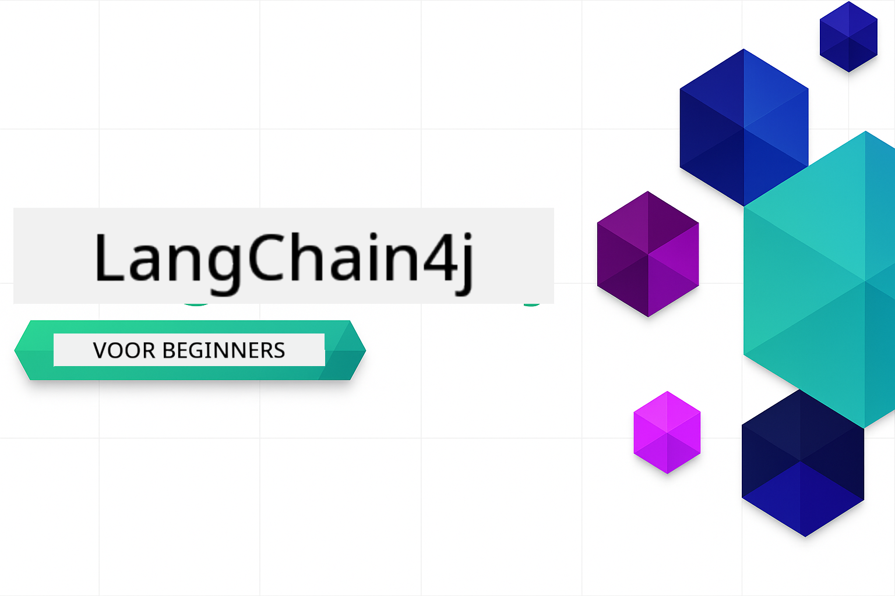

<!--
CO_OP_TRANSLATOR_METADATA:
{
  "original_hash": "1dccdb1a8e2b8ed18e6dea22e823c608",
  "translation_date": "2025-12-19T08:43:41+00:00",
  "source_file": "README.md",
  "language_code": "nl"
}
-->


### 🌐 Meertalige Ondersteuning

#### Ondersteund via GitHub Action (Geautomatiseerd & Altijd Up-to-Date)

<!-- CO-OP TRANSLATOR LANGUAGES TABLE START -->
[Arabisch](../ar/README.md) | [Bengaals](../bn/README.md) | [Bulgaars](../bg/README.md) | [Birmaans (Myanmar)](../my/README.md) | [Chinees (Vereenvoudigd)](../zh/README.md) | [Chinees (Traditioneel, Hong Kong)](../hk/README.md) | [Chinees (Traditioneel, Macau)](../mo/README.md) | [Chinees (Traditioneel, Taiwan)](../tw/README.md) | [Kroatisch](../hr/README.md) | [Tsjechisch](../cs/README.md) | [Deens](../da/README.md) | [Nederlands](./README.md) | [Ests](../et/README.md) | [Fins](../fi/README.md) | [Frans](../fr/README.md) | [Duits](../de/README.md) | [Grieks](../el/README.md) | [Hebreeuws](../he/README.md) | [Hindi](../hi/README.md) | [Hongaars](../hu/README.md) | [Indonesisch](../id/README.md) | [Italiaans](../it/README.md) | [Japans](../ja/README.md) | [Kannada](../kn/README.md) | [Koreaans](../ko/README.md) | [Litouws](../lt/README.md) | [Maleis](../ms/README.md) | [Malayalam](../ml/README.md) | [Marathi](../mr/README.md) | [Nepalees](../ne/README.md) | [Nigeriaans Pidgin](../pcm/README.md) | [Noors](../no/README.md) | [Perzisch (Farsi)](../fa/README.md) | [Pools](../pl/README.md) | [Portugees (Brazilië)](../br/README.md) | [Portugees (Portugal)](../pt/README.md) | [Punjabi (Gurmukhi)](../pa/README.md) | [Roemeens](../ro/README.md) | [Russisch](../ru/README.md) | [Servisch (Cyrillisch)](../sr/README.md) | [Slowaaks](../sk/README.md) | [Sloveens](../sl/README.md) | [Spaans](../es/README.md) | [Swahili](../sw/README.md) | [Zweeds](../sv/README.md) | [Tagalog (Filipijns)](../tl/README.md) | [Tamil](../ta/README.md) | [Telugu](../te/README.md) | [Thais](../th/README.md) | [Turks](../tr/README.md) | [Oekraïens](../uk/README.md) | [Urdu](../ur/README.md) | [Vietnamees](../vi/README.md)
<!-- CO-OP TRANSLATOR LANGUAGES TABLE END -->

# LangChain4j voor Beginners

Een cursus voor het bouwen van AI-toepassingen met LangChain4j en Azure OpenAI GPT-5, van basis chat tot AI-agenten.

**Nieuw bij LangChain4j?** Bekijk de [Glossary](docs/GLOSSARY.md) voor definities van belangrijke termen en concepten.

## Inhoudsopgave

1. [Quick Start](00-quick-start/README.md) - Begin met LangChain4j
2. [Introductie](01-introduction/README.md) - Leer de basisprincipes van LangChain4j
3. [Prompt Engineering](02-prompt-engineering/README.md) - Beheers effectieve promptontwerp
4. [RAG (Retrieval-Augmented Generation)](03-rag/README.md) - Bouw intelligente kennisgebaseerde systemen
5. [Tools](04-tools/README.md) - Integreer externe tools en API's met AI-agenten
6. [MCP (Model Context Protocol)](05-mcp/README.md) - Werk met het Model Context Protocol
---

## Leertraject

> **Quick Start**

1. Fork deze repository naar je GitHub-account
2. Klik op **Code** → tabblad **Codespaces** → **...** → **Nieuw met opties...**
3. Gebruik de standaardinstellingen – dit selecteert de ontwikkelcontainer die voor deze cursus is gemaakt
4. Klik op **Codespace maken**
5. Wacht 5-10 minuten tot de omgeving klaar is
6. Ga direct naar [Quick Start](./00-quick-start/README.md) om te beginnen!

> **Lieber lokaal klonen?**
>
> Deze repository bevat meer dan 50 taalvertalingen, wat de downloadgrootte aanzienlijk vergroot. Om te klonen zonder vertalingen, gebruik sparse checkout:
> ```bash
> git clone --filter=blob:none --sparse https://github.com/microsoft/LangChain4j-for-Beginners.git
> cd LangChain4j-for-Beginners
> git sparse-checkout set --no-cone '/*' '!translations' '!translated_images'
> ```
> Dit geeft je alles wat je nodig hebt om de cursus te voltooien met een veel snellere download.

Begin met de module [Quick Start](00-quick-start/README.md) en werk stap voor stap door elke module om je vaardigheden op te bouwen. Je probeert basisvoorbeelden om de fundamenten te begrijpen voordat je doorgaat naar de module [Introductie](01-introduction/README.md) voor een diepere duik met GPT-5.


Na het voltooien van de modules, verken de [Testgids](docs/TESTING.md) om LangChain4j testconcepten in actie te zien.

> **Opmerking:** Deze training gebruikt zowel GitHub Models als Azure OpenAI. De modules [Quick Start](00-quick-start/README.md) en [MCP](05-mcp/README.md) gebruiken GitHub Models (geen Azure-abonnement vereist), terwijl modules 1-4 Azure OpenAI GPT-5 gebruiken.


## Leren met GitHub Copilot

Om snel te beginnen met coderen, open je dit project in een GitHub Codespace of je lokale IDE met de meegeleverde devcontainer. De devcontainer die in deze cursus wordt gebruikt, is vooraf geconfigureerd met GitHub Copilot voor AI-gepaarde programmering.

Elk codevoorbeeld bevat voorgestelde vragen die je aan GitHub Copilot kunt stellen om je begrip te verdiepen. Let op de 💡/🤖 prompts in:

- **Java-bestand headers** - Vragen specifiek voor elk voorbeeld
- **Module READMEs** - Verkenningsprompts na codevoorbeelden

**Hoe te gebruiken:** Open een willekeurig codebestand en stel Copilot de voorgestelde vragen. Het heeft volledige context van de codebase en kan uitleggen, uitbreiden en alternatieven voorstellen.

Wil je meer leren? Bekijk [Copilot voor AI-gepaarde programmering](https://aka.ms/GitHubCopilotAI).


## Aanvullende bronnen

<!-- CO-OP TRANSLATOR OTHER COURSES START -->
### LangChain
[](https://aka.ms/langchain4j-for-beginners)
[](https://aka.ms/langchainjs-for-beginners?WT.mc_id=m365-94501-dwahlin)

---

### Azure / Edge / MCP / Agenten
[](https://github.com/microsoft/AZD-for-beginners?WT.mc_id=academic-105485-koreyst)
[](https://github.com/microsoft/edgeai-for-beginners?WT.mc_id=academic-105485-koreyst)
[](https://github.com/microsoft/mcp-for-beginners?WT.mc_id=academic-105485-koreyst)
[](https://github.com/microsoft/ai-agents-for-beginners?WT.mc_id=academic-105485-koreyst)

---
 
### Generatieve AI Serie
[](https://github.com/microsoft/generative-ai-for-beginners?WT.mc_id=academic-105485-koreyst)
[-9333EA?style=for-the-badge&labelColor=E5E7EB&color=9333EA)](https://github.com/microsoft/Generative-AI-for-beginners-dotnet?WT.mc_id=academic-105485-koreyst)
[-C084FC?style=for-the-badge&labelColor=E5E7EB&color=C084FC)](https://github.com/microsoft/generative-ai-for-beginners-java?WT.mc_id=academic-105485-koreyst)
[-E879F9?style=for-the-badge&labelColor=E5E7EB&color=E879F9)](https://github.com/microsoft/generative-ai-with-javascript?WT.mc_id=academic-105485-koreyst)

---
 
### Kernleren
[](https://aka.ms/ml-beginners?WT.mc_id=academic-105485-koreyst)
[](https://aka.ms/datascience-beginners?WT.mc_id=academic-105485-koreyst)
[](https://aka.ms/ai-beginners?WT.mc_id=academic-105485-koreyst)
[](https://github.com/microsoft/Security-101?WT.mc_id=academic-96948-sayoung)
[](https://aka.ms/webdev-beginners?WT.mc_id=academic-105485-koreyst)
[](https://aka.ms/iot-beginners?WT.mc_id=academic-105485-koreyst)
[](https://github.com/microsoft/xr-development-for-beginners?WT.mc_id=academic-105485-koreyst)

---
 
### Copilot Serie
[](https://aka.ms/GitHubCopilotAI?WT.mc_id=academic-105485-koreyst)
[](https://github.com/microsoft/mastering-github-copilot-for-dotnet-csharp-developers?WT.mc_id=academic-105485-koreyst)
[](https://github.com/microsoft/CopilotAdventures?WT.mc_id=academic-105485-koreyst)
<!-- CO-OP TRANSLATOR OTHER COURSES END -->

## Hulp Krijgen

Als je vastloopt of vragen hebt over het bouwen van AI-apps, sluit je aan bij:

[](https://aka.ms/foundry/discord)

Als je productfeedback hebt of fouten tegenkomt tijdens het bouwen, bezoek:

[](https://aka.ms/foundry/forum)

## Licentie

MIT-licentie - Zie [LICENSE](../../LICENSE) bestand voor details.

---

<!-- CO-OP TRANSLATOR DISCLAIMER START -->
**Disclaimer**:  
Dit document is vertaald met behulp van de AI-vertalingsdienst [Co-op Translator](https://github.com/Azure/co-op-translator). Hoewel we streven naar nauwkeurigheid, dient u er rekening mee te houden dat geautomatiseerde vertalingen fouten of onnauwkeurigheden kunnen bevatten. Het originele document in de oorspronkelijke taal moet als de gezaghebbende bron worden beschouwd. Voor cruciale informatie wordt professionele menselijke vertaling aanbevolen. Wij zijn niet aansprakelijk voor eventuele misverstanden of verkeerde interpretaties die voortvloeien uit het gebruik van deze vertaling.
<!-- CO-OP TRANSLATOR DISCLAIMER END -->