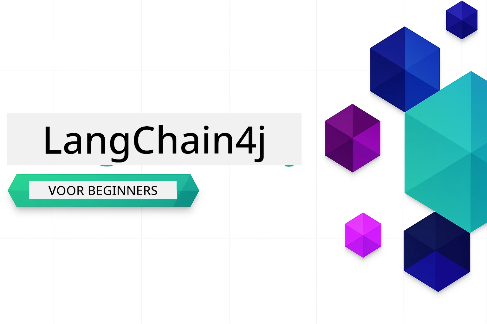

# LangChain4j voor beginners

Een cursus voor het bouwen van AI-toepassingen met LangChain4j en Azure OpenAI GPT-5.2, van eenvoudige chat tot AI-agents.

### 🌐 Meertalige ondersteuning

#### Ondersteund via GitHub Action (Geautomatiseerd & Altijd up-to-date)

<!-- CO-OP TRANSLATOR LANGUAGES TABLE START -->
[Arabic](../ar/README.md) | [Bengali](../bn/README.md) | [Bulgarian](../bg/README.md) | [Burmese (Myanmar)](../my/README.md) | [Chinese (Simplified)](../zh-CN/README.md) | [Chinese (Traditional, Hong Kong)](../zh-HK/README.md) | [Chinese (Traditional, Macau)](../zh-MO/README.md) | [Chinese (Traditional, Taiwan)](../zh-TW/README.md) | [Croatian](../hr/README.md) | [Czech](../cs/README.md) | [Danish](../da/README.md) | [Dutch](./README.md) | [Estonian](../et/README.md) | [Finnish](../fi/README.md) | [French](../fr/README.md) | [German](../de/README.md) | [Greek](../el/README.md) | [Hebrew](../he/README.md) | [Hindi](../hi/README.md) | [Hungarian](../hu/README.md) | [Indonesian](../id/README.md) | [Italian](../it/README.md) | [Japanese](../ja/README.md) | [Kannada](../kn/README.md) | [Khmer](../km/README.md) | [Korean](../ko/README.md) | [Lithuanian](../lt/README.md) | [Malay](../ms/README.md) | [Malayalam](../ml/README.md) | [Marathi](../mr/README.md) | [Nepali](../ne/README.md) | [Nigerian Pidgin](../pcm/README.md) | [Norwegian](../no/README.md) | [Persian (Farsi)](../fa/README.md) | [Polish](../pl/README.md) | [Portuguese (Brazil)](../pt-BR/README.md) | [Portuguese (Portugal)](../pt-PT/README.md) | [Punjabi (Gurmukhi)](../pa/README.md) | [Romanian](../ro/README.md) | [Russian](../ru/README.md) | [Serbian (Cyrillic)](../sr/README.md) | [Slovak](../sk/README.md) | [Slovenian](../sl/README.md) | [Spanish](../es/README.md) | [Swahili](../sw/README.md) | [Swedish](../sv/README.md) | [Tagalog (Filipino)](../tl/README.md) | [Tamil](../ta/README.md) | [Telugu](../te/README.md) | [Thai](../th/README.md) | [Turkish](../tr/README.md) | [Ukrainian](../uk/README.md) | [Urdu](../ur/README.md) | [Vietnamese](../vi/README.md)

> **Liever lokaal klonen?**
>
> Deze repository bevat meer dan 50 taalvertalingen die de downloadgrootte aanzienlijk vergroten. Om zonder vertalingen te klonen, gebruik sparse checkout:
>
> **Bash / macOS / Linux:**
> ```bash
> git clone --filter=blob:none --sparse https://github.com/microsoft/LangChain4j-for-Beginners.git
> cd LangChain4j-for-Beginners
> git sparse-checkout set --no-cone '/*' '!translations' '!translated_images'
> ```
>
> **CMD (Windows):**
> ```cmd
> git clone --filter=blob:none --sparse https://github.com/microsoft/LangChain4j-for-Beginners.git
> cd LangChain4j-for-Beginners
> git sparse-checkout set --no-cone "/*" "!translations" "!translated_images"
> ```
>
> Dit geeft je alles wat je nodig hebt om de cursus te voltooien met een veel snellere download.
<!-- CO-OP TRANSLATOR LANGUAGES TABLE END -->

## Inhoudsopgave

1. [Introductie](01-introduction/README.md) - Leer de basisbeginselen van LangChain4j
2. [Prompt Engineering](02-prompt-engineering/README.md) - Beheers effectief promptontwerp
3. [RAG (Retrieval-Augmented Generation)](03-rag/README.md) - Bouw intelligente kennisgebaseerde systemen
4. [Tools](04-tools/README.md) - Integreer externe tools en eenvoudige assistenten
5. [MCP (Model Context Protocol)](05-mcp/README.md) - Werk met het Model Context Protocol (MCP) en Agentic-modules

### Videohandleidingen

Elke module heeft een begeleidende live sessie waarin we stap voor stap de concepten en code doornemen.

| Module | Video |
|--------|-------|
| 01 - Introductie | [Aan de slag met LangChain4j](https://www.youtube.com/live/nl_troDm8rQ) |
| 02 - Prompt Engineering | [Prompt Engineering met LangChain4j](https://www.youtube.com/live/PJ6aBaE6bog) |
| 03 - RAG | [RAG met LangChain4j](https://www.youtube.com/watch?v=_olq75ZH_eY) |
| 04 - Tools & 05 - MCP | [AI Agents met Tools en MCP](https://www.youtube.com/watch?v=O_J30kZc0rw) |

---

## Leertraject

**Nieuw met LangChain4j?** Bekijk de [Glossary](docs/GLOSSARY.md) voor definities van belangrijke termen en concepten.

> **Snel starten**

1. Fork deze repository naar je GitHub-account
2. Klik op **Code** → tabblad **Codespaces** → **...** → **Nieuw met opties...**
3. Gebruik de standaardinstellingen – deze selecteren de ontwikkelcontainer die voor deze cursus is gemaakt
4. Klik op **Codespace maken**
5. Wacht 5-10 minuten tot de omgeving klaar is
6. Ga direct naar [Introductie](./01-introduction/README.md) om te beginnen!

Na het voltooien van de modules, verken de [Testgids](docs/TESTING.md) om LangChain4j-testconcepten in actie te zien.

> **Opmerking:** Deze training gebruikt Azure OpenAI. Begin met een [GRATIS Azure-account](https://aka.ms/azure-free-account) als je er nog geen hebt.


## Leren met GitHub Copilot

Om snel te beginnen met coderen, open je dit project in een GitHub Codespace of je lokale IDE met de meegeleverde devcontainer. De devcontainer die in deze cursus wordt gebruikt, is vooraf geconfigureerd met GitHub Copilot voor AI-gestuurde paired programming.

Elk codevoorbeeld bevat voorgestelde vragen die je aan GitHub Copilot kunt stellen om je begrip te verdiepen. Let op de 💡/🤖-prompts in:

- **Java-bestandsheaders** - Vragen specifiek voor elk voorbeeld
- **Module-READMEs** - Verkenningsprompts na codevoorbeelden

**Hoe te gebruiken:** Open een willekeurig codebestand en stel Copilot de voorgestelde vragen. Het heeft de volledige context van de codebasis en kan uitleg geven, uitbreiden en alternatieven voorstellen.

Wil je meer leren? Bekijk [Copilot voor AI Paired Programming](https://aka.ms/GitHubCopilotAI).


## Aanvullende bronnen

<!-- CO-OP TRANSLATOR OTHER COURSES START -->
### LangChain
[](https://aka.ms/langchain4j-for-beginners)
[](https://aka.ms/langchainjs-for-beginners?WT.mc_id=m365-94501-dwahlin)
[](https://github.com/microsoft/langchain-for-beginners?WT.mc_id=m365-94501-dwahlin)
---

### Azure / Edge / MCP / Agents
[](https://github.com/microsoft/AZD-for-beginners?WT.mc_id=academic-105485-koreyst)
[](https://github.com/microsoft/edgeai-for-beginners?WT.mc_id=academic-105485-koreyst)
[](https://github.com/microsoft/mcp-for-beginners?WT.mc_id=academic-105485-koreyst)
[](https://github.com/microsoft/ai-agents-for-beginners?WT.mc_id=academic-105485-koreyst)

---
 
### Generative AI-serie
[](https://github.com/microsoft/generative-ai-for-beginners?WT.mc_id=academic-105485-koreyst)
[-9333EA?style=for-the-badge&labelColor=E5E7EB&color=9333EA)](https://github.com/microsoft/Generative-AI-for-beginners-dotnet?WT.mc_id=academic-105485-koreyst)
[-C084FC?style=for-the-badge&labelColor=E5E7EB&color=C084FC)](https://github.com/microsoft/generative-ai-for-beginners-java?WT.mc_id=academic-105485-koreyst)
[-E879F9?style=for-the-badge&labelColor=E5E7EB&color=E879F9)](https://github.com/microsoft/generative-ai-with-javascript?WT.mc_id=academic-105485-koreyst)

---
 
### Kernleren
[](https://aka.ms/ml-beginners?WT.mc_id=academic-105485-koreyst)
[](https://aka.ms/datascience-beginners?WT.mc_id=academic-105485-koreyst)
[](https://aka.ms/ai-beginners?WT.mc_id=academic-105485-koreyst)
[](https://github.com/microsoft/Security-101?WT.mc_id=academic-96948-sayoung)

[](https://aka.ms/webdev-beginners?WT.mc_id=academic-105485-koreyst)
[](https://aka.ms/iot-beginners?WT.mc_id=academic-105485-koreyst)
[](https://github.com/microsoft/xr-development-for-beginners?WT.mc_id=academic-105485-koreyst)

---
 
### Copilot-serie
[](https://aka.ms/GitHubCopilotAI?WT.mc_id=academic-105485-koreyst)
[](https://github.com/microsoft/mastering-github-copilot-for-dotnet-csharp-developers?WT.mc_id=academic-105485-koreyst)
[](https://github.com/microsoft/CopilotAdventures?WT.mc_id=academic-105485-koreyst)
<!-- CO-OP TRANSLATOR OTHER COURSES END -->

## Hulp krijgen

Als je vastloopt of vragen hebt over het bouwen van AI-apps, sluit je aan bij:

[](https://aka.ms/foundry/discord)

Als je productfeedback of fouten tegenkomt tijdens het bouwen, bezoek dan:

[](https://aka.ms/foundry/forum)

## Licentie

MIT-licentie - Zie het bestand [LICENSE](../../LICENSE) voor details.

---

<!-- CO-OP TRANSLATOR DISCLAIMER START -->
**Disclaimer**:
Dit document is vertaald met behulp van de AI vertaaldienst [Co-op Translator](https://github.com/Azure/co-op-translator). Hoewel we streven naar nauwkeurigheid, dient u er rekening mee te houden dat geautomatiseerde vertalingen fouten of onnauwkeurigheden kunnen bevatten. Het originele document in de oorspronkelijke taal moet worden beschouwd als de gezaghebbende bron. Voor kritieke informatie wordt professionele menselijke vertaling aanbevolen. Wij zijn niet aansprakelijk voor eventuele misverstanden of verkeerde interpretaties die voortvloeien uit het gebruik van deze vertaling.
<!-- CO-OP TRANSLATOR DISCLAIMER END -->