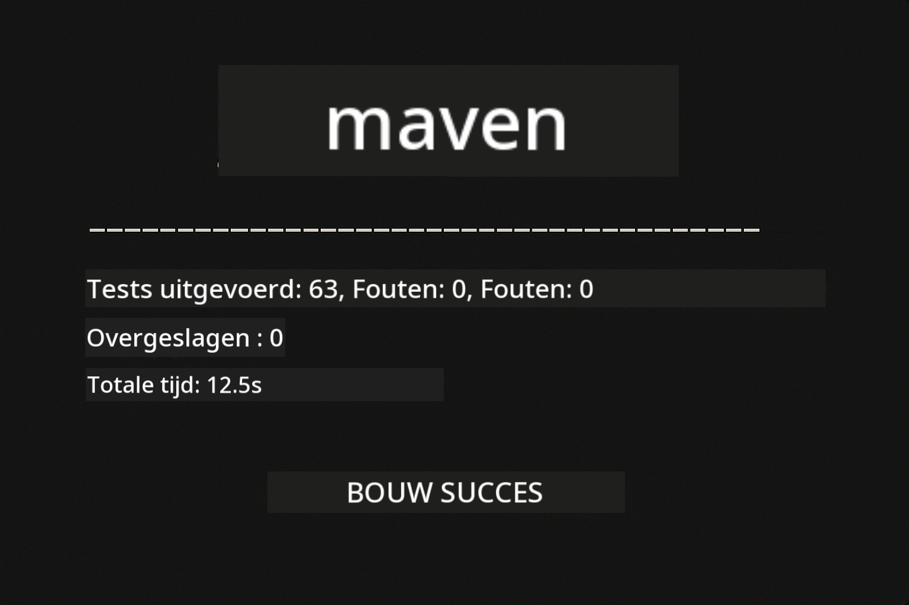
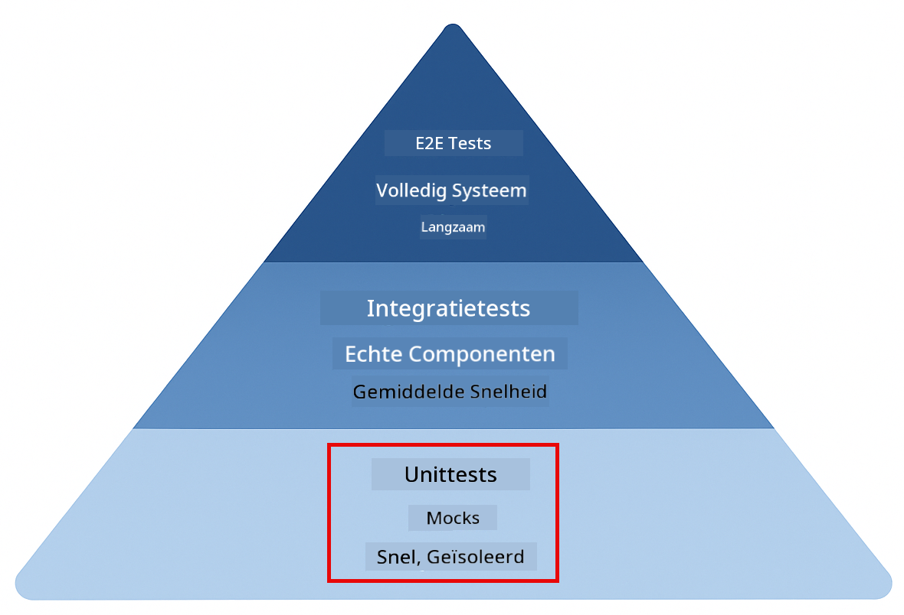
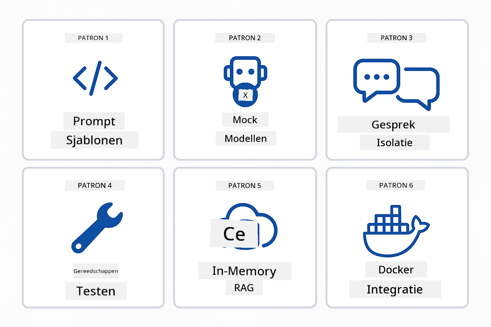
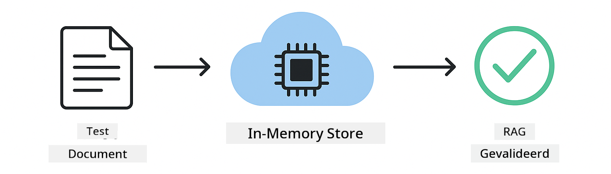

<!--
CO_OP_TRANSLATOR_METADATA:
{
  "original_hash": "b975537560c404d5f254331832811e78",
  "translation_date": "2025-12-13T21:10:37+00:00",
  "source_file": "docs/TESTING.md",
  "language_code": "nl"
}
-->
# Testen van LangChain4j-toepassingen

## Inhoudsopgave

- [Snel aan de slag](../../../docs)
- [Wat de tests behandelen](../../../docs)
- [De tests uitvoeren](../../../docs)
- [Tests uitvoeren in VS Code](../../../docs)
- [Testpatronen](../../../docs)
- [Testfilosofie](../../../docs)
- [Volgende stappen](../../../docs)

Deze gids leidt je door de tests die laten zien hoe je AI-toepassingen test zonder API-sleutels of externe services te vereisen.

## Snel aan de slag

Voer alle tests uit met één commando:

**Bash:**
```bash
mvn test
```

**PowerShell:**
```powershell
mvn --% test
```



*Succesvolle testuitvoering waarbij alle tests slagen zonder fouten*

## Wat de tests behandelen

Deze cursus richt zich op **unittests** die lokaal worden uitgevoerd. Elke test demonstreert een specifiek LangChain4j-concept in isolatie.



*Testpiramide die de balans toont tussen unittests (snel, geïsoleerd), integratietests (echte componenten) en end-to-end tests (volledig systeem met Docker). Deze training behandelt unittests.*

| Module | Tests | Focus | Belangrijke bestanden |
|--------|-------|-------|----------------------|
| **00 - Snel aan de slag** | 6 | Prompt-sjablonen en variabele substitutie | `SimpleQuickStartTest.java` |
| **01 - Introductie** | 8 | Gespreksgeheugen en stateful chat | `SimpleConversationTest.java` |
| **02 - Prompt Engineering** | 12 | GPT-5 patronen, eagerness-niveaus, gestructureerde output | `SimpleGpt5PromptTest.java` |
| **03 - RAG** | 10 | Documentinname, embeddings, gelijkeniszoektocht | `DocumentServiceTest.java` |
| **04 - Tools** | 12 | Functie-aanroepen en tool chaining | `SimpleToolsTest.java` |
| **05 - MCP** | 15 | Model Context Protocol met Docker | `SimpleMcpTest.java`, `McpDockerTransportTest.java` |

## De tests uitvoeren

**Voer alle tests uit vanuit de root:**

**Bash:**
```bash
mvn test
```

**PowerShell:**
```powershell
mvn --% test
```

**Voer tests uit voor een specifieke module:**

**Bash:**
```bash
cd 01-introduction && mvn test
# Of vanaf root
mvn test -pl 01-introduction
```

**PowerShell:**
```powershell
cd 01-introduction; mvn --% test
# Of vanaf root
mvn --% test -pl 01-introduction
```

**Voer een enkele testklasse uit:**

**Bash:**
```bash
mvn test -Dtest=SimpleConversationTest
```

**PowerShell:**
```powershell
mvn --% test -Dtest=SimpleConversationTest
```

**Voer een specifieke testmethode uit:**

**Bash:**
```bash
mvn test -Dtest=SimpleConversationTest#moetGespreksgeschiedenisBehouden
```

**PowerShell:**
```powershell
mvn --% test -Dtest=SimpleConversationTest#moetGespreksgeschiedenisBehouden
```

## Tests uitvoeren in VS Code

Als je Visual Studio Code gebruikt, biedt de Test Explorer een grafische interface voor het uitvoeren en debuggen van tests.


*VS Code Test Explorer toont de testboom met alle Java-testklassen en individuele testmethoden*

**Om tests uit te voeren in VS Code:**

1. Open de Test Explorer door op het bekerglas-icoon in de Activiteitenbalk te klikken
2. Vouw de testboom uit om alle modules en testklassen te zien
3. Klik op de afspeelknop naast een test om deze individueel uit te voeren
4. Klik op "Run All Tests" om de hele suite uit te voeren
5. Klik met de rechtermuisknop op een test en selecteer "Debug Test" om breakpoints te zetten en stap voor stap door de code te gaan

De Test Explorer toont groene vinkjes voor geslaagde tests en geeft gedetailleerde foutmeldingen bij mislukte tests.

## Testpatronen



*Zes testpatronen voor LangChain4j-toepassingen: prompt-sjablonen, mocken van modellen, isolatie van gesprekken, tools testen, in-memory RAG en Docker-integratie*

### Patroon 1: Testen van prompt-sjablonen

Het eenvoudigste patroon test prompt-sjablonen zonder een AI-model aan te roepen. Je verifieert dat variabele substitutie correct werkt en prompts correct zijn opgemaakt.


*Testen van prompt-sjablonen die de variabele substitutiestroom tonen: sjabloon met placeholders → waarden toegepast → geformatteerde output geverifieerd*

```java
@Test
@DisplayName("Should format prompt template with variables")
void testPromptTemplateFormatting() {
    PromptTemplate template = PromptTemplate.from(
        "Best time to visit {{destination}} for {{activity}}?"
    );
    
    Prompt prompt = template.apply(Map.of(
        "destination", "Paris",
        "activity", "sightseeing"
    ));
    
    assertThat(prompt.text()).isEqualTo("Best time to visit Paris for sightseeing?");
}
```

Deze test bevindt zich in `00-quick-start/src/test/java/com/example/langchain4j/quickstart/SimpleQuickStartTest.java`.

**Voer het uit:**

**Bash:**
```bash
cd 00-quick-start && mvn test -Dtest=SimpleQuickStartTest#testPromptTemplateOpmaak
```

**PowerShell:**
```powershell
cd 00-quick-start; mvn --% test -Dtest=SimpleQuickStartTest#testPromptTemplateOpmaak
```

### Patroon 2: Mocken van taalmodellen

Bij het testen van gesprekslogica gebruik je Mockito om nepmodellen te maken die vooraf bepaalde antwoorden teruggeven. Dit maakt tests snel, gratis en deterministisch.


*Vergelijking die toont waarom mocks de voorkeur hebben voor testen: ze zijn snel, gratis, deterministisch en vereisen geen API-sleutels*

```java
@ExtendWith(MockitoExtension.class)
class SimpleConversationTest {
    
    private ConversationService conversationService;
    
    @Mock
    private OpenAiOfficialChatModel mockChatModel;
    
    @BeforeEach
    void setUp() {
        ChatResponse mockResponse = ChatResponse.builder()
            .aiMessage(AiMessage.from("This is a test response"))
            .build();
        when(mockChatModel.chat(anyList())).thenReturn(mockResponse);
        
        conversationService = new ConversationService(mockChatModel);
    }
    
    @Test
    void shouldMaintainConversationHistory() {
        String conversationId = conversationService.startConversation();
        
        ChatResponse mockResponse1 = ChatResponse.builder()
            .aiMessage(AiMessage.from("Response 1"))
            .build();
        ChatResponse mockResponse2 = ChatResponse.builder()
            .aiMessage(AiMessage.from("Response 2"))
            .build();
        ChatResponse mockResponse3 = ChatResponse.builder()
            .aiMessage(AiMessage.from("Response 3"))
            .build();
        
        when(mockChatModel.chat(anyList()))
            .thenReturn(mockResponse1)
            .thenReturn(mockResponse2)
            .thenReturn(mockResponse3);

        conversationService.chat(conversationId, "First message");
        conversationService.chat(conversationId, "Second message");
        conversationService.chat(conversationId, "Third message");

        List<ChatMessage> history = conversationService.getHistory(conversationId);
        assertThat(history).hasSize(6); // 3 gebruikers + 3 AI-berichten
    }
}
```

Dit patroon komt voor in `01-introduction/src/test/java/com/example/langchain4j/service/SimpleConversationTest.java`. De mock zorgt voor consistent gedrag zodat je kunt verifiëren dat geheugenbeheer correct werkt.

### Patroon 3: Testen van gespreksisolatie

Gespreksgeheugen moet meerdere gebruikers gescheiden houden. Deze test verifieert dat gesprekken geen contexten mengen.


*Testen van gespreksisolatie die aparte geheugenopslag voor verschillende gebruikers toont om contextvermenging te voorkomen*

```java
@Test
void shouldIsolateConversationsByid() {
    String conv1 = conversationService.startConversation();
    String conv2 = conversationService.startConversation();
    
    ChatResponse mockResponse = ChatResponse.builder()
        .aiMessage(AiMessage.from("Response"))
        .build();
    when(mockChatModel.chat(anyList())).thenReturn(mockResponse);

    conversationService.chat(conv1, "Message for conversation 1");
    conversationService.chat(conv2, "Message for conversation 2");

    List<ChatMessage> history1 = conversationService.getHistory(conv1);
    List<ChatMessage> history2 = conversationService.getHistory(conv2);
    
    assertThat(history1).hasSize(2);
    assertThat(history2).hasSize(2);
}
```

Elk gesprek onderhoudt zijn eigen onafhankelijke geschiedenis. In productiesystemen is deze isolatie cruciaal voor multi-user toepassingen.

### Patroon 4: Tools onafhankelijk testen

Tools zijn functies die de AI kan aanroepen. Test ze direct om te zorgen dat ze correct werken, ongeacht AI-beslissingen.


*Tools onafhankelijk testen die mock tool-uitvoering toont zonder AI-aanroepen om bedrijfslogica te verifiëren*

```java
@Test
void shouldConvertCelsiusToFahrenheit() {
    TemperatureTool tempTool = new TemperatureTool();
    String result = tempTool.celsiusToFahrenheit(25.0);
    assertThat(result).containsPattern("77[.,]0°F");
}

@Test
void shouldDemonstrateToolChaining() {
    WeatherTool weatherTool = new WeatherTool();
    TemperatureTool tempTool = new TemperatureTool();

    String weatherResult = weatherTool.getCurrentWeather("Seattle");
    assertThat(weatherResult).containsPattern("\\d+°C");

    String conversionResult = tempTool.celsiusToFahrenheit(22.0);
    assertThat(conversionResult).containsPattern("71[.,]6°F");
}
```

Deze tests uit `04-tools/src/test/java/com/example/langchain4j/agents/tools/SimpleToolsTest.java` valideren de tool-logica zonder AI-betrokkenheid. Het chaining-voorbeeld toont hoe de output van de ene tool de input van een andere voedt.

### Patroon 5: In-memory RAG testen

RAG-systemen vereisen traditioneel vector-databases en embedding-services. Het in-memory patroon laat je de hele pijplijn testen zonder externe afhankelijkheden.



*In-memory RAG testworkflow die documentparsing, embedding-opslag en gelijkeniszoektocht toont zonder databasevereiste*

```java
@Test
void testProcessTextDocument() {
    String content = "This is a test document.\nIt has multiple lines.";
    InputStream inputStream = new ByteArrayInputStream(content.getBytes(StandardCharsets.UTF_8));
    
    DocumentService.ProcessedDocument result = 
        documentService.processDocument(inputStream, "test.txt");

    assertNotNull(result);
    assertTrue(result.segments().size() > 0);
    assertEquals("test.txt", result.segments().get(0).metadata().getString("filename"));
}
```

Deze test uit `03-rag/src/test/java/com/example/langchain4j/rag/service/DocumentServiceTest.java` maakt een document in het geheugen en verifieert chunking en metadata-afhandeling.

### Patroon 6: Integratietesten met Docker

Sommige functies hebben echte infrastructuur nodig. De MCP-module gebruikt Testcontainers om Docker-containers op te starten voor integratietests. Deze valideren dat je code werkt met echte services terwijl testisolatie behouden blijft.


*MCP integratietesten met Testcontainers die geautomatiseerde container lifecycle tonen: starten, testuitvoering, stoppen en opruimen*

De tests in `05-mcp/src/test/java/com/example/langchain4j/mcp/McpDockerTransportTest.java` vereisen dat Docker draait.

**Voer ze uit:**

**Bash:**
```bash
cd 05-mcp && mvn test
```

**PowerShell:**
```powershell
cd 05-mcp; mvn --% test
```

## Testfilosofie

Test je code, niet de AI. Je tests moeten de code die je schrijft valideren door te controleren hoe prompts worden opgebouwd, hoe geheugen wordt beheerd en hoe tools worden uitgevoerd. AI-antwoorden variëren en mogen geen onderdeel zijn van testasserties. Vraag jezelf af of je prompt-sjabloon variabelen correct vervangt, niet of de AI het juiste antwoord geeft.

Gebruik mocks voor taalmodellen. Het zijn externe afhankelijkheden die traag, duur en niet-deterministisch zijn. Mocken maakt tests snel met milliseconden in plaats van seconden, gratis zonder API-kosten, en deterministisch met hetzelfde resultaat elke keer.

Houd tests onafhankelijk. Elke test moet zijn eigen data opzetten, niet afhankelijk zijn van andere tests, en zichzelf opruimen. Tests moeten slagen ongeacht de uitvoeringsvolgorde.

Test randgevallen buiten het gelukkige pad. Probeer lege inputs, zeer grote inputs, speciale tekens, ongeldige parameters en grensvoorwaarden. Deze onthullen vaak bugs die normaal gebruik niet blootlegt.

Gebruik beschrijvende namen. Vergelijk `shouldMaintainConversationHistoryAcrossMultipleMessages()` met `test1()`. De eerste vertelt precies wat getest wordt, wat het debuggen van fouten veel makkelijker maakt.

## Volgende stappen

Nu je de testpatronen begrijpt, duik dieper in elke module:

- **[00 - Snel aan de slag](../00-quick-start/README.md)** - Begin met de basis van prompt-sjablonen
- **[01 - Introductie](../01-introduction/README.md)** - Leer gespreksgeheugenbeheer
- **[02 - Prompt Engineering](../02-prompt-engineering/README.md)** - Beheers GPT-5 promptpatronen
- **[03 - RAG](../03-rag/README.md)** - Bouw retrieval-augmented generation systemen
- **[04 - Tools](../04-tools/README.md)** - Implementeer functie-aanroepen en toolketens
- **[05 - MCP](../05-mcp/README.md)** - Integreer Model Context Protocol met Docker

De README van elke module biedt gedetailleerde uitleg over de hier geteste concepten.

---

**Navigatie:** [← Terug naar hoofdmenu](../README.md)

---

<!-- CO-OP TRANSLATOR DISCLAIMER START -->
**Disclaimer**:  
Dit document is vertaald met behulp van de AI-vertalingsdienst [Co-op Translator](https://github.com/Azure/co-op-translator). Hoewel we streven naar nauwkeurigheid, dient u er rekening mee te houden dat geautomatiseerde vertalingen fouten of onnauwkeurigheden kunnen bevatten. Het originele document in de oorspronkelijke taal moet als de gezaghebbende bron worden beschouwd. Voor cruciale informatie wordt professionele menselijke vertaling aanbevolen. Wij zijn niet aansprakelijk voor eventuele misverstanden of verkeerde interpretaties die voortvloeien uit het gebruik van deze vertaling.
<!-- CO-OP TRANSLATOR DISCLAIMER END -->