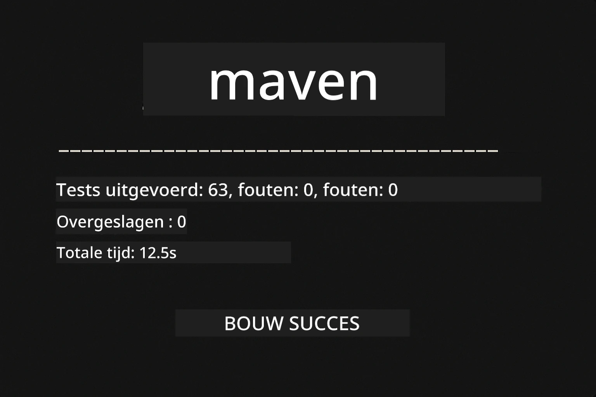
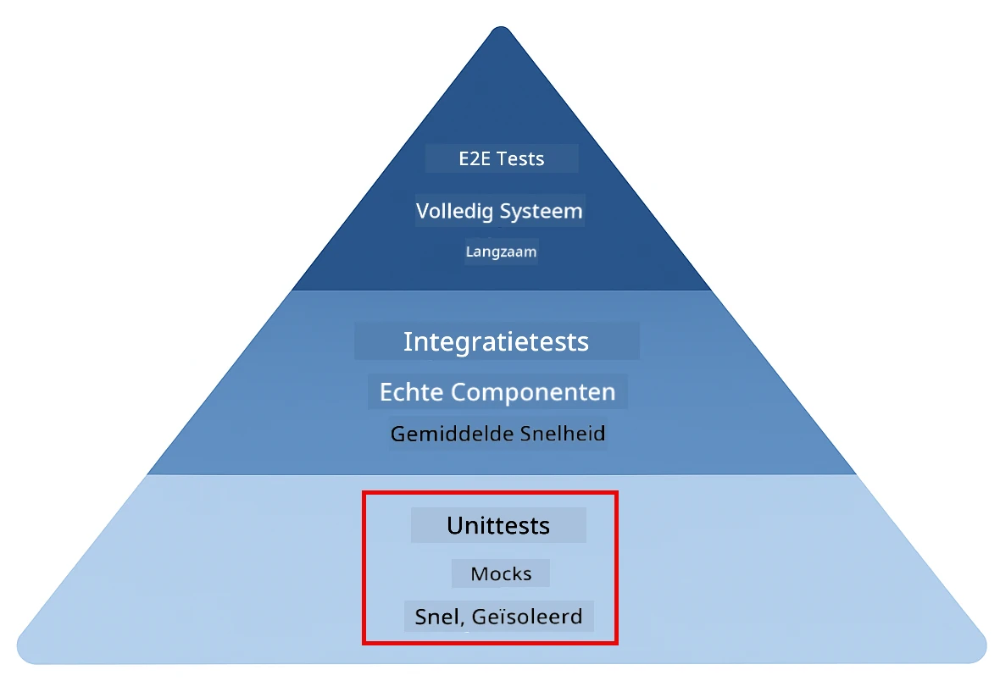
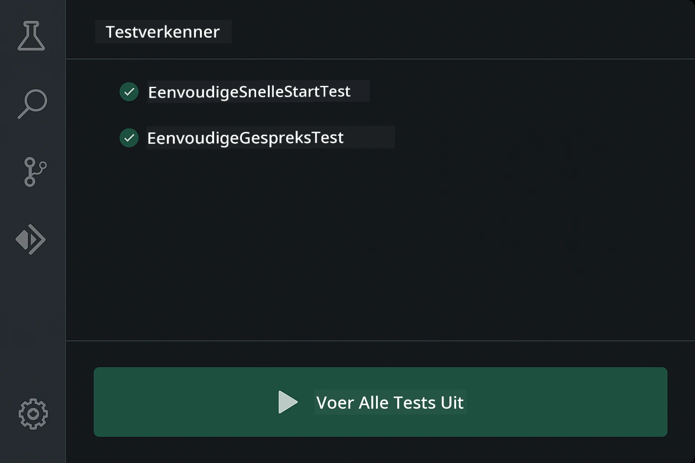
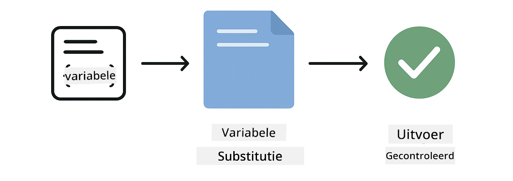
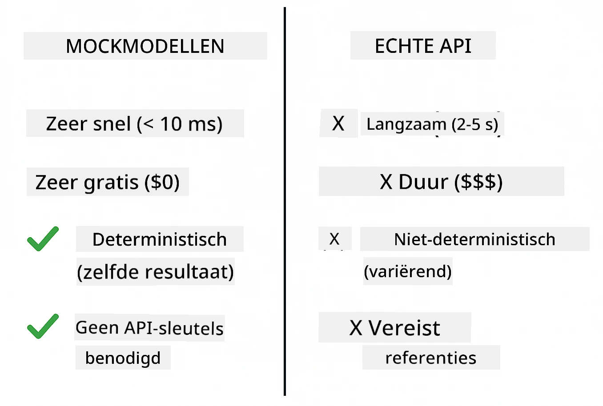
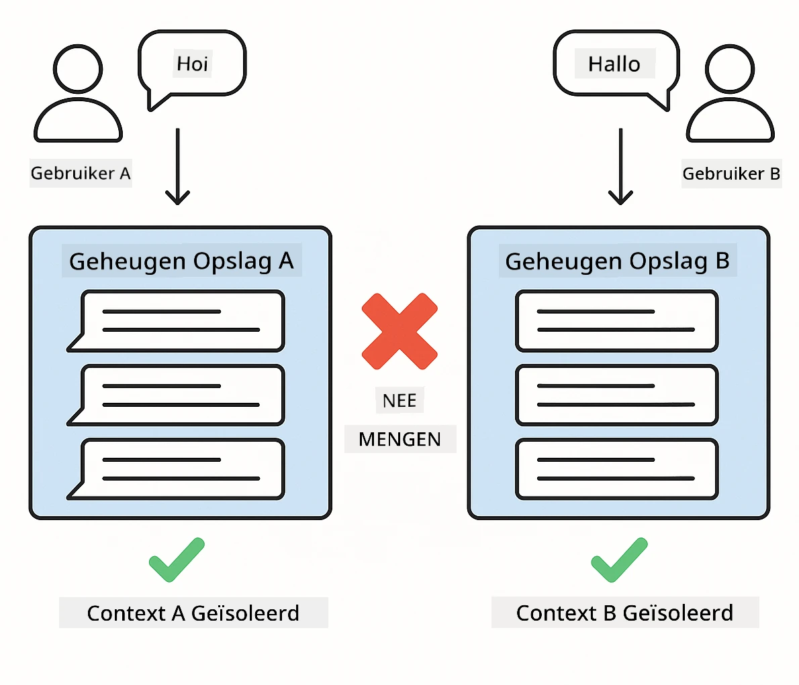
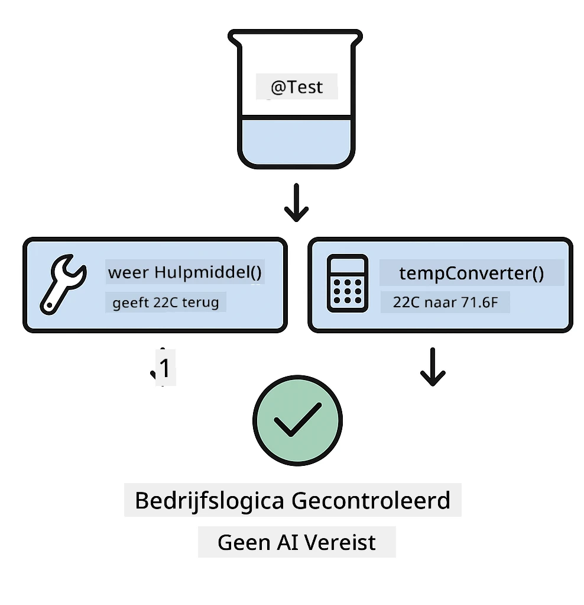

<!--
CO_OP_TRANSLATOR_METADATA:
{
  "original_hash": "ed93b3c14d58734ac10162967da958c1",
  "translation_date": "2025-12-31T02:22:25+00:00",
  "source_file": "docs/TESTING.md",
  "language_code": "nl"
}
-->
# Testen van LangChain4j-toepassingen

## Inhoudsopgave

- [Snel aan de slag](../../../docs)
- [Wat de tests behandelen](../../../docs)
- [Tests uitvoeren](../../../docs)
- [Tests uitvoeren in VS Code](../../../docs)
- [Testpatronen](../../../docs)
- [Testfilosofie](../../../docs)
- [Volgende stappen](../../../docs)

Deze handleiding loodst je door de tests die laten zien hoe je AI-toepassingen test zonder API-sleutels of externe services.

## Snel aan de slag

Voer alle tests uit met één opdracht:

**Bash:**
```bash
mvn test
```

**PowerShell:**
```powershell
mvn --% test
```



*Succesvolle testuitvoering waarbij alle tests slagen zonder fouten*

## Wat de tests behandelen

Deze cursus richt zich op **unittests** die lokaal worden uitgevoerd. Elke test demonstreert een specifiek LangChain4j-concept in isolatie.



*Testpiramide die de balans toont tussen unittests (snel, geïsoleerd), integratietests (echte componenten) en end-to-end-tests. Deze training behandelt unittests.*

| Module | Tests | Focus | Key Files |
|--------|-------|-------|-----------|
| **00 - Snel aan de slag** | 6 | Promptsjablonen en variabelensubstitutie | `SimpleQuickStartTest.java` |
| **01 - Inleiding** | 8 | Gespreksgeheugen en toestandsgestuurde chat | `SimpleConversationTest.java` |
| **02 - Prompt-engineering** | 12 | GPT-5-patronen, eagerness-niveaus, gestructureerde uitvoer | `SimpleGpt5PromptTest.java` |
| **03 - RAG** | 10 | Documentinname, embeddings, gelijkeniszoekopdracht | `DocumentServiceTest.java` |
| **04 - Hulpmiddelen** | 12 | Functieaanroepen en toolketens | `SimpleToolsTest.java` |
| **05 - MCP** | 8 | Model Context Protocol met stdio-transport | `SimpleMcpTest.java` |

## Tests uitvoeren

**Voer alle tests vanuit de root uit:**

**Bash:**
```bash
mvn test
```

**PowerShell:**
```powershell
mvn --% test
```

**Voer tests uit voor een specifieke module:**

**Bash:**
```bash
cd 01-introduction && mvn test
# Of vanuit root
mvn test -pl 01-introduction
```

**PowerShell:**
```powershell
cd 01-introduction; mvn --% test
# Of vanaf root
mvn --% test -pl 01-introduction
```

**Voer een enkele testklasse uit:**

**Bash:**
```bash
mvn test -Dtest=SimpleConversationTest
```

**PowerShell:**
```powershell
mvn --% test -Dtest=SimpleConversationTest
```

**Voer een specifieke testmethode uit:**

**Bash:**
```bash
mvn test -Dtest=SimpleConversationTest#moet de gespreksgeschiedenis behouden
```

**PowerShell:**
```powershell
mvn --% test -Dtest=SimpleConversationTest#moet de gespreksgeschiedenis bijhouden
```

## Tests uitvoeren in VS Code

Als je Visual Studio Code gebruikt, biedt de Test Explorer een grafische interface voor het uitvoeren en debuggen van tests.



*VS Code Testverkenner die de testboom toont met alle Java-testklassen en individuele testmethoden*

**Tests uitvoeren in VS Code:**

1. Open de Test Explorer door op het bekerpictogram in de Activiteitenbalk te klikken
2. Vouw de testboom uit om alle modules en testklassen te zien
3. Klik op de afspeelknop naast een test om deze afzonderlijk uit te voeren
4. Klik op "Run All Tests" om de hele suite uit te voeren
5. Klik met de rechtermuisknop op een test en selecteer "Debug Test" om breakpoints te zetten en stap voor stap door de code te gaan

De Test Explorer toont groene vinkjes voor geslaagde tests en geeft gedetailleerde foutmeldingen wanneer tests mislukken.

## Testpatronen

### Patroon 1: Testen van promptsjablonen

Het eenvoudigste patroon test promptsjablonen zonder een AI-model aan te roepen. Je controleert of het vervangen van variabelen correct werkt en of prompts correct zijn opgemaakt.



*Testen van promptsjablonen die de stroom van variabelensubstitutie laten zien: sjabloon met plaatsaanduidingen → waarden toegepast → geformatteerde uitvoer geverifieerd*

```java
@Test
@DisplayName("Should format prompt template with variables")
void testPromptTemplateFormatting() {
    PromptTemplate template = PromptTemplate.from(
        "Best time to visit {{destination}} for {{activity}}?"
    );
    
    Prompt prompt = template.apply(Map.of(
        "destination", "Paris",
        "activity", "sightseeing"
    ));
    
    assertThat(prompt.text()).isEqualTo("Best time to visit Paris for sightseeing?");
}
```

Deze test bevindt zich in `00-quick-start/src/test/java/com/example/langchain4j/quickstart/SimpleQuickStartTest.java`.

**Voer het uit:**

**Bash:**
```bash
cd 00-quick-start && mvn test -Dtest=SimpleQuickStartTest#testPromptSjabloonOpmaak
```

**PowerShell:**
```powershell
cd 00-quick-start; mvn --% test -Dtest=SimpleQuickStartTest#test prompt-sjabloonopmaak
```

### Patroon 2: Het mocken van taalmodellen

Bij het testen van conversatielogica, gebruik Mockito om nepmodellen te maken die vooraf bepaalde antwoorden teruggeven. Dit maakt tests snel, gratis en deterministisch.



*Vergelijking die laat zien waarom mocks de voorkeur hebben voor testen: ze zijn snel, gratis, deterministisch en vereisen geen API-sleutels*

```java
@ExtendWith(MockitoExtension.class)
class SimpleConversationTest {
    
    private ConversationService conversationService;
    
    @Mock
    private OpenAiOfficialChatModel mockChatModel;
    
    @BeforeEach
    void setUp() {
        ChatResponse mockResponse = ChatResponse.builder()
            .aiMessage(AiMessage.from("This is a test response"))
            .build();
        when(mockChatModel.chat(anyList())).thenReturn(mockResponse);
        
        conversationService = new ConversationService(mockChatModel);
    }
    
    @Test
    void shouldMaintainConversationHistory() {
        String conversationId = conversationService.startConversation();
        
        ChatResponse mockResponse1 = ChatResponse.builder()
            .aiMessage(AiMessage.from("Response 1"))
            .build();
        ChatResponse mockResponse2 = ChatResponse.builder()
            .aiMessage(AiMessage.from("Response 2"))
            .build();
        ChatResponse mockResponse3 = ChatResponse.builder()
            .aiMessage(AiMessage.from("Response 3"))
            .build();
        
        when(mockChatModel.chat(anyList()))
            .thenReturn(mockResponse1)
            .thenReturn(mockResponse2)
            .thenReturn(mockResponse3);

        conversationService.chat(conversationId, "First message");
        conversationService.chat(conversationId, "Second message");
        conversationService.chat(conversationId, "Third message");

        List<ChatMessage> history = conversationService.getHistory(conversationId);
        assertThat(history).hasSize(6); // 3 gebruikersberichten + 3 AI-berichten
    }
}
```

Dit patroon verschijnt in `01-introduction/src/test/java/com/example/langchain4j/service/SimpleConversationTest.java`. De mock zorgt voor consistent gedrag zodat je kunt verifiëren dat geheugenbeheer correct werkt.

### Patroon 3: Testen van conversatie-isolatie

Het gespreksgeheugen moet meerdere gebruikers gescheiden houden. Deze test verifieert dat conversaties geen contexten door elkaar halen.



*Testen van conversatie-isolatie die aparte geheugenopslag voor verschillende gebruikers toont om contextvermenging te voorkomen*

```java
@Test
void shouldIsolateConversationsByid() {
    String conv1 = conversationService.startConversation();
    String conv2 = conversationService.startConversation();
    
    ChatResponse mockResponse = ChatResponse.builder()
        .aiMessage(AiMessage.from("Response"))
        .build();
    when(mockChatModel.chat(anyList())).thenReturn(mockResponse);

    conversationService.chat(conv1, "Message for conversation 1");
    conversationService.chat(conv2, "Message for conversation 2");

    List<ChatMessage> history1 = conversationService.getHistory(conv1);
    List<ChatMessage> history2 = conversationService.getHistory(conv2);
    
    assertThat(history1).hasSize(2);
    assertThat(history2).hasSize(2);
}
```

Elke conversatie onderhoudt zijn eigen onafhankelijke geschiedenis. In productiesystemen is deze isolatie cruciaal voor multi-user applicaties.

### Patroon 4: Testen van tools onafhankelijk

Tools zijn functies die de AI kan aanroepen. Test ze direct om te verzekeren dat ze correct werken ongeacht AI-beslissingen.



*Onafhankelijk testen van tools waarbij mock-uitvoering van tools zonder AI-aanroepen wordt getoond om de bedrijfslogica te verifiëren*

```java
@Test
void shouldConvertCelsiusToFahrenheit() {
    TemperatureTool tempTool = new TemperatureTool();
    String result = tempTool.celsiusToFahrenheit(25.0);
    assertThat(result).containsPattern("77[.,]0°F");
}

@Test
void shouldDemonstrateToolChaining() {
    WeatherTool weatherTool = new WeatherTool();
    TemperatureTool tempTool = new TemperatureTool();

    String weatherResult = weatherTool.getCurrentWeather("Seattle");
    assertThat(weatherResult).containsPattern("\\d+°C");

    String conversionResult = tempTool.celsiusToFahrenheit(22.0);
    assertThat(conversionResult).containsPattern("71[.,]6°F");
}
```

Deze tests uit `04-tools/src/test/java/com/example/langchain4j/agents/tools/SimpleToolsTest.java` valideren de toollogica zonder AI-betrokkenheid. Het kettingsvoorbeeld toont hoe de uitvoer van de ene tool als invoer voor een andere dient.

### Patroon 5: In-memory RAG-testen

RAG-systemen vereisen traditioneel vector-databases en embedding-services. Het in-memory-patroon stelt je in staat om de hele pijplijn te testen zonder externe afhankelijkheden.


*In-memory RAG-testworkflow die document parsing, embedding-opslag en gelijkeniszoeking toont zonder een database te vereisen*

```java
@Test
void testProcessTextDocument() {
    String content = "This is a test document.\nIt has multiple lines.";
    InputStream inputStream = new ByteArrayInputStream(content.getBytes(StandardCharsets.UTF_8));
    
    DocumentService.ProcessedDocument result = 
        documentService.processDocument(inputStream, "test.txt");

    assertNotNull(result);
    assertTrue(result.segments().size() > 0);
    assertEquals("test.txt", result.segments().get(0).metadata().getString("filename"));
}
```

Deze test uit `03-rag/src/test/java/com/example/langchain4j/rag/service/DocumentServiceTest.java` creëert een document in het geheugen en verifieert chunking en metadata-afhandeling.

### Patroon 6: MCP-integratietesten

De MCP-module test de integratie van het Model Context Protocol met behulp van stdio-transport. Deze tests verifiëren dat je applicatie MCP-servers als subprocessen kan starten en ermee kan communiceren.

De tests in `05-mcp/src/test/java/com/example/langchain4j/mcp/SimpleMcpTest.java` valideren het gedrag van de MCP-client.

**Voer ze uit:**

**Bash:**
```bash
cd 05-mcp && mvn test
```

**PowerShell:**
```powershell
cd 05-mcp; mvn --% test
```

## Testfilosofie

Test je code, niet de AI. Je tests zouden de code die je schrijft moeten valideren door te controleren hoe prompts worden opgebouwd, hoe geheugen wordt beheerd en hoe tools worden uitgevoerd. AI-antwoorden variëren en zouden geen deel van testasserties moeten uitmaken. Vraag jezelf of je promptsjabloon variabelen correct vervangt, niet of de AI het juiste antwoord geeft.

Gebruik mocks voor taalmodellen. Het zijn externe afhankelijkheden die traag, duur en niet-deterministisch zijn. Mocken maakt tests snel (milliseconden in plaats van seconden), gratis zonder API-kosten, en deterministisch met elke keer hetzelfde resultaat.

Houd tests onafhankelijk. Elke test moet zijn eigen gegevens opzetten, niet van andere tests afhankelijk zijn, en zichzelf opruimen. Tests moeten slagen ongeacht de uitvoeringsvolgorde.

Test randgevallen buiten het 'happy path'. Probeer lege invoer, zeer grote invoer, speciale tekens, ongeldige parameters en grenswaarden. Deze onthullen vaak bugs die normaal gebruik niet blootlegt.

Gebruik beschrijvende namen. Vergelijk `shouldMaintainConversationHistoryAcrossMultipleMessages()` met `test1()`. De eerste vertelt precies wat er getest wordt, wat het debuggen van fouten veel eenvoudiger maakt.

## Volgende stappen

Nu je de testpatronen begrijpt, duik dieper in elk module:

- **[00 - Snel aan de slag](../00-quick-start/README.md)** - Begin met de basis van promptsjablonen
- **[01 - Inleiding](../01-introduction/README.md)** - Leer gespreksgeheugenbeheer
- **[02 - Prompt-engineering](../02-prompt-engineering/README.md)** - Beheers GPT-5 promptpatronen
- **[03 - RAG](../03-rag/README.md)** - Bouw retrieval-augmented generation-systemen
- **[04 - Tools](../04-tools/README.md)** - Implementeer functieaanroepen en toolketens
- **[05 - MCP](../05-mcp/README.md)** - Integreer Model Context Protocol

De README van elke module geeft gedetailleerde uitleg over de hier geteste concepten.

---

**Navigatie:** [← Terug naar hoofd](../README.md)

---

<!-- CO-OP TRANSLATOR DISCLAIMER START -->
**Disclaimer**:
Dit document is vertaald met behulp van de AI-vertalingsdienst [Co-op Translator](https://github.com/Azure/co-op-translator). Hoewel we streven naar nauwkeurigheid, dient u er rekening mee te houden dat geautomatiseerde vertalingen fouten of onnauwkeurigheden kunnen bevatten. Het oorspronkelijke document in de oorspronkelijke taal moet als de gezaghebbende bron worden beschouwd. Voor kritieke informatie wordt een professionele, menselijke vertaling aanbevolen. Wij zijn niet aansprakelijk voor eventuele misverstanden of verkeerde interpretaties die voortvloeien uit het gebruik van deze vertaling.
<!-- CO-OP TRANSLATOR DISCLAIMER END -->