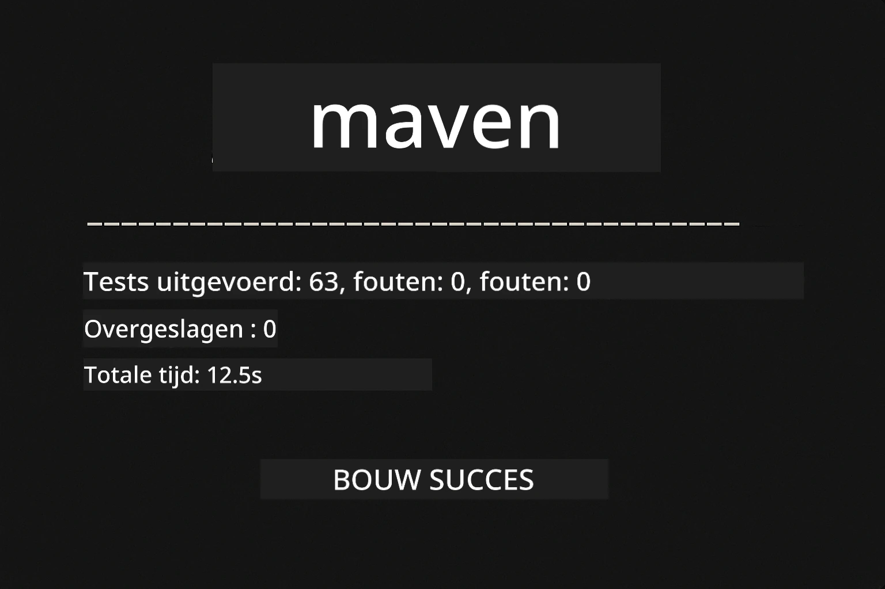
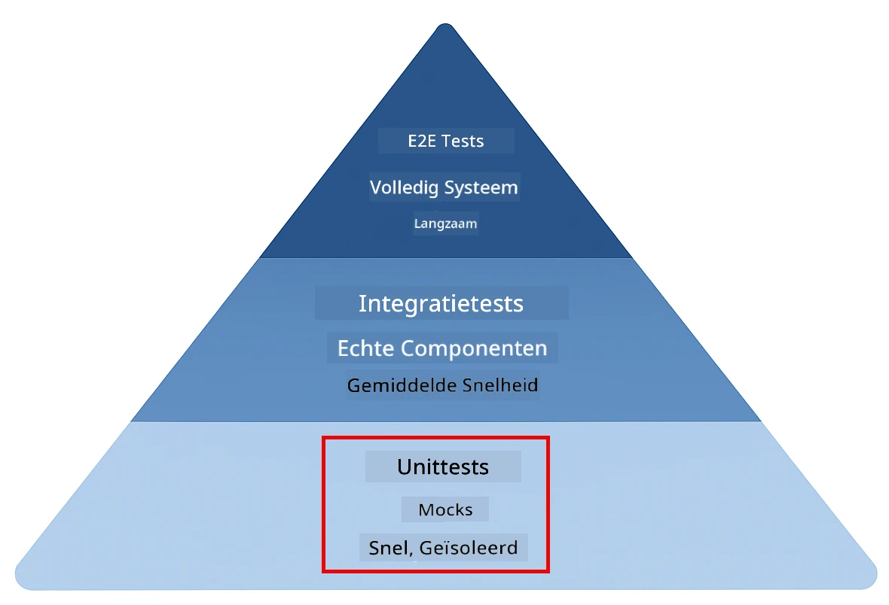
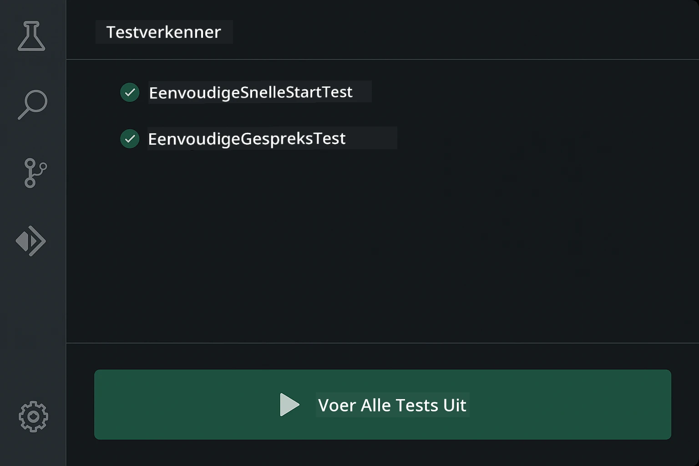
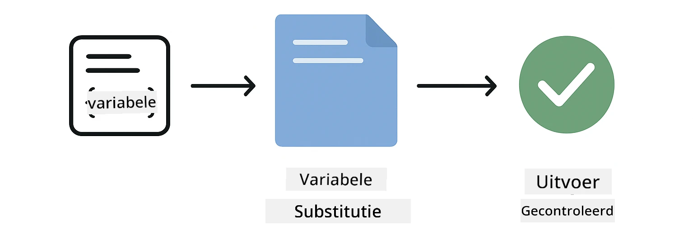
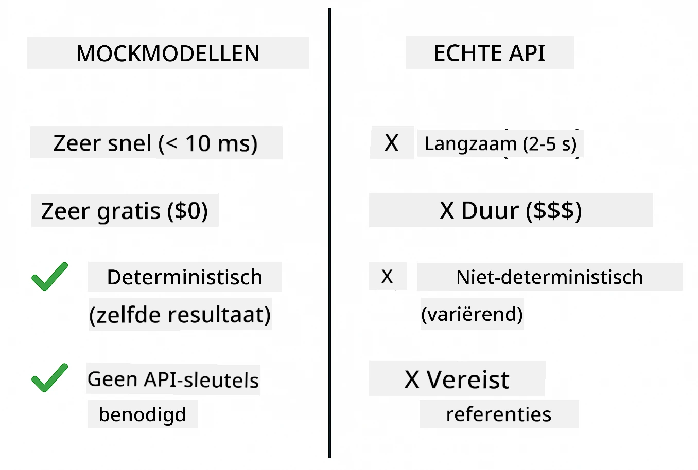
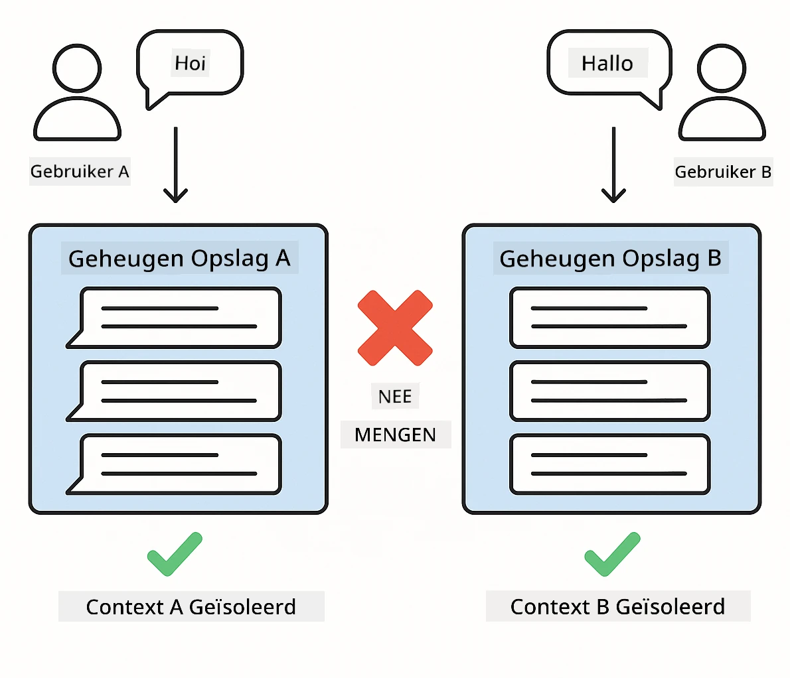
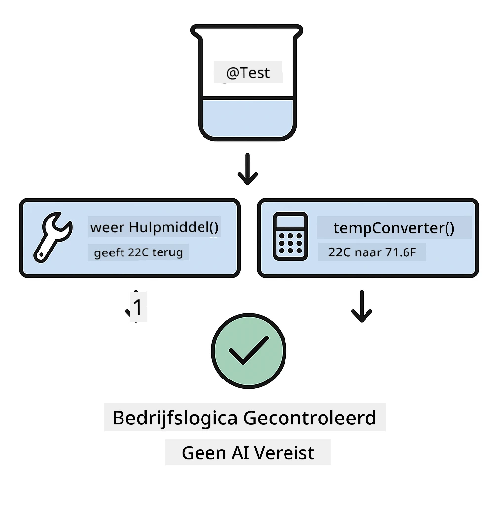
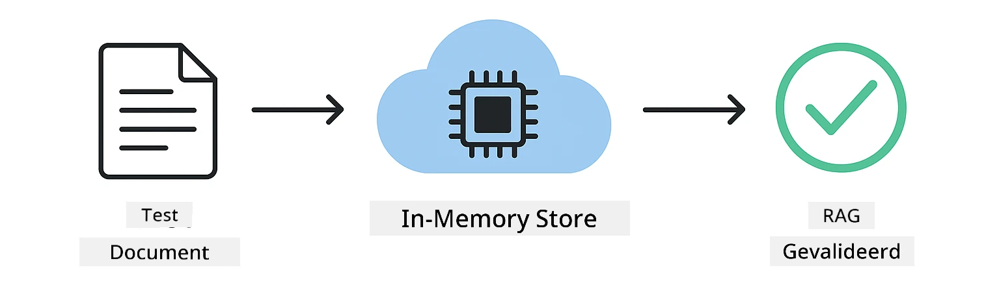

# Testen van LangChain4j-toepassingen

## Inhoudsopgave

- [Snel aan de slag](#snel-aan-de-slag)
- [Wat de tests dekken](#wat-de-tests-dekken)
- [De tests uitvoeren](#de-tests-uitvoeren)
- [Tests uitvoeren in VS Code](#tests-uitvoeren-in-vs-code)
- [Testpatronen](#testpatronen)
- [Testfilosofie](#testfilosofie)
- [Volgende stappen](#volgende-stappen)

Deze gids begeleidt je door de tests die aantonen hoe je AI-toepassingen kunt testen zonder API-sleutels of externe services.

## Snel aan de slag

Voer alle tests uit met één commando:

**Bash:**
```bash
mvn test
```

**PowerShell:**
```powershell
mvn --% test
```

Als alle tests slagen, zie je output zoals in de onderstaande schermafbeelding — tests worden uitgevoerd zonder fouten.



*Succesvolle testuitvoering waarbij alle tests zonder fouten slagen*

## Wat de tests dekken

Deze cursus richt zich op **unittests** die lokaal draaien. Elke test demonstreert een specifiek LangChain4j-concept geïsoleerd. De onderstaande testpiramide toont waar unittests passen — ze vormen de snelle, betrouwbare basis waarop de rest van je teststrategie is gebouwd.



*Testpiramide die de balans toont tussen unittests (snel, geïsoleerd), integratietests (echte componenten) en end-to-end tests. Deze training behandelt unittesten.*

| Module | Tests | Focus | Belangrijke bestanden |
|--------|-------|-------|---------------------|
| **01 - Introductie** | 8 | Gespreksgeheugen en stateful chat | `SimpleConversationTest.java` |
| **02 - Prompt Engineering** | 12 | GPT-5.2-patronen, zorgvuldigheidsniveaus, gestructureerde output | `SimpleGpt5PromptTest.java` |
| **03 - RAG** | 10 | Documentinname, embeddings, zoekopdracht op gelijkenis | `DocumentServiceTest.java` |
| **04 - Tools** | 12 | Functie-aanroepen en het ketenen van tools | `SimpleToolsTest.java` |
| **05 - MCP** | 8 | Model Context Protocol met Stdio transport | `SimpleMcpTest.java` |

## De tests uitvoeren

**Voer alle tests uit vanuit de root:**

**Bash:**
```bash
mvn test
```

**PowerShell:**
```powershell
mvn --% test
```

**Tests uitvoeren voor een specifiek module:**

**Bash:**
```bash
cd 01-introduction && mvn test
# Of vanaf root
mvn test -pl 01-introduction
```

**PowerShell:**
```powershell
cd 01-introduction; mvn --% test
# Of vanuit root
mvn --% test -pl 01-introduction
```

**Voer een enkele testklasse uit:**

**Bash:**
```bash
mvn test -Dtest=SimpleConversationTest
```

**PowerShell:**
```powershell
mvn --% test -Dtest=SimpleConversationTest
```

**Voer een specifieke testmethode uit:**

**Bash:**
```bash
mvn test -Dtest=SimpleConversationTest#gesprekshistorie behouden
```

**PowerShell:**
```powershell
mvn --% test -Dtest=SimpleConversationTest#moetGespreksgeschiedenisBehouden
```

## Tests uitvoeren in VS Code

Als je Visual Studio Code gebruikt, biedt de Test Explorer een grafische interface voor het uitvoeren en debuggen van tests.



*VS Code Test Explorer die de teststructuur toont met alle Java-testklassen en individuele testmethodes*

**Tests uitvoeren in VS Code:**

1. Open de Test Explorer door op het bekerglas-icoon in de Activiteitenbalk te klikken
2. Vouw de teststructuur uit om alle modules en testklassen te zien
3. Klik op de afspeelknop naast een test om die afzonderlijk uit te voeren
4. Klik op "Run All Tests" om de volledige suite uit te voeren
5. Klik rechts op een test en selecteer "Debug Test" om breakpoints te zetten en door de code te stappen

De Test Explorer toont groene vinkjes bij geslaagde tests en geeft uitgebreide foutmeldingen wanneer tests mislukken.

## Testpatronen

### Patroon 1: Testen van prompttemplates

Het eenvoudigste patroon test prompttemplates zonder een AI-model aan te roepen. Je controleert dat variabelen correct worden vervangen en prompts juist zijn opgemaakt.



*Testen van prompttemplates waarbij de variabelenvervanging wordt doorlopen: template met placeholders → waarden toegepast → geformatteerde output gecontroleerd*

```java
@Test
@DisplayName("Should format prompt template with variables")
void testPromptTemplateFormatting() {
    PromptTemplate template = PromptTemplate.from(
        "Best time to visit {{destination}} for {{activity}}?"
    );
    
    Prompt prompt = template.apply(Map.of(
        "destination", "Paris",
        "activity", "sightseeing"
    ));
    
    assertThat(prompt.text()).isEqualTo("Best time to visit Paris for sightseeing?");
}
```

Dit patroon controleert dat variabelen correct worden vervangen en prompts correct worden opgemaakt — er is geen API-sleutel of model-aanroep nodig.

### Patroon 2: Mocken van taalmodellen

Bij het testen van conversatielogica gebruik je Mockito om nepmodellen te maken die van tevoren bepaalde antwoorden teruggeven. Dit maakt tests snel, gratis en deterministisch.



*Vergelijking die laat zien waarom mocks de voorkeur hebben voor testen: ze zijn snel, gratis, deterministisch en vereisen geen API-sleutels*

```java
@ExtendWith(MockitoExtension.class)
class SimpleConversationTest {
    
    private ConversationService conversationService;
    
    @Mock
    private OpenAiOfficialChatModel mockChatModel;
    
    @BeforeEach
    void setUp() {
        ChatResponse mockResponse = ChatResponse.builder()
            .aiMessage(AiMessage.from("This is a test response"))
            .build();
        when(mockChatModel.chat(anyList())).thenReturn(mockResponse);
        
        conversationService = new ConversationService(mockChatModel);
    }
    
    @Test
    void shouldMaintainConversationHistory() {
        String conversationId = conversationService.startConversation();
        
        ChatResponse mockResponse1 = ChatResponse.builder()
            .aiMessage(AiMessage.from("Response 1"))
            .build();
        ChatResponse mockResponse2 = ChatResponse.builder()
            .aiMessage(AiMessage.from("Response 2"))
            .build();
        ChatResponse mockResponse3 = ChatResponse.builder()
            .aiMessage(AiMessage.from("Response 3"))
            .build();
        
        when(mockChatModel.chat(anyList()))
            .thenReturn(mockResponse1)
            .thenReturn(mockResponse2)
            .thenReturn(mockResponse3);

        conversationService.chat(conversationId, "First message");
        conversationService.chat(conversationId, "Second message");
        conversationService.chat(conversationId, "Third message");

        List<ChatMessage> history = conversationService.getHistory(conversationId);
        assertThat(history).hasSize(6); // 3 gebruikers + 3 AI berichten
    }
}
```

Dit patroon wordt gebruikt in `01-introduction/src/test/java/com/example/langchain4j/service/SimpleConversationTest.java`. De mock zorgt voor consistent gedrag zodat geheugenbeheer correct kan worden geverifieerd.

### Patroon 3: Testen van conversatie-isolatie

Gespreksgeheugen moet meerdere gebruikers gescheiden houden. Deze test controleert dat gesprekken geen contexten door elkaar halen.



*Testen van conversatie-isolatie waarbij aparte geheugens voor verschillende gebruikers worden gebruikt om contextverwarring te voorkomen*

```java
@Test
void shouldIsolateConversationsByid() {
    String conv1 = conversationService.startConversation();
    String conv2 = conversationService.startConversation();
    
    ChatResponse mockResponse = ChatResponse.builder()
        .aiMessage(AiMessage.from("Response"))
        .build();
    when(mockChatModel.chat(anyList())).thenReturn(mockResponse);

    conversationService.chat(conv1, "Message for conversation 1");
    conversationService.chat(conv2, "Message for conversation 2");

    List<ChatMessage> history1 = conversationService.getHistory(conv1);
    List<ChatMessage> history2 = conversationService.getHistory(conv2);
    
    assertThat(history1).hasSize(2);
    assertThat(history2).hasSize(2);
}
```

Elk gesprek behoudt zijn eigen onafhankelijke geschiedenis. In productiesystemen is deze isolatie cruciaal voor multi-gebruikertoepassingen.

### Patroon 4: Tools onafhankelijk testen

Tools zijn functies die de AI kan aanroepen. Test ze rechtstreeks om zeker te zijn dat ze correct werken, onafhankelijk van AI-beslissingen.



*Onafhankelijk testen van tools waarbij een nep-uitvoering van tools wordt getoond zonder AI-aanroepen om de bedrijfslogica te verifiëren*

```java
@Test
void shouldConvertCelsiusToFahrenheit() {
    TemperatureTool tempTool = new TemperatureTool();
    String result = tempTool.celsiusToFahrenheit(25.0);
    assertThat(result).containsPattern("77[.,]0°F");
}

@Test
void shouldDemonstrateToolChaining() {
    WeatherTool weatherTool = new WeatherTool();
    TemperatureTool tempTool = new TemperatureTool();

    String weatherResult = weatherTool.getCurrentWeather("Seattle");
    assertThat(weatherResult).containsPattern("\\d+°C");

    String conversionResult = tempTool.celsiusToFahrenheit(22.0);
    assertThat(conversionResult).containsPattern("71[.,]6°F");
}
```

Deze tests uit `04-tools/src/test/java/com/example/langchain4j/agents/tools/SimpleToolsTest.java` valideren tool-logica zonder AI-betrokkenheid. Het ketenvoorbeeld laat zien hoe de output van de ene tool de input van een andere voedt.

### Patroon 5: In-memory RAG-testen

RAG-systemen vereisen traditioneel vectordatabases en embeddingservices. Het in-memory-patroon laat je de volledige pipeline testen zonder externe afhankelijkheden.



*In-memory RAG-testworkflow die documentparsing, embedding-opslag, en gelijkeniszoeken toont zonder databasevereisten*

```java
@Test
void testProcessTextDocument() {
    String content = "This is a test document.\nIt has multiple lines.";
    InputStream inputStream = new ByteArrayInputStream(content.getBytes(StandardCharsets.UTF_8));
    
    DocumentService.ProcessedDocument result = 
        documentService.processDocument(inputStream, "test.txt");

    assertNotNull(result);
    assertTrue(result.segments().size() > 0);
    assertEquals("test.txt", result.segments().get(0).metadata().getString("filename"));
}
```

Deze test uit `03-rag/src/test/java/com/example/langchain4j/rag/service/DocumentServiceTest.java` maakt een document in het geheugen en controleert chunking en metadata-afhandeling.

### Patroon 6: MCP-integratietesten

De MCP-module test de Model Context Protocol-integratie met stdio transport. Deze tests verifiëren dat je applicatie MCP-servers als subprocessen kan starten en ermee kan communiceren.

De tests in `05-mcp/src/test/java/com/example/langchain4j/mcp/SimpleMcpTest.java` valideren het gedrag van de MCP-client.

**Voer ze uit:**

**Bash:**
```bash
cd 05-mcp && mvn test
```

**PowerShell:**
```powershell
cd 05-mcp; mvn --% test
```

## Testfilosofie

Test je code, niet de AI. Je tests moeten de code die je schrijft valideren door te controleren hoe prompts worden opgebouwd, hoe geheugen wordt beheerd en hoe tools worden uitgevoerd. AI-antwoorden variëren en mogen geen onderdeel van testasserties zijn. Vraag jezelf af of je prompttemplate correct variabelen vervangt, niet of de AI het juiste antwoord geeft.

Gebruik mocks voor taalmodellen. Ze zijn externe afhankelijkheden die traag, duur en niet-deterministisch zijn. Mocking maakt tests snel met milliseconden in plaats van seconden, gratis zonder API-kosten, en deterministisch met steeds hetzelfde resultaat.

Houd tests onafhankelijk. Elke test moet zijn eigen data opzetten, niet afhankelijk zijn van andere tests, en opruimen na zichzelf. Tests moeten slagen ongeacht de uitvoeringsvolgorde.

Test randgevallen buiten het gelukkige pad. Probeer lege invoer, zeer grote invoer, speciale tekens, ongeldige parameters en grensvoorwaarden. Deze onthullen vaak bugs die normaal gebruik niet blootlegt.

Gebruik beschrijvende namen. Vergelijk `shouldMaintainConversationHistoryAcrossMultipleMessages()` met `test1()`. De eerste vertelt precies wat er getest wordt en maakt het debuggen van fouten veel eenvoudiger.

## Volgende stappen

Nu je de testpatronen begrijpt, duik dieper in elke module:

- **[01 - Introductie](../01-introduction/README.md)** - Leer gesprekgeheugenbeheer
- **[02 - Prompt Engineering](../02-prompt-engineering/README.md)** - Beheers GPT-5.2-promptpatronen
- **[03 - RAG](../03-rag/README.md)** - Bouw retrieval-augmented generation systemen
- **[04 - Tools](../04-tools/README.md)** - Implementeer functie-aanroepen en toolketens
- **[05 - MCP](../05-mcp/README.md)** - Integreer het Model Context Protocol

De README van elke module biedt gedetailleerde uitleg over de concepten die hier worden getest.

---

**Navigatie:** [← Terug naar Hoofdmenu](../README.md)

---

<!-- CO-OP TRANSLATOR DISCLAIMER START -->
**Disclaimer**:
Dit document is vertaald met behulp van de AI vertaaldienst [Co-op Translator](https://github.com/Azure/co-op-translator). Hoewel we streven naar nauwkeurigheid, dient u er rekening mee te houden dat geautomatiseerde vertalingen fouten of onnauwkeurigheden kunnen bevatten. Het originele document in de oorspronkelijke taal moet worden beschouwd als de gezaghebbende bron. Voor kritieke informatie wordt professionele menselijke vertaling aanbevolen. Wij zijn niet aansprakelijk voor eventuele misverstanden of verkeerde interpretaties die voortvloeien uit het gebruik van deze vertaling.
<!-- CO-OP TRANSLATOR DISCLAIMER END -->