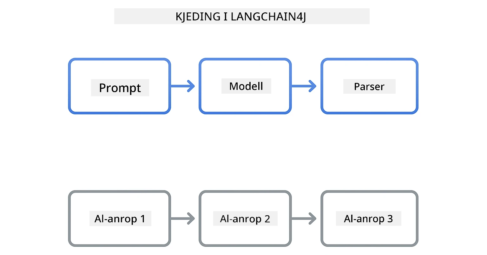
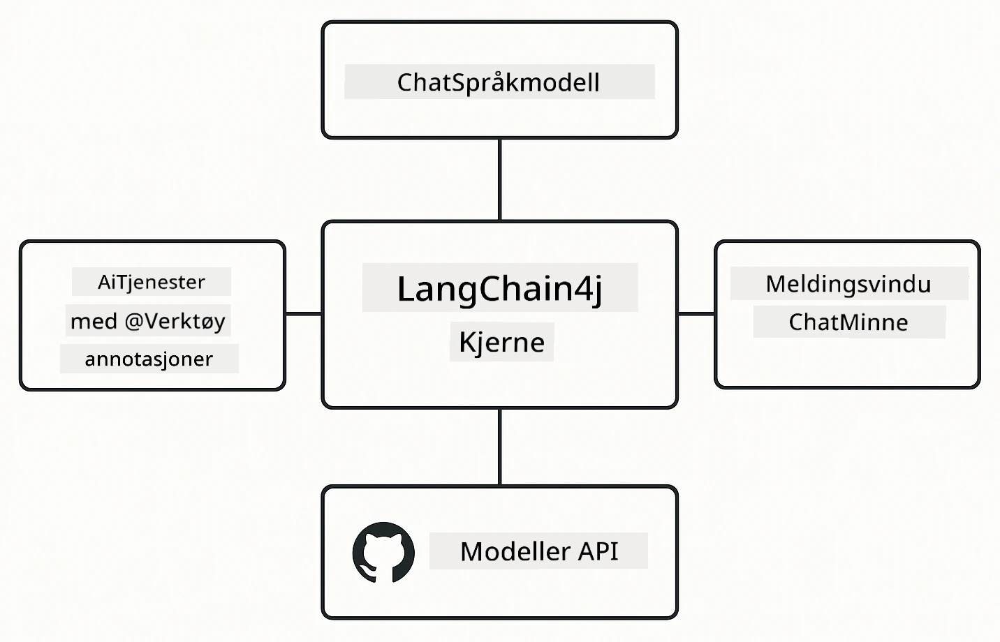

# Modul 00: Rask start

## Innholdsfortegnelse

- [Introduksjon](../../../00-quick-start)
- [Hva er LangChain4j?](../../../00-quick-start)
- [LangChain4j Avhengigheter](../../../00-quick-start)
- [Forutsetninger](../../../00-quick-start)
- [Oppsett](../../../00-quick-start)
  - [1. Skaff GitHub-tokenet ditt](../../../00-quick-start)
  - [2. Sett tokenet ditt](../../../00-quick-start)
- [Kjør eksemplene](../../../00-quick-start)
  - [1. Grunnleggende chat](../../../00-quick-start)
  - [2. Prompt-mønstre](../../../00-quick-start)
  - [3. Funksjonskalling](../../../00-quick-start)
  - [4. Dokument Q&A (RAG)](../../../00-quick-start)
  - [5. Ansvarlig AI](../../../00-quick-start)
- [Hva hvert eksempel viser](../../../00-quick-start)
- [Neste steg](../../../00-quick-start)
- [Feilsøking](../../../00-quick-start)

## Introduksjon

Denne raskstarten er ment å få deg i gang med LangChain4j så raskt som mulig. Den dekker det absolutte grunnlaget for å bygge AI-applikasjoner med LangChain4j og GitHub Models. I de neste modulene vil du bruke Azure OpenAI med LangChain4j for å bygge mer avanserte applikasjoner.

## Hva er LangChain4j?

LangChain4j er et Java-bibliotek som forenkler bygging av AI-drevne applikasjoner. I stedet for å håndtere HTTP-klienter og JSON-parsing, arbeider du med rene Java-APIer.

"Chain" i LangChain refererer til lenking av flere komponenter sammen – du kan lenke en prompt til en modell til en parser, eller kjede flere AI-kall der ett output mates som neste input. Denne raskstarten fokuserer på grunnprinsippene før du utforsker mer komplekse kjeder.



*Lenking av komponenter i LangChain4j – byggeklosser kobles sammen for å lage kraftige AI-arbeidsflyter*

Vi bruker tre kjernekomponenter:

**ChatLanguageModel** – Grensesnittet for AI-modellinteraksjoner. Kall `model.chat("prompt")` og få tilbake en svarstreng. Vi bruker `OpenAiOfficialChatModel` som fungerer med OpenAI-kompatible endepunkter som GitHub Models.

**AiServices** – Lager typesikre AI tjenestegrensesnitt. Definer metoder, annoter dem med `@Tool`, og LangChain4j håndterer orkestreringen. AI kaller automatisk Java-metodene dine når det trengs.

**MessageWindowChatMemory** – Opprettholder samtalehistorikk. Uten dette er hver forespørsel uavhengig. Med det husker AI tidligere meldinger og opprettholder kontekst over flere turer.



*LangChain4j-arkitektur – kjernekonponenter som samarbeider for å drive AI-applikasjonene dine*

## LangChain4j Avhengigheter

Denne raskstarten bruker to Maven-avhengigheter i [`pom.xml`](../../../00-quick-start/pom.xml):

```xml
<!-- Core LangChain4j library -->
<dependency>
    <groupId>dev.langchain4j</groupId>
    <artifactId>langchain4j</artifactId> <!-- Inherited from BOM in root pom.xml -->
</dependency>

<!-- OpenAI integration (works with GitHub Models) -->
<dependency>
    <groupId>dev.langchain4j</groupId>
    <artifactId>langchain4j-open-ai-official</artifactId> <!-- Inherited from BOM in root pom.xml -->
</dependency>
```

Modulen `langchain4j-open-ai-official` tilbyr klassen `OpenAiOfficialChatModel` som kobler til OpenAI-kompatible APIer. GitHub Models bruker samme API-format, så ingen spesiell adapter er nødvendig – bare pek base-URL til `https://models.github.ai/inference`.

## Forutsetninger

**Bruker du Dev Container?** Java og Maven er allerede installert. Du trenger bare et GitHub Personal Access Token.

**Lokal utvikling:**
- Java 21+, Maven 3.9+
- GitHub Personal Access Token (instruksjoner nedenfor)

> **Merk:** Denne modulen bruker `gpt-4.1-nano` fra GitHub Models. Ikke endre modellnavnet i koden – det er konfigurert til å fungere med GitHubs tilgjengelige modeller.

## Oppsett

### 1. Skaff GitHub-tokenet ditt

1. Gå til [GitHub Settings → Personal Access Tokens](https://github.com/settings/personal-access-tokens)
2. Klikk "Generate new token"
3. Gi det et beskrivende navn (f.eks. "LangChain4j Demo")
4. Sett utløpstid (7 dager anbefales)
5. Under "Account permissions", finn "Models" og sett til "Read-only"
6. Klikk "Generate token"
7. Kopier og lagre tokenet ditt – du får ikke se det igjen

### 2. Sett tokenet ditt

**Alternativ 1: Bruke VS Code (Anbefalt)**

Hvis du bruker VS Code, legg tokenet til i `.env`-filen i prosjektroten:

Hvis `.env`-filen ikke finnes, kopier `.env.example` til `.env` eller lag en ny `.env`-fil i prosjektroten.

**Eksempel på `.env`-fil:**
```bash
# I /workspaces/LangChain4j-for-Beginners/.env
GITHUB_TOKEN=your_token_here
```

Deretter kan du enkelt høyreklikke på en hvilken som helst demo-fil (f.eks. `BasicChatDemo.java`) i Explorer og velge **"Run Java"** eller bruke startkonfigurasjonene i Kjør og Feilsøk-panelet.

**Alternativ 2: Bruke Terminal**

Sett tokenet som en miljøvariabel:

**Bash:**
```bash
export GITHUB_TOKEN=your_token_here
```

**PowerShell:**
```powershell
$env:GITHUB_TOKEN=your_token_here
```

## Kjør eksemplene

**Bruker VS Code:** Høyreklikk på en demo-fil i Explorer og velg **"Run Java"**, eller bruk startkonfigurasjonene i Kjør og Feilsøk-panelet (pass på at du har lagt til tokenet i `.env`-filen først).

**Bruke Maven:** Alternativt kan du kjøre fra kommandolinjen:

### 1. Grunnleggende chat

**Bash:**
```bash
mvn compile exec:java -Dexec.mainClass=com.example.langchain4j.quickstart.BasicChatDemo
```

**PowerShell:**
```powershell
mvn --% compile exec:java -Dexec.mainClass=com.example.langchain4j.quickstart.BasicChatDemo
```

### 2. Prompt-mønstre

**Bash:**
```bash
mvn compile exec:java -Dexec.mainClass=com.example.langchain4j.quickstart.PromptEngineeringDemo
```

**PowerShell:**
```powershell
mvn --% compile exec:java -Dexec.mainClass=com.example.langchain4j.quickstart.PromptEngineeringDemo
```

Viser zero-shot, few-shot, chain-of-thought, og rollebasert prompting.

### 3. Funksjonskalling

**Bash:**
```bash
mvn compile exec:java -Dexec.mainClass=com.example.langchain4j.quickstart.ToolIntegrationDemo
```

**PowerShell:**
```powershell
mvn --% compile exec:java -Dexec.mainClass=com.example.langchain4j.quickstart.ToolIntegrationDemo
```

AI kaller automatisk Java-metodene dine når det trengs.

### 4. Dokument Q&A (RAG)

**Bash:**
```bash
mvn compile exec:java -Dexec.mainClass=com.example.langchain4j.quickstart.SimpleReaderDemo
```

**PowerShell:**
```powershell
mvn --% compile exec:java -Dexec.mainClass=com.example.langchain4j.quickstart.SimpleReaderDemo
```

Still spørsmål om innhold i `document.txt`.

### 5. Ansvarlig AI

**Bash:**
```bash
mvn compile exec:java -Dexec.mainClass=com.example.langchain4j.quickstart.ResponsibleAIDemo
```

**PowerShell:**
```powershell
mvn --% compile exec:java -Dexec.mainClass=com.example.langchain4j.quickstart.ResponsibleAIDemo
```

Se hvordan AI-sikkerhetsfiltre blokkerer skadelig innhold.

## Hva hvert eksempel viser

**Grunnleggende chat** - [BasicChatDemo.java](../../../00-quick-start/src/main/java/com/example/langchain4j/quickstart/BasicChatDemo.java)

Start her for å se LangChain4j på sitt enkleste. Du lager en `OpenAiOfficialChatModel`, sender en prompt med `.chat()` og får tilbake et svar. Dette demonstrerer grunnlaget: hvordan man initialiserer modeller med tilpassede endepunkter og API-nøkler. Når du forstår dette mønsteret, bygger alt annet videre på det.

```java
ChatLanguageModel model = OpenAiOfficialChatModel.builder()
    .baseUrl("https://models.github.ai/inference")
    .apiKey(System.getenv("GITHUB_TOKEN"))
    .modelName("gpt-4.1-nano")
    .build();

String response = model.chat("What is LangChain4j?");
System.out.println(response);
```

> **🤖 Prøv med [GitHub Copilot](https://github.com/features/copilot) Chat:** Åpne [`BasicChatDemo.java`](../../../00-quick-start/src/main/java/com/example/langchain4j/quickstart/BasicChatDemo.java) og spør:
> - "Hvordan bytter jeg fra GitHub Models til Azure OpenAI i denne koden?"
> - "Hvilke andre parametere kan jeg konfigurere i OpenAiOfficialChatModel.builder()?"
> - "Hvordan legger jeg til strømming av svar i stedet for å vente på komplett svar?"

**Prompt Engineering** - [PromptEngineeringDemo.java](../../../00-quick-start/src/main/java/com/example/langchain4j/quickstart/PromptEngineeringDemo.java)

Nå som du vet hvordan du snakker til en modell, la oss utforske hva du sier til den. Denne demoen bruker samme modelloppsett, men viser fire forskjellige prompt-mønstre. Prøv zero-shot prompts for direkte instruksjoner, few-shot prompts som lærer fra eksempler, chain-of-thought prompts som avslører resonnementstrinn, og rollebaserte prompts som setter kontekst. Du vil se hvordan samme modell gir dramatisk forskjellige resultater basert på hvordan du rammer inn forespørselen.

```java
PromptTemplate template = PromptTemplate.from(
    "What's the best time to visit {{destination}} for {{activity}}?"
);

Prompt prompt = template.apply(Map.of(
    "destination", "Paris",
    "activity", "sightseeing"
));

String response = model.chat(prompt.text());
```

> **🤖 Prøv med [GitHub Copilot](https://github.com/features/copilot) Chat:** Åpne [`PromptEngineeringDemo.java`](../../../00-quick-start/src/main/java/com/example/langchain4j/quickstart/PromptEngineeringDemo.java) og spør:
> - "Hva er forskjellen på zero-shot og few-shot prompting, og når bør jeg bruke hver av dem?"
> - "Hvordan påvirker temperaturparameteren modellens svar?"
> - "Hva er noen teknikker for å forhindre prompt-injeksjonsangrep i produksjon?"
> - "Hvordan kan jeg lage gjenbrukbare PromptTemplate-objekter for vanlige mønstre?"

**Tool Integration** - [ToolIntegrationDemo.java](../../../00-quick-start/src/main/java/com/example/langchain4j/quickstart/ToolIntegrationDemo.java)

Her blir LangChain4j kraftig. Du bruker `AiServices` for å lage en AI-assistent som kan kalle Java-metodene dine. Bare annoter metoder med `@Tool("beskrivelse")` og LangChain4j tar seg av resten – AI bestemmer automatisk når den skal bruke hvert verktøy basert på hva brukeren spør om. Dette demonstrerer funksjonskalling, en viktig teknikk for å bygge AI som kan utføre handlinger, ikke bare svare på spørsmål.

```java
@Tool("Performs addition of two numeric values")
public double add(double a, double b) {
    return a + b;
}

MathAssistant assistant = AiServices.create(MathAssistant.class, model);
String response = assistant.chat("What is 25 plus 17?");
```

> **🤖 Prøv med [GitHub Copilot](https://github.com/features/copilot) Chat:** Åpne [`ToolIntegrationDemo.java`](../../../00-quick-start/src/main/java/com/example/langchain4j/quickstart/ToolIntegrationDemo.java) og spør:
> - "Hvordan fungerer @Tool-annotasjonen og hva gjør LangChain4j med den bak kulissene?"
> - "Kan AI kalle flere verktøy i rekkefølge for å løse komplekse problemer?"
> - "Hva skjer hvis et verktøy kaster en unntak – hvordan bør jeg håndtere feil?"
> - "Hvordan ville jeg integrert et ekte API i stedet for dette kalkulator-eksemplet?"

**Dokument Q&A (RAG)** - [SimpleReaderDemo.java](../../../00-quick-start/src/main/java/com/example/langchain4j/quickstart/SimpleReaderDemo.java)

Her ser du grunnlaget for RAG (retrieval-augmented generation). I stedet for å stole på modellens treningsdata, laster du inn innhold fra [`document.txt`](../../../00-quick-start/document.txt) og inkluderer det i prompten. AI svarer basert på dokumentet ditt, ikke på sin generelle kunnskap. Dette er første steg mot å bygge systemer som kan jobbe med dine egne data.

```java
Document document = FileSystemDocumentLoader.loadDocument("document.txt");
String content = document.text();

String prompt = "Based on this document: " + content + 
                "\nQuestion: What is the main topic?";
String response = model.chat(prompt);
```

> **Merk:** Denne enkle tilnærmingen laster hele dokumentet inn i prompten. For store filer (>10KB) vil du overskride kontekstgrenser. Modul 03 dekker oppdeling og vektorsøk for produksjons-RAG-systemer.

> **🤖 Prøv med [GitHub Copilot](https://github.com/features/copilot) Chat:** Åpne [`SimpleReaderDemo.java`](../../../00-quick-start/src/main/java/com/example/langchain4j/quickstart/SimpleReaderDemo.java) og spør:
> - "Hvordan hindrer RAG AI-hallusinasjoner sammenlignet med bruk av modellens treningsdata?"
> - "Hva er forskjellen på denne enkle tilnærmingen og bruk av vektorrepresentasjoner for gjenfinning?"
> - "Hvordan ville jeg skalert dette til å håndtere flere dokumenter eller større kunnskapsbaser?"
> - "Hva er beste praksis for å strukturere prompten for å sikre at AI kun bruker den gitte konteksten?"

**Ansvarlig AI** - [ResponsibleAIDemo.java](../../../00-quick-start/src/main/java/com/example/langchain4j/quickstart/ResponsibleAIDemo.java)

Bygg AI-sikkerhet med forsvar i dybden. Denne demoen viser to lag med beskyttelse som jobber sammen:

**Del 1: LangChain4j Input Guardrails** – Blokker farlige prompts før de når LLM. Lag tilpassede "guardrails" som sjekker etter forbudte nøkkelord eller mønstre. Disse kjøres i koden din, så de er raske og gratis.

```java
class DangerousContentGuardrail implements InputGuardrail {
    @Override
    public InputGuardrailResult validate(UserMessage userMessage) {
        String text = userMessage.singleText().toLowerCase();
        if (text.contains("explosives")) {
            return fatal("Blocked: contains prohibited keyword");
        }
        return success();
    }
}
```

**Del 2: Provider Safety Filters** – GitHub Models har innebygde filtre som fanger opp det dine guardrails kan mangle. Du vil se harde blokker (HTTP 400-feil) for alvorlige brudd og myke avslag der AI høflig avslår.

> **🤖 Prøv med [GitHub Copilot](https://github.com/features/copilot) Chat:** Åpne [`ResponsibleAIDemo.java`](../../../00-quick-start/src/main/java/com/example/langchain4j/quickstart/ResponsibleAIDemo.java) og spør:
> - "Hva er InputGuardrail og hvordan lager jeg mine egne?"
> - "Hva er forskjellen på en hard blokk og et mykt avslag?"
> - "Hvorfor bruke både guardrails og providers filtre sammen?"

## Neste steg

**Neste modul:** [01-introduction - Komme i gang med LangChain4j og gpt-5 på Azure](../01-introduction/README.md)

---

**Navigasjon:** [← Tilbake til hovedmeny](../README.md) | [Neste: Modul 01 - Introduksjon →](../01-introduction/README.md)

---

## Feilsøking

### Første Maven-build

**Problem:** Første `mvn clean compile` eller `mvn package` tar lang tid (10-15 minutter)

**Årsak:** Maven må laste ned alle prosjektavhengigheter (Spring Boot, LangChain4j-biblioteker, Azure SDKer osv.) ved første bygging.

**Løsning:** Dette er normal oppførsel. Etterfølgende bygginger går mye raskere fordi avhengigheter caches lokalt. Nedlastningstid avhenger av nettverkshastigheten din.

### PowerShell Maven-kommando syntaks

**Problem:** Maven-kommandoer feiler med feilmelding `Unknown lifecycle phase ".mainClass=..."`

**Årsak:** PowerShell tolker `=` som en variabeltilordningsoperator, noe som bryter Maven-eiendomssyntaksen.
**Løsning**: Bruk stopp-parsing-operatoren `--%` før Maven-kommandoen:

**PowerShell:**
```powershell
mvn --% compile exec:java -Dexec.mainClass=com.example.langchain4j.quickstart.BasicChatDemo
```

**Bash:**
```bash
mvn compile exec:java -Dexec.mainClass=com.example.langchain4j.quickstart.BasicChatDemo
```

`--%`-operatoren forteller PowerShell å sende alle resterende argumenter bokstavelig til Maven uten tolkning.

### Windows PowerShell Emoji-visning

**Problem**: AI-svar viser søppeltegn (f.eks. `????` eller `â??`) i stedet for emojis i PowerShell

**Årsak**: PowerShells standardkoding støtter ikke UTF-8-emojis

**Løsning**: Kjør denne kommandoen før du kjører Java-applikasjoner:
```cmd
chcp 65001
```

Dette tvinger UTF-8-koding i terminalen. Alternativt bruk Windows Terminal som har bedre Unicode-støtte.

### Feilsøking av API-kall

**Problem**: Autentiseringsfeil, grenseverdier eller uventede svar fra AI-modellen

**Løsning**: Eksemplene inkluderer `.logRequests(true)` og `.logResponses(true)` for å vise API-kall i konsollen. Dette hjelper med å feilsøke autentiseringsfeil, grenseverdier eller uventede svar. Fjern disse flaggene i produksjon for å redusere loggmengden.

---

<!-- CO-OP TRANSLATOR DISCLAIMER START -->
**Ansvarsfraskrivelse**:  
Dette dokumentet har blitt oversatt ved hjelp av AI-oversettelsestjenesten [Co-op Translator](https://github.com/Azure/co-op-translator). Selv om vi streber etter nøyaktighet, vennligst vær oppmerksom på at automatiske oversettelser kan inneholde feil eller unøyaktigheter. Det opprinnelige dokumentet på dets originalsproget bør betraktes som den autoritative kilden. For kritisk informasjon anbefales profesjonell menneskelig oversettelse. Vi er ikke ansvarlige for eventuelle misforståelser eller feiltolkninger som oppstår ved bruk av denne oversettelsen.
<!-- CO-OP TRANSLATOR DISCLAIMER END -->