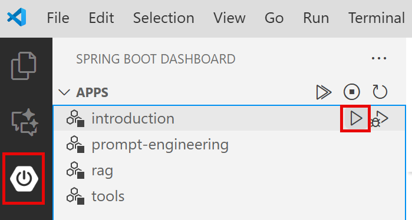
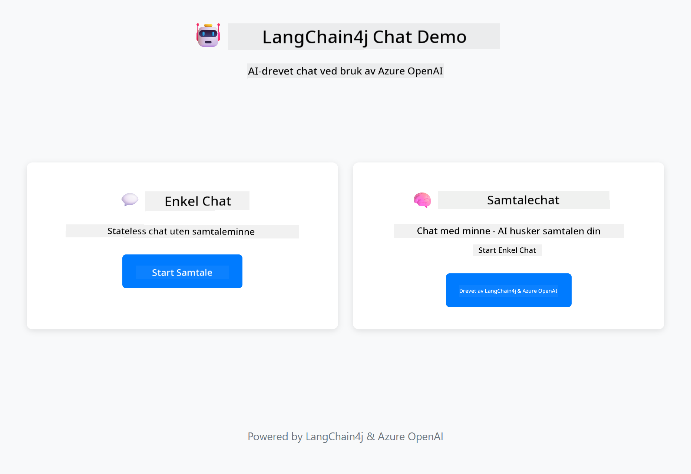
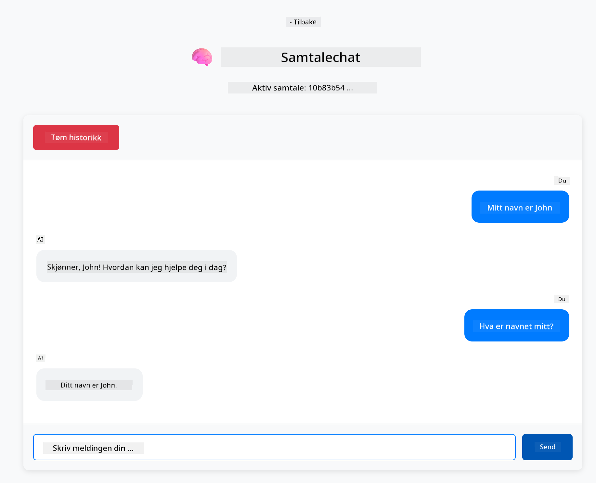

<!--
CO_OP_TRANSLATOR_METADATA:
{
  "original_hash": "c3e07ca58d0b8a3f47d3bf5728541e0a",
  "translation_date": "2025-12-13T13:42:53+00:00",
  "source_file": "01-introduction/README.md",
  "language_code": "no"
}
-->
# Module 01: Komme i gang med LangChain4j

## Innholdsfortegnelse

- [Hva du vil lære](../../../01-introduction)
- [Forutsetninger](../../../01-introduction)
- [Forstå kjernen i problemet](../../../01-introduction)
- [Forstå tokens](../../../01-introduction)
- [Hvordan minne fungerer](../../../01-introduction)
- [Hvordan dette bruker LangChain4j](../../../01-introduction)
- [Distribuer Azure OpenAI-infrastruktur](../../../01-introduction)
- [Kjør applikasjonen lokalt](../../../01-introduction)
- [Bruke applikasjonen](../../../01-introduction)
  - [Stateless Chat (venstre panel)](../../../01-introduction)
  - [Stateful Chat (høyre panel)](../../../01-introduction)
- [Neste steg](../../../01-introduction)

## Hva du vil lære

Hvis du fullførte hurtigstarten, så du hvordan du sender prompts og får svar. Det er grunnlaget, men ekte applikasjoner trenger mer. Denne modulen lærer deg hvordan du bygger konversasjons-AI som husker kontekst og opprettholder tilstand – forskjellen mellom en engangs-demo og en produksjonsklar applikasjon.

Vi bruker Azure OpenAI sin GPT-5 gjennom hele denne guiden fordi dens avanserte resonneringsevner gjør oppførselen til ulike mønstre mer tydelig. Når du legger til minne, vil du klart se forskjellen. Dette gjør det enklere å forstå hva hver komponent tilfører applikasjonen din.

Du vil bygge én applikasjon som demonstrerer begge mønstrene:

**Stateless Chat** – Hver forespørsel er uavhengig. Modellen har ikke noe minne om tidligere meldinger. Dette er mønsteret du brukte i hurtigstarten.

**Stateful Conversation** – Hver forespørsel inkluderer samtalehistorikk. Modellen opprettholder kontekst over flere runder. Dette er hva produksjonsapplikasjoner krever.

## Forutsetninger

- Azure-abonnement med tilgang til Azure OpenAI
- Java 21, Maven 3.9+
- Azure CLI (https://learn.microsoft.com/en-us/cli/azure/install-azure-cli)
- Azure Developer CLI (azd) (https://learn.microsoft.com/en-us/azure/developer/azure-developer-cli/install-azd)

> **Merk:** Java, Maven, Azure CLI og Azure Developer CLI (azd) er forhåndsinstallert i den medfølgende devcontaineren.

> **Merk:** Denne modulen bruker GPT-5 på Azure OpenAI. Distribusjonen konfigureres automatisk via `azd up` – ikke endre modellnavnet i koden.

## Forstå kjernen i problemet

Språkmodeller er stateless. Hver API-kall er uavhengig. Hvis du sender "Mitt navn er John" og deretter spør "Hva er navnet mitt?", har ikke modellen noen anelse om at du nettopp introduserte deg. Den behandler hver forespørsel som om det er den første samtalen du noen gang har hatt.

Dette er greit for enkle spørsmål og svar, men ubrukelig for ekte applikasjoner. Kundeserviceboter må huske hva du fortalte dem. Personlige assistenter trenger kontekst. Enhver samtale med flere runder krever minne.


*Forskjellen mellom stateless (uavhengige kall) og stateful (kontekstbevisste) samtaler*

## Forstå tokens

Før du dykker inn i samtaler, er det viktig å forstå tokens – de grunnleggende tekst-enhetene som språkmodeller behandler:


*Eksempel på hvordan tekst deles opp i tokens – "I love AI!" blir til 4 separate behandlingsenheter*

Tokens er hvordan AI-modeller måler og behandler tekst. Ord, tegnsetting og til og med mellomrom kan være tokens. Modellen din har en grense for hvor mange tokens den kan behandle samtidig (400 000 for GPT-5, med opptil 272 000 input-tokens og 128 000 output-tokens). Å forstå tokens hjelper deg å styre samtalelengde og kostnader.

## Hvordan minne fungerer

Chat-minne løser det stateless problemet ved å opprettholde samtalehistorikk. Før du sender forespørselen til modellen, legger rammeverket til relevante tidligere meldinger foran. Når du spør "Hva er navnet mitt?", sender systemet faktisk hele samtalehistorikken, slik at modellen kan se at du tidligere sa "Mitt navn er John."

LangChain4j tilbyr minneimplementasjoner som håndterer dette automatisk. Du velger hvor mange meldinger som skal beholdes, og rammeverket styrer kontekstvinduet.


*MessageWindowChatMemory opprettholder et glidende vindu med nylige meldinger, og fjerner automatisk gamle*

## Hvordan dette bruker LangChain4j

Denne modulen utvider hurtigstarten ved å integrere Spring Boot og legge til samtaleminne. Slik passer delene sammen:

**Avhengigheter** – Legg til to LangChain4j-biblioteker:

```xml
<dependency>
    <groupId>dev.langchain4j</groupId>
    <artifactId>langchain4j</artifactId> <!-- Inherited from BOM in root pom.xml -->
</dependency>
<dependency>
    <groupId>dev.langchain4j</groupId>
    <artifactId>langchain4j-open-ai-official</artifactId> <!-- Inherited from BOM in root pom.xml -->
</dependency>
```

**Chat-modell** – Konfigurer Azure OpenAI som en Spring bean ([LangChainConfig.java](../../../01-introduction/src/main/java/com/example/langchain4j/config/LangChainConfig.java)):

```java
@Bean
public OpenAiOfficialChatModel openAiOfficialChatModel() {
    return OpenAiOfficialChatModel.builder()
            .baseUrl(azureEndpoint)
            .apiKey(azureApiKey)
            .modelName(deploymentName)
            .timeout(Duration.ofMinutes(5))
            .maxRetries(3)
            .build();
}
```

Builderen leser legitimasjon fra miljøvariabler satt av `azd up`. Å sette `baseUrl` til din Azure-endepunkt gjør at OpenAI-klienten fungerer med Azure OpenAI.

**Samtaleminne** – Spor chat-historikk med MessageWindowChatMemory ([ConversationService.java](../../../01-introduction/src/main/java/com/example/langchain4j/service/ConversationService.java)):

```java
ChatMemory memory = MessageWindowChatMemory.withMaxMessages(10);

memory.add(UserMessage.from("My name is John"));
memory.add(AiMessage.from("Nice to meet you, John!"));

memory.add(UserMessage.from("What's my name?"));
AiMessage aiMessage = chatModel.chat(memory.messages()).aiMessage();
memory.add(aiMessage);
```

Opprett minne med `withMaxMessages(10)` for å beholde de siste 10 meldingene. Legg til bruker- og AI-meldinger med typede wrappers: `UserMessage.from(text)` og `AiMessage.from(text)`. Hent historikk med `memory.messages()` og send den til modellen. Tjenesten lagrer separate minneinstanser per samtale-ID, slik at flere brukere kan chatte samtidig.

> **🤖 Prøv med [GitHub Copilot](https://github.com/features/copilot) Chat:** Åpne [`ConversationService.java`](../../../01-introduction/src/main/java/com/example/langchain4j/service/ConversationService.java) og spør:
> - "Hvordan bestemmer MessageWindowChatMemory hvilke meldinger som skal droppes når vinduet er fullt?"
> - "Kan jeg implementere egendefinert minnelagring ved å bruke en database i stedet for minne?"
> - "Hvordan kan jeg legge til oppsummering for å komprimere gammel samtalehistorikk?"

Stateless chat-endepunktet hopper over minne helt – bare `chatModel.chat(prompt)` som i hurtigstarten. Stateful endepunkt legger til meldinger i minnet, henter historikk og inkluderer den konteksten med hver forespørsel. Samme modellkonfigurasjon, forskjellige mønstre.

## Distribuer Azure OpenAI-infrastruktur

**Bash:**
```bash
cd 01-introduction
azd up  # Velg abonnement og plassering (eastus2 anbefales)
```

**PowerShell:**
```powershell
cd 01-introduction
azd up  # Velg abonnement og plassering (eastus2 anbefales)
```

> **Merk:** Hvis du får en timeout-feil (`RequestConflict: Cannot modify resource ... provisioning state is not terminal`), kjør bare `azd up` på nytt. Azure-ressurser kan fortsatt være under provisjonering i bakgrunnen, og et nytt forsøk lar distribusjonen fullføres når ressursene når en terminal tilstand.

Dette vil:
1. Distribuere Azure OpenAI-ressurs med GPT-5 og text-embedding-3-small modeller
2. Automatisk generere `.env`-fil i prosjektets rot med legitimasjon
3. Sette opp alle nødvendige miljøvariabler

**Har du problemer med distribusjonen?** Se [Infrastructure README](infra/README.md) for detaljert feilsøking inkludert konflikter med subdomener, manuelle distribusjonstrinn i Azure Portal og veiledning for modellkonfigurasjon.

**Bekreft at distribusjonen lyktes:**

**Bash:**
```bash
cat ../.env  # Skal vise AZURE_OPENAI_ENDPOINT, API_KEY, osv.
```

**PowerShell:**
```powershell
Get-Content ..\.env  # Skal vise AZURE_OPENAI_ENDPOINT, API_KEY, osv.
```

> **Merk:** Kommandoen `azd up` genererer automatisk `.env`-filen. Hvis du trenger å oppdatere den senere, kan du enten redigere `.env`-filen manuelt eller regenerere den ved å kjøre:
>
> **Bash:**
> ```bash
> cd ..
> bash .azd-env.sh
> ```
>
> **PowerShell:**
> ```powershell
> cd ..
> .\.azd-env.ps1
> ```

## Kjør applikasjonen lokalt

**Bekreft distribusjon:**

Sørg for at `.env`-filen finnes i rotkatalogen med Azure-legitimasjon:

**Bash:**
```bash
cat ../.env  # Skal vise AZURE_OPENAI_ENDPOINT, API_KEY, DEPLOYMENT
```

**PowerShell:**
```powershell
Get-Content ..\.env  # Skal vise AZURE_OPENAI_ENDPOINT, API_KEY, DEPLOYMENT
```

**Start applikasjonene:**

**Alternativ 1: Bruke Spring Boot Dashboard (anbefalt for VS Code-brukere)**

Devcontaineren inkluderer Spring Boot Dashboard-utvidelsen, som gir et visuelt grensesnitt for å administrere alle Spring Boot-applikasjoner. Du finner den i aktivitetslinjen på venstre side i VS Code (se etter Spring Boot-ikonet).

Fra Spring Boot Dashboard kan du:
- Se alle tilgjengelige Spring Boot-applikasjoner i arbeidsområdet
- Starte/stoppe applikasjoner med ett klikk
- Se applikasjonslogger i sanntid
- Overvåke applikasjonsstatus

Klikk bare på play-knappen ved siden av "introduction" for å starte denne modulen, eller start alle moduler samtidig.



**Alternativ 2: Bruke shell-skript**

Start alle webapplikasjoner (moduler 01-04):

**Bash:**
```bash
cd ..  # Fra rotkatalogen
./start-all.sh
```

**PowerShell:**
```powershell
cd ..  # Fra rotkatalogen
.\start-all.ps1
```

Eller start bare denne modulen:

**Bash:**
```bash
cd 01-introduction
./start.sh
```

**PowerShell:**
```powershell
cd 01-introduction
.\start.ps1
```

Begge skriptene laster automatisk miljøvariabler fra rotens `.env`-fil og bygger JAR-filene hvis de ikke finnes.

> **Merk:** Hvis du foretrekker å bygge alle moduler manuelt før oppstart:
>
> **Bash:**
> ```bash
> cd ..  # Go to root directory
> mvn clean package -DskipTests
> ```
>
> **PowerShell:**
> ```powershell
> cd ..  # Go to root directory
> mvn clean package -DskipTests
> ```

Åpne http://localhost:8080 i nettleseren din.

**For å stoppe:**

**Bash:**
```bash
./stop.sh  # Kun denne modulen
# Eller
cd .. && ./stop-all.sh  # Alle moduler
```

**PowerShell:**
```powershell
.\stop.ps1  # Kun denne modulen
# Eller
cd ..; .\stop-all.ps1  # Alle moduler
```

## Bruke applikasjonen

Applikasjonen tilbyr et webgrensesnitt med to chat-implementasjoner side om side.



*Dashboard som viser både Simple Chat (stateless) og Conversational Chat (stateful) alternativer*

### Stateless Chat (venstre panel)

Prøv dette først. Spør "Mitt navn er John" og deretter umiddelbart "Hva er navnet mitt?" Modellen vil ikke huske fordi hver melding er uavhengig. Dette demonstrerer kjernen i problemet med grunnleggende språkmodellintegrasjon – ingen samtalekontekst.


*AI husker ikke navnet ditt fra forrige melding*

### Stateful Chat (høyre panel)

Prøv nå samme sekvens her. Spør "Mitt navn er John" og deretter "Hva er navnet mitt?" Denne gangen husker den. Forskjellen er MessageWindowChatMemory – den opprettholder samtalehistorikk og inkluderer den med hver forespørsel. Slik fungerer produksjonsklar konversasjons-AI.



*AI husker navnet ditt fra tidligere i samtalen*

Begge panelene bruker samme GPT-5-modell. Den eneste forskjellen er minne. Dette gjør det tydelig hva minne tilfører applikasjonen din og hvorfor det er essensielt for reelle bruksområder.

## Neste steg

**Neste modul:** [02-prompt-engineering - Prompt Engineering med GPT-5](../02-prompt-engineering/README.md)

---

**Navigasjon:** [← Forrige: Module 00 - Quick Start](../00-quick-start/README.md) | [Tilbake til hovedmeny](../README.md) | [Neste: Module 02 - Prompt Engineering →](../02-prompt-engineering/README.md)

---

<!-- CO-OP TRANSLATOR DISCLAIMER START -->
**Ansvarsfraskrivelse**:
Dette dokumentet er oversatt ved hjelp av AI-oversettelsestjenesten [Co-op Translator](https://github.com/Azure/co-op-translator). Selv om vi streber etter nøyaktighet, vennligst vær oppmerksom på at automatiske oversettelser kan inneholde feil eller unøyaktigheter. Det opprinnelige dokumentet på originalspråket skal anses som den autoritative kilden. For kritisk informasjon anbefales profesjonell menneskelig oversettelse. Vi er ikke ansvarlige for eventuelle misforståelser eller feiltolkninger som oppstår ved bruk av denne oversettelsen.
<!-- CO-OP TRANSLATOR DISCLAIMER END -->