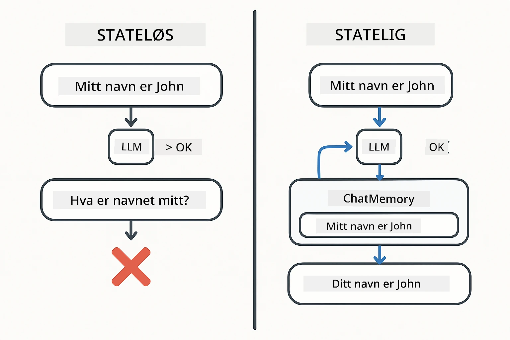
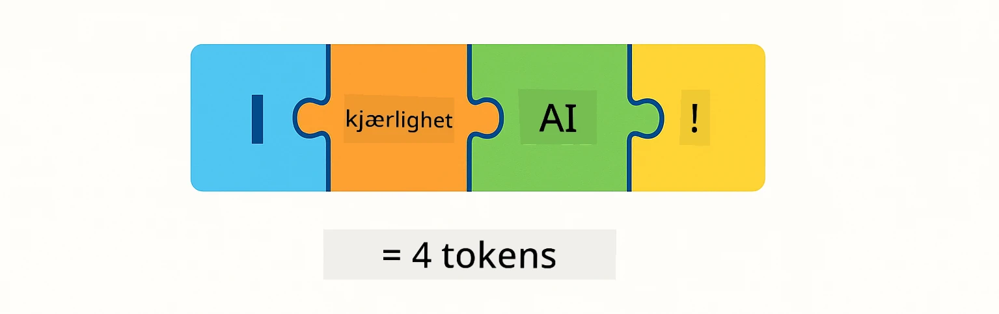
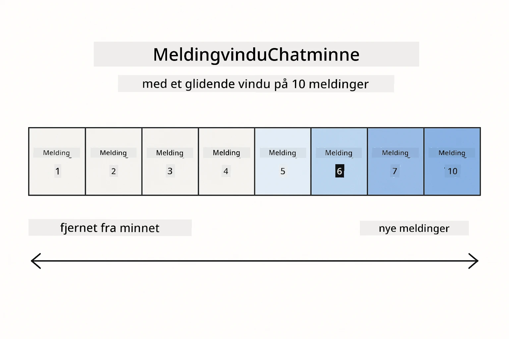
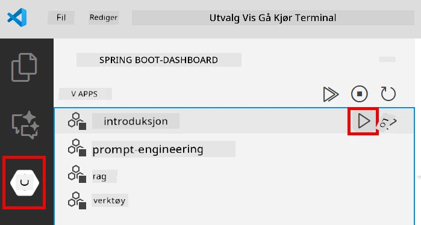
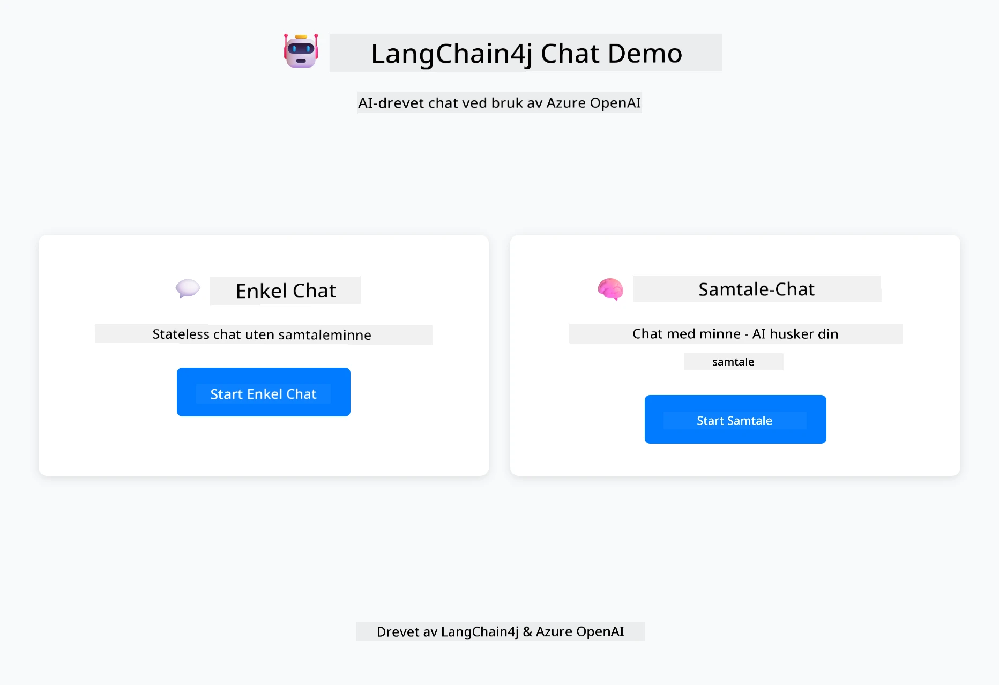
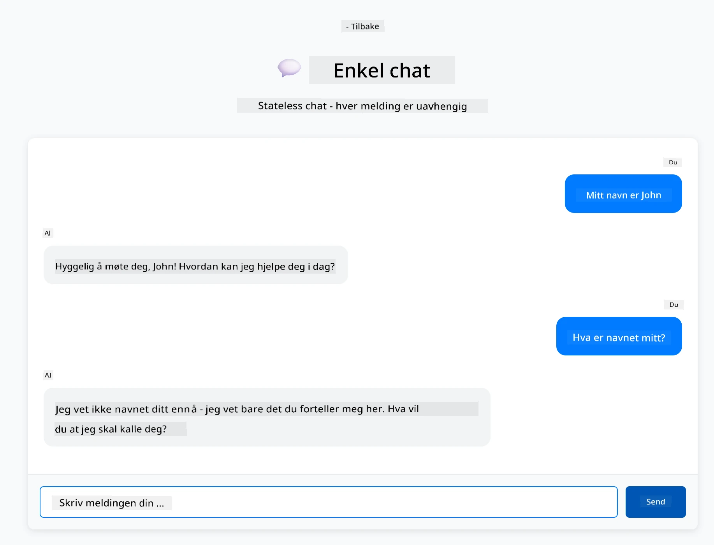
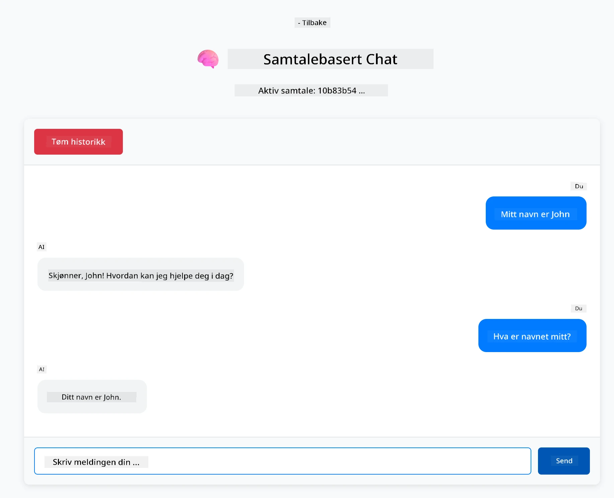

# Modul 01: Komme i gang med LangChain4j

## Innholdsfortegnelse

- [Video Gjennomgang](#video-gjennomgang)
- [Det du vil lære](#det-du-vil-lære)
- [Forutsetninger](#forutsetninger)
- [Forstå kjernen i problemet](#forstå-kjernen-i-problemet)
- [Forstå tokens](#forstå-tokens)
- [Hvordan minnet fungerer](#hvordan-minnet-fungerer)
- [Hvordan dette bruker LangChain4j](#hvordan-dette-bruker-langchain4j)
- [Distribuer Azure OpenAI-infrastruktur](#distribuer-azure-openai-infrastruktur)
- [Kjør applikasjonen lokalt](#kjør-applikasjonen-lokalt)
- [Bruke applikasjonen](#bruke-applikasjonen)
  - [Stateless Chat (venstre panel)](#stateless-chat-venstre-panel)
  - [Stateful Chat (høyre panel)](#stateful-chat-høyre-panel)
- [Neste steg](#neste-steg)

## Video Gjennomgang

Se denne livesesjonen som forklarer hvordan du kommer i gang med denne modulen:

<a href="https://www.youtube.com/live/nl_troDm8rQ?si=6b85S8xGjWnT2fX9"></a>

## Det du vil lære

Dette er ditt startpunkt med LangChain4j og Azure OpenAI. Vi begynner med det grunnleggende og starter byggingen av produksjonslignende applikasjoner. Denne modulen fokuserer på konversasjons-AI som husker kontekst og opprettholder tilstand — de grunnleggende konseptene alle senere moduler bygger videre på.

Vi bruker Azure OpenAI sin GPT-5.2 gjennom hele denne guiden fordi dens avanserte resonneringsevner gjør oppførselen til forskjellige mønstre mer tydelig. Når du legger til minne, vil du klart se forskjellen. Dette gjør det enklere å forstå hva hver komponent tilfører applikasjonen din.

Du vil bygge én applikasjon som demonstrerer begge mønstrene:

**Stateless Chat** - Hver forespørsel er uavhengig. Modellen har ikke noe minne om tidligere meldinger. Dette er det enkleste startpunktet.

**Stateful Conversation** - Hver forespørsel inkluderer samtalehistorikk. Modellen opprettholder kontekst over flere runder. Dette er hva produksjonsapplikasjoner krever.

## Forutsetninger

- Azure-abonnement med tilgang til Azure OpenAI
- Java 21, Maven 3.9+
- Azure CLI (https://learn.microsoft.com/en-us/cli/azure/install-azure-cli)
- Azure Developer CLI (azd) (https://learn.microsoft.com/en-us/azure/developer/azure-developer-cli/install-azd)

> **Merk:** Java, Maven, Azure CLI og Azure Developer CLI (azd) er forhåndsinstallert i den medfølgende devcontaineren.

> **Merk:** Denne modulen bruker GPT-5.2 på Azure OpenAI. Distribusjonen konfigureres automatisk via `azd up` - ikke endre modellnavnet i koden.

## Forstå kjernen i problemet

Språkmodeller er stateless. Hver API-kall er uavhengig. Hvis du sender "Mitt navn er John" og så spør "Hva heter jeg?", har ikke modellen noe anelse om at du nettopp presenterte deg. Den behandler hver forespørsel som om det er den første samtalen du noensinne har hatt.

Dette går bra for enkle spørsmål og svar, men er ubrukelig for reelle applikasjoner. Kundeserviceboter må huske hva du fortalte dem. Personlige assistenter trenger kontekst. Enhver samtale med flere runder krever minne.

Diagrammet nedenfor kontrasterer de to tilnærmingene — til venstre, en stateless kall som glemmer navnet ditt; til høyre, et stateful kall med ChatMemory som husker det.



*Forskjellen mellom stateless (uavhengige kall) og stateful (kontekstbevisste) samtaler*

## Forstå tokens

Før du dykker inn i samtaler, er det viktig å forstå tokens - de grunnleggende enhetene av tekst som språkmodeller prosesserer:



*Eksempel på hvordan tekst deles opp i tokens - "I love AI!" blir til 4 separate prosesseringsenheter*

Tokens er hvordan AI-modeller måler og prosesserer tekst. Ord, tegnsetting og til og med mellomrom kan være tokens. Modellen din har en grense for hvor mange tokens den kan prosessere samtidig (400 000 for GPT-5.2, med opptil 272 000 input tokens og 128 000 output tokens). Å forstå tokens hjelper deg å styre samtalelengde og kostnader.

## Hvordan minnet fungerer

Chat-minne løser det stateless problemet ved å opprettholde samtalehistorikk. Før du sender forespørselen til modellen, legger rammeverket til relevante tidligere meldinger foran. Når du spør "Hva heter jeg?", sender systemet faktisk hele samtalehistorikken, slik at modellen ser at du tidligere sa "Mitt navn er John."

LangChain4j tilbyr minneimplementasjoner som håndterer dette automatisk. Du velger hvor mange meldinger som skal beholdes, og rammeverket styrer kontekstvinduet. Diagrammet under viser hvordan MessageWindowChatMemory opprettholder et glidevindu av nylige meldinger.



*MessageWindowChatMemory opprettholder et glidevindu av nylige meldinger, og fjerner automatisk eldre*

## Hvordan dette bruker LangChain4j

Denne modulen integrerer Spring Boot og legger til samtaleminne. Slik passer delene sammen:

**Avhengigheter** - Legg til to LangChain4j-biblioteker:

```xml
<dependency>
    <groupId>dev.langchain4j</groupId>
    <artifactId>langchain4j</artifactId> <!-- Inherited from BOM in root pom.xml -->
</dependency>
<dependency>
    <groupId>dev.langchain4j</groupId>
    <artifactId>langchain4j-open-ai-official</artifactId> <!-- Inherited from BOM in root pom.xml -->
</dependency>
```

**Chat-modell** - Konfigurer Azure OpenAI som en Spring bean ([LangChainConfig.java](../../../01-introduction/src/main/java/com/example/langchain4j/config/LangChainConfig.java)):

```java
@Bean
public OpenAiOfficialChatModel openAiOfficialChatModel() {
    return OpenAiOfficialChatModel.builder()
            .baseUrl(azureEndpoint)
            .apiKey(azureApiKey)
            .modelName(deploymentName)
            .timeout(Duration.ofMinutes(5))
            .maxRetries(3)
            .build();
}
```

Builderen leser legitimasjon fra miljøvariabler som settes av `azd up`. Å sette `baseUrl` til din Azure-endepunkt gjør at OpenAI-klienten fungerer med Azure OpenAI.

**Samtaleminne** - Spor chatthistorikk med MessageWindowChatMemory ([ConversationService.java](../../../01-introduction/src/main/java/com/example/langchain4j/service/ConversationService.java)):

```java
ChatMemory memory = MessageWindowChatMemory.withMaxMessages(10);

memory.add(UserMessage.from("My name is John"));
memory.add(AiMessage.from("Nice to meet you, John!"));

memory.add(UserMessage.from("What's my name?"));
AiMessage aiMessage = chatModel.chat(memory.messages()).aiMessage();
memory.add(aiMessage);
```

Lag minnet med `withMaxMessages(10)` for å holde de siste 10 meldingene. Legg til bruker- og AI-meldinger med typed wrappers: `UserMessage.from(text)` og `AiMessage.from(text)`. Hent historien med `memory.messages()` og send det til modellen. Tjenesten lagrer separate minneinstanser per samtale-ID, slik at flere brukere kan chatte samtidig.

> **🤖 Prøv med [GitHub Copilot](https://github.com/features/copilot) Chat:** Åpne [`ConversationService.java`](../../../01-introduction/src/main/java/com/example/langchain4j/service/ConversationService.java) og spør:
> - "Hvordan bestemmer MessageWindowChatMemory hvilke meldinger som fjernes når vinduet er fullt?"
> - "Kan jeg implementere egendefinert minnelagring ved å bruke en database i stedet for minne?"
> - "Hvordan kan jeg legge til oppsummering for å komprimere gammel samtalehistorikk?"

Stateless chat-endepunktet hopper helt over minnet - bare `chatModel.chat(prompt)` som i rask start. Stateful endepunktet legger meldinger til minnet, henter historikk, og inkluderer den konteksten for hver forespørsel. Samme modellkonfigurasjon, forskjellige mønstre.

## Distribuer Azure OpenAI-infrastruktur

**Bash:**
```bash
cd 01-introduction
azd up  # Velg abonnement og plassering (eastus2 anbefales)
```

**PowerShell:**
```powershell
cd 01-introduction
azd up  # Velg abonnement og plassering (eastus2 anbefales)
```

> **Merk:** Hvis du møter en timeout-feil (`RequestConflict: Cannot modify resource ... provisioning state is not terminal`), kjør bare `azd up` igjen. Azure-ressurser kan fortsatt holde på å bli opprettet i bakgrunnen, og ny kjøring lar distribusjonen fullføre når ressursene når en terminal tilstand.

Dette vil:
1. Distribuere Azure OpenAI-ressursen med GPT-5.2 og text-embedding-3-small modeller
2. Automatisk generere `.env`-fil i prosjektrot med legitimasjon
3. Sette opp alle nødvendige miljøvariabler

**Har du problemer med distribusjon?** Se [Infrastructure README](infra/README.md) for detaljert feilsøking inkludert konflikter med subdomener, manuelle steg for deploy i Azure-portalen, og retningslinjer for modell-konfigurasjon.

**Verifiser at distribusjonen lyktes:**

**Bash:**
```bash
cat ../.env  # Skal vise AZURE_OPENAI_ENDPOINT, API_KEY, osv.
```

**PowerShell:**
```powershell
Get-Content ..\.env  # Skal vise AZURE_OPENAI_ENDPOINT, API_KEY, osv.
```

> **Merk:** `azd up`-kommandoen genererer automatisk `.env`-filen. Hvis du trenger å oppdatere den senere, kan du enten redigere `.env`-filen manuelt eller regenerere den ved å kjøre:
>
> **Bash:**
> ```bash
> cd ..
> bash .azd-env.sh
> ```
>
> **PowerShell:**
> ```powershell
> cd ..
> .\.azd-env.ps1
> ```

## Kjør applikasjonen lokalt

**Verifiser distribusjonen:**

Sørg for at `.env`-filen finnes i rotkatalogen med Azure-legitimasjon. Kjør dette fra modulkatalogen (`01-introduction/`):

**Bash:**
```bash
cat ../.env  # Skal vise AZURE_OPENAI_ENDPOINT, API_KEY, DEPLOYMENT
```

**PowerShell:**
```powershell
Get-Content ..\.env  # Bør vise AZURE_OPENAI_ENDPOINT, API_KEY, DEPLOYMENT
```

**Start applikasjonene:**

**Alternativ 1: Bruke Spring Boot Dashboard (Anbefalt for VS Code-brukere)**

Devcontaineren inkluderer Spring Boot Dashboard-utvidelsen, som gir et visuelt grensesnitt for å håndtere alle Spring Boot-applikasjoner. Du finner den i Aktivitetslinjen på venstre side i VS Code (se etter Spring Boot-ikonet).

Fra Spring Boot Dashboard kan du:
- Se alle tilgjengelige Spring Boot-applikasjoner i arbeidsområdet
- Starte/stoppe applikasjoner med ett klikk
- Se applikasjonslogger i sanntid
- Overvåke applikasjonsstatus

Klikk bare på play-knappen ved siden av "introduction" for å starte denne modulen, eller start alle modulene samtidig.



*Spring Boot Dashboard i VS Code — start, stopp og overvåk alle moduler fra ett sted*

**Alternativ 2: Bruke shell-skript**

Start alle webapplikasjoner (moduler 01-04):

**Bash:**
```bash
cd ..  # Fra rotkatalogen
./start-all.sh
```

**PowerShell:**
```powershell
cd ..  # Fra rotkatalogen
.\start-all.ps1
```

Eller start kun denne modulen:

**Bash:**
```bash
cd 01-introduction
./start.sh
```

**PowerShell:**
```powershell
cd 01-introduction
.\start.ps1
```

Begge skriptene laster automatisk miljøvariabler fra rotens `.env`-fil og bygger JAR-filene hvis de ikke finnes.

> **Merk:** Hvis du foretrekker å bygge alle moduler manuelt før oppstart:
>
> **Bash:**
> ```bash
> cd ..  # Go to root directory
> mvn clean package -DskipTests
> ```
>
> **PowerShell:**
> ```powershell
> cd ..  # Go to root directory
> mvn clean package -DskipTests
> ```

Åpne http://localhost:8080 i nettleseren din.

**For å stoppe:**

**Bash:**
```bash
./stop.sh  # Bare denne modulen
# Eller
cd .. && ./stop-all.sh  # Alle moduler
```

**PowerShell:**
```powershell
.\stop.ps1  # Kun denne modulen
# Eller
cd ..; .\stop-all.ps1  # Alle moduler
```

## Bruke applikasjonen

Applikasjonen tilbyr et nettgrensesnitt med to chat-implementeringer side om side.



*Dashboard som viser både Simple Chat (stateless) og Conversational Chat (stateful) alternativer*

### Stateless Chat (venstre panel)

Prøv dette først. Spør "Mitt navn er John" og spør så umiddelbart "Hva heter jeg?" Modellen vil ikke huske fordi hver melding er uavhengig. Dette demonstrerer kjerneproblemet med enkel språkmodell-integrasjon - ingen samtalekontekst.



*AI husker ikke navnet ditt fra forrige melding*

### Stateful Chat (høyre panel)

Prøv nå samme sekvens her. Spør "Mitt navn er John" og så "Hva heter jeg?" Denne gangen husker den det. Forskjellen er MessageWindowChatMemory - den opprettholder samtalehistorikk og inkluderer den med hver forespørsel. Slik fungerer produksjonsklar konversasjons-AI.



*AI husker navnet ditt fra tidligere i samtalen*

Begge panelene bruker samme GPT-5.2-modell. Den eneste forskjellen er minnet. Dette gjør det tydelig hva minnet tilfører applikasjonen din og hvorfor det er essensielt for reelle bruksområder.

## Neste steg

**Neste modul:** [02-prompt-engineering - Prompt Engineering med GPT-5.2](../02-prompt-engineering/README.md)

---

**Navigasjon:** [← Tilbake til hovedside](../README.md) | [Neste: Modul 02 - Prompt Engineering →](../02-prompt-engineering/README.md)

---

<!-- CO-OP TRANSLATOR DISCLAIMER START -->
**Ansvarsfraskrivelse**:
Dette dokumentet er oversatt ved hjelp av AI-oversettelsestjenesten [Co-op Translator](https://github.com/Azure/co-op-translator). Selv om vi streber etter nøyaktighet, vær oppmerksom på at automatiske oversettelser kan inneholde feil eller unøyaktigheter. Det opprinnelige dokumentet på originalspråket skal betraktes som den autoritative kilden. For kritisk informasjon anbefales profesjonell menneskelig oversettelse. Vi er ikke ansvarlige for eventuelle misforståelser eller feiltolkninger som oppstår ved bruk av denne oversettelsen.
<!-- CO-OP TRANSLATOR DISCLAIMER END -->