<!--
CO_OP_TRANSLATOR_METADATA:
{
  "original_hash": "8d787826cad7e92bf5cdbd116b1e6116",
  "translation_date": "2025-12-13T16:12:48+00:00",
  "source_file": "02-prompt-engineering/README.md",
  "language_code": "no"
}
-->
# Modul 02: Prompt Engineering med GPT-5

## Innholdsfortegnelse

- [Hva du vil lære](../../../02-prompt-engineering)
- [Forutsetninger](../../../02-prompt-engineering)
- [Forstå Prompt Engineering](../../../02-prompt-engineering)
- [Hvordan dette bruker LangChain4j](../../../02-prompt-engineering)
- [Kjerne-mønstrene](../../../02-prompt-engineering)
- [Bruke eksisterende Azure-ressurser](../../../02-prompt-engineering)
- [Applikasjonsskjermbilder](../../../02-prompt-engineering)
- [Utforske mønstrene](../../../02-prompt-engineering)
  - [Lav vs Høy Iver](../../../02-prompt-engineering)
  - [Oppgaveutførelse (Verktøypreambler)](../../../02-prompt-engineering)
  - [Selvreflekterende kode](../../../02-prompt-engineering)
  - [Strukturert analyse](../../../02-prompt-engineering)
  - [Multi-turn chat](../../../02-prompt-engineering)
  - [Trinnvis resonnement](../../../02-prompt-engineering)
  - [Begrenset output](../../../02-prompt-engineering)
- [Hva du egentlig lærer](../../../02-prompt-engineering)
- [Neste steg](../../../02-prompt-engineering)

## Hva du vil lære

I forrige modul så du hvordan minne muliggjør samtale-AI og brukte GitHub-modeller for grunnleggende interaksjoner. Nå skal vi fokusere på hvordan du stiller spørsmål – selve promptene – ved bruk av Azure OpenAI sin GPT-5. Måten du strukturerer promptene dine på påvirker dramatisk kvaliteten på svarene du får.

Vi bruker GPT-5 fordi den introduserer kontroll over resonnement – du kan fortelle modellen hvor mye tenking den skal gjøre før den svarer. Dette gjør ulike prompting-strategier mer tydelige og hjelper deg å forstå når du skal bruke hver tilnærming. Vi drar også nytte av Azures færre ratebegrensninger for GPT-5 sammenlignet med GitHub-modeller.

## Forutsetninger

- Fullført Modul 01 (Azure OpenAI-ressurser distribuert)
- `.env`-fil i rotkatalogen med Azure-legitimasjon (opprettet av `azd up` i Modul 01)

> **Merk:** Hvis du ikke har fullført Modul 01, følg distribusjonsinstruksjonene der først.

## Forstå Prompt Engineering

Prompt engineering handler om å designe inndata-tekst som konsekvent gir deg de resultatene du trenger. Det handler ikke bare om å stille spørsmål – det handler om å strukturere forespørsler slik at modellen forstår nøyaktig hva du vil ha og hvordan det skal leveres.

Tenk på det som å gi instruksjoner til en kollega. "Fiks feilen" er vagt. "Fiks null pointer exception i UserService.java linje 45 ved å legge til en null-sjekk" er spesifikt. Språkmodeller fungerer på samme måte – spesifisitet og struktur er viktig.

## Hvordan dette bruker LangChain4j

Denne modulen demonstrerer avanserte prompting-mønstre ved bruk av samme LangChain4j-grunnlag som i tidligere moduler, med fokus på promptstruktur og kontroll over resonnement.

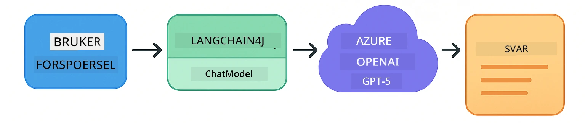

*Hvordan LangChain4j kobler dine prompts til Azure OpenAI GPT-5*

**Avhengigheter** – Modul 02 bruker følgende langchain4j-avhengigheter definert i `pom.xml`:
```xml
<dependency>
    <groupId>dev.langchain4j</groupId>
    <artifactId>langchain4j</artifactId> <!-- Inherited from BOM in root pom.xml -->
</dependency>
<dependency>
    <groupId>dev.langchain4j</groupId>
    <artifactId>langchain4j-open-ai-official</artifactId> <!-- Inherited from BOM in root pom.xml -->
</dependency>
```

**OpenAiOfficialChatModel-konfigurasjon** – [LangChainConfig.java](../../../02-prompt-engineering/src/main/java/com/example/langchain4j/prompts/config/LangChainConfig.java)

Chatmodellen er manuelt konfigurert som en Spring bean ved bruk av OpenAI Official-klienten, som støtter Azure OpenAI-endepunkter. Den viktigste forskjellen fra Modul 01 er hvordan vi strukturerer promptene som sendes til `chatModel.chat()`, ikke selve modelloppsettet.

**System- og brukermeldinger** – [Gpt5PromptService.java](../../../02-prompt-engineering/src/main/java/com/example/langchain4j/prompts/service/Gpt5PromptService.java)

LangChain4j skiller meldings-typer for klarhet. `SystemMessage` setter AI-ens oppførsel og kontekst (som "Du er en kodegjennomgårer"), mens `UserMessage` inneholder selve forespørselen. Denne separasjonen lar deg opprettholde konsistent AI-oppførsel på tvers av ulike brukerhenvendelser.

```java
SystemMessage systemMsg = SystemMessage.from(
    "You are a helpful Java programming expert."
);

UserMessage userMsg = UserMessage.from(
    "Explain what a List is in Java"
);

String response = chatModel.chat(systemMsg, userMsg);
```

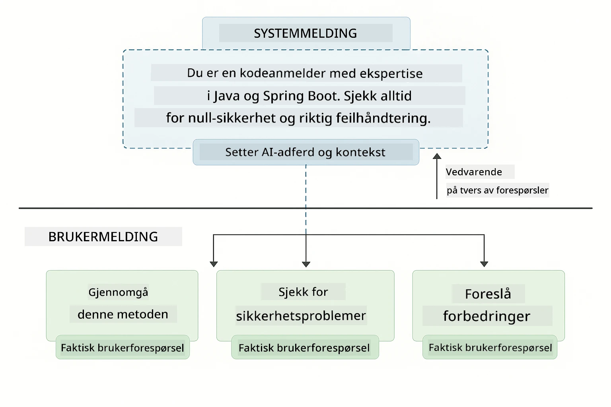

*SystemMessage gir vedvarende kontekst mens UserMessages inneholder individuelle forespørsler*

**MessageWindowChatMemory for Multi-Turn** – For mønsteret med multi-turn samtale gjenbruker vi `MessageWindowChatMemory` fra Modul 01. Hver sesjon får sin egen minneinstans lagret i en `Map<String, ChatMemory>`, som tillater flere samtidige samtaler uten kontekstblanding.

**Promptmaler** – Det virkelige fokuset her er prompt engineering, ikke nye LangChain4j-APIer. Hvert mønster (lav iver, høy iver, oppgaveutførelse osv.) bruker samme `chatModel.chat(prompt)`-metode, men med nøye strukturerte promptstrenger. XML-taggene, instruksjonene og formateringen er alle en del av promptteksten, ikke LangChain4j-funksjoner.

**Kontroll over resonnement** – GPT-5 sin resonnementinnsats styres gjennom promptinstruksjoner som "maksimalt 2 resonnementstrinn" eller "utforsk grundig". Dette er teknikker innen prompt engineering, ikke LangChain4j-konfigurasjoner. Biblioteket leverer bare promptene dine til modellen.

Hovedpoenget: LangChain4j tilbyr infrastrukturen (modelltilkobling via [LangChainConfig.java](../../../02-prompt-engineering/src/main/java/com/example/langchain4j/prompts/config/LangChainConfig.java), minne, meldingshåndtering via [Gpt5PromptService.java](../../../02-prompt-engineering/src/main/java/com/example/langchain4j/prompts/service/Gpt5PromptService.java)), mens denne modulen lærer deg hvordan du lager effektive prompts innenfor denne infrastrukturen.

## Kjerne-mønstrene

Ikke alle problemer trenger samme tilnærming. Noen spørsmål trenger raske svar, andre trenger dyp tenking. Noen trenger synlig resonnement, andre bare resultater. Denne modulen dekker åtte prompting-mønstre – hver optimalisert for ulike scenarier. Du vil eksperimentere med alle for å lære når hver tilnærming fungerer best.

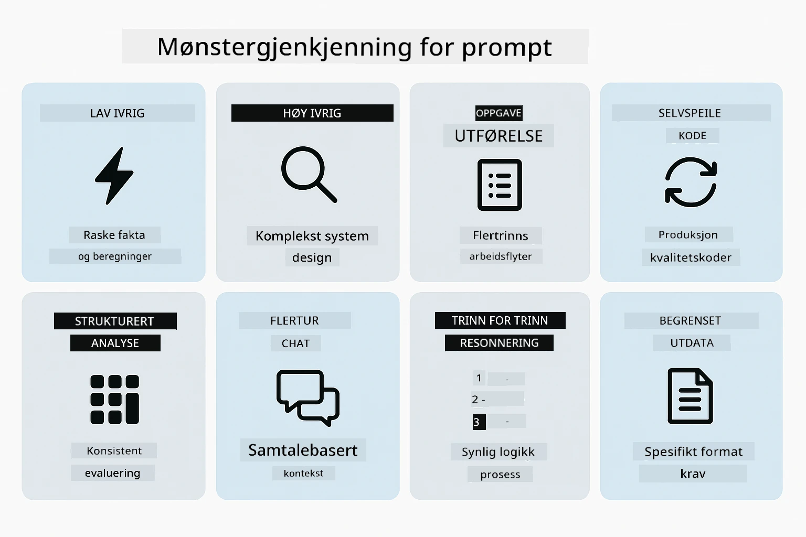

*Oversikt over de åtte prompt engineering-mønstrene og deres bruksområder*

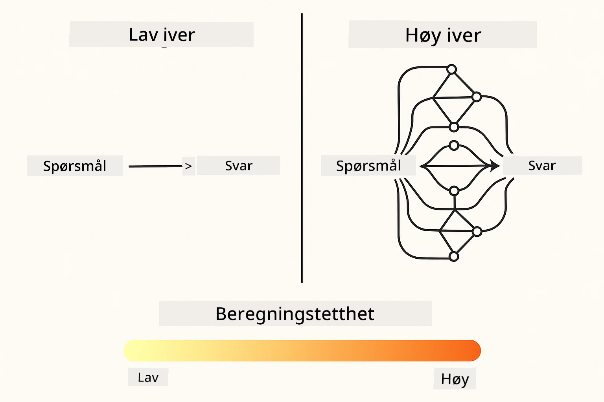

*Lav iver (rask, direkte) vs Høy iver (grundig, utforskende) resonnementstilnærminger*

**Lav Iver (Rask & Fokusert)** – For enkle spørsmål hvor du ønsker raske, direkte svar. Modellen gjør minimal resonnement – maks 2 trinn. Bruk dette for beregninger, oppslag eller enkle spørsmål.

```java
String prompt = """
    <reasoning_effort>low</reasoning_effort>
    <instruction>maximum 2 reasoning steps</instruction>
    
    What is 15% of 200?
    """;

String response = chatModel.chat(prompt);
```

> 💡 **Utforsk med GitHub Copilot:** Åpne [`Gpt5PromptService.java`](../../../02-prompt-engineering/src/main/java/com/example/langchain4j/prompts/service/Gpt5PromptService.java) og spør:
> - "Hva er forskjellen mellom lav iver og høy iver prompting-mønstre?"
> - "Hvordan hjelper XML-taggene i promptene med å strukturere AI-ens svar?"
> - "Når bør jeg bruke selvrefleksjonsmønstre vs direkte instruksjon?"

**Høy Iver (Dyp & Grundig)** – For komplekse problemer hvor du ønsker omfattende analyse. Modellen utforsker grundig og viser detaljert resonnement. Bruk dette for systemdesign, arkitekturvalg eller kompleks forskning.

```java
String prompt = """
    <reasoning_effort>high</reasoning_effort>
    <instruction>explore thoroughly, show detailed reasoning</instruction>
    
    Design a caching strategy for a high-traffic REST API.
    """;

String response = chatModel.chat(prompt);
```

**Oppgaveutførelse (Trinnvis fremdrift)** – For arbeidsflyter med flere steg. Modellen gir en plan på forhånd, forteller om hvert steg mens den jobber, og gir deretter en oppsummering. Bruk dette for migrasjoner, implementeringer eller enhver flertrinnsprosess.

```java
String prompt = """
    <task>Create a REST endpoint for user registration</task>
    <preamble>Provide an upfront plan</preamble>
    <narration>Narrate each step as you work</narration>
    <summary>Summarize what was accomplished</summary>
    """;

String response = chatModel.chat(prompt);
```

Chain-of-Thought prompting ber eksplisitt modellen vise sin resonnementprosess, noe som forbedrer nøyaktigheten for komplekse oppgaver. Den trinnvise nedbrytningen hjelper både mennesker og AI å forstå logikken.

> **🤖 Prøv med [GitHub Copilot](https://github.com/features/copilot) Chat:** Spør om dette mønsteret:
> - "Hvordan kan jeg tilpasse oppgaveutførelsesmønsteret for langvarige operasjoner?"
> - "Hva er beste praksis for å strukturere verktøypreambler i produksjonsapplikasjoner?"
> - "Hvordan kan jeg fange og vise mellomliggende fremdriftsoppdateringer i en UI?"

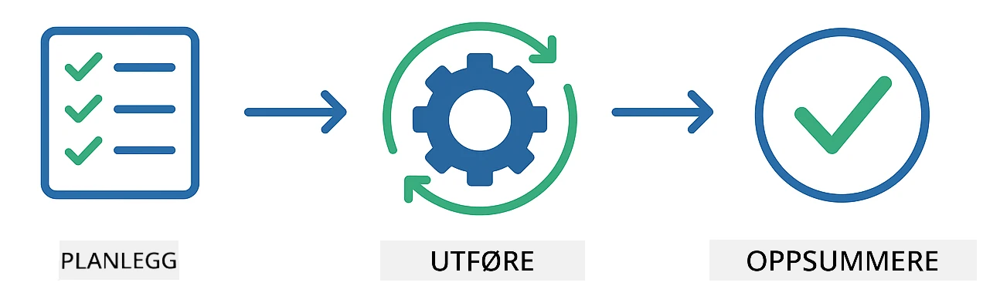

*Planlegg → Utfør → Oppsummer arbeidsflyt for flertrinnsoppgaver*

**Selvreflekterende kode** – For å generere produksjonsklar kode. Modellen genererer kode, sjekker den mot kvalitetskriterier, og forbedrer den iterativt. Bruk dette når du bygger nye funksjoner eller tjenester.

```java
String prompt = """
    <task>Create an email validation service</task>
    <quality_criteria>
    - Correct logic and error handling
    - Best practices (clean code, proper naming)
    - Performance optimization
    - Security considerations
    </quality_criteria>
    <instruction>Generate code, evaluate against criteria, improve iteratively</instruction>
    """;

String response = chatModel.chat(prompt);
```

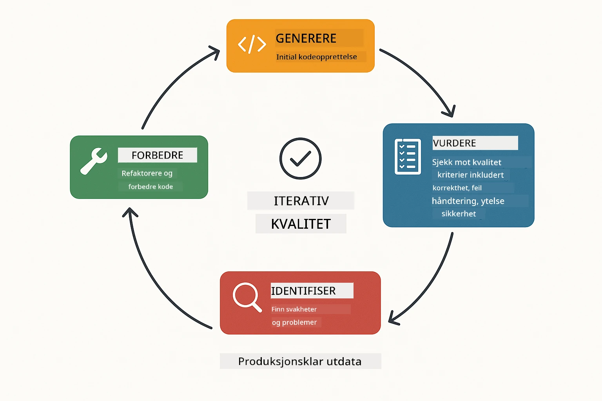

*Iterativ forbedringssløyfe – generer, evaluer, identifiser problemer, forbedre, gjenta*

**Strukturert analyse** – For konsistent evaluering. Modellen gjennomgår kode ved bruk av et fast rammeverk (korrekthet, praksis, ytelse, sikkerhet). Bruk dette for kodegjennomganger eller kvalitetsvurderinger.

```java
String prompt = """
    <code>
    public List getUsers() {
        return database.query("SELECT * FROM users");
    }
    </code>
    
    <framework>
    Evaluate using these categories:
    1. Correctness - Logic and functionality
    2. Best Practices - Code quality
    3. Performance - Efficiency concerns
    4. Security - Vulnerabilities
    </framework>
    """;

String response = chatModel.chat(prompt);
```

> **🤖 Prøv med [GitHub Copilot](https://github.com/features/copilot) Chat:** Spør om strukturert analyse:
> - "Hvordan kan jeg tilpasse analyse-rammeverket for ulike typer kodegjennomganger?"
> - "Hva er beste måte å analysere og handle på strukturert output programmatisk?"
> - "Hvordan sikrer jeg konsistente alvorlighetsnivåer på tvers av ulike gjennomgangssesjoner?"

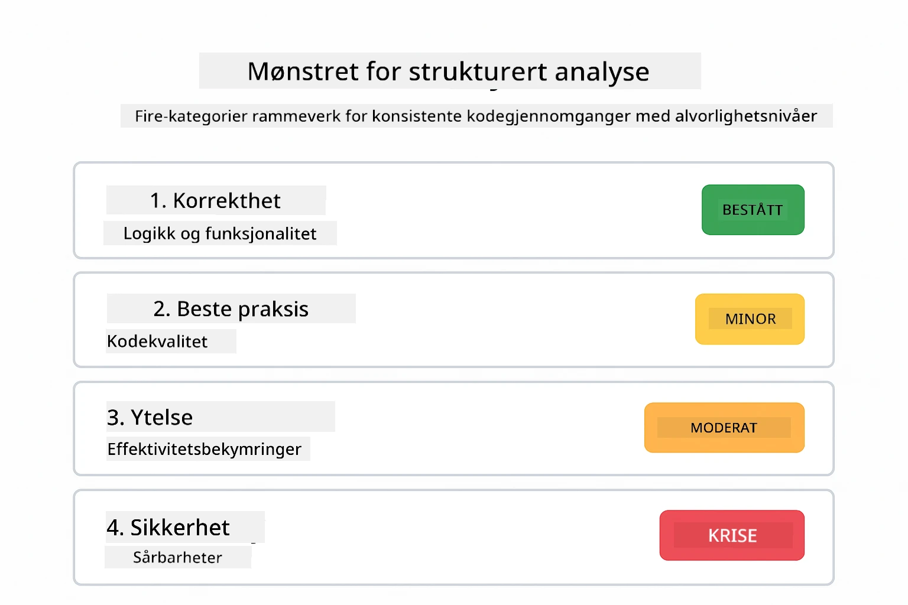

*Fire-kategori rammeverk for konsistente kodegjennomganger med alvorlighetsnivåer*

**Multi-turn chat** – For samtaler som trenger kontekst. Modellen husker tidligere meldinger og bygger videre på dem. Bruk dette for interaktive hjelpesesjoner eller komplekse spørsmål og svar.

```java
ChatMemory memory = MessageWindowChatMemory.withMaxMessages(10);

memory.add(UserMessage.from("What is Spring Boot?"));
AiMessage aiMessage1 = chatModel.chat(memory.messages()).aiMessage();
memory.add(aiMessage1);

memory.add(UserMessage.from("Show me an example"));
AiMessage aiMessage2 = chatModel.chat(memory.messages()).aiMessage();
memory.add(aiMessage2);
```

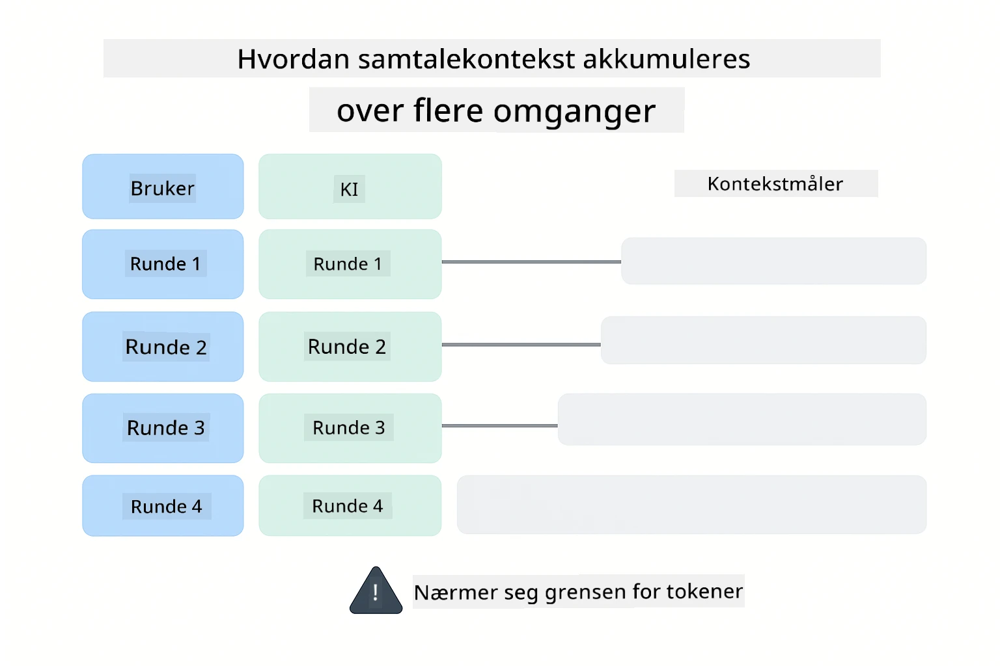

*Hvordan samtalekontekst akkumuleres over flere runder inntil token-grensen nås*

**Trinnvis resonnement** – For problemer som krever synlig logikk. Modellen viser eksplisitt resonnement for hvert steg. Bruk dette for matteoppgaver, logikkpuslespill eller når du trenger å forstå tenkeprosessen.

```java
String prompt = """
    <instruction>Show your reasoning step-by-step</instruction>
    
    If a train travels 120 km in 2 hours, then stops for 30 minutes,
    then travels another 90 km in 1.5 hours, what is the average speed
    for the entire journey including the stop?
    """;

String response = chatModel.chat(prompt);
```

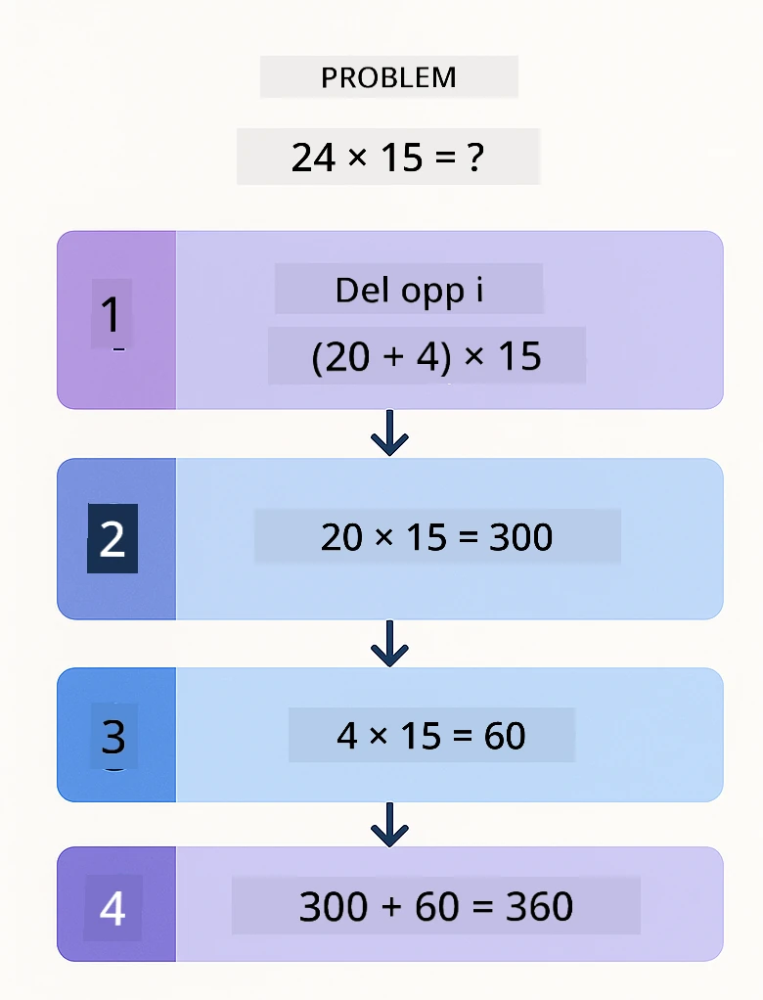

*Nedbrytning av problemer i eksplisitte logiske trinn*

**Begrenset output** – For svar med spesifikke formatkrav. Modellen følger strengt format- og lengderegler. Bruk dette for sammendrag eller når du trenger presis outputstruktur.

```java
String prompt = """
    <constraints>
    - Exactly 100 words
    - Bullet point format
    - Technical terms only
    </constraints>
    
    Summarize the key concepts of machine learning.
    """;

String response = chatModel.chat(prompt);
```

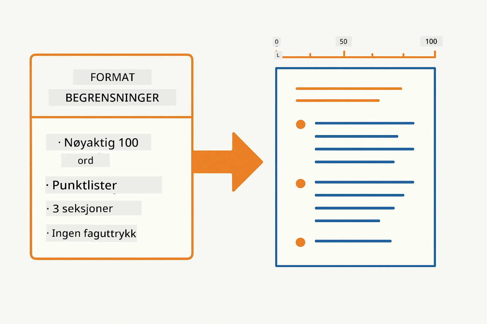

*Håndheving av spesifikke format-, lengde- og strukturkrav*

## Bruke eksisterende Azure-ressurser

**Verifiser distribusjon:**

Sørg for at `.env`-filen finnes i rotkatalogen med Azure-legitimasjon (opprettet under Modul 01):
```bash
cat ../.env  # Skal vise AZURE_OPENAI_ENDPOINT, API_KEY, DEPLOYMENT
```

**Start applikasjonen:**

> **Merk:** Hvis du allerede startet alle applikasjoner med `./start-all.sh` fra Modul 01, kjører denne modulen allerede på port 8083. Du kan hoppe over startkommandoene nedenfor og gå direkte til http://localhost:8083.

**Alternativ 1: Bruke Spring Boot Dashboard (Anbefalt for VS Code-brukere)**

Dev-containeren inkluderer Spring Boot Dashboard-utvidelsen, som gir et visuelt grensesnitt for å administrere alle Spring Boot-applikasjoner. Du finner den i Aktivitetslinjen på venstre side i VS Code (se etter Spring Boot-ikonet).

Fra Spring Boot Dashboard kan du:
- Se alle tilgjengelige Spring Boot-applikasjoner i arbeidsområdet
- Starte/stoppe applikasjoner med ett klikk
- Se applikasjonslogger i sanntid
- Overvåke applikasjonsstatus

Klikk bare på play-knappen ved siden av "prompt-engineering" for å starte denne modulen, eller start alle moduler samtidig.

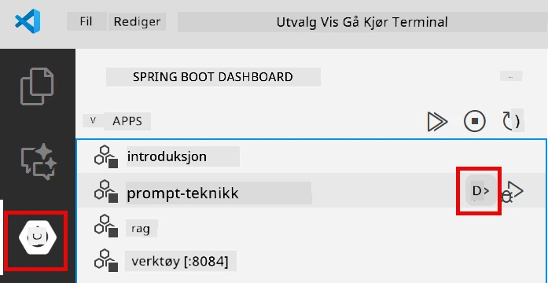

**Alternativ 2: Bruke shell-skript**

Start alle webapplikasjoner (moduler 01-04):

**Bash:**
```bash
cd ..  # Fra rotkatalogen
./start-all.sh
```

**PowerShell:**
```powershell
cd ..  # Fra rotkatalogen
.\start-all.ps1
```

Eller start bare denne modulen:

**Bash:**
```bash
cd 02-prompt-engineering
./start.sh
```

**PowerShell:**
```powershell
cd 02-prompt-engineering
.\start.ps1
```

Begge skriptene laster automatisk miljøvariabler fra rotens `.env`-fil og bygger JAR-filene hvis de ikke finnes.

> **Merk:** Hvis du foretrekker å bygge alle moduler manuelt før oppstart:
>
> **Bash:**
> ```bash
> cd ..  # Go to root directory
> mvn clean package -DskipTests
> ```
>
> **PowerShell:**
> ```powershell
> cd ..  # Go to root directory
> mvn clean package -DskipTests
> ```

Åpne http://localhost:8083 i nettleseren din.

**For å stoppe:**

**Bash:**
```bash
./stop.sh  # Kun denne modulen
# Eller
cd .. && ./stop-all.sh  # Alle moduler
```

**PowerShell:**
```powershell
.\stop.ps1  # Kun denne modulen
# Eller
cd ..; .\stop-all.ps1  # Alle moduler
```

## Applikasjonsskjermbilder

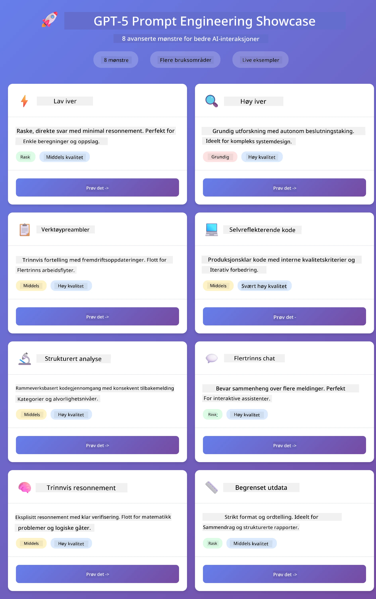

*Hoveddashbord som viser alle 8 prompt engineering-mønstre med deres egenskaper og bruksområder*

## Utforske mønstrene

Webgrensesnittet lar deg eksperimentere med ulike prompting-strategier. Hvert mønster løser forskjellige problemer – prøv dem for å se når hver tilnærming fungerer best.

### Lav vs Høy Iver

Still et enkelt spørsmål som "Hva er 15 % av 200?" med Lav Iver. Du får et øyeblikkelig, direkte svar. Still nå noe komplekst som "Design en caching-strategi for en høytrafikkert API" med Høy Iver. Se hvordan modellen senker tempoet og gir detaljert resonnement. Samme modell, samme spørsmålsstruktur – men prompten forteller hvor mye tenking som skal gjøres.

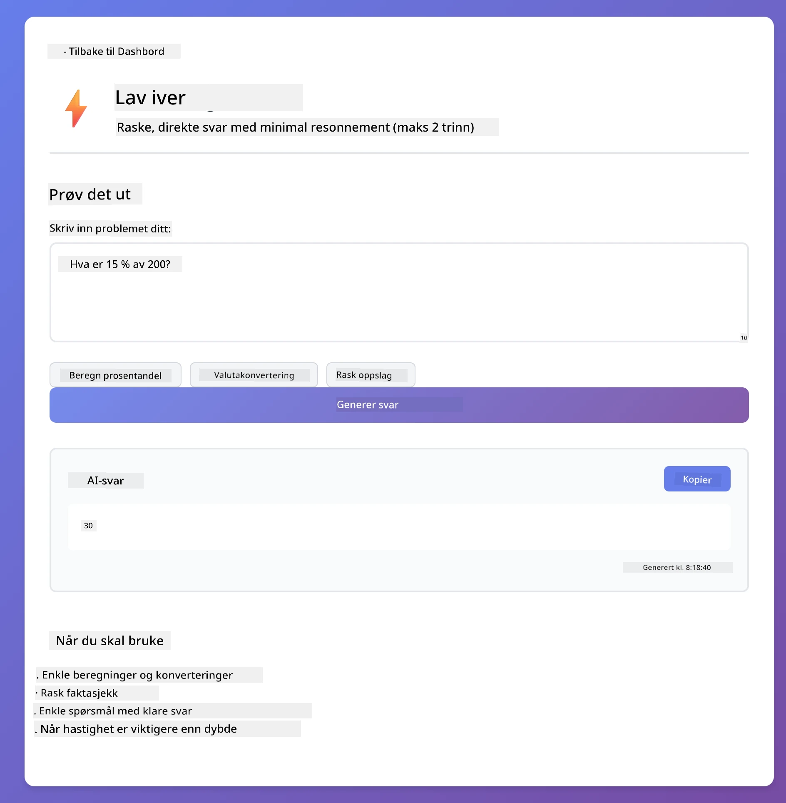
*Rask beregning med minimal resonnement*

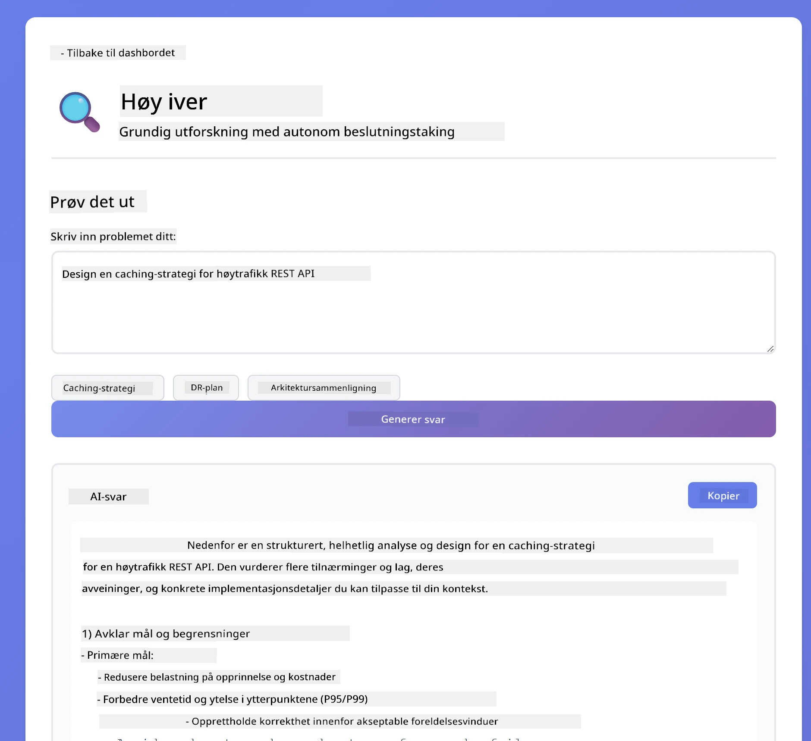

*Omfattende hurtigbufferstrategi (2,8MB)*

### Oppgaveutførelse (Verktøypreambler)

Flertrinns arbeidsflyter drar nytte av forhåndsplanlegging og fremdriftsfortelling. Modellen skisserer hva den vil gjøre, forteller om hvert trinn, og oppsummerer deretter resultatene.

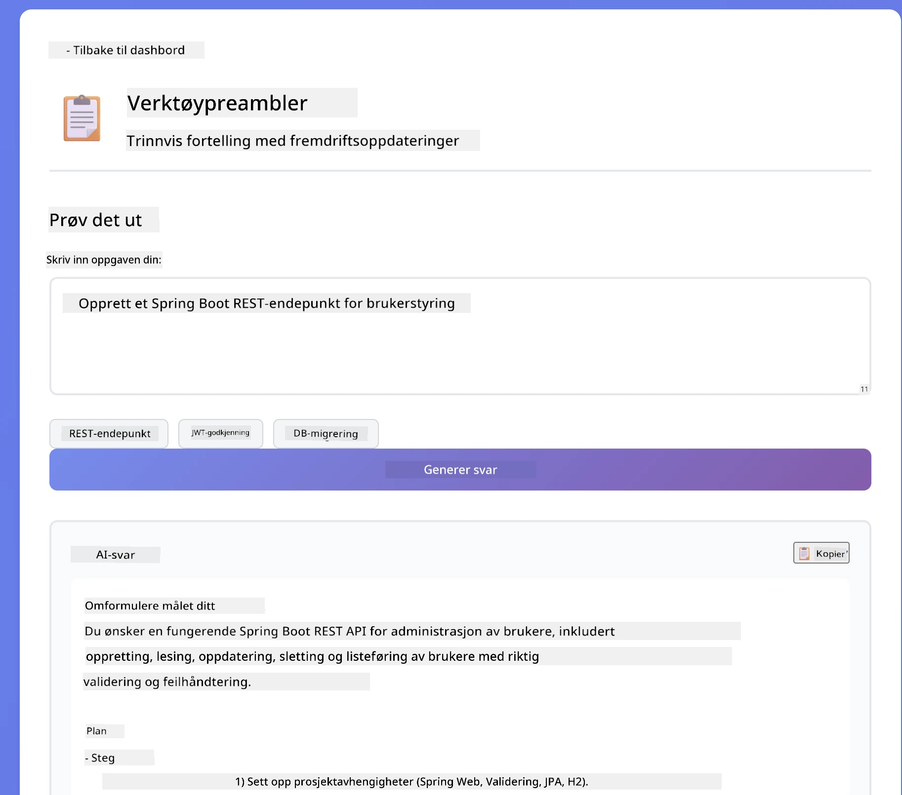

*Opprette et REST-endepunkt med trinnvis fortelling (3,9MB)*

### Selvreflekterende kode

Prøv "Lag en e-postvalideringstjeneste". I stedet for bare å generere kode og stoppe, genererer modellen, evaluerer mot kvalitetskriterier, identifiserer svakheter og forbedrer. Du vil se den iterere til koden møter produksjonsstandarder.

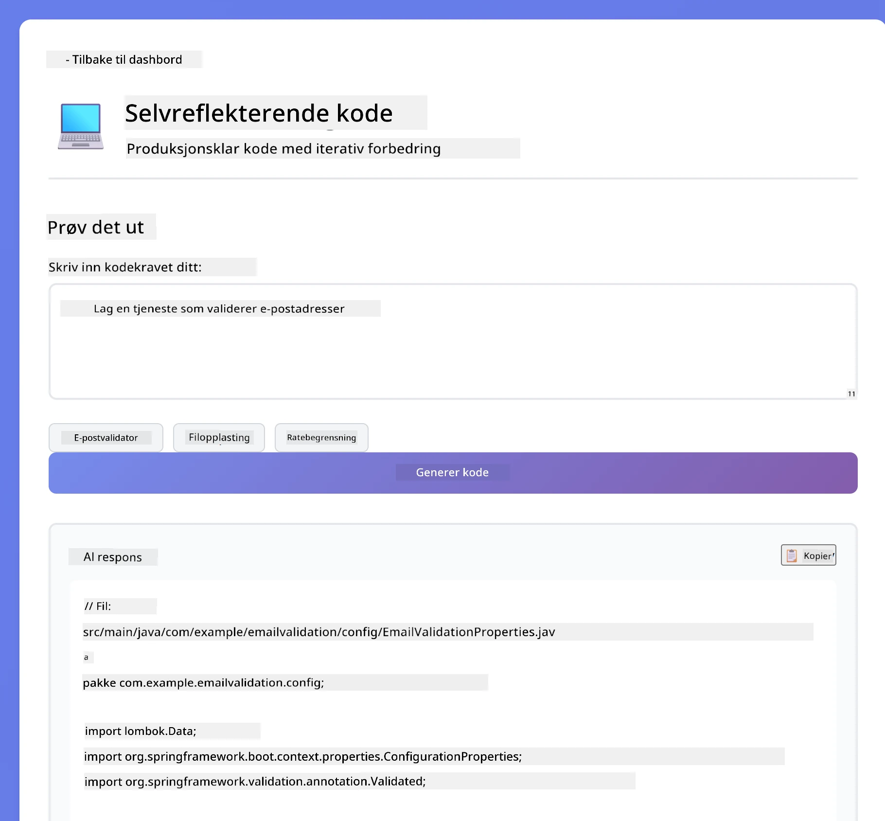

*Fullstendig e-postvalideringstjeneste (5,2MB)*

### Strukturert analyse

Kodegjennomganger trenger konsistente evalueringsrammer. Modellen analyserer kode ved hjelp av faste kategorier (korrekthet, praksis, ytelse, sikkerhet) med alvorlighetsnivåer.

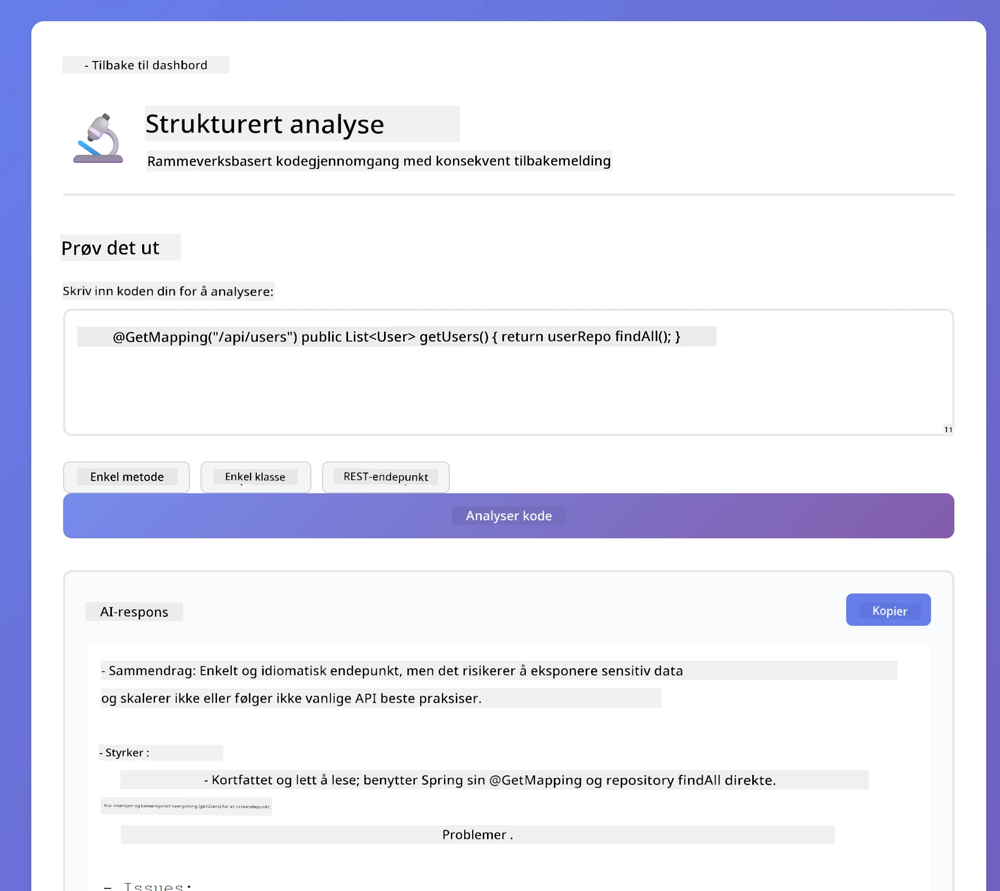

*Rammeverksbasert kodegjennomgang*

### Flertrinns chat

Spør "Hva er Spring Boot?" og følg umiddelbart opp med "Vis meg et eksempel". Modellen husker ditt første spørsmål og gir deg et Spring Boot-eksempel spesifikt. Uten minne ville det andre spørsmålet vært for vagt.

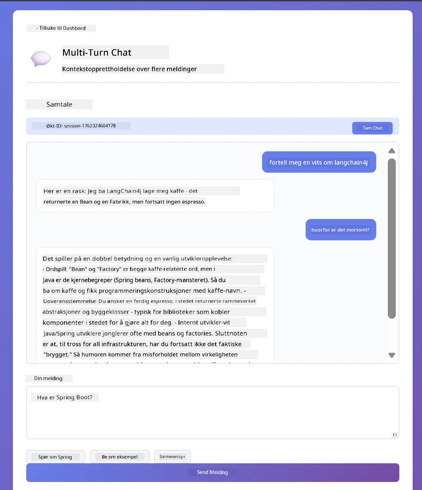

*Bevaring av kontekst på tvers av spørsmål*

### Trinnvis resonnement

Velg et mattestykke og prøv det med både trinnvis resonnement og lav iver. Lav iver gir deg bare svaret – raskt, men utydelig. Trinnvis viser deg hver beregning og beslutning.

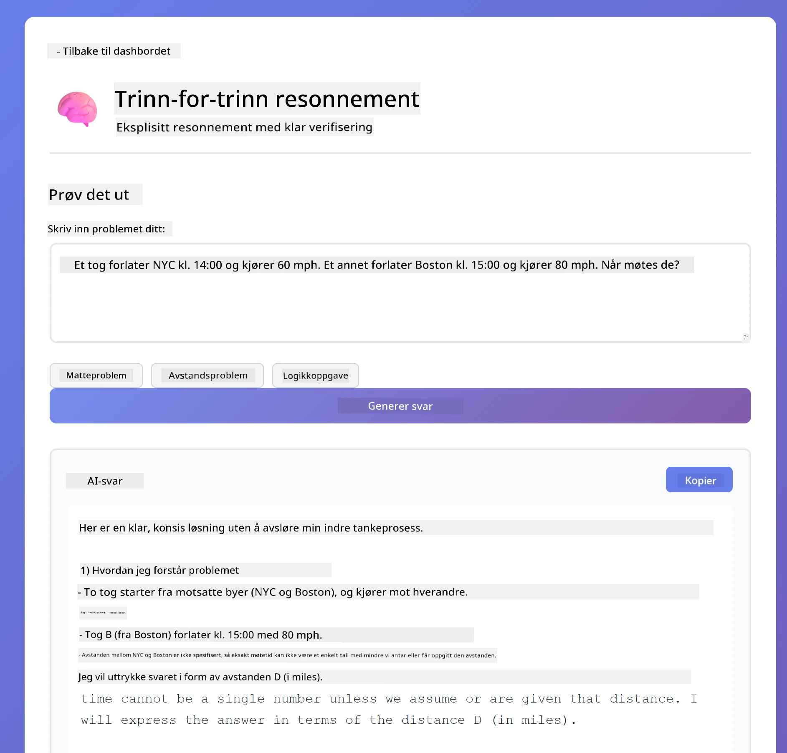

*Matteproblem med eksplisitte trinn*

### Begrenset utdata

Når du trenger spesifikke formater eller ordtellinger, håndhever dette mønsteret streng overholdelse. Prøv å generere et sammendrag med nøyaktig 100 ord i punktlisteformat.

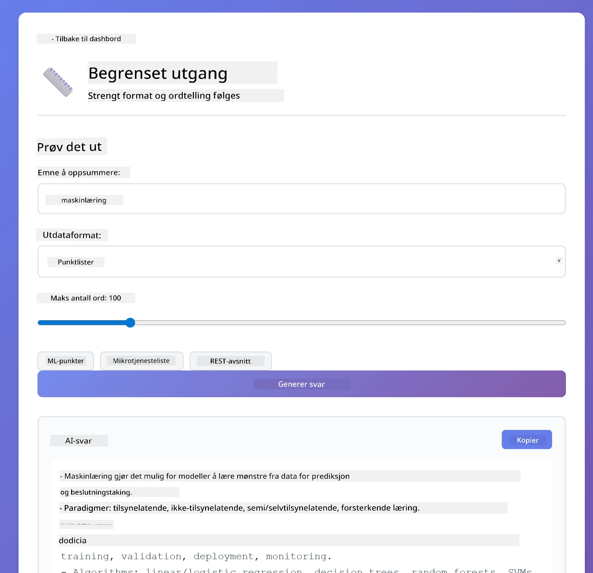

*Sammendrag av maskinlæring med formatkontroll*

## Hva du egentlig lærer

**Resonneringsinnsats endrer alt**

GPT-5 lar deg kontrollere beregningsinnsatsen gjennom dine prompt. Lav innsats betyr raske svar med minimal utforskning. Høy innsats betyr at modellen tar seg tid til å tenke grundig. Du lærer å matche innsats til oppgavens kompleksitet – ikke kast bort tid på enkle spørsmål, men ikke hastverk med komplekse beslutninger heller.

**Struktur styrer atferd**

Legg merke til XML-taggene i promptene? De er ikke dekorative. Modeller følger strukturerte instruksjoner mer pålitelig enn fri tekst. Når du trenger flertrinnsprosesser eller kompleks logikk, hjelper struktur modellen å holde styr på hvor den er og hva som kommer neste.

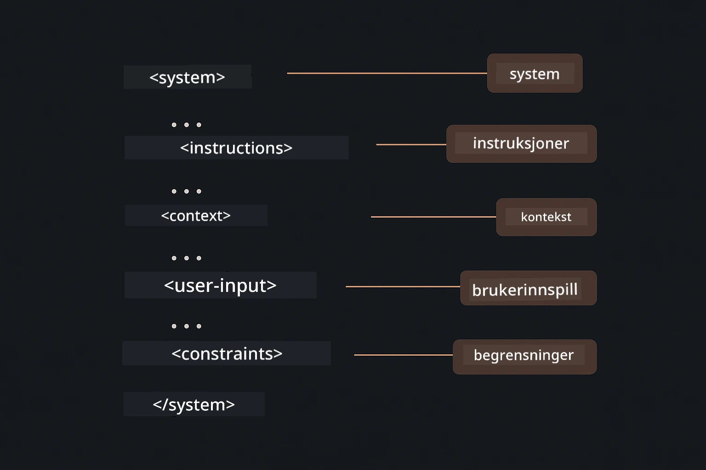

*Anatomi av en godt strukturert prompt med klare seksjoner og XML-stil organisering*

**Kvalitet gjennom selvevaluering**

De selvreflekterende mønstrene fungerer ved å gjøre kvalitetskriterier eksplisitte. I stedet for å håpe at modellen "gjør det riktig", forteller du den nøyaktig hva "riktig" betyr: korrekt logikk, feilhåndtering, ytelse, sikkerhet. Modellen kan da evaluere egen utdata og forbedre seg. Dette gjør kodegenerering fra et lotteri til en prosess.

**Kontekst er begrenset**

Flertrinnssamtaler fungerer ved å inkludere meldingshistorikk med hver forespørsel. Men det finnes en grense – hver modell har en maksimal token-grense. Etter hvert som samtaler vokser, trenger du strategier for å beholde relevant kontekst uten å nå denne grensen. Dette modulen viser deg hvordan minne fungerer; senere lærer du når du skal oppsummere, når du skal glemme, og når du skal hente.

## Neste steg

**Neste modul:** [03-rag - RAG (Retrieval-Augmented Generation)](../03-rag/README.md)

---

**Navigasjon:** [← Forrige: Modul 01 - Introduksjon](../01-introduction/README.md) | [Tilbake til hovedmeny](../README.md) | [Neste: Modul 03 - RAG →](../03-rag/README.md)

---

<!-- CO-OP TRANSLATOR DISCLAIMER START -->
**Ansvarsfraskrivelse**:
Dette dokumentet er oversatt ved hjelp av AI-oversettelsestjenesten [Co-op Translator](https://github.com/Azure/co-op-translator). Selv om vi streber etter nøyaktighet, vennligst vær oppmerksom på at automatiske oversettelser kan inneholde feil eller unøyaktigheter. Det opprinnelige dokumentet på originalspråket skal anses som den autoritative kilden. For kritisk informasjon anbefales profesjonell menneskelig oversettelse. Vi er ikke ansvarlige for eventuelle misforståelser eller feiltolkninger som oppstår ved bruk av denne oversettelsen.
<!-- CO-OP TRANSLATOR DISCLAIMER END -->