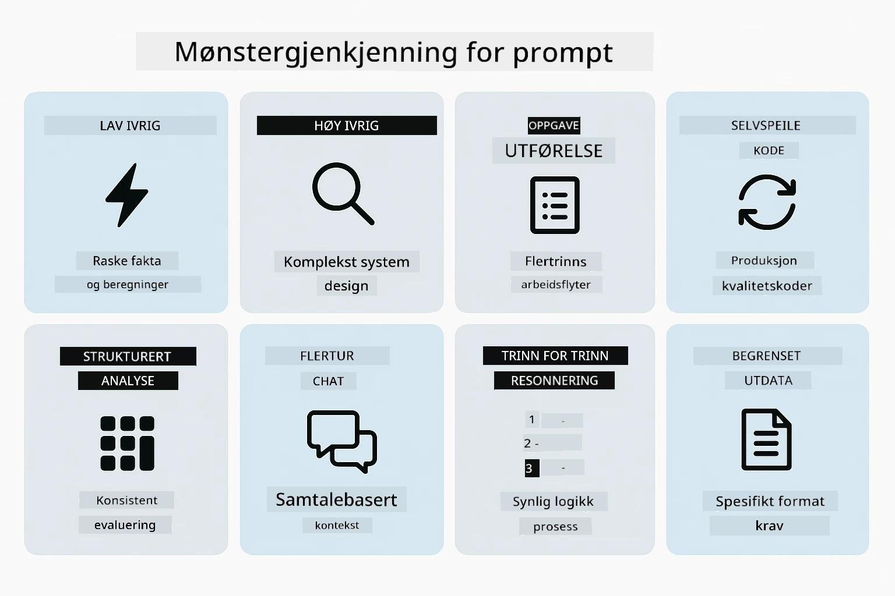
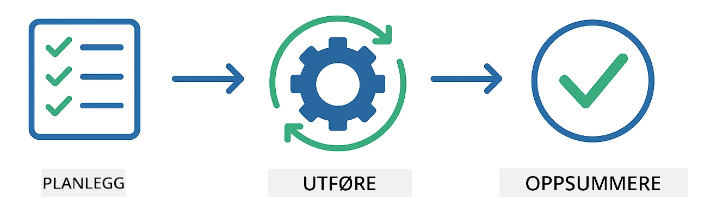
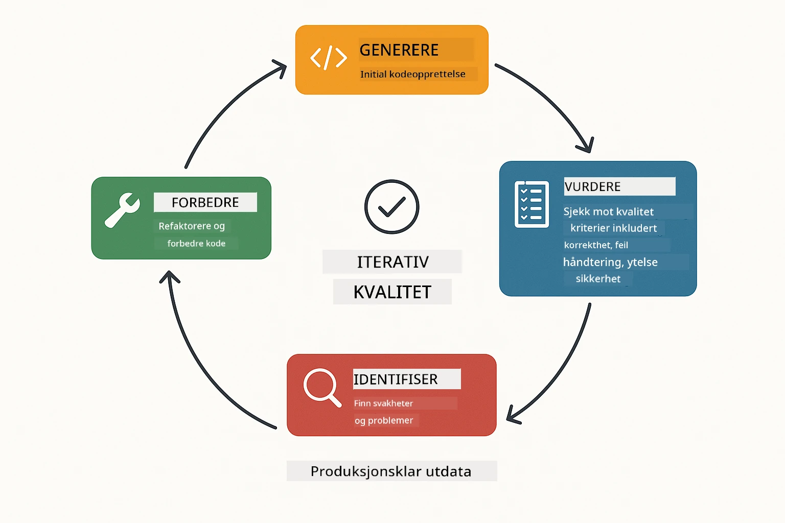
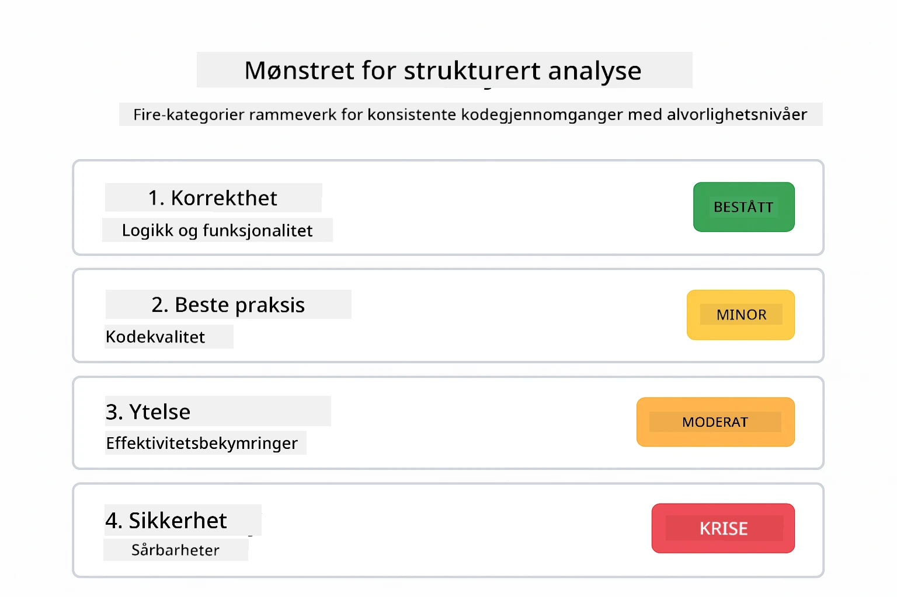
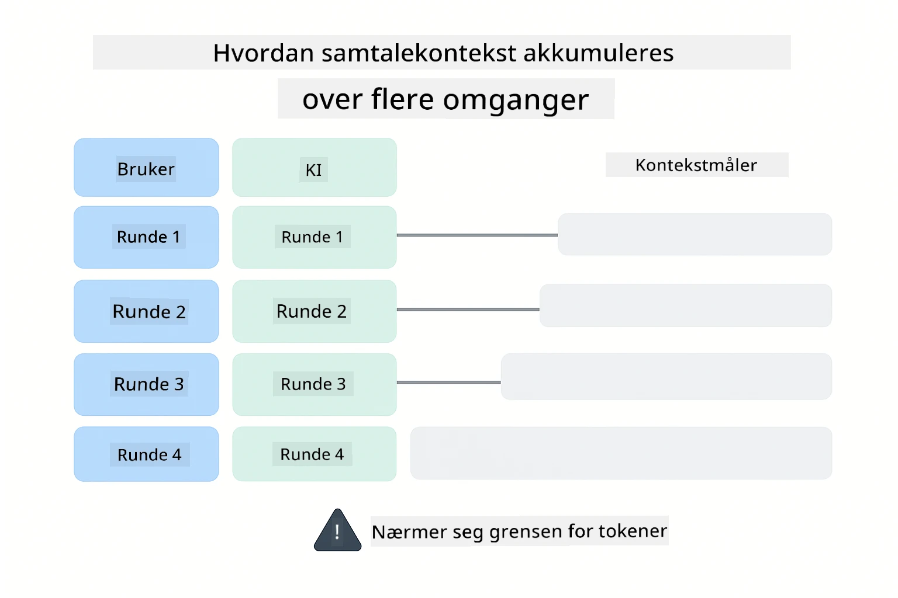
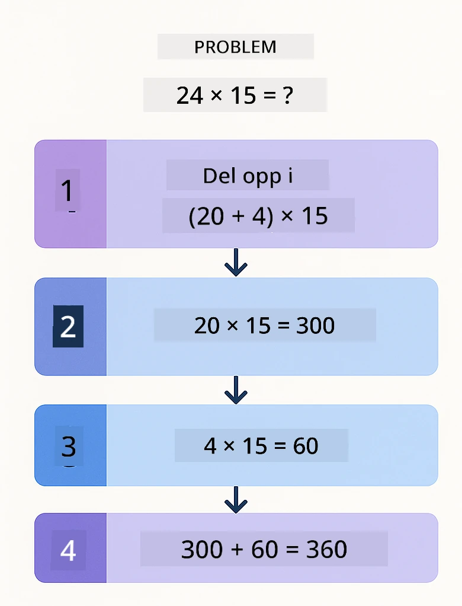
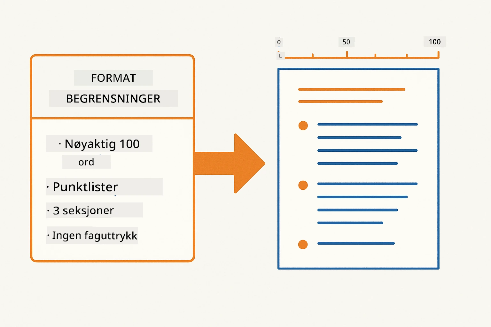
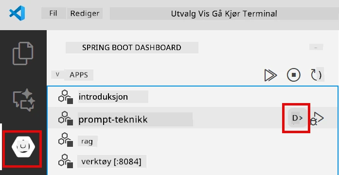
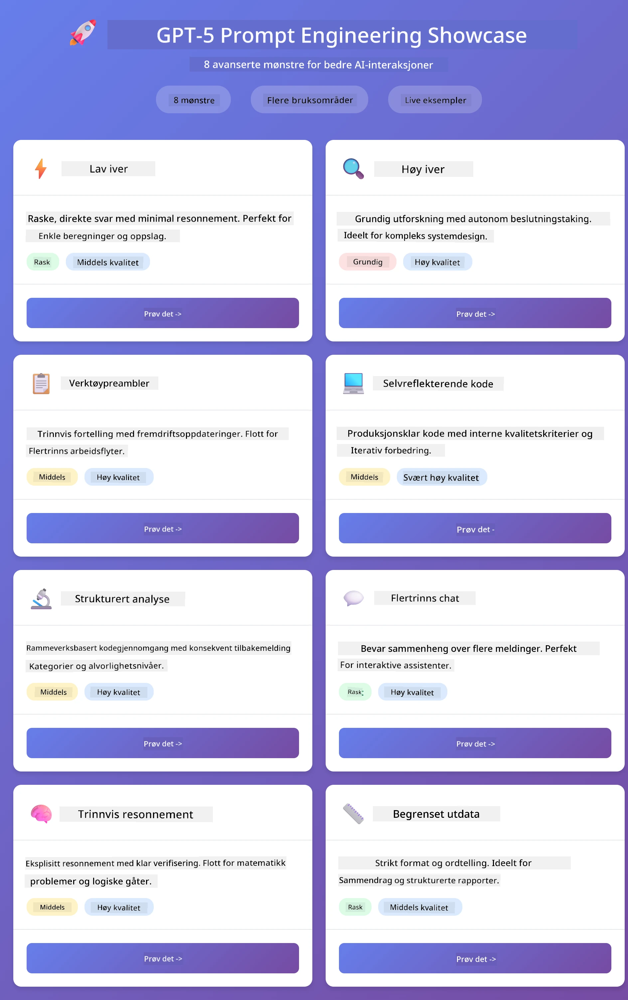
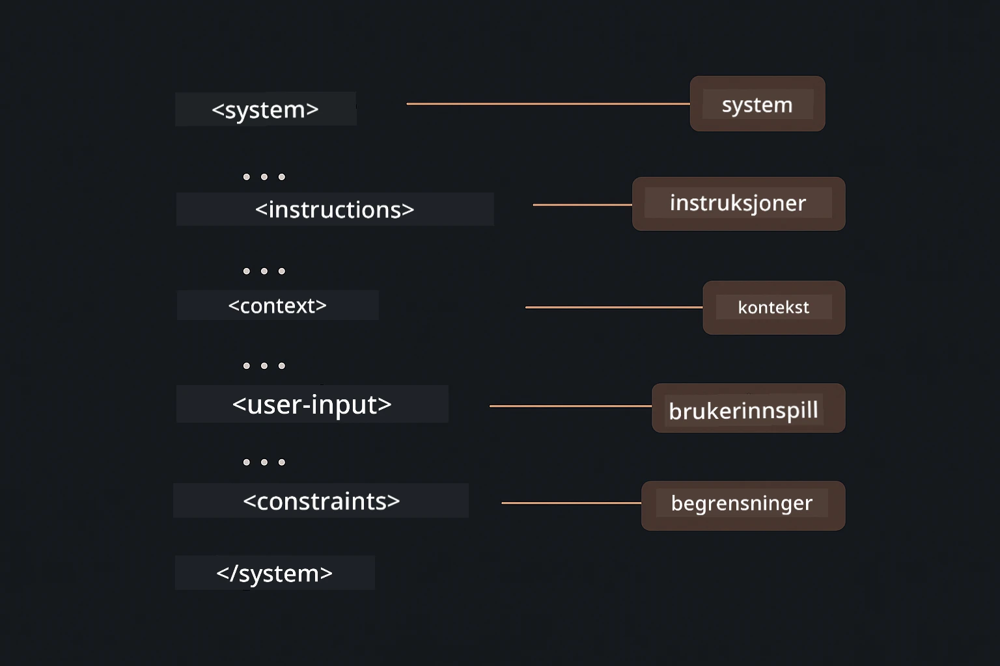

# Modul 02: Prompt Engineering med GPT-5.2

## Innholdsfortegnelse

- [Video Gjennomgang](#video-gjennomgang)
- [Hva Du Vil Lære](#hva-du-vil-lære)
- [Forutsetninger](#forutsetninger)
- [Forstå Prompt Engineering](#forstå-prompt-engineering)
- [Grunnleggende om Prompt Engineering](#grunnleggende-om-prompt-engineering)
  - [Zero-Shot Prompting](#zero-shot-prompting)
  - [Few-Shot Prompting](#few-shot-prompting)
  - [Chain of Thought](#chain-of-thought)
  - [Rollebasert Prompting](#rollebasert-prompting)
  - [Prompt Maler](#prompt-maler)
- [Avanserte Mønstre](#avanserte-mønstre)
- [Kjør Applikasjonen](#kjør-applikasjonen)
- [Applikasjonsskjermbilder](#applikasjonsbilder)
- [Utforske Mønstrene](#utforske-mønstrene)
  - [Lav vs Høy Iver](#lav-vs-høy-ivrighet)
  - [Oppgaveutførelse (Verktøypreambler)](#oppgaveutførelse-verktøysintroduksjoner)
  - [Selvreflekterende Kode](#selvreflekterende-kode)
  - [Strukturert Analyse](#strukturert-analyse)
  - [Fler-Turn Chat](#flerstegssamtale)
  - [Steg-for-Steg Resonnering](#trinnvis-resonering)
  - [Begrenset Utdata](#begrenset-output)
- [Hva Du Egentlig Lærer](#hva-du-virkelig-lærer)
- [Neste Steg](#neste-steg)

## Video Gjennomgang

Se denne livesesjonen som forklarer hvordan du kommer i gang med denne modulen:

<a href="https://www.youtube.com/live/PJ6aBaE6bog?si=LDshyBrTRodP-wke"></a>

## Hva Du Vil Lære

Følgende diagram gir en oversikt over nøkkeltemaene og ferdighetene du vil utvikle i denne modulen — fra teknikker for forbedring av prompts til steg-for-steg arbeidsflyten du vil følge.


I forrige modul så du hvordan minne muliggjør konversasjonell AI med Azure OpenAI. Nå skal vi fokusere på hvordan du stiller spørsmål — selve promptene — ved bruk av Azure OpenAI sin GPT-5.2. Måten du strukturerer promptene på påvirker kvaliteten på svarene du får dramatisk. Vi starter med en gjennomgang av grunnleggende prompting-teknikker, før vi går videre til åtte avanserte mønstre som utnytter GPT-5.2 sine muligheter fullt ut.

Vi bruker GPT-5.2 fordi den introduserer resonnementskontroll - du kan fortelle modellen hvor mye tenking den skal gjøre før den svarer. Dette gjør forskjellige prompting-strategier mer tydelige og hjelper deg å forstå når du bør bruke hver tilnærming.

## Forutsetninger

- Fullført Modul 01 (Azure OpenAI ressurser deployert)
- `.env`-fil i rotkatalogen med Azure-legitimasjon (laget av `azd up` i Modul 01)

> **Merk:** Hvis du ikke har fullført Modul 01, følg deployeringsinstruksjonene der først.

## Forstå Prompt Engineering

I kjernen handler prompt engineering om forskjellen mellom vage og presise instruksjoner, som sammenligningen nedenfor illustrerer.


Prompt engineering handler om å designe inngangstekst som konsekvent gir deg resultater du trenger. Det handler ikke bare om å stille spørsmål - men om å strukturere forespørsler slik at modellen forstår nøyaktig hva du vil ha og hvordan det skal leveres.

Tenk på det som å gi instruksjoner til en kollega. "Fiks feilen" er vagt. "Fiks nullpointer-feilen i UserService.java linje 45 ved å legge til en nullsjekk" er spesifikt. Språkmodeller fungerer på samme måte - spesifisitet og struktur betyr noe.

Diagrammet nedenfor viser hvordan LangChain4j passer inn i bildet — og kobler prompt-mønstrene dine til modellen via SystemMessage og UserMessage byggesteiner.


LangChain4j leverer infrastrukturen — modellkoblinger, minne og meldingstyper — mens prompt-mønstrene er bare nøye strukturerte tekster du sender gjennom infrastrukturen. De viktigste byggesteinene er `SystemMessage` (som setter AI-ens atferd og rolle) og `UserMessage` (som bærer den faktiske forespørselen din).

## Grunnleggende om Prompt Engineering

De fem kjerne-teknikkene vist nedenfor danner grunnlaget for effektiv prompt engineering. Hver adresserer en forskjellig del av hvordan du kommuniserer med språkmodeller.


Før vi dykker ned i de avanserte mønstrene i denne modulen, la oss gå gjennom fem grunnleggende prompting-teknikker. Disse er byggesteinene enhver prompt-ingeniør bør kjenne til.

### Zero-Shot Prompting

Den enkleste tilnærmingen: gi modellen en direkte instruksjon uten eksempler. Modellen baserer seg helt på sin trening for å forstå og utføre oppgaven. Dette fungerer godt for enkle forespørsler der forventet oppførsel er opplagt.


*Direkte instruksjon uten eksempler — modellen tolker oppgaven ut fra instruksjonen alene*

```java
String prompt = "Classify this sentiment: 'I absolutely loved the movie!'";
String response = model.chat(prompt);
// Svar: "Positiv"
```

**Når du bør bruke det:** Enkle kategoriseringer, direkte spørsmål, oversettelser, eller oppgaver modellen kan håndtere uten tilleggsveiledning.

### Few-Shot Prompting

Gi eksempler som demonstrerer mønsteret du ønsker modellen skal følge. Modellen lærer forventet input-output-format fra eksemplene og anvender det på nye inputs. Dette forbedrer konsistensen dramatisk for oppgaver hvor ønsket format eller oppførsel ikke er opplagt.


*Lærer fra eksempler — modellen identifiserer mønsteret og anvender det på nye inputs*

```java
String prompt = """
    Classify the sentiment as positive, negative, or neutral.
    
    Examples:
    Text: "This product exceeded my expectations!" → Positive
    Text: "It's okay, nothing special." → Neutral
    Text: "Waste of money, very disappointed." → Negative
    
    Now classify this:
    Text: "Best purchase I've made all year!"
    """;
String response = model.chat(prompt);
```

**Når du bør bruke det:** Tilpassede kategoriseringer, konsistent formatering, domene-spesifikke oppgaver, eller når zero-shot resultater er inkonsistente.

### Chain of Thought

Be modellen vise sitt resonnement steg-for-steg. I stedet for å hoppe rett til et svar, bryter modellen ned problemet og går gjennom hvert delsteg eksplisitt. Dette forbedrer nøyaktigheten på matte-, logikk- og fler-stegs resonneringsoppgaver.


*Steg-for-steg resonnement — deler komplekse problemer inn i eksplisitte logiske trinn*

```java
String prompt = """
    Problem: A store has 15 apples. They sell 8 apples and then 
    receive a shipment of 12 more apples. How many apples do they have now?
    
    Let's solve this step-by-step:
    """;
String response = model.chat(prompt);
// Modellen viser: 15 - 8 = 7, så 7 + 12 = 19 epler
```

**Når du bør bruke det:** Matematikkoppgaver, logikkpuslespill, debugging, eller oppgaver hvor det å vise resonnementet øker nøyaktighet og tillit.

### Rollebasert Prompting

Sett en persona eller rolle for AI før du stiller spørsmålet. Dette gir kontekst som former tonen, dybden og fokuset i svaret. En "programvarearkitekt" gir annerledes råd enn en "juniorutvikler" eller en "sikkerhetsrevisor".


*Setter kontekst og persona — samme spørsmål gir forskjellig svar avhengig av tildelt rolle*

```java
String prompt = """
    You are an experienced software architect reviewing code.
    Provide a brief code review for this function:
    
    def calculate_total(items):
        total = 0
        for item in items:
            total = total + item['price']
        return total
    """;
String response = model.chat(prompt);
```

**Når du bør bruke det:** Kodegjennomganger, veiledning, domene-spesifikk analyse, eller når du trenger svar skreddersydd til et bestemt ekspertisenivå eller perspektiv.

### Prompt Maler

Lag gjenbrukbare prompts med variable plassholdere. I stedet for å skrive en ny prompt hver gang, definer en mal en gang og fyll inn forskjellige verdier. LangChain4j sin `PromptTemplate` klasse gjør dette enkelt med `{{variable}}` syntaks.


*Gjenbrukbare prompts med variable plassholdere — én mal, mange bruksområder*

```java
PromptTemplate template = PromptTemplate.from(
    "What's the best time to visit {{destination}} for {{activity}}?"
);

Prompt prompt = template.apply(Map.of(
    "destination", "Paris",
    "activity", "sightseeing"
));

String response = model.chat(prompt.text());
```

**Når du bør bruke det:** Gjentatte forespørsler med ulik input, batch-behandling, bygge gjenbrukbare AI-arbeidsflyter, eller situasjoner hvor promptstrukturen er lik men dataene endres.

---

Disse fem grunnleggende gir deg et solid verktøysett for de fleste prompting-oppgaver. Resten av denne modulen bygger videre på dem med **åtte avanserte mønstre** som utnytter GPT-5.2 sin resonnementskontroll, selv-evaluering, og strukturerte utdata.

## Avanserte Mønstre

Med det grunnleggende på plass går vi videre til de åtte avanserte mønstrene som gjør denne modulen unik. Ikke alle problemer trenger samme tilnærming. Noen spørsmål trenger raske svar, andre trenger dyp tenking. Noen trenger synlig resonnement, andre bare resultater. Hvert mønster nedenfor er optimalisert for en annen situasjon — og GPT-5.2 sin resonnementskontroll gjør forskjellene enda tydeligere.



*Oversikt over de åtte prompt engineering-mønstrene og deres bruksområder*

GPT-5.2 tilfører et nytt lag til disse mønstrene: *resonnementskontroll*. Slideren nedenfor viser hvordan du kan justere modellens tenkningsinnsats — fra raske, direkte svar til dyp og grundig analyse.


*GPT-5.2 sin resonnementskontroll lar deg spesifisere hvor mye tenking modellen skal gjøre — fra raske, direkte svar til dyp utforskning*

**Lav Iver (Rask & Fokusert)** - For enkle spørsmål hvor du ønsker hurtige, direkte svar. Modellen gjør minimal tenking - maks 2 steg. Bruk dette for beregninger, oppslag, eller enkle spørsmål.

```java
String prompt = """
    <context_gathering>
    - Search depth: very low
    - Bias strongly towards providing a correct answer as quickly as possible
    - Usually, this means an absolute maximum of 2 reasoning steps
    - If you think you need more time, state what you know and what's uncertain
    </context_gathering>
    
    Problem: What is 15% of 200?
    
    Provide your answer:
    """;

String response = chatModel.chat(prompt);
```

> 💡 **Utforsk med GitHub Copilot:** Åpne [`Gpt5PromptService.java`](../../../02-prompt-engineering/src/main/java/com/example/langchain4j/prompts/service/Gpt5PromptService.java) og spør:
> - "Hva er forskjellen mellom lav iver og høy iver i prompting-mønstre?"
> - "Hvordan hjelper XML-taggene i promptene med å strukturere AI-svaret?"
> - "Når bør jeg bruke selvrefleksjonsmønstre kontra direkte instruksjon?"

**Høy Iver (Dyp & Grundig)** - For komplekse problemer hvor du vil ha omfattende analyse. Modellen utforsker grundig og viser detaljert resonnement. Bruk dette for systemdesign, arkitekturvalg, eller kompleks forskning.

```java
String prompt = """
    Analyze this problem thoroughly and provide a comprehensive solution.
    Consider multiple approaches, trade-offs, and important details.
    Show your analysis and reasoning in your response.
    
    Problem: Design a caching strategy for a high-traffic REST API.
    """;

String response = chatModel.chat(prompt);
```

**Oppgaveutførelse (Steg-for-Steg Fremdrift)** - For fler-stegs arbeidsflyter. Modellen gir en plan på forhånd, forteller hva den gjør for hvert steg, og avslutter med en oppsummering. Bruk dette for migrasjoner, implementasjoner, eller fler-stegs prosesser.

```java
String prompt = """
    <task_execution>
    1. First, briefly restate the user's goal in a friendly way
    
    2. Create a step-by-step plan:
       - List all steps needed
       - Identify potential challenges
       - Outline success criteria
    
    3. Execute each step:
       - Narrate what you're doing
       - Show progress clearly
       - Handle any issues that arise
    
    4. Summarize:
       - What was completed
       - Any important notes
       - Next steps if applicable
    </task_execution>
    
    <tool_preambles>
    - Always begin by rephrasing the user's goal clearly
    - Outline your plan before executing
    - Narrate each step as you go
    - Finish with a distinct summary
    </tool_preambles>
    
    Task: Create a REST endpoint for user registration
    
    Begin execution:
    """;

String response = chatModel.chat(prompt);
```

Chain-of-Thought prompting ber eksplisitt modellen vise sitt resonnement, noe som forbedrer nøyaktigheten for komplekse oppgaver. Steg-for-steg gjennomgangen hjelper både mennesker og AI å forstå logikken.

> **🤖 Prøv med [GitHub Copilot](https://github.com/features/copilot) Chat:** Spør om dette mønsteret:
> - "Hvordan kan jeg tilpasse oppgaveutførelsesmønsteret for langvarige operasjoner?"
> - "Hva er beste praksis for å strukturere verktøypreambler i produksjonsapplikasjoner?"
> - "Hvordan kan jeg fange og vise mellomliggende fremdriftsoppdateringer i UI?"

Diagrammet nedenfor illustrerer denne Plan → Utfør → Oppsummer arbeidsflyten.



*Plan → Utfør → Oppsummer arbeidsflyt for fler-stegs oppgaver*

**Selvreflekterende Kode** - For å generere kode av produksjonskvalitet. Modellen genererer kode som følger produksjonsstandarder med riktig feilhåndtering. Bruk dette når du bygger nye funksjoner eller tjenester.

```java
String prompt = """
    Generate Java code with production-quality standards: Create an email validation service
    Keep it simple and include basic error handling.
    """;

String response = chatModel.chat(prompt);
```

Diagrammet nedenfor viser denne iterative forbedringssløyfen — generer, evaluer, identifiser svakheter, og forbedre til koden møter produksjonsstandarder.



*Iterativ forbedringssløyfe - generer, evaluer, identifiser problemer, forbedre, gjenta*

**Strukturert Analyse** - For konsistent evaluering. Modellen gjennomgår kode med et fast rammeverk (korrekthet, praksis, ytelse, sikkerhet, vedlikeholdbarhet). Bruk dette for kodegjennomganger eller kvalitetsvurderinger.

```java
String prompt = """
    <analysis_framework>
    You are an expert code reviewer. Analyze the code for:
    
    1. Correctness
       - Does it work as intended?
       - Are there logical errors?
    
    2. Best Practices
       - Follows language conventions?
       - Appropriate design patterns?
    
    3. Performance
       - Any inefficiencies?
       - Scalability concerns?
    
    4. Security
       - Potential vulnerabilities?
       - Input validation?
    
    5. Maintainability
       - Code clarity?
       - Documentation?
    
    <output_format>
    Provide your analysis in this structure:
    - Summary: One-sentence overall assessment
    - Strengths: 2-3 positive points
    - Issues: List any problems found with severity (High/Medium/Low)
    - Recommendations: Specific improvements
    </output_format>
    </analysis_framework>
    
    Code to analyze:
    ```
    public List getUsers() {
        return database.query("SELECT * FROM users");
    }
    ```
    Provide your structured analysis:
    """;

String response = chatModel.chat(prompt);
```

> **🤖 Prøv med [GitHub Copilot](https://github.com/features/copilot) Chat:** Spør om strukturert analyse:
> - "Hvordan kan jeg tilpasse analyse-rammeverket for ulike typer kodegjennomganger?"
> - "Hva er beste måten å analysere og bruke strukturerte utdata programmatisk?"
> - "Hvordan sikrer jeg konsistente alvorlighetsnivåer på tvers av ulike gjennomgangssesjoner?"

Følgende diagram viser hvordan dette strukturerte rammeverket organiserer en kodegjennomgang i konsistente kategorier med alvorlighetsnivåer.



*Rammeverk for konsistente kodegjennomganger med alvorlighetsnivåer*

**Fler-Turn Chat** - For samtaler som trenger kontekst. Modellen husker tidligere meldinger og bygger videre på dem. Bruk dette for interaktive hjelpesesjoner eller komplekse spørsmål og svar.

```java
ChatMemory memory = MessageWindowChatMemory.withMaxMessages(10);

memory.add(UserMessage.from("What is Spring Boot?"));
AiMessage aiMessage1 = chatModel.chat(memory.messages()).aiMessage();
memory.add(aiMessage1);

memory.add(UserMessage.from("Show me an example"));
AiMessage aiMessage2 = chatModel.chat(memory.messages()).aiMessage();
memory.add(aiMessage2);
```

Diagrammet nedenfor visualiserer hvordan samtalekontekst akkumuleres over flere runder og hvordan det relaterer til modellens token-grense.



*Hvordan samtalekontekst akkumuleres over flere runder inntil token-grensen nås*

**Steg-for-Steg Resonnering** - For problemer som krever synlig logikk. Modellen viser eksplisitt resonnement for hvert steg. Bruk dette for matteoppgaver, logikkpuslespill, eller når du trenger å forstå tenkeprosessen.

```java
String prompt = """
    <instruction>Show your reasoning step-by-step</instruction>
    
    If a train travels 120 km in 2 hours, then stops for 30 minutes,
    then travels another 90 km in 1.5 hours, what is the average speed
    for the entire journey including the stop?
    """;

String response = chatModel.chat(prompt);
```

Diagrammet nedenfor illustrerer hvordan modellen deler opp problemer i eksplisitte, nummererte logiske steg.


*Bryte ned problemer i eksplisitte logiske steg*

**Begrenset Output** - For svar med spesifikke formatkrav. Modellen følger strengt format- og lengderegler. Bruk dette for sammendrag eller når du trenger presis outputstruktur.

```java
String prompt = """
    <constraints>
    - Exactly 100 words
    - Bullet point format
    - Technical terms only
    </constraints>
    
    Summarize the key concepts of machine learning.
    """;

String response = chatModel.chat(prompt);
```

Følgende diagram viser hvordan begrensninger styrer modellen til å produsere output som strengt overholder dine format- og lengdekrav.



*Håndheve spesifikke format-, lengde- og strukturkrav*

## Kjør Applikasjonen

**Bekreft distribusjon:**

Sørg for at `.env`-filen finnes i rotmappen med Azure-legitimasjon (opprettet under Modul 01). Kjør dette fra modulkatalogen (`02-prompt-engineering/`):

**Bash:**
```bash
cat ../.env  # Bør vise AZURE_OPENAI_ENDPOINT, API_KEY, DEPLOYMENT
```

**PowerShell:**
```powershell
Get-Content ..\.env  # Skal vise AZURE_OPENAI_ENDPOINT, API_KEY, DEPLOYMENT
```

**Start applikasjonen:**

> **Merk:** Hvis du allerede har startet alle applikasjoner med `./start-all.sh` fra rotmappen (som beskrevet i Modul 01), kjører denne modulen allerede på port 8083. Du kan hoppe over startkommandoene nedenfor og gå direkte til http://localhost:8083.

**Alternativ 1: Bruke Spring Boot Dashboard (Anbefalt for VS Code-brukere)**

Dev-containeren inkluderer Spring Boot Dashboard-utvidelsen, som gir et visuelt grensesnitt for å administrere alle Spring Boot-applikasjoner. Du finner den i Aktivitetslinjen på venstre side i VS Code (se etter Spring Boot-ikonet).

Fra Spring Boot Dashboard kan du:
- Se alle tilgjengelige Spring Boot-applikasjoner i arbeidsområdet
- Starte/stoppe applikasjoner med ett klikk
- Se applikasjonslogger i sanntid
- Overvåke applikasjonsstatus

Klikk bare på play-knappen ved siden av "prompt-engineering" for å starte denne modulen, eller start alle moduler samtidig.



*Spring Boot Dashboard i VS Code — start, stopp og overvåk alle moduler fra ett sted*

**Alternativ 2: Bruke shell-skript**

Start alle webapplikasjoner (moduler 01-04):

**Bash:**
```bash
cd ..  # Fra rotkatalogen
./start-all.sh
```

**PowerShell:**
```powershell
cd ..  # Fra rotkatalogen
.\start-all.ps1
```

Eller start bare denne modulen:

**Bash:**
```bash
cd 02-prompt-engineering
./start.sh
```

**PowerShell:**
```powershell
cd 02-prompt-engineering
.\start.ps1
```

Begge skriptene laster automatisk miljøvariabler fra rotens `.env`-fil og bygger JAR-filene hvis de ikke finnes.

> **Merk:** Hvis du foretrekker å bygge alle moduler manuelt før oppstart:
>
> **Bash:**
> ```bash
> cd ..  # Go to root directory
> mvn clean package -DskipTests
> ```

> **PowerShell:**
> ```powershell
> cd ..  # Go to root directory
> mvn clean package -DskipTests
> ```

Åpne http://localhost:8083 i nettleseren din.

**For å stoppe:**

**Bash:**
```bash
./stop.sh  # Denne modulen bare
# Eller
cd .. && ./stop-all.sh  # Alle moduler
```

**PowerShell:**
```powershell
.\stop.ps1  # Bare denne modulen
# Eller
cd ..; .\stop-all.ps1  # Alle moduler
```

## Applikasjonsbilder

Her er hovedgrensesnittet til prompt engineering-modulen, hvor du kan eksperimentere med alle åtte mønstre side om side.



*Hoveddashbordet som viser alle 8 prompt engineering-mønstre med deres egenskaper og bruksområder*

## Utforske Mønstrene

Nettgrensesnittet lar deg eksperimentere med ulike promptstrategier. Hvert mønster løser forskjellige problemer – prøv dem for å se når hver tilnærming fungerer best.

> **Merk: Streaming vs Ikke-streaming** — Hver mønsterside tilbyr to knapper: **🔴 Stream Response (Live)** og et **Ikke-streaming**-alternativ. Streaming bruker Server-Sent Events (SSE) for å vise tokens i sanntid mens modellen genererer dem, slik at du ser fremdriften umiddelbart. Ikke-streaming-alternativet venter på hele svaret før det vises. For prompts som utløser dyp tenkning (f.eks. High Eagerness, Self-Reflecting Code), kan ikke-streaming kallet ta svært lang tid – noen ganger minutter – uten synlig tilbakemelding. **Bruk streaming når du eksperimenterer med komplekse prompts** slik at du kan se modellen arbeide og unngå inntrykk av at forespørselen har tidsavbrutt.
>
> **Merk: Nettleserkrav** — Streaming-funksjonen bruker Fetch Streams API (`response.body.getReader()`) som krever en fullverdig nettleser (Chrome, Edge, Firefox, Safari). Den fungerer **ikke** i VS Codes innebygde Simple Browser, da dens webview ikke støtter ReadableStream API. Hvis du bruker Simple Browser, vil ikke-streaming-knappene fortsatt fungere normalt – bare streaming-knappene påvirkes. Åpne `http://localhost:8083` i en ekstern nettleser for full opplevelse.

### Lav vs Høy Ivrighet

Still et enkelt spørsmål som "Hva er 15 % av 200?" med Lav Ivrighet. Du får et umiddelbart, direkte svar. Still nå noe komplekst som "Design en caching-strategi for en høytrafikk-API" med Høy Ivrighet. Klikk **🔴 Stream Response (Live)** og se modellens detaljerte resonnering komme frem token-for-token. Samme modell, samme spørrestruktur – men prompten forteller hvor mye tenking som skal til.

### Oppgaveutførelse (Verktøysintroduksjoner)

Flerstegs arbeidsflyter drar nytte av planlegging på forhånd og fremdriftsnarrering. Modellen skisserer hva den vil gjøre, forteller om hvert steg, og oppsummerer resultatene.

### Selvreflekterende Kode

Prøv "Lag en e-postvalideringstjeneste". I stedet for bare å generere kode og stoppe, genererer modellen, vurderer mot kvalitetskriterier, identifiserer svakheter, og forbedrer. Du vil se den iterere til koden møter produksjonsstandarder.

### Strukturert Analyse

Kodegjennomganger trenger konsistente evalueringsrammer. Modellen analyserer kode med faste kategorier (korrekthet, praksis, ytelse, sikkerhet) med alvorlighetsnivåer.

### Flerstegssamtale

Spør "Hva er Spring Boot?" og følg opp umiddelbart med "Vis meg et eksempel". Modellen husker ditt første spørsmål og gir deg et Spring Boot-eksempel spesielt. Uten minne ville det andre spørsmålet vært for vagt.

### Trinnvis Resonering

Velg et matteproblem og prøv det med både Trinnvis Resonering og Lav Ivrighet. Lav ivrighet gir deg bare svaret – raskt, men utydelig. Trinnvis viser deg hver beregning og avgjørelse.

### Begrenset Output

Når du trenger spesifikke formater eller ordtellinger, håndhever dette mønsteret streng overholdelse. Prøv å generere et sammendrag med nøyaktig 100 ord i punktlisteformat.

## Hva Du Virkelig Lærer

**Resonneringsinnsats Endrer Alt**

GPT-5.2 lar deg styre beregningsinnsats gjennom dine prompts. Lav innsats betyr raske svar med minimal utforskning. Høy innsats betyr at modellen tar seg tid til å tenke dypt. Du lærer å matche innsats til oppgavens kompleksitet – ikke kast bort tid på enkle spørsmål, men ikke forhast komplekse beslutninger heller.

**Struktur Leder Adferd**

Legg merke til XML-taggene i promptene? De er ikke dekorative. Modeller følger strukturerte instruksjoner mer pålitelig enn fri tekst. Når du trenger flerstegs prosesser eller kompleks logikk, hjelper struktur modellen å holde oversikt over hvor den er og hva som kommer neste. Diagrammet nedenfor bryter ned en godt strukturert prompt, og viser hvordan tagger som `<system>`, `<instructions>`, `<context>`, `<user-input>`, og `<constraints>` organiserer instruksjonene dine i klare seksjoner.



*Anatomi av en godt strukturert prompt med klare seksjoner og XML-stil organisering*

**Kvalitet Gjennom Selvevaluering**

De selvreflekterende mønstrene fungerer ved å gjøre kvalitetskriterier eksplisitte. I stedet for å håpe at modellen "gjør det riktig", forteller du den nøyaktig hva "riktig" betyr: korrekt logikk, feilhåndtering, ytelse, sikkerhet. Modellen kan da evaluere sin egen output og forbedre seg. Dette gjør kodegenerering fra et lotteri til en prosess.

**Kontekst Er Begrenset**

Flerstegssamtaler fungerer ved å inkludere meldingshistorikk med hver forespørsel. Men det er en grense – hver modell har et maksimalt tokenantall. Etter hvert som samtalene vokser, trenger du strategier for å beholde relevant kontekst uten å nå denne grensen. Denne modulen viser deg hvordan minne fungerer; senere lærer du når du skal oppsummere, når du skal glemme, og når du skal hente frem.

## Neste Steg

**Neste Modul:** [03-rag - RAG (Retrieval-Augmented Generation)](../03-rag/README.md)

---

**Navigasjon:** [← Forrige: Modul 01 - Introduksjon](../01-introduction/README.md) | [Tilbake til Hoved](../README.md) | [Neste: Modul 03 - RAG →](../03-rag/README.md)

---

<!-- CO-OP TRANSLATOR DISCLAIMER START -->
**Ansvarsfraskrivelse**:
Dette dokumentet er oversatt ved hjelp av AI-oversettelsestjenesten [Co-op Translator](https://github.com/Azure/co-op-translator). Selv om vi streber etter nøyaktighet, vær oppmerksom på at automatiske oversettelser kan inneholde feil eller unøyaktigheter. Det opprinnelige dokumentet på originalspråket skal betraktes som den autoritative kilden. For kritisk informasjon anbefales profesjonell menneskelig oversettelse. Vi er ikke ansvarlige for eventuelle misforståelser eller feiltolkninger som oppstår ved bruk av denne oversettelsen.
<!-- CO-OP TRANSLATOR DISCLAIMER END -->