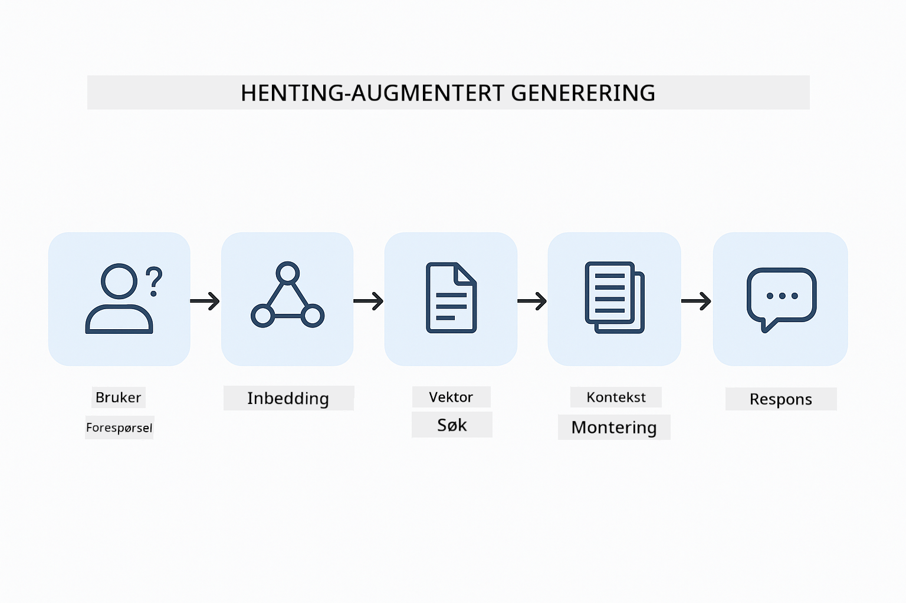
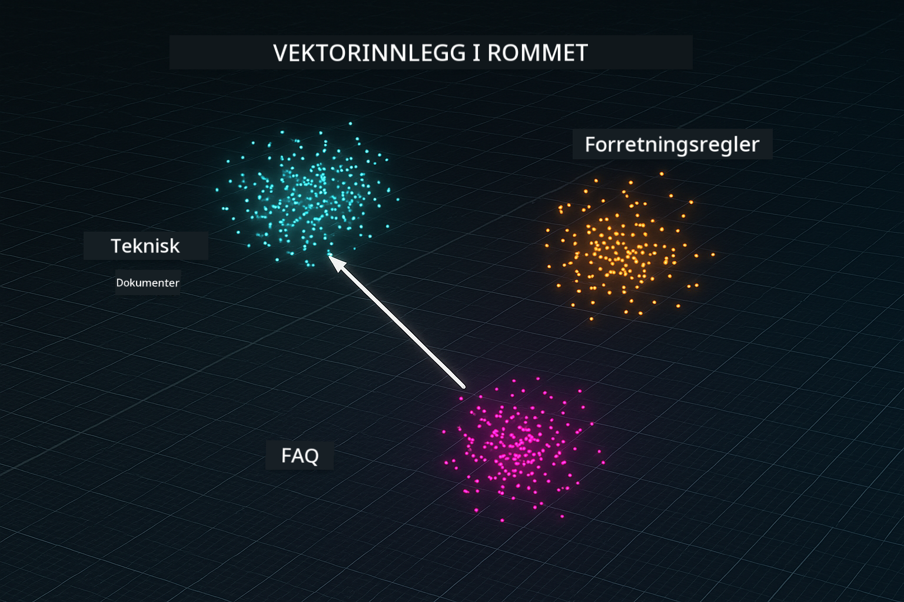
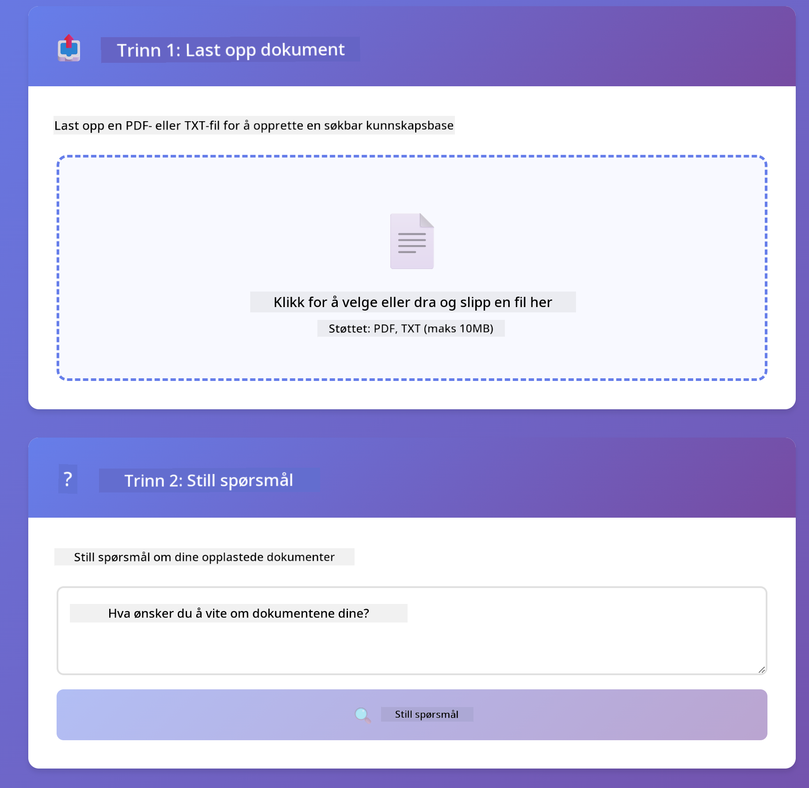

<!--
CO_OP_TRANSLATOR_METADATA:
{
  "original_hash": "81d087662fb3dd7b7124bce1a9c9ec86",
  "translation_date": "2026-01-05T23:50:23+00:00",
  "source_file": "03-rag/README.md",
  "language_code": "no"
}
-->
# Module 03: RAG (Retrieval-Augmented Generation)

## Innholdsfortegnelse

- [Hva du vil lære](../../../03-rag)
- [Forutsetninger](../../../03-rag)
- [Forstå RAG](../../../03-rag)
- [Hvordan det fungerer](../../../03-rag)
  - [Dokumentbehandling](../../../03-rag)
  - [Opprette embeddings](../../../03-rag)
  - [Semantisk søk](../../../03-rag)
  - [Svar-generering](../../../03-rag)
- [Kjør applikasjonen](../../../03-rag)
- [Bruke applikasjonen](../../../03-rag)
  - [Last opp et dokument](../../../03-rag)
  - [Still spørsmål](../../../03-rag)
  - [Sjekk kildehenvisninger](../../../03-rag)
  - [Eksperimenter med spørsmål](../../../03-rag)
- [Nøkkelkonsepter](../../../03-rag)
  - [Chunking-strategi](../../../03-rag)
  - [Likhetspoeng](../../../03-rag)
  - [Minnebasert lagring](../../../03-rag)
  - [Kontekst-vinduhåndtering](../../../03-rag)
- [Når RAG er viktig](../../../03-rag)
- [Neste steg](../../../03-rag)

## Hva du vil lære

I de forrige modulene lærte du hvordan du kan føre samtaler med AI og strukturere promptene dine effektivt. Men det finnes en grunnleggende begrensning: språkmodeller vet bare det de lærte under treningen. De kan ikke svare på spørsmål om din bedrifts retningslinjer, ditt prosjektdokumentasjon, eller annen informasjon de ikke er trent på.

RAG (Retrieval-Augmented Generation) løser dette problemet. I stedet for å prøve å lære modellen din informasjon (noe som er dyrt og upraktisk), gir du den muligheten til å søke gjennom dokumentene dine. Når noen stiller et spørsmål, finner systemet relevant informasjon og inkluderer det i prompten. Modellen svarer så basert på den hentede konteksten.

Tenk på RAG som å gi modellen et referansebibliotek. Når du stiller et spørsmål, gjør systemet:

1. **Brukerspørsmål** - Du stiller et spørsmål  
2. **Embedding** - Konverterer spørsmålet ditt til en vektor  
3. **Vektorsøk** - Finner lignende dokumentbiter  
4. **Kontekstsamling** - Legger relevante biter til prompten  
5. **Svar** - LLM genererer et svar basert på konteksten  

Dette forankrer modellens svar i dine faktiske data i stedet for å stole på treningskunnskap eller å finne på svar.



*RAG arbeidsflyt - fra brukerspørsmål til semantisk søk til kontekstuell svar-generering*

## Forutsetninger

- Fullført modul 01 (Azure OpenAI-ressurser distribuert)  
- `.env`-fil i rotmappen med Azure-legitimasjon (laget av `azd up` i modul 01)  

> **Merk:** Hvis du ikke har fullført modul 01, følg distribusjonsinstruksjonene der først.

## Hvordan det fungerer

### Dokumentbehandling

[DocumentService.java](../../../03-rag/src/main/java/com/example/langchain4j/rag/service/DocumentService.java)

Når du laster opp et dokument, deler systemet det opp i biter – mindre deler som passer komfortabelt i modellens kontekstvindu. Disse bitene overlapper litt for at du ikke skal miste kontekst ved grensen mellom dem.

```java
Document document = FileSystemDocumentLoader.loadDocument("sample-document.txt");

DocumentSplitter splitter = DocumentSplitters
    .recursive(300, 30, new OpenAiTokenizer());

List<TextSegment> segments = splitter.split(document);
```
  
> **🤖 Prøv med [GitHub Copilot](https://github.com/features/copilot) Chat:** Åpne [`DocumentService.java`](../../../03-rag/src/main/java/com/example/langchain4j/rag/service/DocumentService.java) og spør:  
> - "Hvordan deler LangChain4j dokumenter i biter, og hvorfor er overlapp viktig?"  
> - "Hva er optimal bit-størrelse for ulike dokumenttyper og hvorfor?"  
> - "Hvordan håndterer jeg dokumenter på flere språk eller med spesiell formatering?"

### Opprette embeddings

[LangChainRagConfig.java](../../../03-rag/src/main/java/com/example/langchain4j/rag/config/LangChainRagConfig.java)

Hver bit blir konvertert til en numerisk representasjon kalt en embedding – i praksis et matematisk fingeravtrykk som fanger meningen i teksten. Lignende tekst gir lignende embeddings.

```java
@Bean
public EmbeddingModel embeddingModel() {
    return OpenAiOfficialEmbeddingModel.builder()
        .baseUrl(azureOpenAiEndpoint)
        .apiKey(azureOpenAiKey)
        .modelName(azureEmbeddingDeploymentName)
        .build();
}

EmbeddingStore<TextSegment> embeddingStore = 
    new InMemoryEmbeddingStore<>();
```
  


*Dokumenter representert som vektorer i embedding-rom – lignende innhold grupperes sammen*

### Semantisk søk

[RagService.java](../../../03-rag/src/main/java/com/example/langchain4j/rag/service/RagService.java)

Når du stiller et spørsmål, blir spørsmålet ditt også en embedding. Systemet sammenligner spørsmålets embedding med embeddingene til alle dokumentbitene. Det finner de bitene med mest lignende mening – ikke bare matchende nøkkelord, men faktisk semantisk likhet.

```java
Embedding queryEmbedding = embeddingModel.embed(question).content();

List<EmbeddingMatch<TextSegment>> matches = 
    embeddingStore.findRelevant(queryEmbedding, 5, 0.7);

for (EmbeddingMatch<TextSegment> match : matches) {
    String relevantText = match.embedded().text();
    double score = match.score();
}
```
  
> **🤖 Prøv med [GitHub Copilot](https://github.com/features/copilot) Chat:** Åpne [`RagService.java`](../../../03-rag/src/main/java/com/example/langchain4j/rag/service/RagService.java) og spør:  
> - "Hvordan fungerer likhetssøk med embeddings, og hva avgjør poengsummen?"  
> - "Hvilken likhetsterskel bør jeg bruke, og hvordan påvirker det resultatene?"  
> - "Hvordan håndterer jeg tilfeller der ingen relevante dokumenter finnes?"

### Svar-generering

[RagService.java](../../../03-rag/src/main/java/com/example/langchain4j/rag/service/RagService.java)

De mest relevante bitene inkluderes i prompten til modellen. Modellen leser disse bitene og svarer på spørsmålet ditt basert på denne informasjonen. Dette forhindrer hallusinasjoner – modellen kan bare svare ut fra det den har foran seg.

## Kjør applikasjonen

**Verifiser distribusjon:**  

Sørg for at `.env`-filen finnes i rotmappen med Azure-legitimasjon (laget under modul 01):  
```bash
cat ../.env  # Skal vise AZURE_OPENAI_ENDPOINT, API_KEY, DEPLOYMENT
```
  
**Start applikasjonen:**  

> **Merk:** Hvis du allerede har startet alle applikasjonene ved bruk av `./start-all.sh` fra modul 01, kjører denne modulen allerede på port 8081. Du kan hoppe over start-kommandoene under og gå direkte til http://localhost:8081.

**Alternativ 1: Bruke Spring Boot Dashboard (Anbefalt for VS Code-brukere)**  

Dev containeren inkluderer Spring Boot Dashboard-utvidelsen, som gir et visuelt grensesnitt for å administrere alle Spring Boot-applikasjoner. Du finner det i Aktivitetslinjen på venstre side i VS Code (se etter Spring Boot-ikonet).

Fra Spring Boot Dashboard kan du:  
- Se alle tilgjengelige Spring Boot-applikasjoner i arbeidsområdet  
- Starte/stopp applikasjoner med ett klikk  
- Se applikasjonslogger i sanntid  
- Overvåke applikasjonsstatus  

Klikk bare på "play"-knappen ved siden av "rag" for å starte denne modulen, eller start alle moduler samtidig.


**Alternativ 2: Bruke shell-skript**

Start alle webapplikasjoner (moduler 01-04):

**Bash:**  
```bash
cd ..  # Fra rotkatalog
./start-all.sh
```
  
**PowerShell:**  
```powershell
cd ..  # Fra rotkatalogen
.\start-all.ps1
```
  
Eller start bare denne modulen:

**Bash:**  
```bash
cd 03-rag
./start.sh
```
  
**PowerShell:**  
```powershell
cd 03-rag
.\start.ps1
```
  
Begge skriptene laster automatisk miljøvariabler fra rotens `.env`-fil og bygger JAR-filene hvis de ikke finnes.

> **Merk:** Hvis du foretrekker å bygge alle moduler manuelt før du starter:  
>  
> **Bash:**  
> ```bash
> cd ..  # Go to root directory
> mvn clean package -DskipTests
> ```
  
> **PowerShell:**  
> ```powershell
> cd ..  # Go to root directory
> mvn clean package -DskipTests
> ```
  
Åpne http://localhost:8081 i nettleseren din.

**For å stoppe:**  

**Bash:**  
```bash
./stop.sh  # Bare denne modulen
# Eller
cd .. && ./stop-all.sh  # Alle moduler
```
  
**PowerShell:**  
```powershell
.\stop.ps1  # Bare denne modulen
# Eller
cd ..; .\stop-all.ps1  # Alle moduler
```
  
## Bruke applikasjonen

Applikasjonen tilbyr et webgrensesnitt for dokumentopplasting og spørsmål.

<a href="images/rag-homepage.png"></a>

*RAG applikasjonsgrensesnitt – last opp dokumenter og still spørsmål*

### Last opp et dokument

Begynn med å laste opp et dokument – TXT-filer fungerer best for testing. En `sample-document.txt` er lagt ved i denne mappen som inneholder informasjon om LangChain4j-funksjoner, RAG-implementering og beste praksis – perfekt for å teste systemet.

Systemet prosesserer dokumentet ditt, deler det i biter, og lager embeddings for hver bit. Dette skjer automatisk når du laster opp.

### Still spørsmål

Still nå spesifikke spørsmål om dokumentinnholdet. Prøv noe faktabaserte som er tydelig angitt i dokumentet. Systemet søker etter relevante biter, inkluderer dem i prompten, og genererer et svar.

### Sjekk kildehenvisninger

Merk at hvert svar inkluderer kildehenvisninger med likhetspoeng. Disse poengene (fra 0 til 1) viser hvor relevant hver bit var for spørsmålet ditt. Høyere poeng betyr bedre treff. Dette lar deg verifisere svaret mot kildematerialet.

<a href="images/rag-query-results.png"></a>

*Spørringsresultater som viser svar med kildehenvisninger og relevanspoeng*

### Eksperimenter med spørsmål

Prøv ulike typer spørsmål:  
- Spesifikke fakta: "Hva er hovedtemaet?"  
- Sammenligninger: "Hva er forskjellen mellom X og Y?"  
- Sammendrag: "Oppsummer hovedpunktene om Z"

Se hvordan relevanspoengene endres basert på hvor godt spørsmålet ditt matcher dokumentinnholdet.

## Nøkkelkonsepter

### Chunking-strategi

Dokumenter deles opp i 300-token biter med 30 token overlapp. Denne balansen sikrer at hver bit har nok kontekst til å være meningsfull, samtidig som det er små nok biter til å inkludere flere i en prompt.

### Likhetspoeng

Poengene går fra 0 til 1:  
- 0.7-1.0: Svært relevant, eksakt treff  
- 0.5-0.7: Relevant, god kontekst  
- Under 0.5: Filtrert ut, for ulik  

Systemet henter kun biter over minimumsterskelen for å sikre kvalitet.

### Minnebasert lagring

Denne modulen bruker minnelagring for enkelhetens skyld. Når du starter applikasjonen på nytt, går opplastede dokumenter tapt. Produksjonssystemer bruker persistente vektordatabaser som Qdrant eller Azure AI Search.

### Kontekst-vinduhåndtering

Hver modell har et maksimalt kontekstvindu. Du kan ikke inkludere hver bit fra et stort dokument. Systemet henter de top N mest relevante bitene (standard 5) for å holde seg innenfor begrensningene samtidig som det gir nok kontekst til nøyaktige svar.

## Når RAG er viktig

**Bruk RAG når:**  
- Du skal svare på spørsmål om proprietære dokumenter  
- Informasjonen endres ofte (retningslinjer, priser, spesifikasjoner)  
- Nøyaktighet krever kildehenvisning  
- Innholdet er for stort til å passe i en enkelt prompt  
- Du trenger etterprøvbare, forankrede svar  

**Ikke bruk RAG når:**  
- Spørsmål krever generell kunnskap modellen allerede har  
- Sanntidsdata er nødvendig (RAG bruker opplastede dokumenter)  
- Innholdet er lite nok til å inkluderes direkte i promptene  

## Neste steg

**Neste modul:** [04-tools - AI Agents with Tools](../04-tools/README.md)

---

**Navigasjon:** [← Forrige: Modul 02 - Prompt Engineering](../02-prompt-engineering/README.md) | [Tilbake til hovedsiden](../README.md) | [Neste: Modul 04 - Tools →](../04-tools/README.md)

---

<!-- CO-OP TRANSLATOR DISCLAIMER START -->
**Ansvarsfraskrivelse**:
Dette dokumentet er oversatt ved hjelp av AI-oversettelsestjenesten [Co-op Translator](https://github.com/Azure/co-op-translator). Selv om vi etterstreber nøyaktighet, vennligst vær oppmerksom på at automatiserte oversettelser kan inneholde feil eller unøyaktigheter. Det opprinnelige dokumentet på sitt originale språk skal betraktes som den autoritative kilden. For kritisk informasjon anbefales profesjonell menneskelig oversettelse. Vi er ikke ansvarlige for misforståelser eller feiltolkninger som oppstår ved bruk av denne oversettelsen.
<!-- CO-OP TRANSLATOR DISCLAIMER END -->