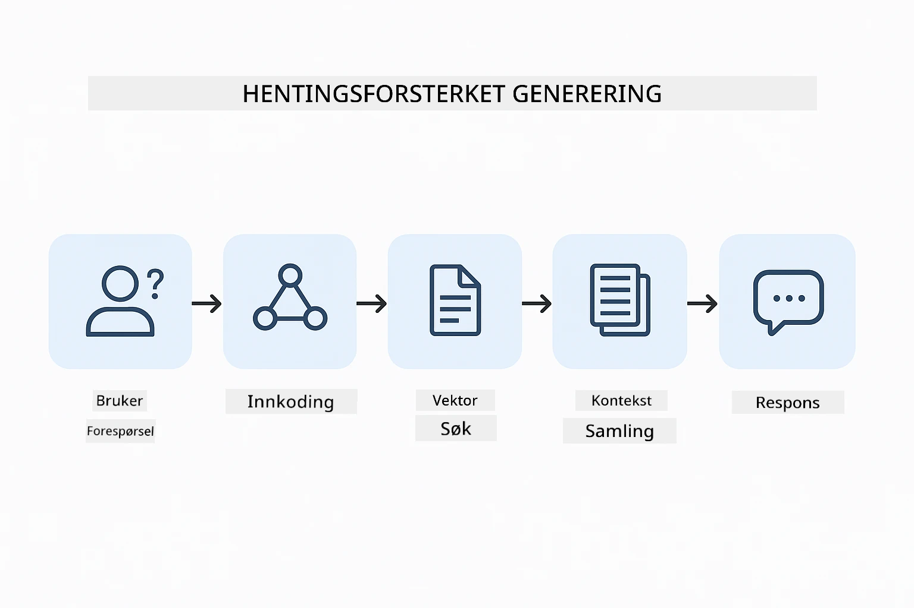
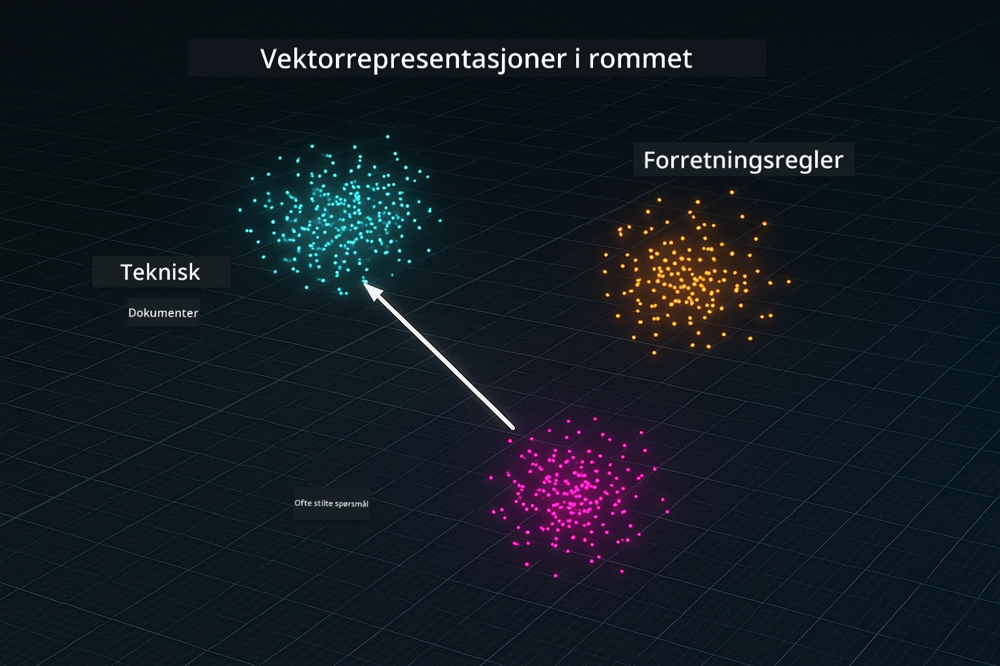
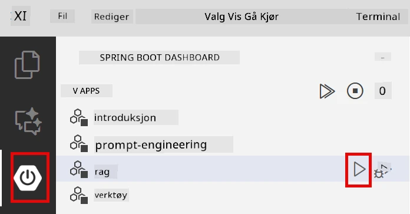
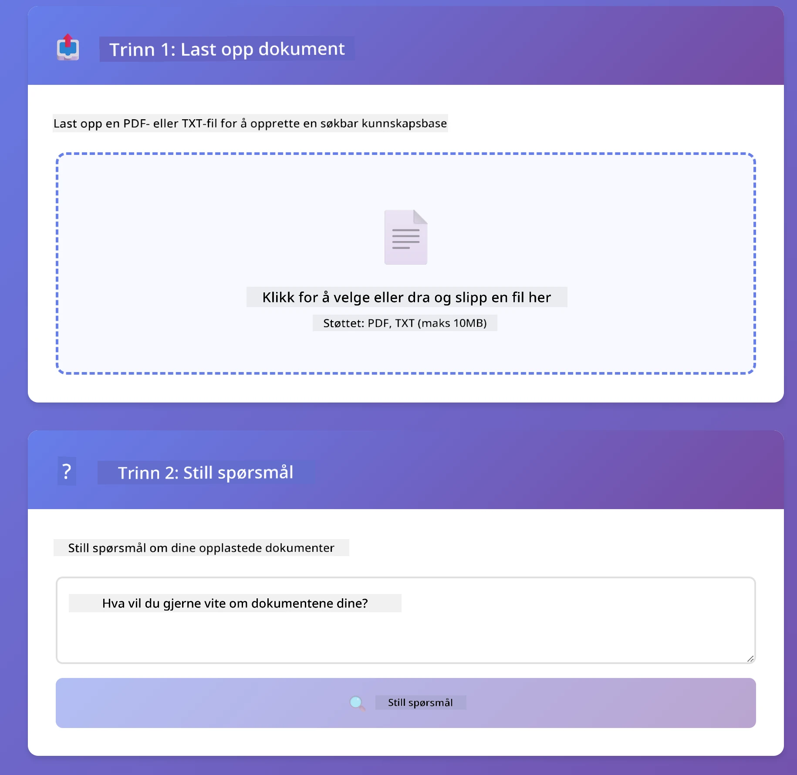
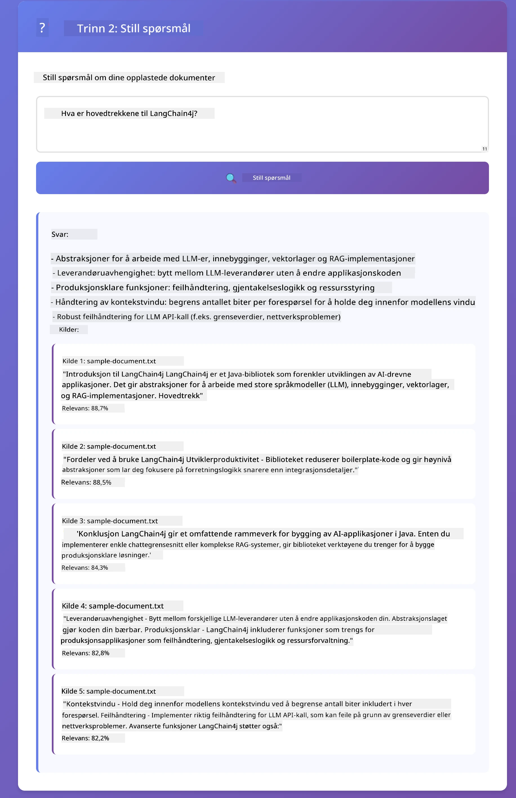

# Modul 03: RAG (Retrieval-Augmented Generation)

## Innholdsfortegnelse

- [Video-gjennomgang](#video-gjennomgang)
- [Hva du vil lære](#hva-du-vil-lære)
- [Forutsetninger](#forutsetninger)
- [Forstå RAG](#forstå-rag)
  - [Hvilken RAG-tilnærming bruker denne opplæringen?](#hvilken-rag-tilnærming-bruker-denne-opplæringen)
- [Hvordan det fungerer](#hvordan-det-fungerer)
  - [Dokumentbehandling](#dokumentbehandling)
  - [Opprette innebygde representasjoner](#opprette-innebygde-representasjoner)
  - [Semantisk søk](#semantisk-søk)
  - [Svar-generering](#svar-generering)
- [Kjør applikasjonen](#kjør-applikasjonen)
- [Bruke applikasjonen](#bruke-applikasjonen)
  - [Last opp et dokument](#last-opp-et-dokument)
  - [Still spørsmål](#still-spørsmål)
  - [Sjekk kildehenvisninger](#sjekk-kildehenvisninger)
  - [Eksperimenter med spørsmål](#eksperimenter-med-spørsmål)
- [Nøkkelbegreper](#nøkkelkonsepter)
  - [Chunking-strategi](#bitdeling-strategi)
  - [Likhetspoeng](#likhetspoeng)
  - [Minnebasert lagring](#minnebasert-lagring)
  - [Håndtering av kontekstvindu](#kontekstvindu-håndtering)
- [Når RAG er viktig](#når-rag-er-viktig)
- [Neste steg](#neste-steg)

## Video-gjennomgang

Se denne live-sesjonen som forklarer hvordan du kommer i gang med denne modulen:

<a href="https://www.youtube.com/watch?v=_olq75ZH_eY"></a>

## Hva du vil lære

I de forrige modulene lærte du hvordan du kan ha samtaler med AI og strukturere promptene dine effektivt. Men det finnes en grunnleggende begrensning: språkmodeller vet bare det de lærte under treningen. De kan ikke svare på spørsmål om selskapets retningslinjer, prosjekt-dokumentasjon eller annen informasjon de ikke ble trent på.

RAG (Retrieval-Augmented Generation) løser dette problemet. I stedet for å prøve å lære modellen informasjonen din (noe som er dyrt og upraktisk), gir du den mulighet til å søke gjennom dokumentene dine. Når noen stiller et spørsmål, finner systemet relevant informasjon og inkluderer den i prompten. Modellen svarer så basert på denne hentede konteksten.

Tenk på RAG som å gi modellen et referansebibliotek. Når du stiller et spørsmål, gjør systemet:

1. **Brukerspørsmål** - Du stiller et spørsmål  
2. **Embedding** - Konverterer spørsmålet ditt til en vektor  
3. **Vektorsøk** - Finner lignende dokumentbiter  
4. **Kontekstsammensetning** - Legger relevante biter til prompten  
5. **Svar** - LLM genererer et svar basert på konteksten

Dette forankrer modellens svar i dine faktiske data i stedet for å stole på treningskunnskap eller dikte opp svar.

## Forutsetninger

- Fullført [Modul 01 - Introduksjon](../01-introduction/README.md) (Azure OpenAI-ressurser distribuert, inkludert `text-embedding-3-small` embedding-modell)  
- `.env`-fil i rotmappen med Azure-legitimasjon (opprettet av `azd up` i Modul 01)

> **Merk:** Hvis du ikke har fullført Modul 01, følg distribusjonsinstruksjonene der først. `azd up`-kommandoen distribuerer både GPT-chatmodellen og embedding-modellen som brukes i denne modulen.

## Forstå RAG

Diagrammet nedenfor illustrerer kjernen i konseptet: i stedet for å bare stole på modellens treningsdata, gir RAG den et referansebibliotek av dokumentene dine å konsultere før hvert svar genereres.


*Dette diagrammet viser forskjellen mellom en standard LLM (som gjetter fra treningsdata) og en RAG-forsterket LLM (som først konsulterer dokumentene dine).*

Slik henger delene sammen ende-til-ende. Et brukerspørsmål går gjennom fire trinn — embedding, vektorsøk, kontekstsammensetning og svar-generering — der hvert bygger på det forrige:



*Dette diagrammet viser hele RAG-pipelinen — et brukerspørsmål går gjennom embedding, vektorsøk, kontekstsammensetning og svar-generering.*

Resten av denne modulen går gjennom hvert trinn i detalj, med kode du kan kjøre og modifisere.

### Hvilken RAG-tilnærming bruker denne opplæringen?

LangChain4j tilbyr tre måter å implementere RAG på, hver med ulik abstraksjonsgrad. Diagrammet nedenfor sammenligner dem side om side:


*Dette diagrammet sammenligner de tre LangChain4j RAG-tilnærmingene — Easy, Native og Advanced — og viser hovedkomponentene og når man bør bruke hver.*

| Tilnærming | Hva den gjør | Avveining |
|---|---|---|
| **Easy RAG** | Knytter alt automatisk via `AiServices` og `ContentRetriever`. Du merker et grensesnitt, kobler til en retriever, og LangChain4j håndterer embedding, søk og prompt-sammensetning bak kulissene. | Minimalt med kode, men du ser ikke hva som skjer på hvert trinn. |
| **Native RAG** | Du kaller embedding-modellen, søker i lagringen, bygger prompten og genererer svaret selv — ett eksplisitt trinn om gangen. | Mer kode, men hvert steg er synlig og modifiserbart. |
| **Advanced RAG** | Bruker `RetrievalAugmentor`-rammeverket med pluggbare spørringstransformatorer, rutere, re-rankere og innholdsinnsprøytninger for produksjonsklare pipelines. | Maksimal fleksibilitet, men langt mer kompleksitet. |

**Denne opplæringen bruker Native-tilnærmingen.** Hvert trinn i RAG-pipelinen — embedding av spørsmålet, søk i vektorlagring, sammensetning av kontekst og generering av svar — er skrevet eksplisitt ut i [`RagService.java`](../../../03-rag/src/main/java/com/example/langchain4j/rag/service/RagService.java). Dette er gjort med vilje: som et læringsverktøy er det viktigere at du ser og forstår hvert steg enn at koden er mest mulig komprimert. Når du er komfortabel med hvordan delene henger sammen, kan du gå videre til Easy RAG for raske prototyper eller Advanced RAG for produksjonssystemer.

> **💡 Nysgjerrig på Easy RAG?** LangChain4j tilbyr også en *Easy RAG*-tilnærming hvor `AiServices` og en `ContentRetriever` håndterer embedding, søk og prompt-sammensetning automatisk. Denne modulen tar den mer eksplisitte veien — den bryter opp pipelinen slik at du kan se og kontrollere hvert steg selv.

Diagrammet nedenfor viser Easy RAG-pipelinen. Legg merke til hvordan `AiServices` og `EmbeddingStoreContentRetriever` skjuler all kompleksitet — du laster opp et dokument, kobler til en retriever og får svar. Native-tilnærmingen bryter opp alle disse skjulte trinnene:


*Dette diagrammet viser Easy RAG-pipelinen. Sammenlign med Native-tilnærmingen som brukes i denne modulen: Easy RAG skjuler embedding, henting og prompt-sammensetning bak `AiServices` og `ContentRetriever` — du laster opp et dokument, kobler til en retriever og får svar. Native-tilnærmingen åpner opp denne pipelinen slik at du selv kaller hvert trinn (embed, søk, sett sammen kontekst, generer), noe som gir full synlighet og kontroll.*

## Hvordan det fungerer

RAG-pipelinen i denne modulen deles opp i fire trinn som kjøres i rekkefølge hver gang en bruker stiller et spørsmål. Først blir et opplastet dokument **parsede og delt opp i biter** som er håndterbare. Disse bitene konverteres så til **vektor-embeddings** og lagres slik at de kan sammenlignes matematisk. Når et spørsmål kommer inn, utfører systemet et **semantisk søk** for å finne de mest relevante bitene, og til slutt sender dem som kontekst til LLM-en for **svar-generering**. Delene nedenfor går gjennom hvert trinn med faktisk kode og diagrammer. La oss se på det første trinnet.

### Dokumentbehandling

[DocumentService.java](../../../03-rag/src/main/java/com/example/langchain4j/rag/service/DocumentService.java)

Når du laster opp et dokument, parser systemet det (PDF eller ren tekst), legger til metadata som filnavn, og deler det i biter — mindre deler som passer komfortabelt i modellens kontekstvindu. Disse bitene overlapper litt slik at du ikke mister kontekst ved kantene.

```java
// Analyser den opplastede filen og pakk den inn i et LangChain4j-dokument
Document document = Document.from(content, metadata);

// Del opp i 300-token biter med 30-token overlapp
DocumentSplitter splitter = DocumentSplitters
    .recursive(300, 30);

List<TextSegment> segments = splitter.split(document);
```
  
Diagrammet nedenfor viser hvordan dette fungerer visuelt. Legg merke til hvordan hver bit deler noen tokens med naboene sine — 30 tokens overlapp sikrer at ingen viktig kontekst faller mellom sprekkene:


*Dette diagrammet viser et dokument som deles opp i 300-token biter med 30-token overlapp for å bevare kontekst ved kantene.*

> **🤖 Prøv med [GitHub Copilot](https://github.com/features/copilot) Chat:** Åpne [`DocumentService.java`](../../../03-rag/src/main/java/com/example/langchain4j/rag/service/DocumentService.java) og spør:  
> - "Hvordan deler LangChain4j dokumenter i biter og hvorfor er overlapp viktig?"  
> - "Hva er optimal bit-størrelse for ulike dokumenttyper og hvorfor?"  
> - "Hvordan håndterer jeg dokumenter på flere språk eller med spesiell formatering?"

### Opprette innebygde representasjoner

[LangChainRagConfig.java](../../../03-rag/src/main/java/com/example/langchain4j/rag/config/LangChainRagConfig.java)

Hver bit konverteres til en numerisk representasjon kalt en embedding — i praksis en menings-til-tall-konverterer. Embedding-modellen er ikke "intelligent" slik en chat-modell er; den kan ikke følge instrukser, resonnere eller svare på spørsmål. Den kan derimot mappe tekst til et matematisk rom der lignende meninger havner nær hverandre — "bil" nær "automobil", "refusjonspolicy" nær "få pengene tilbake". Tenk på en chatmodell som en person du kan snakke med; embedding-modellen er et superstort arkivsystem.

Diagrammet nedenfor visualiserer dette konseptet — tekst går inn, numeriske vektorer kommer ut, og lignende meninger gir nærliggende vektorer:


*Dette diagrammet viser hvordan en embedding-modell konverterer tekst til numeriske vektorer, og plasserer lignende betydninger — som "bil" og "automobil" — nær hverandre i vektorrommet.*

```java
@Bean
public EmbeddingModel embeddingModel() {
    return OpenAiOfficialEmbeddingModel.builder()
        .baseUrl(azureOpenAiEndpoint)
        .apiKey(azureOpenAiKey)
        .modelName(azureEmbeddingDeploymentName)
        .build();
}

EmbeddingStore<TextSegment> embeddingStore = 
    new InMemoryEmbeddingStore<>();
```
  
Klassediagrammet nedenfor viser de to separate flytene i en RAG-pipeline og LangChain4j-klassene som implementerer dem. **Inntaksflyten** (kjøres én gang ved opplasting) deler dokumentet, embedder bitene og lagrer dem via `.addAll()`. **Spørringsflyten** (kjøres hver gang en bruker spør) embedder spørsmålet, søker i lagringen via `.search()`, og sender den matchede konteksten til chatmodellen. Begge flyter møtes ved det delte grensesnittet `EmbeddingStore<TextSegment>`:


*Dette diagrammet viser de to flytene i en RAG-pipeline — inntak og spørring — og hvordan de kobles sammen gjennom en delt EmbeddingStore.*

Når embeddings er lagret, naturlig grupperes lignende innhold sammen i vektorrommet. Visualiseringen nedenfor viser hvordan dokumenter om relaterte tema ender som nærliggende punkter, noe som muliggjør semantisk søk:



*Denne visualiseringen viser hvordan relaterte dokumenter kluster sammen i 3D-vektorrom, med temaer som teknisk dokumentasjon, forretningsregler og ofte stilte spørsmål som egen grupper.*

Når en bruker søker, følger systemet fire trinn: embedder dokumentene én gang, embedder spørsmålet for hvert søk, sammenligner spørsmålsvektoren mot alle lagrede vektorer ved hjelp av cosinuslikhet, og returnerer de topp-K høyest rangerte bitene. Diagrammet nedenfor viser hvert trinn og LangChain4j-klassene involvert:


*Dette diagrammet viser den fire-trinns embedding-søkeprosessen: embedde dokumenter, embedde spørsmål, sammenligne vektorer med cosinuslikhet, og returnere topp-K resultater.*

### Semantisk søk

[RagService.java](../../../03-rag/src/main/java/com/example/langchain4j/rag/service/RagService.java)

Når du stiller et spørsmål, blir spørsmålet også gjort om til en embedding. Systemet sammenligner spørsmålets embedding med alle embeddingene til dokumentbitene. Det finner bitene med de mest like betydningene — ikke bare samsvarende nøkkelord, men faktisk semantisk likhet.

```java
Embedding queryEmbedding = embeddingModel.embed(question).content();

EmbeddingSearchRequest searchRequest = EmbeddingSearchRequest.builder()
    .queryEmbedding(queryEmbedding)
    .maxResults(5)
    .minScore(0.5)
    .build();

EmbeddingSearchResult<TextSegment> searchResult = embeddingStore.search(searchRequest);
List<EmbeddingMatch<TextSegment>> matches = searchResult.matches();

for (EmbeddingMatch<TextSegment> match : matches) {
    String relevantText = match.embedded().text();
    double score = match.score();
}
```
  
Diagrammet nedenfor sammenligner semantisk søk med tradisjonelt nøkkelordssøk. Et nøkkelordssøk etter "kjøretøy" overser biter om "biler og lastebiler", men semantisk søk forstår at de betyr det samme og returnerer det som et høyt scorende treff:


*Dette diagrammet sammenligner nøkkelord-basert søk med semantisk søk, og viser hvordan semantisk søk henter fram konseptuelt relatert innhold selv om de eksakte nøkkelordene er forskjellige.*

Under panseret måles likhet ved hjelp av cosinuslikhet — i praksis spør man "peker disse to pilene i samme retning?" To biter kan bruke helt forskjellige ord, men hvis de betyr det samme peker vektorene i samme retning og scorer nær 1,0:


*Dette diagrammet illustrerer cosinuslikhet som vinkelen mellom innebyggingsvektorer — mer justerte vektorer får poeng nærmere 1.0, noe som indikerer høyere semantisk likhet.*

> **🤖 Prøv med [GitHub Copilot](https://github.com/features/copilot) Chat:** Åpne [`RagService.java`](../../../03-rag/src/main/java/com/example/langchain4j/rag/service/RagService.java) og spør:
> - "Hvordan fungerer likhetssøk med embeddings og hva bestemmer poengsummen?"
> - "Hvilken likhetsterskel bør jeg bruke og hvordan påvirker det resultatene?"
> - "Hvordan håndterer jeg tilfeller der ingen relevante dokumenter blir funnet?"

### Svar Generering

[RagService.java](../../../03-rag/src/main/java/com/example/langchain4j/rag/service/RagService.java)

De mest relevante delene settes sammen til en strukturert prompt som inkluderer eksplisitte instruksjoner, den hentede konteksten og brukerens spørsmål. Modellen leser disse spesifikke delene og svarer basert på den informasjonen — den kan kun bruke det som er foran seg, noe som forhindrer hallusinasjoner.

```java
String context = matches.stream()
    .map(match -> match.embedded().text())
    .collect(Collectors.joining("\n\n"));

String prompt = String.format("""
    Answer the question based on the following context.
    If the answer cannot be found in the context, say so.

    Context:
    %s

    Question: %s

    Answer:""", context, request.question());

String answer = chatModel.chat(prompt);
```

Diagrammet nedenfor viser denne sammensettingen i praksis — de høyest vurderte delene fra søketrinnet injiseres inn i promptmalen, og `OpenAiOfficialChatModel` genererer et forankret svar:


*Dette diagrammet viser hvordan de høyest vurderte delene settes sammen til en strukturert prompt, slik at modellen kan generere et forankret svar basert på dine data.*

## Kjør Applikasjonen

**Bekreft distribusjon:**

Sørg for at `.env`-filen finnes i rotkatalogen med Azure-legitimasjon (opprettet under Modul 01). Kjør dette fra modulkatalogen (`03-rag/`):

**Bash:**
```bash
cat ../.env  # Bør vise AZURE_OPENAI_ENDPOINT, API_KEY, DEPLOYMENT
```

**PowerShell:**
```powershell
Get-Content ..\.env  # Bør vise AZURE_OPENAI_ENDPOINT, API_KEY, DEPLOYMENT
```


**Start applikasjonen:**

> **Merk:** Hvis du allerede startet alle applikasjonene med `./start-all.sh` fra rotkatalogen (som beskrevet i Modul 01), kjører denne modulen allerede på port 8081. Du kan hoppe over startkommandoene nedenfor og gå direkte til http://localhost:8081.

**Alternativ 1: Bruke Spring Boot Dashboard (Anbefalt for VS Code-brukere)**

Dev-containeren inkluderer Spring Boot Dashboard-utvidelsen, som gir et visuelt grensesnitt for administrasjon av alle Spring Boot-applikasjoner. Du finner det i Aktivitetslinjen på venstre side i VS Code (se etter Spring Boot-ikonet).

Fra Spring Boot Dashboard kan du:
- Se alle tilgjengelige Spring Boot-applikasjoner i arbeidsområdet
- Starte/stoppe applikasjoner med ett klikk
- Se applikasjonslogger i sanntid
- Overvåke applikasjonsstatus

Klikk ganske enkelt på play-knappen ved siden av "rag" for å starte denne modulen, eller start alle moduler samtidig.



*Dette skjermbildet viser Spring Boot Dashboard i VS Code, hvor du kan starte, stoppe og overvåke applikasjoner visuelt.*

**Alternativ 2: Bruke shell-skript**

Start alle web-applikasjoner (moduler 01-04):

**Bash:**
```bash
cd ..  # Fra rotkatalogen
./start-all.sh
```

**PowerShell:**
```powershell
cd ..  # Fra rotkatalogen
.\start-all.ps1
```

Eller start kun denne modulen:

**Bash:**
```bash
cd 03-rag
./start.sh
```

**PowerShell:**
```powershell
cd 03-rag
.\start.ps1
```

Begge skriptene laster automatisk miljøvariablene fra rotens `.env`-fil og bygger JAR-filene hvis de ikke finnes.

> **Merk:** Hvis du foretrekker å bygge alle modulene manuelt før start:
> 
> **Bash:**
> ```bash
> cd ..  # Go to root directory
> mvn clean package -DskipTests
> ```

> **PowerShell:**
> ```powershell
> cd ..  # Go to root directory
> mvn clean package -DskipTests
> ```


Åpne http://localhost:8081 i nettleseren din.

**For å stoppe:**

**Bash:**
```bash
./stop.sh  # Kun denne modulen
# Eller
cd .. && ./stop-all.sh  # Alle moduler
```

**PowerShell:**
```powershell
.\stop.ps1  # Kun denne modulen
# Eller
cd ..; .\stop-all.ps1  # Alle moduler
```

## Bruke Applikasjonen

Applikasjonen tilbyr et webgrensesnitt for dokumentopplasting og spørsmål.

<a href="images/rag-homepage.png"></a>

*Dette skjermbildet viser RAG-applikasjonsgrensesnittet hvor du kan laste opp dokumenter og stille spørsmål.*

### Last opp et Dokument

Start med å laste opp et dokument - TXT-filer fungerer best til testing. En `sample-document.txt` er inkludert i denne mappen som inneholder informasjon om LangChain4j-funksjoner, RAG-implementasjon og beste praksis - perfekt for å teste systemet.

Systemet behandler dokumentet ditt, deler det i biter og lager embeddings for hver bit. Dette skjer automatisk når du laster opp.

### Still Spørsmål

Still nå spesifikke spørsmål om dokumentinnholdet. Prøv noe faktabasert som tydelig er uttrykt i dokumentet. Systemet søker etter relevante biter, inkluderer dem i prompten og genererer et svar.

### Sjekk Kildehenvisninger

Merk at hvert svar inkluderer kildehenvisninger med likhetspoeng. Disse poengene (0 til 1) viser hvor relevant hver bit var i forhold til spørsmålet ditt. Høyere poeng betyr bedre treff. Dette lar deg verifisere svaret opp mot kildematerialet.

<a href="images/rag-query-results.png"></a>

*Dette skjermbildet viser spørringsresultater med generert svar, kildehenvisninger og relevanspoeng for hver hentede bit.*

### Eksperimenter med Spørsmål

Prøv ulike typer spørsmål:
- Spesifikke fakta: "Hva er hovedtemaet?"
- Sammenligninger: "Hva er forskjellen mellom X og Y?"
- Sammendrag: "Oppsummer hovedpunktene om Z"

Se hvordan relevanspoengene endrer seg basert på hvor godt spørsmålet ditt matcher dokumentinnholdet.

## Nøkkelkonsepter

### Bitdeling Strategi

Dokumenter deles i 300-token biter med 30 token overlapp. Denne balansen sikrer at hver bit har nok kontekst til å være meningsfull, samtidig som den er liten nok til å inkludere flere biter i en prompt.

### Likhetspoeng

Hver hentede bit har et likhetspoeng mellom 0 og 1 som indikerer hvor nært det matcher brukerens spørsmål. Diagrammet nedenfor visualiserer poengintervallene og hvordan systemet bruker dem til å filtrere resultater:


*Dette diagrammet viser poengintervaller fra 0 til 1, med en minimumsterskel på 0,5 som filtrerer bort irrelevante biter.*

Poengene varierer fra 0 til 1:
- 0,7-1,0: Svært relevant, eksakt treff
- 0,5-0,7: Relevant, god kontekst
- Under 0,5: Filtrert ut, for ulikt

Systemet henter kun biter over minimumsterskelen for å sikre kvalitet.

Embeddings fungerer godt når meningen klynger seg tydelig, men har blinde flekker. Diagrammet nedenfor viser vanlige feilmåter — biter som er for store gir uklare vektorer, biter som er for små mangler kontekst, tvetydige termer peker til flere klynger, og eksakte oppslag (IDer, delenummer) fungerer ikke med embeddings i det hele tatt:


*Dette diagrammet viser vanlige feil ved embedding: biter for store, biter for små, tvetydige termer som peker til flere klynger, og eksakte oppslag som IDer.*

### Minnebasert Lagring

Denne modulen bruker minnelagring for enkelhetens skyld. Når du starter applikasjonen på nytt, tapes opplastede dokumenter. Produksjonssystemer bruker vedvarende vektordatabaser som Qdrant eller Azure AI Search.

### Kontekstvindu Håndtering

Hver modell har et maksimalt kontekstvindu. Du kan ikke inkludere alle biter fra et stort dokument. Systemet henter de øverste N mest relevante bitene (standard 5) for å holde seg innenfor grensen og samtidig gi nok kontekst for nøyaktige svar.

## Når RAG Er Viktig

RAG er ikke alltid den riktige tilnærmingen. Beslutningsguiden nedenfor hjelper deg å avgjøre når RAG tilfører verdi kontra når enklere tilnærminger — som å inkludere innhold direkte i prompten eller stole på modellens innebygde kunnskap — er tilstrekkelig:


*Dette diagrammet viser en beslutningsguide for når RAG tilfører verdi kontra når enklere tilnærminger er tilstrekkelig.*

## Neste Steg

**Neste Modul:** [04-tools - AI Agents with Tools](../04-tools/README.md)

---

**Navigasjon:** [← Forrige: Modul 02 - Prompt Engineering](../02-prompt-engineering/README.md) | [Tilbake til Hoved](../README.md) | [Neste: Modul 04 - Verktøy →](../04-tools/README.md)

---

<!-- CO-OP TRANSLATOR DISCLAIMER START -->
**Ansvarsfraskrivelse**:
Dette dokumentet er oversatt ved hjelp av AI-oversettelsestjenesten [Co-op Translator](https://github.com/Azure/co-op-translator). Selv om vi streber etter nøyaktighet, vær oppmerksom på at automatiske oversettelser kan inneholde feil eller unøyaktigheter. Det opprinnelige dokumentet på originalspråket skal betraktes som den autoritative kilden. For kritisk informasjon anbefales profesjonell menneskelig oversettelse. Vi er ikke ansvarlige for eventuelle misforståelser eller feiltolkninger som oppstår ved bruk av denne oversettelsen.
<!-- CO-OP TRANSLATOR DISCLAIMER END -->