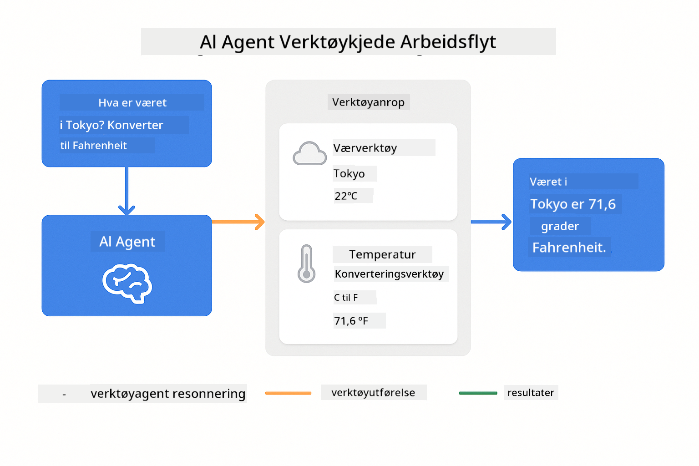
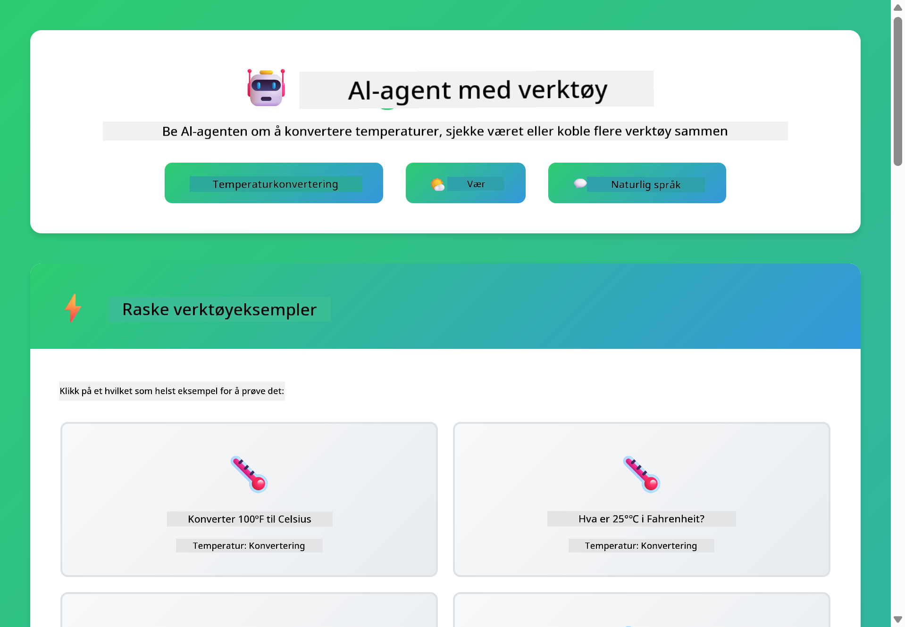

<!--
CO_OP_TRANSLATOR_METADATA:
{
  "original_hash": "aa23f106e7f53270924c9dd39c629004",
  "translation_date": "2025-12-13T19:01:58+00:00",
  "source_file": "04-tools/README.md",
  "language_code": "no"
}
-->
# Modul 04: AI-agenter med verktøy

## Innholdsfortegnelse

- [Hva du vil lære](../../../04-tools)
- [Forutsetninger](../../../04-tools)
- [Forstå AI-agenter med verktøy](../../../04-tools)
- [Hvordan verktøysanrop fungerer](../../../04-tools)
  - [Verktøydefinisjoner](../../../04-tools)
  - [Beslutningstaking](../../../04-tools)
  - [Utførelse](../../../04-tools)
  - [Responsgenerering](../../../04-tools)
- [Verktøykjedning](../../../04-tools)
- [Kjør applikasjonen](../../../04-tools)
- [Bruke applikasjonen](../../../04-tools)
  - [Prøv enkel verktøybruk](../../../04-tools)
  - [Test verktøykjedning](../../../04-tools)
  - [Se samtaleflyt](../../../04-tools)
  - [Observer resonnementet](../../../04-tools)
  - [Eksperimenter med ulike forespørsler](../../../04-tools)
- [Nøkkelkonsepter](../../../04-tools)
  - [ReAct-mønsteret (Resonnering og Handling)](../../../04-tools)
  - [Verktøybeskrivelser betyr noe](../../../04-tools)
  - [Øktstyring](../../../04-tools)
  - [Feilhåndtering](../../../04-tools)
- [Tilgjengelige verktøy](../../../04-tools)
- [Når du bør bruke verktøybaserte agenter](../../../04-tools)
- [Neste steg](../../../04-tools)

## Hva du vil lære

Så langt har du lært hvordan du kan ha samtaler med AI, strukturere prompts effektivt, og forankre svar i dokumentene dine. Men det finnes fortsatt en grunnleggende begrensning: språkmodeller kan bare generere tekst. De kan ikke sjekke været, utføre beregninger, spørre databaser eller samhandle med eksterne systemer.

Verktøy endrer dette. Ved å gi modellen tilgang til funksjoner den kan kalle, forvandler du den fra en tekstgenerator til en agent som kan utføre handlinger. Modellen bestemmer når den trenger et verktøy, hvilket verktøy den skal bruke, og hvilke parametere som skal sendes. Koden din utfører funksjonen og returnerer resultatet. Modellen inkorporerer dette resultatet i svaret sitt.

## Forutsetninger

- Fullført Modul 01 (Azure OpenAI-ressurser distribuert)
- `.env`-fil i rotkatalogen med Azure-legitimasjon (opprettet av `azd up` i Modul 01)

> **Merk:** Hvis du ikke har fullført Modul 01, følg distribusjonsinstruksjonene der først.

## Forstå AI-agenter med verktøy

En AI-agent med verktøy følger et resonnement- og handlingsmønster (ReAct):

1. Bruker stiller et spørsmål
2. Agenten resonerer om hva den trenger å vite
3. Agenten bestemmer om den trenger et verktøy for å svare
4. Hvis ja, kaller agenten det passende verktøyet med riktige parametere
5. Verktøyet utføres og returnerer data
6. Agenten inkorporerer resultatet og gir det endelige svaret


*ReAct-mønsteret - hvordan AI-agenter veksler mellom resonnement og handling for å løse problemer*

Dette skjer automatisk. Du definerer verktøyene og deres beskrivelser. Modellen håndterer beslutningstakingen om når og hvordan de skal brukes.

## Hvordan verktøysanrop fungerer

**Verktøydefinisjoner** - [WeatherTool.java](../../../04-tools/src/main/java/com/example/langchain4j/agents/tools/WeatherTool.java) | [TemperatureTool.java](../../../04-tools/src/main/java/com/example/langchain4j/agents/tools/TemperatureTool.java)

Du definerer funksjoner med klare beskrivelser og parameter-spesifikasjoner. Modellen ser disse beskrivelsene i systemprompten sin og forstår hva hvert verktøy gjør.

```java
@Component
public class WeatherTool {
    
    @Tool("Get the current weather for a location")
    public String getCurrentWeather(@P("Location name") String location) {
        // Logikken for væroppslag
        return "Weather in " + location + ": 22°C, cloudy";
    }
}

@AiService
public interface Assistant {
    String chat(@MemoryId String sessionId, @UserMessage String message);
}

// Assistenten er automatisk koblet av Spring Boot med:
// - ChatModel bean
// - Alle @Tool-metoder fra @Component-klasser
// - ChatMemoryProvider for sesjonshåndtering
```

> **🤖 Prøv med [GitHub Copilot](https://github.com/features/copilot) Chat:** Åpne [`WeatherTool.java`](../../../04-tools/src/main/java/com/example/langchain4j/agents/tools/WeatherTool.java) og spør:
> - "Hvordan kan jeg integrere en ekte vær-API som OpenWeatherMap i stedet for mock-data?"
> - "Hva kjennetegner en god verktøybeskrivelse som hjelper AI med å bruke det riktig?"
> - "Hvordan håndterer jeg API-feil og rate limits i verktøyimplementasjoner?"

**Beslutningstaking**

Når en bruker spør "Hvordan er været i Seattle?", gjenkjenner modellen at den trenger værverktøyet. Den genererer et funksjonsanrop med lokasjonsparameteren satt til "Seattle".

**Utførelse** - [AgentService.java](../../../04-tools/src/main/java/com/example/langchain4j/agents/service/AgentService.java)

Spring Boot kobler automatisk sammen den deklarative `@AiService`-grensesnittet med alle registrerte verktøy, og LangChain4j utfører verktøysanrop automatisk.

> **🤖 Prøv med [GitHub Copilot](https://github.com/features/copilot) Chat:** Åpne [`AgentService.java`](../../../04-tools/src/main/java/com/example/langchain4j/agents/service/AgentService.java) og spør:
> - "Hvordan fungerer ReAct-mønsteret og hvorfor er det effektivt for AI-agenter?"
> - "Hvordan bestemmer agenten hvilket verktøy som skal brukes og i hvilken rekkefølge?"
> - "Hva skjer hvis et verktøysutførelse feiler - hvordan bør jeg håndtere feil robust?"

**Responsgenerering**

Modellen mottar værdataene og formaterer dem til et naturlig språk-svar til brukeren.

### Hvorfor bruke deklarative AI-tjenester?

Denne modulen bruker LangChain4js Spring Boot-integrasjon med deklarative `@AiService`-grensesnitt:

- **Spring Boot auto-wiring** - ChatModel og verktøy injiseres automatisk
- **@MemoryId-mønster** - Automatisk øktbasert minnehåndtering
- **Enkelt instans** - Assistent opprettes én gang og gjenbrukes for bedre ytelse
- **Typesikker utførelse** - Java-metoder kalles direkte med typekonvertering
- **Multi-turn orkestrering** - Håndterer verktøykjedning automatisk
- **Null boilerplate** - Ingen manuelle AiServices.builder()-kall eller minne-HashMap

Alternative tilnærminger (manuell `AiServices.builder()`) krever mer kode og mangler Spring Boot-integrasjonens fordeler.

## Verktøykjedning

**Verktøykjedning** - AI kan kalle flere verktøy i sekvens. Spør "Hvordan er været i Seattle og bør jeg ta med paraply?" og se hvordan den kjeder `getCurrentWeather` med resonnement om regnutstyr.

<a href="images/tool-chaining.png"></a>

*Sekvensielle verktøysanrop - ett verktøys output mates inn i neste beslutning*

**Graceful Failures** - Spør om været i en by som ikke finnes i mock-dataene. Verktøyet returnerer en feilmelding, og AI forklarer at den ikke kan hjelpe. Verktøy feiler trygt.

Dette skjer i en enkelt samtalerunde. Agenten orkestrerer flere verktøysanrop autonomt.

## Kjør applikasjonen

**Verifiser distribusjon:**

Sørg for at `.env`-filen finnes i rotkatalogen med Azure-legitimasjon (opprettet under Modul 01):
```bash
cat ../.env  # Skal vise AZURE_OPENAI_ENDPOINT, API_KEY, DEPLOYMENT
```

**Start applikasjonen:**

> **Merk:** Hvis du allerede startet alle applikasjoner med `./start-all.sh` fra Modul 01, kjører denne modulen allerede på port 8084. Du kan hoppe over startkommandoene nedenfor og gå direkte til http://localhost:8084.

**Alternativ 1: Bruke Spring Boot Dashboard (Anbefalt for VS Code-brukere)**

Dev-containeren inkluderer Spring Boot Dashboard-utvidelsen, som gir et visuelt grensesnitt for å administrere alle Spring Boot-applikasjoner. Du finner den i aktivitetslinjen på venstre side i VS Code (se etter Spring Boot-ikonet).

Fra Spring Boot Dashboard kan du:
- Se alle tilgjengelige Spring Boot-applikasjoner i arbeidsområdet
- Starte/stoppe applikasjoner med ett klikk
- Se applikasjonslogger i sanntid
- Overvåke applikasjonsstatus

Klikk på play-knappen ved siden av "tools" for å starte denne modulen, eller start alle moduler samtidig.


**Alternativ 2: Bruke shell-skript**

Start alle webapplikasjoner (moduler 01-04):

**Bash:**
```bash
cd ..  # Fra rotkatalogen
./start-all.sh
```

**PowerShell:**
```powershell
cd ..  # Fra rotkatalogen
.\start-all.ps1
```

Eller start bare denne modulen:

**Bash:**
```bash
cd 04-tools
./start.sh
```

**PowerShell:**
```powershell
cd 04-tools
.\start.ps1
```

Begge skriptene laster automatisk miljøvariabler fra rotens `.env`-fil og bygger JAR-filene hvis de ikke finnes.

> **Merk:** Hvis du foretrekker å bygge alle moduler manuelt før oppstart:
>
> **Bash:**
> ```bash
> cd ..  # Go to root directory
> mvn clean package -DskipTests
> ```
>
> **PowerShell:**
> ```powershell
> cd ..  # Go to root directory
> mvn clean package -DskipTests
> ```

Åpne http://localhost:8084 i nettleseren din.

**For å stoppe:**

**Bash:**
```bash
./stop.sh  # Kun denne modulen
# Eller
cd .. && ./stop-all.sh  # Alle moduler
```

**PowerShell:**
```powershell
.\stop.ps1  # Kun denne modulen
# Eller
cd ..; .\stop-all.ps1  # Alle moduler
```

## Bruke applikasjonen

Applikasjonen tilbyr et webgrensesnitt hvor du kan samhandle med en AI-agent som har tilgang til vær- og temperaturkonverteringsverktøy.

<a href="images/tools-homepage.png"></a>

*AI Agent Tools-grensesnittet - raske eksempler og chatgrensesnitt for interaksjon med verktøy*

**Prøv enkel verktøybruk**

Start med en enkel forespørsel: "Konverter 100 grader Fahrenheit til Celsius". Agenten gjenkjenner at den trenger temperaturkonverteringsverktøyet, kaller det med riktige parametere, og returnerer resultatet. Legg merke til hvor naturlig dette føles – du spesifiserte ikke hvilket verktøy som skulle brukes eller hvordan det skulle kalles.

**Test verktøykjedning**

Prøv nå noe mer komplekst: "Hvordan er været i Seattle og konverter det til Fahrenheit?" Se agenten jobbe gjennom dette i trinn. Den henter først været (som returnerer Celsius), gjenkjenner at den må konvertere til Fahrenheit, kaller konverteringsverktøyet, og kombinerer begge resultater i ett svar.

**Se samtaleflyt**

Chatgrensesnittet opprettholder samtalehistorikk, slik at du kan ha flertrinnsinteraksjoner. Du kan se alle tidligere spørsmål og svar, noe som gjør det enkelt å følge samtalen og forstå hvordan agenten bygger kontekst over flere utvekslinger.

<a href="images/tools-conversation-demo.png"></a>

*Flertrinns samtale som viser enkle konverteringer, væroppslag og verktøykjedning*

**Eksperimenter med ulike forespørsler**

Prøv forskjellige kombinasjoner:
- Væroppslag: "Hvordan er været i Tokyo?"
- Temperaturkonverteringer: "Hva er 25°C i Kelvin?"
- Kombinerte spørsmål: "Sjekk været i Paris og fortell meg om det er over 20°C"

Legg merke til hvordan agenten tolker naturlig språk og mapper det til passende verktøysanrop.

## Nøkkelkonsepter

**ReAct-mønsteret (Resonnering og Handling)**

Agenten veksler mellom å resonnere (bestemme hva som skal gjøres) og å handle (bruke verktøy). Dette mønsteret muliggjør autonom problemløsning i stedet for bare å svare på instruksjoner.

**Verktøybeskrivelser betyr noe**

Kvaliteten på verktøybeskrivelsene dine påvirker direkte hvor godt agenten bruker dem. Klare, spesifikke beskrivelser hjelper modellen å forstå når og hvordan hvert verktøy skal kalles.

**Øktstyring**

`@MemoryId`-annotasjonen muliggjør automatisk øktbasert minnehåndtering. Hver økt-ID får sin egen `ChatMemory`-instans som håndteres av `ChatMemoryProvider`-beanen, noe som eliminerer behovet for manuell minnesporing.

**Feilhåndtering**

Verktøy kan feile – API-er kan time out, parametere kan være ugyldige, eksterne tjenester kan være nede. Produksjonsagenter trenger feilhåndtering slik at modellen kan forklare problemer eller prøve alternativer.

## Tilgjengelige verktøy

**Værverktøy** (mock-data for demonstrasjon):
- Hent nåværende vær for en lokasjon
- Hent værvarsel for flere dager

**Temperaturkonverteringsverktøy**:
- Celsius til Fahrenheit
- Fahrenheit til Celsius
- Celsius til Kelvin
- Kelvin til Celsius
- Fahrenheit til Kelvin
- Kelvin til Fahrenheit

Dette er enkle eksempler, men mønsteret kan utvides til enhver funksjon: databaseforespørsler, API-kall, beregninger, filoperasjoner eller systemkommandoer.

## Når du bør bruke verktøybaserte agenter

**Bruk verktøy når:**
- Svar krever sanntidsdata (vær, aksjekurser, lagerstatus)
- Du må utføre beregninger utover enkel matematikk
- Tilgang til databaser eller API-er
- Utføre handlinger (sende e-post, opprette saker, oppdatere poster)
- Kombinere flere datakilder

**Ikke bruk verktøy når:**
- Spørsmål kan besvares med generell kunnskap
- Svaret er rent samtalebasert
- Verktøyets ventetid vil gjøre opplevelsen for treg

## Neste steg

**Neste modul:** [05-mcp - Model Context Protocol (MCP)](../05-mcp/README.md)

---

**Navigasjon:** [← Forrige: Modul 03 - RAG](../03-rag/README.md) | [Tilbake til hovedmeny](../README.md) | [Neste: Modul 05 - MCP →](../05-mcp/README.md)

---

<!-- CO-OP TRANSLATOR DISCLAIMER START -->
**Ansvarsfraskrivelse**:
Dette dokumentet er oversatt ved hjelp av AI-oversettelsestjenesten [Co-op Translator](https://github.com/Azure/co-op-translator). Selv om vi streber etter nøyaktighet, vennligst vær oppmerksom på at automatiske oversettelser kan inneholde feil eller unøyaktigheter. Det opprinnelige dokumentet på originalspråket skal anses som den autoritative kilden. For kritisk informasjon anbefales profesjonell menneskelig oversettelse. Vi er ikke ansvarlige for eventuelle misforståelser eller feiltolkninger som oppstår ved bruk av denne oversettelsen.
<!-- CO-OP TRANSLATOR DISCLAIMER END -->