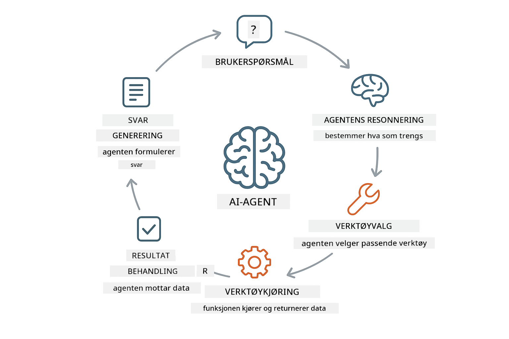
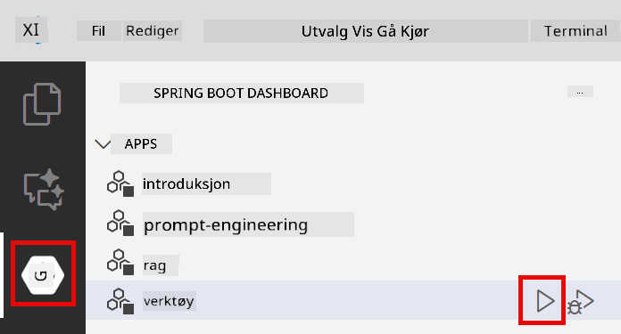

<!--
CO_OP_TRANSLATOR_METADATA:
{
  "original_hash": "13ec450c12cdd1a863baa2b778f27cd7",
  "translation_date": "2025-12-31T01:46:28+00:00",
  "source_file": "04-tools/README.md",
  "language_code": "no"
}
-->
# Modul 04: AI-agenter med verktøy

## Table of Contents

- [Hva du vil lære](../../../04-tools)
- [Forutsetninger](../../../04-tools)
- [Forstå AI-agenter med verktøy](../../../04-tools)
- [Hvordan verktøysanrop fungerer](../../../04-tools)
  - [Verktøydefinisjoner](../../../04-tools)
  - [Beslutningstaking](../../../04-tools)
  - [Utførelse](../../../04-tools)
  - [Generering av svar](../../../04-tools)
- [Kjedede verktøyanrop](../../../04-tools)
- [Kjør applikasjonen](../../../04-tools)
- [Bruke applikasjonen](../../../04-tools)
  - [Prøv enkel bruk av verktøy](../../../04-tools)
  - [Test kjedede verktøyanrop](../../../04-tools)
  - [Se samtaleflyten](../../../04-tools)
  - [Observer resonneringen](../../../04-tools)
  - [Eksperimenter med forskjellige forespørsler](../../../04-tools)
- [Nøkkelkonsepter](../../../04-tools)
  - [ReAct-mønsteret (Resonnering og handling)](../../../04-tools)
  - [Verktøybeskrivelser betyr noe](../../../04-tools)
  - [Sessionsadministrasjon](../../../04-tools)
  - [Feilhåndtering](../../../04-tools)
- [Tilgjengelige verktøy](../../../04-tools)
- [Når du bør bruke verktøybaserte agenter](../../../04-tools)
- [Neste steg](../../../04-tools)

## Hva du vil lære

Så langt har du lært hvordan du fører samtaler med AI, strukturerer prompts effektivt, og forankrer svar i dokumentene dine. Men det er fortsatt en grunnleggende begrensning: språkmodeller kan bare generere tekst. De kan ikke sjekke været, utføre beregninger, spørre databaser eller interagere med eksterne systemer.

Verktøy endrer dette. Ved å gi modellen tilgang til funksjoner den kan kalle, forvandler du den fra en tekstgenerator til en agent som kan utføre handlinger. Modellen bestemmer når den trenger et verktøy, hvilket verktøy som skal brukes, og hvilke parametere som skal sendes. Koden din utfører funksjonen og returnerer resultatet. Modellen innlemmer det resultatet i sitt svar.

## Forutsetninger

- Fullført Modul 01 (Azure OpenAI-ressurser distribuert)
- `.env`-fil i rotkatalogen med Azure-legitimasjon (opprettet av `azd up` i Modul 01)

> **Merk:** Hvis du ikke har fullført Modul 01, følg distribusjonsinstruksjonene der først.

## Forstå AI-agenter med verktøy

> **📝 Merk:** Begrepet "agenter" i denne modulen refererer til AI-assistenter som er utvidet med mulighet for å kalle verktøy. Dette er forskjellig fra **Agentic AI**-mønstrene (autonome agenter med planlegging, minne og flerstegs resonnering) som vi vil dekke i [Module 05: MCP](../05-mcp/README.md).

En AI-agent med verktøy følger et resonnerings- og handlingsmønster (ReAct):

1. Brukeren stiller et spørsmål
2. Agenten resonerer om hva den trenger å vite
3. Agenten avgjør om den trenger et verktøy for å svare
4. Hvis ja, kaller agenten det passende verktøyet med riktige parametere
5. Verktøyet utføres og returnerer data
6. Agenten innlemmer resultatet og gir det endelige svaret



*ReAct-mønsteret - hvordan AI-agenter veksler mellom resonnering og handling for å løse problemer*

Dette skjer automatisk. Du definerer verktøyene og deres beskrivelser. Modellen håndterer beslutningstakingen om når og hvordan de skal brukes.

## Hvordan verktøysanrop fungerer

**Verktøydefinisjoner** - [WeatherTool.java](../../../04-tools/src/main/java/com/example/langchain4j/agents/tools/WeatherTool.java) | [TemperatureTool.java](../../../04-tools/src/main/java/com/example/langchain4j/agents/tools/TemperatureTool.java)

Du definerer funksjoner med klare beskrivelser og parameter-spesifikasjoner. Modellen ser disse beskrivelsene i sitt system-prompt og forstår hva hvert verktøy gjør.

```java
@Component
public class WeatherTool {
    
    @Tool("Get the current weather for a location")
    public String getCurrentWeather(@P("Location name") String location) {
        // Logikken din for væroppslag
        return "Weather in " + location + ": 22°C, cloudy";
    }
}

@AiService
public interface Assistant {
    String chat(@MemoryId String sessionId, @UserMessage String message);
}

// Assistenten er automatisk konfigurert av Spring Boot med:
// - ChatModel bean
// - Alle @Tool-metoder fra @Component-klasser
// - ChatMemoryProvider for sesjonshåndtering
```

> **🤖 Prøv med [GitHub Copilot](https://github.com/features/copilot) Chat:** Åpne [`WeatherTool.java`](../../../04-tools/src/main/java/com/example/langchain4j/agents/tools/WeatherTool.java) og spør:
> - "Hvordan ville jeg integrere en ekte vær-API som OpenWeatherMap i stedet for mock-data?"
> - "Hva gjør en god verktøybeskrivelse som hjelper AI-en å bruke det riktig?"
> - "Hvordan håndterer jeg API-feil og rate limits i verktøyimplementasjoner?"

**Beslutningstaking**

Når en bruker spør "What's the weather in Seattle?", gjenkjenner modellen at den trenger værverktøyet. Den genererer et funksjonsanrop med lokasjonsparameteren satt til "Seattle".

**Utførelse** - [AgentService.java](../../../04-tools/src/main/java/com/example/langchain4j/agents/service/AgentService.java)

Spring Boot autowired den deklarative `@AiService`-grensesnittet med alle registrerte verktøy, og LangChain4j utfører verktøysanrop automatisk.

> **🤖 Prøv med [GitHub Copilot](https://github.com/features/copilot) Chat:** Åpne [`AgentService.java`](../../../04-tools/src/main/java/com/example/langchain4j/agents/service/AgentService.java) og spør:
> - "Hvordan fungerer ReAct-mønsteret og hvorfor er det effektivt for AI-agenter?"
> - "Hvordan avgjør agenten hvilket verktøy som skal brukes og i hvilken rekkefølge?"
> - "Hva skjer hvis et verktøyutførelse mislykkes - hvordan bør jeg håndtere feil robust?"

**Generering av svar**

Modellen mottar værdataene og formaterer dem til et naturlig språk-svar til brukeren.

### Hvorfor bruke deklarative AI-tjenester?

Denne modulen bruker LangChain4j sin Spring Boot-integrasjon med deklarative `@AiService`-grensesnitt:

- **Spring Boot auto-wiring** - ChatModel og verktøy injiseres automatisk
- **`@MemoryId`-mønsteret** - Automatisk sesjonsbasert minnehåndtering
- **Enkelt forekomst** - Assistenten opprettes én gang og gjenbrukes for bedre ytelse
- **Typesikker utførelse** - Java-metoder kalles direkte med typekonvertering
- **Flersvikts orkestrering** - Håndterer kjedeanrop av verktøy automatisk
- **Null boilerplate** - Ingen manuelle AiServices.builder() kall eller memory HashMap

Alternative tilnærminger (manuell `AiServices.builder()`) krever mer kode og mister fordelene ved Spring Boot-integrasjon.

## Kjedede verktøyanrop

**Kjedede verktøyanrop** - AI-en kan kalle flere verktøy i sekvens. Spør "What's the weather in Seattle and should I bring an umbrella?" og se hvordan den kjeder `getCurrentWeather` med resonnering om regnjakke/parasoll.

<a href="images/tool-chaining.png"></a>

*Sekvensielle verktøysanrop - utdata fra ett verktøy gir grunnlag for neste avgjørelse*

**Glatte feil** - Be om vær i en by som ikke finnes i mock-dataene. Verktøyet returnerer en feilmelding, og AI-en forklarer at det ikke kan hjelpe. Verktøy feiler trygt.

Dette skjer i ett enkelt samtaleturn. Agenten orkestrerer flere verktøysanrop autonomt.

## Kjør applikasjonen

**Verifiser distribusjon:**

Sørg for at `.env`-filen finnes i rotkatalogen med Azure-legitimasjon (opprettet under Modul 01):
```bash
cat ../.env  # Bør vise AZURE_OPENAI_ENDPOINT, API_KEY, DEPLOYMENT
```

**Start applikasjonen:**

> **Merk:** Hvis du allerede startet alle applikasjoner med `./start-all.sh` fra Modul 01, kjører denne modulen allerede på port 8084. Du kan hoppe over startkommandoene nedenfor og gå direkte til http://localhost:8084.

**Alternativ 1: Bruke Spring Boot Dashboard (Anbefalt for VS Code-brukere)**

Dev-containeren inkluderer Spring Boot Dashboard-utvidelsen, som gir et visuelt grensesnitt for å administrere alle Spring Boot-applikasjoner. Du finner den i Activity Bar på venstre side av VS Code (se etter Spring Boot-ikonet).

Fra Spring Boot Dashboard kan du:
- Se alle tilgjengelige Spring Boot-applikasjoner i arbeidsområdet
- Starte/stoppe applikasjoner med ett klikk
- Se applikasjonslogger i sanntid
- Overvåke applikasjonsstatus

Klikk bare på spilleknappen ved siden av "tools" for å starte denne modulen, eller start alle moduler samtidig.



**Alternativ 2: Bruke shell-scripts**

Start alle web-applikasjoner (modulene 01-04):

**Bash:**
```bash
cd ..  # Fra rotkatalogen
./start-all.sh
```

**PowerShell:**
```powershell
cd ..  # Fra rotkatalogen
.\start-all.ps1
```

Eller start bare denne modulen:

**Bash:**
```bash
cd 04-tools
./start.sh
```

**PowerShell:**
```powershell
cd 04-tools
.\start.ps1
```

Begge skriptene laster automatisk inn miljøvariabler fra rotens `.env`-fil og bygger JAR-ene hvis de ikke finnes.

> **Merk:** Hvis du foretrekker å bygge alle moduler manuelt før oppstart:
>
> **Bash:**
> ```bash
> cd ..  # Go to root directory
> mvn clean package -DskipTests
> ```
>
> **PowerShell:**
> ```powershell
> cd ..  # Go to root directory
> mvn clean package -DskipTests
> ```

Åpne http://localhost:8084 i nettleseren din.

**For å stoppe:**

**Bash:**
```bash
./stop.sh  # Kun denne modulen
# Eller
cd .. && ./stop-all.sh  # Alle moduler
```

**PowerShell:**
```powershell
.\stop.ps1  # Kun denne modulen
# Eller
cd ..; .\stop-all.ps1  # Alle moduler
```

## Bruke applikasjonen

Applikasjonen tilbyr et webgrensesnitt hvor du kan samhandle med en AI-agent som har tilgang til vær- og temperaturkonverteringsverktøy.

<a href="images/tools-homepage.png"></a>

*AI Agent Tools-grensesnittet - hurtigeksempler og chattegrensesnitt for å samhandle med verktøy*

**Prøv enkel bruk av verktøy**

Start med en enkel forespørsel: "Convert 100 degrees Fahrenheit to Celsius". Agenten gjenkjenner at den trenger temperaturkonverteringsverktøyet, kaller det med riktige parametere, og returnerer resultatet. Legg merke til hvor naturlig dette føles - du spesifiserte ikke hvilket verktøy som skulle brukes eller hvordan du skulle kalle det.

**Test kjedede verktøyanrop**

Prøv nå noe mer komplekst: "What's the weather in Seattle and convert it to Fahrenheit?" Se hvordan agenten jobber steg for steg. Den henter først været (som returnerer Celsius), gjenkjenner at den trenger å konvertere til Fahrenheit, kaller konverteringsverktøyet og kombinerer begge resultatene i ett svar.

**Se samtaleflyten**

Chattegrensesnittet opprettholder samtalehistorikk, slik at du kan ha flersviktige interaksjoner. Du kan se alle tidligere forespørsler og svar, noe som gjør det enkelt å følge samtalen og forstå hvordan agenten bygger kontekst over flere utvekslinger.

<a href="images/tools-conversation-demo.png"></a>

*Flersviktig samtale som viser enkle konverteringer, væroppslag og kjedede verktøysanrop*

**Eksperimenter med forskjellige forespørsler**

Prøv ulike kombinasjoner:
- Væroverslag: "What's the weather in Tokyo?"
- Temperaturkonverteringer: "What is 25°C in Kelvin?"
- Kombinerte forespørsler: "Check the weather in Paris and tell me if it's above 20°C"

Legg merke til hvordan agenten tolker naturlig språk og mapper det til passende verktøysanrop.

## Nøkkelkonsepter

**ReAct-mønsteret (Resonnering og handling)**

Agenten veksler mellom resonnering (bestemme hva som skal gjøres) og handling (bruke verktøy). Dette mønsteret muliggjør autonom problemløsning i stedet for bare å svare på instruksjoner.

**Verktøybeskrivelser betyr noe**

Kvaliteten på verktøybeskrivelsene påvirker direkte hvor godt agenten bruker dem. Klare, spesifikke beskrivelser hjelper modellen med å forstå når og hvordan hvert verktøy skal kalles.

**Sessionsadministrasjon**

`@MemoryId`-annotasjonen muliggjør automatisk sesjonsbasert minnehåndtering. Hver session-ID får sin egen `ChatMemory`-instans som administreres av `ChatMemoryProvider`-beanen, noe som eliminerer behovet for manuell minnesporing.

**Feilhåndtering**

Verktøy kan feile - API-er kan tidsavslutte, parametere kan være ugyldige, eksterne tjenester kan gå ned. Produksjonsagenter trenger feilhåndtering slik at modellen kan forklare problemer eller prøve alternativer.

## Tilgjengelige verktøy

**Værverktøy** (mock-data for demonstrasjon):
- Hent nåværende vær for en lokasjon
- Hent fler-dagers værvarsel

**Temperaturkonverteringsverktøy**:
- Celsius til Fahrenheit
- Fahrenheit til Celsius
- Celsius til Kelvin
- Kelvin til Celsius
- Fahrenheit til Kelvin
- Kelvin til Fahrenheit

Dette er enkle eksempler, men mønsteret kan utvides til enhver funksjon: databaseforespørsler, API-kall, beregninger, filoperasjoner eller systemkommandoer.

## Når du bør bruke verktøybaserte agenter

**Bruk verktøy når:**
- Svaret krever sanntidsdata (vær, aksjekurser, lagerstatus)
- Du trenger å utføre beregninger utover enkel matematikk
- Tilgang til databaser eller API-er
- Utføre handlinger (sende e-poster, opprette tickets, oppdatere poster)
- Kombinere flere datakilder

**Ikke bruk verktøy når:**
- Spørsmål kan besvares fra generell kunnskap
- Svaret er rent konversasjonelt
- Verktøylatens vil gjøre opplevelsen for treg

## Neste steg

**Neste modul:** [05-mcp - Model Context Protocol (MCP)](../05-mcp/README.md)

---

**Navigasjon:** [← Forrige: Module 03 - RAG](../03-rag/README.md) | [Tilbake til hovedsiden](../README.md) | [Neste: Module 05 - MCP →](../05-mcp/README.md)

---

<!-- CO-OP TRANSLATOR DISCLAIMER START -->
Ansvarsfraskrivelse:
Dette dokumentet er oversatt ved hjelp av AI-oversettelsestjenesten [Co-op Translator](https://github.com/Azure/co-op-translator). Selv om vi streber etter nøyaktighet, vennligst merk at automatiske oversettelser kan inneholde feil eller unøyaktigheter. Det opprinnelige dokumentet på originalspråket bør anses som den autoritative kilden. For kritisk informasjon anbefales profesjonell menneskelig oversettelse. Vi er ikke ansvarlige for eventuelle misforståelser eller feiltolkninger som oppstår ved bruk av denne oversettelsen.
<!-- CO-OP TRANSLATOR DISCLAIMER END -->