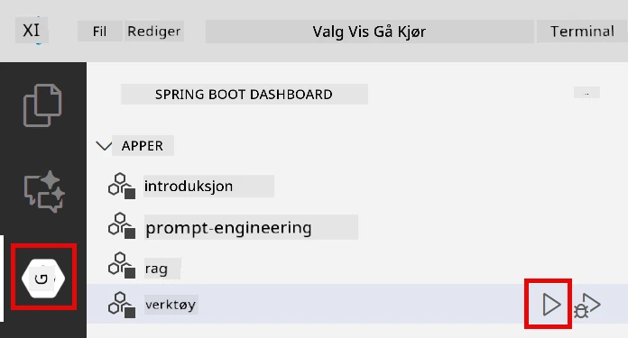
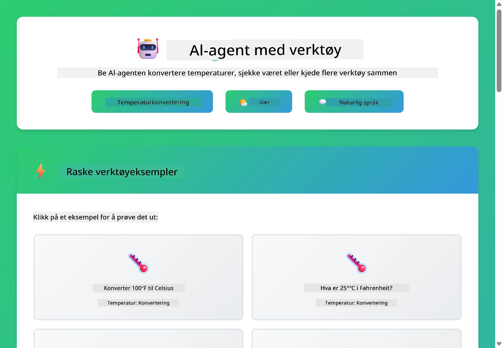
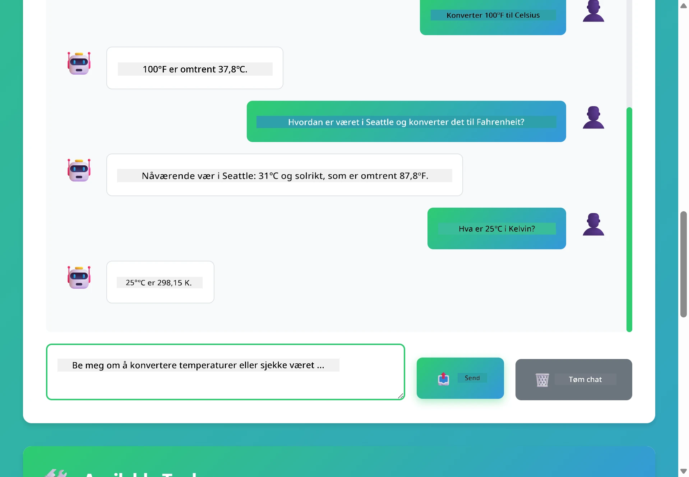

# Modul 04: AI-agenter med verktøy

## Innholdsfortegnelse

- [Video-gjennomgang](#video-gjennomgang)
- [Hva du vil lære](#hva-du-vil-lære)
- [Forutsetninger](#forutsetninger)
- [Forstå AI-agenter med verktøy](#forstå-ai-agenter-med-verktøy)
- [Hvordan verktøysanrop fungerer](#hvordan-verktøysanrop-fungerer)
  - [Verktøydefinisjoner](#verktøydefinisjoner)
  - [Beslutningstaking](#beslutningstaking)
  - [Utførelse](#utførelse)
  - [Generering av svar](#generering-av-svar)
  - [Arkitektur: Spring Boot Auto-Wiring](#arkitektur-spring-boot-auto-wiring)
- [Verktøykjeding](#verktøykjeding)
- [Kjør applikasjonen](#kjør-applikasjonen)
- [Bruke applikasjonen](#bruke-applikasjonen)
  - [Prøv enkel verktøybruk](#prøv-enkel-bruk-av-verktøy)
  - [Test verktøykjeding](#test-kjeding-av-verktøy)
  - [Se samtaleflyt](#se-samtaleflyt)
  - [Eksperimenter med forskjellige spørsmål](#eksperimenter-med-forskjellige-forespørsler)
- [Nøkkelkonsepter](#nøkkelkonsepter)
  - [ReAct-mønsteret (resonnering og handling)](#react-mønsteret-resonnering-og-handling)
  - [Verktøybeskrivelser betyr noe](#verktøybeskrivelser-er-viktige)
  - [Sesjonshåndtering](#sesjonshåndtering)
  - [Feilhåndtering](#feilhåndtering)
- [Tilgjengelige verktøy](#tilgjengelige-verktøy)
- [Når bør man bruke verktøybaserte agenter](#når-bruke-verktøybaserte-agenter)
- [Verktøy vs RAG](#verktøy-vs-rag)
- [Neste steg](#neste-steg)

## Video-gjennomgang

Se denne livesesjonen som forklarer hvordan du kommer i gang med denne modulen:

<a href="https://www.youtube.com/watch?v=O_J30kZc0rw"></a>

## Hva du vil lære

Så langt har du lært hvordan du kan føre samtaler med AI, strukturere prompt effektivt, og forankre svar i dokumentene dine. Men det finnes fortsatt en grunnleggende begrensning: språkmodeller kan bare generere tekst. De kan ikke sjekke været, utføre beregninger, spørringer i databaser, eller samhandle med eksterne systemer.

Verktøy endrer dette. Ved å gi modellen tilgang til funksjoner den kan kalle, forvandler du den fra en tekstgenerator til en agent som kan utføre handlinger. Modellen bestemmer når den trenger et verktøy, hvilket verktøy den skal bruke og hvilke parametere som skal sendes. Koden din utfører funksjonen og returnerer resultatet. Modellen integrerer resultatet i svaret.

## Forutsetninger

- Fullført [Modul 01 - Introduksjon](../01-introduction/README.md) (Azure OpenAI-ressurser distribuert)
- Det anbefales å ha fullført tidligere moduler (denne modulen refererer til [RAG-konsepter fra Modul 03](../03-rag/README.md) i sammenligningen mellom Verktøy vs RAG)
- `.env`-fil i rotmappen med Azure-legitimasjon (opprettet med `azd up` i Modul 01)

> **Merk:** Hvis du ikke har fullført Modul 01, følg først distribusjonsinstruksjonene der.

## Forstå AI-agenter med verktøy

> **📝 Merknad:** Begrepet "agenter" i denne modulen refererer til AI-assistenter utvidet med muligheter for å kalle verktøy. Dette er forskjellig fra **Agentic AI**-mønstrene (autonome agenter med planlegging, minne og flertrinns resonnering) som vi dekker i [Modul 05: MCP](../05-mcp/README.md).

Uten verktøy kan en språkmodell bare generere tekst basert på treningsdataene sine. Spør den om været, og den må gjette. Gi den verktøy, og den kan kalle en vær-API, utføre beregninger, eller søke i en database — og deretter veve disse virkelige resultatene inn i svaret sitt.


*Uten verktøy kan modellen bare gjette — med verktøy kan den kalle API-er, regne ut og returnere data i sanntid.*

En AI-agent med verktøy følger et **Reasoning and Acting (ReAct)**-mønster. Modellen bare svarer ikke — den tenker over hva den trenger, handler ved å kalle et verktøy, observerer resultatet, og bestemmer så om den skal handle igjen eller gi endelig svar:

1. **Resonner** — Agenten analyserer brukerens spørsmål og finner ut hvilken informasjon den trenger
2. **Handle** — Agenten velger riktig verktøy, genererer korrekte parametere og kaller det
3. **Observer** — Agenten mottar verktøyets resultat og vurderer det
4. **Gjenta eller svar** — Hvis mer data trengs, går agenten tilbake; ellers setter den sammen et naturlig språk-svar


*ReAct-syklusen — agenten resonerer om hva den skal gjøre, handler ved å kalle et verktøy, observerer resultatet, og gjentar til den kan gi endelig svar.*

Dette skjer automatisk. Du definerer verktøyene og beskrivelsene deras. Modellen håndterer beslutningstaking om når og hvordan de skal brukes.

## Hvordan verktøysanrop fungerer

### Verktøydefinisjoner

[WeatherTool.java](../../../04-tools/src/main/java/com/example/langchain4j/agents/tools/WeatherTool.java) | [TemperatureTool.java](../../../04-tools/src/main/java/com/example/langchain4j/agents/tools/TemperatureTool.java)

Du definerer funksjoner med klare beskrivelser og parameter-spesifikasjoner. Modellen ser disse beskrivelsene i systemprompten sin og forstår hva hvert verktøy gjør.

```java
@Component
public class WeatherTool {
    
    @Tool("Get the current weather for a location")
    public String getCurrentWeather(@P("Location name") String location) {
        // Logikken for væroppslag
        return "Weather in " + location + ": 22°C, cloudy";
    }
}

@AiService
public interface Assistant {
    String chat(@MemoryId String sessionId, @UserMessage String message);
}

// Assistenten kobles automatisk av Spring Boot med:
// - ChatModel bean
// - Alle @Tool-metoder fra @Component-klasser
// - ChatMemoryProvider for øktadministrasjon
```

Diagrammet nedenfor bryter ned hver annotasjon og viser hvordan hver del hjelper AI til å forstå når den skal kalle verktøyet og hvilke argumenter som skal gis:


*Anatomi av en verktøydefinisjon — @Tool forteller AI når den skal bruke det, @P beskriver hver parameter, og @AiService kobler alt sammen ved oppstart.*

> **🤖 Prøv med [GitHub Copilot](https://github.com/features/copilot) Chat:** Åpne [`WeatherTool.java`](../../../04-tools/src/main/java/com/example/langchain4j/agents/tools/WeatherTool.java) og spør:
> - "Hvordan kan jeg integrere en ekte vær-API som OpenWeatherMap i stedet for mockdata?"
> - "Hva kjennetegner en god verktøybeskrivelse som hjelper AI å bruke det korrekt?"
> - "Hvordan håndterer jeg API-feil og rate limits i implementasjon av verktøy?"

### Beslutningstaking

Når en bruker spør "Hva er været i Seattle?", velger ikke modellen verktøy tilfeldig. Den sammenligner brukerens intensjon med alle verktøybeskrivelser den har tilgang til, scorer relevans for hvert, og velger det beste treffet. Den genererer så et strukturert funksjonsanrop med riktige parametere — her settes `location` til `"Seattle"`.

Hvis ingen verktøy matcher brukerens forespørsel, faller modellen tilbake på å svare fra sin egen kunnskap. Hvis flere verktøy matcher, velger den det mest spesifikke.


*Modellen vurderer hvert tilgjengelige verktøy mot brukerens intensjon og velger beste match — derfor er det viktig å skrive klare, spesifikke verktøybeskrivelser.*

### Utførelse

[AgentService.java](../../../04-tools/src/main/java/com/example/langchain4j/agents/service/AgentService.java)

Spring Boot kobler automatisk det deklarative `@AiService`-grensesnittet med alle registrerte verktøy, og LangChain4j utfører verktøysanrop automatisk. Bak kulissene flyter et komplett verktøysanrop gjennom seks stadier — fra brukerens naturlige språk-spørsmål helt tilbake til et svar i naturlig språk:


*Ende-til-ende-flyt — brukeren stiller et spørsmål, modellen velger et verktøy, LangChain4j utfører det, og modellen vever resultatet inn i et naturlig svar.*

Bak kulissene kjører `AiServices` samme verktøysanrop-løkke for hvilket som helst verktøy — her illustrert med en enkel `Calculator`. Sekvensdiagrammet under viser nøyaktig hva som skjer under panseret:


*Verktøysanrop-løkka — `AiServices` sender meldingen og verktøyskjemadefinisjoner til LLM, LLM svarer med et funksjonskall som `add(42, 58)`, LangChain4j utfører `Calculator`-metoden lokalt, og leverer resultatet tilbake for endelig svar.*

> **🤖 Prøv med [GitHub Copilot](https://github.com/features/copilot) Chat:** Åpne [`AgentService.java`](../../../04-tools/src/main/java/com/example/langchain4j/agents/service/AgentService.java) og spør:
> - "Hvordan fungerer ReAct-mønsteret og hvorfor er det effektivt for AI-agenter?"
> - "Hvordan avgjør agenten hvilket verktøy den skal bruke og i hvilken rekkefølge?"
> - "Hva skjer om utføring av et verktøy feiler - hvordan håndterer jeg robust feilhåndtering?"

### Generering av svar

Modellen mottar værdataene og formaterer dem til et svar i naturlig språk for brukeren.

### Arkitektur: Spring Boot Auto-Wiring

Denne modulen bruker LangChain4j sin Spring Boot-integrasjon med deklarative `@AiService`-grensesnitt. Ved oppstart oppdager Spring Boot hver `@Component` som inneholder `@Tool`-metoder, beanen din for `ChatModel`, og `ChatMemoryProvider` — og kobler dem sammen til et enkelt `Assistant`-grensesnitt uten behov for boilerplate.


*@AiService-grensesnittet binder sammen ChatModel, verktøykomponenter og minnetilbyder — Spring Boot håndterer hele koblingen automatisk.*

Her er hele forespørselslivssyklusen som et sekvensdiagram — fra HTTP-forespørselen gjennom controller, service og auto-koble proxy, helt til verktøyutførelse og tilbake:


*Fullstendig Spring Boot-forespørselslivssyklus — HTTP-forespørsel går gjennom controller og service til auto-koble Assistant-proxy, som orkestrerer LLM og verktøysanrop automatisk.*

Viktige fordeler med denne tilnærmingen:

- **Spring Boot auto-wiring** — ChatModel og verktøy injiseres automatisk
- **@MemoryId-mønster** — Automatisk minnehåndtering per sesjon
- **Enkelt instans** — Assistant opprettes én gang og gjenbrukes for bedre ytelse
- **Typesikker utførelse** — Java-metoder kalles direkte med typekonvertering
- **Orkestrering med flere trinn** — Håndterer verktøykjeding automatisk
- **Ingen boilerplate** — Ingen manuelle `AiServices.builder()`-kall eller memory HashMap

Alternative tilnærminger (manuelle `AiServices.builder()`) krever mer kode og mangler Spring Boot-integrasjonsfordelene.

## Verktøykjeding

**Verktøykjeding** — Den virkelige kraften i verktøybaserte agenter vises når ett enkelt spørsmål trenger flere verktøy. Spør "Hva er været i Seattle i Fahrenheit?" og agenten kjeder automatisk sammen to verktøy: først kaller den `getCurrentWeather` for å få temperaturen i Celsius, deretter sender den den verdien til `celsiusToFahrenheit` for konvertering — alt i én enkelt samtaleomgang.


*Verktøykjeding i praksis — agenten kaller først getCurrentWeather, deretter sender den Celsius-resultatet videre til celsiusToFahrenheit, og leverer et kombinert svar.*

**Grasiøse feil** — Be om vær i en by som ikke finnes i mock-dataene. Verktøyet returnerer en feilmelding, og AI forklarer at det ikke kan hjelpe i stedet for å krasje. Verktøy feiler trygt. Diagrammet under kontrasterer de to tilnærmingene — med skikkelig feilhåndtering fanger agenten unntaket og svarer hjelpsomt, uten håndtering krasjer hele applikasjonen:


*Når et verktøy feiler, fanger agenten feilen og svarer med en hjelpsom forklaring i stedet for at det krasjer.*

Dette skjer i én enkelt samtalerunde. Agenten orkestrerer flere verktøysanrop autonomt.

## Kjør applikasjonen

**Verifiser distribusjon:**

Sørg for at `.env`-filen finnes i rotmappen med Azure-legitimasjon (opprettet under Modul 01). Kjør dette fra modulkatalogen (`04-tools/`):

**Bash:**
```bash
cat ../.env  # Skal vise AZURE_OPENAI_ENDPOINT, API_KEY, DEPLOYMENT
```

**PowerShell:**
```powershell
Get-Content ..\.env  # Skal vise AZURE_OPENAI_ENDPOINT, API_KEY, DEPLOYMENT
```

**Start applikasjonen:**

> **Merk:** Hvis du allerede startet alle applikasjoner med `./start-all.sh` i rotmappen (som beskrevet i Modul 01), kjører denne modulen allerede på port 8084. Da kan du hoppe over startkommandoene nedenfor og gå rett til http://localhost:8084.

**Alternativ 1: Bruke Spring Boot Dashboard (anbefalt for VS Code-brukere)**

Dev-containeren inkluderer Spring Boot Dashboard-utvidelsen, som gir et visuelt grensesnitt for å administrere alle Spring Boot-applikasjoner. Du finner det i aktivitetsbaren til venstre i VS Code (se etter Spring Boot-ikonet).

Fra Spring Boot Dashboard kan du:
- Se alle tilgjengelige Spring Boot-applikasjoner i arbeidsområdet
- Starte/stoppe applikasjoner med ett klikk
- Se applikasjonslogger i sanntid
- Overvåke applikasjonsstatus

Klikk bare på spill-knappen ved siden av "tools" for å starte denne modulen, eller start alle moduler samtidig.

Slik ser Spring Boot Dashboard ut i VS Code:


*Spring Boot Dashboard i VS Code — start, stopp og overvåk alle moduler fra ett sted*

**Valg 2: Bruke shell-skript**

Start alle webapplikasjoner (moduler 01-04):

**Bash:**
```bash
cd ..  # Fra rotkatalogen
./start-all.sh
```

**PowerShell:**
```powershell
cd ..  # Fra rotkatalogen
.\start-all.ps1
```

Eller start bare denne modulen:

**Bash:**
```bash
cd 04-tools
./start.sh
```

**PowerShell:**
```powershell
cd 04-tools
.\start.ps1
```

Begge skriptene laster automatisk miljøvariabler fra rot-`.env`-filen og bygger JAR-filene hvis de ikke eksisterer.

> **Merk:** Hvis du foretrekker å bygge alle moduler manuelt før oppstart:
>
> **Bash:**
> ```bash
> cd ..  # Go to root directory
> mvn clean package -DskipTests
> ```

> **PowerShell:**
> ```powershell
> cd ..  # Go to root directory
> mvn clean package -DskipTests
> ```

Åpne http://localhost:8084 i nettleseren din.

**For å stoppe:**

**Bash:**
```bash
./stop.sh  # Kun denne modulen
# Eller
cd .. && ./stop-all.sh  # Alle moduler
```

**PowerShell:**
```powershell
.\stop.ps1  # Kun denne modulen
# Eller
cd ..; .\stop-all.ps1  # Alle moduler
```

## Bruke applikasjonen

Applikasjonen tilbyr et nettgrensesnitt hvor du kan samhandle med en AI-agent som har tilgang til verktøy for vær og temperaturkonvertering. Slik ser grensesnittet ut — det inkluderer rask-starter eksempler og en samtalepanel for å sende forespørsler:

<a href="images/tools-homepage.png"></a>

*AI Agent Tools-grensesnittet - raske eksempler og chattegrensesnitt for verktøysamhandling*

### Prøv enkel bruk av verktøy

Start med en enkel forespørsel: "Konverter 100 grader Fahrenheit til Celsius". Agenten skjønner at den trenger temperaturkonverteringsverktøyet, kaller det med riktige parametere og returnerer resultatet. Legg merke til hvor naturlig dette føles - du spesifiserte ikke hvilket verktøy som skulle brukes eller hvordan det skulle kalles.

### Test kjeding av verktøy

Prøv nå noe mer komplekst: "Hvordan er været i Seattle og konverter det til Fahrenheit?" Se agenten jobbe steg for steg. Først henter den været (som returnerer i Celsius), forstår at den må konvertere til Fahrenheit, kaller konverteringsverktøyet, og kombinerer begge resultater til ett svar.

### Se samtaleflyt

Chattesystemet bevarer samtalehistorikken, slik at du kan ha flertrinns interaksjoner. Du kan se alle tidligere forespørsler og svar, noe som gjør det enkelt å følge samtalen og forstå hvordan agenten bygger kontekst over flere utvekslinger.

<a href="images/tools-conversation-demo.png"></a>

*Flertrinns samtale som viser enkle konverteringer, værspørringer og kjeding av verktøy*

### Eksperimenter med forskjellige forespørsler

Prøv ulike kombinasjoner:
- Værspørringer: "Hvordan er været i Tokyo?"
- Temperaturkonverteringer: "Hva er 25°C i Kelvin?"
- Kombinerte forespørsler: "Sjekk været i Paris og fortell meg om det er over 20°C"

Legg merke til hvordan agenten tolker naturlig språk og oversetter det til korrekte verktøys-kall.

## Nøkkelkonsepter

### ReAct-mønsteret (Resonnering og Handling)

Agenten veksler mellom å resonnere (bestemme hva som skal gjøres) og å handle (bruke verktøy). Dette mønsteret muliggjør autonom problemløsning i stedet for bare å svare på instruksjoner.

### Verktøybeskrivelser er viktige

Kvaliteten på verktøybeskrivelsene dine påvirker hvor godt agenten bruker dem. Klare, spesifikke beskrivelser hjelper modellen å vite når og hvordan hvert verktøy skal kalles.

### Sesjonshåndtering

`@MemoryId`-annotasjonen gjør det mulig å håndtere minne basert på økter automatisk. Hver økt-ID får sin egen `ChatMemory`-instans som administreres av `ChatMemoryProvider`-bean, slik at flere brukere kan samhandle med agenten samtidig uten at samtalene blandes. Følgende diagram viser hvordan flere brukere blir rutet til isolerte minnelagre basert på sesjons-IDer:


*Hver sesjons-ID kartlegges til en isolert samtalehistorikk — brukere ser aldri hverandres meldinger.*

### Feilhåndtering

Verktøy kan feile — API-er kan time ut, parametere kan være ugyldige, eksterne tjenester kan være nede. Produksjonsagenter trenger feilhåndtering slik at modellen kan forklare problemer eller prøve alternativer i stedet for å krasje hele applikasjonen. Når et verktøy kaster en unntak, fanger LangChain4j det og sender feilmeldingen tilbake til modellen, som deretter kan forklare problemet på naturlig språk.

## Tilgjengelige verktøy

Diagrammet nedenfor viser det brede økosystemet av verktøy du kan bygge. Denne modulen demonstrerer vær- og temperaturverktøy, men samme `@Tool`-mønster fungerer for alle Java-metoder — fra databaseforespørsler til betalingsbehandling.


*Enhver Java-metode annotert med @Tool blir tilgjengelig for AI — mønsteret strekker seg til databaser, API-er, e-post, filoperasjoner og mer.*

## Når bruke verktøybaserte agenter

Ikke alle forespørsler trenger verktøy. Beslutningen handler om AI-en må samhandle med eksterne systemer eller kan svare ut fra egen kunnskap. Guiden nedenfor oppsummerer når verktøy tilfører verdi og når de ikke er nødvendige:


*En rask beslutningsguide — verktøy er for sanntidsdata, beregninger og handlinger; generell kunnskap og kreative oppgaver trenger dem ikke.*

## Verktøy vs RAG

Modulene 03 og 04 utvider begge hva AI-en kan gjøre, men på fundamentalt forskjellige måter. RAG gir modellen tilgang til **kunnskap** ved å hente dokumenter. Verktøy gir modellen muligheten til å utføre **handlinger** ved å kalle funksjoner. Diagrammet nedenfor sammenligner disse to tilnærmingene side om side — fra hvordan hver arbeidsflyt opererer til kompromissene mellom dem:


*RAG henter informasjon fra statiske dokumenter — Verktøy utfører handlinger og henter dynamiske sanntidsdata. Mange produksjonssystemer kombinerer begge.*

I praksis kombinerer mange produksjonssystemer begge tilnærminger: RAG for å forankre svar i dokumentasjonen din, og Verktøy for å hente levende data eller utføre operasjoner.

## Neste steg

**Neste modul:** [05-mcp - Model Context Protocol (MCP)](../05-mcp/README.md)

---

**Navigasjon:** [← Forrige: Modul 03 - RAG](../03-rag/README.md) | [Tilbake til hovedside](../README.md) | [Neste: Modul 05 - MCP →](../05-mcp/README.md)

---

<!-- CO-OP TRANSLATOR DISCLAIMER START -->
**Ansvarsfraskrivelse**:
Dette dokumentet er oversatt ved hjelp av AI-oversettelsestjenesten [Co-op Translator](https://github.com/Azure/co-op-translator). Selv om vi streber etter nøyaktighet, vær oppmerksom på at automatiske oversettelser kan inneholde feil eller unøyaktigheter. Det opprinnelige dokumentet på originalspråket skal betraktes som den autoritative kilden. For kritisk informasjon anbefales profesjonell menneskelig oversettelse. Vi er ikke ansvarlige for eventuelle misforståelser eller feiltolkninger som oppstår ved bruk av denne oversettelsen.
<!-- CO-OP TRANSLATOR DISCLAIMER END -->