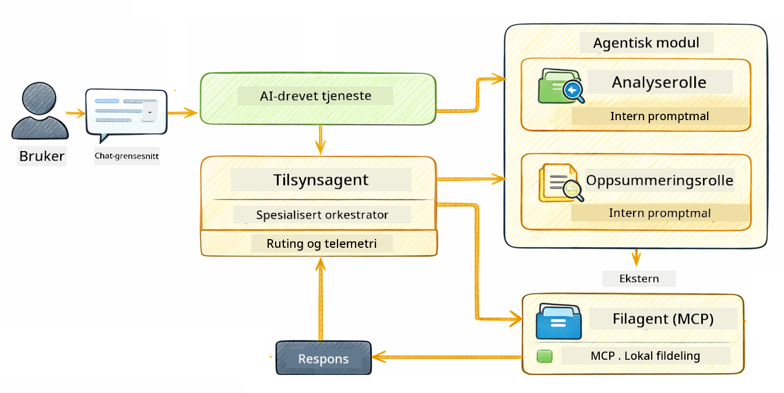

<!--
CO_OP_TRANSLATOR_METADATA:
{
  "original_hash": "f89f4c106d110e4943c055dd1a2f1dff",
  "translation_date": "2025-12-31T01:43:58+00:00",
  "source_file": "05-mcp/README.md",
  "language_code": "no"
}
-->
# Module 05: Model Context Protocol (MCP)

## Table of Contents

- [Hva du vil lære](../../../05-mcp)
- [Hva er MCP?](../../../05-mcp)
- [Hvordan MCP fungerer](../../../05-mcp)
- [Agentmodulen](../../../05-mcp)
- [Kjøre eksemplene](../../../05-mcp)
  - [Forutsetninger](../../../05-mcp)
- [Rask start](../../../05-mcp)
  - [Filoperasjoner (Stdio)](../../../05-mcp)
  - [Supervisor Agent](../../../05-mcp)
    - [Forstå outputen](../../../05-mcp)
    - [Forklaring av funksjoner i Agentmodulen](../../../05-mcp)
- [Nøkkelkonsepter](../../../05-mcp)
- [Gratulerer!](../../../05-mcp)
  - [Hva nå?](../../../05-mcp)

## What You'll Learn

Du har bygd konversasjonell AI, mestret prompts, forankret svar i dokumenter, og laget agenter med verktøy. Men alle disse verktøyene var spesialbygde for din spesifikke applikasjon. Hva om du kunne gi AI-en din tilgang til et standardisert økosystem av verktøy som hvem som helst kan lage og dele? I denne modulen lærer du hvordan du gjør nettopp det med Model Context Protocol (MCP) og LangChain4j sin agentmodul. Vi viser først en enkel MCP-filleser og deretter hvordan den enkelt integreres i avanserte agentiske arbeidsflyter ved bruk av Supervisor Agent-mønsteret.

## What is MCP?

Model Context Protocol (MCP) gir akkurat det — en standard måte for AI-applikasjoner å oppdage og bruke eksterne verktøy. I stedet for å skrive tilpassede integrasjoner for hver datakilde eller tjeneste, kobler du til MCP-servere som eksponerer sine kapasiteter i et konsistent format. AI-agenten din kan så oppdage og bruke disse verktøyene automatisk.


*Før MCP: Komplekse punkt-til-punkt-integrasjoner. Etter MCP: Én protokoll, uendelige muligheter.*

MCP løser et grunnleggende problem i AI-utvikling: hver integrasjon er tilpasset. Vil du få tilgang til GitHub? Tilpasset kode. Vil du lese filer? Tilpasset kode. Vil du spørre en database? Tilpasset kode. Og ingen av disse integrasjonene fungerer med andre AI-applikasjoner.

MCP standardiserer dette. En MCP-server eksponerer verktøy med klare beskrivelser og skjemaer for parametere. Enhver MCP-klient kan koble til, oppdage tilgjengelige verktøy og bruke dem. Bygg én gang, bruk overalt.


*Model Context Protocol-arkitektur - standardisert oppdagelse og utførelse av verktøy*

## How MCP Works

**Server-klient-arkitektur**

MCP bruker en klient-server-modell. Servere tilbyr verktøy - lese filer, spørre databaser, kalle APIer. Klienter (din AI-applikasjon) kobler til servere og bruker deres verktøy.

For å bruke MCP med LangChain4j, legg til denne Maven-avhengigheten:

```xml
<dependency>
    <groupId>dev.langchain4j</groupId>
    <artifactId>langchain4j-mcp</artifactId>
    <version>${langchain4j.version}</version>
</dependency>
```

**Verktøyoppdagelse**

Når klienten din kobler til en MCP-server, spør den "Hvilke verktøy har dere?" Serveren svarer med en liste over tilgjengelige verktøy, hver med beskrivelser og parameter-skjemaer. AI-agenten din kan så bestemme hvilke verktøy som skal brukes basert på brukerforespørsler.

**Transportmekanismer**

MCP støtter forskjellige transportmekanismer. Denne modulen demonstrerer Stdio-transporten for lokale prosesser:


*MCP-transportmekanismer: HTTP for fjernservere, Stdio for lokale prosesser*

**Stdio** - [StdioTransportDemo.java](../../../05-mcp/src/main/java/com/example/langchain4j/mcp/StdioTransportDemo.java)

For lokale prosesser. Applikasjonen din starter en server som en underprosess og kommuniserer gjennom standard input/output. Nyttig for filsystemtilgang eller kommandolinjeverktøy.

```java
McpTransport stdioTransport = new StdioMcpTransport.Builder()
    .command(List.of(
        npmCmd, "exec",
        "@modelcontextprotocol/server-filesystem@2025.12.18",
        resourcesDir
    ))
    .logEvents(false)
    .build();
```

> **🤖 Prøv med [GitHub Copilot](https://github.com/features/copilot) Chat:** Åpne [`StdioTransportDemo.java`](../../../05-mcp/src/main/java/com/example/langchain4j/mcp/StdioTransportDemo.java) og spør:
> - "Hvordan fungerer Stdio-transporten og når bør jeg bruke den vs HTTP?"
> - "Hvordan håndterer LangChain4j livssyklusen til oppstartede MCP-serverprosesser?"
> - "Hva er sikkerhetsimplikasjonene ved å gi AI tilgang til filsystemet?"

## The Agentic Module

Mens MCP gir standardiserte verktøy, tilbyr LangChain4j sin **agentmodul** en deklarativ måte å bygge agenter som orkestrerer disse verktøyene. `@Agent`-annotasjonen og `AgenticServices` lar deg definere agentoppførsel gjennom grensesnitt i stedet for imperativ kode.

I denne modulen utforsker du **Supervisor Agent**-mønsteret — en avansert agentisk AI-tilnærming hvor en "veileder" agent dynamisk bestemmer hvilke under-agenter som skal påkalles basert på brukerforespørsler. Vi kombinerer begge konsepter ved å gi en av våre under-agenter MCP-drevne filtilgangskapasiteter.

For å bruke agentmodulen, legg til denne Maven-avhengigheten:

```xml
<dependency>
    <groupId>dev.langchain4j</groupId>
    <artifactId>langchain4j-agentic</artifactId>
    <version>${langchain4j.mcp.version}</version>
</dependency>
```

> **⚠️ Eksperimentell:** `langchain4j-agentic`-modulen er **eksperimentell** og kan endres. Den stabile måten å bygge AI-assistenter på forblir `langchain4j-core` med tilpassede verktøy (Modul 04).

## Running the Examples

### Prerequisites

- Java 21+, Maven 3.9+
- Node.js 16+ og npm (for MCP-servere)
- Miljøvariabler konfigurert i `.env`-filen (fra rotkatalogen):
  - **For StdioTransportDemo:** `GITHUB_TOKEN` (GitHub Personal Access Token)
  - **For SupervisorAgentDemo:** `AZURE_OPENAI_ENDPOINT`, `AZURE_OPENAI_API_KEY`, `AZURE_OPENAI_DEPLOYMENT` (samme som Modulene 01-04)

> **Merk:** Hvis du ikke har satt opp miljøvariablene dine ennå, se [Module 00 - Quick Start](../00-quick-start/README.md) for instrukser, eller kopier `.env.example` til `.env` i rotkatalogen og fyll inn verdiene dine.

## Quick Start

**Bruke VS Code:** Høyreklikk på en hvilken som helst demo-fil i Explorer og velg **"Run Java"**, eller bruk oppstartskonfigurasjonene fra Run and Debug-panelet (sørg for at du har lagt til token i `.env`-filen først).

**Bruke Maven:** Alternativt kan du kjøre fra kommandolinjen med eksemplene nedenfor.

### File Operations (Stdio)

Dette demonstrerer lokale underprosess-baserte verktøy.

**✅ Ingen forhåndskrav**

**Bruke VS Code:** Høyreklikk på `StdioTransportDemo.java` og velg **"Run Java"**.

**Bruke Maven:**

**Bash:**
```bash
export GITHUB_TOKEN=your_token_here
cd 05-mcp
mvn compile exec:java -Dexec.mainClass=com.example.langchain4j.mcp.StdioTransportDemo
```

**PowerShell:**
```powershell
$env:GITHUB_TOKEN=your_token_here
cd 05-mcp
mvn --% compile exec:java -Dexec.mainClass=com.example.langchain4j.mcp.StdioTransportDemo
```

Applikasjonen starter automatisk en MCP-server for filsystemet og leser en lokal fil. Legg merke til hvordan underprosesshåndteringen blir tatt hånd om for deg.

**Forventet utdata:**
```
Assistant response: The file provides an overview of LangChain4j, an open-source Java library
for integrating Large Language Models (LLMs) into Java applications...
```

### Supervisor Agent




**Supervisor Agent**-mønsteret er en **fleksibel** form for agentisk AI. I motsetning til deterministiske arbeidsflyter (sekvensiell, løkke, parallell), bruker en Supervisor en LLM for å selvstendig avgjøre hvilke agenter som skal påkalles basert på brukerens forespørsel.

**Kombinere Supervisor med MCP:** I dette eksemplet gir vi `FileAgent` tilgang til MCP filsystemverktøy via `toolProvider(mcpToolProvider)`. Når en bruker ber om å "lese og analysere en fil", analyserer Supervisor forespørselen og genererer en utførelsesplan. Den ruter så forespørselen til `FileAgent`, som bruker MCPs `read_file`-verktøy for å hente innholdet. Supervisor videresender dette innholdet til `AnalysisAgent` for tolkning, og eventuelt kaller `SummaryAgent` for å kondensere resultatene.

Dette demonstrerer hvordan MCP-verktøy integreres sømløst i agentiske arbeidsflyter — Supervisor trenger ikke å vite *hvordan* filer leses, bare at `FileAgent` kan gjøre det. Supervisor tilpasser seg dynamisk til forskjellige typer forespørsler og returnerer enten den siste agentens svar eller et sammendrag av alle operasjonene.

**Bruke start-skriptene (Anbefalt):**

Start-skriptene laster automatisk miljøvariabler fra rotens `.env`-fil:

**Bash:**
```bash
cd 05-mcp
chmod +x start.sh
./start.sh
```

**PowerShell:**
```powershell
cd 05-mcp
.\start.ps1
```

**Bruke VS Code:** Høyreklikk på `SupervisorAgentDemo.java` og velg **"Run Java"** (sørg for at `.env`-filen din er konfigurert).

**Hvordan Supervisor fungerer:**

```java
// Definer flere agenter med spesifikke evner
FileAgent fileAgent = AgenticServices.agentBuilder(FileAgent.class)
        .chatModel(model)
        .toolProvider(mcpToolProvider)  // Har MCP-verktøy for filoperasjoner
        .build();

AnalysisAgent analysisAgent = AgenticServices.agentBuilder(AnalysisAgent.class)
        .chatModel(model)
        .build();

SummaryAgent summaryAgent = AgenticServices.agentBuilder(SummaryAgent.class)
        .chatModel(model)
        .build();

// Opprett en Supervisor som orkestrerer disse agentene
SupervisorAgent supervisor = AgenticServices.supervisorBuilder()
        .chatModel(model)  // Modellen "planner"
        .subAgents(fileAgent, analysisAgent, summaryAgent)
        .responseStrategy(SupervisorResponseStrategy.SUMMARY)
        .build();

// Supervisoren bestemmer autonomt hvilke agenter som skal kalles
// Bare gi en forespørsel på naturlig språk - LLM-en planlegger utførelsen
String response = supervisor.invoke("Read the file at /path/file.txt and analyze it");
```

Se [SupervisorAgentDemo.java](../../../05-mcp/src/main/java/com/example/langchain4j/mcp/SupervisorAgentDemo.java) for full implementasjon.

> **🤖 Prøv med [GitHub Copilot](https://github.com/features/copilot) Chat:** Åpne [`SupervisorAgentDemo.java`](../../../05-mcp/src/main/java/com/example/langchain4j/mcp/SupervisorAgentDemo.java) og spør:
> - "Hvordan bestemmer Supervisor hvilke agenter som skal påkalles?"
> - "Hva er forskjellen mellom Supervisor og sekvensiell arbeidsflyt-mønstre?"
> - "Hvordan kan jeg tilpasse Supervisors planleggingsoppførsel?"

#### Forstå outputen

Når du kjører demoen, vil du se en strukturert gjennomgang av hvordan Supervisor orkestrerer flere agenter. Her er hva hver seksjon betyr:

```
======================================================================
  SUPERVISOR AGENT DEMO
======================================================================

This demo shows how a Supervisor Agent orchestrates multiple specialized agents.
The Supervisor uses an LLM to decide which agent to call based on the task.
```

**Overskriften** introduserer demoen og forklarer kjernekonseptet: Supervisor bruker en LLM (ikke hardkodede regler) for å avgjøre hvilke agenter som skal kalles.

```
--- AVAILABLE AGENTS -------------------------------------------------
  [FILE]     FileAgent     - Reads files using MCP filesystem tools
  [ANALYZE]  AnalysisAgent - Analyzes content for structure, tone, and themes
  [SUMMARY]  SummaryAgent  - Creates concise summaries of content
```

**Tilgjengelige agenter** viser de tre spesialiserte agentene Supervisor kan velge mellom. Hver agent har en spesifikk kapasitet:
- **FileAgent** kan lese filer ved hjelp av MCP-verktøy (ekstern kapasitet)
- **AnalysisAgent** analyserer innhold (ren LLM-kapasitet)
- **SummaryAgent** lager sammendrag (ren LLM-kapasitet)

```
--- USER REQUEST -----------------------------------------------------
  "Read the file at .../file.txt and analyze what it's about"
```

**Brukerforespørsel** viser hva som ble spurt om. Supervisor må parse dette og bestemme hvilke agenter som skal påkalles.

```
--- SUPERVISOR ORCHESTRATION -----------------------------------------
  The Supervisor will now decide which agents to invoke and in what order...

  +-- STEP 1: Supervisor chose -> FileAgent (reading file via MCP)
  |
  |   Input: .../file.txt
  |
  |   Result: LangChain4j is an open-source Java library designed to simplify...
  +-- [OK] FileAgent (reading file via MCP) completed

  +-- STEP 2: Supervisor chose -> AnalysisAgent (analyzing content)
  |
  |   Input: LangChain4j is an open-source Java library...
  |
  |   Result: Structure: The content is organized into clear paragraphs that int...
  +-- [OK] AnalysisAgent (analyzing content) completed
```

**Supervisor Orchestration** er der magien skjer. Se hvordan:
1. Supervisor **valgte FileAgent først** fordi forespørselen nevnte "les filen"
2. FileAgent brukte MCPs `read_file`-verktøy for å hente filinnholdet
3. Supervisor deretter **valgte AnalysisAgent** og sendte filinnholdet til den
4. AnalysisAgent analyserte struktur, tone og temaer

Legg merke til at Supervisor gjorde disse beslutningene **autonomt** basert på brukerens forespørsel — ingen hardkodet arbeidsflyt!

**Endelig svar** er Supervisors syntetiserte svar, som kombinerer output fra alle agentene den påkalte. Eksemplet skriver ut det agentiske omfanget som viser sammendrag og analyseresultater lagret av hver agent.

```
--- FINAL RESPONSE ---------------------------------------------------
I read the contents of the file and analyzed its structure, tone, and key themes.
The file introduces LangChain4j as an open-source Java library for integrating
large language models...

--- AGENTIC SCOPE (Shared Memory) ------------------------------------
  Agents store their results in a shared scope for other agents to use:
  * summary: LangChain4j is an open-source Java library...
  * analysis: Structure: The content is organized into clear paragraphs that in...
```

### Forklaring av funksjoner i Agentmodulen

Eksemplet demonstrerer flere avanserte funksjoner i agentmodulen. La oss se nærmere på Agentic Scope og Agent Listeners.

**Agentic Scope** viser delt minne hvor agenter lagret sine resultater ved å bruke `@Agent(outputKey="...")`. Dette tillater:
- Senere agenter å få tilgang til tidligere agenters output
- Supervisor å syntetisere et endelig svar
- Deg å inspisere hva hver agent produserte

```java
ResultWithAgenticScope<String> result = supervisor.invokeWithAgenticScope(request);
AgenticScope scope = result.agenticScope();
String story = scope.readState("story");
List<AgentInvocation> history = scope.agentInvocations("analysisAgent");
```

**Agent Listeners** muliggjør overvåking og feilsøking av agentkjøringer. Steg-for-steg-outputen du ser i demoen kommer fra en AgentListener som kobles på hver agentpåkalling:
- **beforeAgentInvocation** - Kalles når Supervisor velger en agent, slik at du kan se hvilken agent som ble valgt og hvorfor
- **afterAgentInvocation** - Kalles når en agent er ferdig, og viser resultatet
- **inheritedBySubagents** - Når sann, overvåker lytteren alle agenter i hierarkiet

```java
AgentListener monitor = new AgentListener() {
    private int step = 0;
    
    @Override
    public void beforeAgentInvocation(AgentRequest request) {
        step++;
        System.out.println("  +-- STEP " + step + ": " + request.agentName());
    }
    
    @Override
    public void afterAgentInvocation(AgentResponse response) {
        System.out.println("  +-- [OK] " + response.agentName() + " completed");
    }
    
    @Override
    public boolean inheritedBySubagents() {
        return true; // Propager til alle underagenter
    }
};
```

Utover Supervisor-mønsteret tilbyr `langchain4j-agentic`-modulen flere kraftige arbeidsflytmønstre og funksjoner:

| Pattern | Description | Use Case |
|---------|-------------|----------|
| **Sequential** | Execute agents in order, output flows to next | Pipelines: research → analyze → report |
| **Parallel** | Run agents simultaneously | Independent tasks: weather + news + stocks |
| **Loop** | Iterate until condition met | Quality scoring: refine until score ≥ 0.8 |
| **Conditional** | Route based on conditions | Classify → route to specialist agent |
| **Human-in-the-Loop** | Add human checkpoints | Approval workflows, content review |

## Key Concepts

**MCP** er ideelt når du vil utnytte eksisterende verktøyøkosystemer, bygge verktøy som flere applikasjoner kan dele, integrere tredjepartstjenester med standardprotokoller, eller bytte ut verktøyimplementasjoner uten å endre kode.

**Agentmodulen** fungerer best når du ønsker deklarative agentdefinisjoner med `@Agent`-annotasjoner, trenger arbeidsflytorkestrering (sekvensiell, løkke, parallell), foretrekker grensesnittbasert agentdesign fremfor imperativ kode, eller kombinerer flere agenter som deler output via `outputKey`.

**Supervisor Agent-mønsteret** skinner når arbeidsflyten ikke er forutsigbar på forhånd og du vil at LLM skal bestemme, når du har flere spesialiserte agenter som trenger dynamisk orkestrering, når du bygger konversasjonelle systemer som ruter til ulike kapasiteter, eller når du ønsker den mest fleksible, adaptive agentoppførselen.

## Congratulations!

Du har fullført LangChain4j for nybegynnere-kurset. Du har lært:

- Hvordan bygge konversasjonell AI med minne (Modul 01)
- Prompt engineering-mønstre for ulike oppgaver (Modul 02)
- Forankre svar i dokumentene dine med RAG (Modul 03)
- Lage grunnleggende AI-agenter (assistenter) med tilpassede verktøy (Modul 04)
- Integrering av standardiserte verktøy med LangChain4j MCP- og Agentic-modulene (Modul 05)

### Hva nå?

Etter å ha fullført modulene, utforsk [Testveiledningen](../docs/TESTING.md) for å se LangChain4j-testkonsepter i praksis.

**Offisielle ressurser:**
- [LangChain4j Documentation](https://docs.langchain4j.dev/) - Omfattende guider og API-referanse
- [LangChain4j GitHub](https://github.com/langchain4j/langchain4j) - Kildekode og eksempler
- [LangChain4j Tutorials](https://docs.langchain4j.dev/tutorials/) - Trinnvise veiledninger for ulike bruksområder

Takk for at du fullførte dette kurset!

---

**Navigasjon:** [← Forrige: Modul 04 - Verktøy](../04-tools/README.md) | [Tilbake til hovedsiden](../README.md)

---

<!-- CO-OP TRANSLATOR DISCLAIMER START -->
Ansvarsfraskrivelse:
Dette dokumentet er oversatt ved hjelp av AI-oversettelsestjenesten Co-op Translator (https://github.com/Azure/co-op-translator). Selv om vi streber etter nøyaktighet, vær oppmerksom på at automatiske oversettelser kan inneholde feil eller unøyaktigheter. Det opprinnelige dokumentet på originalspråket bør betraktes som den autoritative kilden. For kritisk informasjon anbefales profesjonell menneskelig oversettelse. Vi er ikke ansvarlige for eventuelle misforståelser eller feiltolkninger som oppstår ved bruk av denne oversettelsen.
<!-- CO-OP TRANSLATOR DISCLAIMER END -->