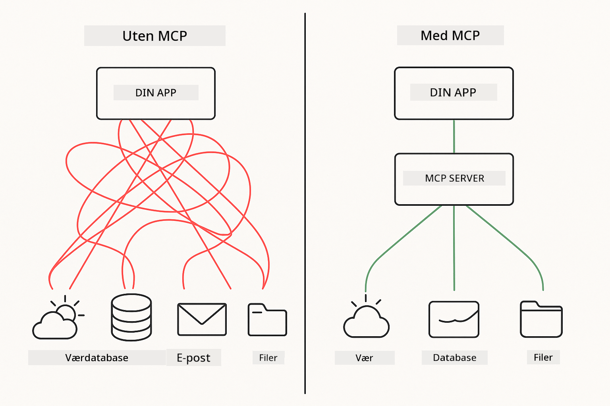
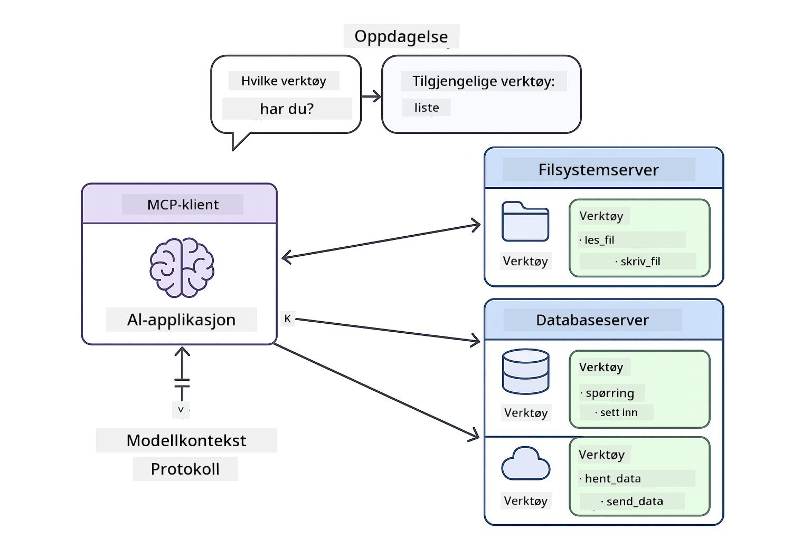
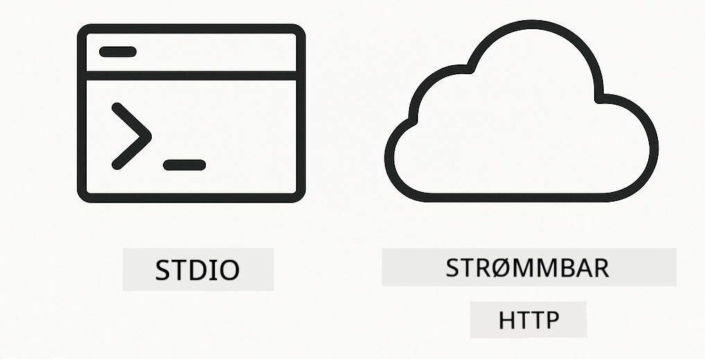

<!--
CO_OP_TRANSLATOR_METADATA:
{
  "original_hash": "c25ec1f10ef156c53e190cdf8b0711ab",
  "translation_date": "2025-12-13T17:56:05+00:00",
  "source_file": "05-mcp/README.md",
  "language_code": "no"
}
-->
# Modul 05: Model Context Protocol (MCP)

## Innholdsfortegnelse

- [Hva du vil lære](../../../05-mcp)
- [Forstå MCP](../../../05-mcp)
- [Hvordan MCP fungerer](../../../05-mcp)
  - [Server-klient-arkitektur](../../../05-mcp)
  - [Verktøyoppdagelse](../../../05-mcp)
  - [Transportmekanismer](../../../05-mcp)
- [Forutsetninger](../../../05-mcp)
- [Hva denne modulen dekker](../../../05-mcp)
- [Rask start](../../../05-mcp)
  - [Eksempel 1: Fjernkalkulator (Streamable HTTP)](../../../05-mcp)
  - [Eksempel 2: Filoperasjoner (Stdio)](../../../05-mcp)
  - [Eksempel 3: Git-analyse (Docker)](../../../05-mcp)
- [Nøkkelkonsepter](../../../05-mcp)
  - [Transportvalg](../../../05-mcp)
  - [Verktøyoppdagelse](../../../05-mcp)
  - [Sesjonshåndtering](../../../05-mcp)
  - [Tverrplattformhensyn](../../../05-mcp)
- [Når du skal bruke MCP](../../../05-mcp)
- [MCP-økosystem](../../../05-mcp)
- [Gratulerer!](../../../05-mcp)
  - [Hva nå?](../../../05-mcp)
- [Feilsøking](../../../05-mcp)

## Hva du vil lære

Du har bygget samtale-AI, mestret prompts, forankret svar i dokumenter, og laget agenter med verktøy. Men alle disse verktøyene var spesialbygde for din spesifikke applikasjon. Hva om du kunne gi AI-en din tilgang til et standardisert økosystem av verktøy som hvem som helst kan lage og dele?

Model Context Protocol (MCP) gir akkurat det – en standard måte for AI-applikasjoner å oppdage og bruke eksterne verktøy på. I stedet for å skrive tilpassede integrasjoner for hver datakilde eller tjeneste, kobler du til MCP-servere som eksponerer sine muligheter i et konsistent format. Din AI-agent kan da automatisk oppdage og bruke disse verktøyene.



*Før MCP: Komplekse punkt-til-punkt-integrasjoner. Etter MCP: Ett protokoll, uendelige muligheter.*

## Forstå MCP

MCP løser et grunnleggende problem i AI-utvikling: hver integrasjon er tilpasset. Vil du ha tilgang til GitHub? Tilpasset kode. Vil du lese filer? Tilpasset kode. Vil du spørre en database? Tilpasset kode. Og ingen av disse integrasjonene fungerer med andre AI-applikasjoner.

MCP standardiserer dette. En MCP-server eksponerer verktøy med klare beskrivelser og skjemaer. Enhver MCP-klient kan koble til, oppdage tilgjengelige verktøy og bruke dem. Bygg én gang, bruk overalt.



*Model Context Protocol-arkitektur – standardisert verktøyoppdagelse og utførelse*

## Hvordan MCP fungerer

**Server-klient-arkitektur**

MCP bruker en klient-server-modell. Servere tilbyr verktøy – lesing av filer, spørring av databaser, kalling av API-er. Klienter (din AI-applikasjon) kobler til servere og bruker verktøyene deres.

**Verktøyoppdagelse**

Når klienten din kobler til en MCP-server, spør den "Hvilke verktøy har du?" Serveren svarer med en liste over tilgjengelige verktøy, hver med beskrivelser og parameter-skjemaer. Din AI-agent kan så bestemme hvilke verktøy som skal brukes basert på brukerforespørsler.

**Transportmekanismer**

MCP definerer to transportmekanismer: HTTP for fjernservere, Stdio for lokale prosesser (inkludert Docker-containere):



*MCP transportmekanismer: HTTP for fjernservere, Stdio for lokale prosesser (inkludert Docker-containere)*

**Streamable HTTP** - [StreamableHttpDemo.java](../../../05-mcp/src/main/java/com/example/langchain4j/mcp/StreamableHttpDemo.java)

For fjernservere. Applikasjonen din gjør HTTP-forespørsler til en server som kjører et sted på nettverket. Bruker Server-Sent Events for sanntidskommunikasjon.

```java
McpTransport httpTransport = new StreamableHttpMcpTransport.Builder()
    .url("http://localhost:3001/mcp")
    .timeout(Duration.ofSeconds(60))
    .logRequests(true)
    .logResponses(true)
    .build();
```

> **🤖 Prøv med [GitHub Copilot](https://github.com/features/copilot) Chat:** Åpne [`StreamableHttpDemo.java`](../../../05-mcp/src/main/java/com/example/langchain4j/mcp/StreamableHttpDemo.java) og spør:
> - "Hvordan skiller MCP seg fra direkte verktøyintegrasjon som i Modul 04?"
> - "Hva er fordelene med å bruke MCP for deling av verktøy på tvers av applikasjoner?"
> - "Hvordan håndterer jeg tilkoblingsfeil eller tidsavbrudd til MCP-servere?"

**Stdio** - [StdioTransportDemo.java](../../../05-mcp/src/main/java/com/example/langchain4j/mcp/StdioTransportDemo.java)

For lokale prosesser. Applikasjonen din starter en server som en underprosess og kommuniserer via standard input/output. Nyttig for filsystemtilgang eller kommandolinjeverktøy.

```java
McpTransport stdioTransport = new StdioMcpTransport.Builder()
    .command(List.of(
        npmCmd, "exec",
        "@modelcontextprotocol/server-filesystem@0.6.2",
        resourcesDir
    ))
    .logEvents(false)
    .build();
```

> **🤖 Prøv med [GitHub Copilot](https://github.com/features/copilot) Chat:** Åpne [`StdioTransportDemo.java`](../../../05-mcp/src/main/java/com/example/langchain4j/mcp/StdioTransportDemo.java) og spør:
> - "Hvordan fungerer Stdio-transport og når bør jeg bruke den kontra HTTP?"
> - "Hvordan håndterer LangChain4j livssyklusen til spawnede MCP-serverprosesser?"
> - "Hva er sikkerhetsimplikasjonene ved å gi AI tilgang til filsystemet?"

**Docker (bruker Stdio)** - [GitRepositoryAnalyzer.java](../../../05-mcp/src/main/java/com/example/langchain4j/mcp/GitRepositoryAnalyzer.java)

For containeriserte tjenester. Bruker stdio-transport for å kommunisere med en Docker-container via `docker run`. Bra for komplekse avhengigheter eller isolerte miljøer.

```java
McpTransport dockerTransport = new StdioMcpTransport.Builder()
    .command(List.of(
        "docker", "run",
        "-e", "GITHUB_PERSONAL_ACCESS_TOKEN=" + System.getenv("GITHUB_TOKEN"),
        "-v", volumeMapping,
        "-i", "mcp/git"
    ))
    .logEvents(true)
    .build();
```

> **🤖 Prøv med [GitHub Copilot](https://github.com/features/copilot) Chat:** Åpne [`GitRepositoryAnalyzer.java`](../../../05-mcp/src/main/java/com/example/langchain4j/mcp/GitRepositoryAnalyzer.java) og spør:
> - "Hvordan isolerer Docker-transport MCP-servere og hva er fordelene?"
> - "Hvordan konfigurerer jeg volum-monteringer for å dele data mellom vert og MCP-containere?"
> - "Hva er beste praksis for å håndtere Docker-baserte MCP-serverlivssykluser i produksjon?"

## Kjøre eksemplene

### Forutsetninger

- Java 21+, Maven 3.9+
- Node.js 16+ og npm (for MCP-servere)
- **Docker Desktop** – Må være **KJØRENDE** for Eksempel 3 (ikke bare installert)
- GitHub Personal Access Token konfigurert i `.env`-fil (fra Modul 00)

> **Merk:** Hvis du ikke har satt opp GitHub-tokenet ditt ennå, se [Modul 00 - Rask start](../00-quick-start/README.md) for instruksjoner.

> **⚠️ Docker-brukere:** Før du kjører Eksempel 3, verifiser at Docker Desktop kjører med `docker ps`. Hvis du får tilkoblingsfeil, start Docker Desktop og vent ~30 sekunder på initialisering.

## Rask start

**Bruke VS Code:** Høyreklikk på en hvilken som helst demo-fil i Utforskeren og velg **"Run Java"**, eller bruk oppstartskonfigurasjonene fra Kjør og Feilsøk-panelet (sørg for at du har lagt til token i `.env`-filen først).

**Bruke Maven:** Alternativt kan du kjøre fra kommandolinjen med eksemplene nedenfor.

**⚠️ Viktig:** Noen eksempler har forutsetninger (som å starte en MCP-server eller bygge Docker-images). Sjekk kravene for hvert eksempel før kjøring.

### Eksempel 1: Fjernkalkulator (Streamable HTTP)

Dette demonstrerer nettverksbasert verktøyintegrasjon.

**⚠️ Forutsetning:** Du må starte MCP-serveren først (se Terminal 1 nedenfor).

**Terminal 1 - Start MCP-serveren:**

**Bash:**
```bash
git clone https://github.com/modelcontextprotocol/servers.git
cd servers/src/everything
npm install
node dist/streamableHttp.js
```

**PowerShell:**
```powershell
git clone https://github.com/modelcontextprotocol/servers.git
cd servers/src/everything
npm install
node dist/streamableHttp.js
```

**Terminal 2 - Kjør eksemplet:**

**Bruke VS Code:** Høyreklikk på `StreamableHttpDemo.java` og velg **"Run Java"**.

**Bruke Maven:**

**Bash:**
```bash
export GITHUB_TOKEN=your_token_here
cd 05-mcp
mvn compile exec:java -Dexec.mainClass=com.example.langchain4j.mcp.StreamableHttpDemo
```

**PowerShell:**
```powershell
$env:GITHUB_TOKEN=your_token_here
cd 05-mcp
mvn --% compile exec:java -Dexec.mainClass=com.example.langchain4j.mcp.StreamableHttpDemo
```

Se agenten oppdage tilgjengelige verktøy, og bruk deretter kalkulatoren til å utføre addisjon.

### Eksempel 2: Filoperasjoner (Stdio)

Dette demonstrerer lokale underprosess-baserte verktøy.

**✅ Ingen forutsetninger nødvendig** – MCP-serveren startes automatisk.

**Bruke VS Code:** Høyreklikk på `StdioTransportDemo.java` og velg **"Run Java"**.

**Bruke Maven:**

**Bash:**
```bash
export GITHUB_TOKEN=your_token_here
cd 05-mcp
mvn compile exec:java -Dexec.mainClass=com.example.langchain4j.mcp.StdioTransportDemo
```

**PowerShell:**
```powershell
$env:GITHUB_TOKEN=your_token_here
cd 05-mcp
mvn --% compile exec:java -Dexec.mainClass=com.example.langchain4j.mcp.StdioTransportDemo
```

Applikasjonen starter automatisk en MCP-server for filsystemet og leser en lokal fil. Legg merke til hvordan underprosesshåndteringen skjer for deg.

**Forventet output:**
```
Assistant response: The content of the file is "Kaboom!".
```

### Eksempel 3: Git-analyse (Docker)

Dette demonstrerer containeriserte verktøyservere.

**⚠️ Forutsetninger:** 
1. **Docker Desktop må være KJØRENDE** (ikke bare installert)
2. **Windows-brukere:** WSL 2-modus anbefales (Docker Desktop Innstillinger → Generelt → "Use the WSL 2 based engine"). Hyper-V-modus krever manuell fil-deling konfigurasjon.
3. Du må bygge Docker-imaget først (se Terminal 1 nedenfor)

**Verifiser at Docker kjører:**

**Bash:**
```bash
docker ps  # Skal vise beholderliste, ikke en feil
```

**PowerShell:**
```powershell
docker ps  # Skal vise beholderliste, ikke en feil
```

Hvis du får en feil som "Cannot connect to Docker daemon" eller "The system cannot find the file specified", start Docker Desktop og vent på at det initialiseres (~30 sekunder).

**Feilsøking:**
- Hvis AI-en rapporterer et tomt repository eller ingen filer, fungerer ikke volum-monteringen (`-v`).
- **Windows Hyper-V-brukere:** Legg til prosjektmappen i Docker Desktop Innstillinger → Ressurser → Fil-deling, og start Docker Desktop på nytt.
- **Anbefalt løsning:** Bytt til WSL 2-modus for automatisk fil-deling (Innstillinger → Generelt → aktiver "Use the WSL 2 based engine").

**Terminal 1 - Bygg Docker-imaget:**

**Bash:**
```bash
cd servers/src/git
docker build -t mcp/git .
```

**PowerShell:**
```powershell
cd servers/src/git
docker build -t mcp/git .
```

**Terminal 2 - Kjør analysatoren:**

**Bruke VS Code:** Høyreklikk på `GitRepositoryAnalyzer.java` og velg **"Run Java"**.

**Bruke Maven:**

**Bash:**
```bash
export GITHUB_TOKEN=your_token_here
cd 05-mcp
mvn compile exec:java -Dexec.mainClass=com.example.langchain4j.mcp.GitRepositoryAnalyzer
```

**PowerShell:**
```powershell
$env:GITHUB_TOKEN=your_token_here
cd 05-mcp
mvn --% compile exec:java -Dexec.mainClass=com.example.langchain4j.mcp.GitRepositoryAnalyzer
```

Applikasjonen starter en Docker-container, monterer ditt repository, og analyserer repository-struktur og innhold via AI-agenten.

## Nøkkelkonsepter

**Transportvalg**

Velg basert på hvor verktøyene dine befinner seg:
- Fjernservere → Streamable HTTP
- Lokalt filsystem → Stdio
- Komplekse avhengigheter → Docker

**Verktøyoppdagelse**

MCP-klienter oppdager automatisk tilgjengelige verktøy ved tilkobling. Din AI-agent ser verktøybeskrivelser og bestemmer hvilke som skal brukes basert på brukerens forespørsel.

**Sesjonshåndtering**

Streamable HTTP-transport opprettholder sesjoner, som tillater tilstandshåndtering med fjernservere. Stdio- og Docker-transporter er vanligvis stateless.

**Tverrplattformhensyn**

Eksemplene håndterer plattformforskjeller automatisk (Windows vs Unix kommandoer, sti-konverteringer for Docker). Dette er viktig for produksjonsdistribusjoner på tvers av miljøer.

## Når du skal bruke MCP

**Bruk MCP når:**
- Du vil utnytte eksisterende verktøyøkosystemer
- Bygger verktøy som flere applikasjoner skal bruke
- Integrerer tredjepartstjenester med standardprotokoller
- Du trenger å bytte ut verktøyimplementasjoner uten kodeendringer

**Bruk tilpassede verktøy (Modul 04) når:**
- Du bygger applikasjonsspesifikk funksjonalitet
- Ytelse er kritisk (MCP legger til overhead)
- Verktøyene dine er enkle og ikke skal gjenbrukes
- Du trenger full kontroll over utførelsen


## MCP-økosystem

Model Context Protocol er en åpen standard med et voksende økosystem:

- Offisielle MCP-servere for vanlige oppgaver (filsystem, Git, databaser)
- Fellesskapsbidragsservere for ulike tjenester
- Standardiserte verktøybeskrivelser og skjemaer
- Tverr-rammeverkskompatibilitet (fungerer med enhver MCP-klient)

Denne standardiseringen betyr at verktøy bygget for én AI-applikasjon fungerer med andre, og skaper et delt økosystem av muligheter.

## Gratulerer!

Du har fullført LangChain4j for nybegynnere-kurset. Du har lært:

- Hvordan bygge samtale-AI med minne (Modul 01)
- Prompt engineering-mønstre for ulike oppgaver (Modul 02)
- Forankre svar i dokumenter med RAG (Modul 03)
- Lage AI-agenter med tilpassede verktøy (Modul 04)
- Integrere standardiserte verktøy gjennom MCP (Modul 05)

Du har nå grunnlaget for å bygge produksjonsklare AI-applikasjoner. Konseptene du har lært gjelder uavhengig av spesifikke rammeverk eller modeller – de er grunnleggende mønstre i AI-ingeniørkunst.

### Hva nå?

Etter å ha fullført modulene, utforsk [Testing Guide](../docs/TESTING.md) for å se LangChain4j testkonsepter i praksis.

**Offisielle ressurser:**
- [LangChain4j Dokumentasjon](https://docs.langchain4j.dev/) – Omfattende guider og API-referanse
- [LangChain4j GitHub](https://github.com/langchain4j/langchain4j) – Kildekode og eksempler
- [LangChain4j Veiledninger](https://docs.langchain4j.dev/tutorials/) – Trinnvise veiledninger for ulike bruksområder

Takk for at du fullførte dette kurset!

---

**Navigasjon:** [← Forrige: Modul 04 - Verktøy](../04-tools/README.md) | [Tilbake til hovedmeny](../README.md)

---

## Feilsøking

### PowerShell Maven-kommandosyntaks
**Problem**: Maven-kommandoer feiler med feilen `Unknown lifecycle phase ".mainClass=..."`

**Årsak**: PowerShell tolker `=` som en variabeltilordningsoperator, noe som bryter Maven-egenskapssyntaksen

**Løsning**: Bruk stop-parsing-operatoren `--%` før Maven-kommandoen:

**PowerShell:**
```powershell
mvn --% compile exec:java -Dexec.mainClass=com.example.langchain4j.mcp.StreamableHttpDemo
```

**Bash:**
```bash
mvn compile exec:java -Dexec.mainClass=com.example.langchain4j.mcp.StreamableHttpDemo
```

`--%`-operatoren forteller PowerShell å sende alle gjenværende argumenter bokstavelig til Maven uten tolkning.

### Docker-tilkoblingsproblemer

**Problem**: Docker-kommandoer feiler med "Cannot connect to Docker daemon" eller "The system cannot find the file specified"

**Årsak**: Docker Desktop kjører ikke eller er ikke fullstendig initialisert

**Løsning**: 
1. Start Docker Desktop
2. Vent ~30 sekunder for full initialisering
3. Verifiser med `docker ps` (skal vise containerliste, ikke en feil)
4. Kjør deretter eksemplet ditt

### Windows Docker Volume Mounting

**Problem**: Git-repositorieanalysator rapporterer tomt repositorium eller ingen filer

**Årsak**: Volume mount (`-v`) fungerer ikke på grunn av fil-delingskonfigurasjon

**Løsning**:
- **Anbefalt:** Bytt til WSL 2-modus (Docker Desktop Settings → General → "Use the WSL 2 based engine")
- **Alternativ (Hyper-V):** Legg til prosjektkatalogen i Docker Desktop Settings → Resources → File sharing, og start deretter Docker Desktop på nytt

---

<!-- CO-OP TRANSLATOR DISCLAIMER START -->
**Ansvarsfraskrivelse**:
Dette dokumentet er oversatt ved hjelp av AI-oversettelsestjenesten [Co-op Translator](https://github.com/Azure/co-op-translator). Selv om vi streber etter nøyaktighet, vennligst vær oppmerksom på at automatiske oversettelser kan inneholde feil eller unøyaktigheter. Det opprinnelige dokumentet på originalspråket skal anses som den autoritative kilden. For kritisk informasjon anbefales profesjonell menneskelig oversettelse. Vi er ikke ansvarlige for eventuelle misforståelser eller feiltolkninger som oppstår ved bruk av denne oversettelsen.
<!-- CO-OP TRANSLATOR DISCLAIMER END -->