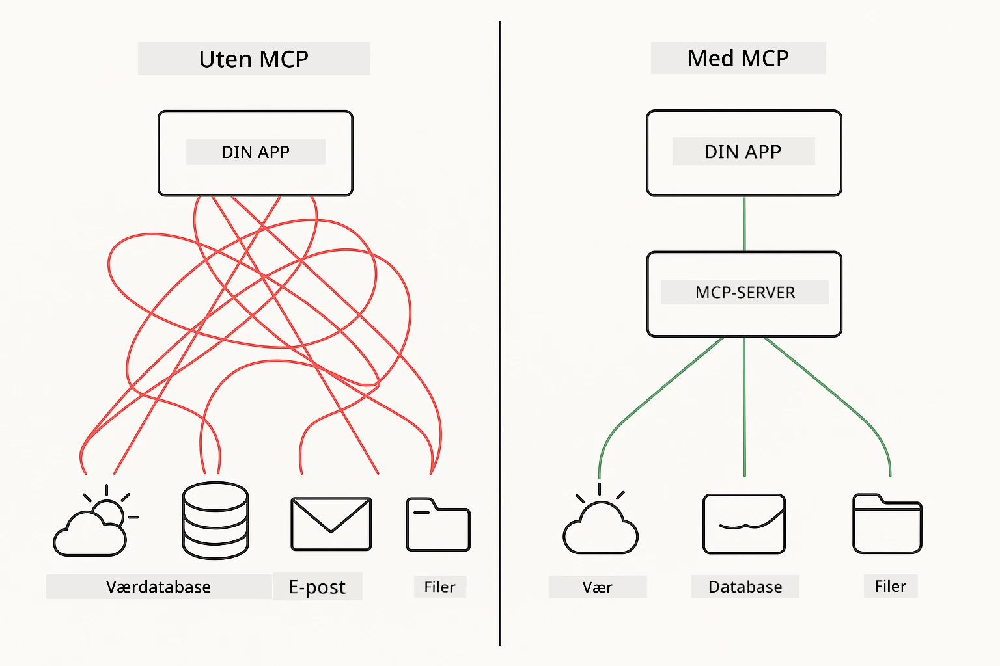
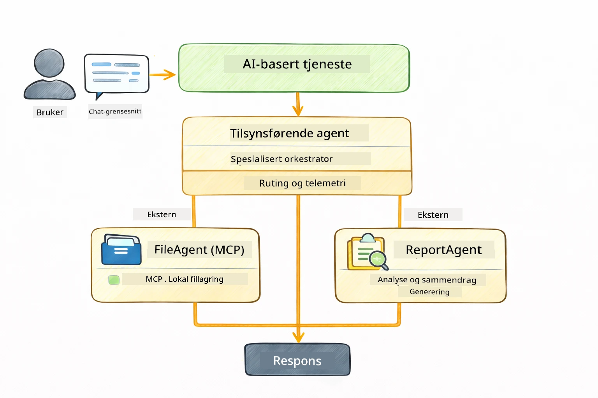

<!--
CO_OP_TRANSLATOR_METADATA:
{
  "original_hash": "6c816d130a1fa47570c11907e72d84ae",
  "translation_date": "2026-01-05T23:51:01+00:00",
  "source_file": "05-mcp/README.md",
  "language_code": "no"
}
-->
# Modul 05: Model Context Protocol (MCP)

## Innholdsfortegnelse

- [Hva du vil lære](../../../05-mcp)
- [Hva er MCP?](../../../05-mcp)
- [Hvordan MCP fungerer](../../../05-mcp)
- [Agentmodulen](../../../05-mcp)
- [Kjøre eksemplene](../../../05-mcp)
  - [Forutsetninger](../../../05-mcp)
- [Rask start](../../../05-mcp)
  - [Filoperasjoner (Stdio)](../../../05-mcp)
  - [Supervisor Agent](../../../05-mcp)
    - [Forstå utdataene](../../../05-mcp)
    - [Responsstrategier](../../../05-mcp)
    - [Forklaring av agentmodulens funksjoner](../../../05-mcp)
- [Nøkkelkonsepter](../../../05-mcp)
- [Gratulerer!](../../../05-mcp)
  - [Hva nå?](../../../05-mcp)

## Hva du vil lære

Du har bygget konversasjons-AI, mestret prompts, forankret svar i dokumenter og laget agenter med verktøy. Men alle disse verktøyene var skreddersydd for din spesifikke applikasjon. Hva om du kunne gi AI-en din tilgang til et standardisert økosystem av verktøy som hvem som helst kan lage og dele? I denne modulen lærer du nettopp det med Model Context Protocol (MCP) og LangChain4j sin agentmodul. Vi viser først en enkel MCP-fil-leser, og deretter hvordan den lett integreres i avanserte agentarbeidsflyter ved bruk av Supervisor Agent-mønsteret.

## Hva er MCP?

Model Context Protocol (MCP) gir nettopp det – en standardisert måte for AI-applikasjoner å oppdage og bruke eksterne verktøy på. I stedet for å skrive skreddersydde integrasjoner for hver datakilde eller tjeneste, kobler du til MCP-servere som eksponerer deres kapabiliteter i et konsistent format. Din AI-agent kan så oppdage og bruke disse verktøyene automatisk.



*Før MCP: Komplekse punkt-til-punkt integrasjoner. Etter MCP: Én protokoll, uendelige muligheter.*

MCP løser et fundamentalt problem i AI-utvikling: hver integrasjon er skreddersydd. Vil du ha tilgang til GitHub? Skreddersydd kode. Vil du lese filer? Skreddersydd kode. Vil du gjøre spørringer mot en database? Skreddersydd kode. Og ingen av disse integrasjonene fungerer med andre AI-applikasjoner.

MCP standardiserer dette. En MCP-server eksponerer verktøy med klare beskrivelser og skjemaer. Enhver MCP-klient kan koble til, oppdage tilgjengelige verktøy og bruke dem. Bygg én gang, bruk overalt.


*Model Context Protocol-arkitektur – standardisert oppdagelse og utførelse av verktøy*

## Hvordan MCP fungerer

**Klient-Server Arkitektur**

MCP bruker en klient-server modell. Servere tilbyr verktøy – lesing av filer, spørringer mot databaser, kall til APIer. Klienter (din AI-applikasjon) kobler til servere og bruker verktøyene deres.

For å bruke MCP med LangChain4j, legg til denne Maven-avhengigheten:

```xml
<dependency>
    <groupId>dev.langchain4j</groupId>
    <artifactId>langchain4j-mcp</artifactId>
    <version>${langchain4j.version}</version>
</dependency>
```

**Verktøyoppdagelse**

Når klienten din kobler til en MCP-server, spør den "Hvilke verktøy har du?" Serveren svarer med en liste over tilgjengelige verktøy, hver med beskrivelser og parameterskjemaer. AI-agenten din kan så avgjøre hvilke verktøy som skal brukes basert på brukerens forespørsler.

**Transportmekanismer**

MCP støtter forskjellige transportmekanismer. Denne modulen demonstrerer Stdio-transport for lokale prosesser:


*MCP transportmekanismer: HTTP for fjerne servere, Stdio for lokale prosesser*

**Stdio** - [StdioTransportDemo.java](../../../05-mcp/src/main/java/com/example/langchain4j/mcp/StdioTransportDemo.java)

For lokale prosesser. Applikasjonen din starter en server som en underprosess og kommuniserer via standard input/output. Nyttig for filsystemtilgang eller kommandolinjeverktøy.

```java
McpTransport stdioTransport = new StdioMcpTransport.Builder()
    .command(List.of(
        npmCmd, "exec",
        "@modelcontextprotocol/server-filesystem@2025.12.18",
        resourcesDir
    ))
    .logEvents(false)
    .build();
```

> **🤖 Prøv med [GitHub Copilot](https://github.com/features/copilot) Chat:** Åpne [`StdioTransportDemo.java`](../../../05-mcp/src/main/java/com/example/langchain4j/mcp/StdioTransportDemo.java) og spør:
> - "Hvordan fungerer Stdio-transporten, og når bør jeg bruke den i stedet for HTTP?"
> - "Hvordan håndterer LangChain4j livssyklusen til spawnede MCP-serverprosesser?"
> - "Hva er sikkerhetsimplikasjonene ved å gi AI tilgang til filsystemet?"

## Agentmodulen

Mens MCP leverer standardiserte verktøy, tilbyr LangChain4j sin **agentmodul** en deklarativ måte å bygge agenter som orkestrerer disse verktøyene. `@Agent`-annotasjonen og `AgenticServices` lar deg definere agentatferd gjennom grensesnitt fremfor imperativ kode.

I denne modulen utforsker du **Supervisor Agent**-mønsteret — en avansert agentisk AI-tilnærming hvor en "supervisor"-agent dynamisk avgjør hvilke under-agenter som skal kalles basert på brukerforespørsler. Vi kombinerer begge konseptene ved å gi en av våre under-agenter MCP-drevne filtilgangsmuligheter.

For å bruke agentmodulen, legg til denne Maven-avhengigheten:

```xml
<dependency>
    <groupId>dev.langchain4j</groupId>
    <artifactId>langchain4j-agentic</artifactId>
    <version>${langchain4j.mcp.version}</version>
</dependency>
```

> **⚠️ Eksperimentell:** `langchain4j-agentic`-modulen er **eksperimentell** og kan endres. Den stabile måten å bygge AI-assistenter på er fortsatt `langchain4j-core` med egendefinerte verktøy (Modul 04).

## Kjøre eksemplene

### Forutsetninger

- Java 21+, Maven 3.9+
- Node.js 16+ og npm (for MCP-servere)
- Miljøvariabler konfigurert i `.env`-fil (fra rotkatalogen):
  - `AZURE_OPENAI_ENDPOINT`, `AZURE_OPENAI_API_KEY`, `AZURE_OPENAI_DEPLOYMENT` (som i Modulene 01-04)

> **Merk:** Hvis du ikke har satt opp miljøvariablene dine ennå, se [Modul 00 - Rask start](../00-quick-start/README.md) for instruksjoner, eller kopier `.env.example` til `.env` i rotkatalogen og fyll inn dine verdier.

## Rask start

**Bruke VS Code:** Høyreklikk på hvilken som helst demo-fil i Explorer og velg **"Run Java"**, eller bruk kjøre-konfigurasjonene fra Run and Debug-panelet (sørg først for at tokenen din er lagt til i `.env`-filen).

**Bruke Maven:** Alternativt kan du kjøre fra kommandolinjen med eksemplene nedenfor.

### Filoperasjoner (Stdio)

Dette demonstrerer lokale verktøy basert på underprosesser.

**✅ Ingen forutsetninger kreves** – MCP-serveren startes automatisk.

**Bruke startskriptene (anbefalt):**

Startskriptene laster automatisk miljøvariabler fra rotens `.env`-fil:

**Bash:**
```bash
cd 05-mcp
chmod +x start-stdio.sh
./start-stdio.sh
```

**PowerShell:**
```powershell
cd 05-mcp
.\start-stdio.ps1
```

**Bruke VS Code:** Høyreklikk på `StdioTransportDemo.java` og velg **"Run Java"** (sørg for at `.env`-filen er konfigurert).

Applikasjonen starter en MCP-server for filsystemet automatisk og leser en lokal fil. Legg merke til hvordan underprosesshåndteringen skjer for deg.

**Forventet utdata:**
```
Assistant response: The file provides an overview of LangChain4j, an open-source Java library
for integrating Large Language Models (LLMs) into Java applications...
```

### Supervisor Agent

**Supervisor Agent-mønsteret** er en **fleksibel** form for agentisk AI. En supervisor bruker en LLM for autonomt å avgjøre hvilke agenter som skal kalles basert på brukerens forespørsel. I neste eksempel kombinerer vi MCP-drevet filtilgang med en LLM-agent for å lage en overvåket arbeidsflyt for fillesing → rapportgenerering.

I demoen leser `FileAgent` en fil ved hjelp av MCP filsystemverktøy, og `ReportAgent` genererer en strukturert rapport med et sammendrag (1 setning), 3 nøkkelpunkter og anbefalinger. Supervisor orkestrerer denne flyten automatisk:



```
┌─────────────┐      ┌──────────────┐
│  FileAgent  │ ───▶ │ ReportAgent  │
│ (MCP tools) │      │  (pure LLM)  │
└─────────────┘      └──────────────┘
   outputKey:           outputKey:
  'fileContent'         'report'
```

Hver agent lagrer sitt output i **Agentic Scope** (delt minne), slik at etterfølgende agenter kan få tilgang til tidligere resultater. Dette viser hvordan MCP-verktøy integreres sømløst i agentiske arbeidsflyter — Supervisor trenger ikke å vite *hvordan* filer leses, bare at `FileAgent` kan gjøre det.

#### Kjøre demoen

Startskriptene laster automatisk miljøvariabler fra rotens `.env`-fil:

**Bash:**
```bash
cd 05-mcp
chmod +x start-supervisor.sh
./start-supervisor.sh
```

**PowerShell:**
```powershell
cd 05-mcp
.\start-supervisor.ps1
```

**Bruke VS Code:** Høyreklikk på `SupervisorAgentDemo.java` og velg **"Run Java"** (sørg for at `.env`-filen er konfigurert).

#### Hvordan Supervisor fungerer

```java
// Trinn 1: FileAgent leser filer ved hjelp av MCP-verktøy
FileAgent fileAgent = AgenticServices.agentBuilder(FileAgent.class)
        .chatModel(model)
        .toolProvider(mcpToolProvider)  // Har MCP-verktøy for filoperasjoner
        .build();

// Trinn 2: ReportAgent genererer strukturerte rapporter
ReportAgent reportAgent = AgenticServices.agentBuilder(ReportAgent.class)
        .chatModel(model)
        .build();

// Supervisor orkestrerer arbeidsflyten fil → rapport
SupervisorAgent supervisor = AgenticServices.supervisorBuilder()
        .chatModel(model)
        .subAgents(fileAgent, reportAgent)
        .responseStrategy(SupervisorResponseStrategy.LAST)  // Returner den endelige rapporten
        .build();

// Supervisor bestemmer hvilke agenter som skal kalles basert på forespørselen
String response = supervisor.invoke("Read the file at /path/file.txt and generate a report");
```

#### Responsstrategier

Når du konfigurerer en `SupervisorAgent`, spesifiserer du hvordan den skal formulere sitt sluttresultat til brukeren etter at under-agentene har fullført sine oppgaver. De tilgjengelige strategiene er:

| Strategi | Beskrivelse |
|----------|-------------|
| **LAST** | Supervisoren returnerer resultatet fra den siste kallte under-agenten eller verktøyet. Dette er nyttig når den siste agenten i arbeidsflyten er spesifikt designet for å produsere det komplette, endelige svaret (f.eks. en "Sammendragsagent" i en forskningspipeline). |
| **SUMMARY** | Supervisoren bruker sin interne språkmodell (LLM) til å syntetisere en oppsummering av hele interaksjonen og alle under-agenters output, og returnerer denne oppsummeringen som det endelige svaret. Dette gir et ryddig, aggregert svar til brukeren. |
| **SCORED** | Systemet bruker en intern LLM til å score både SISTE respons og SAMMENDRAGET av interaksjonen i forhold til den opprinnelige brukerforespørselen, og returnerer det resultatet som får høyest score. |

Se [SupervisorAgentDemo.java](../../../05-mcp/src/main/java/com/example/langchain4j/mcp/SupervisorAgentDemo.java) for komplett implementering.

> **🤖 Prøv med [GitHub Copilot](https://github.com/features/copilot) Chat:** Åpne [`SupervisorAgentDemo.java`](../../../05-mcp/src/main/java/com/example/langchain4j/mcp/SupervisorAgentDemo.java) og spør:
> - "Hvordan bestemmer Supervisor hvilke agenter som skal kalles?"
> - "Hva er forskjellen mellom Supervisor og sekvensielle arbeidsflytmønstre?"
> - "Hvordan kan jeg tilpasse Supervisions planleggingsatferd?"

#### Forstå utdataene

Når du kjører demoen, ser du en strukturert gjennomgang av hvordan Supervisor orkestrerer flere agenter. Her er hva hver seksjon betyr:

```
======================================================================
  FILE → REPORT WORKFLOW DEMO
======================================================================

This demo shows a clear 2-step workflow: read a file, then generate a report.
The Supervisor orchestrates the agents automatically based on the request.
```

**Overskriften** introduserer arbeidsflytkonseptet: en fokusert pipeline fra fillesing til rapportgenerering.

```
--- WORKFLOW ---------------------------------------------------------
  ┌─────────────┐      ┌──────────────┐
  │  FileAgent  │ ───▶ │ ReportAgent  │
  │ (MCP tools) │      │  (pure LLM)  │
  └─────────────┘      └──────────────┘
   outputKey:           outputKey:
   'fileContent'        'report'

--- AVAILABLE AGENTS -------------------------------------------------
  [FILE]   FileAgent   - Reads files via MCP → stores in 'fileContent'
  [REPORT] ReportAgent - Generates structured report → stores in 'report'
```

**Arbeidsflytdiagram** viser dataflyten mellom agentene. Hver agent har en spesifikk rolle:
- **FileAgent** leser filer ved bruk av MCP-verktøy og lagrer råinnhold i `fileContent`
- **ReportAgent** bruker dette innholdet og produserer en strukturert rapport i `report`

```
--- USER REQUEST -----------------------------------------------------
  "Read the file at .../file.txt and generate a report on its contents"
```

**Brukerforespørsel** viser oppgaven. Supervisor tolker dette og bestemmer å kalle FileAgent → ReportAgent.

```
--- SUPERVISOR ORCHESTRATION -----------------------------------------
  The Supervisor decides which agents to invoke and passes data between them...

  +-- STEP 1: Supervisor chose -> FileAgent (reading file via MCP)
  |
  |   Input: .../file.txt
  |
  |   Result: LangChain4j is an open-source, provider-agnostic Java framework for building LLM...
  +-- [OK] FileAgent (reading file via MCP) completed

  +-- STEP 2: Supervisor chose -> ReportAgent (generating structured report)
  |
  |   Input: LangChain4j is an open-source, provider-agnostic Java framew...
  |
  |   Result: Executive Summary...
  +-- [OK] ReportAgent (generating structured report) completed
```

**Supervisor Orkestrering** viser 2-trinns flyten i praksis:
1. **FileAgent** leser filen via MCP og lagrer innholdet
2. **ReportAgent** mottar innholdet og genererer en strukturert rapport

Supervisor tok disse beslutningene **autonomt** basert på brukerens forespørsel.

```
--- FINAL RESPONSE ---------------------------------------------------
Executive Summary
...

Key Points
...

Recommendations
...

--- AGENTIC SCOPE (Data Flow) ----------------------------------------
  Each agent stores its output for downstream agents to consume:
  * fileContent: LangChain4j is an open-source, provider-agnostic Java framework...
  * report: Executive Summary...
```

#### Forklaring av agentmodulens funksjoner

Eksemplet demonstrerer flere avanserte funksjoner i agentmodulen. La oss se nærmere på Agentic Scope og Agent Listeners.

**Agentic Scope** viser delt minne der agenter lagrer sine resultater ved bruk av `@Agent(outputKey="...")`. Dette tillater:
- Senere agenter å få tilgang til tidligere agenters output
- Supervisoren å syntetisere et sluttresultat
- Deg å inspisere hva hver agent produserte

```java
ResultWithAgenticScope<String> result = supervisor.invokeWithAgenticScope(request);
AgenticScope scope = result.agenticScope();
String fileContent = scope.readState("fileContent");  // Rå fildata fra FileAgent
String report = scope.readState("report");            // Strukturert rapport fra ReportAgent
```

**Agent Listeners** gjør det mulig å overvåke og feilsøke agentkjøringer. Det steg-for-steg output du ser i demoen kommer fra en AgentListener som kobles til hver agentkall:
- **beforeAgentInvocation** - Kalles når Supervisor velger en agent, og lar deg se hvilken agent som ble valgt og hvorfor
- **afterAgentInvocation** - Kalles når en agent fullfører, og viser resultatet
- **inheritedBySubagents** - Når satt til true, overvåker lytteren alle agenter i hierarkiet

```java
AgentListener monitor = new AgentListener() {
    private int step = 0;
    
    @Override
    public void beforeAgentInvocation(AgentRequest request) {
        step++;
        System.out.println("  +-- STEP " + step + ": " + request.agentName());
    }
    
    @Override
    public void afterAgentInvocation(AgentResponse response) {
        System.out.println("  +-- [OK] " + response.agentName() + " completed");
    }
    
    @Override
    public boolean inheritedBySubagents() {
        return true; // Propager til alle under-agenter
    }
};
```

Utover Supervisor-mønsteret tilbyr `langchain4j-agentic` modulen flere kraftige arbeidsflytmønstre og funksjoner:

| Mønster | Beskrivelse | Bruksområde |
|---------|-------------|-------------|
| **Sekvensiell** | Kjøre agenter i rekkefølge, output flyter til neste | Pipeliner: forskning → analyse → rapport |
| **Parallell** | Kjøre agenter samtidig | Uavhengige oppgaver: vær + nyheter + aksjer |
| **Løkke** | Iterer til en betingelse er møtt | Kvalitetssikring: raffiner til poeng ≥ 0.8 |
| **Betinget** | Ruter basert på betingelser | Klassifisering → rute til spesialistagent |
| **Human-in-the-Loop** | Legg til menneskelige godkjenningspunkter | Godkjenningsarbeidsflyter, innholdsgranskning |

## Nøkkelkonsepter

Nå som du har utforsket MCP og agentmodulen i praksis, la oss oppsummere når du bør bruke hver tilnærming.

**MCP** er ideelt når du vil utnytte eksisterende verktøyøkosystemer, bygge verktøy som flere applikasjoner kan dele, integrere tredjepartstjenester med standardiserte protokoller, eller bytte ut verktøyimplementasjoner uten å endre kode.

**Agentmodulen** fungerer best når du ønsker deklarative agentdefinisjoner med `@Agent`-annotasjoner, trenger arbeidsflytorkestrering (sekvensiell, løkke, parallell), foretrekker agentdesign basert på grensesnitt fremfor imperativ kode, eller kombinerer flere agenter som deler output via `outputKey`.

**Supervisor Agent-mønsteret** er ideelt når arbeidsflyten ikke er forutsigbar på forhånd og du vil at LLM skal bestemme, når du har flere spesialiserte agenter som trenger dynamisk orkestrering, når du bygger konversasjonssystemer som ruter til ulike kapabiliteter, eller når du ønsker mest mulig fleksibel og adaptiv agentatferd.
## Gratulerer!

Du har fullført LangChain4j for nybegynnere-kurset. Du har lært:

- Hvordan bygge samtale-AI med minne (Modul 01)
- Mønstre for prompt engineering for ulike oppgaver (Modul 02)
- Forankring av svar i dokumentene dine med RAG (Modul 03)
- Lage grunnleggende AI-agenter (assistenter) med egendefinerte verktøy (Modul 04)
- Integrere standardiserte verktøy med LangChain4j MCP og Agentic-modulene (Modul 05)

### Hva nå?

Etter å ha fullført modulene, utforsk [Testing Guide](../docs/TESTING.md) for å se LangChain4j testing-konsepter i praksis.

**Offisielle ressurser:**
- [LangChain4j Dokumentasjon](https://docs.langchain4j.dev/) - Utførlige guider og API-referanse
- [LangChain4j GitHub](https://github.com/langchain4j/langchain4j) - Kildekode og eksempler
- [LangChain4j Tutorials](https://docs.langchain4j.dev/tutorials/) - Trinnvise veiledninger for ulike brukstilfeller

Takk for at du fullførte dette kurset!

---

**Navigasjon:** [← Forrige: Modul 04 - Verktøy](../04-tools/README.md) | [Tilbake til hovedside](../README.md)

---

<!-- CO-OP TRANSLATOR DISCLAIMER START -->
**Ansvarsfraskrivelse**:
Dette dokumentet er oversatt ved hjelp av AI-oversettelsestjenesten [Co-op Translator](https://github.com/Azure/co-op-translator). Selv om vi etterstreber nøyaktighet, vennligst vær oppmerksom på at automatiske oversettelser kan inneholde feil eller unøyaktigheter. Det originale dokumentet på det opprinnelige språket bør anses som den autoritative kilden. For kritisk informasjon anbefales profesjonell menneskelig oversettelse. Vi er ikke ansvarlige for misforståelser eller feiltolkninger som oppstår som følge av bruk av denne oversettelsen.
<!-- CO-OP TRANSLATOR DISCLAIMER END -->