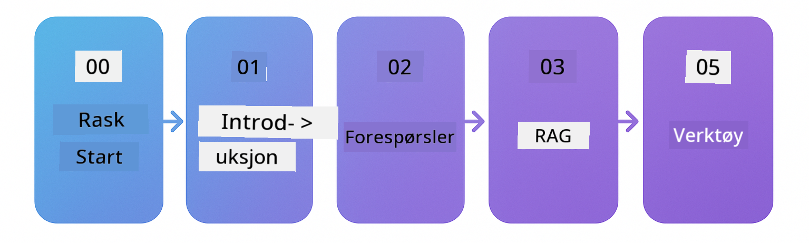

<!--
CO_OP_TRANSLATOR_METADATA:
{
  "original_hash": "5faf6e12d99d1ba33780f9f32b062d96",
  "translation_date": "2025-12-17T11:27:20+00:00",
  "source_file": "README.md",
  "language_code": "no"
}
-->

### 🌐 Flerspråklig støtte

#### Støttet via GitHub Action (Automatisert og alltid oppdatert)

<!-- CO-OP TRANSLATOR LANGUAGES TABLE START -->
[Arabic](../ar/README.md) | [Bengali](../bn/README.md) | [Bulgarian](../bg/README.md) | [Burmese (Myanmar)](../my/README.md) | [Chinese (Simplified)](../zh/README.md) | [Chinese (Traditional, Hong Kong)](../hk/README.md) | [Chinese (Traditional, Macau)](../mo/README.md) | [Chinese (Traditional, Taiwan)](../tw/README.md) | [Croatian](../hr/README.md) | [Czech](../cs/README.md) | [Danish](../da/README.md) | [Dutch](../nl/README.md) | [Estonian](../et/README.md) | [Finnish](../fi/README.md) | [French](../fr/README.md) | [German](../de/README.md) | [Greek](../el/README.md) | [Hebrew](../he/README.md) | [Hindi](../hi/README.md) | [Hungarian](../hu/README.md) | [Indonesian](../id/README.md) | [Italian](../it/README.md) | [Japanese](../ja/README.md) | [Kannada](../kn/README.md) | [Korean](../ko/README.md) | [Lithuanian](../lt/README.md) | [Malay](../ms/README.md) | [Malayalam](../ml/README.md) | [Marathi](../mr/README.md) | [Nepali](../ne/README.md) | [Nigerian Pidgin](../pcm/README.md) | [Norwegian](./README.md) | [Persian (Farsi)](../fa/README.md) | [Polish](../pl/README.md) | [Portuguese (Brazil)](../br/README.md) | [Portuguese (Portugal)](../pt/README.md) | [Punjabi (Gurmukhi)](../pa/README.md) | [Romanian](../ro/README.md) | [Russian](../ru/README.md) | [Serbian (Cyrillic)](../sr/README.md) | [Slovak](../sk/README.md) | [Slovenian](../sl/README.md) | [Spanish](../es/README.md) | [Swahili](../sw/README.md) | [Swedish](../sv/README.md) | [Tagalog (Filipino)](../tl/README.md) | [Tamil](../ta/README.md) | [Telugu](../te/README.md) | [Thai](../th/README.md) | [Turkish](../tr/README.md) | [Ukrainian](../uk/README.md) | [Urdu](../ur/README.md) | [Vietnamese](../vi/README.md)
<!-- CO-OP TRANSLATOR LANGUAGES TABLE END -->

# LangChain4j for nybegynnere

Et kurs for å bygge AI-applikasjoner med LangChain4j og Azure OpenAI GPT-5, fra grunnleggende chat til AI-agenter.

**Ny til LangChain4j?** Sjekk ut [Glossary](docs/GLOSSARY.md) for definisjoner av nøkkelbegreper og konsepter.

## Innholdsfortegnelse

1. [Rask start](00-quick-start/README.md) - Kom i gang med LangChain4j
2. [Introduksjon](01-introduction/README.md) - Lær det grunnleggende om LangChain4j
3. [Prompt Engineering](02-prompt-engineering/README.md) - Mestre effektiv promptdesign
4. [RAG (Retrieval-Augmented Generation)](03-rag/README.md) - Bygg intelligente kunnskapsbaserte systemer
5. [Verktøy](04-tools/README.md) - Integrer eksterne verktøy og API-er med AI-agenter
6. [MCP (Model Context Protocol)](05-mcp/README.md) - Arbeid med Model Context Protocol
---

## Læringssti

Start med [Rask start](00-quick-start/README.md)-modulen og gå gjennom hver modul for å bygge ferdighetene dine steg for steg. Du vil prøve grunnleggende eksempler for å forstå det grunnleggende før du går videre til [Introduksjon](01-introduction/README.md)-modulen for en dypere gjennomgang med GPT-5.

Etter å ha fullført modulene, utforsk [Testing Guide](docs/TESTING.md) for å se LangChain4j testkonsepter i praksis.

> **Merk:** Denne opplæringen bruker både GitHub-modeller og Azure OpenAI. [Rask start](00-quick-start/README.md) og [MCP](05-mcp/README.md)-modulene bruker GitHub-modeller (ingen Azure-abonnement kreves), mens modul 1-4 bruker Azure OpenAI GPT-5.

## Læring med GitHub Copilot

For å raskt komme i gang med koding, åpne dette prosjektet i en GitHub Codespace eller din lokale IDE med den medfølgende devcontaineren. Devcontaineren som brukes i dette kurset kommer forhåndskonfigurert med GitHub Copilot for AI-parprogrammering.

Hvert kodeeksempel inkluderer foreslåtte spørsmål du kan stille GitHub Copilot for å utdype forståelsen din. Se etter 💡/🤖-promptene i:

- **Java-filoverskrifter** - Spørsmål spesifikke for hvert eksempel
- **Modul-READMEer** - Utforskningsspørsmål etter kodeeksempler

**Hvordan bruke:** Åpne en hvilken som helst kodefil og still Copilot de foreslåtte spørsmålene. Den har full kontekst av kodebasen og kan forklare, utvide og foreslå alternativer.

Vil du lære mer? Sjekk ut [Copilot for AI Paired Programming](https://aka.ms/GitHubCopilotAI).

## Ytterligere ressurser

<!-- CO-OP TRANSLATOR OTHER COURSES START -->
### LangChain

---

### Azure / Edge / MCP / Agenter

---
 
### Generativ AI-serie

[-9333EA?style=for-the-badge&labelColor=E5E7EB&color=9333EA)](https://github.com/microsoft/Generative-AI-for-beginners-dotnet?WT.mc_id=academic-105485-koreyst)
[-C084FC?style=for-the-badge&labelColor=E5E7EB&color=C084FC)](https://github.com/microsoft/generative-ai-for-beginners-java?WT.mc_id=academic-105485-koreyst)
[-E879F9?style=for-the-badge&labelColor=E5E7EB&color=E879F9)](https://github.com/microsoft/generative-ai-with-javascript?WT.mc_id=academic-105485-koreyst)

---
 
### Kjerneopplæring

---
 
### Copilot-serie

<!-- CO-OP TRANSLATOR OTHER COURSES END -->

## Få hjelp

Hvis du står fast eller har spørsmål om å bygge AI-apper, bli med i:

Hvis du har produktinnspill eller opplever feil under bygging, besøk:

## Lisens

MIT-lisens - Se [LICENSE](../../LICENSE)-filen for detaljer.

---

<!-- CO-OP TRANSLATOR DISCLAIMER START -->
**Ansvarsfraskrivelse**:
Dette dokumentet er oversatt ved hjelp av AI-oversettelsestjenesten [Co-op Translator](https://github.com/Azure/co-op-translator). Selv om vi streber etter nøyaktighet, vennligst vær oppmerksom på at automatiske oversettelser kan inneholde feil eller unøyaktigheter. Det opprinnelige dokumentet på originalspråket skal anses som den autoritative kilden. For kritisk informasjon anbefales profesjonell menneskelig oversettelse. Vi er ikke ansvarlige for eventuelle misforståelser eller feiltolkninger som oppstår ved bruk av denne oversettelsen.
<!-- CO-OP TRANSLATOR DISCLAIMER END -->