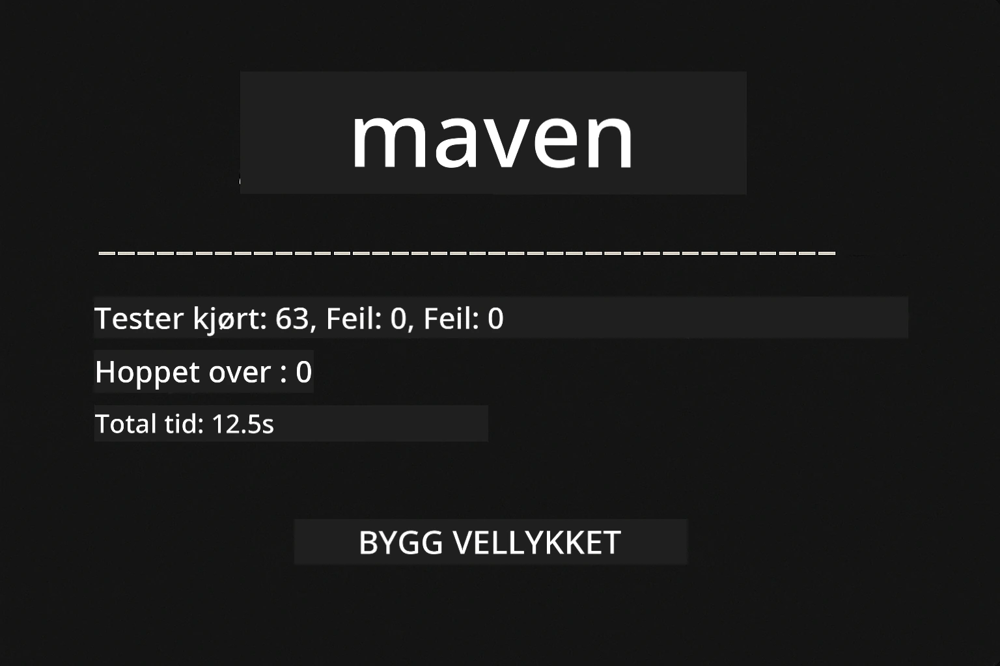
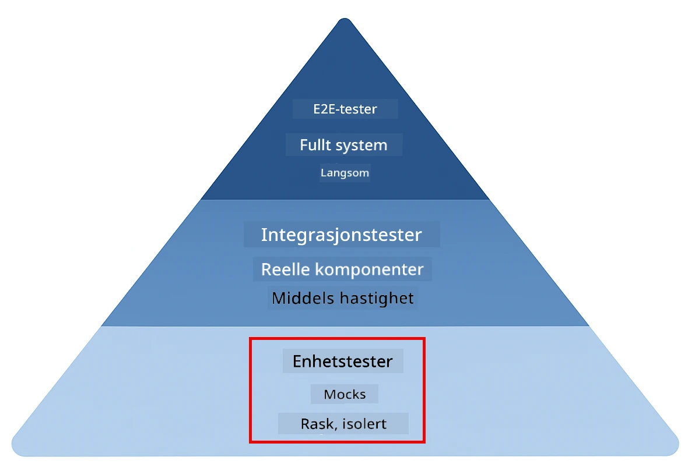
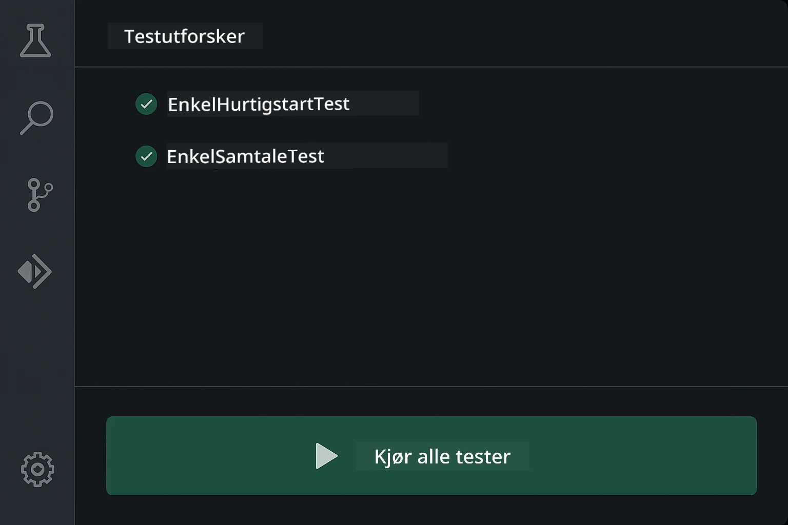
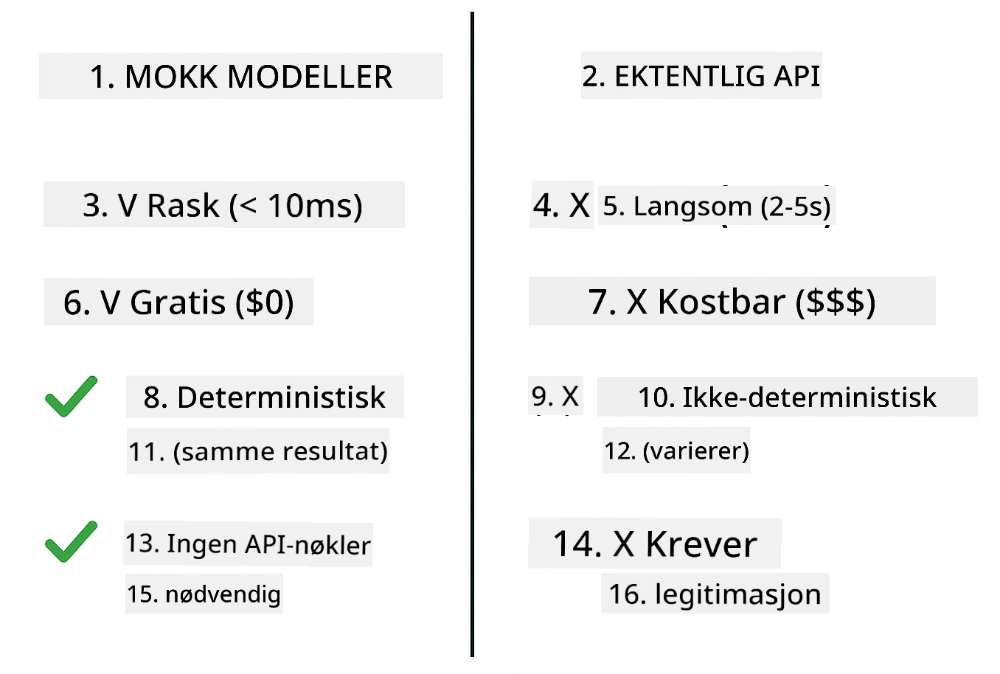
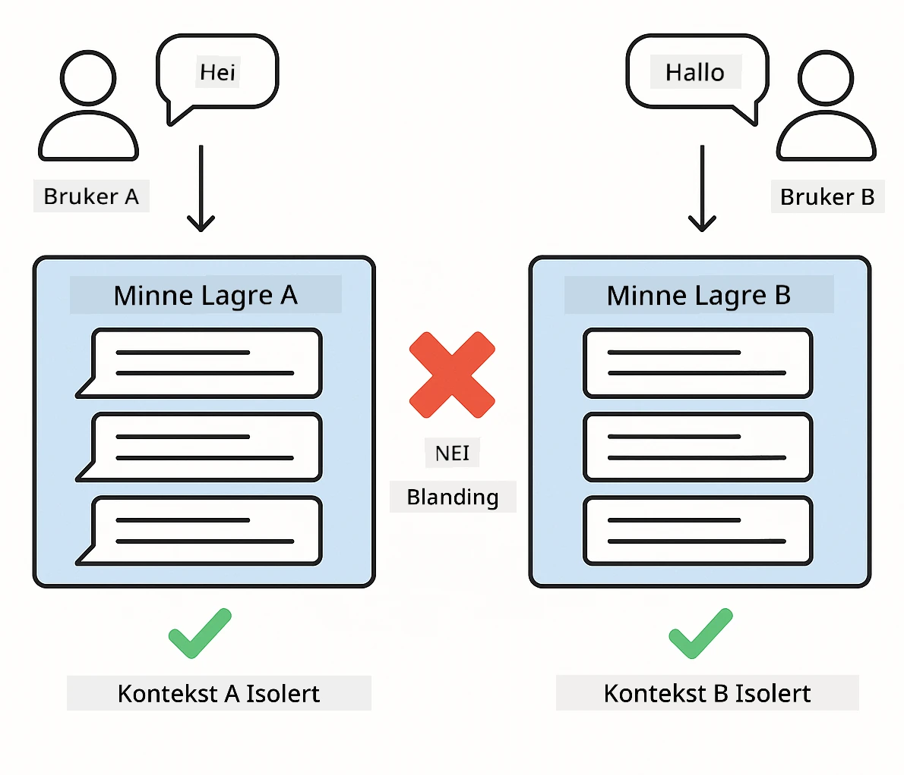
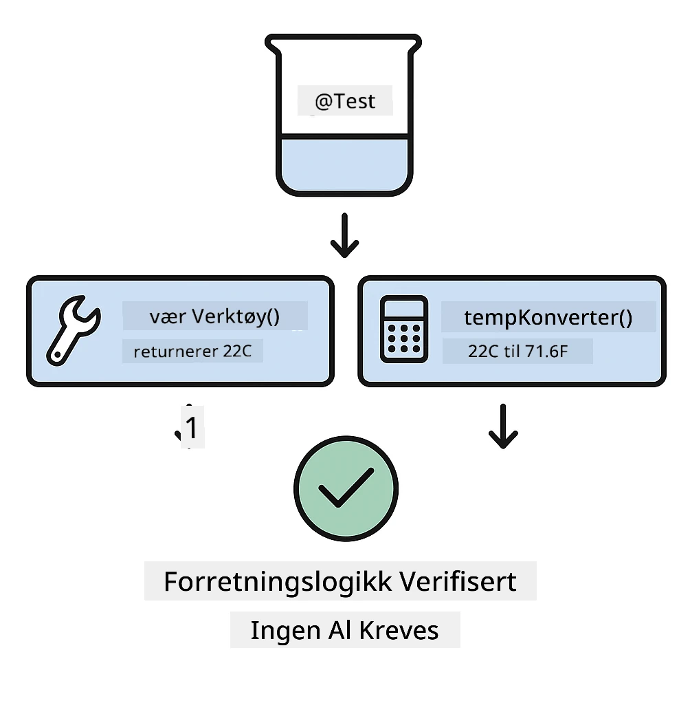
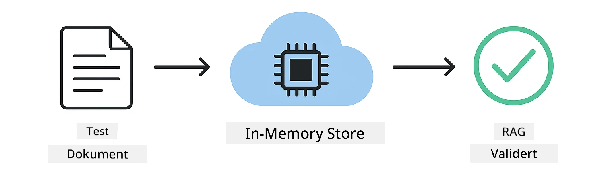

# Test av LangChain4j-applikasjoner

## Innholdsfortegnelse

- [Kom i gang](../../../docs)
- [Hva testene dekker](../../../docs)
- [Kjøre testene](../../../docs)
- [Kjøre tester i VS Code](../../../docs)
- [Testmønstre](../../../docs)
- [Testfilosofi](../../../docs)
- [Neste steg](../../../docs)

Denne guiden tar deg gjennom testene som demonstrerer hvordan du tester AI-applikasjoner uten å kreve API-nøkler eller eksterne tjenester.

## Kom i gang

Kjør alle tester med en enkelt kommando:

**Bash:**
```bash
mvn test
```

**PowerShell:**
```powershell
mvn --% test
```



*Vel gjennomført testkjøring som viser at alle tester passerer uten feil*

## Hva testene dekker

Dette kurset fokuserer på **enhetstester** som kjøres lokalt. Hver test demonstrerer et spesifikt LangChain4j-konsept isolert.



*Testpyramide som viser balansen mellom enhetstester (raske, isolerte), integrasjonstester (ekte komponenter) og ende-til-ende-tester. Dette kurset dekker enhetstesting.*

| Modul | Tester | Fokus | Nøkkelfiler |
|--------|-------|-------|-----------|
| **00 - Kom i gang** | 6 | Promptmaler og variabelsubstitusjon | `SimpleQuickStartTest.java` |
| **01 - Introduksjon** | 8 | Samtaleminne og tilstandsbasert chat | `SimpleConversationTest.java` |
| **02 - Promptteknikk** | 12 | GPT-5-mønstre, iverhetsnivåer, strukturert utdata | `SimpleGpt5PromptTest.java` |
| **03 - RAG** | 10 | Dokumentinngesting, embeddinger, likhetssøk | `DocumentServiceTest.java` |
| **04 - Verktøy** | 12 | Funksjonskall og kjeding av verktøy | `SimpleToolsTest.java` |
| **05 - MCP** | 8 | Model Context Protocol med stdio-transport | `SimpleMcpTest.java` |

## Kjøre testene

**Kjør alle tester fra roten:**

**Bash:**
```bash
mvn test
```

**PowerShell:**
```powershell
mvn --% test
```

**Kjør tester for en spesifikk modul:**

**Bash:**
```bash
cd 01-introduction && mvn test
# Eller fra rotkatalogen
mvn test -pl 01-introduction
```

**PowerShell:**
```powershell
cd 01-introduction; mvn --% test
# Eller fra root
mvn --% test -pl 01-introduction
```

**Kjør en enkelt testklasse:**

**Bash:**
```bash
mvn test -Dtest=SimpleConversationTest
```

**PowerShell:**
```powershell
mvn --% test -Dtest=SimpleConversationTest
```

**Kjør en spesifikk testmetode:**

**Bash:**
```bash
mvn test -Dtest=SimpleConversationTest#bør opprettholde samtalehistorikk
```

**PowerShell:**
```powershell
mvn --% test -Dtest=SimpleConversationTest#børOpprettholdeSamtalehistorikk
```

## Kjøre tester i VS Code

Hvis du bruker Visual Studio Code, gir Test Explorer et grafisk grensesnitt for å kjøre og feilsøke tester.



*VS Code Testutforsker som viser testtreet med alle Java-testklasser og individuelle testmetoder*

**For å kjøre tester i VS Code:**

1. Åpne Test Explorer ved å klikke på kolbeikonet i aktivitetslinjen
2. Utvid testtreet for å se alle moduler og testklasser
3. Klikk på play-knappen ved siden av en test for å kjøre den individuelt
4. Klikk "Kjør alle tester" for å kjøre hele testpakken
5. Høyreklikk en test og velg "Feilsøk test" for å sette breakpoints og gå gjennom koden steg for steg

Test Explorer viser grønne hakeikoner for passerende tester og gir detaljerte feilmeldinger når tester feiler.

## Testmønstre

### Mønster 1: Testing av promptmaler

Det enkleste mønsteret tester promptmaler uten å kalle noen AI-modell. Du verifiserer at variabelsubstitusjon fungerer korrekt og at promptene er formatert som forventet.


*Testing av promptmaler som viser flyten for variabelsubstitusjon: mal med plassholdere → verdier brukes → formatert utdata verifisert*

```java
@Test
@DisplayName("Should format prompt template with variables")
void testPromptTemplateFormatting() {
    PromptTemplate template = PromptTemplate.from(
        "Best time to visit {{destination}} for {{activity}}?"
    );
    
    Prompt prompt = template.apply(Map.of(
        "destination", "Paris",
        "activity", "sightseeing"
    ));
    
    assertThat(prompt.text()).isEqualTo("Best time to visit Paris for sightseeing?");
}
```

Denne testen ligger i `00-quick-start/src/test/java/com/example/langchain4j/quickstart/SimpleQuickStartTest.java`.

**Kjør den:**

**Bash:**
```bash
cd 00-quick-start && mvn test -Dtest=SimpleQuickStartTest#test av formatering av promptmal
```

**PowerShell:**
```powershell
cd 00-quick-start; mvn --% test -Dtest=SimpleQuickStartTest#testPromptMalFormatering
```

### Mønster 2: Mocking av språkmodeller

Når du tester samtalelogikk, bruk Mockito for å lage falske modeller som returnerer forhåndsbestemte svar. Dette gjør testene raske, gratis og deterministiske.



*Sammenligning som viser hvorfor mocks foretrekkes for testing: de er raske, gratis, deterministiske og krever ingen API-nøkler*

```java
@ExtendWith(MockitoExtension.class)
class SimpleConversationTest {
    
    private ConversationService conversationService;
    
    @Mock
    private OpenAiOfficialChatModel mockChatModel;
    
    @BeforeEach
    void setUp() {
        ChatResponse mockResponse = ChatResponse.builder()
            .aiMessage(AiMessage.from("This is a test response"))
            .build();
        when(mockChatModel.chat(anyList())).thenReturn(mockResponse);
        
        conversationService = new ConversationService(mockChatModel);
    }
    
    @Test
    void shouldMaintainConversationHistory() {
        String conversationId = conversationService.startConversation();
        
        ChatResponse mockResponse1 = ChatResponse.builder()
            .aiMessage(AiMessage.from("Response 1"))
            .build();
        ChatResponse mockResponse2 = ChatResponse.builder()
            .aiMessage(AiMessage.from("Response 2"))
            .build();
        ChatResponse mockResponse3 = ChatResponse.builder()
            .aiMessage(AiMessage.from("Response 3"))
            .build();
        
        when(mockChatModel.chat(anyList()))
            .thenReturn(mockResponse1)
            .thenReturn(mockResponse2)
            .thenReturn(mockResponse3);

        conversationService.chat(conversationId, "First message");
        conversationService.chat(conversationId, "Second message");
        conversationService.chat(conversationId, "Third message");

        List<ChatMessage> history = conversationService.getHistory(conversationId);
        assertThat(history).hasSize(6); // 3 brukermeldinger + 3 AI-meldinger
    }
}
```

Dette mønsteret finnes i `01-introduction/src/test/java/com/example/langchain4j/service/SimpleConversationTest.java`. Mocken sikrer konsekvent oppførsel slik at du kan verifisere at minnehåndtering fungerer korrekt.

### Mønster 3: Testing av samtaleisolasjon

Samtaleminne må holde flere brukere adskilt. Denne testen verifiserer at samtaler ikke blander kontekster.



*Testing av samtaleisolasjon som viser separate minnelagre for forskjellige brukere for å hindre kontektsblanding*

```java
@Test
void shouldIsolateConversationsByid() {
    String conv1 = conversationService.startConversation();
    String conv2 = conversationService.startConversation();
    
    ChatResponse mockResponse = ChatResponse.builder()
        .aiMessage(AiMessage.from("Response"))
        .build();
    when(mockChatModel.chat(anyList())).thenReturn(mockResponse);

    conversationService.chat(conv1, "Message for conversation 1");
    conversationService.chat(conv2, "Message for conversation 2");

    List<ChatMessage> history1 = conversationService.getHistory(conv1);
    List<ChatMessage> history2 = conversationService.getHistory(conv2);
    
    assertThat(history1).hasSize(2);
    assertThat(history2).hasSize(2);
}
```

Hver samtale opprettholder sin egen uavhengige historikk. I produksjonssystemer er denne isolasjonen kritisk for flerbrukerapplikasjoner.

### Mønster 4: Testing av verktøy uavhengig

Verktøy er funksjoner AI-en kan kalle. Test dem direkte for å sikre at de fungerer korrekt uavhengig av AI-beslutninger.



*Testing av verktøy uavhengig som viser mock-utførelse av verktøy uten AI-kall for å verifisere forretningslogikk*

```java
@Test
void shouldConvertCelsiusToFahrenheit() {
    TemperatureTool tempTool = new TemperatureTool();
    String result = tempTool.celsiusToFahrenheit(25.0);
    assertThat(result).containsPattern("77[.,]0°F");
}

@Test
void shouldDemonstrateToolChaining() {
    WeatherTool weatherTool = new WeatherTool();
    TemperatureTool tempTool = new TemperatureTool();

    String weatherResult = weatherTool.getCurrentWeather("Seattle");
    assertThat(weatherResult).containsPattern("\\d+°C");

    String conversionResult = tempTool.celsiusToFahrenheit(22.0);
    assertThat(conversionResult).containsPattern("71[.,]6°F");
}
```

Disse testene fra `04-tools/src/test/java/com/example/langchain4j/agents/tools/SimpleToolsTest.java` validerer verktøylogikk uten AI-involvering. Kjedeeksempelet viser hvordan én verktøys utdata mates til en annens input.

### Mønster 5: RAG-testing i minnet

RAG-systemer krever tradisjonelt vektordatabaser og embeddingtjenester. In-memory-mønsteret lar deg teste hele pipelinen uten eksterne avhengigheter.



*RAG-testing i minnet som viser arbeidsflyt for dokumentparsing, lagring av embeddinger og likhetssøk uten krav til database*

```java
@Test
void testProcessTextDocument() {
    String content = "This is a test document.\nIt has multiple lines.";
    InputStream inputStream = new ByteArrayInputStream(content.getBytes(StandardCharsets.UTF_8));
    
    DocumentService.ProcessedDocument result = 
        documentService.processDocument(inputStream, "test.txt");

    assertNotNull(result);
    assertTrue(result.segments().size() > 0);
    assertEquals("test.txt", result.segments().get(0).metadata().getString("filename"));
}
```

Denne testen fra `03-rag/src/test/java/com/example/langchain4j/rag/service/DocumentServiceTest.java` oppretter et dokument i minnet og verifiserer chunking og metadatahåndtering.

### Mønster 6: MCP-integrasjonstesting

MCP-modulen tester Model Context Protocol-integrasjonen ved bruk av stdio-transport. Disse testene verifiserer at applikasjonen din kan starte og kommunisere med MCP-servere som underprosesser.

Testene i `05-mcp/src/test/java/com/example/langchain4j/mcp/SimpleMcpTest.java` validerer MCP-klientoppførsel.

**Kjør dem:**

**Bash:**
```bash
cd 05-mcp && mvn test
```

**PowerShell:**
```powershell
cd 05-mcp; mvn --% test
```

## Testfilosofi

Test koden din, ikke AI-en. Testene dine bør validere koden du skriver ved å sjekke hvordan prompts konstrueres, hvordan minne håndteres, og hvordan verktøy utføres. AI-responser varierer og bør ikke være en del av testpåstander. Spør deg selv om promptmalen din korrekt erstatter variabler, ikke om AI-en gir riktig svar.

Bruk mocks for språkmodeller. De er eksterne avhengigheter som er trege, kostbare og ikke-deterministiske. Mocking gjør testene raske (millisekunder i stedet for sekunder), gratis uten API-kostnader, og deterministiske med samme resultat hver gang.

Hold tester uavhengige. Hver test bør sette opp sine egne data, ikke stole på andre tester, og rydde opp etter seg. Tester bør bestå uansett rekkefølge de kjøres i.

Test kanttilfeller utover den glade veien. Prøv tomme input, veldig store input, spesialtegn, ugyldige parametere og grensebetingelser. Disse avdekker ofte feil som normal bruk ikke eksponerer.

Bruk beskrivende navn. Sammenlign `shouldMaintainConversationHistoryAcrossMultipleMessages()` med `test1()`. Det første forteller deg nøyaktig hva som testes, noe som gjør det mye enklere å feilsøke ved feil.

## Neste steg

Nå som du forstår testmønstrene, fordyp deg i hvert modul:

- **[00 - Kom i gang](../00-quick-start/README.md)** - Start med grunnleggende om promptmaler
- **[01 - Introduksjon](../01-introduction/README.md)** - Lær samtaleminnehåndtering
- **[02 - Promptteknikk](../02-prompt-engineering/README.md)** - Behersk GPT-5-promptmønstre
- **[03 - RAG](../03-rag/README.md)** - Bygg retrieval-augmented generation-systemer
- **[04 - Verktøy](../04-tools/README.md)** - Implementer funksjonskall og verktøykjeder
- **[05 - MCP](../05-mcp/README.md)** - Integrer Model Context Protocol

Hvert moduls README gir detaljerte forklaringer av konseptene som testes her.

---

**Navigasjon:** [← Tilbake til hovedsiden](../README.md)

---

<!-- CO-OP TRANSLATOR DISCLAIMER START -->
Ansvarsfraskrivelse:
Dette dokumentet er oversatt ved hjelp av AI-oversettelsestjenesten Co-op Translator (https://github.com/Azure/co-op-translator). Selv om vi streber etter nøyaktighet, må du være oppmerksom på at automatiske oversettelser kan inneholde feil eller unøyaktigheter. Det opprinnelige dokumentet på originalspråket bør betraktes som den autoritative kilden. For kritisk informasjon anbefales profesjonell, menneskelig oversettelse. Vi er ikke ansvarlige for eventuelle misforståelser eller feiltolkninger som oppstår ved bruk av denne oversettelsen.
<!-- CO-OP TRANSLATOR DISCLAIMER END -->