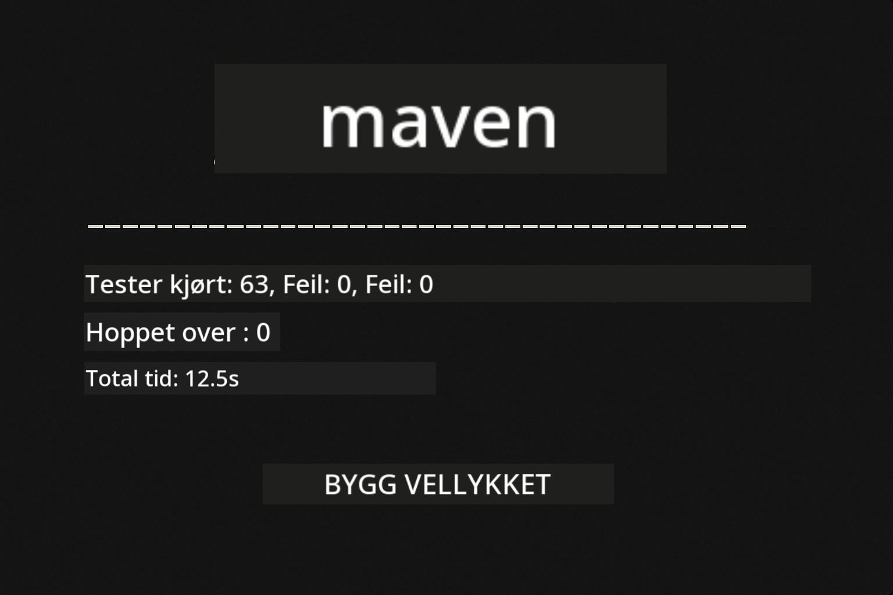
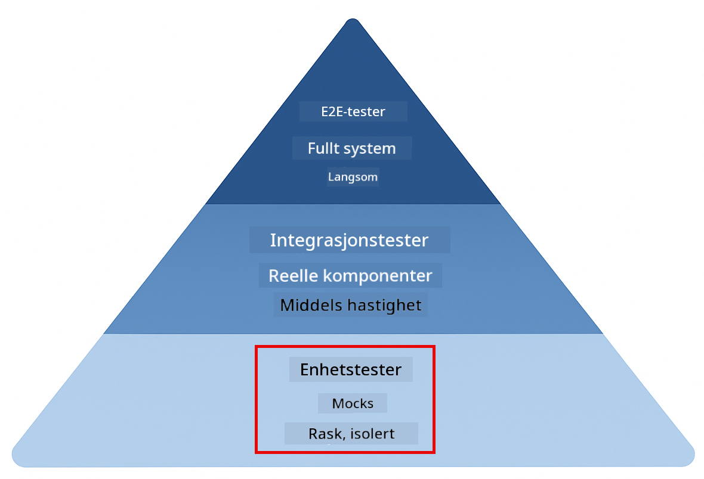
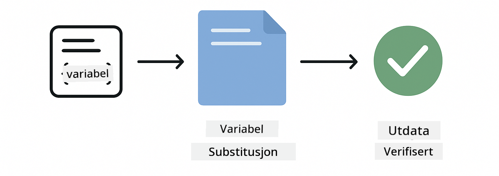
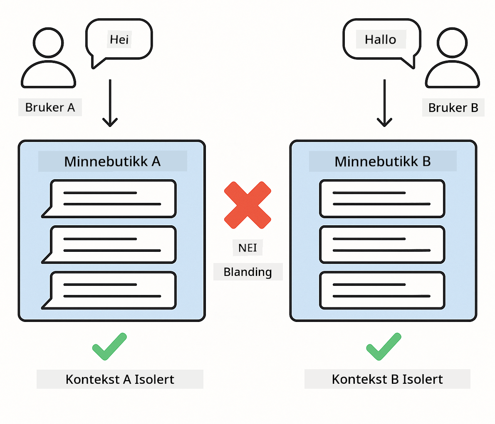

<!--
CO_OP_TRANSLATOR_METADATA:
{
  "original_hash": "b975537560c404d5f254331832811e78",
  "translation_date": "2025-12-13T21:08:15+00:00",
  "source_file": "docs/TESTING.md",
  "language_code": "no"
}
-->
# Testing LangChain4j-applikasjoner

## Innholdsfortegnelse

- [Rask start](../../../docs)
- [Hva testene dekker](../../../docs)
- [Kjøre testene](../../../docs)
- [Kjøre tester i VS Code](../../../docs)
- [Testmønstre](../../../docs)
- [Testfilosofi](../../../docs)
- [Neste steg](../../../docs)

Denne guiden tar deg gjennom testene som demonstrerer hvordan du kan teste AI-applikasjoner uten å kreve API-nøkler eller eksterne tjenester.

## Rask start

Kjør alle tester med en enkelt kommando:

**Bash:**
```bash
mvn test
```

**PowerShell:**
```powershell
mvn --% test
```



*Vellykket testkjøring som viser at alle tester passerer uten feil*

## Hva testene dekker

Dette kurset fokuserer på **enhetstester** som kjøres lokalt. Hver test demonstrerer et spesifikt LangChain4j-konsept isolert.



*Testpyramide som viser balansen mellom enhetstester (raske, isolerte), integrasjonstester (ekte komponenter) og ende-til-ende-tester (fullt system med Docker). Denne opplæringen dekker enhetstesting.*

| Modul | Tester | Fokus | Nøkkelfiler |
|--------|-------|-------|-----------|
| **00 - Rask start** | 6 | Prompt-maler og variabelsubstitusjon | `SimpleQuickStartTest.java` |
| **01 - Introduksjon** | 8 | Samtale-minne og tilstandsstyrt chat | `SimpleConversationTest.java` |
| **02 - Prompt Engineering** | 12 | GPT-5-mønstre, iver-nivåer, strukturert output | `SimpleGpt5PromptTest.java` |
| **03 - RAG** | 10 | Dokumentinntak, embeddings, likhetssøk | `DocumentServiceTest.java` |
| **04 - Verktøy** | 12 | Funksjonskall og verktøykjeder | `SimpleToolsTest.java` |
| **05 - MCP** | 15 | Model Context Protocol med Docker | `SimpleMcpTest.java`, `McpDockerTransportTest.java` |

## Kjøre testene

**Kjør alle tester fra rotmappen:**

**Bash:**
```bash
mvn test
```

**PowerShell:**
```powershell
mvn --% test
```

**Kjør tester for en spesifikk modul:**

**Bash:**
```bash
cd 01-introduction && mvn test
# Eller fra rot
mvn test -pl 01-introduction
```

**PowerShell:**
```powershell
cd 01-introduction; mvn --% test
# Eller fra rot
mvn --% test -pl 01-introduction
```

**Kjør en enkelt testklasse:**

**Bash:**
```bash
mvn test -Dtest=SimpleConversationTest
```

**PowerShell:**
```powershell
mvn --% test -Dtest=SimpleConversationTest
```

**Kjør en spesifikk testmetode:**

**Bash:**
```bash
mvn test -Dtest=SimpleConversationTest#børOpprettholdeSamtalehistorikk
```

**PowerShell:**
```powershell
mvn --% test -Dtest=SimpleConversationTest#børOpprettholdeSamtalehistorikk
```

## Kjøre tester i VS Code

Hvis du bruker Visual Studio Code, gir Test Explorer et grafisk grensesnitt for å kjøre og feilsøke tester.


*VS Code Test Explorer som viser testtreet med alle Java testklasser og individuelle testmetoder*

**For å kjøre tester i VS Code:**

1. Åpne Test Explorer ved å klikke på kolbe-ikonet i aktivitetslinjen
2. Utvid testtreet for å se alle moduler og testklasser
3. Klikk på avspillingsknappen ved siden av en test for å kjøre den individuelt
4. Klikk "Run All Tests" for å kjøre hele testpakken
5. Høyreklikk en test og velg "Debug Test" for å sette breakpoint og trinnvis kjøring

Test Explorer viser grønne sjekkmerker for beståtte tester og gir detaljerte feilmeldinger når tester feiler.

## Testmønstre


*Seks testmønstre for LangChain4j-applikasjoner: prompt-maler, mocking av modeller, samtaleisolasjon, verktøystesting, in-memory RAG og Docker-integrasjon*

### Mønster 1: Testing av prompt-maler

Det enkleste mønsteret tester prompt-maler uten å kalle noen AI-modell. Du verifiserer at variabelsubstitusjon fungerer korrekt og at prompts er formatert som forventet.



*Testing av prompt-maler som viser flyten for variabelsubstitusjon: mal med plassholdere → verdier anvendt → formatert output verifisert*

```java
@Test
@DisplayName("Should format prompt template with variables")
void testPromptTemplateFormatting() {
    PromptTemplate template = PromptTemplate.from(
        "Best time to visit {{destination}} for {{activity}}?"
    );
    
    Prompt prompt = template.apply(Map.of(
        "destination", "Paris",
        "activity", "sightseeing"
    ));
    
    assertThat(prompt.text()).isEqualTo("Best time to visit Paris for sightseeing?");
}
```

Denne testen ligger i `00-quick-start/src/test/java/com/example/langchain4j/quickstart/SimpleQuickStartTest.java`.

**Kjør den:**

**Bash:**
```bash
cd 00-quick-start && mvn test -Dtest=SimpleQuickStartTest#testPromptMalingsformatering
```

**PowerShell:**
```powershell
cd 00-quick-start; mvn --% test -Dtest=SimpleQuickStartTest#testPromptMalingsformatering
```

### Mønster 2: Mocking av språkmodeller

Når du tester samtalelogikk, bruk Mockito for å lage falske modeller som returnerer forhåndsbestemte svar. Dette gjør testene raske, gratis og deterministiske.


*Sammenligning som viser hvorfor mocks foretrekkes for testing: de er raske, gratis, deterministiske og krever ingen API-nøkler*

```java
@ExtendWith(MockitoExtension.class)
class SimpleConversationTest {
    
    private ConversationService conversationService;
    
    @Mock
    private OpenAiOfficialChatModel mockChatModel;
    
    @BeforeEach
    void setUp() {
        ChatResponse mockResponse = ChatResponse.builder()
            .aiMessage(AiMessage.from("This is a test response"))
            .build();
        when(mockChatModel.chat(anyList())).thenReturn(mockResponse);
        
        conversationService = new ConversationService(mockChatModel);
    }
    
    @Test
    void shouldMaintainConversationHistory() {
        String conversationId = conversationService.startConversation();
        
        ChatResponse mockResponse1 = ChatResponse.builder()
            .aiMessage(AiMessage.from("Response 1"))
            .build();
        ChatResponse mockResponse2 = ChatResponse.builder()
            .aiMessage(AiMessage.from("Response 2"))
            .build();
        ChatResponse mockResponse3 = ChatResponse.builder()
            .aiMessage(AiMessage.from("Response 3"))
            .build();
        
        when(mockChatModel.chat(anyList()))
            .thenReturn(mockResponse1)
            .thenReturn(mockResponse2)
            .thenReturn(mockResponse3);

        conversationService.chat(conversationId, "First message");
        conversationService.chat(conversationId, "Second message");
        conversationService.chat(conversationId, "Third message");

        List<ChatMessage> history = conversationService.getHistory(conversationId);
        assertThat(history).hasSize(6); // 3 bruker + 3 AI-meldinger
    }
}
```

Dette mønsteret finnes i `01-introduction/src/test/java/com/example/langchain4j/service/SimpleConversationTest.java`. Mocken sikrer konsistent oppførsel slik at du kan verifisere at minnehåndtering fungerer korrekt.

### Mønster 3: Testing av samtaleisolasjon

Samtale-minnet må holde flere brukere adskilt. Denne testen verifiserer at samtaler ikke blander kontekster.



*Testing av samtaleisolasjon som viser separate minnelagre for forskjellige brukere for å forhindre kontekstblanding*

```java
@Test
void shouldIsolateConversationsByid() {
    String conv1 = conversationService.startConversation();
    String conv2 = conversationService.startConversation();
    
    ChatResponse mockResponse = ChatResponse.builder()
        .aiMessage(AiMessage.from("Response"))
        .build();
    when(mockChatModel.chat(anyList())).thenReturn(mockResponse);

    conversationService.chat(conv1, "Message for conversation 1");
    conversationService.chat(conv2, "Message for conversation 2");

    List<ChatMessage> history1 = conversationService.getHistory(conv1);
    List<ChatMessage> history2 = conversationService.getHistory(conv2);
    
    assertThat(history1).hasSize(2);
    assertThat(history2).hasSize(2);
}
```

Hver samtale opprettholder sin egen uavhengige historikk. I produksjonssystemer er denne isolasjonen kritisk for flerbrukerapplikasjoner.

### Mønster 4: Testing av verktøy uavhengig

Verktøy er funksjoner AI kan kalle. Test dem direkte for å sikre at de fungerer korrekt uavhengig av AI-beslutninger.


*Testing av verktøy uavhengig som viser mock-verktøykjøring uten AI-kall for å verifisere forretningslogikk*

```java
@Test
void shouldConvertCelsiusToFahrenheit() {
    TemperatureTool tempTool = new TemperatureTool();
    String result = tempTool.celsiusToFahrenheit(25.0);
    assertThat(result).containsPattern("77[.,]0°F");
}

@Test
void shouldDemonstrateToolChaining() {
    WeatherTool weatherTool = new WeatherTool();
    TemperatureTool tempTool = new TemperatureTool();

    String weatherResult = weatherTool.getCurrentWeather("Seattle");
    assertThat(weatherResult).containsPattern("\\d+°C");

    String conversionResult = tempTool.celsiusToFahrenheit(22.0);
    assertThat(conversionResult).containsPattern("71[.,]6°F");
}
```

Disse testene fra `04-tools/src/test/java/com/example/langchain4j/agents/tools/SimpleToolsTest.java` validerer verktøylogikk uten AI-involvering. Kjedeeksempelet viser hvordan output fra ett verktøy mates inn som input til et annet.

### Mønster 5: In-memory RAG-testing

RAG-systemer krever tradisjonelt vektordatabaser og embedding-tjenester. In-memory-mønsteret lar deg teste hele pipelinen uten eksterne avhengigheter.


*In-memory RAG-testarbeidsflyt som viser dokumentparsing, embedding-lagring og likhetssøk uten behov for database*

```java
@Test
void testProcessTextDocument() {
    String content = "This is a test document.\nIt has multiple lines.";
    InputStream inputStream = new ByteArrayInputStream(content.getBytes(StandardCharsets.UTF_8));
    
    DocumentService.ProcessedDocument result = 
        documentService.processDocument(inputStream, "test.txt");

    assertNotNull(result);
    assertTrue(result.segments().size() > 0);
    assertEquals("test.txt", result.segments().get(0).metadata().getString("filename"));
}
```

Denne testen fra `03-rag/src/test/java/com/example/langchain4j/rag/service/DocumentServiceTest.java` oppretter et dokument i minnet og verifiserer oppdeling og metadatahåndtering.

### Mønster 6: Integrasjonstesting med Docker

Noen funksjoner trenger ekte infrastruktur. MCP-modulen bruker Testcontainers for å starte Docker-containere for integrasjonstester. Disse validerer at koden din fungerer med faktiske tjenester samtidig som testisolasjon opprettholdes.


*MCP-integrasjonstesting med Testcontainers som viser automatisert containerlivssyklus: start, testkjøring, stopp og opprydding*

Testene i `05-mcp/src/test/java/com/example/langchain4j/mcp/McpDockerTransportTest.java` krever at Docker kjører.

**Kjør dem:**

**Bash:**
```bash
cd 05-mcp && mvn test
```

**PowerShell:**
```powershell
cd 05-mcp; mvn --% test
```

## Testfilosofi

Test koden din, ikke AI-en. Testene dine skal validere koden du skriver ved å sjekke hvordan prompts konstrueres, hvordan minnet håndteres, og hvordan verktøy utføres. AI-svar varierer og bør ikke være del av testpåstander. Spør deg selv om prompt-malen din korrekt erstatter variabler, ikke om AI gir riktig svar.

Bruk mocks for språkmodeller. De er eksterne avhengigheter som er trege, dyre og ikke-deterministiske. Mocking gjør testene raske med millisekunder i stedet for sekunder, gratis uten API-kostnader, og deterministiske med samme resultat hver gang.

Hold testene uavhengige. Hver test bør sette opp sine egne data, ikke stole på andre tester, og rydde opp etter seg. Tester bør passere uavhengig av kjørerrekkefølge.

Test kanttilfeller utover den glade sti. Prøv tomme input, veldig store input, spesialtegn, ugyldige parametere og grensebetingelser. Disse avslører ofte feil som normal bruk ikke eksponerer.

Bruk beskrivende navn. Sammenlign `shouldMaintainConversationHistoryAcrossMultipleMessages()` med `test1()`. Det første forteller deg nøyaktig hva som testes, noe som gjør feilsøking mye enklere.

## Neste steg

Nå som du forstår testmønstrene, dykk dypere inn i hver modul:

- **[00 - Rask start](../00-quick-start/README.md)** - Start med grunnleggende prompt-maler
- **[01 - Introduksjon](../01-introduction/README.md)** - Lær samtale-minnehåndtering
- **[02 - Prompt Engineering](../02-prompt-engineering/README.md)** - Mestre GPT-5 prompt-mønstre
- **[03 - RAG](../03-rag/README.md)** - Bygg retrieval-augmented generation-systemer
- **[04 - Verktøy](../04-tools/README.md)** - Implementer funksjonskall og verktøykjeder
- **[05 - MCP](../05-mcp/README.md)** - Integrer Model Context Protocol med Docker

Hver moduls README gir detaljerte forklaringer på konseptene som testes her.

---

**Navigasjon:** [← Tilbake til hovedside](../README.md)

---

<!-- CO-OP TRANSLATOR DISCLAIMER START -->
**Ansvarsfraskrivelse**:
Dette dokumentet er oversatt ved hjelp av AI-oversettelsestjenesten [Co-op Translator](https://github.com/Azure/co-op-translator). Selv om vi streber etter nøyaktighet, vennligst vær oppmerksom på at automatiske oversettelser kan inneholde feil eller unøyaktigheter. Det opprinnelige dokumentet på originalspråket skal anses som den autoritative kilden. For kritisk informasjon anbefales profesjonell menneskelig oversettelse. Vi er ikke ansvarlige for eventuelle misforståelser eller feiltolkninger som oppstår ved bruk av denne oversettelsen.
<!-- CO-OP TRANSLATOR DISCLAIMER END -->