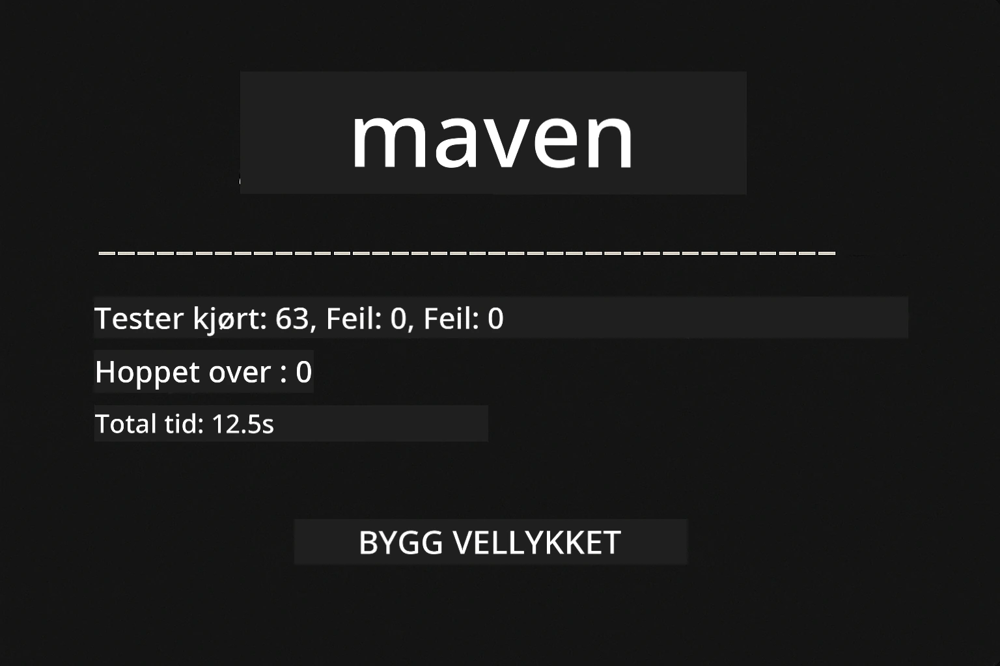
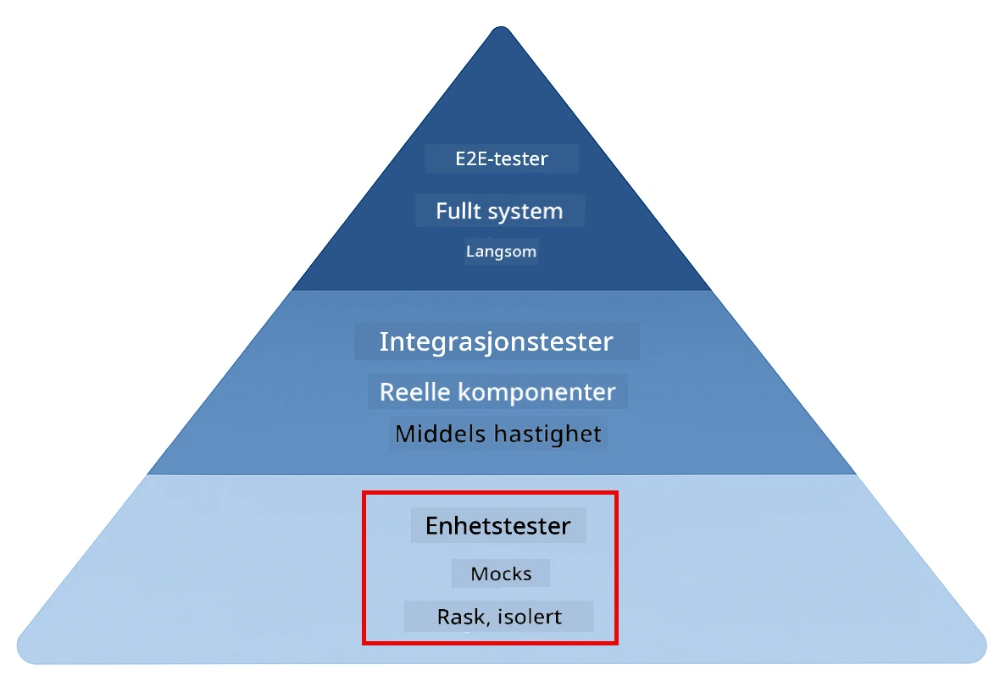
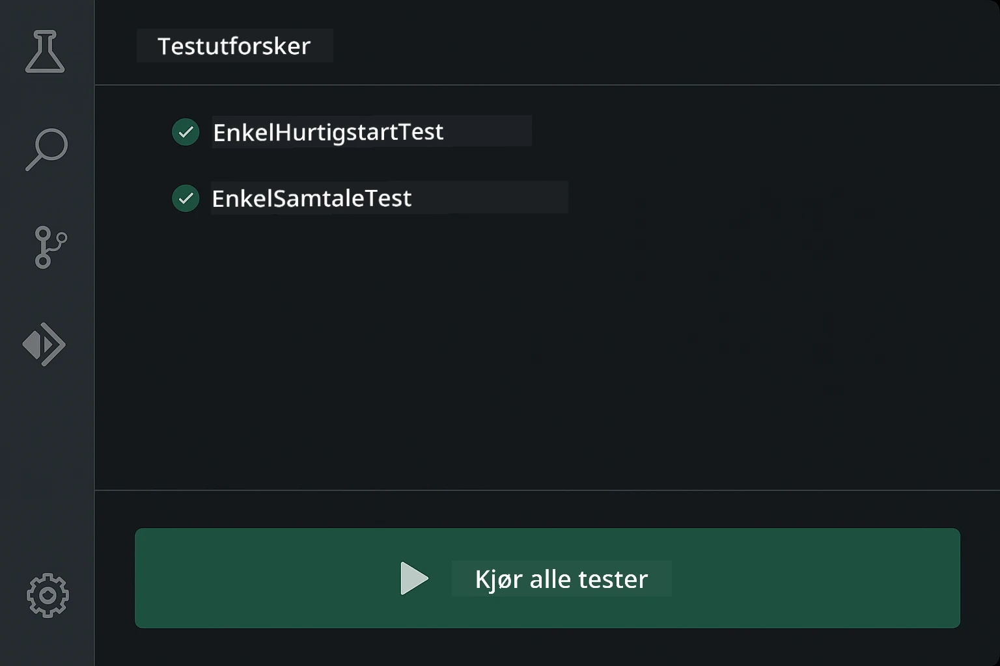
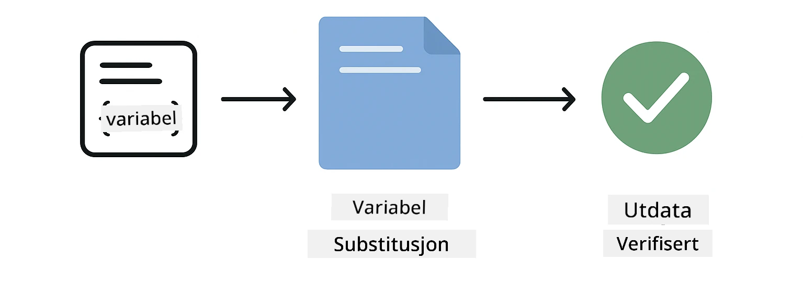
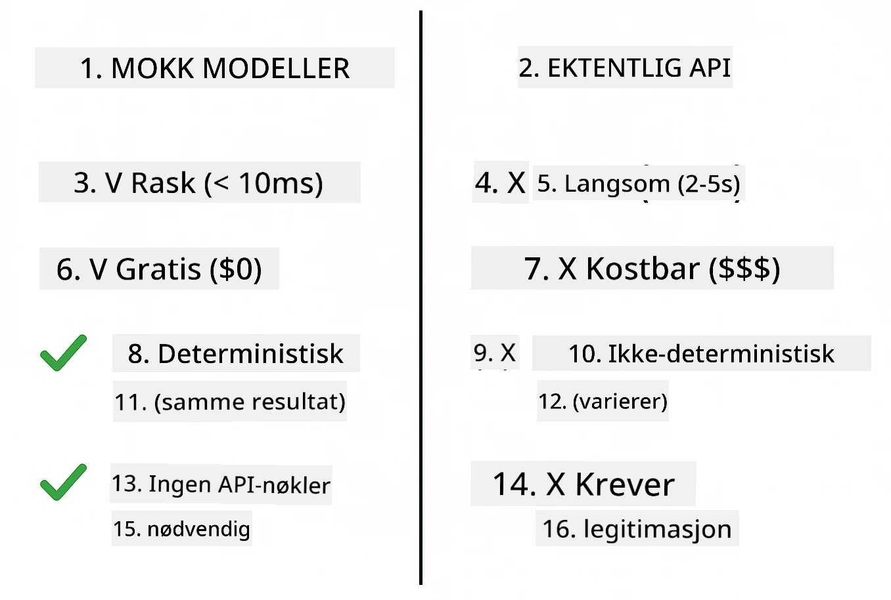
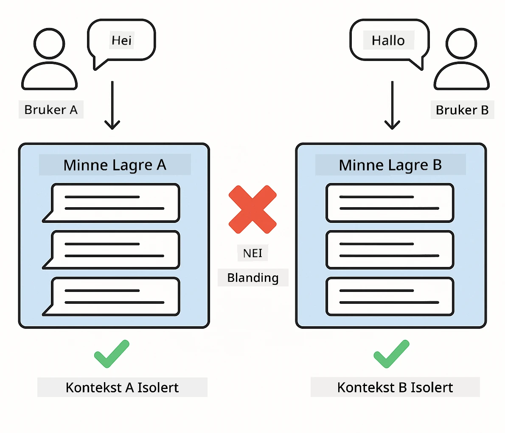
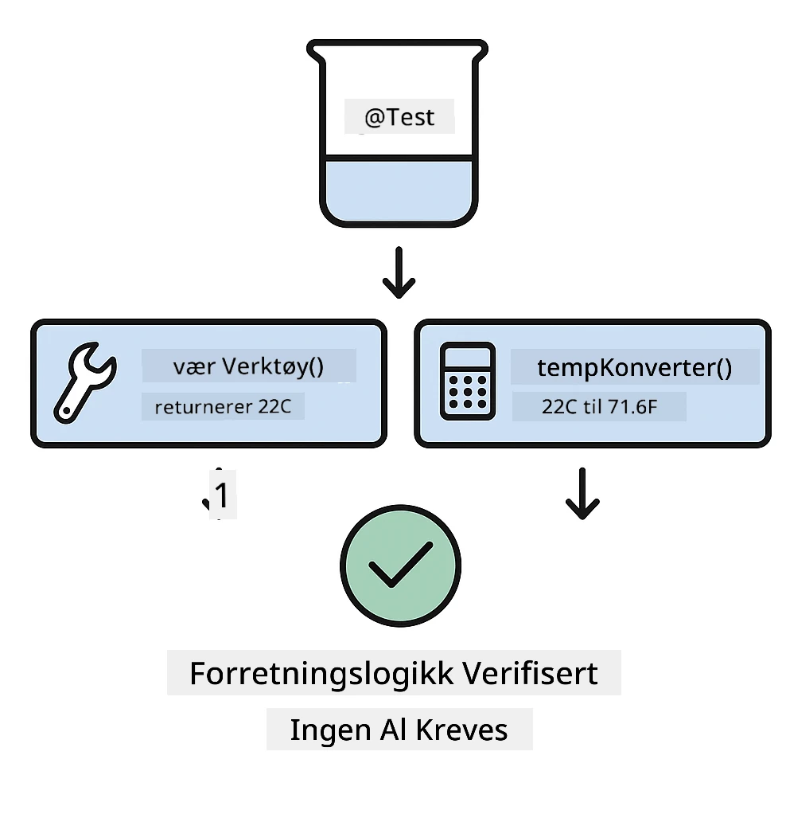
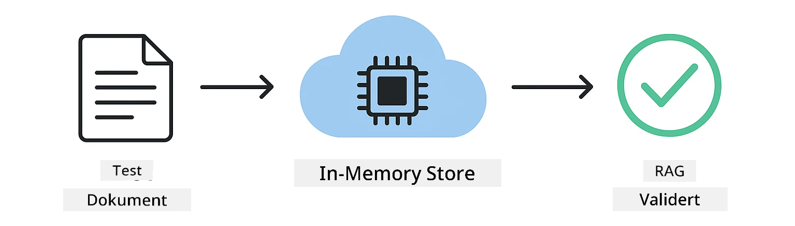

# Testing LangChain4j-applikasjoner

## Innholdsfortegnelse

- [Kjappstart](#kjappstart)
- [Hva testene dekker](#hva-testene-dekker)
- [Kjøre testene](#kjøre-testene)
- [Kjøre tester i VS Code](#kjøre-tester-i-vs-code)
- [Testmønstre](#testmønstre)
- [Testfilosofi](#testfilosofi)
- [Neste steg](#neste-steg)

Denne guiden går gjennom testene som demonstrerer hvordan man tester AI-applikasjoner uten å kreve API-nøkler eller eksterne tjenester.

## Kjappstart

Kjør alle tester med en enkelt kommando:

**Bash:**
```bash
mvn test
```

**PowerShell:**
```powershell
mvn --% test
```

Når alle tester passerer, bør du se output som skjermbildet nedenfor — alle tester kjører uten feil.



*Vel­lykket test­kjøring som viser at alle tester passerer uten feil*

## Hva testene dekker

Dette kurset fokuserer på **enhetstester** som kjøres lokalt. Hver test demonstrerer et spesifikt LangChain4j-konsept isolert. Testpyramiden nedenfor viser hvor enhetstester passer inn — de utgjør det raske, pålitelige grunnlaget som resten av teststrategien bygger på.



*Testpyramide som viser balansen mellom enhetstester (raske, isolerte), integrasjonstester (ekte komponenter) og ende-til-ende tester. Denne opplæringen dekker enhetstesting.*

| Modul | Tester | Fokus | Viktige filer |
|--------|-------|-------|-----------|
| **01 - Introduksjon** | 8 | Samtale-minne og statefull chat | `SimpleConversationTest.java` |
| **02 - Prompt engineering** | 12 | GPT-5.2-mønstre, entusiastnivåer, strukturert output | `SimpleGpt5PromptTest.java` |
| **03 - RAG** | 10 | Dokumentinnhenting, embeddings, likhetssøk | `DocumentServiceTest.java` |
| **04 - Verktøy** | 12 | Funksjonskall og verktøykjeder | `SimpleToolsTest.java` |
| **05 - MCP** | 8 | Model Context Protocol med Stdio transport | `SimpleMcpTest.java` |

## Kjøre testene

**Kjør alle tester fra rotmappen:**

**Bash:**
```bash
mvn test
```

**PowerShell:**
```powershell
mvn --% test
```

**Kjør tester for en spesifikk modul:**

**Bash:**
```bash
cd 01-introduction && mvn test
# Eller fra rot
mvn test -pl 01-introduction
```

**PowerShell:**
```powershell
cd 01-introduction; mvn --% test
# Eller fra rot
mvn --% test -pl 01-introduction
```

**Kjør en enkelt testklasse:**

**Bash:**
```bash
mvn test -Dtest=SimpleConversationTest
```

**PowerShell:**
```powershell
mvn --% test -Dtest=SimpleConversationTest
```

**Kjør en spesifikk testmetode:**

**Bash:**
```bash
mvn test -Dtest=SimpleConversationTest#børOpprettholdeSamtaleHistorikk
```

**PowerShell:**
```powershell
mvn --% test -Dtest=SimpleConversationTest#skalOpprettholdeSamtalehistorikk
```

## Kjøre tester i VS Code

Hvis du bruker Visual Studio Code, gir Test Explorer et grafisk grensesnitt for å kjøre og feilsøke tester.



*VS Code Test Explorer som viser testtre med alle Java testklasser og individuelle testmetoder*

**Slik kjører du tester i VS Code:**

1. Åpne Test Explorer ved å klikke på kolbe-ikonet i aktivitetslinjen
2. Utvid testtreet for å se alle moduler og testklasser
3. Klikk på avspillingsknappen ved en test for å kjøre den individuelt
4. Klikk "Run All Tests" for å kjøre hele testpakken
5. Høyreklikk en test og velg "Debug Test" for å sette breakpoints og trinnvise kjøringer

Test Explorer viser grønne haker for beståtte tester og detaljerte feilmeldinger hvis tester feiler.

## Testmønstre

### Mønster 1: Testing av promptmaler

Det enkleste mønsteret tester promptmaler uten å kalle noe AI-modell. Du verifiserer at variabelsubstitusjon fungerer riktig og at promptene formateres som forventet.



*Testing av promptmaler som viser flyten for variabelsubstitusjon: mal med plassholdere → verdier anvendt → formatert output verifisert*

```java
@Test
@DisplayName("Should format prompt template with variables")
void testPromptTemplateFormatting() {
    PromptTemplate template = PromptTemplate.from(
        "Best time to visit {{destination}} for {{activity}}?"
    );
    
    Prompt prompt = template.apply(Map.of(
        "destination", "Paris",
        "activity", "sightseeing"
    ));
    
    assertThat(prompt.text()).isEqualTo("Best time to visit Paris for sightseeing?");
}
```

Dette mønsteret bekrefter at variabelsubstitusjon fungerer som den skal, og at promptene formateres korrekt — ingen API-nøkkel eller modellkall kreves.

### Mønster 2: Mocking av språkmodeller

Når du tester konversasjonslogikk, bruk Mockito for å lage falske modeller som returnerer forhåndsbestemte svar. Dette gjør testene raske, gratis og deterministiske.



*Sammenligning som viser hvorfor mocks foretrekkes for testing: de er raske, gratis, deterministiske og krever ingen API-nøkler*

```java
@ExtendWith(MockitoExtension.class)
class SimpleConversationTest {
    
    private ConversationService conversationService;
    
    @Mock
    private OpenAiOfficialChatModel mockChatModel;
    
    @BeforeEach
    void setUp() {
        ChatResponse mockResponse = ChatResponse.builder()
            .aiMessage(AiMessage.from("This is a test response"))
            .build();
        when(mockChatModel.chat(anyList())).thenReturn(mockResponse);
        
        conversationService = new ConversationService(mockChatModel);
    }
    
    @Test
    void shouldMaintainConversationHistory() {
        String conversationId = conversationService.startConversation();
        
        ChatResponse mockResponse1 = ChatResponse.builder()
            .aiMessage(AiMessage.from("Response 1"))
            .build();
        ChatResponse mockResponse2 = ChatResponse.builder()
            .aiMessage(AiMessage.from("Response 2"))
            .build();
        ChatResponse mockResponse3 = ChatResponse.builder()
            .aiMessage(AiMessage.from("Response 3"))
            .build();
        
        when(mockChatModel.chat(anyList()))
            .thenReturn(mockResponse1)
            .thenReturn(mockResponse2)
            .thenReturn(mockResponse3);

        conversationService.chat(conversationId, "First message");
        conversationService.chat(conversationId, "Second message");
        conversationService.chat(conversationId, "Third message");

        List<ChatMessage> history = conversationService.getHistory(conversationId);
        assertThat(history).hasSize(6); // 3 bruker + 3 AI-meldinger
    }
}
```

Dette mønsteret finnes i `01-introduction/src/test/java/com/example/langchain4j/service/SimpleConversationTest.java`. Mocken sikrer konsistent oppførsel slik at du kan verifisere at håndtering av minnet fungerer korrekt.

### Mønster 3: Testing av isolasjon i samtaler

Samtaleminne må holde flere brukere adskilt. Denne testen verifiserer at samtaler ikke blander kontekster.



*Testing av samtaleisolasjon som viser separate minnelagre for ulike brukere for å hindre kontekstblanding*

```java
@Test
void shouldIsolateConversationsByid() {
    String conv1 = conversationService.startConversation();
    String conv2 = conversationService.startConversation();
    
    ChatResponse mockResponse = ChatResponse.builder()
        .aiMessage(AiMessage.from("Response"))
        .build();
    when(mockChatModel.chat(anyList())).thenReturn(mockResponse);

    conversationService.chat(conv1, "Message for conversation 1");
    conversationService.chat(conv2, "Message for conversation 2");

    List<ChatMessage> history1 = conversationService.getHistory(conv1);
    List<ChatMessage> history2 = conversationService.getHistory(conv2);
    
    assertThat(history1).hasSize(2);
    assertThat(history2).hasSize(2);
}
```

Hver samtale opprettholder sin egen uavhengige historie. I produksjonssystemer er denne isolasjonen kritisk for flerbrukerapplikasjoner.

### Mønster 4: Testing av verktøy uavhengig

Verktøy er funksjoner AI kan kalle. Test dem direkte for å sikre at de fungerer riktig uavhengig av AI-beslutninger.



*Testing av verktøy uavhengig med mock-verktøyutførelse uten AI-kall for å verifisere forretningslogikk*

```java
@Test
void shouldConvertCelsiusToFahrenheit() {
    TemperatureTool tempTool = new TemperatureTool();
    String result = tempTool.celsiusToFahrenheit(25.0);
    assertThat(result).containsPattern("77[.,]0°F");
}

@Test
void shouldDemonstrateToolChaining() {
    WeatherTool weatherTool = new WeatherTool();
    TemperatureTool tempTool = new TemperatureTool();

    String weatherResult = weatherTool.getCurrentWeather("Seattle");
    assertThat(weatherResult).containsPattern("\\d+°C");

    String conversionResult = tempTool.celsiusToFahrenheit(22.0);
    assertThat(conversionResult).containsPattern("71[.,]6°F");
}
```

Disse testene fra `04-tools/src/test/java/com/example/langchain4j/agents/tools/SimpleToolsTest.java` validerer verktøylogikk uten AI-involvering. Kjedeneksempelet viser hvordan output fra ett verktøy mates inn som input til et annet.

### Mønster 5: Testing av RAG i minnet

RAG-systemer krever tradisjonelt vektordatabaser og embeddingtjenester. Minnebasert mønster lar deg teste hele kjeden uten eksterne avhengigheter.



*Minnebasert RAG-testarbeidsflyt som viser dokumentparsing, embeddinglagring og likhetssøk uten behov for database*

```java
@Test
void testProcessTextDocument() {
    String content = "This is a test document.\nIt has multiple lines.";
    InputStream inputStream = new ByteArrayInputStream(content.getBytes(StandardCharsets.UTF_8));
    
    DocumentService.ProcessedDocument result = 
        documentService.processDocument(inputStream, "test.txt");

    assertNotNull(result);
    assertTrue(result.segments().size() > 0);
    assertEquals("test.txt", result.segments().get(0).metadata().getString("filename"));
}
```

Denne testen fra `03-rag/src/test/java/com/example/langchain4j/rag/service/DocumentServiceTest.java` lager et dokument i minnet og verifiserer oppdeling og metadatahåndtering.

### Mønster 6: MCP-integrasjonstesting

MCP-modulen tester Model Context Protocol-integrasjonen ved bruk av stdio transport. Disse testene verifiserer at applikasjonen din kan starte og kommunisere med MCP-servere som underprosesser.

Testene i `05-mcp/src/test/java/com/example/langchain4j/mcp/SimpleMcpTest.java` validerer MCP-klientoppførsel.

**Kjør dem:**

**Bash:**
```bash
cd 05-mcp && mvn test
```

**PowerShell:**
```powershell
cd 05-mcp; mvn --% test
```

## Testfilosofi

Test koden din, ikke AI-en. Testene dine bør validere koden du skriver ved å sjekke hvordan promptene konstrueres, hvordan minnet håndteres, og hvordan verktøy utføres. AI-responser varierer og bør ikke inngå i testpåstander. Spør deg selv om promptmalen din riktig erstatter variabler, ikke om AI gir riktig svar.

Bruk mocks for språkmodeller. De er eksterne avhengigheter som er trege, kostbare og ikke-deterministiske. Mocking gjør testene raske med millisekunder istedenfor sekunder, gratis uten API-kostnader, og deterministiske med samme resultat hver gang.

Hold testene uavhengige. Hver test bør sette opp sine egne data, ikke stole på andre tester, og rydde opp etter seg. Tester skal passere uansett rekkefølge.

Test kanttilfeller i tillegg til idealveien. Prøv tomme input, svært store input, spesialtegn, ugyldige parametere, og grensetilfeller. Disse avdekker ofte feil som normalt bruk ikke eksponerer.

Bruk beskrivende navn. Sammenlign `shouldMaintainConversationHistoryAcrossMultipleMessages()` med `test1()`. Det første forteller deg nøyaktig hva som testes, noe som gjør feilsøking langt enklere.

## Neste steg

Nå som du forstår testmønstrene, dykk dypere inn i hver modul:

- **[01 - Introduksjon](../01-introduction/README.md)** - Lær samtaleminnehåndtering
- **[02 - Prompt engineering](../02-prompt-engineering/README.md)** - Mestre GPT-5.2-promptmønstre
- **[03 - RAG](../03-rag/README.md)** - Bygg retrieval-augmented generasjonssystemer
- **[04 - Verktøy](../04-tools/README.md)** - Implementer funksjonskall og verktøykjeder
- **[05 - MCP](../05-mcp/README.md)** - Integrer Model Context Protocol

Hver moduls README gir detaljerte forklaringer av konseptene som testes her.

---

**Navigasjon:** [← Tilbake til hovedside](../README.md)

---

<!-- CO-OP TRANSLATOR DISCLAIMER START -->
**Ansvarsfraskrivelse**:
Dette dokumentet er oversatt ved hjelp av AI-oversettelsestjenesten [Co-op Translator](https://github.com/Azure/co-op-translator). Selv om vi streber etter nøyaktighet, vær oppmerksom på at automatiske oversettelser kan inneholde feil eller unøyaktigheter. Det opprinnelige dokumentet på originalspråket skal betraktes som den autoritative kilden. For kritisk informasjon anbefales profesjonell menneskelig oversettelse. Vi er ikke ansvarlige for eventuelle misforståelser eller feiltolkninger som oppstår ved bruk av denne oversettelsen.
<!-- CO-OP TRANSLATOR DISCLAIMER END -->