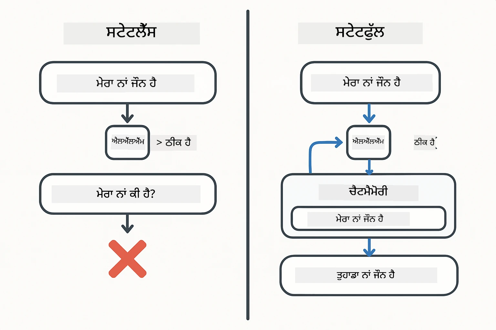
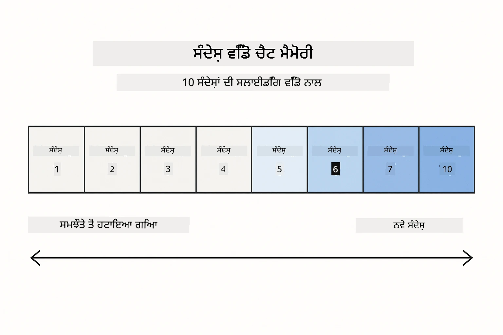
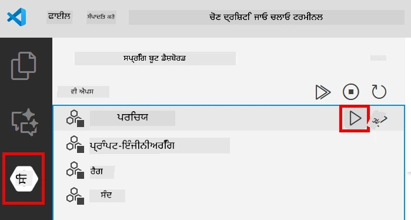
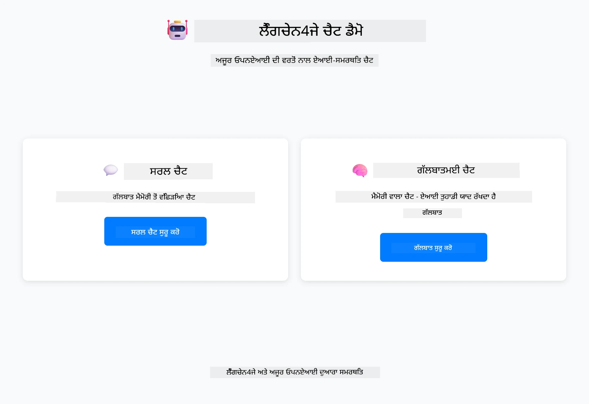
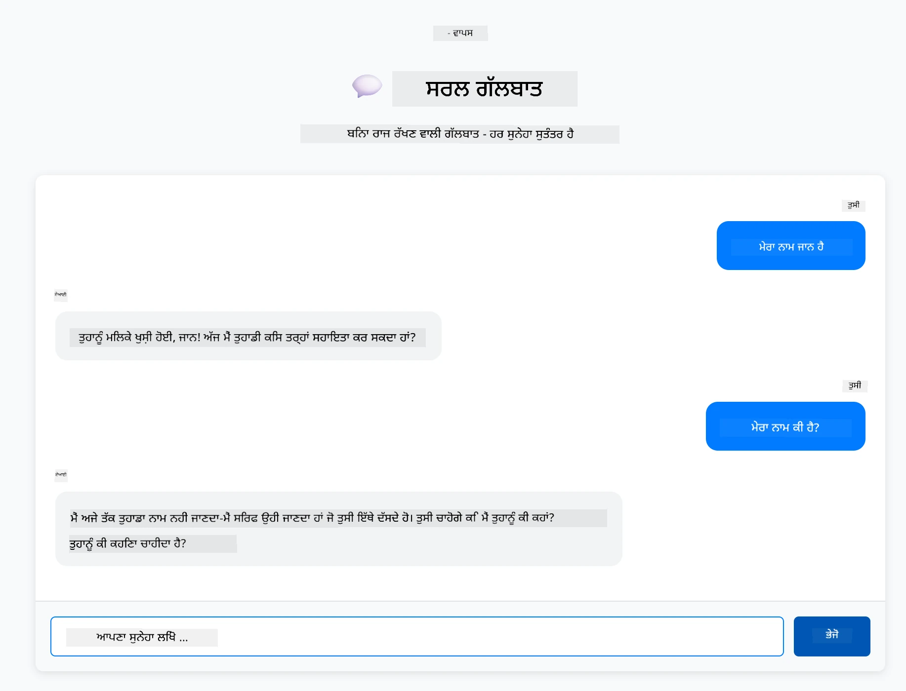
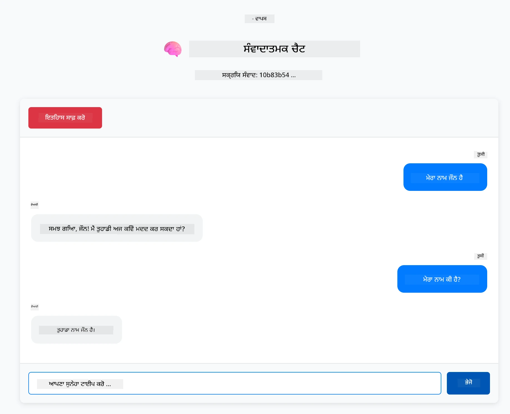

# ਮੋਡੀਊਲ 01: LangChain4j ਨਾਲ ਸ਼ੁਰੂਆਤ

## ਸਮੱਗਰੀ ਦੀ ਸੂਚੀ

- [ਵੇਡੀਓ ਵਾਕਥਰੂ](#ਵੇਡੀਓ-ਵਾਕਥਰੂ)
- [ਤੁਸੀਂ ਕੀ ਸਿੱਖੋਗੇ](#ਤੁਸੀਂ-ਕੀ-ਸਿੱਖੋਗੇ)
- [ਪੂਰਵਾਪੇਸ਼ਾ](#ਪੂਰਵਾਪੇਸ਼ਾ)
- [ਮੁੱਖ ਸਮੱਸਿਆ ਨੂੰ ਸਮਝਣਾ](#ਮੁੱਖ-ਸਮੱਸਿਆ-ਨੂੰ-ਸਮਝਣਾ)
- [ਟੋਕਨ ਨੂੰ ਸਮਝਣਾ](#ਟੋਕਨ-ਨੂੰ-ਸਮਝਣਾ)
- [ਮੈਮੋਰੀ ਕਿਵੇਂ ਕੰਮ ਕਰਦੀ ਹੈ](#ਮੈਮੋਰੀ-ਕਿਵੇਂ-ਕੰਮ-ਕਰਦੀ-ਹੈ)
- [ਇਹ LangChain4j ਕਿਵੇਂ ਵਰਤੀ ਜਾਂਦੀ ਹੈ](#ਇਹ-langchain4j-ਕਿਵੇਂ-ਵਰਤੀ-ਜਾਂਦੀ-ਹੈ)
- [Azure OpenAI ਇੰਫ੍ਰਾਸਟ੍ਰੱਕਚਰ ਨਿਯੁਕਤ ਕਰੋ](#azure-openai-ਇੰਫ੍ਰਾਸਟ੍ਰੱਕਚਰ-ਨਿਯੁਕਤ-ਕਰੋ)
- [ਐਪਲੀਕੇਸ਼ਨ ਨੂੰ ਲੋਕਲ ਰਣ ਕਰੋ](#ਐਪਲੀਕੇਸ਼ਨ-ਨੂੰ-ਲੋਕਲ-ਰਣ-ਕਰੋ)
- [ਐਪਲੀਕੇਸ਼ਨ ਦੀ ਵਰਤੋਂ](#ਐਪਲੀਕੇਸ਼ਨ-ਦੀ-ਵਰਤੋਂ)
  - [ਸਟੇਟਲੈੱਸ ਚੈਟ (ਖੱਬਾ ਪੈਨਲ)](#ਸਟੇਟਲੈੱਸ-ਚੈਟ-ਖੱਬਾ-ਪੈਨਲ)
  - [ਸਟੇਟਫੁਲ ਚੈਟ (ਸੱਜਾ ਪੈਨਲ)](#ਸਟੇਟਫੁਲ-ਚੈਟ-ਸੱਜਾ-ਪੈਨਲ)
- [ਅਗਲੇ ਕਦਮ](#ਅਗਲੇ-ਕਦਮ)

## ਵੇਡੀਓ ਵਾਕਥਰੂ

ਇਸ ਲਾਇਵ ਸੈਸ਼ਨ ਨੂੰ ਦੇਖੋ ਜੋ ਦੱਸਦਾ ਹੈ ਕਿ ਇਸ ਮੋਡੀਊਲ ਨਾਲ ਕਿਵੇਂ ਸ਼ੁਰੂ ਕਰਨਾ ਹੈ:

<a href="https://www.youtube.com/live/nl_troDm8rQ?si=6b85S8xGjWnT2fX9"></a>

## ਤੁਸੀਂ ਕੀ ਸਿੱਖੋਗੇ

ਇਹ ਤੁਹਾਡਾ LangChain4j ਅਤੇ Azure OpenAI ਨਾਲ ਸ਼ੁਰੂਆਤੀ ਬਿੰਦੂ ਹੈ। ਅਸੀਂ ਮੂਲ ਵਸਤਾਂ ਤੋਂ ਸ਼ੁਰੂ ਕਰਦੇ ਹਾਂ ਅਤੇ ਪ੍ਰੋਡਕਸ਼ਨ-ਸਟਾਈਲ ਐਪਲੀਕੇਸ਼ਨਾਂ ਬਣਾਉਣਾ ਸਿਖਦੇ ਹਾਂ। ਇਹ ਮੋਡੀਊਲ ਗੱਲਬਾਤੀ AI ’ਤੇ ਧਿਆਨ ਕੇਂਦ੍ਰਿਤ ਕਰਦਾ ਹੈ ਜੋ ਸੰਦਰਭ ਯਾਦ ਰੱਖਦਾ ਹੈ ਅਤੇ ਸਥਿਤੀ ਨੂੰ ਬਣਾਈ ਰੱਖਦਾ ਹੈ — ਬੁਨਿਆਦੀ ਧਾਰਣਾ ਜਿਸ ’ਤੇ ਹਰ ਅਗਲਾ ਮੋਡੀਊਲ ਨਿਰਭਰ ਕਰਦਾ ਹੈ।

ਅਸੀਂ ਇਸ ਮਾਰਗਦਰਸ਼ਕ ਵਿਚ Azure OpenAI ਦਾ GPT-5.2 ਵਰਤਾਂਗੇ ਕਿਉਂਕਿ ਇਸ ਦੀਆਂ ਉੱਨਤ ਤਰਕਸ਼ੀਲਤਾ ਖਾਸ ਤੌਰ ’ਤੇ ਵੱਖ-ਵੱਖ ਪੈਟਰਨਾਂ ਦੇ ਵਰਤਾਅ ਨੂੰ ਵਧੀਆ ਸਮਝਾਉਂਦੀ ਹੈ। ਜਦੋਂ ਤੁਸੀਂ ਮੈਮੋਰੀ ਸ਼ਾਮਲ ਕਰਦੇ ਹੋ, ਤਾਂ ਤੁਸੀਂ ਫਰਕ ਸਪਸ਼ਟ ਤੌਰ ’ਤੇ ਵੇਖੋਗੇ। ਇਹ ਤੁਹਾਡੇ ਐਪਲੀਕੇਸ਼ਨ ਵਿਚ ਹਰ ਭਾਗ ਕਿਵੇਂ ਕੰਮ ਕਰਦਾ ਹੈ ਇਹ ਸਮਝਣਾ ਆਸਾਨ ਬਣਾਉਂਦਾ ਹੈ।

ਤੁਸੀਂ ਇੱਕ ਐਪਲੀਕੇਸ਼ਨ ਬਣਾਉਂਦੇ ਹੋ ਜੋ ਦੋਹਾਂ ਪੈਟਰਨਾਂ ਨੂੰ ਦਰਸਾਉਂਦੀ ਹੈ:

**ਸਟੇਟਲੈੱਸ ਚੈਟ** - ਹਰ ਬੇਨਤੀ ਸਵਤੰਤਰ ਹੁੰਦੀ ਹੈ। ਮਾਡਲ ਨੂੰ ਪਿਛਲੇ ਸੁਨੇਹਿਆਂ ਦੀ ਕੋਈ ਮੈਮੋਰੀ ਨਹੀਂ ਹੁੰਦੀ। ਇਹ ਸਭ ਤੋਂ ਸਧਾਰਣ ਸ਼ੁਰੂਆਤ ਹੈ।

**ਸਟੇਟਫੁਲ ਗੱਲਬਾਤ** - ਹਰ ਬੇਨਤੀ ਵਿੱਚ ਗੱਲਬਾਤ ਇਤਿਹਾਸ ਸ਼ਾਮਿਲ ਹੁੰਦੀ ਹੈ। ਮਾਡਲ ਕਈ ਬਾਰ ਦੀ ਗੱਲਬਾਤ ਦਾ ਸੰਦਰਭ ਨਿਭਾਂਦਾ ਹੈ। ਇਹ ਉਹ ਹੈ ਜੋ ਪ੍ਰੋਡਕਸ਼ਨ ਐਪਲੀਕੇਸ਼ਨਾਂ ਨੂੰ ਚਾਹੀਦਾ ਹੈ।

## ਪੂਰਵਾਪੇਸ਼ਾ

- Azure ਦੀ ਸਬਸਕ੍ਰਿਪਸ਼ਨ ਜਿਸਦੇ ਨਾਲ Azure OpenAI ਐਕਸੈਸ ਹੋਵੇ
- ਜਾਵਾ 21, ਮਾਵਨ 3.9+
- Azure CLI (https://learn.microsoft.com/en-us/cli/azure/install-azure-cli)
- Azure Developer CLI (azd) (https://learn.microsoft.com/en-us/azure/developer/azure-developer-cli/install-azd)

> **ਨੋਟ:** ਜਾਵਾ, ਮਾਵਨ, Azure CLI ਅਤੇ Azure Developer CLI (azd) ਪਹਿਲਾਂ ਹੀ ਦਿੱਤੇ ਗਏ devcontainer ਵਿੱਚ ਇੰਸਟਾਲ ਹਨ।

> **ਨੋਟ:** ਇਹ ਮੋਡੀਊਲ Azure OpenAI ਤੇ GPT-5.2 ਵਰਤਦਾ ਹੈ। ਡਿਪਲੋਇਮੈਂਟ `azd up` ਰਾਹੀਂ ਆਪਣੇ ਆਪ ਸੰਰਚਿਤ ਹੁੰਦਾ ਹੈ - ਕੋਡ ਵਿੱਚ ਮਾਡਲ ਨਾਮ ਨੂੰ ਬਦਲੋ ਨਾ।

## ਮੁੱਖ ਸਮੱਸਿਆ ਨੂੰ ਸਮਝਣਾ

ਭਾਸ਼ਾ ਮਾਡਲ ਸਟੇਟਲੈੱਸ ਹੁੰਦੇ ਹਨ। ਹਰ API ਕਾਲ ਅਜ਼ਾਦ ਹੁੰਦੀ ਹੈ। ਜੇ ਤੁਸੀਂ "ਮੇਰਾ ਨਾਮ ਜੌਨ ਹੈ" ਭੇਜਦੇ ਹੋ ਅਤੇ ਤਦ ਪੁੱਛਦੇ ਹੋ "ਮੇਰਾ ਨਾਮ ਕੀ ਹੈ?", ਮਾਡਲ ਨੂੰ ਇਸ ਦੀ ਜਾਣਕਾਰੀ ਨਹੀਂ ਹੁੰਦੀ ਕਿ ਤੁਸੀਂ ਆਪਣੇ ਆਪ ਨੂੰ ਪਹਿਲਾਂ ਹੀ ਪਹਚਾਣ ਕਰਵਾਇਆ ਹੈ। ਇਹ ਹਰ ਬੇਨਤੀ ਨੂੰ ਪਹਿਲੀ ਵਾਰ ਦੀ ਗੱਲਬਾਤ ਵਾਂਗੁ ਲੈਂਦਾ ਹੈ।

ਸਧਾਰਣ ਸਵਾਲ-ਜਵਾਬ ਲਈ ਇਹ ਠੀਕ ਹੈ ਪਰ ਵਾਸਤਵਿਕ ਐਪਲੀਕੇਸ਼ਨਾਂ ਲਈ ਬੇਕਾਰ ਹੈ। ਗ੍ਰਾਹਕ ਸੇਵਾ ਬੋਟਾਂ ਨੂੰ ਇਹ ਯਾਦ ਰਹਿਣਾ ਚਾਹੀਦਾ ਹੈ ਕਿ ਤੁਸੀਂ ਕੀ ਦੱਸਿਆ ਹੈ। ਨਿੱਜੀ ਸਹਾਇਕਾਂ ਨੂੰ ਸੰਦਰਭ ਚਾਹੀਦਾ ਹੈ। ਕਈ ਵਾਰੀ ਦੀ ਗੱਲਬਾਤ ਲਈ ਮੈਮੋਰੀ ਲਾਜ਼ਮੀ ਹੈ।

ਹੇਠਾਂ ਦਿੱਤੇ ਚਿੱਤਰ ਵਿੱਚ ਦੋ ਤਰੀਕਿਆਂ ਦਾ ਤੱਪੜ ਕੀਤੀ ਗਈ ਹੈ — ਖੱਬੇ ਪਾਸੇ ਸਟੇਟਲੈੱਸ ਕਾਲ ਜੋ ਤੁਹਾਡਾ ਨਾਮ ਭੁੱਲ ਜਾਂਦਾ ਹੈ; ਸੱਜੇ ਪਾਸੇ ਸਟੇਟਫੁਲ ਕਾਲ ਜੋ ChatMemory ਨਾਲ ਸਮਰਥਿਤ ਹੈ ਅਤੇ ਨਾਮ ਯਾਦ ਰੱਖਦਾ ਹੈ।



*ਸਟੇਟਲੈੱਸ (ਸਵਤੰਤਰ ਕਾਲ) ਅਤੇ ਸਟੇਟਫੁਲ (ਸੰਦਰਭ-ਜਾਣੂ) ਗੱਲਬਾਤਾਂ ਵਿੱਚ ਫਰਕ*

## ਟੋਕਨ ਨੂੰ ਸਮਝਣਾ

ਗੱਲਬਾਤ ਵਿੱਚ ਡੁਬਕੀ ਲਗਾਉਣ ਤੋਂ ਪਹਿਲਾਂ ਟੋਕਨਾਂ ਨੂੰ ਸਮਝਣਾ ਜ਼ਰੂਰੀ ਹੈ — ਉਹ ਮੂਲ ਇਕਾਈਆਂ ਜਿਨ੍ਹਾਂ ਨੂੰ ਭਾਸ਼ਾ ਮਾਡਲ ਪ੍ਰਕਿਰਿਆ ਕਰਦੇ ਹਨ:


*"I love AI!" - ਟੈਕਸਟ ਨੂੰ ਕਿਵੇਂ ਵਰਗ-ਵਰਗ ਟੋਕਨਾਂ ਵਿੱਚ ਤੋੜਿਆ ਜਾਂਦਾ ਹੈ - 4 ਵੱਖਰੇ ਪ੍ਰਕਿਰਿਆ ਇਕਾਈਆਂ ਬਣਦੀਆਂ ਹਨ*

ਟੋਕਨ AI ਮਾਡਲ ਟੈਕਸਟ ਨੂੰ ਅੰਦਰੂਨੀ ਤੌਰ ’ਤੇ ਮਾਪਦੇ ਅਤੇ ਪ੍ਰਕਿਰਿਆ ਕਰਦੇ ਹਨ। ਸ਼ਬਦ, ਅੰਤਰਵਿਰਾਮ ਅਤੇ ਖਾਲੀ ਥਾਵਾਂ ਵੀ ਟੋਕਨ ਹਨ। ਤੁਹਾਡੇ ਮਾਡਲ ਦੀ ਸੀਮਾ ਹੁੰਦੀ ਹੈ ਕਿ ਕਿੰਨੇ ਟੋਕਨ ਇੱਕ ਵਾਰ ਵਿੱਚ ਪ੍ਰਕਿਰਿਆ ਕਰ ਸਕਦਾ ਹੈ (GPT-5.2 ਲਈ 400,000 ਟੋਕਨ, ਜਿਸ ਵਿੱਚ 272,000 ਇਨਪੁੱਟ ਅਤੇ 128,000 ਆਉਟਪੁੱਟ ਟੋਅਕਨ ਸ਼ਾਮਿਲ ਹਨ)। ਟੋਕਨਾਂ ਦੀ ਸਮਝ ਗੱਲਬਾਤ ਦੀ ਲੰਬਾਈ ਅਤੇ ਲਾਗਤ ਨੂੰ ਚੰਗੀ ਤਰ੍ਹਾਂ ਪ੍ਰਬੰਧਿਤ ਕਰਨ ਵਿੱਚ ਮਦਦ ਕਰਦੀ ਹੈ।

## ਮੈਮੋਰੀ ਕਿਵੇਂ ਕੰਮ ਕਰਦੀ ਹੈ

ਚੈਟ ਮੈਮੋਰੀ ਸਟੇਟਲੈੱਸ ਸਮੱਸਿਆ ਨੂੰ ਗੱਲਬਾਤ ਇਤਿਹਾਸ ਨੂੰ ਸਾਂਭ ਕੇ ਹੱਲ ਕਰਦੀ ਹੈ। ਮਾਡਲ ਨੂੰ ਤੁਸੀਂ ਆਪਣੀ ਬੇਨਤੀ ਭੇਜਣ ਤੋਂ ਪਹਿਲਾਂ, ਫਰੇਮਵਰਕ ਸੰਬੰਧਿਤ ਪਿਛਲੇ ਸੁਨੇਹਿਆਂ ਨੂੰ ਜੋੜ ਦਿੰਦਾ ਹੈ। ਜਦੋਂ ਤੁਸੀਂ "ਮੇਰਾ ਨਾਮ ਕੀ ਹੈ?" ਪੁੱਛਦੇ ਹੋ, ਤੁਹਾਡੀ ਗੱਲਬਾਤ ਦਾ ਸਾਰਾ ਇਤਿਹਾਸ ਭੇਜਿਆ ਜਾਂਦਾ ਹੈ, ਇਸ ਨਾਲ ਮਾਡਲ ਵੇਖ ਸਕਦਾ ਹੈ ਕਿ ਤੁਸੀਂ ਪਹਿਲਾਂ "ਮੇਰਾ ਨਾਮ ਜੌਨ ਹੈ" ਕਿਹਾ ਸੀ।

LangChain4j ਇਸ ਲਈ ਮੈਮੋਰੀ ਕੀਮਤਵਾਨ ਇੰਪਲੀਮੈਂਟੇਸ਼ਨਾਂ ਦਿੰਦਾ ਹੈ ਕਿ ਜੋ ਇਹ ਸਾਰਾ ਕੰਮ ਆਪਣੇ ਆਪ ਸਾਂਭਦਾ ਹੈ। ਤੁਸੀਂ ਫੈਸਲਾ ਕਰਦੇ ਹੋ ਕਿ ਕਿੰਨੇ ਸੁਨੇਹੇ ਰੱਖਣ ਹੈ ਅਤੇ ਫਰੇਮਵਰਕ ਸੰਦਰਭ ਵਿੰਡੋ ਨਿਭਾਉਂਦਾ ਹੈ। ਹੇਠਾਂ ਦਿੱਤੇ ਚਿੱਤਰ ਵਿੱਚ MessageWindowChatMemory ਕਿਵੇਂ ਇੱਕ ਸਲਾਈਡਿੰਗ ਵਿੰਡੋ ਚਲਾਉਂਦਾ ਹੈ ਜੋ ਹਾਲੀਆ ਸੁਨੇਹਿਆਂ ਨੂੰ ਰੱਖਦਾ ਹੈ।



*MessageWindowChatMemory ਹਾਲੀਆ ਸੁਨੇਹਿਆਂ ਲਈ ਇੱਕ ਸਲਾਈਡਿੰਗ ਵਿੰਡੋ ਭਾਲ ਕੇ ਪੁਰਾਣੇ ਸੁਨੇਹੇ ਆਪਣੇ ਆਪ ਹਟਾਉਂਦਾ ਹੈ*

## ਇਹ LangChain4j ਕਿਵੇਂ ਵਰਤੀ ਜਾਂਦੀ ਹੈ

ਇਹ ਮੋਡੀਊਲ Spring Boot ਨਾਲ ਜੁੜਦਾ ਹੈ ਅਤੇ ਗੱਲਬਾਤ ਮੈਮੋਰੀ ਸ਼ਾਮਿਲ ਕਰਦਾ ਹੈ। ਇਹ ਹੈ ਕਿ ਹਿੱਸੇ ਕਿਵੇਂ ਇੱਕਠੇ ਕੰਮ ਕਰਦੇ ਹਨ:

**ਡਿਪੈਂਡੈਂਸੀਜ਼** - ਦੋ LangChain4j ਲਾਇਬ੍ਰੇਰੀਆਂ ਸ਼ਾਮਲ ਕਰੋ:

```xml
<dependency>
    <groupId>dev.langchain4j</groupId>
    <artifactId>langchain4j</artifactId> <!-- Inherited from BOM in root pom.xml -->
</dependency>
<dependency>
    <groupId>dev.langchain4j</groupId>
    <artifactId>langchain4j-open-ai-official</artifactId> <!-- Inherited from BOM in root pom.xml -->
</dependency>
```

**ਚੈਟ ਮਾਡਲ** - Azure OpenAI ਨੂੰ ਇੱਕ Spring ਬੀਨ ਵਜੋਂ ਸੰਰਚਿਤ ਕਰੋ ([LangChainConfig.java](../../../01-introduction/src/main/java/com/example/langchain4j/config/LangChainConfig.java)):

```java
@Bean
public OpenAiOfficialChatModel openAiOfficialChatModel() {
    return OpenAiOfficialChatModel.builder()
            .baseUrl(azureEndpoint)
            .apiKey(azureApiKey)
            .modelName(deploymentName)
            .timeout(Duration.ofMinutes(5))
            .maxRetries(3)
            .build();
}
```

ਬਿਲਡਰ ਕਰੋੜਲੀਆਂ ਨੂੰ `azd up` ਰਾਹੀਂ ਸੈੱਟ ਕੀਤੀਆਂ ਵਾਤਾਵਰਣ ਵੈਰੀਏਬਲਾਂ ਤੋਂ ਪੜ੍ਹਦਾ ਹੈ। ਤੁਹਾਡੇ Azure ਐਂਡਪੌਇੰਟ ਨੂੰ `baseUrl` ਦੇ ਕੇ OpenAI ਕਲਾਇੰਟ ਨੂੰ Azure OpenAI ਨਾਲ ਕੰਮ ਕਰਨ ਦੇ ਯੋਗ ਬਣਾਓ।

**ਗੱਲਬਾਤ ਮੈਮੋਰੀ** - MessageWindowChatMemory ਨਾਲ ਗੱਲਬਾਤ ਇਤਿਹਾਸ ਟਰੈਕ ਕਰੋ ([ConversationService.java](../../../01-introduction/src/main/java/com/example/langchain4j/service/ConversationService.java)):

```java
ChatMemory memory = MessageWindowChatMemory.withMaxMessages(10);

memory.add(UserMessage.from("My name is John"));
memory.add(AiMessage.from("Nice to meet you, John!"));

memory.add(UserMessage.from("What's my name?"));
AiMessage aiMessage = chatModel.chat(memory.messages()).aiMessage();
memory.add(aiMessage);
```

ਮੈਮੋਰੀ ਬਣਾਓ `withMaxMessages(10)` ਨਾਲ ਜੋ ਆਖਰੀ 10 ਸੁਨੇਹਿਆਂ ਨੂੰ ਰੱਖੇ। ਯੂਜ਼ਰ ਅਤੇ AI ਸੁਨੇਹੇ ਜਿਵੇਂ `UserMessage.from(text)` ਅਤੇ `AiMessage.from(text)` ਨਾਲ ਜੋੜੋ। ਇਤਿਹਾਸ ਪ੍ਰਾਪਤ ਕਰਨ ਲਈ `memory.messages()` ਦੀ ਵਰਤੋਂ ਕਰੋ ਅਤੇ ਇਸਨੂੰ ਮਾਡਲ ਨੂੰ ਭੇਜੋ। ਸਰਵਿਸ ਹਰ ਗੱਲਬਾਤ ID ਲਈ ਵੱਖਰੀ ਮੈਮੋਰੀ ਸੰਭਾਲਦੀ ਹੈ, ਜਿਸ ਨਾਲ ਕਈ ਯੂਜ਼ਰਾਂ ਇੱਕੋ ਸਮੇਂ ਗੱਲਬਾਤ ਕਰ ਸਕਦੇ ਹਨ।

> **🤖 GitHub Copilot ਨਾਲ ਕੋਸ਼ਿਸ਼ ਕਰੋ:** [`ConversationService.java`](../../../01-introduction/src/main/java/com/example/langchain4j/service/ConversationService.java) ਖੋਲ੍ਹੋ ਅਤੇ ਪੁੱਛੋ:
> - "MessageWindowChatMemory ਪੂਰੀ ਵਿੰਡੋ ਹੋਣ 'ਤੇ ਕਿਹੜੇ ਸੁਨੇਹੇ ਹਟਾਉਂਦਾ ਹੈ?"
> - "ਕੀ ਮੈਂ ਮੈਮੋਰੀ ਨੂੰ ਇਨ-ਮੈਮੋਰੀ ਦੀ ਥਾਂ ਡੇਟਾਬੇਸ ਵਰਤ ਕੇ ਸਟੋਰ ਕਰ ਸਕਦਾ ਹਾਂ?"
> - "ਪੁਰਾਣੇ ਗੱਲਬਾਤ ਇਤਿਹਾਸ ਦੀ ਸੰਘਣੀ ਕਰਨ ਲਈ ਕਿਵੇਂ ਸਮਰੀ ਬਣਾਈ ਜਾਵੇ?"

ਸਟੇਟਲੈੱਸ ਚੈਟ ਐਂਡਪੌਇੰਟ ਮੈਮੋਰੀ ਨੂੰ ਪੂਰੀ ਤਰ੍ਹਾਂ ਛੱਡ ਦਿੰਦਾ ਹੈ - ਸਿਰਫ `chatModel.chat(prompt)` ਜਿਵੇਂ ਕਿ ਕਿਕ-ਸਟਾਰਟ। ਸਟੇਟਫੁਲ ਐਂਡਪੌਇੰਟ ਗੱਲਬਾਤ ਸੁਨੇਹਿਆਂ ਨੂੰ ਮੈਮੋਰੀ ਵਿੱਚ ਸ਼ਾਮਲ ਕਰਦਾ ਹੈ, ਇਤਿਹਾਸ ਨੂੰ ਲੈ ਕੇ ਆਉਂਦਾ ਹੈ ਅਤੇ ਹਰ ਬੇਨਤੀ ਨਾਲ ਉਹ ਸੰਦਰਭ ਸ਼ਾਮਲ ਕਰਦਾ ਹੈ। ਇੱਕੋ ਮਾਡਲ ਸੰਰਚਨਾ, ਵੱਖ-ਵੱਖ ਪੈਟਰਨ।

## Azure OpenAI ਇੰਫ੍ਰਾਸਟ੍ਰੱਕਚਰ ਨਿਯੁਕਤ ਕਰੋ

**Bash:**
```bash
cd 01-introduction
azd up  # ਸਬਸਕ੍ਰਿਪਸ਼ਨ ਅਤੇ ਸਥਾਨ ਚੁਣੋ (eastus2 ਸੋਝੀ ਹੋਈ)
```

**PowerShell:**
```powershell
cd 01-introduction
azd up  # ਸਬਸਕ੍ਰਿਪਸ਼ਨ ਅਤੇ ਸਥਾਨ ਚੁਣੋ (eastus2 ਦੀ ਸਿਫਾਰਿਸ਼ ਕੀਤੀ ਜਾਂਦੀ ਹੈ)
```

> **ਨੋਟ:** ਜੇ ਤੁਸੀਂ timeout ਦੀ ਤਰੁੱਟੀ ਦਾ ਸਾਹਮਣਾ ਕਰੋ (`RequestConflict: Cannot modify resource ... provisioning state is not terminal`), ਤਾਂ ਸਿਰਫ ਦੁਬਾਰਾ `azd up` ਚਲਾਓ। Azure ਸਰਵਿਸਜ਼ ਪਿੱਛੋਂ ਪ੍ਰੋਵੀਜ਼ਨ ਹੋ ਰਹੇ ਹੋ ਸਕਦੇ ਹਨ, ਅਤੇ ਦੁਬਾਰਾ ਕੋਸ਼ਿਸ਼ ਕਰਨ ਨਾਲ ਡਿਪਲੋਇਮੈਂਟ ਪੂਰਾ ਹੋ ਜਾਵੇਗਾ ਜਦੋਂ ਸਰਵਿਸਜ਼ ਟਰਮੀਨਲ ਸਥਿਤੀ ’ਚ ਪਹੁੰਚਦੇ ਹਨ।

ਇਹ ਕਮਾਂਡ ਕਰੇਗਾ:
1. GPT-5.2 ਅਤੇ text-embedding-3-small ਮਾਡਲਾਂ ਨਾਲ Azure OpenAI ਸਰਵਿਸ ਨਿਯੁਕਤ ਕਰਨਾ
2. ਪ੍ਰੋਜੈਕਟ ਰੂਟ ਵਿੱਚ ਕ੍ਰੇਡੈਂਸ਼ੀਅਲਾਂ ਨਾਲ `.env` ਫਾਇਲ ਆਪਣੇ ਆਪ ਬਣਾਉਣਾ
3. ਸਾਰੇ ਜ਼ਰੂਰੀ ਵਾਤਾਵਰਨ ਵੈਰੀਏਬਲ ਸੈਟ ਕਰਨਾ

**ਡਿਪਲੋਇਮੈਂਟ ਵਿੱਚ ਸਮੱਸਿਆਵਾਂ?** [Infrastructure README](infra/README.md) ਵਿੱਚ ਵੇਰਵਾ ਜੋ ਕਿ ਸਬਡੋਮੇਨ ਨਾਮ ਟਕਰਾਅ, ਮੈਨੂਅਲ Azure Portal ਡਿਪਲੋਇਮੈਂਟ ਕਦਮ, ਅਤੇ ਮਾਡਲ ਸੰਰਚਨਾ ਗਾਈਡ ਨੂੰ ਸ਼ਾਮਿਲ ਕਰਦਾ ਹੈ।

**ਡਿਪਲੋਇਮੈਂਟ ਸਫਲਤਾ ਦੀ ਜਾਂਚ ਕਰੋ:**

**Bash:**
```bash
cat ../.env  # AZURE_OPENAI_ENDPOINT, API_KEY, ਆਦਿ ਦਿਖਾਉਣਾ ਚਾਹੀਦਾ ਹੈ।
```

**PowerShell:**
```powershell
Get-Content ..\.env  # AZURE_OPENAI_ENDPOINT, API_KEY ਆਦਿ ਦਿਖਾਏ ਜਾਣੇ ਚਾਹੀਦੇ ਹਨ।
```

> **ਨੋਟ:** `azd up` ਕਮਾਂਡ ਆਪਣੇ-ਆਪ `.env` ਫਾਇਲ ਬਣਾਕੇ ਭੇਜਦਾ ਹੈ। ਜੇ ਤੁਹਾਨੂੰ ਇਸਨੂੰ ਬਾਅਦ ਵਿੱਚ ਅੱਪਡੇਟ ਕਰਨਾ ਹੋਵੇ, ਤਾਂ ਤਸੀਂ ਮੈਨੁਅਲੀ ਤੌਰ ਤੇ `.env` ਫਾਇਲ ਨੂੰ ਸੋਧ ਸਕਦੇ ਹੋ ਜਾਂ ਦੁਬਾਰਾ ਬਣਾਉਣ ਲਈ ਇਨ੍ਹਾਂ ਕਮਾਂਡਾਂ ਚਲਾ ਸਕਦੇ ਹੋ:
>
> **Bash:**
> ```bash
> cd ..
> bash .azd-env.sh
> ```
>
> **PowerShell:**
> ```powershell
> cd ..
> .\.azd-env.ps1
> ```

## ਐਪਲੀਕੇਸ਼ਨ ਨੂੰ ਲੋਕਲ ਰਣ ਕਰੋ

**ਡਿਪਲੋਇਮੈਂਟ ਦੀ ਜਾਂਚ ਕਰੋ:**

ਸुनਿਸ਼ਚਿਤ ਕਰੋ ਕਿ `.env` ਫਾਇਲ ਰੂਟ ਡਾਇਰੈਕਟਰੀ ਵਿੱਚ Azure ਕ੍ਰੇਡੈਂਸ਼ੀਅਲਾਂ ਨਾਲ ਮੌਜੂਦ ਹੈ। ਮੋਡੀਊਲ ਡਾਇਰੈਕਟਰੀ (`01-introduction/`) ਤੋਂ ਇਹ ਚਲਾਓ:

**Bash:**
```bash
cat ../.env  # AZURE_OPENAI_ENDPOINT, API_KEY, DEPLOYMENT ਦਿਖਾਉਣਾ ਚਾਹੀਦਾ ਹੈ
```

**PowerShell:**
```powershell
Get-Content ..\.env  # AZURE_OPENAI_ENDPOINT, API_KEY, DEPLOYMENT ਦੇਖਾਉਣਾ ਚਾਹੀਦਾ ਹੈ
```

**ਐਪਲੀਕੇਸ਼ਨਾਂ ਨੂੰ ਚਾਲੂ ਕਰੋ:**

**ਵਿਕਲਪ 1: Spring Boot ਡੈਸ਼ਬੋਰਡ ਦੀ ਵਰਤੋਂ (VS Code ਵਰਤੋਂਕਾਰਾਂ ਲਈ ਸਿਫ਼ਾਰਸ਼ੀ)**

devcontainer ਵਿੱਚ Spring Boot ਡੈਸ਼ਬੋਰਡ ਐਕਸਟੈਂਸ਼ਨ ਸ਼ਾਮਿਲ ਹੈ, ਜੋ ਸਾਰੇ Spring Boot ਐਪਲੀਕੇਸ਼ਨਾਂ ਦਾ ਵਿਜ਼ੂਅਲ ਇੰਟਰਫੇਸ ਦਿੰਦਾ ਹੈ। ਤੁਸੀਂ ਇਸਨੂੰ VS Code ਦੇ ਖੱਬੇ ਪਾਸੇ ਐਕਟੀਵਿਟੀ ਬਾਰ ਵਿੱਚ Spring Boot ਆਈਕਨ ਦੇ ਰੂਪ ਵਿੱਚ ਦੇਖ ਸਕਦੇ ਹੋ।

Spring Boot ਡੈਸ਼ਬੋਰਡ ਤੋਂ ਤੁਸੀਂ:
- ਵਰਕਸਪੇਸ ਵਿੱਚ ਸਾਰੇ ਉਪਲਬਧ Spring Boot ਐਪਲੀਕੇਸ਼ਨ ਵੇਖ ਸਕਦੇ ਹੋ
- ਇੱਕ ਕਲਿੱਕ ਨਾਲ ਐਪਲੀਕੇਸ਼ਨਾਂ ਨੂੰ ਸ਼ੁਰੂ/ਰੋਕੇ
- ਰੀਅਲ-ਟਾਈਮ ਵਿੱਚ ਐਪਲੀਕੇਸ਼ਨ ਲੌਗਸ ਵੇਖੋ
- ਐਪਲੀਕੇਸ਼ਨ ਦੀ ਸਥਿਤੀ ਦੀ ਨਿਗਰਾਨੀ ਕਰੋ

ਸਿਰਫ਼ "introduction" ਦੇ ਨਾਲ ਖੇਡ ਬਟਨ ਤੇ ਕਲਿੱਕ ਕਰੋ ਜਾਂ ਸਾਰੇ ਮੋਡੀਊਲ ਇੱਕ ਵਾਰੀ ਚਾਲੂ ਕਰੋ।



*VS Code ਵਿੱਚ Spring Boot ਡੈਸ਼ਬੋਰਡ — ਇੱਕ ਥਾਂ ਤੋਂ ਸਾਰੇ ਮੋਡੀਊਲ ਚਾਲੂ, ਰੋਕੋ, ਅਤੇ ਨਿਗਰਾਨੀ ਕਰੋ*

**ਵਿਕਲਪ 2: shell ਸਕ੍ਰਿਪਟ ਦੀ ਵਰਤੋਂ**

ਸਾਰੇ ਵੈੱਬ ਐਪਲੀਕੇਸ਼ਨਾਂ (ਮੋਡੀਊਲ 01-04) ਨੂੰ ਚਾਲੂ ਕਰੋ:

**Bash:**
```bash
cd ..  # ਰੂਟ ਡਾਇਰੈਕਟਰੀ ਤੋਂ
./start-all.sh
```

**PowerShell:**
```powershell
cd ..  # ਰੂਟ ਡਾਇਰੈਕਟਰੀ ਤੋਂ
.\start-all.ps1
```

ਜਾਂ ਸਿਰਫ਼ ਇਹ ਮੋਡੀਊਲ ਚਾਲੂ ਕਰੋ:

**Bash:**
```bash
cd 01-introduction
./start.sh
```

**PowerShell:**
```powershell
cd 01-introduction
.\start.ps1
```

ਦੋਹਾਂ ਸਕ੍ਰਿਪਟ ਆਪਣੇ ਆਪ ਰੂਟ `.env` ਫਾਇਲ ਤੋਂ ਵਾਤਾਵਰਨ ਵੈਰੀਏਬਲ ਲੋਡ ਕਰਦੇ ਹਨ ਅਤੇ ਜੇ JAR ਫਾਇਲਾਂ ਮੌਜੂਦ ਨਹੀਂ ਹਨ ਤਾਂ ਬਣਾਉਂਦੇ ਹਨ।

> **ਨੋਟ:** ਜੇ ਤੁਸੀਂ ਸ਼ੁਰੂ ਕਰਨ ਤੋਂ ਪਹਿਲਾਂ ਸਾਰੇ ਮੋਡੀਊਲ ਹੱਥੋਂ-ਹੱਥ ਬਣਾਉਣਾ ਪਸੰਦ ਕਰਦੇ ਹੋ:
>
> **Bash:**
> ```bash
> cd ..  # Go to root directory
> mvn clean package -DskipTests
> ```
>
> **PowerShell:**
> ```powershell
> cd ..  # Go to root directory
> mvn clean package -DskipTests
> ```

ਆਪਣਾ ਬ੍ਰਾਉਜ਼ਰ ਵਿੱਚ http://localhost:8080 ਖੋਲ੍ਹੋ।

**ਰੋਕਣ ਲਈ:**

**Bash:**
```bash
./stop.sh  # ਇਹ ਸਿਰਫ ਮੋਡੀਊਲ
# ਜਾਂ
cd .. && ./stop-all.sh  # ਸਾਰੇ ਮੋਡੀਊਲ
```

**PowerShell:**
```powershell
.\stop.ps1  # ਇਹ ਮਾਡਿਊਲ ਹੀ
# ਜਾਂ
cd ..; .\stop-all.ps1  # ਸਾਰੇ ਮਾਡਿਊਲ
```

## ਐਪਲੀਕੇਸ਼ਨ ਦੀ ਵਰਤੋਂ

ਐਪਲੀਕੇਸ਼ਨ ਇੱਕ ਵੈੱਬ ਇੰਟਰਫੇਸ ਦਿੰਦਾ ਹੈ ਜਿਸ ਵਿੱਚ ਦੋ ਚੈਟ ਇੰਪਲੀਮੈਂਟੇਸ਼ਨ ਸਾਈਡ-ਬਾਈ-ਸਾਈਡ ਹਨ।



*ਡੈਸ਼ਬੋਰਡ ਜਿਸ ਵਿੱਚ ਸਧਾਰਣ ਚੈਟ (ਸਟੇਟਲੈੱਸ) ਅਤੇ ਗੱਲਬਾਤੀ ਚੈਟ (ਸਟੇਟਫੁਲ) ਵਿਕਲਪ ਦਿਖਾਏ ਗਏ ਹਨ*

### ਸਟੇਟਲੈੱਸ ਚੈਟ (ਖੱਬਾ ਪੈਨਲ)

ਸਭ ਤੋਂ ਪਹਿਲਾਂ ਇਹ ਕੋਸ਼ਿਸ਼ ਕਰੋ। ਪੁੱਛੋ "ਮੇਰਾ ਨਾਮ ਜੌਨ ਹੈ" ਅਤੇ ਫਿਰ ਤੁਰੰਤ ਪੁੱਛੋ "ਮੇਰਾ ਨਾਮ ਕੀ ਹੈ?" ਮਾਡਲ ਯਾਦ ਨਹੀਂ ਰੱਖੇਗਾ ਕਿਉਂਕਿ ਹਰ ਸੁਨੇਹਾ ਸਵਤੰਤਰ ਹੈ। ਇਹ ਸਧਾਰਣ ਭਾਸ਼ਾ ਮਾਡਲ ਇੰਟੀਗ੍ਰੇਸ਼ਨ ਦੀ ਮੁੱਖ ਸਮੱਸਿਆ ਨੂੰ ਦਰਸਾਉਂਦਾ ਹੈ - ਕੋਈ ਗੱਲਬਾਤ ਸੰਦਰਭ ਨਹੀਂ।



*AI ਪਿਛਲੇ ਸੁਨੇਹੇ ਤੋਂ ਤੁਹਾਡੇ ਨਾਮ ਨੂੰ ਯਾਦ ਨਹੀਂ ਰੱਖਦਾ*

### ਸਟੇਟਫੁਲ ਚੈਟ (ਸੱਜਾ ਪੈਨਲ)

ਹੁਣ ਇੱਥੇ ਉਹੀ ਕ੍ਰਮ ਪਰਖੋ। "ਮੇਰਾ ਨਾਮ ਜੌਨ ਹੈ" ਪੁੱਛੋ ਅਤੇ ਤਦ "ਮੇਰਾ ਨਾਮ ਕੀ ਹੈ?" ਇਹ ਵਾਰ ਇਹ ਯਾਦ ਕਰਦਾ ਹੈ। ਫਰਕ MessageWindowChatMemory ਹੈ - ਇਹ ਗੱਲਬਾਤ ਇਤਿਹਾਸ ਨਿਭਾਂਦਾ ਹੈ ਅਤੇ ਹਰ ਬੇਨਤੀ ਨਾਲ ਸੰਦਰਭ ਸ਼ਾਮਲ ਕਰਦਾ ਹੈ। ਇਸ ਤਰ੍ਹਾਂ ਪ੍ਰੋਡਕਸ਼ਨ ਗੱਲਬਾਤੀ AI ਕੰਮ ਕਰਦੀ ਹੈ।



*AI ਪਿਛਲੇ ਗੱਲਬਾਤ ਵਿੱਚ ਤੁਹਾਡੇ ਨਾਮ ਨੂੰ ਯਾਦ ਕਰਦਾ ਹੈ*

ਦੋਹਾਂ ਪੈਨਲਾਂ ਵਿੱਚ ਇੱਕੋ GPT-5.2 ਮਾਡਲ ਵਰਤੀ ਜਾਂਦੀ ਹੈ। ਇਕੱਲਾ ਅੰਤਰ ਮੈਮੋਰੀ ਹੈ। ਇਹ ਸਪਸ਼ਟ ਕਰਦਾ ਹੈ ਕਿ ਮੈਮੋਰੀ ਤੁਹਾਡੇ ਐਪਲੀਕੇਸ਼ਨ ਨੂੰ ਕੀ ਕੁਝ ਦਿੰਦੀ ਹੈ ਅਤੇ ਕਿਉਂ ਇਹ ਹਕੀਕਤੀ ਵਰਤੋਂ ਲਈ ਲਾਜ਼ਮੀ ਹੈ।

## ਅਗਲੇ ਕਦਮ

**ਅਗਲਾ ਮੋਡੀਊਲ:** [02-prompt-engineering - GPT-5.2 ਨਾਲ ਪ੍ਰੰਪਟ ਇੰਜੀਨੀਅਰਿੰਗ](../02-prompt-engineering/README.md)

---

**ਨੈਵੀਗੇਸ਼ਨ:** [← ਮੁੱਖ 'ਤੇ ਵਾਪਸ](../README.md) | [ਅੱਗੇ: ਮੋਡੀਊਲ 02 - ਪ੍ਰੰਪਟ ਇੰਜੀਨੀਅਰਿੰਗ →](../02-prompt-engineering/README.md)

---

<!-- CO-OP TRANSLATOR DISCLAIMER START -->
**ਅਸਵੀਕਾਰੋਪਣ**:
ਇਸ ਦਸਤਾਵੇਜ਼ ਦਾ ਅਨੁਵਾਦ ਏਆਈ ਅਨੁਵਾਦ ਸੇਵਾ [Co-op Translator](https://github.com/Azure/co-op-translator) ਦੀ ਵਰਤੋਂ ਕਰਕੇ ਕੀਤਾ ਗਿਆ ਹੈ। ਜਦੋਂ ਕਿ ਅਸੀਂ ਸਹੀਤਾਵਾਂ ਲਈ ਯਤਨਸ਼ੀਲ ਹਾਂ, ਕਿਰਪਾ ਕਰਕੇ ਧਿਆਨ ਰੱਖੋ ਕਿ ਸਵੈਚਾਲਿਤ ਅਨੁਵਾਦਾਂ ਵਿੱਚ ਗਲਤੀਆਂ ਜਾਂ ਅਸਮੱਤਿਆਵਾਂ ਹੋ ਸਕਦੀਆਂ ਹਨ। ਮੂਲ ਦਸਤਾਵੇਜ਼ ਆਪਣੀ ਮੂਲ ਭਾਸ਼ਾ ਵਿੱਚ ਅਧਿਕਾਰਕ ਸਰੋਤ ਮੰਨਿਆ ਜਾਣਾ ਚਾਹੀਦਾ ਹੈ। ਜਰੂਰੀ ਜਾਣਕਾਰੀ ਲਈ, ਪੇਸ਼ੇਵਰ ਮਨੁੱਖੀ ਅਨੁਵਾਦ ਦੀ ਸਿਫ਼ਾਰਸ਼ ਕੀਤੀ ਜਾਂਦੀ ਹੈ। ਅਸੀਂ ਇਸ ਅਨੁਵਾਦ ਦੇ ਉਪਯੋਗ ਤੋਂ ਪੈਦਾ ਹੋਣ ਵਾਲੀਆਂ ਕਿਸੇ ਵੀ ਗਲਤਫਹਿਮੀਆਂ ਜਾਂ ਗਲਤ ਵਿਆਖਿਆਵਾਂ ਲਈ ਜਵਾਬਦੇਹ ਨਹੀਂ ਹਾਂ।
<!-- CO-OP TRANSLATOR DISCLAIMER END -->