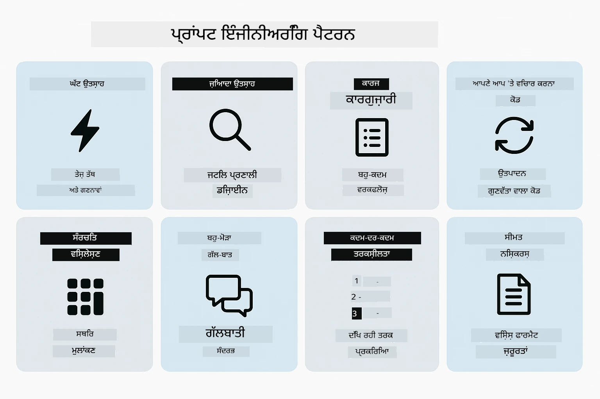
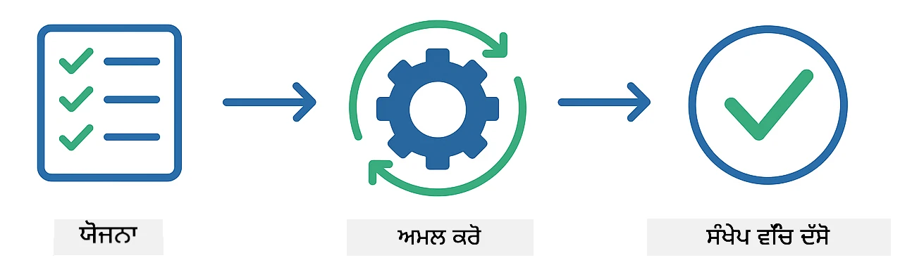
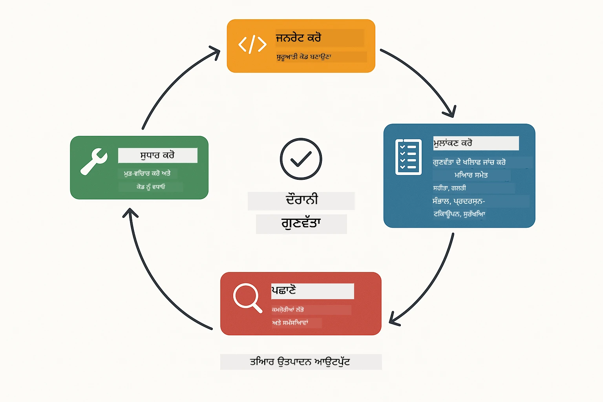
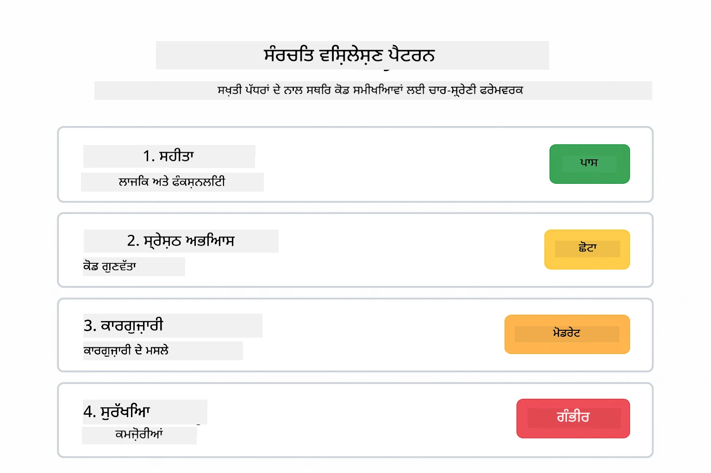
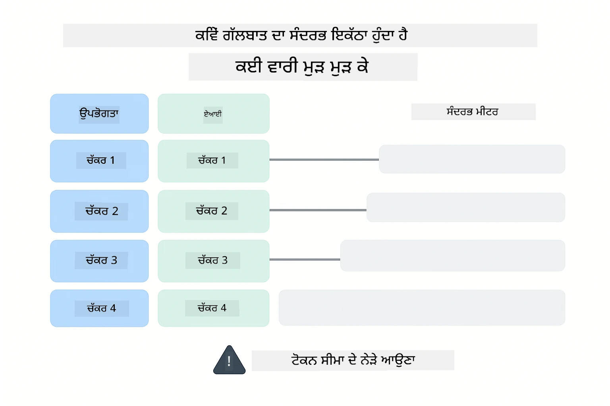
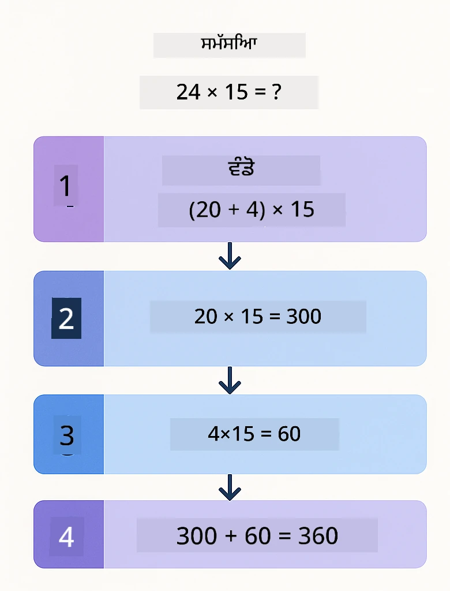
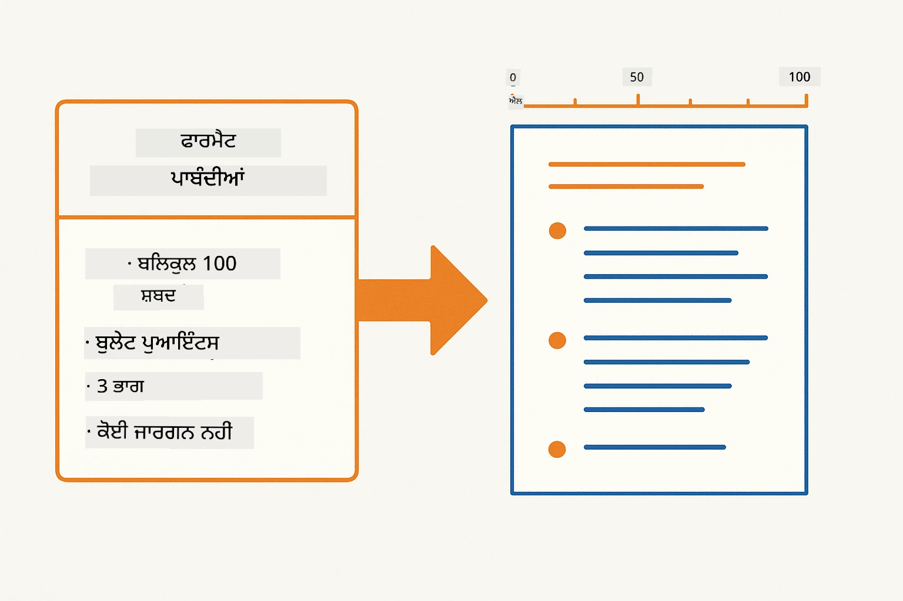
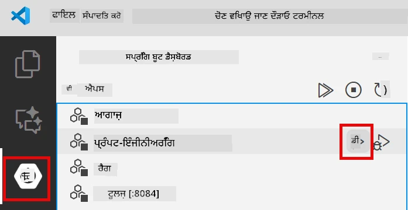
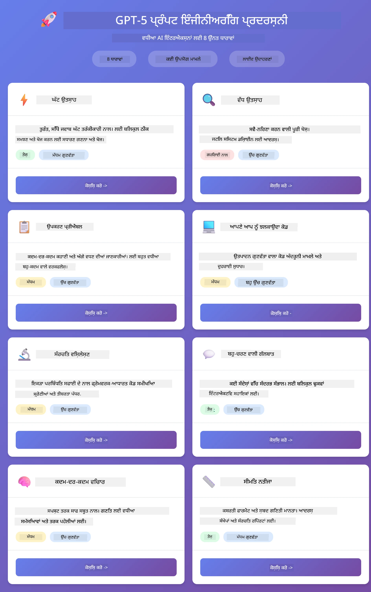
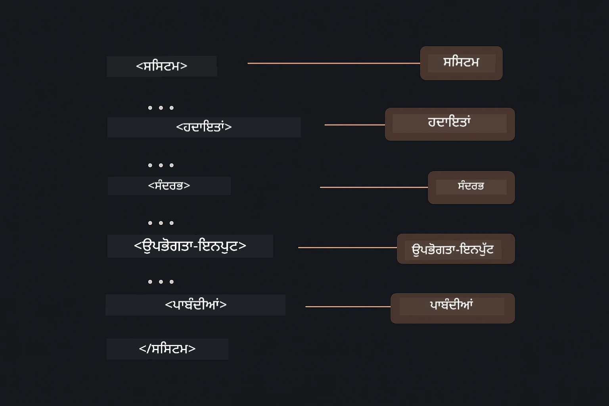

# ਮਾਡਿਊਲ 02: GPT-5.2 ਨਾਲ ਪ੍ਰਾਂਪਟ ਇੰਜੀਨੀਅਰਿੰਗ

## ਸਮੱਗਰੀ ਸੂਚੀ

- [ਵੀਡੀਓ ਵਾਕਥਰੂ](#ਵੀਡੀਓ-ਵਾਕਥਰੂ)
- [ਤੁਸੀਂ ਕੀ ਸਿੱਖੋਗੇ](#ਤੁਸੀਂ-ਕੀ-ਸਿੱਖੋਗੇ)
- [ਪূর্বਆਵਸ਼ਕਤਾਵਾਂ](#ਪੂਰਵਆਵਸ਼ਕਤਾਵਾਂ)
- [ਪ੍ਰਾਂਪਟ ਇੰਜੀਨੀਅਰਿੰਗ ਨੂੰ ਸਮਝਣਾ](#ਪ੍ਰਾਂਪਟ-ਇੰਜੀਨੀਅਰਿੰਗ-ਨੂੰ-ਸਮਝਣਾ)
- [ਪ੍ਰਾਂਪਟ ਇੰਜੀਨੀਅਰਿੰਗ ਮੁਢਲੇ ਤੱਤ](#ਪ੍ਰਾਂਪਟ-ਇੰਜੀਨੀਅਰਿੰਗ-ਮੁਢਲੇ-ਤੱਤ)
  - [ਜੀਰੋ-ਸ਼ਾਟ ਪ੍ਰਾਂਪਟਿੰਗ](#ਜੀਰੋ-ਸ਼ਾਟ-ਪ੍ਰਾਂਪਟਿੰਗ)
  - [ਫਿਊ-ਸ਼ਾਟ ਪ੍ਰਾਂਪਟਿੰਗ](#ਫਿਊ-ਸ਼ਾਟ-ਪ੍ਰਾਂਪਟਿੰਗ)
  - [ਚੇਨ ਆਫ ਥੌਟ](#ਚੇਨ-ਆਫ-ਥੌਟ)
  - [ਰੋਲ-ਆਧਾਰਿਤ ਪ੍ਰਾਂਪਟਿੰਗ](#ਰੋਲ-ਆਧਾਰਿਤ-ਪ੍ਰਾਂਪਟਿੰਗ)
  - [ਪ੍ਰਾਂਪਟ ਟੈਮਪਲੇਟਸ](#ਪ੍ਰਾਂਪਟ-ਟੈਮਪਲੇਟਸ)
- [ਅਡਵਾਂਸ ਪੈਟਰਨਸ](#ਅਡਵਾਂਸ-ਪੈਟਰਨਸ)
- [ਐਪਲਿਕੇਸ਼ਨ ਚਲਾਓ](#ਐਪਲੀਕੇਸ਼ਨ-ਚਲਾਓ)
- [ਐਪਲਿਕੇਸ਼ਨ ਸਕ੍ਰੀਨਸ਼ਾਟ](#ਐਪਲੀਕੇਸ਼ਨ-ਸਕ੍ਰੀਨਸ਼ਾਟ)
- [ਪੈਟਰਨਸ ਦੀ ਖੋਜ](#ਪੈਟਰਨਾਂ-ਦੀ-ਖੋਜ)
  - [ਘੱਟ ਵਰਗੇ ਬਨਾਮ ਉੱਚ ਵਰਗੇ ਉਤਸ਼ਾਹ](#ਘੱਟ-ਅਤੇ-ਜ਼ਿਆਦਾ-ਉਤਸ਼ਾਹ)
  - [ਕੰਮ ਦੀ ਕਾਰਗੁਜ਼ਾਰੀ (ਟੂਲ ਪ੍ਰੀਐਂਬਲ)](#ਟਾਸਕ-ਐਗਜ਼ਿਕਿਊਸ਼ਨ-ਟੂਲ-ਪ੍ਰੀਐਮਬਲ)
  - [ਆਪਣੇ ਆਪ 'ਤੇ ਵਿਚਾਰ ਕਰਨ ਵਾਲਾ ਕੋਡ](#ਸੈਲਫ-ਰਿਫਲੈਕਟਿੰਗ-ਕੋਡ)
  - [ਸੰਰਚਿਤ ਵਿਸ਼ਲੇਸ਼ਣ](#ਸੰਰਚਿਤ-ਵਿਸ਼ਲੇਸ਼ਣ)
  - [ਮਲਟੀ-ਟਰਨ ਚੈਟ](#ਮਲਟੀ-ਟਰਨ-ਚੈਟ)
  - [ਕਦਮ-ਦਰ-ਕਦਮ ਤਰਕ](#ਕਦਮ-ਦਰ-কਦਮ-ਤਰਕਸ਼ੀਲਤਾ)
  - [ਸੀਮਿਤ ਆਉਟਪੁੱਟ](#ਸੀਮਿਤ-ਆਉਟਪੁੱਟ)
- [ਤੁਸੀਂ ਅਸਲ ਵਿੱਚ ਕੀ ਸਿੱਖ ਰਹੇ ਹੋ](#ਤੁਸੀਂ-ਅਸਲ-ਵਿੱਚ-ਕੀ-ਸਿੱਖ-ਰਹੇ-ਹੋ)
- [ਅਗਲੇ ਕਦਮ](#ਅਗਲੇ-ਕਦਮ)

## ਵੀਡੀਓ ਵਾਕਥਰੂ

ਇਸ ਲਾਈਵ ਸੈਸ਼ਨ ਨੂੰ ਦੇਖੋ ਜੋ ਦੱਸਦਾ ਹੈ ਕਿ ਇਸ ਮਾਡਿਊਲ ਨਾਲ ਕਿਸ ਤਰ੍ਹਾਂ ਸ਼ੁਰੂਆਤ ਕਰਨੀ ਹੈ:

<a href="https://www.youtube.com/live/PJ6aBaE6bog?si=LDshyBrTRodP-wke"></a>

## ਤੁਸੀਂ ਕੀ ਸਿੱਖੋਗੇ

ਹੇਠਾਂ ਦਿੱਤਾ ਗ੍ਰਾਫਿਕ ਇਸ ਮਾਡਿਊਲ ਵਿੱਚ ਵਿਕਸਿਤ ਕਰਨ ਵਾਲੇ ਮੁੱਖ ਵਿਸ਼ਿਆਂ ਅਤੇ ਹੁਨਰਾਂ ਦਾ ਸੰਖੇਪ ਦਿੰਦਾ ਹੈ — ਪ੍ਰਾਂਪਟ ਸੁਧਾਰ ਤਕਨੀਆਂ ਤੋਂ ਲੈ ਕੇ ਕਦਮ-ਦਰ-ਕਦਮ ਕਾਰਜ ਪ੍ਰਵਾਹ ਤੱਕ ਜੋ ਤੁਸੀਂ ਅਨੁਸਰਣ ਕਰੋਗੇ।


ਪਿਛਲੇ ਮਾਡਿਊਲ ਵਿੱਚ, ਤੁਸੀਂ ਵੇਖਿਆ ਕਿ ਕਿਵੇਂ ਮੈਮਰੀ Azure OpenAI ਨਾਲ ਸੰਵਾਦਾਤਮਕ AI ਨੂੰ ਯੋਗ ਬਣਾਉਂਦੀ ਹੈ। ਹੁਣ ਅਸੀਂ ਧਿਆਨ ਦੇਵਾਂਗੇ ਕਿ ਤੁਸੀਂ ਪ੍ਰਸ਼ਨ ਕਿਵੇਂ ਪੁੱਛਦੇ ਹੋ — ਖੁਦ ਪ੍ਰਾਂਪਟ — Azure OpenAI ਦੇ GPT-5.2 ਦੀ ਵਰਤੋਂ ਕਰਦੇ ਹੋਏ। ਤੁਸੀਂ ਆਪਣੇ ਪ੍ਰਾਂਪਟ ਕਿਸ ਤਰ੍ਹਾਂ ਬਣਾਓਗੇ ਇਸ ਨਾਲ ਤੁਹਾਨੂੰ ਮਿਲਣ ਵਾਲੇ ਜਵਾਬਾਂ ਦੀ ਗੁਣਵੱਤਾ ਵੱਡਾ ਪ੍ਰਭਾਵਿਤ ਹੁੰਦੀ ਹੈ। ਅਸੀਂ ਬੁਨਿਆਦੀ ਪ੍ਰਾਂਪਟ ਤਕਨੀਆਂ ਦੀ ਸਮੀਖਿਆ ਨਾਲ ਸ਼ੁਰੂ ਕਰਦੇ ਹਾਂ, ਫਿਰ ਐਠ ਅਡਵਾਂਸ ਪੈਟਰਨਾਂ ਵਿੱਚ ਜਾਣਕਾਰੀ ਕਰਦੇ ਹਾਂ ਜੋ GPT-5.2 ਦੀਆਂ ਸਮਰੱਥਾਵਾਂ ਦਾ ਪੂਰਾ ਲਾਭ ਲੈਂਦੇ ਹਨ।

ਅਸੀਂ GPT-5.2 ਦੀ ਵਰਤੋਂ ਕਰਾਂਗੇ ਕਿਉਂਕਿ ਇਹ ਤਰਕ ਨੂੰ ਨਿਯੰਤਰਿਤ ਕਰਨ ਦੀ ਸ਼ਕਤੀ ਲਿਆਉਂਦਾ ਹੈ - ਤੁਸੀਂ ਮਾਡਲ ਨੂੰ ਦੱਸ ਸਕਦੇ ਹੋ ਕਿ ਜਵਾਬ ਦੇਣ ਤੋਂ ਪਹਿਲਾਂ ਕਿੰਨੀ ਸੋਚਣੀ ਹੈ। ਇਸ ਨਾਲ ਵੱਖ-ਵੱਖ ਪ੍ਰਾਂਪਟਿੰਗ ਤਰੀਕੇ ਵੱਧ ਸਰਲਤਾ ਨਾਲ ਸਮਝ ਆਉਂਦੇ ਹਨ ਅਤੇ ਤੁਸੀਂ ਜਾਣ ਸਕਦੇ ਹੋ ਕਿ ਕਿਸ ਵੇਲੇ ਕਿਹੜੀ ਤਕਨੀਕ ਵਰਤਣੀ ਹੈ।

## ਪੂਰਵਆਵਸ਼ਕਤਾਵਾਂ

- ਮਾਡਿਊਲ 01 ਪੂਰਾ ਕੀਤਾ ਹੋਇਆ (Azure OpenAI ਸਰੋਤ ਤਿਆਰ ਕੀਤੇ ਹੋਏ)
- `.env` ਫਾਈਲ ਰੂਟ ਡਾਇਰੈਕਟਰੀ ਵਿੱਚ Azure ਪ੍ਰਮਾਣਿਕਤਾ ਸਮੇਤ (ਮਾਡਿਊਲ 01 ਵਿੱਚ `azd up` ਦੁਆਰਾ ਬਣਾਈ ਗਈ)

> **ਨੋਟ:** ਜੇ ਤੁਸੀਂ ਮਾਡਿਊਲ 01 ਪੂਰਾ ਨਹੀਂ ਕੀਤਾ, ਤਾਂ ਪਹਿਲਾਂ ਉੱਥੇ ਦਿੱਤੇ ਡਿਪਲੋਇਮੈਂਟ ਨਿਰਦੇਸ਼ਾਂ ਦੀ ਪਾਲਣਾ ਕਰੋ।

## ਪ੍ਰਾਂਪਟ ਇੰਜੀਨੀਅਰਿੰਗ ਨੂੰ ਸਮਝਣਾ

ਮੂਲ ਰੂਪ ਵਿੱਚ, ਪ੍ਰਾਂਪਟ ਇੰਜੀਨੀਅਰਿੰਗ ਗੁੰਝਲਦਾਰ ਹਦਾਇਤਾਂ ਅਤੇ ਸਪਸ਼ਟ ਹਦਾਇਤਾਂ ਵਿੱਚ ਫਰਕ ਹੈ, ਜਿਵੇਂ ਹੇਠਾਂ ਦਿੱਤੀ ਤੁਲਨਾ ਦਰਸਾਉਂਦੀ ਹੈ।


ਪ੍ਰਾਂਪਟ ਇੰਜੀਨੀਅਰਿੰਗ ਇੰਪੁਟ ਟੈਕਸਟ ਡਿਜ਼ਾਈਨ ਕਰਨਾ ਹੈ ਜੋ ਲਗਾਤਾਰ ਤੁਸੀਂ ਚਾਹੁੰਦੇ ਨਤੀਜੇ ਦਿੰਦਾ ਹੈ। ਇਹ ਸਿਰਫ਼ ਪ੍ਰਸ਼ਨ ਪੁੱਛਣ ਦੇ ਬਾਰੇ ਨਹੀਂ ਹੈ - ਇਹ ਬੇਨਤੀ ਇਸ ਤਰ੍ਹਾਂ ਬਣਾਉਣ ਦੇ ਬਾਰੇ ਹੈ ਕਿ ਮਾਡਲ ਪੂਰੀ ਤਰ੍ਹਾਂ ਸਮਝੇ ਕਿ ਤੁਸੀਂ ਕੀ ਚਾਹੁੰਦੇ ਹੋ ਅਤੇ ਕਿਵੇਂ ਦਿੱਤਾ ਜਾਵੇ।

ਇਸਨੂੰ ਕਾਲੀਗ ਨੂੰ ਹਦਾਇਤ ਦੇਣ ਵਾਂਗ ਸੋਚੋ। "ਬਗ ਠੀਕ ਕਰੋ" ਧੁੰਦਲੀ ਗੱਲ ਹੈ। "UserService.java ਦੀ ਲਾਈਨ 45 'ਚ ਨੱਲ ਪੌਇੰਟਰ ਇ਼ਕਸੈਪਸ਼ਨ ਨੂੰ ਨੱਲ ਚੈਕ ਨਾਲ ਠੀਕ ਕਰੋ" ਵਿਸ਼ੇਸ਼ ਤੌਰ 'ਤੇ ਹੈ। ਭਾਸ਼ਾ ਮਾਡਲ ਭੀ ਉਸੇ ਤਰ੍ਹਾਂ ਕੰਮ ਕਰਦੇ ਹਨ — ਵਿਸ਼ੇਸ਼ਤਾ ਅਤੇ ਬਣਤਰ ਮਹੱਤਵਪੂਰਨ ਹਨ।

ਹੇਠਾਂ ਦਿੱਤੀ ਗ੍ਰਾਫਿਕ ਦਰਸਾਉਂਦੀ ਹੈ ਕਿ LangChain4j ਇਸ ਤਸਵੀਰ ਵਿੱਚ ਕਿਵੇਂ ਫਿੱਟ ਹੁੰਦਾ ਹੈ — ਤੁਹਾਡੇ ਪ੍ਰਾਂਪਟ ਪੈਟਰਨਾਂ ਨੂੰ ਮਾਡਲ ਨਾਲ SystemMessage ਅਤੇ UserMessage ਬਣਤਰਾਂ ਰਾਹੀਂ ਜੋੜਦਾ ਹੈ।


LangChain4j ਢਾਂਚਾ ਪ੍ਰਦਾਨ ਕਰਦਾ ਹੈ — ਮਾਡਲ ਕਨੇਕਸ਼ਨ, ਮੈਮੋਰੀ, ਅਤੇ ਸੁਨੇਹੇ ਪ੍ਰਕਾਰ — ਜਦਕਿ ਪ੍ਰਾਂਪਟ ਪੈਟਰਨ ਸਿਰਫ ਕਾਨੂੰਨਬੱਧ ਟੈਕਸਟ ਹੁੰਦੇ ਹਨ ਜਿਸਨੂੰ ਤੁਸੀਂ ਉਸ ਢਾਂਚੇ ਰਾਹੀਂ ਭੇਜਦੇ ਹੋ। ਮੁੱਖ ਬਣਤਰਾਂ ਹਨ `SystemMessage` (ਜੋ AI ਦਾ ਵਿਹਾਰ ਅਤੇ ਭੂਮਿਕਾ ਸੈਟ ਕਰਦਾ ਹੈ) ਅਤੇ `UserMessage` (ਜੋ ਤੁਹਾਡੀ ਅਸਲ ਬੇਨਤੀ ਲੈ ਕੇ ਜਾਂਦਾ ਹੈ)।

## ਪ੍ਰਾਂਪਟ ਇੰਜੀਨੀਅਰਿੰਗ ਮੁਢਲੇ ਤੱਤ

ਹੇਠਾਂ ਦਿਖਾਈ ਪੰਜ ਮੁੱਖ ਤਕਨੀਆਂ ਪ੍ਰਭਾਵਸ਼ਾਲੀ ਪ੍ਰਾਂਪਟ ਇੰਜੀਨੀਅਰਿੰਗ ਦੀ ਬੁਨਿਆਦ ਬਣਾਉਂਦੀਆਂ ਹਨ। ਹਰ ਇੱਕ ਬੋਲਚਾਲ ਵਿੱਚ ਭਾਸ਼ਾ ਮਾਡਲ ਨਾਲ ਸੰਚਾਰ ਕਰਨ ਦੇ ਵੱਖਰੇ ਪਹਿਲੂ ਨੂੰ ਸੰਬੋਧਦਾ ਹੈ।


ਇਸ ਮਾਡਿਊਲ ਵਿੱਚ ਅਡਵਾਂਸ ਪੈਟਰਨਾਂ ਵਿੱਚ ਜਾਣ ਤੋਂ ਪਹਿਲਾਂ, ਆਓ ਪੰਜ ਬੁਨਿਆਦੀ ਪ੍ਰਾਂਪਟਿੰਗ ਤਕਨੀਆਂ ਦੀ ਸਮੀਖਿਆ ਕਰੀਏ। ਇਹ ਉਸ ਟੂਲਕਿਟ ਦੀਆਂ ਚਾਬੀਆਂ ਹਨ ਜਿਸ ਨੂੰ ਹਰ ਪ੍ਰਾਂਪਟ ਇੰਜੀਨੀਅਰ ਨੇ ਜਾਣਣਾ ਲਾਜ਼ਮੀ ਹੈ।

### ਜੀਰੋ-ਸ਼ਾਟ ਪ੍ਰਾਂਪਟਿੰਗ

ਸਰਲ ਤਰੀਕਾ: ਮਾਡਲ ਨੂੰ ਸਿੱਧੀ ਹੁਕਮ ਦਿਓ ਬਿਨਾਂ ਕਿਸੇ ਉਦਾਹਰਣ ਦੇ। ਮਾਡਲ ਆਪਣੇ ਟ੍ਰੇਨਿੰਗ ਤੇ ਹੀ ਨਿਰਭਰ ਕਰਦਾ ਹੈ ਕੰਮ ਨੂੰ ਸਮਝਣ ਅਤੇ ਅੰਜਾਮ ਦੇਣ ਲਈ। ਇਹ ਸਧਾਰਣ ਬੇਨਤੀਆਂ ਲਈ ਚੰਗਾ ਕੰਮ ਕਰਦਾ ਹੈ ਜਿੱਥੇ ਉਮੀਦ ਕੀਤੀ ਗਈ ਵਰਤੋਂ ਸਪਸ਼ਟ ਹੈ।


*ਕਿਸੇ ਉਦਾਹਰਣ ਤੋਂ ਬਿਨਾਂ ਸਿੱਧੀ ਹੁਕਮ — ਮਾਡਲ ਸਿਰਫ ਹੁਕਮ ਤੋਂ ਕੰਮ ਦੀ ਸੂਝ ਲੈਂਦਾ ਹੈ*

```java
String prompt = "Classify this sentiment: 'I absolutely loved the movie!'";
String response = model.chat(prompt);
// ਜਵਾਬ: "ਸਕਾਰਾਤਮਕ"
```

**ਕਦੋਂ ਵਰਤਣਾ ਹੈ:** ਸਰਲ ਵਰਗੀਕਰਨ, ਸਿੱਧੇ ਪ੍ਰਸ਼ਨ, ਅਨੁਵਾਦ, ਜਾਂ ਕੋਈ ਵੀ ਕੰਮ ਜਿਸਨੂੰ ਮਾਡਲ ਅਤਿਰਿਕਤ ਦਿਸ਼ਾ-ਨਿਰਦੇਸ਼ ਦੇ ਬਿਨਾਂ ਸੰਭਾਲ ਸਕਦਾ ਹੈ।

### ਫਿਊ-ਸ਼ਾਟ ਪ੍ਰਾਂਪਟਿੰਗ

ਉਦਾਹਰਣ ਦਿਓ ਜੋ ਮਾਡਲ ਨੂੰ ਉਹ ਪੈਟਰਨ ਦਿਖਾਉਂਦੇ ਹਨ ਜਿਸਨੂੰ ਉਹ ਮਾਡਲ ਅਨੁਸਰਣ ਕਰੇ। ਮਾਡਲ ਤੁਹਾਡੇ ਉਦਾਹਰਣਾਂ ਤੋਂ ਇਨਪੁਟ-ਆਉਟਪੁੱਟ ਫਾਰਮੈਟ ਸਿੱਖਦਾ ਹੈ ਅਤੇ ਨਵੇਂ ਇਨਪੁੱਟਾਂ ਤੇ ਪ੍ਰਭਾਵ ਸ਼ੁਰੂ ਕਰਦਾ ਹੈ। ਇਸ ਨਾਲ ਉਹ ਕੰਮ ਜਿੱਥੇ ਚਾਹੀਦਾ ਫਾਰਮੈਟ ਜਾਂ ਵਰਤੋਂ ਸਪਸ਼ਟ ਨਹੀਂ ਹੁੰਦਾ, ਉਨ੍ਹਾਂ ਵਿੱਚ ਲਗਾਤਾਰਤਾ ਵੱਧਦੀ ਹੈ।


*ਉਦਾਹਰਣਾਂ ਤੋਂ ਸਿੱਖਿਅਾ — ਮਾਡਲ ਪੈਟਰਨ ਪਛਾਣਦਾ ਹੈ ਅਤੇ ਨਵੀਆਂ ਐਂਪੁੱਟਾਂ 'ਤੇ ਲਾਗੂ ਕਰਦਾ ਹੈ*

```java
String prompt = """
    Classify the sentiment as positive, negative, or neutral.
    
    Examples:
    Text: "This product exceeded my expectations!" → Positive
    Text: "It's okay, nothing special." → Neutral
    Text: "Waste of money, very disappointed." → Negative
    
    Now classify this:
    Text: "Best purchase I've made all year!"
    """;
String response = model.chat(prompt);
```

**ਕਦੋਂ ਵਰਤਣਾ ਹੈ:** ਕਸਟਮ ਵਰਗੀਕਰਨ, ਲਗਾਤਾਰ ਫਾਰਮੈਟਿੰਗ, ਖੇਤਰ-ਨਿਰਧਾਰਿਤ ਕੰਮ, ਜਾਂ ਜਦੋਂ ਜੀਰੋ-ਸ਼ਾਟ ਨਤੀਜੇ ਅਸਪਸ਼ਟ ਜਾਂ ਅਸਥਿਰ ਹੁੰਦੇ ਹਨ।

### ਚੇਨ ਆਫ ਥੌਟ

ਮਾਡਲ ਨੂੰ ਕਦਮ-ਦਰ-ਕਦਮ ਆਪਣੀ ਤਰਕਸ਼ੀਲਤਾ ਦਿਖਾਉਣ ਲਈ ਕਹੋ। ਜਵਾਬ 'ਤੇ ਸਿੱਧਾ ਛਾਲ ਮਾਰਨ ਦੀ ਬਜਾਏ, ਮਾਡਲ ਸਮੱਸਿਆ ਨੂੰ ਟੁਕੜਿਆਂ ਵਿੱਚ ਵੰਡਦਾ ਹੈ ਅਤੇ ਹਰ ਹਿੱਸੇ 'ਤੇ ਖੁਲ ਕੇ ਕੰਮ ਕਰਦਾ ਹੈ। ਇਸ ਨਾਲ ਗਣਿਤ, ਤਰਕ, ਅਤੇ ਬਹੁ-ਕਦਮੀ ਤਰਕਸੰਗਤੀ ਵਾਲੇ ਕੰਮਾਂ ਵਿੱਚ ਸਹੀਤਾਵਾ ਵੱਧਦੀ ਹੈ।


*ਕਦਮ-ਦਰ-ਕਦਮ ਤਰਕ — ਜਟਿਲ ਮੁੱਦਿਆਂ ਨੂੰ ਖੁਲ ਕੇ ਲਾਜ਼ਮੀ ਕਦਮਾਂ ਵਿੱਚ ਵੰਡਨਾ*

```java
String prompt = """
    Problem: A store has 15 apples. They sell 8 apples and then 
    receive a shipment of 12 more apples. How many apples do they have now?
    
    Let's solve this step-by-step:
    """;
String response = model.chat(prompt);
// ਮਾਡਲ ਦਿਖਾਉਂਦਾ ਹੈ: 15 - 8 = 7, ਫਿਰ 7 + 12 = 19 ਸੇਬ
```

**ਕਦੋਂ ਵਰਤਣਾ ਹੈ:** ਗਣਿਤ ਸਮੱਸਿਆਵਾਂ, ਤਰਕ ਦਿਲਚਸਪੀ ਦੇ ਮੁੱਦੇ, ਡੀਬੱਗਿੰਗ, ਜਾਂ ਕੋਈ ਵੀ ਕੰਮ ਜਿੱਥੇ ਤਰਕਸ਼ੀਲ ਪ੍ਰਕਿਰਿਆ ਦਰਸਾਉਣ ਨਾਲ ਸਹੀਤਾ ਅਤੇ ਭਰੋਸਾ ਵੱਧਦਾ ਹੈ।

### ਰੋਲ-ਆਧਾਰਿਤ ਪ੍ਰਾਂਪਟਿੰਗ

ਸਵਾਲ ਪੁੱਛਣ ਤੋਂ ਪਹਿਲਾਂ AI ਲਈ ਕੋਈ ਭੂਮਿਕਾ ਜਾਂ ਪਹਚਾਨ ਸੈਟ ਕਰੋ। ਇਹ ਸੰਦਰਭ ਮੁਹੱਈਆ ਕਰਵਾਉਂਦਾ ਹੈ ਜੋ ਜਵਾਬ ਦੇ ਅੰਦਾਜ਼, ਗਹਿਰਾਈ ਅਤੇ ਧਿਆਨ ਨੂੰ ਧਾਰਿਤ ਕਰਦਾ ਹੈ। "ਸੋਫਟਵੇਅਰ ਆਰਕੀਟੈਕਟ" "ਜੂਨੀਅਰ ਡਿਵੈਲਪਰ" ਜਾਂ "ਸੁਰੱਖਿਆ ਆਡੀਟਰ" ਨਾਲੋਂ ਵੱਖਰਾ ਸਲਾਹ ਦਿੰਦਾ ਹੈ।


*ਸੰਦਰਭ ਅਤੇ ਭੂਮਿਕਾ ਸੈਟ ਕਰਨਾ — ਇੱਕੋ ਸਵਾਲ ਨੂੰ ਸੌਂਪੀ ਗਈ ਭੂਮਿਕਾ ਦੇ ਅਨੁਸਾਰ ਵੱਖਰਾ ਜਵਾਬ ਮਿਲਦਾ ਹੈ*

```java
String prompt = """
    You are an experienced software architect reviewing code.
    Provide a brief code review for this function:
    
    def calculate_total(items):
        total = 0
        for item in items:
            total = total + item['price']
        return total
    """;
String response = model.chat(prompt);
```

**ਕਦੋਂ ਵਰਤਣਾ ਹੈ:** ਕੋਡ ਸਮੀਖਿਆ, ਟਿਊਟੋਰਿੰਗ, ਖੇਤਰ-ਵਿਸ਼ਲੇਸ਼ਣ, ਜਾਂ ਜਦੋਂ ਤੁਹਾਨੂੰ ਕਿਸੇ ਮਾਹਿਰ ਦਰਜੇ ਜਾਂ ਦ੍ਰਿਸ਼ਟੀਕੋਣ ਲਈ ਟੇਲਰ ਕੀਤੇ ਜਵਾਬ ਚਾਹੀਦੇ ਹਨ।

### ਪ੍ਰਾਂਪਟ ਟੈਮਪਲੇਟਸ

ਵੈਰੀਏਬਲ ਪਲੇਸਹੋਲਡਰਾਂ ਨਾਲ ਮੁੜ-ਵਰਤੋਂ ਯੋਗ ਪ੍ਰਾਂਪਟ ਬਣਾਓ। ਹਰ ਵਾਰੀ ਨਵਾਂ ਪ੍ਰਾਂਪਟ ਲਿਖਣ ਦੀ ਬਜਾਏ ਇੱਕ ਵਾਰੀ ਟੈਮਪਲੇਟ ਬਣਾਓ ਅਤੇ ਵੱਖਰੇ ਮੁੱਲ ਭਰੋ। LangChain4j ਦੀ `PromptTemplate` ਕਲਾਸ {{variable}} ਵੱਲੇ ਸਿੰਟੈਕਸ ਨਾਲ ਇਹ ਸੌਖਾ ਕਰਦੀ ਹੈ।


*ਵੈਰੀਏਬਲ ਪਲੇਸਹੋਲਡਰਾਂ ਵਾਲੇ ਮੁੜ-ਵਰਤੋਂ ਯੋਗ ਪ੍ਰਾਂਪਟ — ਇੱਕ ਹੀ ਟੈਮਪਲੇਟ, ਕਈ ਵਰਤੋਂਵਾਂ*

```java
PromptTemplate template = PromptTemplate.from(
    "What's the best time to visit {{destination}} for {{activity}}?"
);

Prompt prompt = template.apply(Map.of(
    "destination", "Paris",
    "activity", "sightseeing"
));

String response = model.chat(prompt.text());
```

**ਕਦੋਂ ਵਰਤਣਾ ਹੈ:** ਵੱਖਰੇ ਇਨਪੁੱਟਾਂ ਨਾਲ ਦੁਹਰਾਏ ਜਾਣ ਵਾਲੇ ਪ੍ਰਸ਼ਨਾਂ ਲਈ, ਬੈਚ ਪ੍ਰੋਸੈਸਿੰਗ, ਮੁੜ ਵਰਤੋਂਯੋਗ AI ਵਰਕਫਲੋਜ਼ ਬਣਾਉਣ ਲਈ, ਜਾਂ ਕੋਈ ਵੀ ਸਥਿਤੀ ਜਿੱਥੇ ਪ੍ਰਾਂਪਟ ਸਟ੍ਰਕਚਰ ਇਕੋ ਜਿਹਾ ਰਹਿੰਦਾ ਪਰ ਡੇਟਾ ਵੱਧਦਾ-ਘਟਦਾ ਹੈ।

---

ਇਹ ਪੰਜ ਮੁਢਲੇ ਤੱਤ ਤੁਹਾਨੂੰ ਅਕਸਰ ਪ੍ਰਾਂਪਟਿੰਗ ਕੰਮਾਂ ਲਈ ਦ੍ਰਿੜ ਟੂਲਕਿਟ ਦੇਂਦੇ ਹਨ। ਇਸ ਮਾਡਿਊਲ ਦਾ ਬਾਕੀ ਹਿਸਾ GPT-5.2 ਦੀ ਤਰਕ ਨਿਯੰਤਰਣ, ਸਵੈ-ਮੁਲਾਂਕਣ ਅਤੇ ਸੰਰਚਿਤ ਆਉਟਪੁੱਟ ਸਮਰੱਥਾਵਾਂ ਨਾਲ ਲੈਵਰੇਜ ਕਰਨ ਵਾਲੇ **ਅੱਠ ਅਡਵਾਂਸ ਪੈਟਰਨਾਂ** ਤੇ ਕਰਦਾ ਹੈ।

## ਅਡਵਾਂਸ ਪੈਟਰਨਸ

ਮੁਢਲੇ ਤੱਤ ਕਵਰ ਹੋ ਗਏ ਹਨ, ਹੁਣ ਅਸੀਂ ਕੁਝ ਨਾ ਜੁੜੇ ਅੱਠ ਅਡਵਾਂਸ ਪੈਟਰਨਾਂ ਵਿੱਚ ਜਾਵਾਂਗੇ ਜੋ ਇਸ ਮਾਡਿਊਲ ਨੂੰ ਵਿਸ਼ੇਸ਼ ਬਣਾਉਂਦੇ ਹਨ। ਸਾਰੇ ਸਮੱਸਿਆਵਾਂ ਲਈ ਇੱਕੋ ਤਰੀਕਾ ਜ਼ਰੂਰੀ ਨਹੀਂ। ਕੁਝ ਪ੍ਰਸ਼ਨਾਂ ਲਈ ਤੇਜ਼ ਜਵਾਬ ਚਾਹੀਦਾ ਹੈ, ਕੁਝ ਲਈ ਗਹਿਰਾਈ ਨਾਲ ਸੋਚ। ਕੁਝ ਲਈ ਤਰਕ ਸਪਸ਼ਟ ਹੋਣੀ ਚਾਹੀਦੀ ਹੈ, ਕੁਝ ਲਈ ਸਿਰਫ ਨਤੀਜੇ ਚਾਹੀਦੇ ਹਨ। ਹੇਠਾਂ ਹਰ ਪੈਟਰਨ ਵੱਖਰੇ ਸਥਿਤੀ ਲਈ ਸੁਚੱਜਾ ਕੀਤਾ ਗਿਆ ਹੈ — ਅਤੇ GPT-5.2 ਦਾ ਤਰਕ ਨਿਯੰਤਰਣ ਇਹ ਫਰਕ ਹੋਰ ਸਪਸ਼ਟ ਕਰਦਾ ਹੈ।



*ਅੱਠ ਪ੍ਰਾਂਪਟ ਇੰਜੀਨੀਅਰਿੰਗ ਪੈਟਰਨਾਂ ਅਤੇ ਉਹਨਾਂ ਦੇ ਵਰਤੋਂ ਦੇ ਕੇਸਾਂ ਦਾ ਸਾਰਾਂਸ਼*

GPT-5.2 ਇਨ੍ਹਾਂ ਪੈਟਰਨਾਂ ਵਿੱਚ ਹੋਰ ਇੱਕ ਪਰਤ ਸ਼ਾਮਲ ਕਰਦਾ ਹੈ: *ਤਰਕ ਨਿਯੰਤਰਣ*। ਹੇਠਾਂ ਦਿਤਾ ਸਲਾਈਡਰ ਦਿਖਾਉਂਦਾ ਹੈ ਕਿ ਅਸੀਂ ਮਾਡਲ ਦੀ ਸੋਚ ਵਾਲੀ ਮਿਹਨਤ ਕਿਵੇਂ ਸੈਟ ਕਰ ਸਕਦੇ ਹਾਂ — ਤੇਜ਼, ਸਿੱਧਾ ਜਵਾਬ ਤੋਂ ਲੈ ਕੇ ਗਹਿਰਾਈ ਨਾਲ ਵਿਸ਼ਲੇਸ਼ਣ ਤੱਕ।


*GPT-5.2 ਦਾ ਤਰਕ ਨਿਯੰਤਰਣ ਤੁਹਾਨੂੰ ਦੱਸਣ ਦਿੰਦਾ ਹੈ ਕਿ ਮਾਡਲ ਕਿੰਨੀ ਸੋਚਣਾ ਚਾਹੀਦਾ ਹੈ — ਤੇਜ਼ ਸਿੱਧੇ ਜਵਾਬ ਤੋਂ ਲੈ ਕੇ ਗਹਿਰੇ ਅਨੁਸੰਧਾਨ ਤੱਕ*

**ਘੱਟ ਉਤਸ਼ਾਹ (ਤੇਜ਼ ਅਤੇ ਕੇਂਦਰਿਤ)** - ਸਧਾਰਣ ਸਵਾਲਾਂ ਲਈ ਜਿੱਥੇ ਤੁਸੀਂ ਤੇਜ਼ ਅਤੇ ਸਿੱਧੇ ਜਵਾਬ ਚਾਹੁੰਦੇ ਹੋ। ਮਾਡਲ ਘੱਟ ਤਰਕ ਕਰਦਾ ਹੈ - ਵੱਧ ਤੋਂ ਵੱਧ 2 ਕਦਮ। ਗਣਨਾ, ਲੁੱਕਅੱਪ, ਜਾਂ ਸਧਾਰਣ ਸਵਾਲਾਂ ਲਈ ਵਰਤੋਂ ਕਰੋ।

```java
String prompt = """
    <context_gathering>
    - Search depth: very low
    - Bias strongly towards providing a correct answer as quickly as possible
    - Usually, this means an absolute maximum of 2 reasoning steps
    - If you think you need more time, state what you know and what's uncertain
    </context_gathering>
    
    Problem: What is 15% of 200?
    
    Provide your answer:
    """;

String response = chatModel.chat(prompt);
```

> 💡 **GitHub Copilot ਨਾਲ ਖੋਜ ਕਰੋ:** [`Gpt5PromptService.java`](../../../02-prompt-engineering/src/main/java/com/example/langchain4j/prompts/service/Gpt5PromptService.java) ਖੋਲ੍ਹੋ ਅਤੇ ਪੁੱਛੋ:
> - "ਘੱਟ ਉਤਸ਼ਾਹ ਅਤੇ ਉੱਚ ਉਤਸ਼ਾਹ ਪ੍ਰਾਂਪਟਿੰਗ ਪੈਟਰਨਾਂ ਵਿੱਚ ਕੀ ਫਰਕ ਹੈ?"
> - "ਪ੍ਰਾਂਪਟਾਂ ਵਿੱਚ XML ਟੈਗ AI ਦੇ ਜਵਾਬ ਨੂੰ ਕਿਵੇਂ ਬਣਾਉਂਦੇ ਹਨ?"
> - "ਮੈਂ ਸਵੈ-ਚਿੰਤਨ ਵਾਲੇ ਪੈਟਰਨ ਕਿਵੇਂ ਅਤੇ ਕਦੋਂ ਵਰਤਾਂ ਬਨਾਮ ਸਿੱਧੇ ਹੁਕਮ?"

**ਉੱਚ ਉਤਸ਼ਾਹ (ਗਹਿਰਾਈ ਨਾਲ ਅਤੇ ਵਿਸਥਾਰ ਵਿੱਚ)** - ਜਟਿਲ ਸਮੱਸਿਆਵਾਂ ਲਈ ਜਿੱਥੇ ਤੁਸੀਂ ਵਿਸਥਾਰਪੂਰਵਕ ਵਿਸ਼ਲੇਸ਼ਣ ਚਾਹੁੰਦੇ ਹੋ। ਮਾਡਲ ਗਭੀਰਤਾ ਨਾਲ ਪ੍ਰਗਟਾਊਂਦਾ ਹੈ ਅਤੇ ਵਿਸ਼ਤਰੀਤ ਤਰਕ ਦਿਖਾਉਂਦਾ ਹੈ। ਸਿਸਟਮ ਡਿਜ਼ਾਈਨ, ਆਰਕੀਟੈਕਚਰ ਫੈਸਲੇ, ਜਾਂ ਗੁੰਝਲਦਾਰ ਖੋਜਾਂ ਲਈ ਵਰਤੋਂ ਕਰੋ।

```java
String prompt = """
    Analyze this problem thoroughly and provide a comprehensive solution.
    Consider multiple approaches, trade-offs, and important details.
    Show your analysis and reasoning in your response.
    
    Problem: Design a caching strategy for a high-traffic REST API.
    """;

String response = chatModel.chat(prompt);
```

**ਕੰਮ ਦੀ ਕਾਰਗੁਜ਼ਾਰੀ (ਕਦਮ-ਦਰ-ਕਦਮ ਪ੍ਰਗਟਾਊ)** - ਬਹੁ-ਕਦਮੀ ਕਾਰਜ ਪ੍ਰਕਿਰਿਆਵਾਂ ਲਈ। ਮਾਡਲ ਪਹਿਲਾਂ ਇੱਕ ਯੋਜਨਾ ਦਿੰਦਾ ਹੈ, ਹਰ ਕਦਮ ਨੂੰ ਕਹਾਣੀ ਵਾਂਗ ਕਵਰ ਕਰਦਾ ਹੈ, ਫਿਰ ਸੰਖੇਪ ਦਿੰਦਾ ਹੈ। ਮਾਈਗ੍ਰੇਸ਼ਨ, ਲਾਗੂ ਕਰਨ, ਜਾਂ ਕੋਈ ਵੀ ਬਹੁ-ਕਦਮੀ ਪ੍ਰਕਿਰਿਆ ਲਈ ਵਰਤੋਂ ਕਰੋ।

```java
String prompt = """
    <task_execution>
    1. First, briefly restate the user's goal in a friendly way
    
    2. Create a step-by-step plan:
       - List all steps needed
       - Identify potential challenges
       - Outline success criteria
    
    3. Execute each step:
       - Narrate what you're doing
       - Show progress clearly
       - Handle any issues that arise
    
    4. Summarize:
       - What was completed
       - Any important notes
       - Next steps if applicable
    </task_execution>
    
    <tool_preambles>
    - Always begin by rephrasing the user's goal clearly
    - Outline your plan before executing
    - Narrate each step as you go
    - Finish with a distinct summary
    </tool_preambles>
    
    Task: Create a REST endpoint for user registration
    
    Begin execution:
    """;

String response = chatModel.chat(prompt);
```

ਚੇਨ-ਆਫ-ਥੌਟ ਪ੍ਰਾਂਪਟਿੰਗ ਮਾਡਲ ਨੂੰ ਆਪਣੇ ਤਰਕ ਪ੍ਰਕਿਰਿਆ ਨੂੰ ਦਰਸਾਉਣ ਲਈ ਵੱਖਰੇ ਕਦਮਾਂ 'ਚ ਵਿਭਾਜਿਤ ਕਰਨ ਲਈ ਕਹਿੰਦੀ ਹੈ, ਜਿਸ ਨਾਲ ਜਟਿਲ ਕਾਰਜਾਂ ਵਿੱਚ ਸਹੀਤਾ ਵੱਧਦੀ ਹੈ। ਕਦਮ-ਦਰ-ਕਦਮ ਖੰਡਾਂ ਮਨੁੱਖਾਂ ਅਤੇ AI ਦੋਹਾਂ ਨੂੰ ਤਰਕ ਸਮਝਣ ਵਿੱਚ ਮਦਦ ਕਰਦੀਆਂ ਹਨ।

> **🤖 GitHub Copilot [ਚੈਟ](https://github.com/features/copilot) ਨਾਲ ਕੋਸ਼ਿਸ਼ ਕਰੋ:** ਇਸ ਪੈਟਰਨ ਬਾਰੇ ਪੁੱਛੋ:
> - "ਲੰਬੇ ਸਮੇ ਤਕ ਚੱਲ ਰਹੀਆਂ ਕਾਰਵਾਈਆਂ ਲਈ ਕਾਰਜ ਪ੍ਰਦਰਸ਼ਨ ਪੈਟਰਨ ਨੂੰ ਕਿਵੇਂ ਢਾਲਾਂ?"
> - "ਪ੍ਰੋਡਕਸ਼ਨ ਐਪਲੀਕੇਸ਼ਨਾਂ ਵਿੱਚ ਟੂਲ ਪ੍ਰੀਐਂਬਲਾਂ ਦੇ ਲਈ ਸੁਰੱਖਿਅਤ ਰੂਪ-ਰੇਖਾ ਕੀ ਹੈ?"
> - "UI ਵਿੱਚ ਮਧਿਆਨ ਤਰੱਕੀ ਅੱਪਡੇਟ ਕਿਵੇਂ ਕੈਪਚਰ ਅਤੇ ਦਿਖਾਈ ਜਾ ਸਕਦੀ ਹੈ?"

ਹੇਠਾਂ ਦਿੱਤੀ ਚਿੱਤਰਕਲਾ ਇਸ ਯੋਜਨਾ → ਅਮਲ → ਸੰਖੇਪ ਕਰਨ ਵਾਲੇ ਵਰਕਫਲੋ ਨੂੰ ਦਰਸਾਉਂਦੀ ਹੈ।



*ਬਹੁ-ਕਦਮੀ ਕਾਰਜਾਂ ਲਈ ਯੋਜਨਾ → ਅਮਲ → ਸੰਖੇਪ ਵਰਕਫਲੋ*

**ਆਪਣੇ ਆਪ 'ਤੇ ਵਿਚਾਰ ਕਰਨ ਵਾਲਾ ਕੋਡ** - ਉਤਪਾਦਨ-ਗੁਣਵੱਤਾ ਵਾਲਾ ਕੋਡ ਤਿਆਰ ਕਰਨ ਲਈ। ਮਾਡਲ ਉਤਪਾਦਨ ਮਿਆਰਾਂ ਅਨੁਸਾਰ ਕੋਡ ਤਿਆਰ ਕਰਦਾ ਹੈ ਜਿਸ ਵਿੱਚ ਸਹੀ ਤਰ੍ਹਾਂ ਲਈ ਏਰਰ ਹੈਂਡਲਿੰਗ ਵੀ ਹੁੰਦੀ ਹੈ। ਨਵੀ ਫੀਚਰ ਜਾਂ ਸੇਵਾਵਾਂ ਬਣਾਉਂਦੇ ਸਮੇਂ ਵਰਤੋਂ ਕਰੋ।

```java
String prompt = """
    Generate Java code with production-quality standards: Create an email validation service
    Keep it simple and include basic error handling.
    """;

String response = chatModel.chat(prompt);
```

ਹੇਠਾਂ ਦਿੱਤਾ ਚਿੱਤਰ ਇਸ ਦੁਹਰਾਏ ਜਾਂਦੇ ਸੁਧਾਰ ਚੱਕਰ ਨੂੰ ਦਿਖਾਉਂਦਾ ਹੈ — ਤਿਆਰ ਕਰੋ, ਮੂਲਾਂਕਣ ਕਰੋ, ਕਮਜ਼ੋਰੀਆਂ ਪਛਾਣੋ ਅਤੇ ਮਿਆਰਾਂ ਵਧਾਉਂਦੇ ਜਾਓ ਜਦ ਤੱਕ ਕੋਡ ਉਤਪਾਦਨ ਮਿਆਰਾਂ 'ਤੇ ਖਰਾ ਨਾ ਉਤਰ ਜਾਏ।



*ਦੁਹਰਾਉਂਦਾ ਸੁਧਾਰ ਚੱਕਰ - ਤਿਆਰ ਕਰੋ, ਅੰਕੜਾ ਲਗਾਓ, ਮੁੱਦੇ ਪਛਾਣੋ, ਸੁਧਾਰੋ, ਦੁਹਰਾਓ*

**ਸੰਰਚਿਤ ਵਿਸ਼ਲੇਸ਼ਣ** - ਲਗਾਤਾਰ ਮੁਲਾਂਕਣ ਲਈ। ਮਾਡਲ ਕੋਡ ਦਾ ਸਮੀਖਿਆ ਕਰਦਾ ਹੈ ਇੱਕ ਫਿਕਸਡ ਫਰੇਮਵਰਕ ਨਾਲ (ਸਹੀਤਾ, ਅਮਲ, ਕਾਰਗੁਜ਼ਾਰੀ, ਸੁਰੱਖਿਆ, ਸਮਭਾਲਯੋਗਤਾ)। ਕੋਡ ਸਮੀਖਿਆ ਜਾਂ ਗੁਣਵੱਤਾ ਮੂਲਾਂਕਣ ਲਈ ਵਰਤੋ।

```java
String prompt = """
    <analysis_framework>
    You are an expert code reviewer. Analyze the code for:
    
    1. Correctness
       - Does it work as intended?
       - Are there logical errors?
    
    2. Best Practices
       - Follows language conventions?
       - Appropriate design patterns?
    
    3. Performance
       - Any inefficiencies?
       - Scalability concerns?
    
    4. Security
       - Potential vulnerabilities?
       - Input validation?
    
    5. Maintainability
       - Code clarity?
       - Documentation?
    
    <output_format>
    Provide your analysis in this structure:
    - Summary: One-sentence overall assessment
    - Strengths: 2-3 positive points
    - Issues: List any problems found with severity (High/Medium/Low)
    - Recommendations: Specific improvements
    </output_format>
    </analysis_framework>
    
    Code to analyze:
    ```
    public List getUsers() {
        return database.query("SELECT * FROM users");
    }
    ```
    Provide your structured analysis:
    """;

String response = chatModel.chat(prompt);
```

> **🤖 GitHub Copilot [ਚੈਟ](https://github.com/features/copilot) ਨਾਲ ਕੋਸ਼ਿਸ਼ ਕਰੋ:** ਸੰਰਚਿਤ ਵਿਸ਼ਲੇਸ਼ਣ ਬਾਰੇ ਪੁੱਛੋ:
> - "ਵੱਖ-ਵੱਖ ਕਿਸਮਾਂ ਦੀਆਂ ਕੋਡ ਸਮੀਖਿਆਵਾਂ ਲਈ ਵਿਸ਼ਲੇਸ਼ਣ ਫਰੇਮਵਰਕ ਕਿਵੇਂ ਕਸਟਮਾਈਜ਼ ਕਰਾਂ?"
> - "ਸੰਰਚਿਤ ਆਉਟਪੁੱਟ ਨੂੰ ਪ੍ਰੋਗਰਾਮੈਟਿਕ ਤਰੀਕੇ ਨਾਲ ਕਿਵੇਂ ਪਾਰਸ ਅਤੇ ਕਾਰਵਾਈ ਕਰਾਂ?"
> - "ਲਗਾਤਾਰ ਸਮੀਖਿਆ ਸੈਸ਼ਨਾਂ ਦੌਰਾਨ ਸਖ਼ਤੀ ਦੀ ਸਤਰ ਕਿਵੇਂ ਯਕੀਨੀ ਬਣਾਈ ਜਾ ਸਕਦੀ ਹੈ?"

ਹੇਠਾਂ ਦਿੱਤਾ ਗ੍ਰਾਫਿਕ ਦਿਖਾਉਂਦਾ ਹੈ ਕਿ ਇਹ ਫਰੇਮਵਰਕ ਕਿਵੇਂ ਇੱਕ ਕੋਡ ਸਮੀਖਿਆ ਨੂੰ ਲਗਾਤਾਰ ਸ਼੍ਰੇਣੀਆਂ ਅਤੇ ਸਖ਼ਤੀ ਸਤਰਾਂ ਵਿੱਚ ਵੰਡਦਾ ਹੈ।



*ਲਗਾਤਾਰ ਕੋਡ ਸਮੀਖਿਆਆਂ ਲਈ ਫਰੇਮਵਰਕ ਸਖ਼ਤੀ ਸਤਰਾਂ ਸਹਿਤ*

**ਮਲਟੀ-ਟਰਨ ਚੈਟ** - ਗੱਲਬਾਤਾਂ ਲਈ ਜੋ ਸੰਦਰਭ ਦੀ ਲੋੜ ਰੱਖਦੀਆਂ ਹਨ। ਮਾਡਲ ਪਹਿਲਾਂ ਦੇ ਸੁਨੇਹਿਆਂ ਨੂੰ ਯਾਦ ਰੱਖਦਾ ਹੈ ਅਤੇ ਉਹਨਾਂ 'ਤੇ ਬਣਦਾ ਹੈ। ਇੰਟਰਐਕਟਿਵ ਸਹਾਇਤਾ ਸੈਸ਼ਨਾਂ ਜਾਂ ਜਟਿਲ ਸਵਾਲ-ਜਵਾਬ ਲਈ ਵਰਤੋਂ ਕਰੋ।

```java
ChatMemory memory = MessageWindowChatMemory.withMaxMessages(10);

memory.add(UserMessage.from("What is Spring Boot?"));
AiMessage aiMessage1 = chatModel.chat(memory.messages()).aiMessage();
memory.add(aiMessage1);

memory.add(UserMessage.from("Show me an example"));
AiMessage aiMessage2 = chatModel.chat(memory.messages()).aiMessage();
memory.add(aiMessage2);
```

ਹੇਠਾਂ ਦਿੱਤਾ ਚਿੱਤਰ ਦਿਖਾਉਂਦਾ ਹੈ ਕਿ ਗੱਲਬਾਤ ਦਾ ਸੰਦਰਭ ਕਿਵੇਂ ਬਹੁ-ਟਰਨ ਵਿੱਚ ਇਕੱਠਾ ਹੁੰਦਾ ਹੈ ਅਤੇ ਇਸ ਦਾ ਮਾਡਲ ਦੇ ਟੋਕਨ ਸੀਮਾ ਨਾਲ ਕਿਵੇਂ ਸਬੰਧ ਹੈ।



*ਕਿਵੇਂ ਗੱਲਬਾਤ ਦਾ ਸੰਦਰਭ ਕਈ ਕਦਮਾਂ ਵਿੱਚ ਇਕੱਤਰ ਹੁੰਦਾ ਹੈ ਜਦ ਤੱਕ ਟੋਕਨ ਸੀਮਾ ਪਹੁੰਚਦੀ ਹੈ*

**ਕਦਮ-ਦਰ-ਕਦਮ ਤਰਕ** - ਉਹ ਸਮੱਸਿਆਵਾਂ ਜਿਨ੍ਹਾਂ ਲਈ ਤਰਕ ਰਾਹੀਂ ਵੇਖਣਾ ਚਾਹੀਦਾ ਹੈ। ਮਾਡਲ ਹਰ ਕਦਮ ਲਈ ਖੁਲ ਕੇ ਤਰਕ ਦਿਖਾਉਂਦਾ ਹੈ। ਗਣਿਤ ਸਮੱਸਿਆਵਾਂ, ਤਰਕ ਬੁਝਾਰੇ, ਜਾਂ ਜਦੋਂ ਤੁਸੀਂ ਸੋਚਣ ਦੇ ਤਰੀਕੇ ਨੂੰ ਸਮਝਣਾ ਚਾਹੁੰਦੇ ਹੋ ਵਰਤੋਂ ਕਰੋ।

```java
String prompt = """
    <instruction>Show your reasoning step-by-step</instruction>
    
    If a train travels 120 km in 2 hours, then stops for 30 minutes,
    then travels another 90 km in 1.5 hours, what is the average speed
    for the entire journey including the stop?
    """;

String response = chatModel.chat(prompt);
```

ਹੇਠਾਂ ਦਿੱਤਾ ਚਿੱਤਰ ਇਹ ਦਿਖਾਉਂਦਾ ਹੈ ਕਿ ਮਾਡਲ ਸਮੱਸਿਆਵਾਂ ਨੂੰ ਖੁੱਲ੍ਹੇ, ਨੰਬਰਵਾਰ, ਲਾਜ਼ਮੀ ਕਦਮਾਂ ਵਿੱਚ ਕਿਵੇਂ ਵੰਡਦਾ ਹੈ।


*ਮੁੱਦਿਆਂ ਨੂੰ ਸਪਸ਼ਟ ਤਰਕਸ਼ੀਲ ਕਦਮਾਂ ਵਿੱਚ ਵੰਡਣਾ*

**ਸੀਮਿਤ ਆਉਟਪੁੱਟ** - ਖਾਸ ਫਾਰਮੈਟ ਦੀਆਂ ਲੋੜਾਂ ਵਾਲੇ ਜਵਾਬਾਂ ਲਈ। ਮਾਡਲ ਸਖਤੀ ਨਾਲ ਫਾਰਮੈਟ ਅਤੇ ਲੰਬਾਈ ਦੇ ਕਾਇਦੇ ਮੰਨਦਾ ਹੈ। ਸਮਰੀਆਂ ਲਈ ਜਾਂ ਜਦੋਂ ਤੁਹਾਨੂੰ ਪੱਕੀ ਆਉਟਪੁੱਟ ਸੰਗਠਨਾ ਦੀ ਲੋੜ ਹੋਵੇ ਤਾਂ ਇਹ ਵਰਤੋਂ ਕਰੋ।

```java
String prompt = """
    <constraints>
    - Exactly 100 words
    - Bullet point format
    - Technical terms only
    </constraints>
    
    Summarize the key concepts of machine learning.
    """;

String response = chatModel.chat(prompt);
```

ਹੇਠਾਂ ਦਿੱਤਾ ਡਾਇਆਗ੍ਰਾਮ ਦਰਸਾਉਂਦਾ ਹੈ ਕਿ ਕਿਵੇਂ ਪਾਬੰਦੀਆਂ ਮਾਡਲ ਨੂੰ ਤੁਹਾਡੇ ਫਾਰਮੈਟ ਅਤੇ ਲੰਬਾਈ ਦੀਆਂ ਲੋੜਾਂ ਦਾ ਕੜਾਈ ਨਾਲ ਪਾਲਣ ਕਰਨ ਵਾਲੀ ਆਊਟਪੁੱਟ ਬਣਾਉਣ ਲਈ ਮਾਰੀਦਾਰ ਕਰਦੀਆਂ ਹਨ।



*ਖਾਸ ਫਾਰਮੈਟ, ਲੰਬਾਈ ਅਤੇ ਸੰਰਚਨਾ ਦੀਆਂ ਲੋੜਾਂ ਨੂੰ ਲਾਗੂ ਕਰਨਾ*

## ਐਪਲੀਕੇਸ਼ਨ ਚਲਾਓ

**ਡਿਪਲੋਯਮੈਂਟ ਦੀ ਪੁਸ਼ਟੀ ਕਰੋ:**

ਨਿਸ਼ਚਤ ਕਰੋ ਕਿ ਰੂਟ ਡਾਈਰੈਕਟਰੀ ਵਿੱਚ `.env` ਫਾਇਲ ਮੌਜੂਦ ਹੈ ਜਿਸ ਵਿੱਚ Azure ਦੇ ਪ੍ਰਮਾਣ ਪੱਤਰ ਹਨ (ਜੋ ਮੌਡੀਊਲ 01 ਦੌਰਾਨ ਬਣਾਈ ਗਈ ਸੀ)। ਇਸ ਨੂੰ ਮੌਡੀਊਲ ਡਾਈਰੈਕਟਰੀ (`02-prompt-engineering/`) ਤੋਂ ਚਲਾਓ:

**ਬੈਸ਼:**
```bash
cat ../.env  # AZURE_OPENAI_ENDPOINT, API_KEY, DEPLOYMENT ਦਿਖਾਉਣਾ ਚਾਹੀਦਾ ਹੈ
```

**ਪਾਵਰਸ਼ੈੱਲ:**
```powershell
Get-Content ..\.env  # AZURE_OPENAI_ENDPOINT, API_KEY, DEPLOYMENT ਦਿਖਾਉਣਾ ਚਾਹੀਦਾ ਹੈ
```

**ਐਪਲੀਕੇਸ਼ਨ ਸ਼ੁਰੂ ਕਰੋ:**

> **ਟਿੱਪਣੀ:** ਜੇ ਤੁਸੀਂ ਪਹਿਲਾਂ ਹੀ ਸਾਰੇ ਐਪਲੀਕੇਸ਼ਨ `./start-all.sh` ਨਾਲ ਰੂਟ ਡਾਇਰੈਕਟਰੀ ਤੋਂ ਚਲਾ ਲਈ ਹੈ (ਜੋ ਮੌਡੀਊਲ 01 ਵਿੱਚ ਦਿੱਤਾ ਗਿਆ ਸੀ), ਤਾਂ ਇਹ ਮੌਡੀਊਲ ਪਹਿਲਾਂ ਹੀ ਪੋਰਟ 8083 ਤੇ ਚੱਲ ਰਿਹਾ ਹੈ। ਤੁਸੀਂ ਹੇਠਾਂ ਦਿੱਤੇ ਸ਼ੁਰੂ ਕਰਨ ਦੇ ਹੁਕਮ ਬਿਨਾਂ ਦੇਖੇ ਸਿੱਧਾ http://localhost:8083 'ਤੇ ਜਾ ਸਕਦੇ ਹੋ।

**ਵਿਕਲਪ 1: ਸਪ੍ਰਿੰਗ ਬੂਟ ਡੈਸ਼ਬੋਰਡ ਦੀ ਵਰਤੋਂ (VS ਕੋਡ ਉਪਭੋਗਤਾਵਾਂ ਲਈ ਸਿਫਾਰਸ਼ੀ)**

ਡੈਵ ਕੰਟੇਨਰ ਵਿੱਚ ਸਪ੍ਰਿੰਗ ਬੂਟ ਡੈਸ਼ਬੋਰਡ ਐਕਸਟੈਂਸ਼ਨ ਸ਼ਾਮਲ ਹੈ, ਜੋ ਸਾਰੇ ਸਪ੍ਰਿੰਗ ਬੂਟ ਐਪਲੀਕੇਸ਼ਨਾਂ ਨੂੰ ਪ੍ਰਬੰਧਿਤ ਕਰਨ ਲਈ ਇੱਕ ਵਿਜ਼ੂਅਲ ਇੰਟਰਫੇਸ ਪ੍ਰਦਾਨ ਕਰਦਾ ਹੈ। ਇਸਨੂੰ VS ਕੋਡ ਦੇ ਖੱਬੇ ਪਾਸੇ ਮੌਜੂਦ ਐਕਟੀਵਿਟੀ ਬਾਰ ਵਿੱਚ ਲੱਭੋ (ਸਪ੍ਰਿੰਗ ਬੂਟ ਆਈਕਨ ਲਈ ਦੇਖੋ)।

ਸਪ੍ਰਿੰਗ ਬੂਟ ਡੈਸ਼ਬੋਰਡ ਤੋਂ, ਤੁਸੀਂ:
- ਵਰਕਸਪੇਸ ਵਿੱਚ ਸਾਰੇ ਉਪਲਬਧ ਸਪ੍ਰਿੰਗ ਬੂਟ ਐਪਲੀਕੇਸ਼ਨ ਵੇਖ ਸਕਦੇ ਹੋ
- ਸਿੰਗਲ ਕਲਿੱਕ ਨਾਲ ਐਪਲੀਕੇਸ਼ਨ ਸ਼ੁਰੂ/ਰੋਕ ਸਕਦੇ ਹੋ
- ਐਪਲੀਕੇਸ਼ਨ ਲੌਗ ਰੀਅਲ-ਟਾਈਮ ਵਿੱਚ ਦੇਖ ਸਕਦੇ ਹੋ
- ਐਪਲੀਕੇਸ਼ਨ ਦੀ ਸਥਿਤੀ ਦੀ ਨਿਗਰਾਨੀ ਕਰ ਸਕਦੇ ਹੋ

ਸਿਰਫ "prompt-engineering" ਦੇ ਨਾਲ ਪਲੇ ਬਟਨ 'ਤੇ ਕਲਿੱਕ ਕਰੋ ਇਸ ਮੌਡੀਊਲ ਨੂੰ ਸ਼ੁਰੂ ਕਰਨ ਲਈ, ਜਾਂ ਸਾਰੇ ਮੌਡੀਊਲ ਇੱਕ ਨਾਲ ਸ਼ੁਰੂ ਕਰੋ।



*VS ਕੋਡ ਵਿੱਚ ਸਪ੍ਰਿੰਗ ਬੂਟ ਡੈਸ਼ਬੋਰਡ — ਸਭ ਮੌਡੀਊਲ ਇਕੱਠੇ ਸ਼ੁਰੂ, ਰੋਕ ਅਤੇ ਨਿਗਰਾਨੀ ਕਰੋ*

**ਵਿਕਲਪ 2: ਸ਼ੈੱਲ ਸਕ੍ਰਿਪਟਸ ਦੀ ਵਰਤੋਂ**

ਸਾਰੇ ਵੈੱਬ ਐਪਲੀਕੇਸ਼ਨ (ਮੌਡੀਊਲ 01-04) ਸ਼ੁਰੂ ਕਰੋ:

**ਬੈਸ਼:**
```bash
cd ..  # ਮੂਲ ਡਾਇਰੈਕਟਰੀ ਤੋਂ
./start-all.sh
```

**ਪਾਵਰਸ਼ੈੱਲ:**
```powershell
cd ..  # ਰੂਟ ਡਾਇਰੈਕਟਰੀ ਤੋਂ
.\start-all.ps1
```

ਯਾ ਸਿਰਫ ਇਸ ਮੌਡੀਊਲ ਨੂੰ ਸ਼ੁਰੂ ਕਰੋ:

**ਬੈਸ਼:**
```bash
cd 02-prompt-engineering
./start.sh
```

**ਪਾਵਰਸ਼ੈੱਲ:**
```powershell
cd 02-prompt-engineering
.\start.ps1
```

ਦੋਵੇਂ ਸਕ੍ਰਿਪਟ ਆਟੋਮੈਟਿਕਲੀ ਰੂਟ `.env` ਫਾਇਲ ਤੋਂ ਵਾਤਾਵਰਣੱਲੀਯਾਂ ਲੋਡ ਕਰਦੇ ਹਨ ਅਤੇ ਜੇ ਜਾਰ ਮੌਜੂਦ ਨਹੀਂ ਹਨ ਤਾਂ ਉਸਨੂੰ ਬਿਲਡ ਕਰਦੇ ਹਨ।

> **ਟਿੱਪਣੀ:** ਜੇ ਤੁਸੀਂ ਸਾਰੇ ਮੌਡੀਊਲ ਹੱਥੋਂ ਬਿਲਡ ਕਰਨਾ ਜ਼ਿਆਦਾ ਚਾਹੁੰਦੇ ਹੋ ਸ਼ੁਰੂ ਕਰਨ ਤੋਂ ਪਹਿਲਾਂ:
>
> **ਬੈਸ਼:**
> ```bash
> cd ..  # Go to root directory
> mvn clean package -DskipTests
> ```
>
> **ਪਾਵਰਸ਼ੈੱਲ:**
> ```powershell
> cd ..  # Go to root directory
> mvn clean package -DskipTests
> ```

ਆਪਣੇ ਬ੍ਰਾਊਜ਼ਰ ਵਿੱਚ http://localhost:8083 ਖੋਲ੍ਹੋ।

**ਰੋਕਣ ਲਈ:**

**ਬੈਸ਼:**
```bash
./stop.sh  # ਸਿਰਫ ਇਹ ਮਾਡਿਊਲ
# ਜਾਂ
cd .. && ./stop-all.sh  # ਸਾਰੇ ਮਾਡਿਊਲ
```

**ਪਾਵਰਸ਼ੈੱਲ:**
```powershell
.\stop.ps1  # ਇਹ ਮੌਡੀਊਲ ਸਿਰਫ
# ਜਾਂ
cd ..; .\stop-all.ps1  # ਸਾਰੇ ਮੌਡੀਊਲ
```

## ਐਪਲੀਕੇਸ਼ਨ ਸਕ੍ਰੀਨਸ਼ਾਟ

ਇਹਪ੍ਰੰਪਟ ਇੰਜੀਨੀਅਰੀ ਮੌਡੀਊਲ ਦੀ ਮੁੱਖ ਇੰਟਰਫੇਸ ਹੈ, ਜਿੱਥੇ ਤੁਸੀਂ ਸਾਰੇ 8 ਪੈਟਰਨ ਸਾਥ-ਸਾਥ ਪਰਖ ਸਕਦੇ ਹੋ।



*ਮੁੱਖ ਡੈਸ਼ਬੋਰਡ ਜੋ ਸਾਰੇ 8 ਪ੍ਰੰਪਟ ਇੰਜੀਨੀਅਰਿੰਗ ਪੈਟਰਨਾਂ ਨੂੰ ਉਹਨਾਂ ਦੀਆਂ ਖੂਬੀਆਂ ਅਤੇ ਵਰਤੋਂ ਕੇਸਾਂ ਨਾਲ ਦਿਖਾਉਂਦਾ ਹੈ*

## ਪੈਟਰਨਾਂ ਦੀ ਖੋਜ

ਵੈੱਬ ਇੰਟਰਫੇਸ ਤੁਹਾਨੂੰ ਵੱਖ-ਵੱਖ ਪ੍ਰੰਪਟਿੰਗ ਰਣਨੀਤੀਆਂ ਨਾਲ ਪ੍ਰਯੋਗ ਕਰਨ ਦਿੰਦਾ ਹੈ। ਹਰ ਇੱਕ ਪੈਟਰਨ ਵੱਖਰੇ ਮੁੱਦੇ ਹੱਲ ਕਰਦਾ ਹੈ - ਇਹਨਾਂ ਨੂੰ ਕੋਸ਼ਿਸ਼ ਕਰੋ ਤਾਂ ਜੋ ਤੁਹਾਨੂੰ ਪਤਾ ਲੱਗੇ ਕਿ ਕਿਹੜੀ ਪন্থ ਕਦੋਂ ਚਮਕਦੀ ਹੈ।

> **ਟਿੱਪਣੀ: ਸਟ੍ਰੀਮਿੰਗ ਅਤੇ ਨਾਨ-ਸਟ੍ਰੀਮਿੰਗ** — ਹਰ ਪੈਟਰਨ ਪੇਜ ਤੇ ਦੋ ਬਟਨ ਹੁੰਦੇ ਹਨ: **🔴 ਸਟ੍ਰੀਮ ਰਿਸਪਾਂਸ (লাইਵ)** ਅਤੇ **ਨਾਨ-ਸਟ੍ਰੀਮਿੰਗ** ਵਿਕਲਪ। ਸਟ੍ਰੀਮਿੰਗ ਸਰਵਰ-ਸੈਂਟ ਇਵੈਂਟਸ (SSE) ਵਰਤਦਾ ਹੈ, ਜੋ ਮਾਡਲ ਲਈ ਟੋਕਨ ਜਿੰਨ੍ਹਾਂ ਨੂੰ ਉਹ ਬਣਾਉਂਦਾ ਹੈ ਤੁਰੰਤ ਦਰਸਾਉਂਦਾ ਹੈ, ਇਸ ਲਈ ਤੁਸੀਂ ਤੁਰੰਤ ਪ੍ਰਗਟ ਦੀ ਵੇਖ ਸਕਦੇ ਹੋ। ਨਾਨ-ਸਟ੍ਰੀਮਿੰਗ ਸਾਰੇ ਜਵਾਬ ਦਾ ਇੰਤਜ਼ਾਰ ਕਰਦਾ ਹੈ ਫਿਰ ਦਿਖਾਉਂਦਾ ਹੈ। ਜਿਹੜੇ ਪ੍ਰੰਪਟ ਡੂੰਘੀ ਵਿਚਾਰ ਧਾਰਾ ਚਲਾਉਂਦੇ ਹਨ (ਜਿਵੇਂ ਕਿ ਹਾਈ ਇਗਰਨੈਸ, ਸੈਲਫ-ਰਿਫਲੈਕਟਿੰਗ ਕੋਡ) ਲਈ ਨਾਨ-ਸਟ੍ਰੀਮਿੰਗ ਕਾਲ ਬਹੁਤ ਲੰਮੀ ਸਮੇਂ ਲਈ ਹੋ ਸਕਦੀ ਹੈ — ਕਈ ਵਾਰੀ ਮਿੰਟਾਂ ਤੱਕ — ਬਿਨਾਂ ਕੋਈ ਵਿਜ਼ੂਅਲ ਫੀਡਬੈੱਕ। **褓ਹੜੀ ਜਾਂਦੀ ਹੈ ਕਿ ਤੁਸੀਂ ਜਟਿਲ ਪ੍ਰੰਪਟਾਂ ਵਾਲੇ ਪ੍ਰਯੋਗਾਂ ਲਈ ਸਟ੍ਰੀਮਿੰਗ ਵਰਤੋਂ ਤਾਂ ਜੋ ਤੁਹਾਡੇ ਕੋਲ ਮਾਡਲ ਕੰਮ ਕਰਦਾ ਹੋਇਆ ਵੇਖਣ ਦਾ ਮੌਕਾ ਹੋਵੇ ਅਤੇ ਲੱਗਣ ਨਾ ਦੇਵੇ ਕਿ ਬੇਨਤੀ ਟਾਈਮਆਉਟ ਹੋ ਗਈ ਹੈ।**
>
> **ਟਿੱਪਣੀ: ਬ੍ਰਾਊਜ਼ਰ ਦੀ ਲੋੜ** — ਸਟ੍ਰੀਮਿੰਗ ਫੀਚਰ Fetch Streams API (`response.body.getReader()`) ਵਰਤਦਾ ਹੈ ਜੋ ਪੂਰੇ ਬ੍ਰਾਊਜ਼ਰਾਂ (Chrome, Edge, Firefox, Safari) ਵਿੱਚ ਚੱਲਦਾ ਹੈ। ਇਹ VS ਕੋਡ ਦੇ ਬਿਲਟ-ਇਨ Simple Browser ਵਿੱਚ ਕੰਮ ਨਹੀਂ ਕਰਦਾ, ਕਿਉਂਕਿ ਇਸਦੀ ਵੈੱਬਵਿਊ ReadableStream API ਦਾ ਸਮਰਥਨ ਨਹੀਂ ਕਰਦੀ। ਜੇ ਤੁਸੀਂ Simple Browser ਵਰਤੋਂਗੇ ਤਾਂ ਨਾਨ-ਸਟ੍ਰੀਮਿੰਗ ਬਟਨ ਅਜੇ ਵੀ ਆਮ ਤਰ੍ਹਾਂ ਕੰਮ ਕਰਨਗੇ — ਕੇਵਲ ਸਟ੍ਰੀਮਿੰਗ ਬਟਨ ਪ੍ਰਭਾਵਿਤ ਹੋਣਗੇ। ਪੂਰੇ ਤਜਰਬੇ ਲਈ http://localhost:8083 ਨੂੰ ਕਿਸੇ ਬਾਹਰੀ ਬ੍ਰਾਊਜ਼ਰ ਵਿੱਚ ਖੋਲ੍ਹੋ।

### ਘੱਟ ਅਤੇ ਜ਼ਿਆਦਾ ਉਤਸ਼ਾਹ

ਇਕ ਸਧਾਰਣ ਸਵਾਲ ਪੁੱਛੋ ਜਿਵੇਂ "200 ਦਾ 15% ਕੀ ਹੈ?" ਘੱਟ ਉਤਸ਼ਾਹ ਨਾਲ। ਤੁਹਾਨੂੰ ਤੁਰੰਤ ਅਤੇ ਸਿੱਧਾ ਜਵਾਬ ਮਿਲੇਗਾ। ਹੁਣ ਕੁਝ ਜਟਿਲ ਪੁੱਛੋ ਜਿਵੇਂ "ਉੱਚ-ਟ੍ਰੈਫਿਕ API ਲਈ ਕੈਸ਼ਿੰਗ ਰਣਨੀਤੀ ਡਿਜ਼ਾਇਨ ਕਰੋ" ਜ਼ਿਆਦਾ ਉਤਸ਼ਾਹ ਨਾਲ। **🔴 ਸਟ੍ਰੀਮ ਰਿਸਪਾਂਸ (লাইਵ)** ਤੇ ਕਲਿੱਕ ਕਰੋ ਅਤੇ ਮਾਡਲ ਦੀ ਵਿਸਥਾਰਵਾਦੀ ਵਿਚਾਰ-ਧਾਰਾ ਟੋਕਨ ਬਾਈ ਟੋਕਨ ਵੱਖਰੇ-ਵੱਖਰੇ ਆਉਂਦੀ ਦੇਖੋ। ਇਕੋ ਮਾਡਲ, ਇਕੋ ਸਵਾਲ ਦੀ ਬਣਤਰ — ਪਰ ਪ੍ਰੰਪਟ ਦੱਸਦਾ ਹੈ ਕਿ ਇਹਨੂੰ ਕਿੰਨਾ ਸੋਚਣਾ ਹੈ।

### ਟਾਸਕ ਐਗਜ਼ਿਕਿਊਸ਼ਨ (ਟੂਲ ਪ੍ਰੀਐਮਬਲ)

ਮਲਟੀ-ਸਟੈਪ ਵਰਕਫਲੋਅ ਸੰਰਚਿਤ ਯੋਜਨਾ ਅਤੇ ਪ੍ਰਗਟਿ ਵਰਨਣ ਤੋਂ ਲਾਭਾਨਵਿਤ ਹੁੰਦੇ ਹਨ। ਮਾਡਲ ਦੱਸਦਾ ਹੈ ਕਿ ਇਹ ਕੀ ਕਰਨ ਜਾ ਰਿਹਾ ਹੈ, ਹਰ ਕਦਮ ਨੂੰ ਵਰਨਨ ਕਰਦਾ ਹੈ, ਫਿਰ ਨਤੀਜਿਆਂ ਦਾ ਸਾਰ ਸਾਂਝਾ ਕਰਦਾ ਹੈ।

### ਸੈਲਫ-ਰਿਫਲੈਕਟਿੰਗ ਕੋਡ

"ਇੱਕ ਈਮੇਲ ਪਰਖ ਸੇਵਾ ਬਣਾਓ" ਕੋਸ਼ਿਸ਼ ਕਰੋ। ਸਿਰਫ ਕੋਡ ਬਣਾਉਣ ਅਤੇ ਰੁਕਣ ਦੀ ਥਾਂ, ਮਾਡਲ ਬਣਾਉਂਦਾ ਹੈ, ਗੁਣਵੱਤਾ ਮਾਪਦੰਡਾਂ ਮੁਤਾਬਕ ਇਸਦੇ ਖਿਲਾਫ ਮੂਲਾਂਕਣ ਕਰਦਾ ਹੈ, ਕਮਜ਼ੋਰੀਆਂ ਲੱਭਦਾ ਹੈ ਅਤੇ ਸੁਧਾਰ ਕਰਦਾ ਹੈ। ਤੁਸੀਂ ਵੇਖੋਗੇ ਕਿ ਇਹ ਜਦ ਤੱਕ ਕੋਡ ਉਤਪਾਦਨ ਮਿਆਰਾਂ ਨਾਲ ਨਾ ਮਿਲੇ ਤਦ ਤੱਕ ਕਈ ਵਾਰ ਦੁਹਰਾਉਂਦਾ ਹੈ।

### ਸੰਰਚਿਤ ਵਿਸ਼ਲੇਸ਼ਣ

ਕੋਡ ਸਮੀਖਿਆਆਂ ਲਈ ਸਥਿਰ ਮੂਲਾਂਕਣ ਢਾਂਚੇ ਦੀ ਲੋੜ ਹੁੰਦੀ ਹੈ। ਮਾਡਲ ਕੋਡ ਨੂੰ ਨਿਰਧਾਰਿਤ ਸ਼੍ਰੇਣੀਆਂ (ਸਹੀਤਾ, ਅਭਿਆਸ, ਕਾਰਕਗੁਜ਼ਾਰੀ, ਸੁਰੱਖਿਆ) ਦੇ ਨਾਲ ਤੇਜੀ ਦਰਜਿਆਂ ਨਾਲ ਵਿਸ਼ਲੇਸ਼ਣ ਕਰਦਾ ਹੈ।

### ਮਲਟੀ-ਟਰਨ ਚੈਟ

"Spring Boot ਕੀ ਹੈ?" ਪੁੱਛੋ ਫਿਰ ਤੁਰੰਤ "ਮੈਨੂੰ ਇੱਕ ਉਦਾਹਰਨ ਦਿਖਾਓ" ਪੁੱਛੋ। ਮਾਡਲ ਤੁਹਾਡੇ ਪਹਿਲੇ ਸਵਾਲ ਨੂੰ ਯਾਦ ਰੱਖਦਾ ਹੈ ਅਤੇ ਖਾਸ ਤੌਰ 'ਤੇ ਤੁਹਾਨੂੰ Spring Boot ਦੀ ਉਦਾਹਰਨ ਦਿੰਦਾ ਹੈ। ਬਿਨਾਂ ਮੈਮੋਰੀ, ਦੂਜਾ ਸਵਾਲ ਬਹੁਤ ਜ਼ਿਆਦਾ ਅਸਪਸ਼ਟ ਹੁੰਦਾ।

### ਕਦਮ-ਦਰ-কਦਮ ਤਰਕਸ਼ੀਲਤਾ

ਕੋਈ ਗਣਿਤ ਦਾ ਮੁੱਦਾ ਚੁਣੋ ਅਤੇ ਦੋਹਰਾਈ ਨਾਲ ਦਰਜੇ-ਦਰ-ਦਰ ਕਦਮ ਅਤੇ ਘੱਟ ਉਤਸ਼ਾਹ ਨਾਲ ਕੋਸ਼ਿਸ਼ ਕਰੋ। ਘੱਟ ਉਤਸ਼ਾਹ ਤੁਹਾਨੂੰ ਸਿਰਫ ਜਵਾਬ ਦੇਂਦਾ ਹੈ - ਤੇਜ਼ ਪਰ ਅਸਪਸ਼ਟ। ਕਦਮ-ਦਰ-ਕਦਮ ਹਰ ਗਣਨਾ ਅਤੇ ਫੈਸਲੇ ਨੂੰ ਦਿਖਾਉਂਦਾ ਹੈ।

### ਸੀਮਿਤ ਆਉਟਪੁੱਟ

ਜਦੋਂ ਤੁਸੀਂ ਖਾਸ ਫਾਰਮੈਟ ਜਾਂ ਸ਼ਬਦ ਗਿਣਤੀ ਦੀ ਲੋੜ ਰੱਖਦੇ ਹੋ, ਇਹ ਪੈਟਰਨ ਕੜਾਈ ਨਾਲ ਪਾਲਣਾ ਕਰਵਾਉਂਦਾ ਹੈ। ਬਿਲਕੁਲ 100 ਸ਼ਬਦਾਂ ਵਿੱਚ ਗੋਲੀਆਂ ਵਾਲਾ ਸਾਰ ਬਣਾ ਕੇ ਦੇਖੋ।

## ਤੁਸੀਂ ਅਸਲ ਵਿੱਚ ਕੀ ਸਿੱਖ ਰਹੇ ਹੋ

**ਤਰਕਸ਼ੀਲ ਕੋਸ਼ਿਸ਼ ਸਭ ਕੁਝ ਬਦਲ ਦਿੰਦੀ ਹੈ**

GPT-5.2 ਤੁਹਾਨੂੰ ਆਪਣੇ ਪ੍ਰੰਪਟਾਂ ਰਾਹੀਂ ਗਣਨਾਤਮਕ ਕੋਸ਼ਿਸ਼ ਨੂੰ ਨਿਯੰਤਰਿਤ ਕਰਨ ਦਿੰਦਾ ਹੈ। ਘੱਟ ਕੋਸ਼ਿਸ਼ ਦਾ ਮਤਲਬ ਹੈ ਤੇਜ਼ ਜਵਾਬਾਂ ਅਤੇ ਘੱਟ ਜਾਂਚ। ਜ਼ਿਆਦਾ ਕੋਸ਼ਿਸ਼ ਦਾ ਮਤਲਬ ਹੈ ਕਿ ਮਾਡਲ ਡੂੰਘਾਈ ਨਾਲ ਸੋਚਦਾ ਹੈ। ਤੁਸੀਂ ਸਿੱਖ ਰਹੇ ਹੋ ਕਿ ਕੋਸ਼ਿਸ਼ ਨੂੰ ਟਾਸਕ ਦੀ ਜਟਿਲਤਾ ਨਾਲ ਮਿਲਾਇਆ ਜਾਵੇ - ਸਧਾਰਨ ਸਵਾਲਾ 'ਤੇ ਸਮਾਂ ਬਰਬਾਦ ਨਾ ਕਰੋ, ਪਰ ਜਟਿਲ ਫੈਸਲਿਆਂ ਨੂੰ ਵੀ ਜਲਦੀ ਵਿੱਚ ਨਾ ਬਣਾਓ।

**ਸੰਰਚਨਾ ਵਰਤਾਰ ਨੂੰ ਸਹੀ ਢੰਗ ਨਾਲ ਦਿਸ਼ਾ ਦਿੰਦੀ ਹੈ**

ਕੀ ਤੁਸੀਂ ਪ੍ਰੰਪਟਾਂ ਵਿੱਚ XML ਟੈਗਾਂ ਨੂੰ ਨੋਟ ਕਰਦੇ ਹੋ? ਇਹ ਸਿਰਫ ਸ਼ਿੰਗਾਰ ਨਹੀਂ ਹਨ। ਮਾਡਲ ਸੰਰਚਿਤ ਹੁਕਮਾਂ ਨੂੰ ਮੁਕਤ ਪਾਠ ਨਾਲੋਂ ਜ਼ਿਆਦਾ ਭਰੋਸੇਯੋਗਤਾ ਨਾਲ ਮੰਨਦੇ ਹਨ। ਜਦੋਂ ਤੁਹਾਨੂੰ ਕਈ ਕਦਮਾਂ ਵਾਲੇ ਪ੍ਰਕਿਰਿਆਵਾਂ ਜਾਂ ਜਟਿਲ ਲਾਜ਼ਿਕ ਦੀ ਲੋੜ ਹੋਵੇ, ਤਾਂ ਸੰਰਚਨਾ ਮਾਡਲ ਨੂੰ ਯਾਦ ਰੱਖਣ ਵਿੱਚ ਮਦਦ ਕਰਦੀ ਹੈ ਕਿ ਇਹ ਕਿੱਥੇ ਹੈ ਅਤੇ ਅੱਗੇ ਕੀ ਆਉਣਾ ਹੈ। ਹੇਠਾਂ ਦਿੱਤਾ ਡਾਇਆਗ੍ਰਾਮ ਇਕ ਚੰਗੀ ਸੰਰਚਿਤ ਪ੍ਰੰਪਟ ਨੂੰ ਕਦਮ-ਦਰ-ਕਦਮ ਵਿਖਾਉਂਦਾ ਹੈ, ਜਿੱਥੇ `<system>`, `<instructions>`, `<context>`, `<user-input>`, ਅਤੇ `<constraints>` ਵਰਗੇ ਟੈਗ ਤੁਹਾਡੇ ਹੁਕਮਾਂ ਨੂੰ ਸਾਫ ਖੰਡਾਂ ਵਿੱਚ ਵੰਡਦੇ ਹਨ।



*ਇਕ ਚੰਗੀ ਸੰਰਚਿਤ ਪ੍ਰੰਪਟ ਦੀ ਬਣਤਰ ਜਿਸ ਵਿੱਚ ਸਾਫ਼-ਸੁਥਰੇ ਭਾਗ ਅਤੇ XML-ਸਟਾਈਲ ਸੰਗਠਨ ਹੈ*

**ਗੁਣਵੱਤਾ ਸਵੈ-ਮੂਲਾਂਕਣ ਰਾਹੀ**

ਸੈਲਫ-ਰਿਫਲੈਕਟਿੰਗ ਪੈਟਰਨਾਂ ਗੁਣਵੱਤਾ ਮਾਪਦੰਡਾਂ ਨੂੰ ਸਪਸ਼ਟ ਬਣਾ ਕੇ ਕੰਮ ਕਰਦੇ ਹਨ। ਮਾਡਲ ਤੋਂ ਉਮੀਦ ਕਰਨ ਦੀ ਥਾਂ ਕਿ "ਇਹ ਸਹੀ ਕਰਦਾ ਹੈ", ਤੁਸੀਂ ਇਸਨੂੰ ਸਾਫ-ਸੁਥਰੇ ਦੱਸਦੇ ਹੋ ਕਿ "ਸਹੀ" ਦਾ ਕੀ ਮਤਲਬ ਹੈ: ਸਹੀ ਤਰਕ, ਗਲਤੀ ਹੈਂਡਲਿੰਗ, ਕਾਰਕਗੁਜ਼ਾਰੀ, ਸੁਰੱਖਿਆ। ਫਿਰ ਮਾਡਲ ਆਪਣੇ ਨਤੀਜੇ ਦਾ ਮੂਲਾਂਕਣ ਕਰਦਾ ਹੈ ਅਤੇ ਸੁਧਾਰ ਖੜਾ ਕਰਦਾ ਹੈ। ਇਸ ਨਾਲ ਕੋਡ ਤਿਆਰ ਕਰਨ ਦੀ ਪ੍ਰਕਿਰਿਆ ਇੱਕ ਲਾਟਰੀ ਤੋਂ ਇਕ ਪ੍ਰਕਿਰਿਆ ਵਿੱਚ ਬਦਲ ਜਾਂਦੀ ਹੈ।

**ਸੰਦੇਸ਼ ਦਾ ਸੰਦਰਭ ਸੀਮਤ ਹੈ**

ਮਲਟੀ-ਟਰਨ ਗੱਲਬਾਤ ਪਰਤੀਕ੍ਰਿਆਅਾਂ ਦੇ ਇਤਿਹਾਸ ਨਾਲ ਚੱਲਦੀਆਂ ਹਨ। ਪਰ ਇਸਦੀ ਹੱਦ ਹੁੰਦੀ ਹੈ - ਹਰ ਮਾਡਲ ਦੀ ਟੋਕਨ ਗਿਣਤੀ ਦੀ ਵੱਧ ਤੋਂ ਵੱਧ ਸੀਮਾ ਹੁੰਦੀ ਹੈ। ਗੱਲਬਾਤਾਂ ਵਧਣ ਨਾਲ, ਤੁਹਾਨੂੰ ਅਜਿਹੀਆਂ ਰਣਨੀਤੀਆਂ ਦੀ ਲੋੜ ਪਵੇਗੀ ਜੋ ਜਰੂਰੀ ਸੰਦਰਭ ਨੂੰ ਬਿਨਾ ਸੀਮਾ ਨੂੰ ਛੂਹੇ, ਸੁਰੱਖਿਅਤ ਰੱਖਣ। ਇਹ ਮੌਡੀਊਲ ਤੁਹਾਨੂੰ ਦਿਖਾਉਂਦਾ ਹੈ ਕਿ ਮੈਮੋਰੀ ਕਿਵੇਂ ਕੰਮ ਕਰਦੀ ਹੈ; ਅੱਗੇ ਤੁਸੀਂ ਸਿੱਖੋਗੇ ਕਿ ਕਦੋਂ ਸਾਰ ਬਣਾਉਣਾ ਹੈ, ਕਦੋਂ ਭੁੱਲਣਾ ਹੈ, ਅਤੇ ਕਦੋਂ ਪ੍ਰਾਪਤ ਕਰਨਾ ਹੈ।

## ਅਗਲੇ ਕਦਮ

**ਅਗਲਾ ਮੌਡੀਊਲ:** [03-rag - RAG (ਰੀਟ੍ਰੀਵਲ-ਆਗਮੈਂਟਡ ਜੈਨਰੇਸ਼ਨ)](../03-rag/README.md)

---

**ਨੇਵੀਗੇਸ਼ਨ:** [← ਪਹਿਲਾਂ: ਮੌਡੀਊਲ 01 - ਪਰਿਚਯ](../01-introduction/README.md) | [ਮੁੱਖ ਪੰਨਾ](../README.md) | [ਅਗਲਾ: ਮੌਡੀਊਲ 03 - RAG →](../03-rag/README.md)

---

<!-- CO-OP TRANSLATOR DISCLAIMER START -->
**ਅਸਵੀਕਾਰੋਪਣ**:
ਇਸ ਦਸਤਾਵੇਜ਼ ਦਾ ਅਨੁਵਾਦ ਏਆਈ ਅਨੁਵਾਦ ਸੇਵਾ [Co-op Translator](https://github.com/Azure/co-op-translator) ਦੀ ਵਰਤੋਂ ਕਰਕੇ ਕੀਤਾ ਗਿਆ ਹੈ। ਜਦੋਂ ਕਿ ਅਸੀਂ ਸਹੀਤਾਵਾਂ ਲਈ ਯਤਨਸ਼ੀਲ ਹਾਂ, ਕਿਰਪਾ ਕਰਕੇ ਧਿਆਨ ਰੱਖੋ ਕਿ ਸਵੈਚਾਲਿਤ ਅਨੁਵਾਦਾਂ ਵਿੱਚ ਗਲਤੀਆਂ ਜਾਂ ਅਸਮੱਤਿਆਵਾਂ ਹੋ ਸਕਦੀਆਂ ਹਨ। ਮੂਲ ਦਸਤਾਵੇਜ਼ ਆਪਣੀ ਮੂਲ ਭਾਸ਼ਾ ਵਿੱਚ ਅਧਿਕਾਰਕ ਸਰੋਤ ਮੰਨਿਆ ਜਾਣਾ ਚਾਹੀਦਾ ਹੈ। ਜਰੂਰੀ ਜਾਣਕਾਰੀ ਲਈ, ਪੇਸ਼ੇਵਰ ਮਨੁੱਖੀ ਅਨੁਵਾਦ ਦੀ ਸਿਫ਼ਾਰਸ਼ ਕੀਤੀ ਜਾਂਦੀ ਹੈ। ਅਸੀਂ ਇਸ ਅਨੁਵਾਦ ਦੇ ਉਪਯੋਗ ਤੋਂ ਪੈਦਾ ਹੋਣ ਵਾਲੀਆਂ ਕਿਸੇ ਵੀ ਗਲਤਫਹਿਮੀਆਂ ਜਾਂ ਗਲਤ ਵਿਆਖਿਆਵਾਂ ਲਈ ਜਵਾਬਦੇਹ ਨਹੀਂ ਹਾਂ।
<!-- CO-OP TRANSLATOR DISCLAIMER END -->