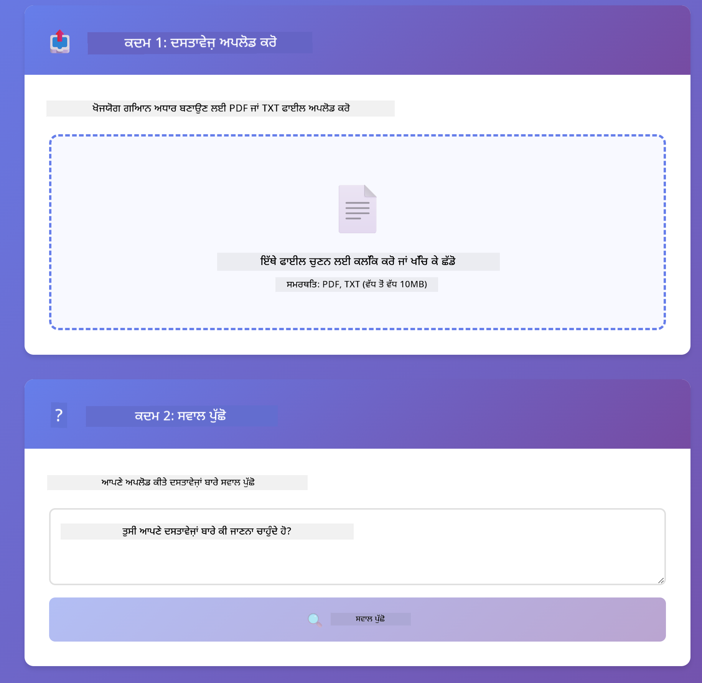

<!--
CO_OP_TRANSLATOR_METADATA:
{
  "original_hash": "f538a51cfd13147d40d84e936a0f485c",
  "translation_date": "2025-12-13T16:57:31+00:00",
  "source_file": "03-rag/README.md",
  "language_code": "pa"
}
-->
# Module 03: RAG (Retrieval-Augmented Generation)

## Table of Contents

- [What You'll Learn](../../../03-rag)
- [Prerequisites](../../../03-rag)
- [Understanding RAG](../../../03-rag)
- [How It Works](../../../03-rag)
  - [Document Processing](../../../03-rag)
  - [Creating Embeddings](../../../03-rag)
  - [Semantic Search](../../../03-rag)
  - [Answer Generation](../../../03-rag)
- [Run the Application](../../../03-rag)
- [Using the Application](../../../03-rag)
  - [Upload a Document](../../../03-rag)
  - [Ask Questions](../../../03-rag)
  - [Check Source References](../../../03-rag)
  - [Experiment with Questions](../../../03-rag)
- [Key Concepts](../../../03-rag)
  - [Chunking Strategy](../../../03-rag)
  - [Similarity Scores](../../../03-rag)
  - [In-Memory Storage](../../../03-rag)
  - [Context Window Management](../../../03-rag)
- [When RAG Matters](../../../03-rag)
- [Next Steps](../../../03-rag)

## What You'll Learn

ਪਿਛਲੇ ਮੋਡੀਊਲਾਂ ਵਿੱਚ, ਤੁਸੀਂ ਸਿੱਖਿਆ ਕਿ ਕਿਵੇਂ AI ਨਾਲ ਗੱਲਬਾਤ ਕਰਨੀ ਹੈ ਅਤੇ ਆਪਣੇ ਪ੍ਰਾਂਪਟਸ ਨੂੰ ਪ੍ਰਭਾਵਸ਼ਾਲੀ ਢੰਗ ਨਾਲ ਬਣਾਉਣਾ ਹੈ। ਪਰ ਇੱਕ ਮੂਲਭੂਤ ਸੀਮਾ ਹੈ: ਭਾਸ਼ਾ ਮਾਡਲ ਸਿਰਫ ਉਹੀ ਜਾਣਦੇ ਹਨ ਜੋ ਉਹਨਾਂ ਨੇ ਟ੍ਰੇਨਿੰਗ ਦੌਰਾਨ ਸਿੱਖਿਆ। ਉਹ ਤੁਹਾਡੇ ਕੰਪਨੀ ਦੀਆਂ ਨੀਤੀਆਂ, ਤੁਹਾਡੇ ਪ੍ਰੋਜੈਕਟ ਦਸਤਾਵੇਜ਼ਾਂ ਜਾਂ ਕਿਸੇ ਵੀ ਜਾਣਕਾਰੀ ਬਾਰੇ ਸਵਾਲਾਂ ਦੇ ਜਵਾਬ ਨਹੀਂ ਦੇ ਸਕਦੇ ਜੋ ਉਹਨਾਂ ਨੂੰ ਸਿੱਖਾਇਆ ਨਹੀਂ ਗਿਆ।

RAG (Retrieval-Augmented Generation) ਇਸ ਸਮੱਸਿਆ ਦਾ ਹੱਲ ਹੈ। ਮਾਡਲ ਨੂੰ ਤੁਹਾਡੀ ਜਾਣਕਾਰੀ ਸਿੱਖਾਉਣ ਦੀ ਕੋਸ਼ਿਸ਼ ਕਰਨ ਦੀ ਬਜਾਏ (ਜੋ ਮਹਿੰਗਾ ਅਤੇ ਅਮਲ ਵਿੱਚ ਮੁਸ਼ਕਲ ਹੈ), ਤੁਸੀਂ ਇਸਨੂੰ ਤੁਹਾਡੇ ਦਸਤਾਵੇਜ਼ਾਂ ਵਿੱਚ ਖੋਜ ਕਰਨ ਦੀ ਸਮਰੱਥਾ ਦਿੰਦੇ ਹੋ। ਜਦੋਂ ਕੋਈ ਸਵਾਲ ਪੁੱਛਦਾ ਹੈ, ਸਿਸਟਮ ਸੰਬੰਧਿਤ ਜਾਣਕਾਰੀ ਲੱਭਦਾ ਹੈ ਅਤੇ ਪ੍ਰਾਂਪਟ ਵਿੱਚ ਸ਼ਾਮਲ ਕਰਦਾ ਹੈ। ਫਿਰ ਮਾਡਲ ਉਸ ਪ੍ਰਾਪਤ ਸੰਦਰਭ ਦੇ ਆਧਾਰ 'ਤੇ ਜਵਾਬ ਦਿੰਦਾ ਹੈ।

RAG ਨੂੰ ਮਾਡਲ ਨੂੰ ਇੱਕ ਸੰਦਰਭ ਲਾਇਬ੍ਰੇਰੀ ਦੇਣ ਵਾਂਗ ਸੋਚੋ। ਜਦੋਂ ਤੁਸੀਂ ਸਵਾਲ ਪੁੱਛਦੇ ਹੋ, ਸਿਸਟਮ:

1. **ਯੂਜ਼ਰ ਕਵੈਰੀ** - ਤੁਸੀਂ ਸਵਾਲ ਪੁੱਛਦੇ ਹੋ  
2. **ਐਂਬੈਡਿੰਗ** - ਤੁਹਾਡੇ ਸਵਾਲ ਨੂੰ ਇੱਕ ਵੇਕਟਰ ਵਿੱਚ ਬਦਲਦਾ ਹੈ  
3. **ਵੇਕਟਰ ਖੋਜ** - ਸਮਾਨ ਦਸਤਾਵੇਜ਼ ਚੰਕ ਲੱਭਦਾ ਹੈ  
4. **ਸੰਦਰਭ ਇਕੱਠਾ ਕਰਨਾ** - ਸੰਬੰਧਿਤ ਚੰਕ ਪ੍ਰਾਂਪਟ ਵਿੱਚ ਸ਼ਾਮਲ ਕਰਦਾ ਹੈ  
5. **ਜਵਾਬ** - LLM ਸੰਦਰਭ ਦੇ ਆਧਾਰ 'ਤੇ ਜਵਾਬ ਤਿਆਰ ਕਰਦਾ ਹੈ  

ਇਸ ਨਾਲ ਮਾਡਲ ਦੇ ਜਵਾਬ ਤੁਹਾਡੇ ਅਸਲੀ ਡੇਟਾ 'ਤੇ ਅਧਾਰਿਤ ਹੁੰਦੇ ਹਨ ਨਾ ਕਿ ਉਸ ਦੀ ਟ੍ਰੇਨਿੰਗ ਜਾਣਕਾਰੀ 'ਤੇ ਜਾਂ ਕਲਪਨਾ 'ਤੇ।


*RAG ਵਰਕਫਲੋ - ਯੂਜ਼ਰ ਕਵੈਰੀ ਤੋਂ ਸੈਮਾਂਟਿਕ ਖੋਜ ਅਤੇ ਸੰਦਰਭਿਕ ਜਵਾਬ ਤਿਆਰ ਕਰਨ ਤੱਕ*

## Prerequisites

- ਮੋਡੀਊਲ 01 ਪੂਰਾ ਕੀਤਾ ਹੋਇਆ (Azure OpenAI ਸਰੋਤ ਤਿਆਰ ਕੀਤੇ ਹੋਏ)  
- ਰੂਟ ਡਾਇਰੈਕਟਰੀ ਵਿੱਚ `.env` ਫਾਇਲ ਜਿਸ ਵਿੱਚ Azure ਪ੍ਰਮਾਣ ਪੱਤਰ ਹਨ (ਮੋਡੀਊਲ 01 ਵਿੱਚ `azd up` ਨਾਲ ਬਣਾਈ ਗਈ)  

> **ਨੋਟ:** ਜੇ ਤੁਸੀਂ ਮੋਡੀਊਲ 01 ਪੂਰਾ ਨਹੀਂ ਕੀਤਾ, ਤਾਂ ਪਹਿਲਾਂ ਉਥੇ ਦਿੱਤੇ ਡਿਪਲੋਇਮੈਂਟ ਨਿਰਦੇਸ਼ਾਂ ਦੀ ਪਾਲਣਾ ਕਰੋ।  

## How It Works

**Document Processing** - [DocumentService.java](../../../03-rag/src/main/java/com/example/langchain4j/rag/service/DocumentService.java)

ਜਦੋਂ ਤੁਸੀਂ ਦਸਤਾਵੇਜ਼ ਅਪਲੋਡ ਕਰਦੇ ਹੋ, ਸਿਸਟਮ ਇਸਨੂੰ ਚੰਕਾਂ ਵਿੱਚ ਵੰਡਦਾ ਹੈ - ਛੋਟੇ ਹਿੱਸੇ ਜੋ ਮਾਡਲ ਦੇ ਸੰਦਰਭ ਵਿੰਡੋ ਵਿੱਚ ਆਰਾਮਦਾਇਕ ਤਰੀਕੇ ਨਾਲ ਫਿੱਟ ਹੁੰਦੇ ਹਨ। ਇਹ ਚੰਕ ਥੋੜ੍ਹਾ ਜਿਹਾ ਓਵਰਲੈਪ ਕਰਦੇ ਹਨ ਤਾਂ ਜੋ ਬਾਰਡਰ ਤੇ ਸੰਦਰਭ ਨਾ ਖੋਵੇ।

```java
Document document = FileSystemDocumentLoader.loadDocument("sample-document.txt");

DocumentSplitter splitter = DocumentSplitters
    .recursive(300, 30, new OpenAiTokenizer());

List<TextSegment> segments = splitter.split(document);
```
  
> **🤖 [GitHub Copilot](https://github.com/features/copilot) ਚੈਟ ਨਾਲ ਕੋਸ਼ਿਸ਼ ਕਰੋ:** [`DocumentService.java`](../../../03-rag/src/main/java/com/example/langchain4j/rag/service/DocumentService.java) ਖੋਲ੍ਹੋ ਅਤੇ ਪੁੱਛੋ:  
> - "LangChain4j ਦਸਤਾਵੇਜ਼ਾਂ ਨੂੰ ਚੰਕਾਂ ਵਿੱਚ ਕਿਵੇਂ ਵੰਡਦਾ ਹੈ ਅਤੇ ਓਵਰਲੈਪ ਕਿਉਂ ਜਰੂਰੀ ਹੈ?"  
> - "ਵੱਖ-ਵੱਖ ਦਸਤਾਵੇਜ਼ ਕਿਸਮਾਂ ਲਈ ਸਭ ਤੋਂ ਵਧੀਆ ਚੰਕ ਸਾਈਜ਼ ਕੀ ਹੈ ਅਤੇ ਕਿਉਂ?"  
> - "ਮੈਂ ਕਿਵੇਂ ਕਈ ਭਾਸ਼ਾਵਾਂ ਜਾਂ ਖਾਸ ਫਾਰਮੈਟਿੰਗ ਵਾਲੇ ਦਸਤਾਵੇਜ਼ਾਂ ਨੂੰ ਸੰਭਾਲਾਂ?"  

**Creating Embeddings** - [LangChainRagConfig.java](../../../03-rag/src/main/java/com/example/langchain4j/rag/config/LangChainRagConfig.java)

ਹਰ ਚੰਕ ਨੂੰ ਇੱਕ ਗਣਿਤੀਕ ਪ੍ਰਤੀਨਿਧਿਤਾ ਵਿੱਚ ਬਦਲਿਆ ਜਾਂਦਾ ਹੈ ਜਿਸਨੂੰ ਐਂਬੈਡਿੰਗ ਕਹਿੰਦੇ ਹਨ - ਅਸਲ ਵਿੱਚ ਇੱਕ ਗਣਿਤੀਕ ਫਿੰਗਰਪ੍ਰਿੰਟ ਜੋ ਲਿਖਤ ਦਾ ਅਰਥ ਕੈਪਚਰ ਕਰਦਾ ਹੈ। ਸਮਾਨ ਲਿਖਤ ਸਮਾਨ ਐਂਬੈਡਿੰਗ ਬਣਾਉਂਦਾ ਹੈ।

```java
@Bean
public EmbeddingModel embeddingModel() {
    return OpenAiOfficialEmbeddingModel.builder()
        .baseUrl(azureOpenAiEndpoint)
        .apiKey(azureOpenAiKey)
        .modelName(azureEmbeddingDeploymentName)
        .build();
}

EmbeddingStore<TextSegment> embeddingStore = 
    new InMemoryEmbeddingStore<>();
```
  


*ਦਸਤਾਵੇਜ਼ ਐਂਬੈਡਿੰਗ ਸਪੇਸ ਵਿੱਚ ਵੇਕਟਰ ਵਾਂਗ ਦਰਸਾਏ ਗਏ - ਸਮਾਨ ਸਮੱਗਰੀ ਇਕੱਠੀ ਹੁੰਦੀ ਹੈ*  

**Semantic Search** - [RagService.java](../../../03-rag/src/main/java/com/example/langchain4j/rag/service/RagService.java)

ਜਦੋਂ ਤੁਸੀਂ ਸਵਾਲ ਪੁੱਛਦੇ ਹੋ, ਤੁਹਾਡਾ ਸਵਾਲ ਵੀ ਇੱਕ ਐਂਬੈਡਿੰਗ ਬਣ ਜਾਂਦਾ ਹੈ। ਸਿਸਟਮ ਤੁਹਾਡੇ ਸਵਾਲ ਦੀ ਐਂਬੈਡਿੰਗ ਦੀ ਤੁਲਨਾ ਸਾਰੇ ਦਸਤਾਵੇਜ਼ ਚੰਕਾਂ ਦੀਆਂ ਐਂਬੈਡਿੰਗ ਨਾਲ ਕਰਦਾ ਹੈ। ਇਹ ਉਹ ਚੰਕ ਲੱਭਦਾ ਹੈ ਜਿਨ੍ਹਾਂ ਦੇ ਅਰਥ ਸਭ ਤੋਂ ਜ਼ਿਆਦਾ ਮਿਲਦੇ ਹਨ - ਸਿਰਫ਼ ਕੀਵਰਡ ਮੇਲ ਨਹੀਂ, ਸੱਚੀ ਸੈਮਾਂਟਿਕ ਸਮਾਨਤਾ।

```java
Embedding queryEmbedding = embeddingModel.embed(question).content();

List<EmbeddingMatch<TextSegment>> matches = 
    embeddingStore.findRelevant(queryEmbedding, 5, 0.7);

for (EmbeddingMatch<TextSegment> match : matches) {
    String relevantText = match.embedded().text();
    double score = match.score();
}
```
  
> **🤖 [GitHub Copilot](https://github.com/features/copilot) ਚੈਟ ਨਾਲ ਕੋਸ਼ਿਸ਼ ਕਰੋ:** [`RagService.java`](../../../03-rag/src/main/java/com/example/langchain4j/rag/service/RagService.java) ਖੋਲ੍ਹੋ ਅਤੇ ਪੁੱਛੋ:  
> - "ਐਂਬੈਡਿੰਗ ਨਾਲ ਸਮਾਨਤਾ ਖੋਜ ਕਿਵੇਂ ਕੰਮ ਕਰਦੀ ਹੈ ਅਤੇ ਸਕੋਰ ਕੀ ਨਿਰਧਾਰਤ ਕਰਦਾ ਹੈ?"  
> - "ਮੈਂ ਕਿਹੜਾ ਸਮਾਨਤਾ ਸੀਮਾ ਵਰਤਾਂ ਅਤੇ ਇਹ ਨਤੀਜਿਆਂ ਨੂੰ ਕਿਵੇਂ ਪ੍ਰਭਾਵਿਤ ਕਰਦੀ ਹੈ?"  
> - "ਜੇ ਕੋਈ ਸੰਬੰਧਿਤ ਦਸਤਾਵੇਜ਼ ਨਾ ਮਿਲਣ ਤਾਂ ਮੈਂ ਕਿਵੇਂ ਸੰਭਾਲਾਂ?"  

**Answer Generation** - [RagService.java](../../../03-rag/src/main/java/com/example/langchain4j/rag/service/RagService.java)

ਸਭ ਤੋਂ ਸੰਬੰਧਿਤ ਚੰਕ ਮਾਡਲ ਨੂੰ ਪ੍ਰਾਂਪਟ ਵਿੱਚ ਸ਼ਾਮਲ ਕੀਤੇ ਜਾਂਦੇ ਹਨ। ਮਾਡਲ ਉਹਨਾਂ ਖਾਸ ਚੰਕਾਂ ਨੂੰ ਪੜ੍ਹਦਾ ਹੈ ਅਤੇ ਉਸ ਜਾਣਕਾਰੀ ਦੇ ਆਧਾਰ 'ਤੇ ਤੁਹਾਡੇ ਸਵਾਲ ਦਾ ਜਵਾਬ ਦਿੰਦਾ ਹੈ। ਇਸ ਨਾਲ ਹਲੂਸੀਨੇਸ਼ਨ ਰੋਕੀ ਜਾਂਦੀ ਹੈ - ਮਾਡਲ ਸਿਰਫ਼ ਉਹੀ ਜਵਾਬ ਦੇ ਸਕਦਾ ਹੈ ਜੋ ਉਸਦੇ ਸਾਹਮਣੇ ਹੈ।  

## Run the Application

**Verify deployment:**

ਪੱਕਾ ਕਰੋ ਕਿ ਰੂਟ ਡਾਇਰੈਕਟਰੀ ਵਿੱਚ `.env` ਫਾਇਲ ਮੌਜੂਦ ਹੈ ਜਿਸ ਵਿੱਚ Azure ਪ੍ਰਮਾਣ ਪੱਤਰ ਹਨ (ਮੋਡੀਊਲ 01 ਦੌਰਾਨ ਬਣਾਈ ਗਈ):  
```bash
cat ../.env  # AZURE_OPENAI_ENDPOINT, API_KEY, DEPLOYMENT ਦਿਖਾਉਣਾ ਚਾਹੀਦਾ ਹੈ
```
  
**Start the application:**

> **ਨੋਟ:** ਜੇ ਤੁਸੀਂ ਪਹਿਲਾਂ ਹੀ ਮੋਡੀਊਲ 01 ਤੋਂ `./start-all.sh` ਨਾਲ ਸਾਰੇ ਐਪਲੀਕੇਸ਼ਨ ਚਾਲੂ ਕਰ ਚੁੱਕੇ ਹੋ, ਤਾਂ ਇਹ ਮੋਡੀਊਲ ਪਹਿਲਾਂ ਹੀ ਪੋਰਟ 8081 'ਤੇ ਚੱਲ ਰਿਹਾ ਹੈ। ਤੁਸੀਂ ਹੇਠਾਂ ਦਿੱਤੇ ਸਟਾਰਟ ਕਮਾਂਡਾਂ ਨੂੰ ਛੱਡ ਕੇ ਸਿੱਧਾ http://localhost:8081 'ਤੇ ਜਾ ਸਕਦੇ ਹੋ।  

**Option 1: Using Spring Boot Dashboard (VS Code ਵਰਤੋਂਕਾਰਾਂ ਲਈ ਸਿਫਾਰਸ਼ੀ)**

ਡੈਵ ਕੰਟੇਨਰ ਵਿੱਚ Spring Boot Dashboard ਐਕਸਟੈਂਸ਼ਨ ਸ਼ਾਮਲ ਹੈ, ਜੋ ਸਾਰੇ Spring Boot ਐਪਲੀਕੇਸ਼ਨਾਂ ਨੂੰ ਵਿਜ਼ੂਅਲ ਇੰਟਰਫੇਸ ਨਾਲ ਮੈਨੇਜ ਕਰਨ ਦੀ ਸਹੂਲਤ ਦਿੰਦਾ ਹੈ। ਤੁਸੀਂ ਇਸਨੂੰ VS Code ਦੇ ਖੱਬੇ ਪਾਸੇ Activity Bar ਵਿੱਚ Spring Boot ਆਈਕਨ ਦੇ ਰੂਪ ਵਿੱਚ ਵੇਖ ਸਕਦੇ ਹੋ।  

Spring Boot Dashboard ਤੋਂ, ਤੁਸੀਂ:  
- ਵਰਕਸਪੇਸ ਵਿੱਚ ਸਾਰੇ ਉਪਲਬਧ Spring Boot ਐਪਲੀਕੇਸ਼ਨ ਵੇਖ ਸਕਦੇ ਹੋ  
- ਇੱਕ ਕਲਿੱਕ ਨਾਲ ਐਪਲੀਕੇਸ਼ਨ ਸ਼ੁਰੂ/ਰੋਕ ਸਕਦੇ ਹੋ  
- ਐਪਲੀਕੇਸ਼ਨ ਲੌਗਸ ਨੂੰ ਰੀਅਲ-ਟਾਈਮ ਵਿੱਚ ਦੇਖ ਸਕਦੇ ਹੋ  
- ਐਪਲੀਕੇਸ਼ਨ ਦੀ ਸਥਿਤੀ ਮਾਨੀਟਰ ਕਰ ਸਕਦੇ ਹੋ  

ਸਿਰਫ਼ "rag" ਦੇ ਨਾਲ ਖੇਡ ਬਟਨ 'ਤੇ ਕਲਿੱਕ ਕਰੋ ਇਸ ਮੋਡੀਊਲ ਨੂੰ ਸ਼ੁਰੂ ਕਰਨ ਲਈ, ਜਾਂ ਸਾਰੇ ਮੋਡੀਊਲ ਇੱਕ ਵਾਰੀ ਵਿੱਚ ਸ਼ੁਰੂ ਕਰੋ।  


**Option 2: Using shell scripts**

ਸਾਰੇ ਵੈੱਬ ਐਪਲੀਕੇਸ਼ਨ (ਮੋਡੀਊਲ 01-04) ਸ਼ੁਰੂ ਕਰੋ:  

**Bash:**  
```bash
cd ..  # ਰੂਟ ਡਾਇਰੈਕਟਰੀ ਤੋਂ
./start-all.sh
```
  
**PowerShell:**  
```powershell
cd ..  # ਰੂਟ ਡਾਇਰੈਕਟਰੀ ਤੋਂ
.\start-all.ps1
```
  
ਜਾਂ ਸਿਰਫ਼ ਇਹ ਮੋਡੀਊਲ ਸ਼ੁਰੂ ਕਰੋ:  

**Bash:**  
```bash
cd 03-rag
./start.sh
```
  
**PowerShell:**  
```powershell
cd 03-rag
.\start.ps1
```
  
ਦੋਹਾਂ ਸਕ੍ਰਿਪਟਾਂ ਆਪਣੇ ਆਪ ਰੂਟ `.env` ਫਾਇਲ ਤੋਂ ਵਾਤਾਵਰਣ ਚਲਾਂਵਲੀਆਂ ਲੋਡ ਕਰਦੀਆਂ ਹਨ ਅਤੇ ਜੇ JAR ਫਾਇਲਾਂ ਮੌਜੂਦ ਨਹੀਂ ਹਨ ਤਾਂ ਉਹਨਾਂ ਨੂੰ ਬਣਾਉਂਦੀਆਂ ਹਨ।  

> **ਨੋਟ:** ਜੇ ਤੁਸੀਂ ਸਾਰੇ ਮੋਡੀਊਲ ਮੈਨੁਅਲੀ ਤੌਰ 'ਤੇ ਬਣਾਉਣਾ ਚਾਹੁੰਦੇ ਹੋ:  
>  
> **Bash:**  
> ```bash
> cd ..  # Go to root directory
> mvn clean package -DskipTests
> ```
>  
> **PowerShell:**  
> ```powershell
> cd ..  # Go to root directory
> mvn clean package -DskipTests
> ```
  
ਆਪਣਾ ਬ੍ਰਾਊਜ਼ਰ ਖੋਲ੍ਹੋ ਅਤੇ http://localhost:8081 'ਤੇ ਜਾਓ।  

**To stop:**  

**Bash:**  
```bash
./stop.sh  # ਇਹ ਮਾਡਿਊਲ ਸਿਰਫ
# ਜਾਂ
cd .. && ./stop-all.sh  # ਸਾਰੇ ਮਾਡਿਊਲ
```
  
**PowerShell:**  
```powershell
.\stop.ps1  # ਇਹ ਮਾਡਿਊਲ ਸਿਰਫ
# ਜਾਂ
cd ..; .\stop-all.ps1  # ਸਾਰੇ ਮਾਡਿਊਲ
```
  

## Using the Application

ਐਪਲੀਕੇਸ਼ਨ ਦਸਤਾਵੇਜ਼ ਅਪਲੋਡ ਅਤੇ ਸਵਾਲ ਪੁੱਛਣ ਲਈ ਵੈੱਬ ਇੰਟਰਫੇਸ ਪ੍ਰਦਾਨ ਕਰਦਾ ਹੈ।  

<a href="images/rag-homepage.png"></a>

*RAG ਐਪਲੀਕੇਸ਼ਨ ਇੰਟਰਫੇਸ - ਦਸਤਾਵੇਜ਼ ਅਪਲੋਡ ਕਰੋ ਅਤੇ ਸਵਾਲ ਪੁੱਛੋ*  

**Upload a Document**

ਸ਼ੁਰੂਆਤ ਵਿੱਚ ਇੱਕ ਦਸਤਾਵੇਜ਼ ਅਪਲੋਡ ਕਰੋ - ਟੈਸਟਿੰਗ ਲਈ TXT ਫਾਇਲਾਂ ਸਭ ਤੋਂ ਵਧੀਆ ਹਨ। ਇਸ ਡਾਇਰੈਕਟਰੀ ਵਿੱਚ ਇੱਕ `sample-document.txt` ਦਿੱਤਾ ਗਿਆ ਹੈ ਜਿਸ ਵਿੱਚ LangChain4j ਫੀਚਰ, RAG ਇੰਪਲੀਮੈਂਟੇਸ਼ਨ ਅਤੇ ਬਿਹਤਰ ਅਭਿਆਸਾਂ ਬਾਰੇ ਜਾਣਕਾਰੀ ਹੈ - ਸਿਸਟਮ ਦੀ ਟੈਸਟਿੰਗ ਲਈ ਬਹੁਤ ਵਧੀਆ।  

ਸਿਸਟਮ ਤੁਹਾਡੇ ਦਸਤਾਵੇਜ਼ ਨੂੰ ਪ੍ਰੋਸੈਸ ਕਰਦਾ ਹੈ, ਇਸਨੂੰ ਚੰਕਾਂ ਵਿੱਚ ਵੰਡਦਾ ਹੈ ਅਤੇ ਹਰ ਚੰਕ ਲਈ ਐਂਬੈਡਿੰਗ ਬਣਾਉਂਦਾ ਹੈ। ਇਹ ਸਾਰਾ ਕੰਮ ਤੁਹਾਡੇ ਅਪਲੋਡ ਕਰਨ 'ਤੇ ਆਪਣੇ ਆਪ ਹੁੰਦਾ ਹੈ।  

**Ask Questions**

ਹੁਣ ਦਸਤਾਵੇਜ਼ ਸਮੱਗਰੀ ਬਾਰੇ ਖਾਸ ਸਵਾਲ ਪੁੱਛੋ। ਕੁਝ ਐਸਾ ਪੁੱਛੋ ਜੋ ਸਪਸ਼ਟ ਤੌਰ 'ਤੇ ਦਸਤਾਵੇਜ਼ ਵਿੱਚ ਦਿੱਤਾ ਹੋਵੇ। ਸਿਸਟਮ ਸੰਬੰਧਿਤ ਚੰਕ ਲੱਭਦਾ ਹੈ, ਉਹਨਾਂ ਨੂੰ ਪ੍ਰਾਂਪਟ ਵਿੱਚ ਸ਼ਾਮਲ ਕਰਦਾ ਹੈ ਅਤੇ ਜਵਾਬ ਤਿਆਰ ਕਰਦਾ ਹੈ।  

**Check Source References**

ਹਰ ਜਵਾਬ ਵਿੱਚ ਸਰੋਤ ਸੰਦਰਭ ਅਤੇ ਸਮਾਨਤਾ ਸਕੋਰ ਸ਼ਾਮਲ ਹੁੰਦੇ ਹਨ। ਇਹ ਸਕੋਰ (0 ਤੋਂ 1 ਤੱਕ) ਦਿਖਾਉਂਦੇ ਹਨ ਕਿ ਹਰ ਚੰਕ ਤੁਹਾਡੇ ਸਵਾਲ ਨਾਲ ਕਿੰਨਾ ਸੰਬੰਧਿਤ ਸੀ। ਵੱਧ ਸਕੋਰ ਦਾ ਮਤਲਬ ਵਧੀਆ ਮੇਲ ਹੈ। ਇਸ ਨਾਲ ਤੁਸੀਂ ਜਵਾਬ ਨੂੰ ਸਰੋਤ ਸਮੱਗਰੀ ਨਾਲ ਵੈਰੀਫਾਈ ਕਰ ਸਕਦੇ ਹੋ।  

<a href="images/rag-query-results.png"></a>

*ਕਵੈਰੀ ਨਤੀਜੇ ਜਵਾਬ ਦੇ ਨਾਲ ਸਰੋਤ ਸੰਦਰਭ ਅਤੇ ਸੰਬੰਧਿਤ ਸਕੋਰ ਦਿਖਾ ਰਹੇ ਹਨ*  

**Experiment with Questions**

ਵੱਖ-ਵੱਖ ਕਿਸਮ ਦੇ ਸਵਾਲਾਂ ਨਾਲ ਕੋਸ਼ਿਸ਼ ਕਰੋ:  
- ਖਾਸ ਤੱਥ: "ਮੁੱਖ ਵਿਸ਼ਾ ਕੀ ਹੈ?"  
- ਤੁਲਨਾਵਾਂ: "X ਅਤੇ Y ਵਿੱਚ ਕੀ ਫਰਕ ਹੈ?"  
- ਸਾਰਾਂਸ਼: "Z ਬਾਰੇ ਮੁੱਖ ਬਿੰਦੂ ਸਾਰਾਂਸ਼ ਕਰੋ"  

ਦੇਖੋ ਕਿ ਕਿਵੇਂ ਸੰਬੰਧਿਤ ਸਕੋਰ ਤੁਹਾਡੇ ਸਵਾਲ ਅਤੇ ਦਸਤਾਵੇਜ਼ ਸਮੱਗਰੀ ਦੇ ਮੇਲ ਦੇ ਅਨੁਸਾਰ ਬਦਲਦੇ ਹਨ।  

## Key Concepts

**Chunking Strategy**

ਦਸਤਾਵੇਜ਼ਾਂ ਨੂੰ 300-ਟੋਕਨ ਚੰਕਾਂ ਵਿੱਚ ਵੰਡਿਆ ਜਾਂਦਾ ਹੈ ਜਿਨ੍ਹਾਂ ਵਿੱਚ 30 ਟੋਕਨ ਦਾ ਓਵਰਲੈਪ ਹੁੰਦਾ ਹੈ। ਇਹ ਸੰਤੁਲਨ ਇਹ ਯਕੀਨੀ ਬਣਾਉਂਦਾ ਹੈ ਕਿ ਹਰ ਚੰਕ ਵਿੱਚ ਕਾਫੀ ਸੰਦਰਭ ਹੁੰਦਾ ਹੈ ਤਾਂ ਜੋ ਉਹ ਮਾਇਨੇ ਰੱਖੇ ਅਤੇ ਇੱਕ ਪ੍ਰਾਂਪਟ ਵਿੱਚ ਕਈ ਚੰਕ ਸ਼ਾਮਲ ਕੀਤੇ ਜਾ ਸਕਣ।  

**Similarity Scores**

ਸਕੋਰ 0 ਤੋਂ 1 ਤੱਕ ਹੁੰਦੇ ਹਨ:  
- 0.7-1.0: ਬਹੁਤ ਸੰਬੰਧਿਤ, ਸਹੀ ਮੇਲ  
- 0.5-0.7: ਸੰਬੰਧਿਤ, ਚੰਗਾ ਸੰਦਰਭ  
- 0.5 ਤੋਂ ਘੱਟ: ਫਿਲਟਰ ਕੀਤਾ ਗਿਆ, ਬਹੁਤ ਵੱਖਰਾ  

ਸਿਸਟਮ ਸਿਰਫ਼ ਉਹ ਚੰਕ ਲੱਭਦਾ ਹੈ ਜੋ ਘੱਟੋ-ਘੱਟ ਸੀਮਾ ਤੋਂ ਉੱਪਰ ਹੁੰਦੇ ਹਨ ਤਾਂ ਜੋ ਗੁਣਵੱਤਾ ਯਕੀਨੀ ਬਣਾਈ ਜਾ ਸਕੇ।  

**In-Memory Storage**

ਇਹ ਮੋਡੀਊਲ ਸਾਦਗੀ ਲਈ ਇਨ-ਮੇਮੋਰੀ ਸਟੋਰੇਜ ਵਰਤਦਾ ਹੈ। ਜਦੋਂ ਤੁਸੀਂ ਐਪਲੀਕੇਸ਼ਨ ਨੂੰ ਰੀਸਟਾਰਟ ਕਰਦੇ ਹੋ, ਅਪਲੋਡ ਕੀਤੇ ਦਸਤਾਵੇਜ਼ ਖੋ ਜਾਂਦੇ ਹਨ। ਪ੍ਰੋਡਕਸ਼ਨ ਸਿਸਟਮ Qdrant ਜਾਂ Azure AI Search ਵਰਗੇ ਸਥਾਈ ਵੇਕਟਰ ਡੇਟਾਬੇਸ ਵਰਤਦੇ ਹਨ।  

**Context Window Management**

ਹਰ ਮਾਡਲ ਦੀ ਇੱਕ ਵੱਧ ਤੋਂ ਵੱਧ ਸੰਦਰਭ ਵਿੰਡੋ ਹੁੰਦੀ ਹੈ। ਤੁਸੀਂ ਵੱਡੇ ਦਸਤਾਵੇਜ਼ ਦੇ ਹਰ ਚੰਕ ਨੂੰ ਸ਼ਾਮਲ ਨਹੀਂ ਕਰ ਸਕਦੇ। ਸਿਸਟਮ ਸਭ ਤੋਂ ਸੰਬੰਧਿਤ N ਚੰਕ (ਡਿਫਾਲਟ 5) ਲੈਂਦਾ ਹੈ ਤਾਂ ਜੋ ਸੀਮਾਵਾਂ ਵਿੱਚ ਰਹਿ ਕੇ ਸਹੀ ਜਵਾਬ ਦੇਣ ਲਈ ਕਾਫੀ ਸੰਦਰਭ ਮਿਲੇ।  

## When RAG Matters

**RAG ਇਸ ਵੇਲੇ ਵਰਤੋਂ:**  
- ਮਾਲਕੀ ਦਸਤਾਵੇਜ਼ਾਂ ਬਾਰੇ ਸਵਾਲਾਂ ਦੇ ਜਵਾਬ ਦੇਣ ਲਈ  
- ਜਾਣਕਾਰੀ ਬਾਰ-ਬਾਰ ਬਦਲਦੀ ਰਹਿੰਦੀ ਹੋਵੇ (ਨੀਤੀਆਂ, ਕੀਮਤਾਂ, ਵਿਸ਼ੇਸ਼ਤਾਵਾਂ)  
- ਸਹੀਤਾ ਲਈ ਸਰੋਤ ਸੰਦਰਭ ਦੀ ਲੋੜ ਹੋਵੇ  
- ਸਮੱਗਰੀ ਇੱਕ ਪ੍ਰਾਂਪਟ ਵਿੱਚ ਫਿੱਟ ਨਹੀਂ ਹੁੰਦੀ  
- ਤੁਹਾਨੂੰ ਸੱਚੇ, ਸਥਿਰ ਜਵਾਬ ਚਾਹੀਦੇ ਹੋਣ  

**RAG ਇਸ ਵੇਲੇ ਨਾ ਵਰਤੋਂ:**  
- ਜਦੋਂ ਸਵਾਲ ਮਾਡਲ ਦੇ ਆਮ ਗਿਆਨ ਬਾਰੇ ਹੋਣ  
- ਜਦੋਂ ਰੀਅਲ-ਟਾਈਮ ਡੇਟਾ ਦੀ ਲੋੜ ਹੋਵੇ (RAG ਸਿਰਫ਼ ਅਪਲੋਡ ਕੀਤੇ ਦਸਤਾਵੇਜ਼ਾਂ 'ਤੇ ਕੰਮ ਕਰਦਾ ਹੈ)  
- ਜਦੋਂ ਸਮੱਗਰੀ ਛੋਟੀ ਹੋਵੇ ਅਤੇ ਸਿੱਧਾ ਪ੍ਰਾਂਪਟ ਵਿੱਚ ਸ਼ਾਮਲ ਕੀਤੀ ਜਾ ਸਕੇ  

## Next Steps

**Next Module:** [04-tools - AI Agents with Tools](../04-tools/README.md)

---

**Navigation:** [← Previous: Module 02 - Prompt Engineering](../02-prompt-engineering/README.md) | [Back to Main](../README.md) | [Next: Module 04 - Tools →](../04-tools/README.md)

---

<!-- CO-OP TRANSLATOR DISCLAIMER START -->
**ਅਸਵੀਕਾਰੋਪੱਤਰ**:  
ਇਹ ਦਸਤਾਵੇਜ਼ AI ਅਨੁਵਾਦ ਸੇਵਾ [Co-op Translator](https://github.com/Azure/co-op-translator) ਦੀ ਵਰਤੋਂ ਕਰਕੇ ਅਨੁਵਾਦ ਕੀਤਾ ਗਿਆ ਹੈ। ਜਦੋਂ ਕਿ ਅਸੀਂ ਸਹੀਤਾ ਲਈ ਕੋਸ਼ਿਸ਼ ਕਰਦੇ ਹਾਂ, ਕਿਰਪਾ ਕਰਕੇ ਧਿਆਨ ਵਿੱਚ ਰੱਖੋ ਕਿ ਸਵੈਚਾਲਿਤ ਅਨੁਵਾਦਾਂ ਵਿੱਚ ਗਲਤੀਆਂ ਜਾਂ ਅਸਮਰਥਤਾਵਾਂ ਹੋ ਸਕਦੀਆਂ ਹਨ। ਮੂਲ ਦਸਤਾਵੇਜ਼ ਆਪਣੀ ਮੂਲ ਭਾਸ਼ਾ ਵਿੱਚ ਪ੍ਰਮਾਣਿਕ ਸਰੋਤ ਮੰਨਿਆ ਜਾਣਾ ਚਾਹੀਦਾ ਹੈ। ਮਹੱਤਵਪੂਰਨ ਜਾਣਕਾਰੀ ਲਈ, ਪੇਸ਼ੇਵਰ ਮਨੁੱਖੀ ਅਨੁਵਾਦ ਦੀ ਸਿਫਾਰਸ਼ ਕੀਤੀ ਜਾਂਦੀ ਹੈ। ਅਸੀਂ ਇਸ ਅਨੁਵਾਦ ਦੀ ਵਰਤੋਂ ਤੋਂ ਉਤਪੰਨ ਕਿਸੇ ਵੀ ਗਲਤਫਹਿਮੀ ਜਾਂ ਗਲਤ ਵਿਆਖਿਆ ਲਈ ਜ਼ਿੰਮੇਵਾਰ ਨਹੀਂ ਹਾਂ।
<!-- CO-OP TRANSLATOR DISCLAIMER END -->