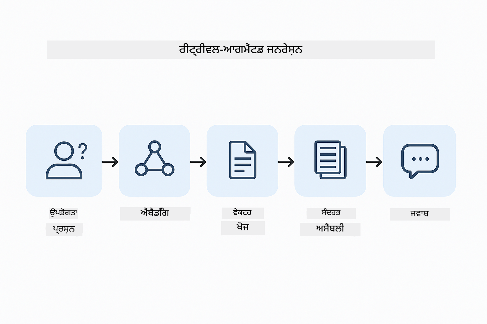
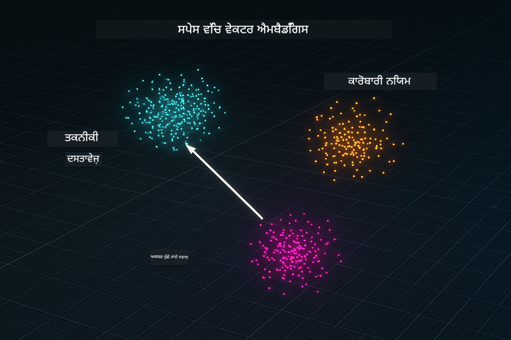
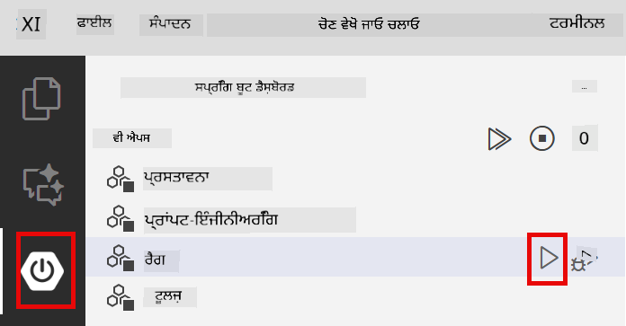
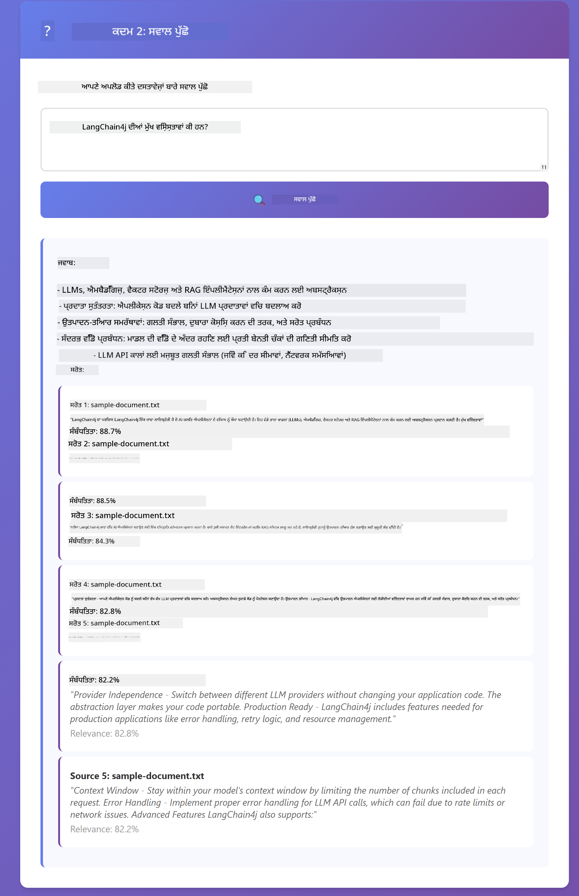

<!--
CO_OP_TRANSLATOR_METADATA:
{
  "original_hash": "81d087662fb3dd7b7124bce1a9c9ec86",
  "translation_date": "2026-01-05T22:51:47+00:00",
  "source_file": "03-rag/README.md",
  "language_code": "pa"
}
-->
# Module 03: RAG (ਰਿਟਰੀਵਲ-ਆਗਮेन्टਡ ਜਨਰੇਸ਼ਨ)

## Table of Contents

- [ਤੁਸੀਂ ਕੀ ਸਿੱਖੋਗੇ](../../../03-rag)
- [ਪੂਰਵਆਵਸ਼ਕਤਾਵਾਂ](../../../03-rag)
- [RAG ਨੂੰ ਸਮਝਣਾ](../../../03-rag)
- [ਇਹ ਕਿਵੇਂ ਕੰਮ ਕਰਦਾ ਹੈ](../../../03-rag)
  - [ਦਸਤਾਵੇਜ਼ ਪ੍ਰੋਸੈਸਿੰਗ](../../../03-rag)
  - [ਇੰਬੈਡਿੰਗ ਬਣਾਉਣਾ](../../../03-rag)
  - [ਸੇਮੈਂਟਿਕ ਖੋਜ](../../../03-rag)
  - [ਜਵਾਬ ਉਤਪੱਤੀ](../../../03-rag)
- [ਐਪਲੀਕੇਸ਼ਨ ਚਲਾਓ](../../../03-rag)
- [ਐਪਲੀਕੇਸ਼ਨ ਦੀ ਵਰਤੋਂ](../../../03-rag)
  - [ਦਸਤਾਵੇਜ਼ ਅਪਲੋਡ ਕਰੋ](../../../03-rag)
  - [ਸਵਾਲ ਪੁੱਛੋ](../../../03-rag)
  - [ਸਰੋਤ ਸੰਦਰਭ ਜਾਂਚੋ](../../../03-rag)
  - [ਸਵਾਲਾਂ ਨਾਲ ਪ੍ਰਯੋਗ ਕਰੋ](../../../03-rag)
- [ਮੁੱਖ ਸੰਕਲਪ](../../../03-rag)
  - [ਚੰਕਿੰਗ ਰਣਨੀਤੀ](../../../03-rag)
  - [ਸਮਾਨਤਾ ਸਕੋਰ](../../../03-rag)
  - [ਇਨ-ਮੈਮੋਰੀ ਸਟੋਰੇਜ](../../../03-rag)
  - [ਸੰਦਰਭ ਵਿੰਡੋ ਪ੍ਰਬੰਧਨ](../../../03-rag)
- [ਕਦੋਂ RAG ਮਹੱਤਵਪੂਰਣ ਹੈ](../../../03-rag)
- [ਅਗਲੇ ਕਦਮ](../../../03-rag)

## ਤੁਹਾਨੂੰ ਕੀ ਸਿੱਖਣ ਨੂੰ ਮਿਲੇਗਾ

ਪਿਛਲੇ ਮਾਡਿਊਲਾਂ ਵਿੱਚ, ਤੁਸੀਂ AI ਨਾਲ ਗੱਲਬਾਤਾਂ ਕਰਨਾ ਅਤੇ ਆਪਣੇ ਪ੍ਰੰਪਟਾਂ ਨੂੰ ਪ੍ਰਭਾਵਸ਼ਾਲੀ ਢੰਗ ਨਾਲ ਬਣਾਉਣਾ ਸਿੱਖਿਆ। ਪਰ ਇੱਕ ਮੂਲ ਸੀਮਾ ਹੈ: ਭਾਸ਼ਾ ਮਾਡਲ ਸਿਰਫ ਉਹੀ ਜਾਣਦੇ ਹਨ ਜੋ ਉਹ ਟਰੇਨਿੰਗ ਦੌਰਾਨ ਸਿੱਖੇ ਹਨ। ਉਹ ਤੁਹਾਡੇ ਕੰਪਨੀ ਦੇ ਨੀਤੀਆਂ, ਪ੍ਰੋਜੈਕਟ ਦਸਤਾਵੇਜ਼ਾਂ ਜਾਂ ਕਿਸੇ ਹੋਰ ਜਾਣਕਾਰੀ ਦਾ ਜਵਾਬ ਨਹੀਂ ਦੇ ਸਕਦੇ ਜੋ ਉਨਾਂ ਨੂੰ ਸਿੱਖਾਈ ਨਹੀਂ ਗਈ।

RAG (ਰਿਟਰੀਵਲ-ਆਗਮੈਂਟਡ ਜਨਰੇਸ਼ਨ) ਇਸ ਸਮੱਸਿਆ ਦਾ ਹੱਲ ਹੈ। ਮਾਡਲ ਨੂੰ ਤੁਹਾਡੀ ਜਾਣਕਾਰੀ ਸਿੱਖਾਉਣ ਦੀ ਕੋਸ਼ਿਸ਼ ਕਰਨ ਦੀ ਬਜਾਏ (ਜੋ ਮਹਿੰਗਾ ਅਤੇ ਅਕਾਰਜਕ ਹੈ), ਤੁਸੀਂ ਇਸਨੂੰ ਤੁਹਾਡੇ ਦਸਤਾਵੇਜ਼ਾਂ ਵਿਚ ਖੋਜ ਕਰਨ ਦੀ ਸਮਰੱਥਾ ਦਿੰਦੇ ਹੋ। ਜਦ ਕੋਈ ਸਵਾਲ ਪੁੱਛਦਾ ਹੈ, ਸਿਸਟਮ ਸਬੰਧਿਤ ਜਾਣਕਾਰੀ ਲੱਭਦਾ ਹੈ ਅਤੇ ਉਸਨੂੰ ਪ੍ਰੰਪਟ ਵਿੱਚ ਸ਼ਾਮਿਲ ਕਰਦਾ ਹੈ। ਫਿਰ ਮਾਡਲ ਉਸ ਪ੍ਰਾਪਤ ਸੰਦਰਭ ਦੇ ਆਧਾਰ 'ਤੇ ਜਵਾਬ ਦਿੰਦਾ ਹੈ।

RAG ਨੂੰ ਇੱਕ ਰੈਫਰੈਂਸ ਲਾਇਬ੍ਰੇਰੀ ਦੇਣ ਵਾਲੇ ਮਾਡਲ ਵਜੋਂ ਸੋਚੋ। ਜਦ ਤੁਸੀਂ ਸਵਾਲ ਪੁੱਛਦੇ ਹੋ, ਸਿਸਟਮ:

1. **ਉਪਭੋਗਤਾ ਕਵੈਰੀ** - ਤੁਸੀਂ ਸਵਾਲ ਪੁੱਛਦੇ ਹੋ  
2. **ਇੰਬੈਡਿੰਗ** - ਤੁਹਾਡੇ ਸਵਾਲ ਨੂੰ ਇੱਕ ਵੈਕਟਰ ਵਜੋਂ ਬਦਲਦਾ ਹੈ  
3. **ਵੈਕਟਰ ਖੋਜ** - ਸਮਾਨ ਦਸਤਾਵੇਜ਼ ਚੰਕ ਲੱਭਦਾ ਹੈ  
4. **ਸੰਦਰਭ ਇਕੱਠਾ ਕਰਨਾ** - ਸਬੰਧਿਤ ਚੰਕ ਪ੍ਰੰਪਟ ਵਿੱਚ ਸ਼ਾਮਿਲ ਕਰਦਾ ਹੈ  
5. **ਜਵਾਬ** - LLM ਉਸ ਸੰਦਰਭ ਦੇ ਆਧਾਰ 'ਤੇ ਜਵਾਬ ਦਿੰਦਾ ਹੈ  

ਇਸ ਤਰ੍ਹਾਂ ਮਾਡਲ ਦੇ ਜਵਾਬ ਤੁਹਾਡੇ ਅਸਲੀ ਡੇਟਾ 'ਤੇ ਆਧਾਰਿਤ ਹੁੰਦੇ ਹਨ ਨਾ ਕਿ ਉਸ ਦੀ ਟਰੇਨਿੰਗ ਜਾਣਕਾਰੀ ਤੇ ਭਰੋਸਾ ਕਰਨ ਜਾਂ ਜਵਾਬ ਬਣਾਉਣ ਤੇ।



*RAG ਵਰਕਫਲੋ - ਉਪਭੋਗਤਾ ਕਵੈਰੀ ਤੋਂ ਸੇਮੈਂਟਿਕ ਖੋਜ ਚੋਂ ਸੰਦਰਭੀ ਜਵਾਬ ਉਤਪੱਤੀ ਤੱਕ*

## ਪੂਰਵਆਵਸ਼ਕਤਾਵਾਂ

- ਮਾਡਿਊਲ 01 ਪੂਰਾ ਕੀਤਾ (Azure OpenAI ਸਰੋਤ ਡਿਪਲੋਇਡ ਹੋਏ)
- ਰੂਟ ਡਾਇਰੈਕਟਰੀ ਵਿੱਚ `.env` ਫਾਈਲ Azue ਪ੍ਰਮਾਣ ਪੱਤਰਾਂ ਨਾਲ (ਮਾਡਿਊਲ 01 ਵਿੱਚ `azd up` ਨਾਲ ਬਣਾਈ ਗਈ)

> **ਨੋਟ:** ਜੇ ਤੁਸੀਂ ਮਾਡਿਊਲ 01 ਪੂਰਾ ਨਹੀਂ ਕੀਤਾ, ਤਾਂ ਪਹਿਲਾਂ ਉਸਦੀ ਡਿਪਲੋਯਮੈਂਟ ਨਿਰਦੇਸ਼ਾਂ ਦੀ ਪਾਲਣਾ ਕਰੋ।

## ਇਹ ਕਿਵੇਂ ਕੰਮ ਕਰਦਾ ਹੈ

### ਦਸਤਾਵੇਜ਼ ਪ੍ਰੋਸੈਸਿੰਗ

[DocumentService.java](../../../03-rag/src/main/java/com/example/langchain4j/rag/service/DocumentService.java)

ਜਦੋਂ ਤੁਸੀਂ ਦਸਤਾਵੇਜ਼ ਅਪਲੋਡ ਕਰਦੇ ਹੋ, ਸਿਸਟਮ ਉਨ੍ਹਾਂ ਨੂੰ ਚੰਕਾਂ ਵਿੱਚ ਵੰਡਦਾ ਹੈ - ਛੋਟੇ ਹਿੱਸੇ ਜੋ ਮਾਡਲ ਦੇ ਸੰਦਰਭ ਵਿੰਡੋ ਵਿੱਚ ਆਰਾਮਦਾਇਕ ਤੌਰ ਤੇ ਫਿੱਟ ਹੁੰਦੇ ਹਨ। ਇਹ ਚੰਕ ਥੋੜ੍ਹੇ ਜਿਹੇ ਇੱਕ ਦੂਜੇ ਨਾਲ ਓਵਰਲੈਪ ਹੋਂਦੇ ਹਨ ਤਾਂ ਜੋ ਬਾਊਂਡਰੀਜ਼ 'ਤੇ ਸੰਦਰਭ ਨਾ ਜ਼ਾਇਆ ਹੋਵੇ।

```java
Document document = FileSystemDocumentLoader.loadDocument("sample-document.txt");

DocumentSplitter splitter = DocumentSplitters
    .recursive(300, 30, new OpenAiTokenizer());

List<TextSegment> segments = splitter.split(document);
```

> **🤖 [GitHub Copilot](https://github.com/features/copilot) ਚੈਟ ਨਾਲ ਕੋਸ਼ਿਸ਼ ਕਰੋ:** ਖੋਲ੍ਹੋ [`DocumentService.java`](../../../03-rag/src/main/java/com/example/langchain4j/rag/service/DocumentService.java) ਅਤੇ ਪੁੱਛੋ:  
> - "LangChain4j ਦਸਤਾਵੇਜ਼ਾਂ ਨੂੰ ਚੰਕਾਂ ਵਿੱਚ ਕਿਵੇਂ ਵੰਡਦਾ ਹੈ ਅਤੇ ਓਵਰਲੈਪ ਕਿਉਂ ਮਹੱਤਵਪੂਰਣ ਹੈ?"  
> - "ਵੱਖ-ਵੱਖ ਦਸਤਾਵੇਜ਼ ਕਿਸਮਾਂ ਲਈ ਚੰਕ ਦਾ ਆਦਰਸ਼ ਆਕਾਰ ਕੀ ਹੈ ਅਤੇ ਕਿਉਂ?"  
> - "ਮੈਂ ਕਿਵੇਂ ਵੱਖ-ਵੱਖ ਭਾਸ਼ਾਵਾਂ ਜਾਂ ਖਾਸ ਫਾਰਮੈਟਿੰਗ ਵਾਲੇ ਦਸਤਾਵੇਜ਼ਾਂ ਨੂੰ ਸੰਭਾਲਾਂ?"

### ਇੰਬੈਡਿੰਗ ਬਣਾਉਣਾ

[LangChainRagConfig.java](../../../03-rag/src/main/java/com/example/langchain4j/rag/config/LangChainRagConfig.java)

ਹਰ ਚੰਕ ਨੂੰ ਇੱਕ ਸੰਖਿਆਤਮਕ ਪ੍ਰਤੀਨਿਧਤਾਵਾ ਵਿੱਚ ਬਦਲਿਆ ਜਾਂਦਾ ਹੈ ਜਿਸਨੂੰ ਇੰਬੈਡਿੰਗ ਕਹਿੰਦੇ ਹਨ - ਮੂਲ ਰੂਪ ਵਿੱਚ ਇੱਕ ਗਣਿਤੀ ਅੰਗੁਠਾ ਨਿਸ਼ਾਨ ਜੋ ਪਾਠ ਦਾ ਅਰਥ ਸਮੇਤਦਾ ਹੈ। ਸਮਾਨ ਪਾਠ ਸਮਾਨ ਇੰਬੈਡਿੰਗ ਬਣਾਂਦਾ ਹੈ।

```java
@Bean
public EmbeddingModel embeddingModel() {
    return OpenAiOfficialEmbeddingModel.builder()
        .baseUrl(azureOpenAiEndpoint)
        .apiKey(azureOpenAiKey)
        .modelName(azureEmbeddingDeploymentName)
        .build();
}

EmbeddingStore<TextSegment> embeddingStore = 
    new InMemoryEmbeddingStore<>();
```



*ਦਸਤਾਵੇਜ਼ ਇੰਬੈਡਿੰਗ ਸਪੇਸ ਵਿੱਚ ਵੈਕਟਰਾਂ ਵਾਂਗ ਪ੍ਰਤੀਨਿਧਿਤ - ਸਮਾਨ ਸਮੱਗਰੀ ਗਰੁੱਪ ਬਣਾਉਂਦੀ ਹੈ*

### ਸੇਮੈਂਟਿਕ ਖੋਜ

[RagService.java](../../../03-rag/src/main/java/com/example/langchain4j/rag/service/RagService.java)

ਜਦੋਂ ਤੁਸੀਂ ਸਵਾਲ ਪੁੱਛਦੇ ਹੋ, ਤੁਹਾਡਾ ਸਵਾਲ ਵੀ ਇੱਕ ਇੰਬੈਡਿੰਗ ਬਣ ਜਾਂਦਾ ਹੈ। ਸਿਸਟਮ ਤੁਹਾਡੇ ਸਵਾਲ ਦੀ ਇੰਬੈਡਿੰਗ ਦੀ ਤੁਲਨਾ ਸਾਰੇ ਦਸਤਾਵੇਜ਼ ਚੰਕਾਂ ਦੀ ਇੰਬੈਡਿੰਗ ਨਾਲ ਕਰਦਾ ਹੈ। ਇਹ ਚੰਕ ਉਹ ਲੱਭਦਾ ਹੈ ਜਿਨ੍ਹਾਂ ਦਾ ਅਰਥ ਸਭ ਤੋਂ ਵੱਧ ਮਿਲਦਾ ਜੁਲਦਾ ਹੈ - ਸਿਰਫ ਕੁੰਜੀਸ਼ਬਦਾਂ ਲਈ ਨਹੀਂ, ਪਰ ਵਾਸਤਵਿਕ ਸਿਹਤੀ ਸਮਾਨਤਾ ਲਈ।

```java
Embedding queryEmbedding = embeddingModel.embed(question).content();

List<EmbeddingMatch<TextSegment>> matches = 
    embeddingStore.findRelevant(queryEmbedding, 5, 0.7);

for (EmbeddingMatch<TextSegment> match : matches) {
    String relevantText = match.embedded().text();
    double score = match.score();
}
```

> **🤖 [GitHub Copilot](https://github.com/features/copilot) ਚੈਟ ਨਾਲ ਕੋਸ਼ਿਸ਼ ਕਰੋ:** ਖੋਲ੍ਹੋ [`RagService.java`](../../../03-rag/src/main/java/com/example/langchain4j/rag/service/RagService.java) ਅਤੇ ਪੁੱਛੋ:  
> - "ਇੰਬੈਡਿੰਗ ਨਾਲ ਸਮਾਨਤਾ ਖੋਜ ਕਿਵੇਂ ਕੰਮ ਕਰਦੀ ਹੈ ਅਤੇ ਸਕੋਰ ਕੀ ਨਿਰਧਾਰਤ ਕਰਦਾ ਹੈ?"  
> - "ਮੈਂ ਕਿਹੜਾ similarity threshold ਵਰਤਾਂ ਅਤੇ ਇਹ ਨਤੀਜਿਆਂ ਨੂੰ ਕਿਵੇਂ ਪ੍ਰਭਾਵਿਤ ਕਰਦਾ ਹੈ?"  
> - "ਜਦੋਂ ਕੋਈ ਅਨੁਕੂਲ ਦਸਤਾਵੇਜ਼ ਨਾ ਮਿਲੇ ਤਾਂ ਮੈਂ ਕਿਵੇਂ ਸੰਜਾਲਾਂ?"

### ਜਵਾਬ ਉਤਪੱਤੀ

[RagService.java](../../../03-rag/src/main/java/com/example/langchain4j/rag/service/RagService.java)

ਸਭ ਤੋਂ ਸਬੰਧਿਤ ਚੰਕ ਮਾਡਲ ਨੂੰ ਪ੍ਰੰਪਟ ਵਿੱਚ ਸ਼ਾਮਿਲ ਕੀਤੇ ਜਾਂਦੇ ਹਨ। ਮਾਡਲ ਉਹਨਾਂ ਖਾਸ ਚੰਕਾਂ ਨੂੰ ਪੜ੍ਹਦਾ ਹੈ ਅਤੇ ਉਸ ਜਾਣਕਾਰੀ ਦੇ ਆਧਾਰ 'ਤੇ ਤੁਹਾਡੇ ਸਵਾਲ ਦਾ ਜਵਾਬ ਦਿੰਦਾ ਹੈ। ਇਸ ਨਾਲ ਹਲੂਸੀਨੇਸ਼ਨ ਰੋਕੀ ਜਾਂਦੀ ਹੈ - ਮਾਡਲ ਸਿਰਫ ਉਸੇ ਵਿੱਚੋਂ ਜਵਾਬ ਦੇ ਸਕਦਾ ਹੈ ਜੋ ਉਸਦੇ ਸਾਹਮਣੇ ਹੈ।

## ਐਪਲੀਕੇਸ਼ਨ ਚਲਾਓ

**ਡਿਪਲੋਯਮੈਂਟ ਦੀ ਜਾਂਚ ਕਰੋ:**

ਪੱਕਾ ਕਰੋ ਕਿ ਰੂਟ ਡਾਇਰੈਕਟਰੀ ਵਿੱਚ `.env` ਫਾਈਲ ਮੌਜੂਦ ਹੈ ਜਿਸ ਵਿੱਚ Azure ਕ੍ਰੈਡੈਂਸ਼ਲ ਹਨ (ਮਾਡਿਊਲ 01 ਦੌਰਾਨ ਬਣਾਈ ਗਈ):
```bash
cat ../.env  # AZURE_OPENAI_ENDPOINT, API_KEY, DEPLOYMENT ਦਿਖਾਣਾ ਚਾਹੀਦਾ ਹੈ
```

**ਐਪਲੀਕੇਸ਼ਨ ਸ਼ੁਰੂ ਕਰੋ:**

> **ਨੋਟ:** ਜੇ ਤੁਸੀਂ ਪਹਿਲਾਂ ਹੀ Module 01 ਤੋਂ `./start-all.sh` ਨਾਲ ਸਾਰੇ ਐਪਲੀਕੇਸ਼ਨ ਚਲਾ ਚੁੱਕੇ ਹੋ, ਤਾਂ ਇਹ ਮਾਡਿਊਲ ਪਹਿਲਾਂ ਹੀ ਪੋਰਟ 8081 'ਤੇ ਚੱਲ ਰਿਹਾ ਹੈ। ਤੁਸੀਂ ਹੇਠਾਂ ਦਿੱਤੇ ਕਮਾਂਡਾਂ ਨੂੰ ਛੱਡ ਕੇ ਸਿੱਧਾ http://localhost:8081 'ਤੇ ਜਾ ਸਕਦੇ ਹੋ।

**ਚੋਣ 1: ਸਪ੍ਰਿੰਗ ਬੂਟ ਡੈਸ਼ਬੋਰਡ ਦੀ ਵਰਤੋਂ (VS Code ਵਰਤੋਂਕਾਰਾਂ ਲਈ ਭਲਾਂਮਨ ਦਿਓ)**

ਡੇਵ ਕਨਟੇਨਰ ਵਿੱਚ ਸਪ੍ਰਿੰਗ ਬੂਟ ਡੈਸ਼ਬੋਰਡ ਐਕਸਟੈਂਸ਼ਨ ਸ਼ਾਮਿਲ ਹੈ, ਜੋ ਸਾਰੇ ਸਪ੍ਰਿੰਗ ਬੂਟ ਐਪਲੀਕੇਸ਼ਨਾਂ ਨੂੰ ਪ੍ਰਬੰਧਿਤ ਕਰਨ ਲਈ ਵਿਜ਼ੂਅਲ ਇੰਟਰਫੇਸ ਦਿੰਦਾ ਹੈ। ਤੁਸੀਂ ਇਸਨੂੰ VS Code ਦੇ ਖੱਬੇ ਪਾਸੇ ਐਕਟਿਵਿਟੀ ਬਾਰ ਵਿੱਚ ਸਪ੍ਰਿੰਗ ਬੂਟ ਚਿਨ੍ਹ ਨਾਲ ਲੱਭ ਸਕਦੇ ਹੋ।

ਸਪ੍ਰਿੰਗ ਬੂਟ ਡੈਸ਼ਬੋਰਡ ਤੋਂ, ਤੁਸੀਂ:  
- ਕਲ_workspace_ ਵਿੱਚ ਸਾਰੇ ਉਪਲਬਧ ਸਪ੍ਰਿੰਗ ਬੂਟ ਐਪਲੀਕੇਸ਼ਨ ਦੇਖ ਸਕਦੇ ਹੋ  
- ਇੱਕ ਕਲਿੱਕ ਨਾਲ ਐਪਲੀਕੇਸ਼ਨਾਂ ਨੂੰ ਸ਼ੁਰੂ/ਰੋਕ ਸਕਦੇ ਹੋ  
- ਐਪਲੀਕੇਸ਼ਨ ਲੋਗਾਂ ਨੂੰ ਅਸਲ ਸਮੇਂ ਵਿੱਚ ਵੇਖ ਸਕਦੇ ਹੋ  
- ਐਪਲੀਕੇਸ਼ਨ ਦੀ ਸਥਿਤੀ ਦੀ ਨਿਗਰਾਨੀ ਕਰ ਸਕਦੇ ਹੋ  

ਸਿਰਫ "rag" ਦੇ ਨਾਲ ਪਲੇ ਬਟਨ 'ਤੇ ਕਲਿੱਕ ਕਰਕੇ ਇਹ ਮਾਡਿਊਲ ਸ਼ੁਰੂ ਕਰੋ ਜਾਂ ਸਾਰੇ ਮਾਡਿਊਲ ਇਕੱਠੇ ਸ਼ੁਰੂ ਕਰੋ।



**ਚੋਣ 2: ਸ਼ੈੱਲ ਸਕ੍ਰਿਪਟਾਂ ਦੀ ਵਰਤੋਂ**

ਸਾਰੇ ਵੈੱਬ ਐਪਲੀਕੇਸ਼ਨਾਂ (ਮਾਡਿਊਲ 01-04) ਸ਼ੁਰੂ ਕਰੋ:

**Bash:**
```bash
cd ..  # ਰੂਟ ਡਾਇਰੈਕਟਰੀ ਤੋਂ
./start-all.sh
```

**PowerShell:**
```powershell
cd ..  # ਰੂਟ ਡਾਇਰੈਕਟਰੀ ਤੋਂ
.\start-all.ps1
```

ਜਾਂ ਸਿਰਫ ਇਹ ਮਾਡਿਊਲ ਚਲਾਓ:

**Bash:**
```bash
cd 03-rag
./start.sh
```

**PowerShell:**
```powershell
cd 03-rag
.\start.ps1
```

ਦੋਹਾਂ ਸਕ੍ਰਿਪਟਾਂ ਸਵੈਚਾਲਿਤ ਤੌਰ 'ਤੇ ਰੂਟ `.env` ਫਾਈਲ ਤੋਂ ਵਾਤਾਵਰਨ ਪ੍ਰਭਾਵਾਂ ਲੋਡ ਕਰਦੀਆਂ ਹਨ ਅਤੇ ਜੇ ਜਾਰਜ਼ ਮੌਜੂਦ ਨਹੀਂ ਹਨ ਤਾਂ ਉਹਨਾਂ ਨੂੰ ਬਣਾਉਂਦੀਆਂ ਹਨ।

> **ਨੋਟ:** ਜੇ ਤੁਸੀਂ ਸਾਰੇ ਮਾਡਿਊਲਾਂ ਨੂੰ ਹੱਥੋਂ ਬਣਾਉਣਾ ਪਸੰਦ ਕਰਦੇ ਹੋ, ਤਾਂ ਸ਼ੁਰੂ ਕਰਨ ਲਈ:  
> **Bash:**  
> ```bash
> cd ..  # Go to root directory
> mvn clean package -DskipTests
> ```
>  
> **PowerShell:**  
> ```powershell
> cd ..  # Go to root directory
> mvn clean package -DskipTests
> ```
  
ਆਪਣੇ ਬ੍ਰਾਊਜ਼ਰ ਵਿੱਚ http://localhost:8081 ਖੋਲ੍ਹੋ।

**ਰੋਕਣ ਲਈ:**

**Bash:**  
```bash
./stop.sh  # ਸਿਰਫ ਇਹ ਮੌਡੀਊਲ
# ਜਾਂ
cd .. && ./stop-all.sh  # ਸਾਰੇ ਮੌਡੀਊਲ
```
  
**PowerShell:**  
```powershell
.\stop.ps1  # ਇਹ ਮੋਡਿਊਲ ਸਿਰਫ਼
# ਜਾਂ
cd ..; .\stop-all.ps1  # ਸਾਰੇ ਮੋਡਿਊਲ
```


## ਐਪਲੀਕੇਸ਼ਨ ਦੀ ਵਰਤੋਂ

ਐਪਲੀਕੇਸ਼ਨ ਦਸਤਾਵੇਜ਼ ਅਪਲੋਡ ਅਤੇ ਸਵਾਲ ਪੁੱਛਣ ਲਈ ਵੈੱਬ ਇੰਟਰਫੇਸ ਪ੍ਰਦਾਨ ਕਰਦਾ ਹੈ।

<a href="images/rag-homepage.png"></a>

*RAG ਐਪਲੀਕੇਸ਼ਨ ਇੰਟਰਫੇਸ - ਦਸਤਾਵੇਜ਼ ਅਪਲੋਡ ਕਰੋ ਅਤੇ ਸਵਾਲ ਪੁੱਛੋ*

### ਦਸਤਾਵੇਜ਼ ਅਪਲੋਡ ਕਰੋ

ਦਸਤਾਵੇਜ਼ ਅਪਲੋਡ ਕਰਕੇ ਸ਼ੁਰੂ ਕਰੋ - ਟੀਐਕਸਟ ਫਾਇਲਾਂ ਟੈਸਟ ਕਰਨ ਲਈ ਸਭ ਤੋਂ ਵਧੀਆ ਹਨ। ਇਸ ਡਾਇਰੈਕਟਰੀ ਵਿੱਚ ਇੱਕ `sample-document.txt` ਦਿੱਤੀ ਗਈ ਹੈ ਜਿਸ ਵਿੱਚ LangChain4j ਫੀਚਰਾਂ, RAG ਇੰਪਲਿਮੈਂਟੇਸ਼ਨ ਅਤੇ ਚੰਗੀਆਂ ਪ੍ਰਕਿਰਿਆਵਾਂ ਬਾਰੇ ਜਾਣਕਾਰੀ ਹੈ - ਜੋ ਸਿਸਟਮ ਦੇ ਟੈਸਟ ਲਈ ਬੇਹਤਰ ਹੈ।

ਸਿਸਟਮ ਤੁਹਾਡੇ ਦਸਤਾਵੇਜ਼ ਨੂੰ ਪ੍ਰੋਸੈਸ ਕਰਦਾ ਹੈ, ਉਨ੍ਹਾਂ ਨੂੰ ਚੰਕਾਂ ਵਿੱਚ ਵੰਡਦਾ ਹੈ, ਅਤੇ ਹਰ ਚੰਕ ਲਈ ਇੰਬੈਡਿੰਗ ਬਣਾਉਂਦਾ ਹੈ। ਇਹ ਸਭ automatically ਉਪਲੋਡ ਕਰਦੇ ਸਮੇਂ ਹੁੰਦਾ ਹੈ।

### ਸਵਾਲ ਪੁੱਛੋ

ਹੁਣ ਦਸਤਾਵੇਜ਼ ਸਮੱਗਰੀ ਬਾਰੇ ਵਿਸ਼ੇਸ਼ ਸਵਾਲ ਪੁੱਛੋ। ਕੁਝ ਅਜਿਹਾ ਪੁੱਛੋ ਜੋ ਦਸਤਾਵੇਜ਼ ਵਿੱਚ ਸਪਸ਼ਟ ਤੌਰ 'ਤੇ ਉਲਲੇਖਿਤ ਹੋਵੇ। ਸਿਸਟਮ ਸਬੰਧਿਤ ਚੰਕ ਲੱਭਦਾ ਹੈ, ਉਨ੍ਹਾਂ ਨੂੰ ਪ੍ਰੰਪਟ ਵਿੱਚ ਸ਼ਾਮਿਲ ਕਰਦਾ ਹੈ, ਅਤੇ ਜਵਾਬ ਬਣਾਉਂਦਾ ਹੈ।

### ਸਰੋਤ ਸੰਦਰਭ ਜਾਂਚੋ

ਧਿਆਨ ਦਿਓ ਕਿ ਹਰ ਜਵਾਬ ਵਿੱਚ ਸਰੋਤ ਸੰਦਰਭ ਅਤੇ similarity scores شامل ਹਨ। ਇਹ ਸਕੋਰ (0 ਤੋਂ 1 ਤੱਕ) ਦਿਖਾਉਂਦੇ ਹਨ ਕਿ ਹਰ ਚੰਕ ਤੁਹਾਡੇ ਸਵਾਲ ਨਾਲ ਕਿੰਨਾ ਸਬੰਧਿਤ ਸੀ। ਉੱਚੇ ਸਕੋਰ ਦਾ ਮਤਲਬ ਵਧੀਆ ਮਿਲਾਪ ਹੈ। ਇਸ ਨਾਲ ਤੁਸੀਂ ਜਵਾਬ ਨੂੰ ਸਰੋਥ ਮਾਦਾ ਨਾਲ ਪ੍ਰਮਾਣਿਤ ਕਰ ਸਕਦੇ ਹੋ।

<a href="images/rag-query-results.png"></a>

*ਕਵੈਰੀ ਨਤੀਜੇ ਦੇਖਾਏ ਜਾ ਰਹੇ ਹਨ ਜਵਾਬ ਨਾਲ ਸਰੋਤ ਸੰਦਰਭ ਅਤੇ ਮਿਲਾਪ ਸਕੋਰਾਂ ਸਮੇਤ*

### ਸਵਾਲਾਂ ਨਾਲ ਪ੍ਰਯੋਗ ਕਰੋ

ਭਿੰਨ ਪ੍ਰਕਾਰ ਦੇ ਸਵਾਲਾਂ ਦੀ ਕੋਸ਼ਿਸ਼ ਕਰੋ:  
- ਵਿਸ਼ੇਸ਼ ਤੱਥ: "ਮੁੱਖ ਵਿਸ਼ਾ ਕੀ ਹੈ?"  
- ਤੁਲਨਾ: "X ਅਤੇ Y ਵਿੱਚ ਕੀ ਫਰਕ ਹੈ?"  
- ਸੰਖੇਪ: "Z ਬਾਰੇ ਮੁੱਖ ਬਿੰਦੂ ਸੰਖੇਪ ਕਰੋ"  

ਜ਼ੁਰੂਰੀ ਨਹੀਂ ਕਿ ਹਰ ਸਵਾਲ ਸੰਦਰਭ ਨੂੰ ਕਿਵੇਂ ਬਦਲਦਾ ਹੈ, ਇਸਨੂੰ ਧਿਆਨ ਨਾਲ ਦੇਖੋ।

## ਮੁੱਖ ਸੰਕਲਪ

### ਚੰਕਿੰਗ ਰਣਨੀਤੀ

ਦਸਤਾਵੇਜ਼ਾਂ ਨੂੰ 300-ਟੋਕਨ ਦੇ ਚੰਕਾਂ ਵਿੱਚ ਵੰਡਿਆ ਜਾਂਦਾ ਹੈ ਜਿੱਥੇ 30 ਟੋਕਨ ਦਾ ਓਵਰਲੈਪ ਹੁੰਦਾ ਹੈ। ਇਹ ਸੰਤੁਲਨ ਇਸ ਗੱਲ ਨੂੰ ਯਕੀਨੀ ਬਣਾਉਂਦਾ ਹੈ ਕਿ ਹਰ ਚੰਕ ਵਿੱਚ ਕਾਫੀ ਸੰਦਰਭ ਹੁੰਦਾ ਹੈ ਅਤੇ ਉਨ੍ਹਾਂ ਨੂੰ ਪ੍ਰੰਪਟ ਵਿੱਚ ਛੋਟਾ ਰੱਖਿਆ ਜਾ ਸਕਦਾ ਹੈ।

### ਸਮਾਨਤਾ ਸਕੋਰ

ਸਕੋਰ 0 ਤੋਂ 1 ਤੱਕ ਹੁੰਦੇ ਹਨ:  
- 0.7-1.0: ਬਹੁਤ ਸਬੰਧਿਤ, ਬਿਲਕੁਲ ਮੇਲ  
- 0.5-0.7: ਸਬੰਧਿਤ, ਚੰਗਾ ਸੰਦਰਭ  
- 0.5 ਤੋਂ ਘੱਟ: ਛਾਂਟੀ ਕੀਤੇ, ਬਹੁਤ ਵੱਖਰੇ  

ਸਿਸਟਮ ਸਿਰਫ ਉਹੀ ਚੰਕ ਲੱਭਦਾ ਹੈ ਜੋ ਘੱਟੋ-ਘੱਟ ਯੋਗਤਾ ਥ੍ਰੈਸ਼ਹੋਲਡ ਪੂਰਾ ਕਰਦੇ ਹਨ।

### ਇਨ-ਮੈਮੋਰੀ ਸਟੋਰੇਜ  

ਇਹ ਮਾਡਿਊਲ ਸਰਲਤਾ ਲਈ ਇਨ-ਮੈਮੋਰੀ ਸਟੋਰੇਜ ਦੀ ਵਰਤੋਂ ਕਰਦਾ ਹੈ। ਜਦੋਂ ਤੁਸੀਂ ਐਪਲੀਕੇਸ਼ਨ ਨੂੰ ਰੀਸਟਾਰਟ ਕਰਦੇ ਹੋ, ਅਪਲੋਡ ਕੀਤੇ ਦਸਤਾਵੇਜ਼ ਗੁੰਮ ਹੋ ਜਾਂਦੇ ਹਨ। ਪ੍ਰੋਡਕਸ਼ਨ ਸਿਸਟਮ ਕਾਇਮ ਰਹਿਣ ਵਾਲੇ ਵੈਕਟਰ ਡੇਟਾਬੇਸਾਂ ਵਰਗੇ Qdrant ਜਾਂ Azure AI Search ਵਰਤਦੇ ਹਨ।

### ਸੰਦਰਭ ਵਿੰਡੋ ਪ੍ਰਬੰਧਨ

ਹਰ ਮਾਡਲ ਦੀ ਇੱਕ ਵੱਧ ਤੋਂ ਵੱਧ ਸੰਦਰਭ ਵਿੰਡੋ ਹੁੰਦੀ ਹੈ। ਤੁਸੀਂ ਵੱਡੇ ਦਸਤਾਵੇਜ਼ ਦੇ ਸਾਰੇ ਚੰਕ ਪ੍ਰੰਪਟ ਵਿੱਚ ਸ਼ਾਮਿਲ ਨਹੀਂ ਕਰ ਸਕਦੇ। ਸਿਸਟਮ ਸਭ ਤੋਂ ਸਬੰਧਿਤ ਵਰਗੀ ਚੰਕਾਂ ਨੂੰ ਲਿਆਂਦਾ ਹੈ (ਡਿਫ਼ਾਲਟ 5) ਤਾਂ ਜੋ ਸਹੀ ਜਵਾਬ ਦੇਣ ਲਈ ਕਾਫੀ ਸੰਦਰਭ ਮਿਲੇ ਅਤੇ ਹੱਦਾਂ ਵਿੱਚ ਰਹਿ ਸਕੇ।

## ਕਦੋਂ RAG ਮਹੱਤਵਪੂਰਣ ਹੈ

**RAG ਦੀ ਵਰਤੋਂ ਕਰੋ ਜਦੋਂ:**  
- ਪ੍ਰੋਪਾਈਟਰੀ ਦਸਤਾਵੇਜ਼ਾਂ ਬਾਰੇ ਸਵਾਲਾਂ ਦੇ ਜਵਾਬ ਦੇਣੇ ਹੋਣ  
- ਜਾਣਕਾਰੀ ਬਦਲਦੀ ਰਹਿੰਦੀ ਹੋਵੇ (ਨੀਤੀਆਂ, ਕੀਮਤਾਂ, ਵਿਸ਼ੇਸ਼ਤਾਵਾਂ)  
- ਸਹੀਤਾ ਲਈ ਸਰੋਤ ਸਬੂਤ ਲੋੜੀਂਦੇ ਹੋਣ  
- ਸਮੱਗਰੀ ਇੱਕਲਾਉਣ ਵਾਲੇ ਪ੍ਰੰਪਟ ਵਿੱਚ ਨਾ ਆ ਸਕੇ  
- ਤੁਹਾਨੂੰ ਪਰਖੇ ਜਾ ਸਕਣ ਵਾਲੇ, ਗਰਾਊਂਡਡ ਜਵਾਬ ਚਾਹੀਦੇ ਹੋਣ

**RAG ਦੀ ਵਰਤੋਂ ਨਾ ਕਰੋ ਜਦੋਂ:**  
- ਸਵਾਲ ਉਹਨਾਂ ਵਿਚਾਰਧਾਰਾਵਾਂ ਨਾਲ ਸਬੰਧਿਤ ਹੋਣ ਜੋ ਮਾਡਲ ਪਹਿਲਾਂ ਹੀ ਜਾਣਦਾ ਹੈ  
- ਤਤਕਾਲ ਡੇਟਾ ਦੀ ਲੋੜ ਹੋਵੇ (RAG ਸਿਰਫ ਅਪਲੋਡ ਕੀਤੇ ਦਸਤਾਵੇਜ਼ਾਂ 'ਤੇ ਕੰਮ ਕਰਦਾ ਹੈ)  
- ਸਮੱਗਰੀ ਪ੍ਰੰਪਟ ਵਿੱਚ ਡਾਇਰੈਕਟ ਸ਼ਾਮਿਲ ਕਰਨ ਲਈ ਛੋਟੀ ਹੋਵੇ

## ਅਗਲੇ ਕਦਮ

**ਅਗਲਾ ਮਾਡਿਊਲ:** [04-tools - AI ਏਜੰਟਸ ਵਿਥ ਟੂਲਜ਼](../04-tools/README.md)

---

**ਲੇਖੇ-ਜੋਖੇ:** [← ਪਿਛਲਾ: ਮਾਡਿਊਲ 02 - ਪ੍ਰੰਪਟ ਇੰਜੀਨੀਅਰਿੰਗ](../02-prompt-engineering/README.md) | [ਮੁੱਖ ਪੰਨਾ](../README.md) | [ਅਗਲਾ: ਮਾਡਿਊਲ 04 - ਟੂਲਜ਼ →](../04-tools/README.md)

---

<!-- CO-OP TRANSLATOR DISCLAIMER START -->
**ਅਸਵੀਕਾਰਨ**:  
ਇਹ ਦਸਤਾਵੇਜ਼ AI ਅਨੁਵਾਦ ਸੇਵਾ [Co-op Translator](https://github.com/Azure/co-op-translator) ਦੀ ਵਰਤੋਂ ਕਰਕੇ ਅਨੁਵਾਦ ਕੀਤਾ ਗਿਆ ਹੈ। ਜਦੋਂ ਕਿ ਅਸੀਂ ਸਹੀ ਅਨੁਵਾਦ ਲਈ ਯਤਨਸ਼ੀਲ ਹਾਂ, ਕਿਰਪਾ ਕਰਕੇ ਧਿਆਨ ਵਿੱਚ ਰੱਖੋ ਕਿ ਸਵੈਚਲਿਤ ਅਨੁਵਾਦਾਂ ਵਿੱਚ ਗਲਤੀਆਂ ਜਾਂ ਅਸਪਸ਼ਟਤਾਵਾਂ ਹੋ ਸਕਦੀਆਂ ਹਨ। ਮੂਲ ਦਸਤਾਵੇਜ਼ ਆਪਣੇ ਮੂਲ ਭਾਸ਼ਾ ਵਿੱਚ ਅਧਿਕਾਰਤ ਸਰੋਤ ਮੰਨਿਆ ਜਾਣਾ ਚਾਹੀਦਾ ਹੈ। ਮਹੱਤਵਪੂਰਨ ਜਾਣਕਾਰੀ ਲਈ, ਪ੍ਰੋਫੈਸ਼ਨਲ ਮਨੁੱਖੀ ਅਨੁਵਾਦ ਦੀ ਸਿਫਾਰਿਸ਼ ਕੀਤੀ ਜਾਂਦੀ ਹੈ। ਅਸੀਂ ਇਸ ਅਨੁਵਾਦ ਦੀ ਵਰਤੋਂ ਨਾਲ ਹੋਣ ਵਾਲੀ ਕਿਸੇ ਵੀ ਭ੍ਰਮ ਜਾਂ ਗਲਤ ਫਹਿਮੀ ਲਈ ਜ਼ਿੰਮੇਵਾਰ ਨਹੀਂ ਹਾਂ।
<!-- CO-OP TRANSLATOR DISCLAIMER END -->