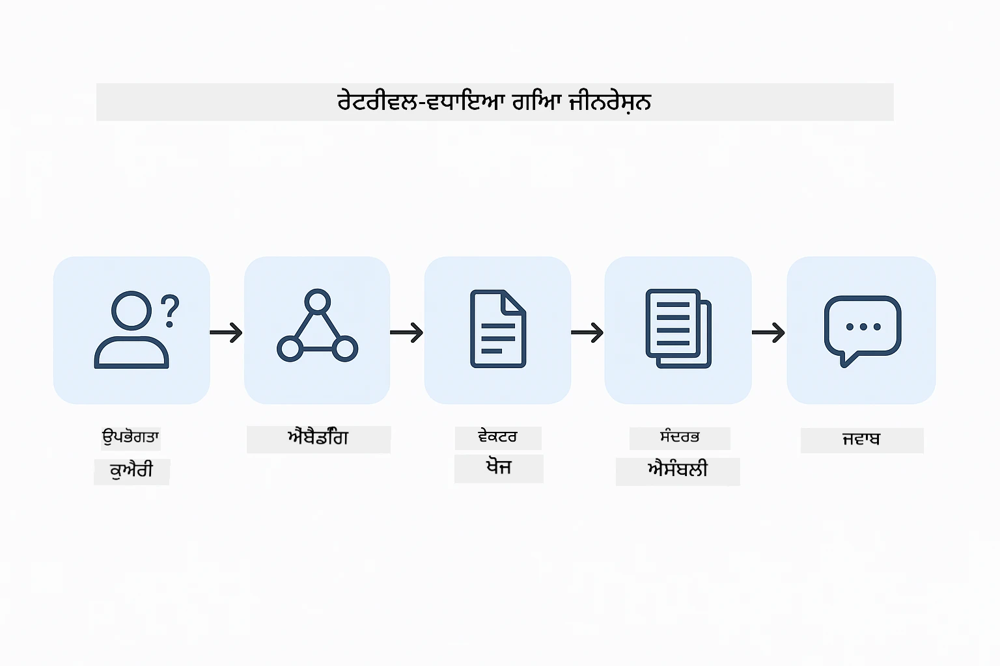
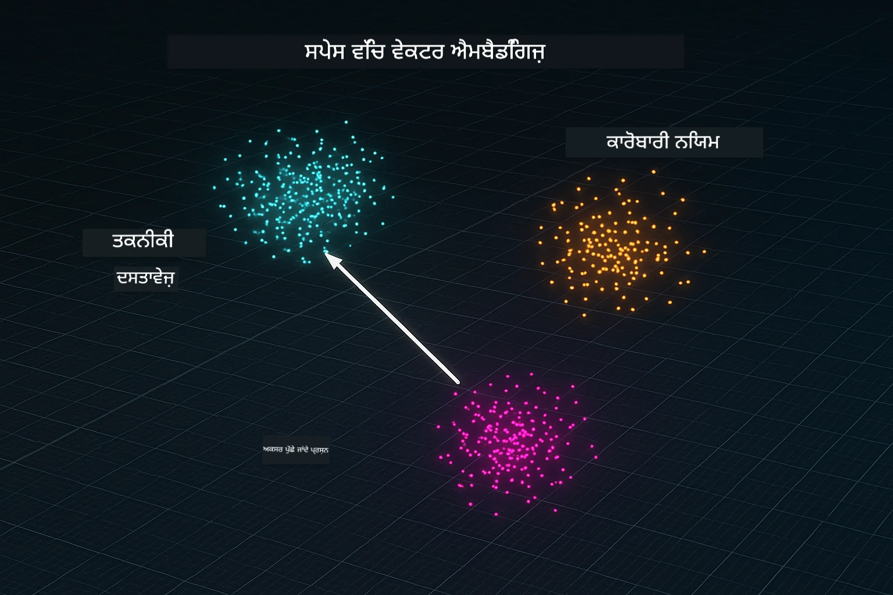
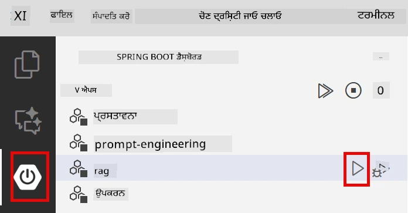
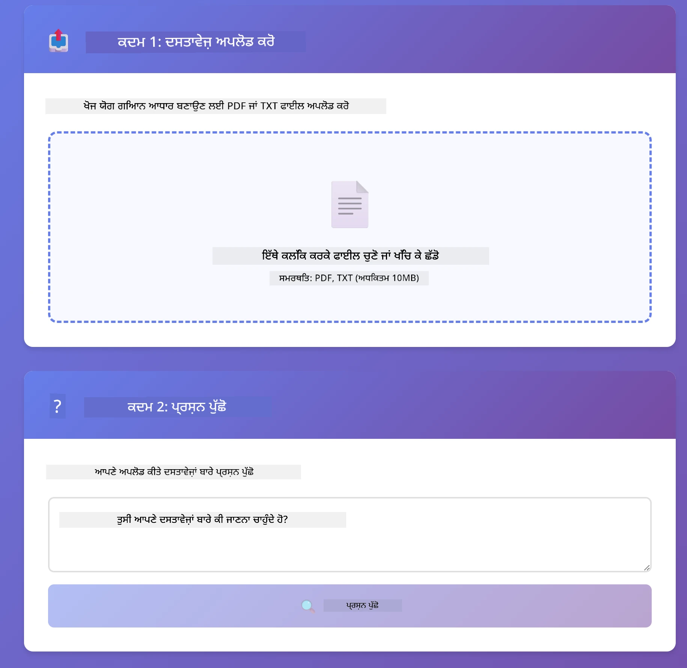
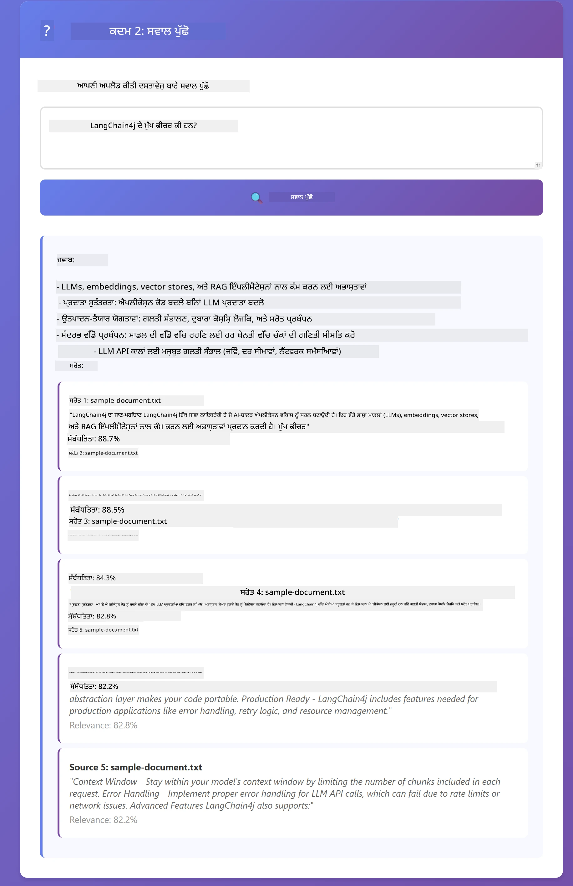

# ਮੌਡੀਊਲ 03: RAG (ਰ retrieval-ਵਧੀਆ ਜਨਰੇਸ਼ਨ)

## ਸੂਚੀ ਸਾਰਣੀ

- [ਵਿਡੀਓ ਵਾਕਥਰੂ](#ਵਿਡੀਓ-ਵਾਕਥਰੂ)
- [ਤੁਸੀਂ ਕੀ ਸਿੱਖੋਗੇ](#ਤੁਸੀਂ-ਕੀ-ਸਿੱਖੋਗੇ)
- [ਪੂਰਵਜਾਣਕਾਰੀ](#ਪੂਰਵਜਾਣਕਾਰੀ)
- [RAG ਨੂੰ ਸਮਝਣਾ](#rag-ਨੂੰ-ਸਮਝਣਾ)
  - [ਇਸ ਟਿਊਟੋਰੀਅਲ ਲਈ ਕਿਹੜਾ RAG ਤਰੀਕਾ ਵਰਤਿਆ ਗਿਆ ਹੈ?](#ਇਸ-ਟਿਊਟੋਰੀਅਲ-ਵਿੱਚ-ਕਿਹੜਾ-rag-ਤਰੀਕਾ-ਵਰਤਿਆ-ਜਾਂਦਾ-ਹੈ)
- [ਇਹ ਕਿਵੇਂ ਕੰਮ ਕਰਦਾ ਹੈ](#ਇਹ-ਕਿਵੇਂ-ਕੰਮ-ਕਰਦਾ-ਹੈ)
  - [ਦਸਤਾਵੇਜ਼ ਪ੍ਰੋਸੈਸਿੰਗ](#ਦਸਤਾਵੇਜ਼-ਪ੍ਰੋਸੈਸਿੰਗ)
  - [ਐਮਬੈਡਿੰਗ ਬਣਾਉਣਾ](#ਐਮਬੈਡਿੰਗ-ਬਣਾਉਣਾ)
  - [ਸਮਾਂਤਰੀ ਖੋਜ](#ਸਮਾਂਤਰੀ-ਖੋਜ)
  - [ਜਵਾਬ ਜਨਰੇਸ਼ਨ](#ਜਵਾਬ-ਤਿਆਰ-ਕਰਨਾ)
- [ਐਪਲੀਕੇਸ਼ਨ ਚਲਾਉਣਾ](#ਐਪਲੀਕੇਸ਼ਨ-ਚਲਾਓ)
- [ਐਪਲੀਕੇਸ਼ਨ ਦੀ ਵਰਤੋਂ](#ਐਪਲੀਕੇਸ਼ਨ-ਦੀ-ਵਰਤੋਂ)
  - [ਇੱਕ ਦਸਤਾਵੇਜ਼ ਅਪਲੋਡ ਕਰੋ](#ਦਸਤਾਵੇਜ਼-ਅਪਲੋਡ-ਕਰੋ)
  - [ਸਵਾਲ ਪੁੱਛੋ](#ਸਵਾਲ-ਪੁੱਛੋ)
  - [ਸੋਰਸ ਸੰਦਰਭ ਦੀ ਜਾਂਚ ਕਰੋ](#ਸਰੋਤ-ਸੰਦਰਭ-ਜਾਂਚੋ)
  - [ਸਵਾਲਾਂ ਨਾਲ ਪ੍ਰਯੋਗ ਕਰੋ](#ਸਵਾਲਾਂ-ਨਾਲ-ਪ੍ਰਯੋਗ-ਕਰੋ)
- [ਮੁੱਖ ਧਾਰਣਾਂ](#ਮੁੱਖ-ਧਾਰਨਾਵਾਂ)
  - [ਚੰਕਿੰਗ ਰਣਨੀਤੀ](#ਟੁਕੜਾ-ਬਣਾਉਣ-ਦੀ-ਰਣਨੀਤੀ)
  - [ਸਮਾਨਤਾ ਸਕੋਰ](#ਸਮਾਨਤਾ-ਸਕੋਰ)
  - [ਮੇਮੋਰੀ ਵਿੱਚ ਸਟੋਰੇਜ](#ਇਨ-ਮੇਮੋਰੀ-ਸਟੋਰੇਜ)
  - [ਸੰਦਰਭ ਵਿੰਡੋ ਪ੍ਰਬੰਧਨ](#ਸੰਦਰਭ-ਵਿਂਡੋ-ਪ੍ਰਬੰਧਨ)
- [ਜਦੋਂ RAG ਮਹੱਤਵਪੂਰਨ ਹੈ](#ਜਦੋਂ-rag-ਅਹਮ-ਹੁੰਦਾ-ਹੈ)
- [ਅਗਲੇ ਕਦਮ](#ਅਗਲਾ-ਕਦਮ)

## ਵਿਡੀਓ ਵਾਕਥਰੂ

ਇਸ ਲਾਈਵ ਸੈਸ਼ਨ ਨੂੰ ਦੇਖੋ ਜੋ ਇਸ ਮੌਡੀਊਲ ਨਾਲ ਸ਼ੁਰੂਆਤ ਕਰਨ ਦਾ ਤਰੀਕਾ ਸਮਝਾਉਂਦਾ ਹੈ:

<a href="https://www.youtube.com/watch?v=_olq75ZH_eY"></a>

## ਤੁਸੀਂ ਕੀ ਸਿੱਖੋਗੇ

ਪਿਛਲੇ ਮੌਡੀਊਲਾਂ ਵਿੱਚ, ਤੁਸੀਂ AI ਨਾਲ ਗੱਲਬਾਤ ਕਰਨਾ ਅਤੇ ਆਪਣੇ ਪ੍ਰਾਂਪਟਸ ਨੂੰ ਪ੍ਰਭਾਵਸ਼ਾਲੀ ਢੰਗ ਨਾਲ ਬਣਾਉਣਾ ਸਿੱਖਿਆ। ਪਰ ਇਸ ਵਿੱਚ ਇੱਕ ਮੁੱਢਲਾ ਸੀਮਾ ਹੈ: ਭਾਸ਼ਾ ਮਾਡਲ ਆਪ ਲਗਾਤਾਰ ਸਿਖਾਈ ਗਈ ਜਾਣਕਾਰੀ ਤੋਂ ਹੀ ਜਾਣਦੇ ਹਨ। ਉਹ ਤੁਹਾਡੇ ਕੰਪਨੀ ਦੀਆਂ ਨੀਤੀਆਂ, ਪ੍ਰੋਜੈਕਟ ਦਸਤਾਵੇਜ਼ ਜਾਂ ਕੋਈ ਐਸੀ ਜਾਣਕਾਰੀ ਜਿਸ 'ਤੇ ਉਹ ਸਿਖਾਏ ਨਹੀਂ ਗਏ, ਉਨ੍ਹਾਂ ਬਾਰੇ ਸਵਾਲਾਂ ਦੇ ਜਵਾਬ ਨਹੀਂ ਦੇ ਸਕਦੇ।

RAG (ਰ retrieval-ਵਧੀਆ ਜਨਰੇਸ਼ਨ) ਇਸ ਸਮੱਸਿਆ ਨੂੰ ਹੱਲ ਕਰਦਾ ਹੈ। ਮਾਡਲ ਨੂੰ ਆਪਣੀ ਜਾਣਕਾਰੀ ਸਿੱਖਾਉਣ ਦੀ ਕੋਸ਼ਿਸ਼ ਕਰਨ ਦੀ ਬਜਾਏ (ਜੋ ਮਹਿੰਗੀ ਤੇ ਅਪਰਿਆਪਤ ਹੈ), ਤੁਸੀਂ ਇਸਨੂੰ ਤੁਹਾਡੇ ਦਸਤਾਵੇਜ਼ਾਂ ਵਿੱਚ ਖੋਜ ਕਰਨ ਦੀ ਸਮਰੱਥਾ ਦਿੰਦੇ ਹੋ। ਜਦੋਂ ਕੋਈ ਸਵਾਲ ਪੁੱਛਦਾ ਹੈ, ਤਰਤੀਬ ਬਰਾਬਰ ਜਾਣਕਾਰੀ ਲੱਭਦਾ ਹੈ ਅਤੇ ਉਸਨੂੰ ਪ੍ਰਾਂਪਟ ਵਿੱਚ ਸ਼ਾਮਲ ਕਰਦਾ ਹੈ। ਮਾਡਲ ਫਿਰ ਉਸ ਪ੍ਰਾਪਤ ਸੰਦਰਭ ਦੇ ਆਧਾਰ 'ਤੇ ਜਵਾਬ ਦਿੰਦਾ ਹੈ।

RAG ਨੂੰ ਮਾਡਲ ਨੂੰ ਇੱਕ ਸੰਦਰਭ ਲਾਇਬ੍ਰੇਰੀ ਦਿੱਤੀ ਜਾਣ ਵਾਂਗ ਸੋਚੋ। ਜਦੋਂ ਤੁਸੀਂ ਸਵਾਲ ਪੁੱਛਦੇ ਹੋ, ਸਿਸਟਮ:

1. **ਯੂਜ਼ਰ ਪੁੱਛਤਾਛ** - ਤੁਸੀਂ ਸਵਾਲ ਕਰਦੇ ਹੋ  
2. **ਐਮਬੈਡਿੰਗ** - ਤੁਹਾਡੇ ਸਵਾਲ ਨੂੰ ਇੱਕ ਵੇਕਟਰ ਵਿੱਚ ਬਦਲਦਾ ਹੈ  
3. **ਵੇਕਟਰ ਖੋਜ** - ਸਮਾਨ ਦਸਤਾਵੇਜ਼ ਚੰਕ ਲੱਭਦਾ ਹੈ  
4. **ਸੰਦਰਭ ਇਕੱਤਰਕਰਨ** - ਸੰਬੰਧਿਤ ਚੰਕ ਪ੍ਰਾਂਪਟ ਵਿੱਚ ਜੋੜਦਾ ਹੈ  
5. **ਜਵਾਬ** - LLM ਸੰਦਰਭ ਦੇ ਆਧਾਰ ‘ਤੇ ਜਵਾਬ ਜਨਰੇਟ ਕਰਦਾ ਹੈ  

ਇਸ ਨਾਲ ਮਾਡਲ ਦੇ ਜਵਾਬ ਤੁਹਾਡੇ ਅਸਲੀ ਡੇਟੇ 'ਤੇ ਅਧਾਰਤ ਹੋ ਜਾਂਦੇ ਹਨ ਨਾਂ ਕਿ ਸਿਖਿਆ ਜਾਂ ਮਿਤੀ ਕਹਾਣੀ ਤੇ।

## ਪੂਰਵਜਾਣਕਾਰੀ

- [Module 01 - ਪਰਿਚਯ](../01-introduction/README.md) ਮੁਕੰਮਲ ਕੀਤਾ ਹੋਇਆ (Azure OpenAI ਸਰੋਤ ਤੈਅਰ ਕੀਤੇ, ਜਿਸ ਵਿੱਚ `text-embedding-3-small` ਐਮਬੈਡਿੰਗ ਮਾਡਲ ਸ਼ਾਮਿਲ ਹੈ)  
- ਰੂਟ ਡਾਇਰੈਕਟਰੀ ਵਿੱਚ `.env` ਫਾਈਲ ਜਿਸ ਵਿੱਚ Azure ਵਿਵਰਣ ਹੈ (Module 01 ਵਿੱਚ `azd up` ਨਾਲ ਬਣਾਈ ਗਈ)  

> **ਨੋਟ:** ਜੇ ਤੁਸੀਂ Module 01 ਮੁਕੰਮਲ ਨਹੀਂ ਕੀਤਾ, ਤਾਂ ਸਭ ਤੋਂ ਪਹਿਲਾਂ ਉਥੇ ਦਿੱਤੇ ਡਿਪਲੋਇਮੈਂਟ ਨਿਰਦੇਸ਼ਾਂ ਦੀ ਪਾਲਣਾ ਕਰੋ। `azd up` ਕਮਾਂਡ GPT ਚੈਟ ਮਾਡਲ ਅਤੇ ਇਸ ਮੌਡੀਊਲ ਦੇ ਐਮਬੈਡਿੰਗ ਮਾਡਲ ਦੋਹਾਂ ਨੂੰ ਡਿਪਲੋਇ ਕਰਦਾ ਹੈ।

## RAG ਨੂੰ ਸਮਝਣਾ

ਹੇਠਾਂ ਦਿੱਤਾ ਡਾਇਗ੍ਰਾਮ ਮੁੱਖ ਧਾਰਨਾ ਦਿਖਾਉਂਦਾ ਹੈ: ਮਾਡਲ ਦੀ ਸਿਰਫ ਸਿਖਲਾਈ ਡੇਟਾ 'ਤੇ ਭਰੋਸਾ ਕਰਨ ਦੀ ਥਾਂ, RAG ਇਸਨੂੰ ਤੁਹਾਡੇ ਦਸਤਾਵੇਜ਼ਾਂ ਦੀ ਰੇਫਰੈਂਸ ਲਾਇਬ੍ਰੇਰੀ ਦਿੰਦਾ ਹੈ ਜਿਸਨੂੰ ਇਹ ਹਰ ਜਵਾਬ ਦੇਣ ਤੋਂ ਪਹਿਲਾਂ ਵੇਖ ਸਕਦਾ ਹੈ।


*ਇਹ ਡਾਇਗ੍ਰਾਮ ਇੱਕ ਮਿਆਰੀ LLM (ਜੋ ਸਿਖਲਾਈ ਡੇਟਾ ਤੋਂ ਅਨੁਮਾਨ ਲਗਾਉਂਦਾ ਹੈ) ਅਤੇ RAG-ਸੰਵਰਧਿਤ LLM (ਜੋ ਪਹਿਲਾਂ ਤੁਹਾਡੇ ਦਸਤਾਵੇਜ਼ਾਂ ਨੂੰ ਸਲਾਹ-ਮਸ਼ਵਰਾ ਕਰਦਾ ਹੈ) ਵਿੱਚ ਅੰਤਰ ਦਿਖਾਉਂਦਾ ਹੈ।*

ਇਹ ਫੇਰ ਬਿਆਨ ਕਰਦਾ ਹੈ ਕਿ ਇਹ ਟੁਕੜੇ ਕਿਵੇਂ ਅੰਤ ਤੋਂ ਅੰਤ ਨੂੰ ਜੁੜਦੇ ਹਨ। ਇੱਕ ਯੂਜ਼ਰ ਦਾ ਸਵਾਲ ਚਾਰ ਚਰਣਾਂ ਵਿੱਚੋਂ ਵਗਦਾ ਹੈ — ਐਮਬੈਡਿੰਗ, ਵੇਕਟਰ ਖੋਜ, ਸੰਦਰਭ ਇਕੱਠਾ ਕਰਨ ਅਤੇ ਜਵਾਬ ਜਨਰੇਸ਼ਨ — ਹਰ ਇੱਕ ਪਿਛਲੇ ਤੇ ਆਧਾਰਿਤ:



*ਇਹ ਡਾਇਗ੍ਰਾਮ ਅੰਤ ਤੱਕ RAG ਪਾਈਪਲਾਈਨ ਦਿਖਾਉਂਦਾ ਹੈ — ਇੱਕ ਯੂਜ਼ਰ ਪੁੱਛਤਾਛ ਐਮਬੈਡਿੰਗ, ਵੇਕਟਰ ਖੋਜ, ਸੰਦਰਭ ਇਕੱਤਰਕਰਨ, ਅਤੇ ਜਵਾਬ ਜਨਰੇਸ਼ਨ ਵਿੱਚੋਂ ਵਗਦੀ ਹੈ।*

ਬਾਕੀ ਇਸ ਮੌਡੀਊਲ ਵਿੱਚ ਹਰੇਕ ਚਰਣ ਨੂੰ ਵਿਸਥਾਰ ਨਾਲ ਵਿਆਖਿਆ ਕੀਤਾ ਗਿਆ ਹੈ, ਜਿਸ ਨੂੰ ਤੁਸੀਂ ਚਲਾ ਸਕਦੇ ਹੋ ਅਤੇ ਸੋਧ ਕਰ ਸਕਦੇ ਹੋ।

### ਇਸ ਟਿਊਟੋਰੀਅਲ ਵਿੱਚ ਕਿਹੜਾ RAG ਤਰੀਕਾ ਵਰਤਿਆ ਜਾਂਦਾ ਹੈ?

LangChain4j RAG ਨੂੰ ਲਾਗੂ ਕਰਨ ਲਈ ਤਿੰਨ ਤਰੀਕੇ ਦਿੰਦਾ ਹੈ, ਹਰ ਇਕ ਵੱਖ-ਵੱਖ ਪੱਧਰ ਦੀ ਅਬੱਸਟ੍ਰੈਕਸ਼ਨ ਨਾਲ। ਹੇਠਾਂ ਦਿੱਤਾ ਡਾਇਗ੍ਰਾਮ ਉਹਨਾਂ ਨੂੰ ਇਕ-ਦੂਜੇ ਦੇ ਨਾਲ ਚੁੱਕ ਕੇ ਦਿਖਾਉਂਦਾ ਹੈ:


*ਇਹ ਡਾਇਗ੍ਰਾਮ ਤਿੰਨ LangChain4j RAG ਤਰੀਕਿਆਂ — ਆਸਾਨ, ਦੇਸੀ, ਅਤੇ ਅਡਵਾਂਸਡ — ਦੀ ਤੁਲਨਾ ਕਰਦਾ ਹੈ, ਉਹਨਾਂ ਦੇ ਮੁੱਖ ਅੰਗ ਅਤੇ ਕਿਸ ਸਮੇਂ ਵਰਤਣੇ ਹਨ ਦਿਖਾਉਂਦਾ ਹੈ।*

| ਤਰੀਕਾ | ਇਹ ਕੀ ਕਰਦਾ ਹੈ | ਤਕਸਤੀ |
|---|---|---|
| **ਆਸਾਨ RAG** | ਸਾਰੇ ਕੰਮ `AiServices` ਅਤੇ `ContentRetriever` ਰਾਹੀਂ ਆਪਣੇ-ਆਪ ਹੀ ਕਰ ਦਿੰਦਾ ਹੈ। ਤੁਸੀਂ ਇੱਕ ਇੰਟਰਫੇਸ ਨੂੰ ਅਨੋਟੇਟ ਕਰਦੇ ਹੋ, ਇੱਕ ਰਿਟਰੀਵਰ ਜੋੜਦੇ ਹੋ, ਅਤੇ LangChain4j ਐਮਬੈਡਿੰਗ, ਖੋਜ, ਅਤੇ ਪ੍ਰਾਂਪਟ ਤਿਆਰ ਕਰਨ ਦਾ ਕੰਮ ਆਪਣੇ ਆਪ ਕਰਦਾ ਹੈ। | ਸਭ ਤੋਂ ਘੱਟ ਕੋਡ ਲੱਗਦਾ ਹੈ, ਪਰ ਹਰ ਕਦਮ ਤੇ ਕੀ ਹੋ ਰਿਹਾ ਹੈ ਵਿਖਾਈ ਨਹੀਂ ਦਿੰਦਾ। |
| **ਦੇਸੀ RAG** | ਤੁਸੀਂ ਐਮਬੈਡਿੰਗ ਮਾਡਲ ਨੂੰ ਕਾਲ ਕਰਦੇ ਹੋ, ਸਟੋਰ ਖੋਜਦੇ ਹੋ, ਪ੍ਰਾਂਪਟ ਬਣਾਉਂਦੇ ਹੋ, ਅਤੇ ਜਵਾਬ ਆਪਣੇ ਆਪ ਜਨਰੇਟ ਕਰਦੇ ਹੋ — ਇੱਕ-ਇੱਕ ਕਦਮ ਖੁੱਲ੍ਹਾ ਤੇ ਸਪਸ਼ਟ। | ਹੋਰ ਕੋਡ ਲੱਗਦਾ ਹੈ, ਪਰ ਹਰ ਚਰਣ ਮੁੱਖ ਅਤੇ ਸੋਧਯੋਗ ਹੈ। |
| **ਅਡਵਾਂਸਡ RAG** | `RetrievalAugmentor` ਫਰੇਮਵਰਕ ਵਰਤਦਾ ਹੈ ਜਿਸ ਵਿੱਚ ਪੁਲੱਗਿੰਗ ਯੋਗ ਕਵੇਰੀ ਟ੍ਰਾਂਸਫਾਰਮਰ, ਰਾਊਟਰ, ਰੀ-ਰੈਂਕਰ, ਅਤੇ ਕੰਟੈਂਟ ਇੰਜੈਕਟਰ ਸ਼ਾਮਿਲ ਹਨ ਪ੍ਰੋਡਕਸ਼ਨ-ਗਰੇਡ ਪਾਈਪਲਾਈਨ ਲਈ। | ਸਭ ਤੋਂ ਜ਼ਿਆਦਾ ਲਚੀਲਾਪਣ, ਪਰ ਖਾਸ ਤੌਰ ਤੇ ਜਟਿਲਤਾ ਵੀ। |

**ਇਹ ਟਿਊਟੋਰੀਅਲ ਦੇਸੀ ਤਰੀਕੇ ਨੂੰ ਵਰਤਦਾ ਹੈ।** RAG ਪਾਈਪਲਾਈਨ ਦਾ ਹਰ ਕਦਮ — ਕਵੇਰੀ ਦਾ ਐਮਬੈਡਿੰਗ, ਵੇਕਟਰ ਸਟੋਰ ਖੋਜ, ਸੰਦਰਭ ਇਕੱਤਰਕਰਨ, ਅਤੇ ਜਵਾਬ ਜਨਰੇਸ਼ਨ — ਸਪਸ਼ਟ ਤੌਰ 'ਤੇ [`RagService.java`](../../../03-rag/src/main/java/com/example/langchain4j/rag/service/RagService.java) ਵਿੱਚ ਲਿਖਿਆ ਗਿਆ ਹੈ। ਇਹ ਜਰੂਰੀ ਹੈ: ਸਿੱਖਣ ਵਾਲੇ ਸਰੋਤ ਵਜੋਂ, ਇਹ ਜ਼ਿਆਦਾ ਮਹੱਤਵਪੂਰਨ ਹੈ ਕਿ ਤੁਸੀਂ ਹਰ ਇੱਕ ਚਰਣ ਨੂੰ ਵੇਖੋ ਅਤੇ ਸਮਝੋ ਨਾ ਕਿ ਕੋਡ ਘੱਟ ਤੋਂ ਘੱਟ ਕੀਤਾ ਜਾਵੇ। ਜਦੋਂ ਤੁਸੀਂ ਇਹ ਜਾਣ ਲਵੋ ਕਿ ਟੁਕੜੇ ਕਿਵੇਂ ਜੁੜਦੇ ਹਨ, ਤਾੰ ਤੁਸੀਂ ਆਸਾਨ RAG ਜਾਂ ਅਡਵਾਂਸਡ RAG ਉਪਯੋਗ ਕਰ ਸਕਦੇ ਹੋ।

> **💡 ਆਸਾਨ RAG ਬਾਰੇ ਜਿਵੇਂ ਜਾਣਨਾ ਚਾਹੁੰਦੇ ਹੋ?** LangChain4j ਵਿੱਚ ਇੱਕ *ਆਸਾਨ RAG* ਤਰੀਕਾ ਵੀ ਹੈ ਜਿੱਥੇ `AiServices` ਅਤੇ `ContentRetriever` ਆਪਣੇ ਆਪ ਐਮਬੈਡਿੰਗ, ਖੋਜ, ਅਤੇ ਪ੍ਰਾਂਪਟ ਤਿਆਰ ਕਰਦੇ ਹਨ। ਇਹ ਮੌਡੀਊਲ ਇਸ ਤੋਂ ਵੱਖਰਾ ਹੈ — ਹਰ ਚਰਣ ਨੂੰ ਖੋਲ੍ਹ ਕੇ ਤੁਹਾਨੂੰ ਦਿਖਾਉਂਦਾ ਹੈ ਅਤੇ ਕਾਬੂ ਦੇਣ ਲਈ।

ਹੇਠਾਂ Easy RAG ਦੀ ਪਾਈਪਲਾਈਨ ਦਿਖਾਈ ਗਈ ਹੈ। ਧਿਆਨ ਦਿਓ ਕਿ `AiServices` ਅਤੇ `EmbeddingStoreContentRetriever` ਸਾਰੀ ਜਟਿਲਤਾ ਲੁਕਾਉਂਦੇ ਹਨ — ਤੁਸੀਂ ਦਸਤਾਵੇਜ਼ ਲੋਡ ਕਰਦੇ ਹੋ, ਇੱਕ ਰਿਟਰੀਵਰ ਜੋੜਦੇ ਹੋ, ਅਤੇ ਜਵਾਬ ਪ੍ਰਾਪਤ ਕਰਦੇ ਹੋ। ਇਸ ਮੌਡੀਊਲ ਵਿੱਚ ਦੇਸੀ ਤਰੀਕਾ ਇਹਨਾਂ ਲੁਕੇ ਹੋਏ ਚਰਣਾਂ ਨੂੰ ਖੋਲ੍ਹਦਾ ਹੈ:


*ਇਹ ਡਾਇਗ੍ਰਾਮ ਆਸਾਨ RAG ਪਾਈਪਲਾਈਨ ਦਿਖਾਉਂਦਾ ਹੈ। ਤੁਲਨਾ ਇਸ ਮੌਡੀਊਲ ਵਿੱਚ ਵਰਤੇ ਗਏ ਦੇਸੀ ਤਰੀਕੇ ਨਾਲ ਕਰੋ: Easy RAG ਪ੍ਰਾਂਪਟ ਤਿਆਰ ਕਰਨ, ਖੋਜ ਅਤੇ ਐਮਬੈਡਿੰਗ ਨੂੰ ਲੁਕਾਉਂਦਾ ਹੈ, ਪਰ ਦੇਸੀ ਤਰੀਕੇ ਵਿੱਚ ਤੁਸੀਂ ਖੁਦ ਹਰ ਕਦਮ ਨੂੰ ਕਾਲ ਕਰਦੇ ਹੋ ਅਤੇ ਪੂਰਾ ਨਿ‍यੰਤਰਣ ਰੱਖਦੇ ਹੋ।*

## ਇਹ ਕਿਵੇਂ ਕੰਮ ਕਰਦਾ ਹੈ

ਇਸ ਮੌਡੀਊਲ ਵਿੱਚ RAG ਪਾਈਪਲਾਈਨ ਚਾਰ ਚਰਣਾਂ ਵਿੱਚ ਤੋੜੀ ਗਈ ਹੈ ਜੋ ਹਰ ਵਾਰੀ ਯੂਜ਼ਰ ਸਵਾਲ ਪੁੱਛਣ 'ਤੇ ਲਗਾਤਾਰ ਚਲਦੀਆਂ ਹਨ। ਪਹਿਲਾਂ, ਅਪਲੋਡ ਕੀਤਾ ਦਸਤਾਵੇਜ਼ **ਪਾਰਸ ਅਤੇ ਚੰਕ ਕੀਤਾ** ਜਾਂਦਾ ਹੈ ਜੋ ਸਹੂਲਤਯੋਗ ਹਿੱਸਿਆਂ ਵਿੱਚ ਟੁਟਦਾ ਹੈ। ਫਿਰ ਉਹ ਚੰਕ **ਵੇਕਟਰ ਐਮਬੈਡਿੰਗ** ਵਿੱਚ ਬਦਲੇ ਜਾਂਦੇ ਹਨ ਤੇ ਸਟੋਰ ਕੀਤੇ ਜਾਂਦੇ ਹਨ ਤਾਂ ਜੋ ਗਣਿਤੀ ਤੌਰ 'ਤੇ ਤੁਲਨਾ ਕੀਤੀ ਜਾ ਸਕੇ। ਜਦੋਂ ਸਵਾਲ ਆਉਂਦਾ ਹੈ, ਸਿਸਟਮ ਸਭ ਤੋਂ ਸੰਬੰਧਿਤ ਚੰਕਾਂ ਨੂੰ ਲੱਭਣ ਲਈ **ਸਮਾਂਤਰੀ ਖੋਜ** ਕਰਦਾ ਹੈ ਅਤੇ ਆਖਿਰ ਨੂੰ ਉਨ੍ਹਾਂ ਨੂੰ ਸੰਦਰਭ ਵਜੋਂ LLM ਨੂੰ ਦੇ ਕੇ **ਜਵਾਬ ਜਨਰੇਟ** ਕਰਵਾਉਂਦਾ ਹੈ। ਹੇਠਾਂ ਹਰ ਚਰਣ ਨਾਲ ਜੁੜੇ ਕੋਡ ਅਤੇ ਡਾਇਗ੍ਰਾਮ ਦਿੱਤੇ ਗਏ ਹਨ। ਪਹਿਲੇ ਕਦਮ ਨੂੰ ਦੇਖੋ।

### ਦਸਤਾਵੇਜ਼ ਪ੍ਰੋਸੈਸਿੰਗ

[DocumentService.java](../../../03-rag/src/main/java/com/example/langchain4j/rag/service/DocumentService.java)

ਜਦੋਂ ਤੁਸੀਂ ਦਸਤਾਵੇਜ਼ ਅਪਲੋਡ ਕਰਦੇ ਹੋ, ਸਿਸਟਮ ਇਸਨੂੰ (PDF ਜਾਂ ਸਾਫ਼ ਟੈਕਸਟ) ਪਾਰਸ ਕਰਦਾ ਹੈ, ਫਾਈਲ ਨਾਮ ਵਰਗੀ ਮੈਟਾਡੇਟਾ ਜੋੜਦਾ ਹੈ ਅਤੇ ਫਿਰ ਇਸ ਨੂੰ ਚੰਕਾਂ ਵਿੱਚ ਤੋੜਦਾ ਹੈ — ਛੋਟੇ-ਛੋਟੇ ਹਿੱਸੇ ਜੋ ਮਾਡਲ ਦੇ ਸੰਦਰਭ ਵਿੰਡੋ ਵਿੱਚ ਆਸਾਨੀ ਨਾਲ ਆ ਜਾਂਦੇ ਹਨ। ਇਹ ਚੰਕ ਹਲਕੇ-ফुल्कੇ ਢੰਗ ਨਾਲ ਇੱਕ-ਦੂਜੇ ਨਾਲ ਓਵਰਲੈਪ ਕਰਦੇ ਹਨ ਤਾਂ ਕਿ ਬਾਰਡਰ ਤੇ ਕੋਈ ਸੰਦਰਭ ਨਾ ਗੁੰਮ ਹੋਵੇ।

```java
// ਅਪਲੋਡ ਕੀਤੀ ਫਾਈਲ ਨੂੰ ਪਾਰਸ ਕਰੋ ਅਤੇ ਇਸਨੂੰ LangChain4j ਡੌਕਯੂਮੈਂਟ ਵਿੱਚ ਲਪੇਟੋ
Document document = Document.from(content, metadata);

// 300-ਟੋਕਨ ਵਾਲੇ ਹਿੱਸਿਆਂ ਵਿੱਚ ਵੰਡੋ ਜਿਨ੍ਹਾਂ ਵਿੱਚ 30-ਟੋਕਨ ਦਾ ਅਤਰਿਕਤ ਸਾਂਝਾ ਹੋਵੇ
DocumentSplitter splitter = DocumentSplitters
    .recursive(300, 30);

List<TextSegment> segments = splitter.split(document);
```

ਹੇਠਾਂ ਦਿੱਤਾ ਡਾਇਗ੍ਰਾਮ ਦਿਖਾਉਂਦਾ ਹੈ ਕਿ ਇਹ ਕਿਵੇਂ दृਸ਼ਮਾਨ ਹੁੰਦਾ ਹੈ। ਹਰ ਚੰਕ ਕੁਝ ਟੋਕਨ ਆਪਣੇ ਗੁਆਂਢੀਆਂ ਨਾਲ ਸਾਂਝੇ ਕਰਦਾ ਹੈ — 30-ਟੋਕਨ ਓਵਰਲੈਪ ਇਹ ਯਕੀਨੀ ਬਣਾਉਂਦਾ ਹੈ ਕਿ ਕੋਈ ਮਹੱਤਵਪੂਰਨ ਸੰਦਰਭ ਚੂਕਦਾ ਨਹੀਂ:


*ਇਹ ਡਾਇਗ੍ਰਾਮ ਦਿਖਾਉਂਦਾ ਹੈ ਕਿ ਇਕ ਦਸਤਾਵੇਜ਼ ਨੂੰ 300-ਟੋਕਨ ਚੰਕਾਂ ਵਿੱਚ ਤੋੜਿਆ ਜਾਂਦਾ ਹੈ ਜਿਸ ਵਿੱਚ 30-ਟੋਕਨ ਓਵਰਲੈਪ ਹੁੰਦਾ ਹੈ, ਚੰਕ ਸੂਤਰਾਂ ਤੇ ਸੰਦੇਸ਼ ਨੂੰ ਬਚਾਉਂਦਾ ਹੈ।*

> **🤖 [GitHub Copilot](https://github.com/features/copilot) ਚੈਟ ਨਾਲ ਕੋਸ਼ਿਸ਼ ਕਰੋ:** [`DocumentService.java`](../../../03-rag/src/main/java/com/example/langchain4j/rag/service/DocumentService.java) ਖੋਲ੍ਹੋ ਅਤੇ ਪੁੱਛੋ:  
> - "LangChain4j ਕਿਵੇਂ ਦਸਤਾਵੇਜ਼ਾਂ ਨੂੰ ਚੰਕਾਂ ਵਿੱਚ ਤੋੜਦਾ ਹੈ ਅਤੇ ਓਵਰਲੈਪ ਕਿਉਂ ਮਹੱਤਵਪੂਰਨ ਹੈ?"  
> - "ਵੱਖ-ਵੱਖ ਦਸਤਾਵੇਜ਼ ਕਿਸਮਾਂ ਲਈ ਸਭ ਤੋਂ ਵਧੀਆ ਚੰਕ ਆਕਾਰ ਕਿਹੜਾ ਹੈ ਅਤੇ ਕਿਉਂ?"  
> - "ਮੈਂ ਕਿਵੇਂ ਕਈ ਬੋਲੀਆਂ ਜਾਂ ਵਿਸ਼ੇਸ਼ ਫਾਰਮੈਟ ਵਾਲੇ ਦਸਤਾਵੇਜ਼ਾਂ ਨੂੰ ਸੰਭਾਲ ਸਕਦਾ ਹਾਂ?"  

### ਐਮਬੈਡਿੰਗ ਬਣਾਉਣਾ

[LangChainRagConfig.java](../../../03-rag/src/main/java/com/example/langchain4j/rag/config/LangChainRagConfig.java)

ਹਰ ਚੰਕ ਨੂੰ ਸੰਖਿਆਤਮਕ ਪ੍ਰਤੀਨਿਧੀਤਾ ਵਿੱਚ ਬਦਲਿਆ ਜਾਂਦਾ ਹੈ ਜਿਸ ਨੂੰ ਐਮਬੈਡਿੰਗ ਕਹਿੰਦੇ ਹਨ — ਅਰਥਾਤ ਇੱਕ ਅਰਥ ਤੋਂ ਸੰਖਿਆਵਾਂ ਵਿੱਚ ਬਦਲਨ ਵਾਲਾ ਸਿਸਟਮ। ਐਮਬੈਡਿੰਗ ਮਾਡਲ "ਚੈਟ ਮਾਡਲ" ਵਾਂਗ "ਸਮਝਦਾਰ" ਨਹੀਂ ਹੁੰਦਾ; ਇਹ ਹੁਕਮਾਂ ਦੀ ਪਾਲਣਾ, ਤਰਕ, ਜਾਂ ਸਵਾਲਾਂ ਦੇ ਜਵਾਬ ਨਹੀਂ ਦੇ ਸਕਦਾ। ਇਸਨੂੰ ਜੋ ਕੁਝ ਆਉਂਦਾ ਹੈ ਉਹ ਟੈਕਸਟ ਨੂੰ ਗਣਿਤੀ ਜਗ੍ਹਾ ਵਿੱਚ ਅਜਿਹਾ ਮੈਪ ਕਰਨਾ ਹੁੰਦਾ ਹੈ, ਜਿੱਥੇ ਸਮਾਨ ਅਰਥ ਦਰਦਰ ਪਾਸੇ ਆ ਜਾਂਦੇ ਹਨ — "ਗੱਡੀ" ਅਤੇ "ਕਾਰ", "ਰਿਫੰਡ ਪॉलਿਸੀ" ਅਤੇ "ਮੇਰੇ ਪੈਸੇ ਵਾਪਸ"। ਚੈਟ ਮਾਡਲ ਨੂੰ ਇੱਕ ਬੰਦੇ ਵਾਂਗ ਸੋਚੋ ਜਿਸ ਨਾਲ ਤੁਸੀਂ ਗੱਲ ਕਰਦੇ ਹੋ; ਐਮਬੈਡਿੰਗ ਮਾਡਲ ਵਧੀਆ ਫਾਈਲਿੰਗ ਸਿਸਟਮ ਹੈ।

ਹੇਠਾਂ ਦਿੱਤਾ ਡਾਇਗ੍ਰਾਮ ਇਸ ਧਾਰਨਾ ਨੂੰ ਦਿਖਾਉਂਦਾ ਹੈ — ਟੈਕਸਟ ਦਾਖਲ ਹੁੰਦਾ ਹੈ, ਸੰਖਿਆਤਮਕ ਵੇਕਟਰ ਨਿਕਲਦੇ ਹਨ, ਅਤੇ ਸਮਾਨ ਅਰਥ ਨੇੜਲੇ ਵੇਕਟਰ ਉਤਪੰਨ ਕਰਦੇ ਹਨ:


*ਇਹ ਡਾਇਗ੍ਰਾਮ ਦਿਖਾਉਂਦਾ ਹੈ ਕਿ ਐਮਬੈਡਿੰਗ ਮਾਡਲ ਟੈਕਸਟ ਨੂੰ ਸੰਖਿਆਤਮਕ ਵੇਕਟਰਾਂ ਵਿੱਚ ਬਦਲਦਾ ਹੈ, ਸਮਾਨ ਅਰਥਾਂ — ਜਿਵੇਂ "ਕਾਰ" ਅਤੇ "ਗੱਡੀ" — ਨੂੰ ਵੇਕਟਰ ਸਪੇਸ ਵਿੱਚ ਨੇੜੇ ਲਿਆਉਂਦਾ ਹੈ।*

```java
@Bean
public EmbeddingModel embeddingModel() {
    return OpenAiOfficialEmbeddingModel.builder()
        .baseUrl(azureOpenAiEndpoint)
        .apiKey(azureOpenAiKey)
        .modelName(azureEmbeddingDeploymentName)
        .build();
}

EmbeddingStore<TextSegment> embeddingStore = 
    new InMemoryEmbeddingStore<>();
```
  
ਹੇਠਾਂ ਕਲਾਸ ਡਾਇਗ੍ਰਾਮ RAG ਪਾਈਪਲਾਈਨ ਦੇ ਦੋ ਵੱਖਰੇ ਪ੍ਰਵਾਹ ਅਤੇ LangChain4j ਕਲਾਸਾਂ ਨੂੰ ਦਿਖਾਉਂਦਾ ਹੈ ਜੋ ਉਹ ਲਾਗੂ ਕਰਦੀਆਂ ਹਨ।  
**ਇੰਜੈਸ਼ਨ ਫਲੋ** (ਅਪਲੋਡ ਸਮੇਂ ਇੱਕ ਵਾਰੀ ਚੱਲਦਾ ਹੈ) ਦਸਤਾਵੇਜ਼ ਨੂੰ ਤੋੜਦਾ ਹੈ, ਚੰਕਾਂ ਦੀ ਐਮਬੈਡਿੰਗ ਕਰਦਾ ਹੈ, ਅਤੇ ਉਨ੍ਹਾਂ ਨੂੰ `.addAll()` ਰਾਹੀਂ ਸਟੋਰ ਕਰਦਾ ਹੈ।  
**ਕਵੇਰੀ ਫਲੋ** (ਹਰ ਵਾਰੀ ਯੂਜ਼ਰ ਪੁੱਛਣ 'ਤੇ ਚੱਲਦਾ ਹੈ) ਸਵਾਲ ਦੀ ਐਮਬੈਡਿੰਗ ਕਰਦਾ ਹੈ, `.search()` ਰਾਹੀਂ ਸਟੋਰ ਖੋਜਦਾ ਹੈ, ਅਤੇ ਮਿਲੇ ਹੋਏ ਸੰਦਰਭ ਨੂੰ ਚੈਟ ਮਾਡਲ ਨੂੰ ਪਾਸ ਕਰਦਾ ਹੈ। ਦੋਹਾਂ ਫਲੋਜ਼ ਇੱਕ ਸਾਂਝੇ `EmbeddingStore<TextSegment>` ਇੰਟਰਫੇਸ 'ਤੇ ਮਿਲਦੀਆਂ ਹਨ:


*ਇਹ ਡਾਇਗ੍ਰਾਮ RAG ਪਾਈਪਲਾਈਨ ਦੇ ਦੋ ਫਲੋਜ਼ — ਇੰਜੈਸ਼ਨ ਅਤੇ ਕਵੇਰੀ — ਅਤੇ ਉਹ ਕਿਵੇਂ ਸਾਂਝੇ EmbeddingStore ਰਾਹੀਂ ਜੁੜਦੇ ਹਨ, ਨੂੰ ਦਿਖਾਉਂਦਾ ਹੈ।*

ਇੱਕ ਵਾਰੀ ਐਮਬੈਡਿੰਗ ਸਟੋਰ ਹੋ ਜਾਣ ਤੇ, ਸਮਾਨ ਸਮੱਗਰੀ ਨੈਚਰਲ ਤੌਰ ਤੇ ਵੇਕਟਰ ਸਪੇਸ ਵਿੱਚ ਇਹ ਵਿੱਚ ਗੁੱਛੇ ਬਣਦੀ ਹੈ। ਹੇਠਾਂ ਦਿੱਤੀ ਵਿਜ਼ੁਅਲਾਈਜ਼ੇਸ਼ਨ ਵੇਖਾਉਂਦੀ ਹੈ ਕਿ ਜੁੜੇ ਹੋਏ ਵਿਸ਼ੇ ਲਈ ਦਸਤਾਵੇਜ਼ ਨੇੜਲੇ ਬਿੰਦੂਆਂ ਵਾਂਗੋਂ ਕਿਵੇਂ ਹੁੰਦੇ ਹਨ, ਜੋ ਸਮਾਂਤਰੀ ਖੋਜ ਨੂੰ ਸੰਭਵ ਬਣਾਉਂਦਾ ਹੈ:



*ਇਹ ਵਿਜ਼ੁਅਲਾਈਜ਼ੇਸ਼ਨ ਦਿਖਾਉਂਦਾ ਹੈ ਕਿ ਜੁੜੇ ਹੋਏ ਦਸਤਾਵੇਜ਼ 3D ਵੇਕਟਰ ਸਪੇਸ ਵਿੱਚ ਕਿਵੇਂ ਗੁੱਛੇ ਬਣਾਉਂਦੇ ਹਨ, ਜਿਸ ਵਿੱਚ ਟੈਕਨੀਕਲ ਦਸਤਾਵੇਜ਼, ਕਾਰੋਬਾਰੀ ਨਿਯਮ, ਅਤੇ ਪ੍ਰਚਲਿਤ ਸਵਾਲ ਵੱਖਰਾ ਸਮੂਹ ਬਣਾਉਂਦੇ ਹਨ।*

ਜਦੋਂ ਯੂਜ਼ਰ ਖੋਜ ਕਰਦਾ ਹੈ, ਸਿਸਟਮ ਚਾਰ ਕਦਮ ਸਮਝਦਾ ਹੈ: ਦਸਤਾਵੇਜ਼ਾਂ ਨੂੰ ਇੱਕ ਵਾਰੀ ਐਮਬੈਡ ਕਰਨਾ, ਹਰ ਖੋਜ ਤੇ ਕਵੇਰੀ ਦੀ ਐਮਬੈਡਿੰਗ ਕਰਨਾ, ਕਵੇਰੀ ਵੇਕਟਰ ਨੂੰ ਸਭ ਸਟੋਰ ਕੀਤੇ ਵੇਕਟਰਾਂ ਨਾਲ ਕੋਸਾਈਨ ਸਮਾਨਤਾ ਨਾਲ ਤੁਲਨਾ ਕਰਨਾ, ਅਤੇ ਸਰਵੋਚ K ਉੱਚ ਸਕੋਰ ਵਾਲੇ ਚੰਕਾਂ ਨੂੰ ਵਾਪਸ ਕਰਨਾ। ਹੇਠਾਂ ਦਿੱਤਾ ਡਾਇਗ੍ਰਾਮ ਹਰ ਕਦਮ ਅਤੇ LangChain4j ਕਲਾਸਾਂ ਨੂੰ ਦਿਖਾਉਂਦਾ ਹੈ:


*ਇਹ ਡਾਇਗ੍ਰਾਮ ਚਾਰ ਕਦਮਾਂ ਵਾਲੀ ਐਮਬੈਡਿੰਗ ਖੋਜ ਪ੍ਰਕਿਰਿਆ ਦਿਖਾਉਂਦਾ ਹੈ: ਦਸਤਾਵੇਜ਼ ਐਮਬੈਡ ਕਰੋ, ਕਵੇਰੀ ਐਮਬੈਡ ਕਰੋ, ਕੋਸਾਈਨ ਸਮਾਨਤਾ ਨਾਲ ਵੇਕਟਰ ਤੁਲਨਾ ਕਰੋ, ਅਤੇ ਸਿਖਰ-ਕੇ ਨਤੀਜੇ ਵਾਪਸ ਕਰੋ।*

### ਸਮਾਂਤਰੀ ਖੋਜ

[RagService.java](../../../03-rag/src/main/java/com/example/langchain4j/rag/service/RagService.java)

ਜਦੋਂ ਤੁਸੀਂ ਸਵਾਲ ਪੁੱਛਦੇ ਹੋ, ਤੁਹਾਡਾ ਸਵਾਲ ਵੀ ਐਮਬੈਡਿੰਗ ਬਣ ਜਾਂਦਾ ਹੈ। ਸਿਸਟਮ ਤੁਹਾਡੇ ਸਵਾਲ ਦੀ ਐਮਬੈਡਿੰਗ ਨੂੰ ਸਾਰੇ ਦਸਤਾਵੇਜ਼ ਚੰਕ ਦੀ ਐਮਬੈਡਿੰਗ ਨਾਲ ਤੁਲਨਾ ਕਰਦਾ ਹੈ। ਇਹ ਉਹ ਚੰਕ ਲੱਭਦਾ ਹੈ ਜੋ ਸਭ ਤੋਂ ਵਧੀਆ ਸਮਾਨ ਅਰਥ ਰੱਖਦੇ ਹਨ - ਸਿਰਫ ਕੀਵਰਡ ਮਿਲਾਉਣ ਨਾਹੀ, ਪਰ ਅਸਲ ਸਮਾਂਤਰੀ ਸਮਾਨਤਾ।

```java
Embedding queryEmbedding = embeddingModel.embed(question).content();

EmbeddingSearchRequest searchRequest = EmbeddingSearchRequest.builder()
    .queryEmbedding(queryEmbedding)
    .maxResults(5)
    .minScore(0.5)
    .build();

EmbeddingSearchResult<TextSegment> searchResult = embeddingStore.search(searchRequest);
List<EmbeddingMatch<TextSegment>> matches = searchResult.matches();

for (EmbeddingMatch<TextSegment> match : matches) {
    String relevantText = match.embedded().text();
    double score = match.score();
}
```
  
ਹੇਠਾਂ ਦਿੱਤਾ ਡਾਇਗ੍ਰਾਮ ਸਮਾਂਤਰੀ ਖੋਜ ਨੂੰ ਰਵਾਇਤੀ ਕੀਵਰਡ ਖੋਜ ਨਾਲ ਵੱਖ ਕਰਦਾ ਹੈ। "ਵਾਹਨ" ਲਈ ਕੀਵਰਡ ਖੋਜ "ਕਾਰਾਂ ਅਤੇ ਟਰੱਕਾਂ" ਬਾਰੇ ਚੰਕ ਨੂੰ ਛੱਡ ਦਿੰਦੀ ਹੈ, ਪਰ ਸਮਾਂਤਰੀ ਖੋਜ ਸਮਝਦੀ ਹੈ ਕਿ ਉਹਨਾਂ ਦੋਨਾਂ ਦੇ ਅਰਥ ਇੱਕੋ ਹਨ ਅਤੇ ਇਸਨੂੰ ਉੱਚ ਸਕੋਰ ਵਾਲਾ ਮਿਲਾਪ ਵਜੋਂ ਵਾਪਸ ਕਰਦੀ ਹੈ:


*ਇਹ ਡਾਇਗ੍ਰਾਮ ਕੀਵਰਡ-ਆਧਾਰਿਤ ਖੋਜ ਨਾਲ ਸਮਾਂਤਰੀ ਖੋਜ ਦੀ ਤੁਲਨਾ ਕਰਦਾ ਹੈ, ਦਿਖਾਉਂਦਾ ਹੈ ਕਿ ਸਮਾਂਤਰੀ ਖੋਜ ਵਿਚਾਰਧਾਰਾ ਦੇ ਸੰਬੰਧਤ ਸਮੱਗਰੀ ਨੂੰ ਕਿਵੇਂ ਲੱਭਦੀ ਹੈ ਭਾਵੇਂ ਸਹੀ ਕੀਵਰਡ ਵੱਖਰੇ ਹੋਣ।*

ਅੰਦਰਲੇ ਤੌਰ ਤੇ, ਸਮਾਨਤਾ ਕੋਸਾਈਨ ਸਮਾਨਤਾ ਨਾਲ ਮਾਪੀ ਜਾਂਦੀ ਹੈ — ਅਰਥਾਤ ਪੁੱਛਿਆ ਜਾਂਦਾ ਹੈ "ਕੀ ਇਹ ਦੋ ਤੀਰ ਇੱਕੋ ਹੀ ਦਿਸ਼ਾ ਵੱਲ ਇਸ਼ਾਰਾ ਕਰ ਰਹੇ ਹਨ?" ਦੋ ਚੰਕ ਬਿਲਕੁਲ ਵੱਖਰੇ ਸ਼ਬਦ ਵਰਤ ਸਕਦੇ ਹਨ, ਪਰ ਜੇ ਉਹਨਾਂ ਦਾ ਅਰਥ ਇੱਕੋ ਹੀ ਹੈ, ਤਾਂ ਉਹਨਾਂ ਦੇ ਵੇਕਟਰ ਇੱਕੋ ਦਿਸ਼ਾ ਵੱਲ ਅਤੇ 1.0 ਦੇ ਨੇੜੇ ਸਕੋਰ ਕਰਦੇ ਹਨ:


*ਇਹ ਆਕਰਸ਼ਣ ਐਮਬੈੱਡਿੰਗ ਵੇਕਟਰਾਂ ਦਰਮਿਆਨ ਕੋਸਾਈਨ ਸਮਾਨਤਾ ਨੂੰ ਦਰਸਾਉਂਦਾ ਹੈ — ਜ਼ਿਆਦਾ ਸੰਗਤ ਵੇਕਟਰ 1.0 ਦੇ ਨੇੜੇ ਸਕੋਰ ਕਰਦੇ ਹਨ, ਜਿਸਦਾ ਅਰਥ ਹੈ ਵਧੀਕ ਸੈਮਾਂਟਿਕ ਸਮਾਨਤਾ।*

> **🤖 [GitHub Copilot](https://github.com/features/copilot) ਚੈਟ ਨਾਲ ਕੋਸ਼ਿਸ਼ ਕਰੋ:** ਖੋਲ੍ਹੋ [`RagService.java`](../../../03-rag/src/main/java/com/example/langchain4j/rag/service/RagService.java) ਅਤੇ ਪੁੱਛੋ:
> - "ਐਮਬੈੱਡਿੰਗ ਨਾਲ ਸਮਾਨਤਾ ਖੋਜ ਕਿਵੇਂ ਕੰਮ ਕਰਦੀ ਹੈ ਅਤੇ ਸਕੋਰ ਨੂੰ ਕੀ ਤੈਅ ਕਰਦਾ ਹੈ?"
> - "ਮੈਨੂੰ ਕਿਹੜੀ ਸਮਾਨਤਾ ਸੀਮਾ ਵਰਤਣੀ ਚਾਹੀਦੀ ਹੈ ਅਤੇ ਇਹ ਨਤੀਜਿਆਂ 'ਤੇ ਕਿਵੇਂ ਪ੍ਰਭਾਵ ਪਾਉਂਦੀ ਹੈ?"
> - "ਜਦੋਂ ਕੋਈ ਸਬੰਧਤ ਦਸਤਾਵੇਜ਼ ਨਹੀਂ ਮਿਲਦੇ ਤਾਂ ਮੈਂ ਕਿਵੇਂ ਨਿਭਾਵਾਂ?"

### ਜਵਾਬ ਤਿਆਰ ਕਰਨਾ

[RagService.java](../../../03-rag/src/main/java/com/example/langchain4j/rag/service/RagService.java)

ਸਭ ਤੋਂ ਸਬੰਧਤ ਟੁਕੜੇ ਇਕਠੇ ਕਰਕੇ ਇੱਕ ਗਠਿਤ ਪ੍ਰਾਂਪਟ ਵਿੱਚ ਬੰਨ੍ਹੇ ਜਾਂਦੇ ਹਨ ਜਿਸ ਵਿੱਚ ਸਪੱਸ਼ਟ ਹੁਕਮ, ਪ੍ਰਾਪਤ ਸੰਦਰਭ, ਅਤੇ ਵਰਤੋਂਕਾਰ ਦਾ ਸਵਾਲ ਸ਼ਾਮਿਲ ਹੁੰਦਾ ਹੈ। ਮਾਡਲ ਉਹ ਟੁਕੜੇ ਪੜ੍ਹਦਾ ਹੈ ਅਤੇ ਉਸ ਜਾਣਕਾਰੀ ਦੇ ਆਧਾਰ 'ਤੇ ਜਵਾਬ ਦਿੰਦਾ ਹੈ — ਇਹ ਸਿਰਫ ਉਹੀ ਵਰਤ ਸਕਦਾ ਹੈ ਜੋ ਸਾਹਮਣੇ ਹੈ, ਜਿਸ ਨਾਲ ਭਰਮਿਟੀ ਰੋਕੀ ਜਾਂਦੀ ਹੈ।

```java
String context = matches.stream()
    .map(match -> match.embedded().text())
    .collect(Collectors.joining("\n\n"));

String prompt = String.format("""
    Answer the question based on the following context.
    If the answer cannot be found in the context, say so.

    Context:
    %s

    Question: %s

    Answer:""", context, request.question());

String answer = chatModel.chat(prompt);
```

ਹੇਠਾਂ ਦਿੱਤਾ ਡਾਇਅਗ੍ਰਾਮ ਇਸ ਸੰਰਚਨਾ ਨੂਂ ਕਾਰਗਰਤਾ ਵਿੱਚ ਦਰਸਾਉਂਦਾ ਹੈ — ਖੋਜ ਕਦਮ ਤੋਂ ਟਾਪ-ਸਕੋਰਿੰਗ ਟੁਕੜੇ ਪ੍ਰਾਂਪਟ ਟੈਮਪਲੇਟ ਵਿੱਚ ਸ਼ਾਮਿਲ ਕੀਤੇ ਜਾਂਦੇ ਹਨ, ਅਤੇ `OpenAiOfficialChatModel` ਇੱਕ ਅਧਾਰਿਤ ਜਵਾਬ ਤਿਆਰ ਕਰਦਾ ਹੈ:


*ਇਹ ਡਾਇਅਗ੍ਰਾਮ ਦਿਖਾਉਂਦਾ ਹੈ ਕਿ ਟਾਪ-ਸਕੋਰਿੰਗ ਟੁਕੜੇ ਕਿਸ ਤਰ੍ਹਾਂ ਗਠਿਤ ਪ੍ਰਾਂਪਟ ਵਿੱਚ ਇਕੱਠੇ ਕੀਤੇ ਜਾਂਦੇ ਹਨ, ਤਾਂ ਜੋ ਮਾਡਲ ਤੁਹਾਡੇ ਡੇਟਾ ਤੋਂ ਅਧਾਰਿਤ ਜਵਾਬ ਤਿਆਰ ਕਰ ਸਕੇ।*

## ਐਪਲੀਕੇਸ਼ਨ ਚਲਾਓ

**ਤਾਇਨਾਤੀ ਜाँचੋ:**

ਪੱਕਾ ਕਰੋ ਕਿ ਮੁਲ ਰੂਟ ਡਾਇਰੈਕਟਰੀ ਵਿੱਚ `.env` ਫਾਈਲ ਮੌਜੂਦ ਹੈ ਜਿਸ ਵਿੱਚ Azure ਕ੍ਰੈਡੈਂਸ਼ਲ ਹਨ (Module 01 ਦੌਰਾਨ ਬਣਾਈ ਗਈ)। ਇਸਨੂੰ ਮોડીਊਲ ਡਾਇਰੈਕਟਰੀ ਤੋਂ ਚਲਾਓ (`03-rag/`):

**ਬੈਸ਼:**
```bash
cat ../.env  # AZURE_OPENAI_ENDPOINT, API_KEY, DEPLOYMENT ਦਰਸਾਉਣੇ ਚਾਹੀਦੇ ਹਨ
```

**ਪਾਵਰਸ਼ੈੱਲ:**
```powershell
Get-Content ..\.env  # AZURE_OPENAI_ENDPOINT, API_KEY, DEPLOYMENT ਦਿਖਾਉਣਾ ਚਾਹੀਦਾ ਹੈ
```

**ਐਪਲੀਕੇਸ਼ਨ ਸ਼ੁਰੂ ਕਰੋ:**

> **ਨੋਟ:** ਜੇਕਰ ਤੁਸੀਂ ਪਹਿਲਾਂ ਹੀ ਰੂਟ ਡਾਇਰੈਕਟਰੀ ਤੋਂ `./start-all.sh` ਚਲਾ ਕੇ ਸਾਰੇ ਐਪਲੀਕੇਸ਼ਨ ਸ਼ੁਰੂ ਕਰ ਚੁੱਕੇ ਹੋ (ਜਿਵੇਂ Module 01 ਵਿੱਚ ਦੱਸਿਆ ਗਿਆ), ਤਾਂ ਇਹ ਮੋਡੀਊਲ ਪਹਿਲਾਂ ਹੀ ਪੋਰਟ 8081 'ਤੇ ਚੱਲ ਰਿਹਾ ਹੈ। ਤੁਸੀਂ ਹੇਠਾਂ ਦਿੱਤੀਆਂ ਸ਼ੁਰੂਆਤੀ ਕਮਾਂਡਾਂ ਛੱਡ ਸਕਦੇ ਹੋ ਅਤੇ ਸਿੱਧਾ http://localhost:8081 'ਤੇ ਜਾ ਸਕਦੇ ਹੋ।

**ਵਿਕਲਪ 1: ਸਪ੍ਰਿੰਗ ਬੂਟ ਡੈਸ਼ਬੋਰਡ ਦੀ ਵਰਤੋਂ ਕਰਨਾ (VS ਕੋਡ ਉਪਭੋਗਤਿਆਂ ਲਈ ਸੁਝਾਇਆ ਜਾਂਦਾ ਹੈ)**

ਡੈਵ ਕੰਟੇਨਰ ਵਿੱਚ ਸਪ੍ਰਿੰਗ ਬੂਟ ਡੈਸ਼ਬੋਰਡ ਐਕਸਟੈਂਸ਼ਨ ਸ਼ਾਮਿਲ ਹੈ, ਜੋ ਸਾਰੇ ਸਪ੍ਰਿੰਗ ਬੂਟ ਐਪਲੀਕੇਸ਼ਨਾਂ ਨੂੰ ਵਿਜ਼ੂਅਲ ਇੰਟਰਫੇਸ ਰਾਹੀਂ ਪ੍ਰਬੰਧਿਤ ਕਰਨ ਦੀ ਸਹੂਲਤ ਦਿੰਦਾ ਹੈ। ਤੁਸੀਂ ਇਸਨੂੰ VS ਕੋਡ ਦੇ ਖੱਬੇ ਪਾਸੇ ਕੰਮ ਕਾਰ ਬਾਰ ਵਿੱਚ ਲੱਭ ਸਕਦੇ ਹੋ (ਸਪ੍ਰਿੰਗ ਬੂਟ ਆਈਕਨ ਵੇਖੋ)।

ਸਪ੍ਰਿੰਗ ਬੂਟ ਡੈਸ਼ਬੋਰਡ ਵਿਚੋਂ ਤੁਸੀਂ:
- ਵਰਕਸਪੇਸ ਵਿੱਚ ਸਾਰੇ ਉਪਲੱਬਧ ਸਪ੍ਰਿੰਗ ਬੂਟ ਐਪਲੀਕੇਸ਼ਨ ਦੇਖ ਸਕਦੇ ਹੋ
- ਇੱਕ ਕਲਿੱਕ ਨਾਲ ਐਪਲੀਕੇਸ਼ਨਾਂ ਨੂੰ ਸ਼ੁਰੂ/ਬੰਦ ਕਰ ਸਕਦੇ ਹੋ
- ਐਪਲੀਕੇਸ਼ਨ ਲਾਗਸ ਰੀਅਲ-ਟਾਈਮ ਵਿੱਚ ਵੇਖ ਸਕਦੇ ਹੋ
- ਐਪਲੀਕੇਸ਼ਨ ਦੀ ਸਥਿਤੀ ਮਾਨੀਟਰ ਕਰ ਸਕਦੇ ਹੋ

ਸਿਰਫ "rag" ਦੇ ਨਾਲ ਖੇਡ ਬਟਨ 'ਤੇ ਕਲਿੱਕ ਕਰੋ ਮੋਡੀਊਲ ਚਲਾਉਣ ਲਈ, ਜਾਂ ਇੱਕ ਵਾਰੀ ਤੇ ਸਾਰੇ ਮੋਡੀਊਲ ਸ਼ੁਰੂ ਕਰੋ।



*ਇਹ ਸਕਰੀਨਸ਼ਾਟ VS ਕੋਡ ਵਿੱਚ ਸਪ੍ਰਿੰਗ ਬੂਟ ਡੈਸ਼ਬੋਰਡ ਨੂੰ ਦਿਖਾਉਂਦਾ ਹੈ, ਜਿੱਥੇ ਤੁਸੀਂ ਵਿਜ਼ੂਅਲ ਤੌਰ 'ਤੇ ਐਪਲੀਕੇਸ਼ਨ ਸ਼ੁਰੂ, ਬੰਦ ਅਤੇ ਮਾਨੀਟਰ ਕਰ ਸਕਦੇ ਹੋ।*

**ਵਿਕਲਪ 2: ਸ਼ੈੱਲ ਸਕ੍ਰਿਪਟ ਵਰਤਣਾ**

ਸਾਰੇ ਵੈੱਬ ਐਪਲੀਕੇਸ਼ਨ (ਮੋਡੀਊਲ 01-04) ਸ਼ੁਰੂ ਕਰੋ:

**ਬੈਸ਼:**
```bash
cd ..  # ਰੂਟ ਡਾਇਰੈਕਟਰੀ ਤੋਂ
./start-all.sh
```

**ਪਾਵਰਸ਼ੈੱਲ:**
```powershell
cd ..  # ਪ੍ਰਧਾਨ ਡਾਇਰੈਕਟਰੀ ਤੋਂ
.\start-all.ps1
```

ਜਾਂ ਸਿਰਫ ਇਹ ਮੋਡੀਊਲ ਸ਼ੁਰੂ ਕਰੋ:

**ਬੈਸ਼:**
```bash
cd 03-rag
./start.sh
```

**ਪਾਵਰਸ਼ੈੱਲ:**
```powershell
cd 03-rag
.\start.ps1
```

ਦੋਹਾਂ ਸਕ੍ਰਿਪਟਾਂ ਨੂੰ ਮੂਲ `.env` ਫਾਈਲ ਵਿਚੋਂ ਆਟੋਮੈਟਿਕ ਵਾਤਾਵਰਨ ਵੈਰੀਏਬਲ ਲੋਡ ਹੁੰਦੇ ਹਨ ਅਤੇ ਜੇ ਜਾਰ ਮੌਜੂਦ ਨਾ ਹੋਣ ਤਾਂ ਉਹਨੂੰ ਬਣਾ ਲੈਂਦੇ ਹਨ।

> **ਨੋਟ:** ਜੇ ਤੁਸੀਂ ਸਾਰੇ ਮੋਡੀਊਲ ਹੱਥੋਂ ਬਣਾਉਣਾ ਪਸੰਦ ਕਰਦੇ ਹੋ, ਤਾਂ ਕਿਰਪਾ ਕਰਕੇ ਸ਼ੁਰੂ ਕਰਨ ਤੋਂ ਪਹਿਲਾਂ ਇਹ ਕਮਾਂਡਾਂ ਚਲਾਓ:
>
> **ਬੈਸ਼:**
> ```bash
> cd ..  # Go to root directory
> mvn clean package -DskipTests
> ```
>
> **ਪਾਵਰਸ਼ੈੱਲ:**
> ```powershell
> cd ..  # Go to root directory
> mvn clean package -DskipTests
> ```

ਆਪਣੇ ਬ੍ਰਾਉਜ਼ਰ ਵਿੱਚ http://localhost:8081 ਖੋਲ੍ਹੋ।

**ਰੋਕਣ ਲਈ:**

**ਬੈਸ਼:**
```bash
./stop.sh  # ਸਿਰਫ ਇਹ ਮੌਡੀਊਲ
# ਜਾਂ
cd .. && ./stop-all.sh  # ਸਾਰੇ ਮੌਡੀਊਲ
```

**ਪਾਵਰਸ਼ੈੱਲ:**
```powershell
.\stop.ps1  # ਸਿਰਫ ਇਹ ਮੋਡੀਊਲ
# ਜਾਂ
cd ..; .\stop-all.ps1  # ਸਾਰੇ ਮੋਡੀਊਲ
```

## ਐਪਲੀਕੇਸ਼ਨ ਦੀ ਵਰਤੋਂ

ਐਪਲੀਕੇਸ਼ਨ ਇੱਕ ਵੈੱਬ ਇੰਟਰਫੇਸ ਪ੍ਰਦਾਨ ਕਰਦਾ ਹੈ ਦਸਤਾਵੇਜ਼ ਅਪਲੋਡ ਕਰਨ ਅਤੇ ਸਵਾਲ ਪੁੱਛਣ ਲਈ।

<a href="images/rag-homepage.png"></a>

*ਇਹ ਸਕਰੀਨਸ਼ਾਟ RAG ਐਪਲੀਕੇਸ਼ਨ ਇੰਟਰਫੇਸ ਦਿਖਾਉਂਦਾ ਹੈ ਜਿੱਥੇ ਤੁਸੀਂ ਦਸਤਾਵੇਜ਼ ਅਪਲੋਡ ਕਰਦੇ ਹੋ ਅਤੇ ਸਵਾਲ ਪੁੱਛਦੇ ਹੋ।*

### ਦਸਤਾਵੇਜ਼ ਅਪਲੋਡ ਕਰੋ

ਦਸਤਾਵੇਜ਼ ਅਪਲੋਡ ਕਰਨਾ ਸ਼ੁਰੂ ਕਰੋ - TXT ਫਾਈਲਾਂ ਪਰਖ ਲਈ ਵਧੀਆ ਹਨ। ਇਸ ਡਾਇਰੈਕਟਰੀ ਵਿੱਚ ਇੱਕ `sample-document.txt` ਮੁਹੱਈਆ ਹੈ, ਜਿਸ ਵਿੱਚ LangChain4j ਵਿਸ਼ੇਸ਼ਤਾਵਾਂ, RAG ਕਾਰਗੁਜ਼ਾਰੀ, ਅਤੇ ਸ੍ਰੇਸ਼ਠ ਪ੍ਰਥਾਵਾਂ ਬਾਰੇ ਜਾਣਕਾਰੀ ਹੈ - ਜੋ ਸਿਸਟਮ ਨੂੰ ਇਮਤਿਹਾਨ ਕਰਨ ਲਈ ਬਹੁਤ ਉਚਿਤ ਹੈ।

ਸਿਸਟਮ ਤੁਹਾਡੇ ਦਸਤਾਵੇਜ਼ ਨੂੰ ਪ੍ਰਕਿਰਿਆ ਕਰਦਾ ਹੈ, ਇਸਨੂੰ ਟੁਕੜਿਆਂ ਵਿੱਚ ਵੰਡਦਾ ਹੈ, ਅਤੇ ਹਰ ਟੁਕੜੇ ਲਈ ਐਮਬੈੱਡਿੰਗ ਤਿਆਰ ਕਰਦਾ ਹੈ। ਇਹ ਪ੍ਰਕਿਰਿਆ ਆਪਣੇ ਆਪ ਹੀ ਅਪਲੋਡ ਹੋਣ 'ਤੇ ਚੱਲਦੀ ਹੈ।

### ਸਵਾਲ ਪੁੱਛੋ

ਹੁਣ ਦਸਤਾਵੇਜ਼ ਦੇ ਸਮੱਗਰੀ ਬਾਰੇ ਵਿਸ਼ੇਸ਼ ਸਵਾਲ ਪੁੱਛੋ। ਕੋਈ ਸਪੱਸ਼ਟ ਤੱਥੀ ਸਵਾਲ ਜਿਹੜਾ ਸਪਸ਼ਟ ਤੌਰ 'ਤੇ ਦਸਤਾਵੇਜ਼ ਵਿੱਚ ਦਿੱਤਾ ਗਿਆ ਹੋਵੇ, ਕੋਸ਼ਿਸ਼ ਕਰੋ। ਸਿਸਟਮ ਸਬੰਧਤ ਟੁਕੜਿਆਂ ਦੀ ਖੋਜ ਕਰਦਾ ਹੈ, ਉਨ੍ਹਾਂ ਨੂੰ ਪ੍ਰਾਂਪਟ ਵਿੱਚ ਸ਼ਾਮਿਲ ਕਰਦਾ ਹੈ, ਅਤੇ ਜਵਾਬ ਤਿਆਰ ਕਰਦਾ ਹੈ।

### ਸਰੋਤ ਸੰਦਰਭ ਜਾਂਚੋ

ਹਰੇਕ ਜਵਾਬ ਨਾਲ ਸਰੋਤ ਸੰਦਰਭ ਹੁੰਦੇ ਹਨ ਜਿਨ੍ਹਾਂ 'ਚ ਸਮਾਨਤਾ ਸਕੋਰ ਸ਼ਾਮਿਲ ਹੁੰਦਾ ਹੈ। ਇਹ ਸਕੋਰ (0 ਤੋਂ 1 ਤੱਕ) ਦਿਖਾਉਂਦੇ ਹਨ ਕਿ ਹਰ ਟੁਕੜਾ ਤੁਹਾਡੇ ਸਵਾਲ ਨਾਲ ਕਿੰਨਾ ਸਬੰਧਤ ਸੀ। ਵਧੀਆ ਸਕੋਰ ਦੇ ਮਤਲਬ ਹਨ ਚੰਗੇ ਮਿਲਾਪ। ਇਸ ਨਾਲ ਤੁਸੀਂ ਜਵਾਬ ਨੂੰ ਸਰੋਤ ਸਮੱਗਰੀ ਨਾਲ ਤੁਲਨਾ ਕਰ ਸਕਦੇ ਹੋ।

<a href="images/rag-query-results.png"></a>

*ਇਹ ਸਕਰੀਨਸ਼ਾਟ ਪੁੱਛੇ ਗਿਆ ਸਵਾਲ, ਤਿਆਰ ਕੀਤਾ ਜਵਾਬ, ਸਰੋਤ ਸੰਦਰਭ, ਅਤੇ ਪ੍ਰਤੀ ਟੁਕੜਾ ਪ੍ਰਾਪਤ ਕੀਤੀ ਨਤੀਜਿਆਂ ਦੀ ਸਮਾਨਤਾ ਸਕੋਰ ਦਿਖਾਉਂਦਾ ਹੈ।*

### ਸਵਾਲਾਂ ਨਾਲ ਪ੍ਰਯੋਗ ਕਰੋ

ਵੱਖ-ਵੱਖ ਕਿਸਮ ਦੇ ਸਵਾਲ ਕੋਸ਼ਿਸ਼ ਕਰੋ:
- ਵਿਸ਼ੇਸ਼ ਤੱਥ: "ਮੁੱਖ ਵਿਸ਼ਾ ਕੀ ਹੈ?"
- ਤੁਲਨਾਤਮਕ: "X ਅਤੇ Y ਵਿੱਚ ਕੀ ਫਰਕ ਹੈ?"
- ਸੰਖੇਪ: "Z ਬਾਰੇ ਮੁੱਖ ਬਿੰਦੂ ਸੰਗ੍ਰਿਹਤ ਕਰੋ"

ਦੇਖੋ ਕਿ ਕਿਵੇਂ ਸਮਾਨਤਾ ਸਕੋਰ ਬਦਲਦੇ ਹਨ ਇਸ ਗੱਲ 'ਤੇ ਨਿਰਭਰ ਕਰਕੇ ਕਿ ਤੁਹਾਡਾ ਸਵਾਲ ਦਸਤਾਵੇਜ਼ ਸਮੱਗਰੀ ਨਾਲ ਕਿੰਨਾ ਮਿਲਦਾ ਹੈ।

## ਮੁੱਖ ਧਾਰਨਾਵਾਂ

### ਟੁਕੜਾ ਬਣਾਉਣ ਦੀ ਰਣਨੀਤੀ

ਦਸਤਾਵੇਜ਼ਾਂ ਨੂੰ 300-ਟੋਕਨ ਦੇ ਟੁਕੜਿਆਂ ਵਿੱਚ ਵੰਡਿਆ ਜਾਂਦਾ ਹੈ, ਜਿਨ੍ਹਾਂ ਵਿੱਚ 30 ਟੋਕਨ ਦੀ ਓਵਰਲੈਪ ਹੁੰਦੀ ਹੈ। ਇਹ ਸੰਤੁਲਨ ਇਹ ਯਕੀਨੀ ਬਣਾਉਂਦਾ ਹੈ ਕਿ ਹਰ ਟੁਕੜਾ ਕਾਫੀ ਸੰਦਰਭ ਰੱਖਦਾ ਹੈ ਤਾਂ ਜੋ ਉਹ ਮਾਨੇ ਜਾ ਸਕੇ, ਪਰ ਉਨ੍ਹਾਂ ਦਾ ਆਕਾਰ ਛੋਟਾ ਰੱਖ ਕੇ ਇੱਕ ਪ੍ਰਾਂਪਟ ਵਿੱਚ ਕਈ ਟੁਕੜੇ ਸ਼ਾਮਿਲ ਕੀਤੇ ਜਾ ਸਕਣ।

### ਸਮਾਨਤਾ ਸਕੋਰ

ਹਰੇਕ ਲੱਭਿਆ ਟੁਕੜਾ 0 ਤੋਂ 1 ਤੱਕ ਦੇ ਸਮਾਨਤਾ ਸਕੋਰ ਨਾਲ ਆਉਂਦਾ ਹੈ ਜੋ ਦਿਖਾਉਂਦਾ ਹੈ ਕਿ ਉਹ ਵਰਤੋਂਕਾਰ ਦੇ ਸਵਾਲ ਨਾਲ ਕਿੰਨਾ ਨੇੜਲਾ ਸੀ। ਹੇਠਾਂ ਦਿੱਤਾ ਡਾਇਅਗ੍ਰਾਮ ਸਕੋਰ ਰੇਂਜ ਅਤੇ ਕੰਮ ਕਰਨ ਦਾ ਤਰੀਕਾ ਦਰਸਾਉਂਦਾ ਹੈ:


*ਇਹ ਡਾਇਅਗ੍ਰਾਮ 0 ਤੋਂ 1 ਦੇ ਸਕੋਰ ਰੇਂਜ ਦਿਖਾਉਂਦਾ ਹੈ, ਜਿਸ ਵਿੱਚ 0.5 ਦਾ ਘੱਟੋ-ਘੱਟ ਸੀਮਾ ਹੈ ਜੋ ਗ਼ੈਰ-ਸਬੰਧਤ ਟੁਕੜਿਆਂ ਨੂੰ ਫਿਲਟਰ ਕਰਦਾ ਹੈ।*

ਸਕੋਰ ਰੇਂਜ 0 ਤੋਂ 1:
- 0.7-1.0: ਬਹੁਤ ਸਬੰਧਤ, ਬਿਲਕੁਲ ਮਿਲਦਾ ਜੁਲਦਾ
- 0.5-0.7: ਸਬੰਧਤ, ਵਧੀਆ ਸੰਦਰਭ
- 0.5 ਤੋਂ ਘੱਟ: ਫਿਲਟਰ ਕੀਤੇ ਗਏ, ਬਹੁਤ ਵੱਖਰੇ

ਸਿਸਟਮ ਗੁਣਵੱਤਾ ਯਕੀਨੀ ਬਣਾਉਣ ਲਈ ਘੱਟੋ-ਘੱਟ ਸੀਮਾ ਤੋਂ ਉਪਰ ਵਾਲੇ ਟੁਕੜੇ ਹੀ ਪ੍ਰਾਪਤ ਕਰਦਾ ਹੈ।

ਐਮਬੈੱਡਿੰਗਸ ਵਧੀਆ ਕੰਮ ਕਰਦੀਆਂ ਹਨ ਜਦੋਂ ਅਰਥ ਸੁਚੱਜੇ ਢੰਗ ਨਾਲ ਕਲੱਸਟਰ ਹੁੰਦੇ ਹਨ, ਪਰ ਉਨ੍ਹਾਂ ਦੀਆਂ ਕਈ ਅੜਚਣਾਂ ਹਨ। ਹੇਠਾਂ ਡਾਇਅਗ੍ਰਾਮ ਆਮ ਅਸਫਲਤਾ ਮੋਡ ਦਰਸਾਉਂਦਾ ਹੈ — ਵੱਡੇ ਟੁਕੜੇ ਗੰਦੇ ਵੇਕਟਰ ਬਣਾਉਂਦੇ ਹਨ, ਛੋਟੇ ਟੁਕੜਿਆਂ ਵਿੱਚ ਸੰਦਰਭ ਘੱਟ ਹੁੰਦਾ ਹੈ, ਦੁਅਰਥੀ ਸ਼ਬਦ ਕਈ ਕਲੱਸਟਰਾਂ ਦੀ ਪਿਛਾਣ ਕਰਦੇ ਹਨ, ਅਤੇ ਬਿਲਕੁਲ ਮਿਲਦੇ-ਜੁਲਦੇ ਲੁੱਕਅੱਪ (IDs, ਭਾਗ ਨੰਬਰ) ਐਮਬੈੱਡਿੰਗ ਨਾਲ ਕੰਮ ਨਹੀਂ ਕਰਦੇ:


*ਇਹ ਡਾਇਅਗ੍ਰਾਮ ਆਮ ਐਮਬੈੱਡਿੰਗ ਅਸਫਲਤਾ ਮੋਡ ਦਿਖਾਉਂਦਾ ਹੈ: ਵੱਡੇ ਟੁਕੜੇ, ਛੋਟੇ ਟੁਕੜੇ, ਅਸਪਸ਼ਟ ਸ਼ਬਦ ਜੋ ਕਈ ਕਲੱਸਟਰਾਂ ਨੂੰ ਦਰਸਾਉਂਦੇ ਹਨ, ਅਤੇ ਬਿਲਕੁਲ ਮਿਲਦੇ-ਜੁਲਦੇ ਲੁੱਕਅੱਪ ਜਿਵੇਂ IDs।*

### ਇਨ-ਮੇਮੋਰੀ ਸਟੋਰੇਜ

ਇਹ ਮੋਡੀਊਲ ਸਾਦਗੀ ਲਈ ਇਨ-ਮੇਮੋਰੀ ਸਟੋਰੇਜ ਵਰਤਦਾ ਹੈ। ਜਦੋਂ ਤੁਸੀਂ ਐਪਲੀਕੇਸ਼ਨ ਨੂੰ ਰੀਸਟਾਰਟ ਕਰਦੇ ਹੋ, ਤਾਂ ਅਪਲੋਡ ਕੀਤੇ ਦਸਤਾਵੇਜ਼ ਖੋ ਜਾਂਦੇ ਹਨ। ਪ੍ਰੋਡਕਸ਼ਨ ਸਿਸਟਮ Qdrant ਜਾਂ Azure AI Search ਵਰਗੇ ਪਾਇਦਾਰ ਵੇਕਟਰ ਡੇਟਾਬੇਸ ਵਰਤਦੇ ਹਨ।

### ਸੰਦਰਭ ਵਿਂਡੋ ਪ੍ਰਬੰਧਨ

ਹਰ ਮਾਡਲ ਦੀ ਇੱਕ ਵੱਧ ਤੋਂ ਵੱਧ ਸੰਦਰਭ ਖਿੜਕੀ ਹੁੰਦੀ ਹੈ। ਤੁਸੀਂ ਵੱਡੇ ਦਸਤਾਵੇਜ਼ ਦੇ ਸਾਰੇ ਟੁਕੜੇ ਸ਼ਾਮਿਲ ਨਹੀਂ ਕਰ ਸਕਦੇ। ਸਿਸਟਮ ਸਭ ਤੋਂ ਸਬੰਧਤ N (ਡਿਫਾਲਟ 5) ਟੁਕੜੇ ਪ੍ਰਾਪਤ ਕਰਦਾ ਹੈ ਤਾਂ ਜੋ ਹੱਦਾਂ ਵਿੱਚ ਰਹਿੰਦੇ ਹੋਏ ਕਾਫੀ ਸੰਦਰਭ ਦਿੱਤਾ ਜਾ ਸਕੇ ਜੋ ਸਹੀ ਜਵਾਬ ਲਈ ਜ਼ਰੂਰੀ ਹੈ।

## ਜਦੋਂ RAG ਅਹਮ ਹੁੰਦਾ ਹੈ

RAG ਸਦਾ ਸਹੀ ਵਿਧੀ ਨਹੀਂ ਹੁੰਦੀ। ਹੇਠਾਂ ਦਿੱਤਾ ਗਇਆ ਫੈਸਲਾ ਮਦਦਗਾਰ ਹੈ ਇਹ ਨਿਰਧਾਰਿਤ ਕਰਨ ਲਈ ਕਿ RAG ਕਦੋਂ ਕਦਰ ਵਧਾਉਂਦਾ ਹੈ ਅਤੇ ਕਦੋਂ ਸਿੱਧਾ ਪ੍ਰਾਂਪਟ ਵਿੱਚ ਸਮੱਗਰੀ ਸ਼ਾਮਿਲ ਕਰਨ ਜਾਂ ਮਾਡਲ ਦੇ ਅੰਦਰੂਨੀ ਗਿਆਨ ਤੇ ਨਿਰਭਰ ਰਹਿਣਾ ਕਾਫੀ ਹੁੰਦਾ ਹੈ:


*ਇਹ ਡਾਇਅਗ੍ਰਾਮ ਦਿਖਾਉਂਦਾ ਹੈ ਕਦੋਂ RAG ਵਧੀਆ ਹੈ ਅਤੇ ਕਦੋਂ ਸਧਾਰਨ ਤਰੀਕੇ ਕਾਫੀ ਹਨ।*

## ਅਗਲਾ ਕਦਮ

**ਅਗਲਾ ਮੋਡੀਊਲ:** [04-tools - ਟੂਲਜ਼ ਨਾਲ AI ਏਜੰਟ](../04-tools/README.md)

---

**ਨੈਵੀਗੇਸ਼ਨ:** [← ਪਿਛਲਾ: ਮੋਡੀਊਲ 02 - ਪ੍ਰਾਂਪਟ ਇੰਜੀਨੀਅਰਿੰਗ](../02-prompt-engineering/README.md) | [ਮੁੱਖ ਪੰਨਾ](../README.md) | [ਅੱਗੇ: ਮੋਡੀਊਲ 04 - ਟੂਲਜ਼ →](../04-tools/README.md)

---

<!-- CO-OP TRANSLATOR DISCLAIMER START -->
**ਅਸਵੀਕਾਰੋਪਣ**:
ਇਸ ਦਸਤਾਵੇਜ਼ ਦਾ ਅਨੁਵਾਦ ਏਆਈ ਅਨੁਵਾਦ ਸੇਵਾ [Co-op Translator](https://github.com/Azure/co-op-translator) ਦੀ ਵਰਤੋਂ ਕਰਕੇ ਕੀਤਾ ਗਿਆ ਹੈ। ਜਦੋਂ ਕਿ ਅਸੀਂ ਸਹੀਤਾਵਾਂ ਲਈ ਯਤਨਸ਼ੀਲ ਹਾਂ, ਕਿਰਪਾ ਕਰਕੇ ਧਿਆਨ ਰੱਖੋ ਕਿ ਸਵੈਚਾਲਿਤ ਅਨੁਵਾਦਾਂ ਵਿੱਚ ਗਲਤੀਆਂ ਜਾਂ ਅਸਮੱਤਿਆਵਾਂ ਹੋ ਸਕਦੀਆਂ ਹਨ। ਮੂਲ ਦਸਤਾਵੇਜ਼ ਆਪਣੀ ਮੂਲ ਭਾਸ਼ਾ ਵਿੱਚ ਅਧਿਕਾਰਕ ਸਰੋਤ ਮੰਨਿਆ ਜਾਣਾ ਚਾਹੀਦਾ ਹੈ। ਜਰੂਰੀ ਜਾਣਕਾਰੀ ਲਈ, ਪੇਸ਼ੇਵਰ ਮਨੁੱਖੀ ਅਨੁਵਾਦ ਦੀ ਸਿਫ਼ਾਰਸ਼ ਕੀਤੀ ਜਾਂਦੀ ਹੈ। ਅਸੀਂ ਇਸ ਅਨੁਵਾਦ ਦੇ ਉਪਯੋਗ ਤੋਂ ਪੈਦਾ ਹੋਣ ਵਾਲੀਆਂ ਕਿਸੇ ਵੀ ਗਲਤਫਹਿਮੀਆਂ ਜਾਂ ਗਲਤ ਵਿਆਖਿਆਵਾਂ ਲਈ ਜਵਾਬਦੇਹ ਨਹੀਂ ਹਾਂ।
<!-- CO-OP TRANSLATOR DISCLAIMER END -->