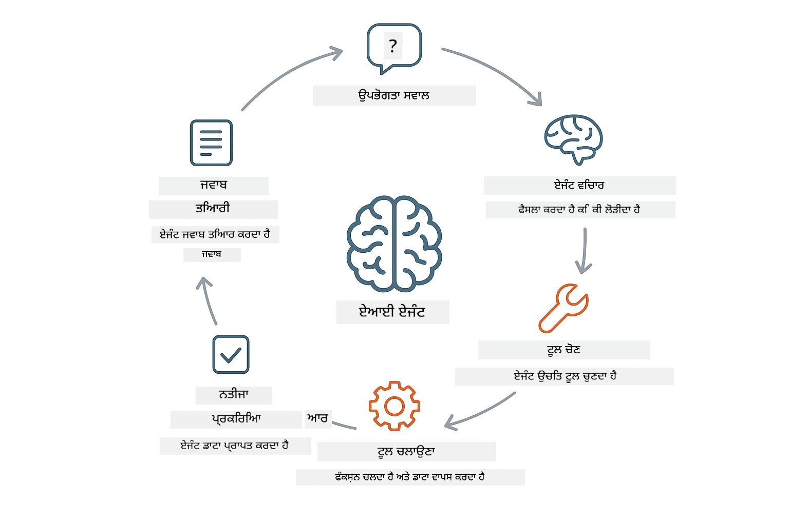
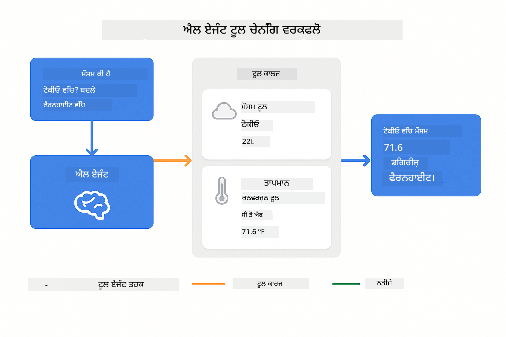
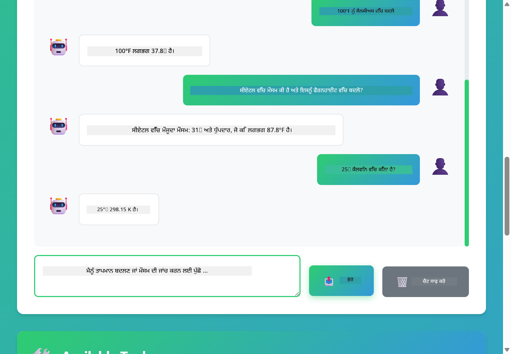

<!--
CO_OP_TRANSLATOR_METADATA:
{
  "original_hash": "13ec450c12cdd1a863baa2b778f27cd7",
  "translation_date": "2025-12-30T23:27:00+00:00",
  "source_file": "04-tools/README.md",
  "language_code": "pa"
}
-->
# Module 04: ਟੂਲਾਂ ਵਾਲੇ AI ਏਜੰਟਸ

## Table of Contents

- [What You'll Learn](../../../04-tools)
- [Prerequisites](../../../04-tools)
- [Understanding AI Agents with Tools](../../../04-tools)
- [How Tool Calling Works](../../../04-tools)
  - [Tool Definitions](../../../04-tools)
  - [Decision Making](../../../04-tools)
  - [Execution](../../../04-tools)
  - [Response Generation](../../../04-tools)
- [Tool Chaining](../../../04-tools)
- [Run the Application](../../../04-tools)
- [Using the Application](../../../04-tools)
  - [Try Simple Tool Usage](../../../04-tools)
  - [Test Tool Chaining](../../../04-tools)
  - [See Conversation Flow](../../../04-tools)
  - [Observe the Reasoning](../../../04-tools)
  - [Experiment with Different Requests](../../../04-tools)
- [Key Concepts](../../../04-tools)
  - [ReAct Pattern (Reasoning and Acting)](../../../04-tools)
  - [Tool Descriptions Matter](../../../04-tools)
  - [Session Management](../../../04-tools)
  - [Error Handling](../../../04-tools)
- [Available Tools](../../../04-tools)
- [When to Use Tool-Based Agents](../../../04-tools)
- [Next Steps](../../../04-tools)

## What You'll Learn

ਇਤਕਲਾ, ਤੁਸੀਂ AI ਨਾਲ ਗੱਲਬਾਤ ਕਰਨਾ, ਪ੍ਰਭਾਵਸ਼ਾਲੀ ਪ੍ਰੌਂਪਟ ਬਣਾਉਣਾ, ਅਤੇ ਆਪਣੇ ਦਸਤਾਵੇਜ਼ਾਂ ਵਿੱਚ ਆਧਾਰਿਤ ਜਵਾਬਾਂ ਦੇਣੀ ਸਿੱਖ ਚੁੱਕੇ ਹੋ। ਪਰ ਇੱਕ ਮੁੱਖ ਸੀਮਾ ਇਹ ਹੈ ਕਿ ਭਾਸ਼ਾ ਮਾਡਲ ਸਿਰਫ਼ ਟੈਕਸਟ ਹੀ ਉਤਪੱਨ ਕਰ ਸਕਦੇ ਹਨ। ਉਹ ਮੌਸਮ ਚੈਕ ਨਹੀਂ ਕਰ ਸਕਦੇ, ਹਿਸਾਬ ਨਹੀਂ ਕਰ ਸਕਦੇ, ਡੇਟਾਬੇਸ ਕਵੇਰੀ ਨਹੀਂ ਕਰ ਸਕਦੇ, ਜਾਂ ਬਾਹਰੀ ਸਿਸਟਮਾਂ ਨਾਲ ਇੰਟਰਐਕਟ ਨਹੀਂ ਕਰ ਸਕਦੇ।

ਟੂਲ ਇਸਨੂੰ ਬਦਲ ਦਿੰਦੇ ਹਨ। ਮਾਡਲ ਨੂੰ ਫੰਕਸ਼ਨਾਂ ਦੀ ਪਹੁੰਚ ਦੇ ਕੇ ਜੋ ਉਹ ਕਾਲ ਕਰ ਸਕਦੇ ਹਨ, ਤੁਸੀਂ ਇਹਨੂੰ ਇਕ ਟੈਕਸਟ ਜੈਨਰੇਟਰ ਤੋਂ ਇੱਕ ਏਜੰਟ ਵਿੱਚ ਬਦਲ ਦਿੰਦੇ ਹੋ ਜੋ ਕਾਰਵਾਈਆਂ ਕਰ ਸਕਦਾ ਹੈ। ਮਾਡਲ ਫੈਸਲਾ ਕਰਦਾ ਹੈ ਕਿ ਕਦੋਂ ਉਸਨੂੰ ਟੂਲ ਦੀ ਲੋੜ ਹੈ, ਕਿਹੜਾ ਟੂਲ ਵਰਤਣਾ ਹੈ, ਅਤੇ ਕਿੜੇ ਪੈਰਾਮੀਟਰ ਪਾਸ ਕਰਨੇ ਹਨ। ਤੁਹਾਡਾ ਕੋਡ ਫੰਕਸ਼ਨ ਚਲਾਉਂਦਾ ਹੈ ਅਤੇ ਨਤੀਜਾ ਵਾਪਸ ਕਰਦਾ ਹੈ। ਮਾਡਲ ਉਸ ਨਤੀਜੇ ਨੂੰ ਆਪਣੇ ਜਵਾਬ ਵਿੱਚ ਸ਼ਾਮਲ ਕਰਦਾ ਹੈ।

## Prerequisites

- Completed Module 01 (Azure OpenAI resources deployed)
- `.env` file in root directory with Azure credentials (created by `azd up` in Module 01)

> **Note:** If you haven't completed Module 01, follow the deployment instructions there first.

## Understanding AI Agents with Tools

> **📝 Note:** The term "agents" in this module refers to AI assistants enhanced with tool-calling capabilities. This is different from the **Agentic AI** patterns (autonomous agents with planning, memory, and multi-step reasoning) that we'll cover in [Module 05: MCP](../05-mcp/README.md).

ਟੂਲਾਂ ਵਾਲਾ AI ਏਜੰਟ ਇਕ ਰੀਜ਼ਨਿੰਗ ਅਤੇ ਐਕਟਿੰਗ ਪੈਟਰਨ (ReAct) ਦੀ ਪਾਲਣਾ ਕਰਦਾ ਹੈ:

1. ਯੂਜ਼ਰ ਇੱਕ ਸਵਾਲ ਪੁੱਛਦਾ ਹੈ
2. ਏਜੰਟ ਸੋਚਦਾ ਹੈ ਕਿ ਉਸਨੂੰ ਕੀ ਜਾਣਨ ਦੀ ਲੋੜ ਹੈ
3. ਏਜੰਟ ਫੈਸਲਾ ਕਰਦਾ ਹੈ ਕਿ ਜਵਾਬ ਦੇਣ ਲਈ ਉਸਨੂੰ ਟੂਲ ਦੀ ਲੋੜ ਹੈ ਜਾਂ ਨਹੀਂ
4. ਜੇ ਲੋੜ ਹੋਵੇ, ਤਾਂ ਏਜੰਟ ਸਹੀ ਪੈਰਾਮੀਟਰਾਂ ਨਾਲ ਸਬੰਧਤ ਟੂਲ ਨੂੰ ਕਾਲ ਕਰਦਾ ਹੈ
5. ਟੂਲ ਚਲਦਾ ਹੈ ਅਤੇ ਡੇਟਾ ਵਾਪਸ ਕਰਦਾ ਹੈ
6. ਏਜੰਟ ਨਤੀਜੇ ਨੂੰ ਸ਼ਾਮਲ ਕਰਦਾ ਹੈ ਅਤੇ ਆਖਰੀ ਜਵਾਬ ਦਿੰਦਾ ਹੈ



*ReAct ਪੈਟਰਨ - ਕਿਵੇਂ AI ਏਜੰਟ ਸੋਚ ਅਤੇ ਕਾਰਵਾਈ ਵਿਚ ਬਦਲ ਕੇ ਸਮੱਸਿਆਵਾਂ ਹੱਲ ਕਰਦੇ ਹਨ*

ਇਹ ਸਵੈਚਾਲਿਤ ਤੌਰ 'ਤੇ ਹੁੰਦਾ ਹੈ। ਤੁਸੀਂ ਟੂਲਾਂ ਅਤੇ ਉਹਨਾਂ ਦੀਆਂ ਵਰਣਨਾਵਾਂ ਪਰਿਭਾਸ਼ਤ ਕਰਦੇ ਹੋ। ਮਾਡਲ ਇਹ ਫੈਸਲਾ ਕਰਨ ਦੀ ਜਿੰਮੇਵਾਰੀ ਲੈਂਦਾ ਹੈ ਕਿ ਕਦੋਂ ਅਤੇ ਕਿਵੇਂ ਟੂਲ ਵਰਤਣੇ ਹਨ।

## How Tool Calling Works

**Tool Definitions** - [WeatherTool.java](../../../04-tools/src/main/java/com/example/langchain4j/agents/tools/WeatherTool.java) | [TemperatureTool.java](../../../04-tools/src/main/java/com/example/langchain4j/agents/tools/TemperatureTool.java)

ਤੁਸੀਂ ਫੰਕਸ਼ਨਾਂ ਨੂੰ ਸਪਸ਼ਟ ਵਰਣਨ ਅਤੇ ਪੈਰਾਮੀਟਰ ਵਿਸ਼ੇਸ਼ਤਾ ਨਾਲ ਪਰਿਭਾਸ਼ਤ ਕਰਦੇ ਹੋ। ਮਾਡਲ ਇਹ ਵਰਣਨਾਂ ਆਪਣੇ ਸਿਸਟਮ ਪ੍ਰੌਂਪਟ ਵਿੱਚ ਵੇਖਦਾ ਹੈ ਅਤੇ ਸਮਝਦਾ ਹੈ ਕਿ ਹਰ ਟੂਲ ਕੀ ਕਰਦਾ ਹੈ।

```java
@Component
public class WeatherTool {
    
    @Tool("Get the current weather for a location")
    public String getCurrentWeather(@P("Location name") String location) {
        // ਤੁਹਾਡੀ ਮੌਸਮ ਦੀ ਲੁੱਕਅੱਪ ਲੋਜਿਕ
        return "Weather in " + location + ": 22°C, cloudy";
    }
}

@AiService
public interface Assistant {
    String chat(@MemoryId String sessionId, @UserMessage String message);
}

// ਸਹਾਇਕ ਨੂੰ Spring Boot ਨਾਲ ਆਟੋਮੈਟਿਕ ਤੌਰ 'ਤੇ ਵਾਇਰ ਕੀਤਾ ਜਾਂਦਾ ਹੈ:
// - ChatModel ਬੀਨ
// - @Component ਕਲਾਸਾਂ ਤੋਂ ਸਾਰੇ @Tool ਮੈਥਡ
// - ਸੈਸ਼ਨ ਪਰਬੰਧਨ ਲਈ ChatMemoryProvider
```

> **🤖 Try with [GitHub Copilot](https://github.com/features/copilot) Chat:** Open [`WeatherTool.java`](../../../04-tools/src/main/java/com/example/langchain4j/agents/tools/WeatherTool.java) and ask:
> - "How would I integrate a real weather API like OpenWeatherMap instead of mock data?"
> - "What makes a good tool description that helps the AI use it correctly?"
> - "How do I handle API errors and rate limits in tool implementations?"

**Decision Making**

ਜਦੋਂ ਯੂਜ਼ਰ ਪੁੱਛਦਾ ਹੈ "What's the weather in Seattle?", ਮਾਡਲ ਪਛਾਣ ਲੈਂਦਾ ਹੈ ਕਿ ਇਸਨੂੰ weather ਟੂਲ ਦੀ ਲੋੜ ਹੈ। ਇਹ location ਪੈਰਾਮੀਟਰ "Seattle" ਨਾਲ ਇੱਕ ਫੰਕਸ਼ਨ ਕਾਲ ਜਨਰੇਟ ਕਰਦਾ ਹੈ।

**Execution** - [AgentService.java](../../../04-tools/src/main/java/com/example/langchain4j/agents/service/AgentService.java)

Spring Boot declarative `@AiService` ਇੰਟਰਫੇਸ ਨੂੰ ਸਾਰੇ ਰਜਿਸਟਰਡ ਟੂਲਾਂ ਨਾਲ auto-wire ਕਰ ਦਿੰਦਾ ਹੈ, ਅਤੇ LangChain4j ਟੂਲ ਕਾਲਜ਼ ਨੂੰ ਆਟੋਮੈਟਿਕ ਤੌਰ 'ਤੇ ਚਲਾਉਂਦਾ ਹੈ।

> **🤖 Try with [GitHub Copilot](https://github.com/features/copilot) Chat:** Open [`AgentService.java`](../../../04-tools/src/main/java/com/example/langchain4j/agents/service/AgentService.java) and ask:
> - "How does the ReAct pattern work and why is it effective for AI agents?"
> - "How does the agent decide which tool to use and in what order?"
> - "What happens if a tool execution fails - how should I handle errors robustly?"

**Response Generation**

ਮਾਡਲ ਮੌਸਮ ਡੇਟਾ ਪ੍ਰਾਪਤ ਕਰਦਾ ਹੈ ਅਤੇ ਇਸਨੂੰ ਯੂਜ਼ਰ ਲਈ ਇੱਕ ਪ੍ਰਾਕૃત ਭਾਸ਼ਾਈ ਜਵਾਬ ਵਿੱਚ ਫਾਰਮੈਟ ਕਰਦਾ ਹੈ।

### Why Use Declarative AI Services?

ਇਸ ਮਾਡਿਊਲ ਵਿੱਚ LangChain4j ਦੀ Spring Boot ਇੰਟਿਗ੍ਰੇਸ਼ਨ declarative `@AiService` ਇੰਟਰਫੇਸਾਂ ਦੇ ਨਾਲ ਵਰਤੀ ਗਈ ਹੈ:

- **Spring Boot auto-wiring** - ChatModel ਅਤੇ ਟੂਲ ਆਟੋਮੈਟਿਕ ਤੌਰ 'ਤੇ ਇੰਜੈਕਟ ਕੀਤੇ ਜਾਂਦੇ ਹਨ
- **@MemoryId pattern** - ਆਟੋਮੈਟਿਕ ਸੈਸ਼ਨ-ਅਧਾਰਤ ਮੇਮੋਰੀ ਮੈਨੇਜਮੈਂਟ
- **Single instance** - ਅਸਿਸਟੈਂਟ ਇਕ ਵਾਰੀ ਬਣਾਇਆ ਜਾਂਦਾ ਹੈ ਅਤੇ ਫਿਰ ਪ੍ਰਦਰਸ਼ਨ ਲਈ ਦੁਬਾਰਾ ਵਰਤਿਆ ਜਾਂਦਾ ਹੈ
- **Type-safe execution** - Java ਮੈਥਡਸ ਸਿੱਧਾ ਕਾਲ ਹੁੰਦੇ ਹਨ ਨਾਲ ਟਾਈਪ ਕਨਵਰਜ਼ਨ
- **Multi-turn orchestration** - ਟੂਲ ਚੇਨਿੰਗ ਆਟੋਮੈਟਿਕ ਤੌਰ 'ਤੇ ਸੰਭਾਲਦਾ ਹੈ
- **Zero boilerplate** - ਕੋਈ ਮੈਨੂਅਲ AiServices.builder() ਕਾਲ ਜਾਂ memory HashMap ਨਹੀਂ

ਬਦਲ ਵਿੱਚ ਹੱਥੋਂ ਹੱਥ approaches (manual `AiServices.builder()`) ਵੱਧ ਕੋਡ ਦੀ ਲੋੜ ਰੱਖਦੇ ਹਨ ਅਤੇ Spring Boot ਇੰਟਿਗ੍ਰੇਸ਼ਨ ਦੇ ਫਾਇਦੇ ਨਹੀਂ ਮਿਲਦੇ।

## Tool Chaining

**Tool Chaining** - AI ਕਈ ਟੂਲਾਂ ਨੂੰ ਲੜੀਵਾਰ ਚਲਾ ਸਕਦਾ ਹੈ। ਪੁੱਛੋ "What's the weather in Seattle and should I bring an umbrella?" ਅਤੇ ਦੇਖੋ ਕਿ ਇਹ `getCurrentWeather` ਨੂੰ ਕਿਵੇਂ ਚੇਨ ਕਰਦਾ ਹੈ ਅਤੇ rain gear ਬਾਰੇ ਅਤੇ ਵਿਚਾਰ ਕਰਦਾ ਹੈ।

<a href="images/tool-chaining.png"></a>

*ਲੜੀਵਾਰ ਟੂਲ ਕਾਲਜ਼ - ਇੱਕ ਟੂਲ ਦਾ ਆਉਟਪੁੱਟ ਅਗਲੇ ਫੈਸਲੇ ਨੂੰ ਫੀਡ ਕਰਦਾ ਹੈ*

**Graceful Failures** - ਕਿਸੇ ਸ਼ਹਿਰ ਲਈ ਮੌਸਮ ਪੁੱਛੋ ਜੋ mock ਡੇਟਾ ਵਿੱਚ ਨਹੀਂ ਹੈ। ਟੂਲ ਇੱਕ ਤਰੁਟੀ ਸੁਨੇਹਾ ਵਾਪਸ ਕਰਦਾ ਹੈ, ਅਤੇ AI ਸਮਝਾਉਂਦਾ ਹੈ ਕਿ ਉਹ ਮਦਦ ਨਹੀਂ ਕਰ ਸਕਦਾ। ਟੂਲ ਸੁਰੱਖਿਅਤ ਤਰੀਕੇ ਨਾਲ ਫੇਲ ਹੁੰਦੇ ਹਨ।

ਇਹ ਸਾਰਾ ਕੁਝ ਇਕੱਲੇ ਗੱਲਬਾਤ ਟਰਨ ਵਿੱਚ ਹੁੰਦਾ ਹੈ। ਏਜੰਟ ਖੁਦਮੁਖਤਿਆਰ ਤੌਰ 'ਤੇ ਕਈ ਟੂਲ ਕਾਲਜ਼ ਦਾ ਪ੍ਰਬੰਧ ਕਰਦਾ ਹੈ।

## Run the Application

**Verify deployment:**

ਯਕੀਨੀ ਬਣਾਓ ਕਿ root ਡਾਇਰੈਕਟਰੀ ਵਿੱਚ `.env` ਫਾਈਲ ਮੌਜੂਦ ਹੈ ਜਿਸ ਵਿੱਚ Azure ਕ੍ਰੈਡੇਨਸ਼ਲ ਹਨ (Module 01 ਦੌਰਾਨ ਬਣਾਈ ਗਈ):
```bash
cat ../.env  # AZURE_OPENAI_ENDPOINT, API_KEY, DEPLOYMENT ਦਿਖਾਏ ਜਾਣੇ ਚਾਹੀਦੇ ਹਨ
```

**Start the application:**

> **Note:** If you already started all applications using `./start-all.sh` from Module 01, this module is already running on port 8084. You can skip the start commands below and go directly to http://localhost:8084.

**Option 1: Using Spring Boot Dashboard (Recommended for VS Code users)**

dev container ਵਿੱਚ Spring Boot Dashboard ਵਿਸ਼ੇਸ਼ਤਾ ਵਾਲਾ extension ਸ਼ਾਮਲ ਹੈ, ਜੋ ਸਾਰੇ Spring Boot ਐਪਲੀਕੇਸ਼ਨਾਂ ਨੂੰ ਮੈਨੇਜ ਕਰਨ ਲਈ ਇੱਕ ਵਿਜ਼ੂਅਲ ਇੰਟਰਫੇਸ ਮੁਹੱਈਆ ਕਰਵਾਉਂਦਾ ਹੈ। ਤੁਸੀਂ ਇਸਨੂੰ VS Code ਦੇ Activity Bar ਵਿੱਚ ਖੋਜ ਸਕਦੇ ਹੋ (Spring Boot ਆਇਕਨ ਵੇਖੋ)।

Spring Boot Dashboard ਤੋਂ, ਤੁਸੀਂ:
- ਵਰਕਸਪੇਸ ਵਿੱਚ ਸਭ ਉਪਲੱਬਧ Spring Boot ਐਪਲੀਕੇਸ਼ਨਾਂ ਦੇਖ ਸਕਦੇ ਹੋ
- ਇੱਕ ਕਲਿੱਕ ਨਾਲ ਐਪਲੀਕੇਸ਼ਨਾਂ ਨੂੰ ਸ਼ੁਰੂ/ਬੰਦ ਕਰ ਸਕਦੇ ਹੋ
- ਰੀਅਲ-ਟਾਈਮ ਵਿੱਚ ਐਪਲੀਕੇਸ਼ਨ ਲਾਗਸ ਦੇਖ ਸਕਦੇ ਹੋ
- ਐਪਲੀਕੇਸ਼ਨ ਦੀ ਸਥਿਤੀ ਮੋਨੀਟਰ ਕਰ ਸਕਦੇ ਹੋ

ਸਿਰਫ "tools" ਦੇ ਕੋਲ play ਬਟਨ 'ਤੇ ਕਲਿੱਕ ਕਰੋ ਇਸ ਮਾਡਿਊਲ ਨੂੰ ਚਲਾਉਣ ਲਈ, ਜਾਂ ਸਾਰੇ ਮਾਡਿਊਲ ਇੱਕ ਵਾਰੀ ਵਿੱਚ ਸ਼ੁਰੂ ਕਰੋ।


**Option 2: Using shell scripts**

ਸਭ ਵੈੱਬ ਐਪਲੀਕੇਸ਼ਨਾਂ ਨੂੰ ਸ਼ੁਰੂ ਕਰੋ (modules 01-04):

**Bash:**
```bash
cd ..  # ਰੂਟ ਡਾਇਰੈਕਟਰੀ ਤੋਂ
./start-all.sh
```

**PowerShell:**
```powershell
cd ..  # ਰੂਟ ਡਾਇਰੈਕਟਰੀ ਤੋਂ
.\start-all.ps1
```

ਜਾਂ ਸਿਰਫ਼ ਇਸ ਮਾਡਿਊਲ ਨੂੰ ਸ਼ੁਰੂ ਕਰੋ:

**Bash:**
```bash
cd 04-tools
./start.sh
```

**PowerShell:**
```powershell
cd 04-tools
.\start.ps1
```

ਦੋਹਾਂ ਸਕ੍ਰਿਪਟਾਂ ਰੂਟ `.env` ਫਾਈਲ ਤੋਂ ਆਟੋਮੈਟਿਕ ਤੌਰ 'ਤੇ environment variables ਲੋਡ ਕਰਦੀਆਂ ਹਨ ਅਤੇ ਜੇ JARs ਮੌਜੂਦ ਨਹੀਂ ਹਨ ਤਾਂ ਉਹ ਬਿਲਡ ਕਰ ਲੈਂਦੀਆਂ ਹਨ।

> **Note:** If you prefer to build all modules manually before starting:
>
> **Bash:**
> ```bash
> cd ..  # Go to root directory
> mvn clean package -DskipTests
> ```
>
> **PowerShell:**
> ```powershell
> cd ..  # Go to root directory
> mvn clean package -DskipTests
> ```

Open http://localhost:8084 in your browser.

**To stop:**

**Bash:**
```bash
./stop.sh  # ਇਹ ਮੋਡਿਊਲ ਹੀ
# ਜਾਂ
cd .. && ./stop-all.sh  # ਸਾਰੇ ਮੋਡਿਊਲ
```

**PowerShell:**
```powershell
.\stop.ps1  # ਕੇਵਲ ਇਹ ਮਾਡਿਊਲ
# ਜਾਂ
cd ..; .\stop-all.ps1  # ਸਾਰੇ ਮਾਡਿਊਲ
```

## Using the Application

ਐਪਲੀਕੇਸ਼ਨ ਇੱਕ ਵੈੱਬ ਇੰਟਰਫੇਸ ਮੁਹੱਈਆ ਕਰਵਾਉਂਦਾ ਹੈ ਜਿਥੇ ਤੁਸੀਂ ਇੱਕ AI ਏਜੰਟ ਨਾਲ ਇੰਟਰਐਕਟ ਕਰ ਸਕਦੇ ਹੋ ਜਿਸਨੂੰ ਮੌਸਮ ਅਤੇ ਟੈਮਪਰੈਚਰ ਕਨਵਰਜਨ ਟੂਲਾਂ ਤੱਕ ਪਹੁੰਚ ਹੈ।

<a href="images/tools-homepage.png"></a>

*AI ਏਜੰਟ ਟੂਲਸ ਇੰਟਰਫੇਸ - ਟੂਲਾਂ ਨਾਲ ਇੰਟਰਐਕਟ ਕਰਨ ਲਈ ਤੇਜ਼ ਉਦਾਹਰਣਾਂ ਅਤੇ ਚੈਟ ਇੰਟਰਫੇਸ*

**Try Simple Tool Usage**

ਸਰਲ ਬੇਨਤੀ ਨਾਲ ਸ਼ੁਰੂ ਕਰੋ: "Convert 100 degrees Fahrenheit to Celsius". ਏਜੰਟ ਪਛਾਣਦਾ ਹੈ ਕਿ ਉਸਨੂੰ temperature conversion ਟੂਲ ਦੀ ਲੋੜ ਹੈ, ਸਹੀ ਪੈਰਾਮੀਟਰਾਂ ਨਾਲ ਉਸਨੂੰ ਕਾਲ ਕਰਦਾ ਹੈ, ਅਤੇ ਨਤੀਜਾ ਵਾਪਸ ਕਰਦਾ ਹੈ। ਧਿਆਨ ਦਿਓ ਕਿ ਇਹ ਕਿੰਨੇ ਕੁ ਪ੍ਰਾਕૃતਿਕ ਤਰੀਕੇ ਨਾਲ ਮਹਿਸੂਸ ਹੁੰਦਾ ਹੈ - ਤੁਸੀਂ ਨਹੀਂ ਦੱਸਿਆ ਕਿ ਕਿਹੜਾ ਟੂਲ ਵਰਤਣਾ ਹੈ ਜਾਂ ਕਿਵੇਂ ਕਾਲ ਕਰਨੀ ਹੈ।

**Test Tool Chaining**

ਹੁਣ ਕੁਝ ਹੋਰ ਜ਼ਿਆਦਾ ਜਟਿਲ ਟ੍ਰਾਈ ਕਰੋ: "What's the weather in Seattle and convert it to Fahrenheit?" ਦੇਖੋ ਕਿ ਏਜੰਟ ਇਹ ਕਦਮ-ਬਦ-कਦਮ ਕਿਵੇਂ ਕਰਦਾ ਹੈ। ਪਹਿਲਾਂ ਉਹ ਮੌਸਮ ਲਭਦਾ ਹੈ (ਜੋ Celsius ਵਿੱਚ ਵਾਪਸ ਕਰਦਾ ਹੈ), ਫਿਰ ਪਛਾਣਦਾ ਹੈ ਕਿ Fahrenheit ਵਿੱਚ ਬਦਲਣ ਦੀ ਲੋੜ ਹੈ, conversion ਟੂਲ ਨੂੰ ਕਾਲ ਕਰਦਾ ਹੈ, ਅਤੇ ਦੋਹਾਂ ਨਤੀਜਿਆਂ ਨੂੰ ਇਕੱਤਰ ਕਰਕੇ ਇੱਕ ਜਵਾਬ ਦਿੰਦਾ ਹੈ।

**See Conversation Flow**

ਚੈਟ ਇੰਟਰਫੇਸ ਗੱਲਬਾਤ ਦਾ ਇਤਿਹਾਸ ਰੱਖਦਾ ਹੈ, ਜਿਸ ਨਾਲ ਤੁਸੀਂ ਮਲਟੀ-ਟਰਨ ਇੰਟਰੈਕਸ਼ਨਾਂ ਕਰ ਸਕਦੇ ਹੋ। ਤੁਸੀਂ ਸਾਰੇ ਪਹਿਲਾਂ ਦੇ ਪ੍ਰਸ਼ਨ ਅਤੇ ਜਵਾਬ ਵੇਖ ਸਕਦੇ ਹੋ, ਜਿਸ ਨਾਲ ਇਹ ਸਮਝਣਾ ਆਸਾਨ ਹੋ ਜਾਂਦਾ ਹੈ ਕਿ ਏਜੰਟ ਕਿਵੇਂ ਕਈ ਐਕਸਚੇਂਜਜ਼ 'ਤੇ ਪ੍ਰਸੰਗ ਬਣਾਉਂਦਾ ਹੈ।

<a href="images/tools-conversation-demo.png"></a>

*ਮਲਟੀ-ਟਰਨ ਗੱਲਬਾਤ ਦਿਖਾਉਂਦੀ ਹੈ ਸਧਾਰਨ ਕਨਵਰਜਨ, ਮੌਸਮ ਲੁੱਕਅੱਪ, ਅਤੇ ਟੂਲ ਚੇਨਿੰਗ*

**Experiment with Different Requests**

ਵੱਖ-ਵੱਖ ਸੰਗਮਾਂ ਨੂੰ ਟ੍ਰਾਈ ਕਰੋ:
- Weather lookups: "What's the weather in Tokyo?"
- Temperature conversions: "What is 25°C in Kelvin?"
- Combined queries: "Check the weather in Paris and tell me if it's above 20°C"

ਧਿਆਨ ਦਿਓ ਕਿ ਏਜੰਟ ਕਿਵੇਂ ਪ੍ਰਾਕ੍ਰਿਤਿਕ ਭਾਸ਼ਾ ਨੂੰ ਸਮਝਦਾ ਹੈ ਅਤੇ ਉਸਨੂੰ موزੂ ਟੂਲ ਕਾਲਜ਼ ਵਿੱਚ ਨਕਸ਼ਾ ਕਰਦਾ ਹੈ।

## Key Concepts

**ReAct Pattern (Reasoning and Acting)**

ਏਜੰਟ ਸੋਚ (ਕੀ ਕਰਨਾ ਹੈ) ਅਤੇ ਕਾਰਵਾਈ (ਟੂਲ ਵਰਤਣਾ) ਵਿਚ ਬਦਲਦਾ ਰਹਿੰਦਾ ਹੈ। ਇਹ ਪੈਟਰਨ ਸੁਤੰਤਰ ਸਮੱਸਿਆ-ਹੱਲਣ ਯੋਗ ਬਣਾਉਂਦਾ ਹੈ ਨਾ ਕਿ ਸਿਰਫ ਨਿਰਦੇਸ਼ਾਂ ਦਾ ਪਾਲਣ।

**Tool Descriptions Matter**

ਟੂਲ ਵਰਣਨ ਦੀ ਗੁਣਵੱਤਾ ਸਿੱਧੀ ਤੌਰ 'ਤੇ ਪ੍ਰਭਾਵ ਪਾਉਂਦੀ ਹੈ ਕਿ ਏਜੰਟ ਉਹਨਾਂ ਨੂੰ ਕਿੰਨੀ ਚੰਗੀ ਤਰ੍ਹਾਂ ਵਰਤਦਾ ਹੈ। ਸਪਸ਼ਟ, ਵਿਸ਼ੇਸ਼ ਵਰਣਨ ਮਾਡਲ ਨੂੰ ਸਮਝਣ ਵਿੱਚ ਮਦਦ ਕਰਦੇ ਹਨ ਕਿ ਕਦੋਂ ਅਤੇ ਕਿਵੇਂ ਹਰ ਟੂਲ ਨੂੰ ਕਾਲ ਕਰਨਾ ਹੈ।

**Session Management**

`@MemoryId` ਐਨੋਟੇਸ਼ਨ ਆਟੋਮੈਟਿਕ ਸੈਸ਼ਨ-ਅਧਾਰਤ ਮੇਮੋਰੀ ਪ੍ਰਬੰਧਨ ਯੋਗ ਬਣਾਉਂਦੀ ਹੈ। ਹਰ ਸੈਸ਼ਨ ID ਨੂੰ `ChatMemory` ਦੀ ਆਪਣੀ ਉਦਾਹਰਣ ਮਿਲਦੀ ਹੈ ਜੋ `ChatMemoryProvider` ਬੀਨ ਦੁਆਰਾ ਪ੍ਰਬੰਧਿਤ ਹੁੰਦੀ ਹੈ, ਜਿਸ ਨਾਲ ਹਥਿਆਰਬੰਦ ਮੇਮੋਰੀ ਟਰੈਕਿੰਗ ਦੀ ਲੋੜ ਖਤਮ ਹੋ ਜਾਂਦੀ ਹੈ।

**Error Handling**

ਟੂਲ ਫੇਲ ਹੋ ਸਕਦੇ ਹਨ - APIs timeout ਹੋ ਸਕਦੇ ਹਨ, ਪੈਰਾਮੀਟਰ ਗਲਤ ਹੋ ਸਕਦੇ ਹਨ, ਬਾਹਰੀ ਸਰਵਿਸ ਡਾਊਨ ਹੋ ਸਕਦੇ ਹਨ। ਪ੍ਰੋਡਕਸ਼ਨ ਏਜੰਟਸ ਨੂੰ ਐਸੇ error handling ਦੀ ਲੋੜ ਹੈ ਤਾਂ ਜੋ ਮਾਡਲ ਮੁਸ਼ਕਿਲਾਂ ਦੀ ਵਿਆਖਿਆ ਕਰ ਸਕੇ ਜਾਂ ਵਿਕਲਪ ਅਜ਼ਮਾ ਸਕੇ।

## Available Tools

**Weather Tools** (mock data for demonstration):
- Get current weather for a location
- Get multi-day forecast

**Temperature Conversion Tools**:
- Celsius to Fahrenheit
- Fahrenheit to Celsius
- Celsius to Kelvin
- Kelvin to Celsius
- Fahrenheit to Kelvin
- Kelvin to Fahrenheit

ਇਹ ਸਧਾਰਨ ਉਦਾਹਰਣ ਹਨ, ਪਰ ਇਹ ਪੈਟਰਨ ਕਿਸੇ ਵੀ ਫੰਕਸ਼ਨ 'ਤੇ ਲਾਗੂ ਹੁੰਦਾ ਹੈ: ਡੇਟਾਬੇਸ ਕਵੇਰੀਜ਼, API ਕਾਲਜ਼, ਹਿਸਾਬ-ਕਿਤਾਬ, ਫਾਇਲ ਓਪਰੇਸ਼ਨ, ਜਾਂ ਸਿਸਟਮ ਕਮਾਂਡ्स।

## When to Use Tool-Based Agents

**Use tools when:**
- Answering requires real-time data (weather, stock prices, inventory)
- You need to perform calculations beyond simple math
- Accessing databases or APIs
- Taking actions (sending emails, creating tickets, updating records)
- Combining multiple data sources

**Don't use tools when:**
- Questions can be answered from general knowledge
- Response is purely conversational
- Tool latency would make the experience too slow

## Next Steps

**Next Module:** [05-mcp - Model Context Protocol (MCP)](../05-mcp/README.md)

---

**Navigation:** [← Previous: Module 03 - RAG](../03-rag/README.md) | [Back to Main](../README.md) | [Next: Module 05 - MCP →](../05-mcp/README.md)

---

<!-- CO-OP TRANSLATOR DISCLAIMER START -->
ਡਿਸਕਲੇਮਰ:
ਇਹ ਦਸਤਾਵੇਜ਼ AI ਅਨੁਵਾਦ ਸੇਵਾ Co-op Translator (https://github.com/Azure/co-op-translator) ਦੀ ਵਰਤੋਂ ਕਰਕੇ ਅਨੁਵਾਦ ਕੀਤਾ ਗਿਆ ਹੈ। ਅਸੀਂ ਸ਼ੁੱਧਤਾ ਲਈ ਕੋਸ਼ਿਸ਼ ਕਰਦੇ ਹਾਂ, ਪਰ ਕਿਰਪਾ ਕਰਕੇ ਧਿਆਨ ਰੱਖੋ ਕਿ ਆਟੋਮੇਟਿਕ ਅਨੁਵਾਦਾਂ ਵਿੱਚ ਗਲਤੀਆਂ ਜਾਂ ਅਣਸਹੀਤਾਵਾਂ ਹੋ ਸਕਦੀਆਂ ਹਨ। ਮੂਲ ਦਸਤਾਵੇਜ਼ ਨੂੰ ਉਸ ਦੀ ਮੂਲ ਭਾਸ਼ਾ ਵਿੱਚ ਅਧਿਕਾਰਿਕ ਸਰੋਤ ਵਜੋਂ ਮੰਨਿਆ ਜਾਣਾ ਚਾਹੀਦਾ ਹੈ। ਮਹੱਤਵਪੂਰਨ ਜਾਣਕਾਰੀ ਲਈ ਪੇਸ਼ੇਵਰ ਮਨੁੱਖੀ ਅਨੁਵਾਦ ਦੀ ਸਿਫ਼ਾਰਿਸ਼ ਕੀਤੀ ਜਾਂਦੀ ਹੈ। ਅਸੀਂ ਇਸ ਅਨੁਵਾਦ ਦੀ ਵਰਤੋਂ ਕਾਰਨ ਉਠਣ ਵਾਲੀਆਂ ਕਿਸੇ ਵੀ ਗਲਤਫਹਿਮੀਆਂ ਜਾਂ ਗਲਤ ਵਿਆਖਿਆਵਾਂ ਲਈ ਜ਼ਿੰਮੇਵਾਰ ਨਹੀਂ ਹਾਂ।
<!-- CO-OP TRANSLATOR DISCLAIMER END -->