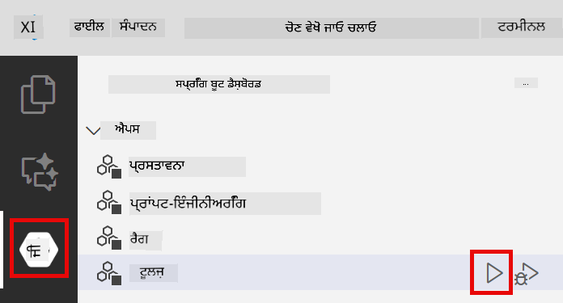
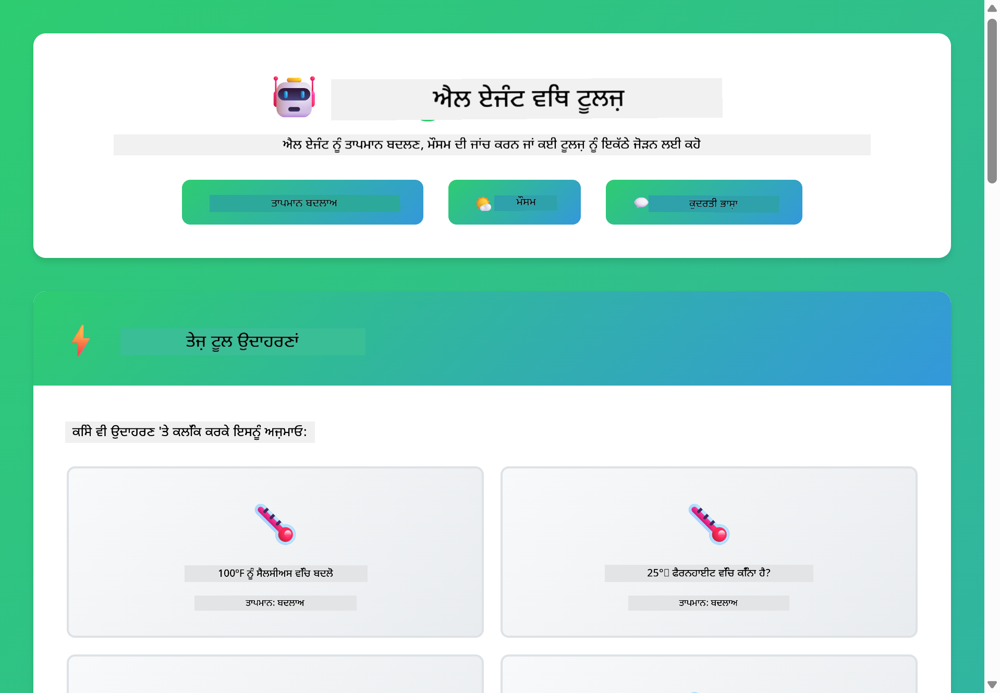

<!--
CO_OP_TRANSLATOR_METADATA:
{
  "original_hash": "aa23f106e7f53270924c9dd39c629004",
  "translation_date": "2025-12-13T18:45:29+00:00",
  "source_file": "04-tools/README.md",
  "language_code": "pa"
}
-->
# Module 04: ਟੂਲਾਂ ਨਾਲ AI ਏਜੰਟ

## ਸੂਚੀ

- [ਤੁਸੀਂ ਕੀ ਸਿੱਖੋਗੇ](../../../04-tools)
- [ਪੂਰਵ-ਆਵਸ਼ਕਤਾਵਾਂ](../../../04-tools)
- [ਟੂਲਾਂ ਨਾਲ AI ਏਜੰਟ ਨੂੰ ਸਮਝਣਾ](../../../04-tools)
- [ਟੂਲ ਕਾਲਿੰਗ ਕਿਵੇਂ ਕੰਮ ਕਰਦੀ ਹੈ](../../../04-tools)
  - [ਟੂਲ ਪਰਿਭਾਸ਼ਾਵਾਂ](../../../04-tools)
  - [ਫੈਸਲਾ ਲੈਣਾ](../../../04-tools)
  - [ਕਾਰਜਨਵਾਈ](../../../04-tools)
  - [ਜਵਾਬ ਤਿਆਰ ਕਰਨਾ](../../../04-tools)
- [ਟੂਲ ਚੇਨਿੰਗ](../../../04-tools)
- [ਐਪਲੀਕੇਸ਼ਨ ਚਲਾਓ](../../../04-tools)
- [ਐਪਲੀਕੇਸ਼ਨ ਦੀ ਵਰਤੋਂ](../../../04-tools)
  - [ਸਧਾਰਣ ਟੂਲ ਵਰਤੋਂ ਦੀ ਕੋਸ਼ਿਸ਼ ਕਰੋ](../../../04-tools)
  - [ਟੂਲ ਚੇਨਿੰਗ ਦੀ ਜਾਂਚ ਕਰੋ](../../../04-tools)
  - [ਗੱਲਬਾਤ ਦਾ ਪ੍ਰਵਾਹ ਵੇਖੋ](../../../04-tools)
  - [ਤਰਕ ਨੂੰ ਦੇਖੋ](../../../04-tools)
  - [ਵੱਖ-ਵੱਖ ਬੇਨਤੀਆਂ ਨਾਲ ਪ੍ਰਯੋਗ ਕਰੋ](../../../04-tools)
- [ਮੁੱਖ ਧਾਰਣਾਵਾਂ](../../../04-tools)
  - [ReAct ਪੈਟਰਨ (ਤਰਕ ਅਤੇ ਕਾਰਵਾਈ)](../../../04-tools)
  - [ਟੂਲ ਵੇਰਵੇ ਮਹੱਤਵਪੂਰਨ ਹਨ](../../../04-tools)
  - [ਸੈਸ਼ਨ ਪ੍ਰਬੰਧਨ](../../../04-tools)
  - [ਗਲਤੀ ਸੰਭਾਲ](../../../04-tools)
- [ਉਪਲਬਧ ਟੂਲ](../../../04-tools)
- [ਕਦੋਂ ਟੂਲ-ਆਧਾਰਿਤ ਏਜੰਟ ਵਰਤਣੇ](../../../04-tools)
- [ਅਗਲੇ ਕਦਮ](../../../04-tools)

## What You'll Learn

ਹੁਣ ਤੱਕ, ਤੁਸੀਂ ਸਿੱਖਿਆ ਹੈ ਕਿ AI ਨਾਲ ਗੱਲਬਾਤ ਕਿਵੇਂ ਕਰਨੀ ਹੈ, ਪ੍ਰਾਂਪਟਸ ਨੂੰ ਪ੍ਰਭਾਵਸ਼ਾਲੀ ਢੰਗ ਨਾਲ ਬਣਾਉਣਾ ਅਤੇ ਆਪਣੇ ਦਸਤਾਵੇਜ਼ਾਂ ਵਿੱਚ ਜਵਾਬਾਂ ਨੂੰ ਅਧਾਰਿਤ ਕਰਨਾ। ਪਰ ਇੱਕ ਮੂਲ ਸੀਮਾ ਹੈ: ਭਾਸ਼ਾ ਮਾਡਲ ਸਿਰਫ ਟੈਕਸਟ ਹੀ ਤਿਆਰ ਕਰ ਸਕਦੇ ਹਨ। ਉਹ ਮੌਸਮ ਦੀ ਜਾਂਚ ਨਹੀਂ ਕਰ ਸਕਦੇ, ਗਣਨਾਵਾਂ ਨਹੀਂ ਕਰ ਸਕਦੇ, ਡੇਟਾਬੇਸਾਂ ਨੂੰ ਕਵੈਰੀ ਨਹੀਂ ਕਰ ਸਕਦੇ ਜਾਂ ਬਾਹਰੀ ਪ੍ਰਣਾਲੀਆਂ ਨਾਲ ਇੰਟਰੈਕਟ ਨਹੀਂ ਕਰ ਸਕਦੇ।

ਟੂਲ ਇਸਨੂੰ ਬਦਲ ਦਿੰਦੇ ਹਨ। ਮਾਡਲ ਨੂੰ ਫੰਕਸ਼ਨਾਂ ਤੱਕ ਪਹੁੰਚ ਦੇ ਕੇ ਜੋ ਉਹ ਕਾਲ ਕਰ ਸਕਦਾ ਹੈ, ਤੁਸੀਂ ਇਸਨੂੰ ਇੱਕ ਟੈਕਸਟ ਜਨਰੇਟਰ ਤੋਂ ਇੱਕ ਏਜੰਟ ਵਿੱਚ ਬਦਲ ਦਿੰਦੇ ਹੋ ਜੋ ਕਾਰਵਾਈ ਕਰ ਸਕਦਾ ਹੈ। ਮਾਡਲ ਫੈਸਲਾ ਕਰਦਾ ਹੈ ਕਿ ਕਦੋਂ ਉਸਨੂੰ ਟੂਲ ਦੀ ਲੋੜ ਹੈ, ਕਿਹੜਾ ਟੂਲ ਵਰਤਣਾ ਹੈ ਅਤੇ ਕਿਹੜੇ ਪੈਰਾਮੀਟਰ ਭੇਜਣੇ ਹਨ। ਤੁਹਾਡਾ ਕੋਡ ਫੰਕਸ਼ਨ ਚਲਾਉਂਦਾ ਹੈ ਅਤੇ ਨਤੀਜਾ ਵਾਪਸ ਕਰਦਾ ਹੈ। ਮਾਡਲ ਉਸ ਨਤੀਜੇ ਨੂੰ ਆਪਣੇ ਜਵਾਬ ਵਿੱਚ ਸ਼ਾਮਲ ਕਰਦਾ ਹੈ।

## Prerequisites

- ਮੋਡੀਊਲ 01 ਪੂਰਾ ਕੀਤਾ (Azure OpenAI ਸਰੋਤ ਤਿਆਰ ਕੀਤੇ)
- ਰੂਟ ਡਾਇਰੈਕਟਰੀ ਵਿੱਚ `.env` ਫਾਇਲ ਜਿਸ ਵਿੱਚ Azure ਪ੍ਰਮਾਣ ਪੱਤਰ ਹਨ (ਮੋਡੀਊਲ 01 ਵਿੱਚ `azd up` ਨਾਲ ਬਣਾਈ ਗਈ)

> **ਨੋਟ:** ਜੇ ਤੁਸੀਂ ਮੋਡੀਊਲ 01 ਪੂਰਾ ਨਹੀਂ ਕੀਤਾ, ਤਾਂ ਪਹਿਲਾਂ ਉਥੇ ਦਿੱਤੇ ਡਿਪਲੋਇਮੈਂਟ ਨਿਰਦੇਸ਼ਾਂ ਦੀ ਪਾਲਣਾ ਕਰੋ।

## Understanding AI Agents with Tools

ਟੂਲਾਂ ਨਾਲ AI ਏਜੰਟ ਇੱਕ ਤਰਕ ਅਤੇ ਕਾਰਵਾਈ ਪੈਟਰਨ (ReAct) ਦੀ ਪਾਲਣਾ ਕਰਦਾ ਹੈ:

1. ਯੂਜ਼ਰ ਸਵਾਲ ਪੁੱਛਦਾ ਹੈ
2. ਏਜੰਟ ਸੋਚਦਾ ਹੈ ਕਿ ਉਸਨੂੰ ਕੀ ਜਾਣਨਾ ਚਾਹੀਦਾ ਹੈ
3. ਏਜੰਟ ਫੈਸਲਾ ਕਰਦਾ ਹੈ ਕਿ ਜਵਾਬ ਦੇਣ ਲਈ ਟੂਲ ਦੀ ਲੋੜ ਹੈ ਜਾਂ ਨਹੀਂ
4. ਜੇ ਹਾਂ, ਤਾਂ ਏਜੰਟ ਸਹੀ ਪੈਰਾਮੀਟਰਾਂ ਨਾਲ ਉਚਿਤ ਟੂਲ ਕਾਲ ਕਰਦਾ ਹੈ
5. ਟੂਲ ਕਾਰਜਨਵਾਈ ਕਰਦਾ ਹੈ ਅਤੇ ਡੇਟਾ ਵਾਪਸ ਕਰਦਾ ਹੈ
6. ਏਜੰਟ ਨਤੀਜੇ ਨੂੰ ਸ਼ਾਮਲ ਕਰਦਾ ਹੈ ਅਤੇ ਅੰਤਿਮ ਜਵਾਬ ਦਿੰਦਾ ਹੈ


*ReAct ਪੈਟਰਨ - ਕਿਵੇਂ AI ਏਜੰਟ ਤਰਕ ਅਤੇ ਕਾਰਵਾਈ ਵਿਚਕਾਰ ਬਦਲਦੇ ਹਨ ਸਮੱਸਿਆਵਾਂ ਹੱਲ ਕਰਨ ਲਈ*

ਇਹ ਆਪਣੇ ਆਪ ਹੁੰਦਾ ਹੈ। ਤੁਸੀਂ ਟੂਲਾਂ ਅਤੇ ਉਹਨਾਂ ਦੇ ਵੇਰਵੇ ਪਰਿਭਾਸ਼ਿਤ ਕਰਦੇ ਹੋ। ਮਾਡਲ ਫੈਸਲਾ ਲੈਣ ਦਾ ਕੰਮ ਸੰਭਾਲਦਾ ਹੈ ਕਿ ਕਦੋਂ ਅਤੇ ਕਿਵੇਂ ਉਹਨਾਂ ਨੂੰ ਵਰਤਣਾ ਹੈ।

## How Tool Calling Works

**ਟੂਲ ਪਰਿਭਾਸ਼ਾਵਾਂ** - [WeatherTool.java](../../../04-tools/src/main/java/com/example/langchain4j/agents/tools/WeatherTool.java) | [TemperatureTool.java](../../../04-tools/src/main/java/com/example/langchain4j/agents/tools/TemperatureTool.java)

ਤੁਸੀਂ ਸਪਸ਼ਟ ਵੇਰਵਿਆਂ ਅਤੇ ਪੈਰਾਮੀਟਰ ਵਿਸ਼ੇਸ਼ਤਾਵਾਂ ਨਾਲ ਫੰਕਸ਼ਨਾਂ ਨੂੰ ਪਰਿਭਾਸ਼ਿਤ ਕਰਦੇ ਹੋ। ਮਾਡਲ ਇਹ ਵੇਰਵੇ ਆਪਣੇ ਸਿਸਟਮ ਪ੍ਰਾਂਪਟ ਵਿੱਚ ਵੇਖਦਾ ਹੈ ਅਤੇ ਸਮਝਦਾ ਹੈ ਕਿ ਹਰ ਟੂਲ ਕੀ ਕਰਦਾ ਹੈ।

```java
@Component
public class WeatherTool {
    
    @Tool("Get the current weather for a location")
    public String getCurrentWeather(@P("Location name") String location) {
        // ਤੁਹਾਡੀ ਮੌਸਮ ਲੁੱਕਅਪ ਲੋਜਿਕ
        return "Weather in " + location + ": 22°C, cloudy";
    }
}

@AiService
public interface Assistant {
    String chat(@MemoryId String sessionId, @UserMessage String message);
}

// ਸਹਾਇਕ ਸਵੈਚਾਲਿਤ ਤੌਰ 'ਤੇ ਸਪ੍ਰਿੰਗ ਬੂਟ ਨਾਲ ਜੁੜਿਆ ਹੈ:
// - ChatModel ਬੀਨ
// - @Component ਕਲਾਸਾਂ ਤੋਂ ਸਾਰੇ @Tool ਮੈਥਡ
// - ਸੈਸ਼ਨ ਪ੍ਰਬੰਧਨ ਲਈ ChatMemoryProvider
```

> **🤖 [GitHub Copilot](https://github.com/features/copilot) ਚੈਟ ਨਾਲ ਕੋਸ਼ਿਸ਼ ਕਰੋ:** [`WeatherTool.java`](../../../04-tools/src/main/java/com/example/langchain4j/agents/tools/WeatherTool.java) ਖੋਲ੍ਹੋ ਅਤੇ ਪੁੱਛੋ:
> - "ਮੈਂ ਮੌਕ ਡੇਟਾ ਦੀ ਥਾਂ ਅਸਲੀ weather API ਜਿਵੇਂ OpenWeatherMap ਨੂੰ ਕਿਵੇਂ ਇੰਟੀਗ੍ਰੇਟ ਕਰਾਂ?"
> - "ਇੱਕ ਚੰਗਾ ਟੂਲ ਵੇਰਵਾ ਕੀ ਹੁੰਦਾ ਹੈ ਜੋ AI ਨੂੰ ਸਹੀ ਤਰੀਕੇ ਨਾਲ ਵਰਤਣ ਵਿੱਚ ਮਦਦ ਕਰਦਾ ਹੈ?"
> - "ਟੂਲ ਇੰਪਲੀਮੈਂਟੇਸ਼ਨਾਂ ਵਿੱਚ API ਗਲਤੀਆਂ ਅਤੇ ਰੇਟ ਲਿਮਿਟਸ ਨੂੰ ਕਿਵੇਂ ਸੰਭਾਲਾਂ?"

**ਫੈਸਲਾ ਲੈਣਾ**

ਜਦੋਂ ਯੂਜ਼ਰ ਪੁੱਛਦਾ ਹੈ "ਸੀਏਟਲ ਵਿੱਚ ਮੌਸਮ ਕਿਵੇਂ ਹੈ?", ਮਾਡਲ ਪਛਾਣਦਾ ਹੈ ਕਿ ਉਸਨੂੰ weather ਟੂਲ ਦੀ ਲੋੜ ਹੈ। ਇਹ "Seattle" ਸਥਾਨ ਪੈਰਾਮੀਟਰ ਨਾਲ ਇੱਕ ਫੰਕਸ਼ਨ ਕਾਲ ਤਿਆਰ ਕਰਦਾ ਹੈ।

**ਕਾਰਜਨਵਾਈ** - [AgentService.java](../../../04-tools/src/main/java/com/example/langchain4j/agents/service/AgentService.java)

Spring Boot ਸਾਰੇ ਰਜਿਸਟਰਡ ਟੂਲਾਂ ਨਾਲ ਡਿਕਲੇਰੇਟਿਵ `@AiService` ਇੰਟਰਫੇਸ ਨੂੰ ਆਟੋ-ਵਾਇਰ ਕਰਦਾ ਹੈ, ਅਤੇ LangChain4j ਟੂਲ ਕਾਲਾਂ ਨੂੰ ਆਪਣੇ ਆਪ ਚਲਾਉਂਦਾ ਹੈ।

> **🤖 [GitHub Copilot](https://github.com/features/copilot) ਚੈਟ ਨਾਲ ਕੋਸ਼ਿਸ਼ ਕਰੋ:** [`AgentService.java`](../../../04-tools/src/main/java/com/example/langchain4j/agents/service/AgentService.java) ਖੋਲ੍ਹੋ ਅਤੇ ਪੁੱਛੋ:
> - "ReAct ਪੈਟਰਨ ਕਿਵੇਂ ਕੰਮ ਕਰਦਾ ਹੈ ਅਤੇ ਇਹ AI ਏਜੰਟਾਂ ਲਈ ਕਿਉਂ ਪ੍ਰਭਾਵਸ਼ਾਲੀ ਹੈ?"
> - "ਏਜੰਟ ਕਿਵੇਂ ਫੈਸਲਾ ਕਰਦਾ ਹੈ ਕਿ ਕਿਹੜਾ ਟੂਲ ਕਿਵੇਂ ਅਤੇ ਕਿਹੜੇ ਕ੍ਰਮ ਵਿੱਚ ਵਰਤਣਾ ਹੈ?"
> - "ਜੇ ਟੂਲ ਕਾਰਜਨਵਾਈ ਫੇਲ ਹੋ ਜਾਵੇ ਤਾਂ ਕੀ ਹੁੰਦਾ ਹੈ - ਮੈਂ ਗਲਤੀਆਂ ਨੂੰ ਮਜ਼ਬੂਤੀ ਨਾਲ ਕਿਵੇਂ ਸੰਭਾਲਾਂ?"

**ਜਵਾਬ ਤਿਆਰ ਕਰਨਾ**

ਮਾਡਲ ਮੌਸਮ ਦਾ ਡੇਟਾ ਪ੍ਰਾਪਤ ਕਰਦਾ ਹੈ ਅਤੇ ਇਸਨੂੰ ਯੂਜ਼ਰ ਲਈ ਕੁਦਰਤੀ ਭਾਸ਼ਾ ਵਿੱਚ ਜਵਾਬ ਵਜੋਂ ਫਾਰਮੈਟ ਕਰਦਾ ਹੈ।

### ਡਿਕਲੇਰੇਟਿਵ AI ਸਰਵਿਸਿਜ਼ ਕਿਉਂ ਵਰਤਣ?

ਇਹ ਮੋਡੀਊਲ LangChain4j ਦੇ Spring Boot ਇੰਟੀਗ੍ਰੇਸ਼ਨ ਨਾਲ ਡਿਕਲੇਰੇਟਿਵ `@AiService` ਇੰਟਰਫੇਸ ਵਰਤਦਾ ਹੈ:

- **Spring Boot ਆਟੋ-ਵਾਇਰਿੰਗ** - ChatModel ਅਤੇ ਟੂਲਾਂ ਆਪਣੇ ਆਪ ਇੰਜੈਕਟ ਹੁੰਦੇ ਹਨ
- **@MemoryId ਪੈਟਰਨ** - ਆਟੋਮੈਟਿਕ ਸੈਸ਼ਨ-ਆਧਾਰਿਤ ਮੈਮੋਰੀ ਪ੍ਰਬੰਧਨ
- **ਇੱਕੋ ਇੰਸਟੈਂਸ** - ਸਹਾਇਕ ਇੱਕ ਵਾਰੀ ਬਣਾਇਆ ਜਾਂਦਾ ਹੈ ਅਤੇ ਵਧੀਆ ਪ੍ਰਦਰਸ਼ਨ ਲਈ ਦੁਬਾਰਾ ਵਰਤਿਆ ਜਾਂਦਾ ਹੈ
- **ਟਾਈਪ-ਸੇਫ ਕਾਰਜਨਵਾਈ** - ਜਾਵਾ ਮੈਥਡ ਸਿੱਧਾ ਟਾਈਪ ਕਨਵਰਜ਼ਨ ਨਾਲ ਕਾਲ ਹੁੰਦੇ ਹਨ
- **ਮਲਟੀ-ਟਰਨ ਆਰਕੇਸਟ੍ਰੇਸ਼ਨ** - ਟੂਲ ਚੇਨਿੰਗ ਨੂੰ ਆਪਣੇ ਆਪ ਸੰਭਾਲਦਾ ਹੈ
- **ਜ਼ੀਰੋ ਬੋਇਲਰਪਲੇਟ** - ਕੋਈ ਮੈਨੂਅਲ AiServices.builder() ਕਾਲ ਜਾਂ ਮੈਮੋਰੀ HashMap ਨਹੀਂ

ਵਿਕਲਪਿਕ ਤਰੀਕੇ (ਮੈਨੂਅਲ `AiServices.builder()`) ਵਿੱਚ ਵੱਧ ਕੋਡ ਲੱਗਦਾ ਹੈ ਅਤੇ Spring Boot ਇੰਟੀਗ੍ਰੇਸ਼ਨ ਦੇ ਫਾਇਦੇ ਨਹੀਂ ਮਿਲਦੇ।

## Tool Chaining

**ਟੂਲ ਚੇਨਿੰਗ** - AI ਕਈ ਟੂਲਾਂ ਨੂੰ ਲੜੀਵਾਰ ਕਾਲ ਕਰ ਸਕਦਾ ਹੈ। ਪੁੱਛੋ "ਸੀਏਟਲ ਵਿੱਚ ਮੌਸਮ ਕਿਵੇਂ ਹੈ ਅਤੇ ਕੀ ਮੈਨੂੰ ਛੱਤਰੀ ਲੈਣੀ ਚਾਹੀਦੀ ਹੈ?" ਅਤੇ ਦੇਖੋ ਕਿ ਇਹ `getCurrentWeather` ਨੂੰ ਕਿਵੇਂ ਚੇਨ ਕਰਦਾ ਹੈ ਅਤੇ ਬਰਸਾਤ ਦੇ ਸਾਮਾਨ ਬਾਰੇ ਸੋਚਦਾ ਹੈ।

<a href="images/tool-chaining.png"></a>

*ਲੜੀਵਾਰ ਟੂਲ ਕਾਲ - ਇੱਕ ਟੂਲ ਦਾ ਨਤੀਜਾ ਅਗਲੇ ਫੈਸਲੇ ਵਿੱਚ ਵਰਤਿਆ ਜਾਂਦਾ ਹੈ*

**ਸੁਚੱਜੀ ਅਸਫਲਤਾਵਾਂ** - ਕਿਸੇ ਐਸੇ ਸ਼ਹਿਰ ਵਿੱਚ ਮੌਸਮ ਪੁੱਛੋ ਜੋ ਮੌਕ ਡੇਟਾ ਵਿੱਚ ਨਹੀਂ ਹੈ। ਟੂਲ ਗਲਤੀ ਸੁਨੇਹਾ ਵਾਪਸ ਕਰਦਾ ਹੈ, ਅਤੇ AI ਸਮਝਾਉਂਦਾ ਹੈ ਕਿ ਉਹ ਮਦਦ ਨਹੀਂ ਕਰ ਸਕਦਾ। ਟੂਲ ਸੁਰੱਖਿਅਤ ਤਰੀਕੇ ਨਾਲ ਅਸਫਲ ਹੁੰਦੇ ਹਨ।

ਇਹ ਸਾਰਾ ਕੰਮ ਇੱਕ ਗੱਲਬਾਤ ਦੇ ਟਰਨ ਵਿੱਚ ਹੁੰਦਾ ਹੈ। ਏਜੰਟ ਕਈ ਟੂਲ ਕਾਲਾਂ ਨੂੰ ਆਪਣੇ ਆਪ ਸੰਚਾਲਿਤ ਕਰਦਾ ਹੈ।

## Run the Application

**ਡਿਪਲੋਇਮੈਂਟ ਦੀ ਪੁਸ਼ਟੀ ਕਰੋ:**

ਪੱਕਾ ਕਰੋ ਕਿ `.env` ਫਾਇਲ ਰੂਟ ਡਾਇਰੈਕਟਰੀ ਵਿੱਚ ਮੌਜੂਦ ਹੈ ਜਿਸ ਵਿੱਚ Azure ਪ੍ਰਮਾਣ ਪੱਤਰ ਹਨ (ਮੋਡੀਊਲ 01 ਦੌਰਾਨ ਬਣਾਈ ਗਈ):
```bash
cat ../.env  # AZURE_OPENAI_ENDPOINT, API_KEY, DEPLOYMENT ਦਿਖਾਉਣਾ ਚਾਹੀਦਾ ਹੈ
```

**ਐਪਲੀਕੇਸ਼ਨ ਸ਼ੁਰੂ ਕਰੋ:**

> **ਨੋਟ:** ਜੇ ਤੁਸੀਂ ਪਹਿਲਾਂ ਹੀ ਮੋਡੀਊਲ 01 ਤੋਂ `./start-all.sh` ਨਾਲ ਸਾਰੇ ਐਪਲੀਕੇਸ਼ਨ ਚਲਾ ਚੁੱਕੇ ਹੋ, ਤਾਂ ਇਹ ਮੋਡੀਊਲ ਪਹਿਲਾਂ ਹੀ ਪੋਰਟ 8084 'ਤੇ ਚੱਲ ਰਿਹਾ ਹੈ। ਤੁਸੀਂ ਹੇਠਾਂ ਦਿੱਤੇ ਸ਼ੁਰੂਆਤੀ ਕਮਾਂਡਾਂ ਨੂੰ ਛੱਡ ਕੇ ਸਿੱਧਾ http://localhost:8084 'ਤੇ ਜਾ ਸਕਦੇ ਹੋ।

**ਵਿਕਲਪ 1: Spring Boot ਡੈਸ਼ਬੋਰਡ ਵਰਤਣਾ (VS Code ਉਪਭੋਗਤਾਵਾਂ ਲਈ ਸਿਫਾਰਸ਼ੀ)**

ਡੈਵ ਕੰਟੇਨਰ ਵਿੱਚ Spring Boot ਡੈਸ਼ਬੋਰਡ ਐਕਸਟੈਂਸ਼ਨ ਸ਼ਾਮਲ ਹੈ, ਜੋ ਸਾਰੇ Spring Boot ਐਪਲੀਕੇਸ਼ਨਾਂ ਨੂੰ ਪ੍ਰਬੰਧਿਤ ਕਰਨ ਲਈ ਵਿਜ਼ੂਅਲ ਇੰਟਰਫੇਸ ਦਿੰਦਾ ਹੈ। ਤੁਸੀਂ ਇਸਨੂੰ VS Code ਦੇ ਖੱਬੇ ਪਾਸੇ ਐਕਟਿਵਿਟੀ ਬਾਰ ਵਿੱਚ Spring Boot ਆਈਕਨ ਦੇਖ ਕੇ ਲੱਭ ਸਕਦੇ ਹੋ।

Spring Boot ਡੈਸ਼ਬੋਰਡ ਤੋਂ, ਤੁਸੀਂ:
- ਵਰਕਸਪੇਸ ਵਿੱਚ ਸਾਰੇ ਉਪਲਬਧ Spring Boot ਐਪਲੀਕੇਸ਼ਨ ਵੇਖ ਸਕਦੇ ਹੋ
- ਇੱਕ ਕਲਿੱਕ ਨਾਲ ਐਪਲੀਕੇਸ਼ਨ ਸ਼ੁਰੂ/ਰੋਕ ਸਕਦੇ ਹੋ
- ਐਪਲੀਕੇਸ਼ਨ ਲੌਗਸ ਨੂੰ ਰੀਅਲ-ਟਾਈਮ ਵਿੱਚ ਦੇਖ ਸਕਦੇ ਹੋ
- ਐਪਲੀਕੇਸ਼ਨ ਦੀ ਸਥਿਤੀ ਮਾਨੀਟਰ ਕਰ ਸਕਦੇ ਹੋ

ਸਿਰਫ "tools" ਦੇ ਨਾਲ ਖੇਡ ਬਟਨ 'ਤੇ ਕਲਿੱਕ ਕਰੋ ਇਸ ਮੋਡੀਊਲ ਨੂੰ ਸ਼ੁਰੂ ਕਰਨ ਲਈ, ਜਾਂ ਸਾਰੇ ਮੋਡੀਊਲ ਇੱਕ ਵਾਰੀ ਵਿੱਚ ਸ਼ੁਰੂ ਕਰੋ।



**ਵਿਕਲਪ 2: ਸ਼ੈੱਲ ਸਕ੍ਰਿਪਟ ਵਰਤਣਾ**

ਸਾਰੇ ਵੈੱਬ ਐਪਲੀਕੇਸ਼ਨ (ਮੋਡੀਊਲ 01-04) ਸ਼ੁਰੂ ਕਰੋ:

**Bash:**
```bash
cd ..  # ਰੂਟ ਡਾਇਰੈਕਟਰੀ ਤੋਂ
./start-all.sh
```

**PowerShell:**
```powershell
cd ..  # ਰੂਟ ਡਾਇਰੈਕਟਰੀ ਤੋਂ
.\start-all.ps1
```

ਜਾਂ ਸਿਰਫ ਇਹ ਮੋਡੀਊਲ ਸ਼ੁਰੂ ਕਰੋ:

**Bash:**
```bash
cd 04-tools
./start.sh
```

**PowerShell:**
```powershell
cd 04-tools
.\start.ps1
```

ਦੋਹਾਂ ਸਕ੍ਰਿਪਟਾਂ ਆਪਣੇ ਆਪ ਰੂਟ `.env` ਫਾਇਲ ਤੋਂ ਵਾਤਾਵਰਣ ਚਲਾਂਦੇ ਹਨ ਅਤੇ ਜੇ JARs ਮੌਜੂਦ ਨਹੀਂ ਹਨ ਤਾਂ ਉਹ ਬਣਾਉਂਦੇ ਹਨ।

> **ਨੋਟ:** ਜੇ ਤੁਸੀਂ ਸਾਰੇ ਮੋਡੀਊਲ ਮੈਨੂਅਲ ਤੌਰ 'ਤੇ ਬਣਾਉਣਾ ਚਾਹੁੰਦੇ ਹੋ:
>
> **Bash:**
> ```bash
> cd ..  # Go to root directory
> mvn clean package -DskipTests
> ```
>
> **PowerShell:**
> ```powershell
> cd ..  # Go to root directory
> mvn clean package -DskipTests
> ```

ਆਪਣੇ ਬ੍ਰਾਊਜ਼ਰ ਵਿੱਚ http://localhost:8084 ਖੋਲ੍ਹੋ।

**ਰੋਕਣ ਲਈ:**

**Bash:**
```bash
./stop.sh  # ਇਹ ਮਾਡਿਊਲ ਸਿਰਫ਼
# ਜਾਂ
cd .. && ./stop-all.sh  # ਸਾਰੇ ਮਾਡਿਊਲ
```

**PowerShell:**
```powershell
.\stop.ps1  # ਇਹ ਮਾਡਿਊਲ ਸਿਰਫ
# ਜਾਂ
cd ..; .\stop-all.ps1  # ਸਾਰੇ ਮਾਡਿਊਲ
```

## Using the Application

ਐਪਲੀਕੇਸ਼ਨ ਇੱਕ ਵੈੱਬ ਇੰਟਰਫੇਸ ਪ੍ਰਦਾਨ ਕਰਦਾ ਹੈ ਜਿੱਥੇ ਤੁਸੀਂ ਇੱਕ AI ਏਜੰਟ ਨਾਲ ਇੰਟਰੈਕਟ ਕਰ ਸਕਦੇ ਹੋ ਜਿਸਨੂੰ ਮੌਸਮ ਅਤੇ ਤਾਪਮਾਨ ਰੂਪਾਂਤਰਣ ਟੂਲਾਂ ਤੱਕ ਪਹੁੰਚ ਹੈ।

<a href="images/tools-homepage.png"></a>

*AI ਏਜੰਟ ਟੂਲ ਇੰਟਰਫੇਸ - ਟੂਲਾਂ ਨਾਲ ਇੰਟਰੈਕਟ ਕਰਨ ਲਈ ਤੇਜ਼ ਉਦਾਹਰਣ ਅਤੇ ਚੈਟ ਇੰਟਰਫੇਸ*

**ਸਧਾਰਣ ਟੂਲ ਵਰਤੋਂ ਦੀ ਕੋਸ਼ਿਸ਼ ਕਰੋ**

ਸਿੱਧਾ ਬੇਨਤੀ ਨਾਲ ਸ਼ੁਰੂ ਕਰੋ: "100 ਡਿਗਰੀ ਫੈਰਨਹਾਈਟ ਨੂੰ ਸੈਲਸੀਅਸ ਵਿੱਚ ਬਦਲੋ"। ਏਜੰਟ ਪਛਾਣਦਾ ਹੈ ਕਿ ਉਸਨੂੰ ਤਾਪਮਾਨ ਰੂਪਾਂਤਰਣ ਟੂਲ ਦੀ ਲੋੜ ਹੈ, ਸਹੀ ਪੈਰਾਮੀਟਰਾਂ ਨਾਲ ਕਾਲ ਕਰਦਾ ਹੈ ਅਤੇ ਨਤੀਜਾ ਵਾਪਸ ਕਰਦਾ ਹੈ। ਧਿਆਨ ਦਿਓ ਕਿ ਇਹ ਕਿੰਨਾ ਕੁਦਰਤੀ ਮਹਿਸੂਸ ਹੁੰਦਾ ਹੈ - ਤੁਸੀਂ ਇਹ ਨਹੀਂ ਦੱਸਿਆ ਕਿ ਕਿਹੜਾ ਟੂਲ ਵਰਤਣਾ ਹੈ ਜਾਂ ਕਿਵੇਂ ਕਾਲ ਕਰਨੀ ਹੈ।

**ਟੂਲ ਚੇਨਿੰਗ ਦੀ ਜਾਂਚ ਕਰੋ**

ਹੁਣ ਕੁਝ ਜ਼ਿਆਦਾ ਜਟਿਲ ਕੋਸ਼ਿਸ਼ ਕਰੋ: "ਸੀਏਟਲ ਵਿੱਚ ਮੌਸਮ ਕਿਵੇਂ ਹੈ ਅਤੇ ਇਸਨੂੰ ਫੈਰਨਹਾਈਟ ਵਿੱਚ ਬਦਲੋ?" ਏਜੰਟ ਨੂੰ ਕਦਮ-ਦਰ-ਕਦਮ ਕੰਮ ਕਰਦੇ ਦੇਖੋ। ਪਹਿਲਾਂ ਮੌਸਮ ਲੈਦਾ ਹੈ (ਜੋ ਸੈਲਸੀਅਸ ਵਾਪਸ ਕਰਦਾ ਹੈ), ਫਿਰ ਪਛਾਣਦਾ ਹੈ ਕਿ ਫੈਰਨਹਾਈਟ ਵਿੱਚ ਬਦਲਣਾ ਹੈ, ਰੂਪਾਂਤਰਣ ਟੂਲ ਕਾਲ ਕਰਦਾ ਹੈ, ਅਤੇ ਦੋਹਾਂ ਨਤੀਜੇ ਇੱਕ ਜਵਾਬ ਵਿੱਚ ਜੋੜਦਾ ਹੈ।

**ਗੱਲਬਾਤ ਦਾ ਪ੍ਰਵਾਹ ਵੇਖੋ**

ਚੈਟ ਇੰਟਰਫੇਸ ਗੱਲਬਾਤ ਦਾ ਇਤਿਹਾਸ ਰੱਖਦਾ ਹੈ, ਜਿਸ ਨਾਲ ਤੁਸੀਂ ਬਹੁ-ਟਰਨ ਇੰਟਰੈਕਸ਼ਨ ਕਰ ਸਕਦੇ ਹੋ। ਤੁਸੀਂ ਸਾਰੇ ਪਿਛਲੇ ਸਵਾਲ ਅਤੇ ਜਵਾਬ ਵੇਖ ਸਕਦੇ ਹੋ, ਜਿਸ ਨਾਲ ਗੱਲਬਾਤ ਨੂੰ ਟਰੈਕ ਕਰਨਾ ਅਤੇ ਸਮਝਣਾ ਆਸਾਨ ਹੁੰਦਾ ਹੈ ਕਿ ਏਜੰਟ ਕਿਵੇਂ ਕਈ ਬਦਲਾਵਾਂ ਵਿੱਚ ਸੰਦਰਭ ਬਣਾਉਂਦਾ ਹੈ।

<a href="images/tools-conversation-demo.png"></a>

*ਬਹੁ-ਟਰਨ ਗੱਲਬਾਤ ਜਿਸ ਵਿੱਚ ਸਧਾਰਣ ਰੂਪਾਂਤਰਣ, ਮੌਸਮ ਲੁੱਕਅਪ ਅਤੇ ਟੂਲ ਚੇਨਿੰਗ ਦਿਖਾਈ ਗਈ ਹੈ*

**ਵੱਖ-ਵੱਖ ਬੇਨਤੀਆਂ ਨਾਲ ਪ੍ਰਯੋਗ ਕਰੋ**

ਵੱਖ-ਵੱਖ ਸੰਯੋਜਨਾਂ ਦੀ ਕੋਸ਼ਿਸ਼ ਕਰੋ:
- ਮੌਸਮ ਲੁੱਕਅਪ: "ਟੋਕੀਓ ਵਿੱਚ ਮੌਸਮ ਕਿਵੇਂ ਹੈ?"
- ਤਾਪਮਾਨ ਰੂਪਾਂਤਰਣ: "25°C ਕਿਵੇਂ ਕੈਲਵਿਨ ਵਿੱਚ ਹੈ?"
- ਮਿਲੀ-ਜੁਲੀ ਬੇਨਤੀਆਂ: "ਪੈਰਿਸ ਵਿੱਚ ਮੌਸਮ ਚੈੱਕ ਕਰੋ ਅਤੇ ਦੱਸੋ ਕਿ ਕੀ ਇਹ 20°C ਤੋਂ ਉੱਪਰ ਹੈ"

ਧਿਆਨ ਦਿਓ ਕਿ ਏਜੰਟ ਕੁਦਰਤੀ ਭਾਸ਼ਾ ਨੂੰ ਕਿਵੇਂ ਸਮਝਦਾ ਹੈ ਅਤੇ ਇਸਨੂੰ ਉਚਿਤ ਟੂਲ ਕਾਲਾਂ ਨਾਲ ਜੋੜਦਾ ਹੈ।

## Key Concepts

**ReAct ਪੈਟਰਨ (ਤਰਕ ਅਤੇ ਕਾਰਵਾਈ)**

ਏਜੰਟ ਤਰਕ (ਕੀ ਕਰਨਾ ਹੈ ਫੈਸਲਾ ਕਰਨਾ) ਅਤੇ ਕਾਰਵਾਈ (ਟੂਲ ਵਰਤਣਾ) ਵਿਚਕਾਰ ਬਦਲਦਾ ਹੈ। ਇਹ ਪੈਟਰਨ ਸਵੈਚਾਲਿਤ ਸਮੱਸਿਆ ਹੱਲ ਕਰਨ ਯੋਗ ਬਣਾਉਂਦਾ ਹੈ ਨਾ ਕਿ ਸਿਰਫ ਹੁਕਮਾਂ ਦਾ ਜਵਾਬ ਦੇਣਾ।

**ਟੂਲ ਵੇਰਵੇ ਮਹੱਤਵਪੂਰਨ ਹਨ**

ਤੁਹਾਡੇ ਟੂਲ ਵੇਰਵਿਆਂ ਦੀ ਗੁਣਵੱਤਾ ਸਿੱਧਾ ਪ੍ਰਭਾਵ ਪਾਉਂਦੀ ਹੈ ਕਿ ਏਜੰਟ ਉਹਨਾਂ ਨੂੰ ਕਿਵੇਂ ਵਰਤਦਾ ਹੈ। ਸਪਸ਼ਟ, ਵਿਸ਼ੇਸ਼ ਵੇਰਵੇ ਮਾਡਲ ਨੂੰ ਸਮਝਣ ਵਿੱਚ ਮਦਦ ਕਰਦੇ ਹਨ ਕਿ ਕਦੋਂ ਅਤੇ ਕਿਵੇਂ ਹਰ ਟੂਲ ਕਾਲ ਕਰਨੀ ਹੈ।

**ਸੈਸ਼ਨ ਪ੍ਰਬੰਧਨ**

`@MemoryId` ਐਨੋਟੇਸ਼ਨ ਆਟੋਮੈਟਿਕ ਸੈਸ਼ਨ-ਆਧਾਰਿਤ ਮੈਮੋਰੀ ਪ੍ਰਬੰਧਨ ਯੋਗ ਬਣਾਉਂਦਾ ਹੈ। ਹਰ ਸੈਸ਼ਨ ID ਨੂੰ ਆਪਣਾ `ChatMemory` ਇੰਸਟੈਂਸ ਮਿਲਦਾ ਹੈ ਜੋ `ChatMemoryProvider` ਬੀਨ ਦੁਆਰਾ ਸੰਭਾਲਿਆ ਜਾਂਦਾ ਹੈ, ਜਿਸ ਨਾਲ ਮੈਨੂਅਲ ਮੈਮੋਰੀ ਟ੍ਰੈਕਿੰਗ ਦੀ ਲੋੜ ਨਹੀਂ ਰਹਿੰਦੀ।

**ਗਲਤੀ ਸੰਭਾਲ**

ਟੂਲ ਅਸਫਲ ਹੋ ਸਕਦੇ ਹਨ - APIs ਟਾਈਮਆਉਟ ਹੋ ਸਕਦੇ ਹਨ, ਪੈਰਾਮੀਟਰ ਗਲਤ ਹੋ ਸਕਦੇ ਹਨ, ਬਾਹਰੀ ਸੇਵਾਵਾਂ ਡਾਊਨ ਹੋ ਸਕਦੀਆਂ ਹਨ। ਪ੍ਰੋਡਕਸ਼ਨ ਏਜੰਟਾਂ ਨੂੰ ਗਲਤੀ ਸੰਭਾਲ ਦੀ ਲੋੜ ਹੁੰਦੀ ਹੈ ਤਾਂ ਜੋ ਮਾਡਲ ਸਮੱਸਿਆਵਾਂ ਨੂੰ ਸਮਝਾ ਸਕੇ ਜਾਂ ਵਿਕਲਪਾਂ ਦੀ ਕੋਸ਼ਿਸ਼ ਕਰ ਸਕੇ।

## Available Tools

**ਮੌਸਮ ਟੂਲ** (ਡੈਮੋ ਲਈ ਮੌਕ ਡੇਟਾ):
- ਕਿਸੇ ਸਥਾਨ ਲਈ ਮੌਜੂਦਾ ਮੌਸਮ ਪ੍ਰਾਪਤ ਕਰੋ
- ਕਈ ਦਿਨਾਂ ਦੀ ਭਵਿੱਖਬਾਣੀ ਪ੍ਰਾਪਤ ਕਰੋ

**ਤਾਪਮਾਨ ਰੂਪਾਂਤਰਣ ਟੂਲ:**
- ਸੈਲਸੀਅਸ ਤੋਂ ਫੈਰਨਹਾਈਟ
- ਫੈਰਨਹਾਈਟ ਤੋਂ ਸੈਲਸੀਅਸ
- ਸੈਲਸੀਅਸ ਤੋਂ ਕੈਲਵਿਨ
- ਕੈਲਵਿਨ ਤੋਂ ਸੈਲਸੀਅਸ
- ਫੈਰਨਹਾਈਟ ਤੋਂ ਕੈਲਵਿਨ
- ਕੈਲਵਿਨ ਤੋਂ ਫੈਰਨਹਾਈਟ

ਇਹ ਸਧਾਰਣ ਉਦਾਹਰਣ ਹਨ, ਪਰ ਪੈਟਰਨ ਕਿਸੇ ਵੀ ਫੰਕਸ਼ਨ ਲਈ ਵਧਾਇਆ ਜਾ ਸਕਦਾ ਹੈ: ਡੇਟਾਬੇਸ ਕਵੈਰੀਜ਼, API ਕਾਲ, ਗਣਨਾਵਾਂ, ਫਾਇਲ ਓਪਰੇਸ਼ਨ ਜਾਂ ਸਿਸਟਮ ਕਮਾਂਡ।

## When to Use Tool-Based Agents

**ਟੂਲ ਵਰਤੋਂ ਜਦੋਂ:**
- ਜਵਾਬ ਲਈ ਰੀਅਲ-ਟਾਈਮ ਡੇਟਾ ਦੀ ਲੋੜ ਹੋਵੇ (ਮੌਸਮ, ਸਟਾਕ ਕੀਮਤਾਂ, ਇਨਵੈਂਟਰੀ)
- ਸਧਾਰਣ ਗਣਿਤ ਤੋਂ ਬਾਹਰ ਗਣਨਾਵਾਂ ਕਰਨੀਆਂ ਹੋਣ
- ਡੇਟਾਬੇਸ ਜਾਂ APIs ਤੱਕ ਪਹੁੰਚ ਹੋਵੇ
- ਕਾਰਵਾਈਆਂ ਕਰਨੀਆਂ ਹੋਣ (ਈਮੇਲ ਭੇਜਣਾ, ਟਿਕਟ ਬਣਾਉਣਾ, ਰਿਕਾਰਡ ਅਪਡੇਟ ਕਰਨਾ)
- ਕਈ ਡੇਟਾ ਸਰੋਤਾਂ ਨੂੰ ਜੋੜਨਾ ਹੋਵੇ

**ਟੂਲ ਨਾ ਵਰਤੋਂ ਜਦੋਂ:**
- ਸਵਾਲ ਸਧਾਰਣ ਗਿਆਨ ਤੋਂ ਜਵਾਬ ਦਿੱਤੇ ਜਾ ਸਕਦੇ ਹੋਣ
- ਜਵਾਬ ਸਿਰਫ ਗੱਲਬਾਤੀ ਹੋਵੇ
- ਟੂਲ ਦੀ ਲੈਟੈਂਸੀ ਅਨੁਭਵ ਨੂੰ ਬਹੁਤ ਧੀਮਾ ਕਰੇ

## Next Steps

**ਅਗਲਾ ਮੋਡੀਊਲ:** [05-mcp - ਮਾਡਲ ਸੰਦਰਭ ਪ੍ਰੋਟੋਕੋਲ (MCP)](../05-mcp/README.md)

---

**ਨੈਵੀਗੇਸ਼ਨ:** [← ਪਿਛਲਾ: ਮੋਡੀਊਲ 03 - RAG](../03-rag/README.md) | [ਮੁੱਖ ਪੰਨਾ](../README.md) | [ਅਗਲਾ: ਮੋਡੀਊਲ 05 - MCP →](../05-mcp/README.md)

---

<!-- CO-OP TRANSLATOR DISCLAIMER START -->
**ਅਸਵੀਕਾਰੋਪੱਤਰ**:  
ਇਹ ਦਸਤਾਵੇਜ਼ AI ਅਨੁਵਾਦ ਸੇਵਾ [Co-op Translator](https://github.com/Azure/co-op-translator) ਦੀ ਵਰਤੋਂ ਕਰਕੇ ਅਨੁਵਾਦ ਕੀਤਾ ਗਿਆ ਹੈ। ਜਦੋਂ ਕਿ ਅਸੀਂ ਸਹੀਤਾ ਲਈ ਕੋਸ਼ਿਸ਼ ਕਰਦੇ ਹਾਂ, ਕਿਰਪਾ ਕਰਕੇ ਧਿਆਨ ਵਿੱਚ ਰੱਖੋ ਕਿ ਸਵੈਚਾਲਿਤ ਅਨੁਵਾਦਾਂ ਵਿੱਚ ਗਲਤੀਆਂ ਜਾਂ ਅਸਮਰਥਤਾਵਾਂ ਹੋ ਸਕਦੀਆਂ ਹਨ। ਮੂਲ ਦਸਤਾਵੇਜ਼ ਆਪਣੀ ਮੂਲ ਭਾਸ਼ਾ ਵਿੱਚ ਪ੍ਰਮਾਣਿਕ ਸਰੋਤ ਮੰਨਿਆ ਜਾਣਾ ਚਾਹੀਦਾ ਹੈ। ਮਹੱਤਵਪੂਰਨ ਜਾਣਕਾਰੀ ਲਈ, ਪੇਸ਼ੇਵਰ ਮਨੁੱਖੀ ਅਨੁਵਾਦ ਦੀ ਸਿਫਾਰਸ਼ ਕੀਤੀ ਜਾਂਦੀ ਹੈ। ਅਸੀਂ ਇਸ ਅਨੁਵਾਦ ਦੀ ਵਰਤੋਂ ਤੋਂ ਉਤਪੰਨ ਕਿਸੇ ਵੀ ਗਲਤਫਹਿਮੀ ਜਾਂ ਗਲਤ ਵਿਆਖਿਆ ਲਈ ਜ਼ਿੰਮੇਵਾਰ ਨਹੀਂ ਹਾਂ।
<!-- CO-OP TRANSLATOR DISCLAIMER END -->