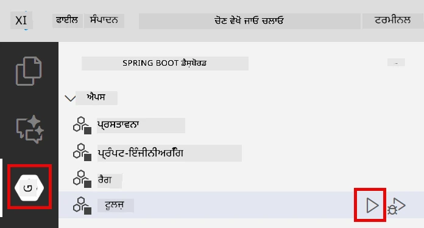
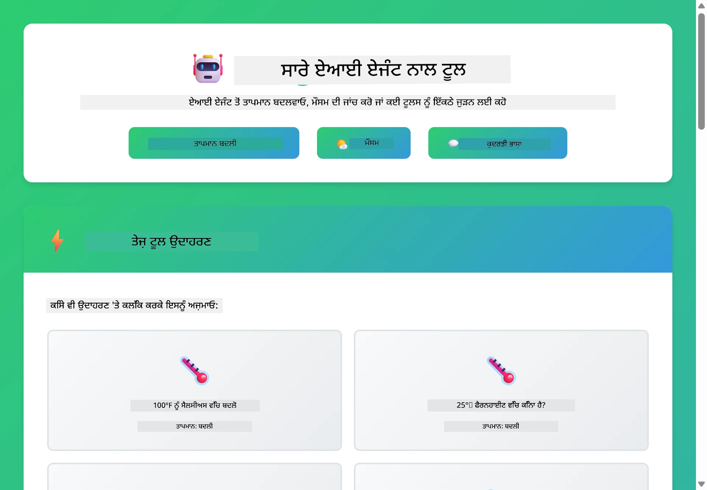

# ਮੋਡੀਊਲ 04: ਔਜ਼ਾਰਾਂ ਵਾਲੇ AI ਏਜੰਟ

## ਸਮਗਰੀ ਦੀ ਸੂਚੀ

- [ਵੀਡੀਓ ਵਾਕਥਰੂ](#ਵੀਡੀਓ-ਵਾਕਥਰੂ)
- [ਤੁਸੀਂ ਕੀ ਸਿੱਖੋਗੇ](#ਤੁਸੀਂ-ਕੀ-ਸਿੱਖੋਗੇ)
- [ਪੂਰਵ ਸ਼ਰਤਾਂ](#ਪੂਰਵ-ਸ਼ਰਤਾਂ)
- [ਔਜ਼ਾਰਾਂ ਵਾਲੇ AI ਏਜੰਟ ਸਮਝਣਾ](#ਔਜ਼ਾਰਾਂ-ਵਾਲੇ-ai-ਏਜੰਟ-ਸਮਝਣਾ)
- [ਔਜ਼ਾਰ ਕਾਲਿੰਗ ਕਿਵੇਂ ਕੰਮ ਕਰਦੀ ਹੈ](#ਔਜ਼ਾਰ-ਕਾਲਿੰਗ-ਕਿਵੇਂ-ਕੰਮ-ਕਰਦੀ-ਹੈ)
  - [ਔਜ਼ਾਰ ਪਰਿਭਾਸ਼ਾਵਾਂ](#ਔਜ਼ਾਰ-ਪਰਿਭਾਸ਼ਾਵਾਂ)
  - [ਫੈਸਲਾ ਲੈਣਾ](#ਫੈਸਲਾ-ਲੈਣਾ)
  - [ਕਾਰਜਾਨਵਣ](#ਕਾਰਜਾਨਵਣ)
  - [ਪ੍ਰਤੀਕਿਰਿਆ ਬਣਾਉਣਾ](#ਪ੍ਰਤੀਕਿਰਿਆ-ਬਣਾਉਣਾ)
  - [ਆਰਕੀਟੈਕਚਰ: ਸਪ੍ਰਿੰਗ ਬੂਟ ਆਟੋ-ਵਾਇਰਿੰਗ](#ਆਰਕੀਟੈਕਚਰ-ਸਪ੍ਰਿੰਗ-ਬੂਟ-ਆਟੋ-ਵਾਇਰਿੰਗ)
- [ਔਜ਼ਾਰ ਚੇਨਿੰਗ](#ਔਜ਼ਾਰ-ਚੇਨਿੰਗ)
- [ਐਪਲੀਕੇਸ਼ਨ ਚਲਾਉਣਾ](#ਐਪਲੀਕੇਸ਼ਨ-ਚਲਾਉਣਾ)
- [ਐਪਲੀਕੇਸ਼ਨ ਦੀ ਵਰਤੋਂ](#ਐਪਲੀਕੇਸ਼ਨ-ਦੀ-ਵਰਤੋਂ)
  - [ਸਰਲ ਔਜ਼ਾਰ ਵਰਤੋਂ ਟਰਾਈ ਕਰੋ](#ਸੌਖੇ-ਸੰਦ-ਦੀ-ਵਰਤੋਂ-آزਮਾਓ)
  - [ਔਜ਼ਾਰ ਚੇਨਿੰਗ ਟੈਸਟ ਕਰੋ](#ਸੰਦਾਂ-ਦੀ-ਲੜੀਖੇਪ-ਦੀ-ਟੈਸਟਿੰਗ-ਕਰੋ)
  - [ਗੱਲਬਾਤ ਦਾ ਪ੍ਰਵਾਹ ਵੇਖੋ](#ਗੱਲਬਾਤ-ਦਾ-ਪ੍ਰਵੇਹ-ਵੇਖੋ)
  - [ਵੱਖ-ਵੱਖ ਬੇਨਤੀਆਂ ਨਾਲ ਪ੍ਰਯੋਗ ਕਰੋ](#ਵੱਖ-ਵੱਖ-ਬੇਨਤੀਆਂ-ਨਾਲ-ਪ੍ਰਯੋਗ-ਕਰੋ)
- [ਮੁੱਖ ਸੰਕਲਪ](#ਮੁੱਖ-ਧਾਰਾਵਾਂ)
  - [ReAct ਪੈਟਰਨ (ਤਰਕ ਅਤੇ ਕਾਰਵਾਈ)](#react-ਪੈਟਰਨ-ਤਰੱਕੀ-ਅਤੇ-ਕਾਰਵਾਈ)
  - [ਔਜ਼ਾਰ ਵੇਰਵੇ ਮਹੱਤਵਪੂਰਨ ਹਨ](#ਸੰਦਾਂ-ਦਾ-ਵਰਣਨ-ਮਹੱਤਵਪੂਰਨ-ਹੈ)
  - [ਸੈਸ਼ਨ ਪ੍ਰਬੰਧਨ](#ਸੈਸ਼ਨ-ਪ੍ਰਬੰਧਨ)
  - [ਗਲਤੀ ਸੰਭਾਲ](#ਗਲਤੀ-ਸੰਭਾਲਣਾ)
- [ਉਪਲਬਧ ਔਜ਼ਾਰ](#ਉਪਲੱਬਧ-ਸੰਦ)
- [ਕਦੋਂ ਔਜ਼ਾਰ-ਆਧਾਰਿਤ ਏਜੰਟ ਵਰਤਣੇ](#ਕਦੋਂ-ਸੰਦ-ਆਧਾਰਿਤ-ਏਜੰਟ-ਵਰਤਣੇ)
- [ਔਜ਼ਾਰਾਂ ਅਤੇ RAG ਦੇ ਵਿਚਕਾਰ](#ਸੰਦ-ਬਨਾਮ-rag)
- [ਅੱਗੇ ਕਦਮ](#ਅਗਲੇ-ਕਦਮ)

## ਵੀਡੀਓ ਵਾਕਥਰੂ

ਇਸ ਲਾਈਵ ਸੈਸ਼ਨ ਨੂੰ ਦੇਖੋ ਜੋ ਇਸ ਮੋਡੀਊਲ ਨਾਲ ਸ਼ੁਰੂਆਤ ਕਰਨ ਬਾਰੇ ਸਮਝਾਉਂਦਾ ਹੈ:

<a href="https://www.youtube.com/watch?v=O_J30kZc0rw"></a>

## ਤੁਸੀਂ ਕੀ ਸਿੱਖੋਗੇ

ਇਸ ਤੱਕ, ਤੁਸੀਂ ਸਿੱਖਿਆ ਹੈ ਕਿ AI ਨਾਲ ਗੱਲਬਾਤ ਕਿਵੇਂ ਕਰਨੀ ਹੈ, ਪ੍ਰਾਂਪਟ ਨੂੰ ਪ੍ਰਭਾਵਸ਼ਾਲੀ ਢੰਗ ਨਾਲ ਬਣਾਉਣਾ ਅਤੇ ਆਪਣੇ ਦਸਤਾਵੇਜ਼ਾਂ 'ਚ ਜਵਾਬਾਂ ਨੂੰ ਅਧਾਰਿਤ ਕਰਨਾ। ਪਰ ਇੱਕ ਮੂਲ ਸੀਮਾ ਹੁਣ ਵੀ ਮੌਜੂਦ ਹੈ: ਭਾਸ਼ਾ ਮਾਡਲ ਸਿਰਫ ਲਿਖਤ ਤਿਆਰ ਕਰ ਸਕਦੇ ਹਨ। ਇਹ ਮੌਸਮ ਜਾਂਚ ਨਹੀਂ ਕਰ ਸਕਦੇ, ਗਣਨਾ ਨਹੀਂ ਕਰ ਸਕਦੇ, ਡਾਟਾਬੇਸਾਂ ਦਾ ਪੁੱਛ-ਗਿੱਛ ਨਹੀਂ ਕਰ ਸਕਦੇ ਜਾਂ ਬਾਹਰੀ ਸਿਸਟਮਾਂ ਨਾਲ ਸੰਚਾਰ ਨਹੀਂ ਕਰ ਸਕਦੇ।

ਔਜ਼ਾਰ ਇਸ ਨੂੰ ਬਦਲਦੇ ਹਨ। ਮਾਡਲ ਨੂੰ ਫੰਕਸ਼ਨਾਂ ਤੱਕ ਪਹੁੰਚ ਦੇ ਕੇ ਜੋ ਇਹ ਕਾਲ ਕਰ ਸਕਦਾ ਹੈ, ਤੁਸੀਂ ਇਸ ਨੂੰ ਲਿਖਤ ਜਨਰੇਟਰ ਤੋਂ ਇੱਕ ਏਜੰਟ ਵਿਚ ਬਦਲ ਦਿੰਦੇ ਹੋ ਜੋ ਕਾਰਵਾਈ ਕਰ ਸਕਦਾ ਹੈ। ਮਾਡਲ ਫ਼ੈਸਲਾ ਕਰਦਾ ਹੈ ਕਿ ਕਿਸ ਵੇਲੇ ਔਜ਼ਾਰ ਚਾਹੀਦਾ ਹੈ, ਕਿਹੜਾ ਔਜ਼ਾਰ ਵਰਤਣਾ ਹੈ, ਅਤੇ ਕਿਹੜੇ ਪੈਰਾਮੀਟਰ ਦਿੱਤੇ ਜਾਣ। ਤੁਹਾਡੇ ਕੋਡ ਨੇ ਫੰਕਸ਼ਨ ਨੂੰ ਚਲਾਉਂਦਾ ਹੈ ਅਤੇ ਨਤੀਜਾ ਵਾਪਸ ਕਰਦਾ ਹੈ। ਮਾਡਲ ਉਸ ਨਤੀਜੇ ਨੂੰ ਆਪਣੇ ਜਵਾਬ ਵਿੱਚ ਸ਼ਾਮِل ਕਰਦਾ ਹੈ।

## ਪੂਰਵ ਸ਼ਰਤਾਂ

- [ਮੋਡੀਊਲ 01 - ਪ੍ਰਾਰੰਭਿਕ ਜਾਣਕਾਰੀ](../01-introduction/README.md) ਪੂਰਾ ਕੀਤਾ ਹੋਇਆ (ਐਜ਼ੂਰ OpenAI ਸਰੋਤ ਤਿਆਰ ਕੀਤੇ ਹੋਏ)
- ਪਹਿਲਾਂ ਦੇ ਮੋਡੀਊਲ ਪੂਰੇ ਹੋਏ, ਜੋ ਸਿਫ਼ਾਰਸ਼ ਕੀਤੇ ਗਏ ਹਨ (ਇਸ ਮੋਡੀਊਲ ਵਿੱਚ ਔਜ਼ਾਰਾਂ ਅਤੇ RAG ਤੁਲਨਾ ਵਿੱਚ [ਮੋਡੀਊਲ 03 ਤੋਂ RAG ਸੰਕਲਪ](../03-rag/README.md) ਦਾ ਹਵਾਲਾ ਹੈ)
- ਰੂਟ ਡਾਇਰੈਕਟਰੀ ਵਿੱਚ `.env` ਫਾਇਲ ਐਜ਼ੂਰ ਪ੍ਰਮਾਣ ਪੱਤਰਾਂ ਨਾਲ (ਮੋਡੀਊਲ 01 ਵਿੱਚ `azd up` ਦੁਆਰਾ ਬਣਾਈ ਗਈ)

> **ਨੋਟ:** ਜੇ ਤੁਸੀਂ ਮੋਡੀਊਲ 01 ਨਹੀਂ ਕੀਤਾ, ਤਾਂ ਪਹਿਲਾਂ ਉੱਥੇ ਦਿੱਤੇ ਗਏ ਤੈਅਕਰਨ ਨਿਰਦੇਸ਼ਾਂ ਦੀ ਪਾਲਣਾ ਕਰੋ।

## ਔਜ਼ਾਰਾਂ ਵਾਲੇ AI ਏਜੰਟ ਸਮਝਣਾ

> **📝 ਨੋਟ:** ਇਸ ਮੋਡੀਊਲ ਵਿੱਚ "ਏਜੰਟ" ਸ਼ਬਦ ਉਹ AI ਸਹਾਇਕ ਹਨ ਜਿਹੜੇ ਔਜ਼ਾਰ ਕਾਲ ਕਰਨ ਵਾਲੀ ਸਮਰੱਥਾ ਨਾਲ ਬੜ੍ਹਾਏ ਗਏ ਹਨ। ਇਹ ਉਸ ਤੋਂ ਵੱਖਰਾ ਹੈ ਜੋ ਅਸੀਂ [ਮੋਡੀਊਲ 05: MCP](../05-mcp/README.md) ਵਿੱਚ ਕਵਰ ਕਰਾਂਗੇ — "ਏਜੰਟਿਕ AI" ਪੈਟਰਨ (ਆਤਮਨਿਰਭਰ ਏਜੰਟ ਜਿਸ ਵਿੱਚ ਯੋਜਨਾ, ਯਾਦ, ਅਤੇ ਬਹੁ-ਕਦਮੀ ਤਰਕ ਸ਼ਾਮਿਲ ਹੈ)।

ਬਿਨਾਂ ਔਜ਼ਾਰਾਂ ਦੇ, ਭਾਸ਼ਾ ਮਾਡਲ ਸਿਰਫ ਆਪਣੀ ਸਿਖਲਾਈ ਡਾਟਾ ਵਿੱਚੋਂ ਲਿਖਤ ਤਿਆਰ ਕਰ ਸਕਦਾ ਹੈ। ਮੌਜੂਦਾ ਮੌਸਮ ਬਾਰੇ ਪੁੱਛੋ, ਤਾਂ ਇਹ ਅੰਦਾਜ਼ਾ ਲੱਗਾਉਂਦਾ ਹੈ। ਪਰ ਜੇ ਤੁਸੀਂ ਇਸ ਨੂੰ ਔਜ਼ਾਰ ਦਿੰਦੇ ਹੋ, ਤਾਂ ਇਹ ਮੌਸਮ API ਕਾਲ ਕਰ ਸਕਦਾ ਹੈ, ਗਣਨਾ ਕਰ ਸਕਦਾ ਹੈ, ਜਾਂ ਡਾਟਾਬੇਸ ਨੂੰ ਪੁੱਛ ਸਕਦਾ ਹੈ — ਫਿਰ ਉਹ ਅਸਲੀ ਨਤੀਜੇ ਆਪਣੇ ਜਵਾਬ ਵਿੱਚ ਗੂੰਦਦਾ ਹੈ।


*ਬਿਨਾਂ ਔਜ਼ਾਰਾਂ ਦੇ ਮਾਡਲ ਸਿਰਫ ਅੰਦਾਜ਼ਾ ਲਗਾ ਸਕਦਾ ਹੈ — ਔਜ਼ਾਰਾਂ ਨਾਲ ਇਹ API ਕਾਲ ਕਰ ਸਕਦਾ ਹੈ, ਗਣਤੀਆਂ ਚਲਾ ਸਕਦਾ ਹੈ ਅਤੇ ਹਕੀਕਤੀ ਸਮਾਂ ਡਾਟਾ ਵਾਪਸ ਕਰ ਸਕਦਾ ਹੈ।*

ਔਜ਼ਾਰਾਂ ਵਾਲਾ AI ਏਜੰਟ ਇੱਕ **ਤਰਕਸ਼ੀਲ ਅਤੇ ਕਾਰਵਾਈ (ReAct)** ਪੈਟਰਨ ਨੂੰ ਫਾਲੋ ਕਰਦਾ ਹੈ। ਮਾਡਲ ਸਿਰਫ ਜਵਾਬ ਨਹੀਂ ਦਿੰਦਾ — ਇਹ ਸੋਚਦਾ ਹੈ ਕਿ ਉਸਨੂੰ ਕੀ ਚਾਹੀਦਾ ਹੈ, ਕੰਮ ਕਰਦਾ ਹੈ ਔਜ਼ਾਰ ਕਾਲ ਕਰਕੇ, ਨਤੀਜਾ ਦੇਖਦਾ ਹੈ, ਅਤੇ ਫਿਰ ਫ਼ੈਸਲਾ ਕਰਦਾ ਹੈ ਕਿ ਦੁਬਾਰਾ ਕਾਰਵਾਈ ਕਰਨੀ ਹੈ ਜਾਂ ਅੰਤਿਮ ਜਵਾਬ ਦੇਣਾ ਹੈ:

1. **ਤਰਕਸ਼ੀਲਤਾ** — ਏਜੰਟ ਯੂਜ਼ਰ ਦੇ ਸਵਾਲ ਦੀ ਵਿਸ਼ਲੇਸ਼ਣਾ ਕਰਦਾ ਹੈ ਅਤੇ ਫੈਸਲਾ ਕਰਦਾ ਹੈ ਕਿ ਕੀ ਜਾਣਕਾਰੀ ਚਾਹੀਦੀ ਹੈ
2. **ਕਾਰਵਾਈ** — ਏਜੰਟ ਸਹੀ ਔਜ਼ਾਰ ਚੁਣਦਾ ਹੈ, ਸਹੀ ਪੈਰਾਮੀਟਰ ਤਿਆਰ ਕਰਦਾ ਹੈ ਅਤੇ ਉਸਨੂੰ ਕਾਲ ਕਰਦਾ ਹੈ
3. **ਅਵਲੋਕਨ** — ਏਜੰਟ ਔਜ਼ਾਰ ਦਾ ਨਤੀਜਾ ਲੈਂਦਾ ਹੈ ਅਤੇ ਉਸਦੀ ਮੁਲਾਂਕਣ ਕਰਦਾ ਹੈ
4. **ਦੋਹਰਾਵਟ ਜਾਂ ਜਵਾਬ** — ਹੋਰ ਡਾਟਾ ਚਾਹੀਦਾ ਹੋਵੇ ਤਾਂ ਲੂਪ ਵਾਪਸ ਕਰਦਾ ਹੈ, ਨਹੀਂ ਤਾਂ ਫਿਰ ਕੁਦਰਤੀ ਭਾਸ਼ਾ ਦਾ ਜਵਾਬ ਤਿਆਰ ਕਰਦਾ ਹੈ


*ReAct ਚਕਰ — ਏਜੰਟ ਸੋਚਦਾ ਹੈ ਕਿ ਕੀ ਕਰਨਾ ਹੈ, ਔਜ਼ਾਰ ਕਾਲ ਕਰਕੇ ਕਾਰਵਾਈ ਕਰਦਾ ਹੈ, ਨਤੀਜਾ ਵੇਖਦਾ ਹੈ, ਅਤੇ ਲੂਪ ਕਰਦਾ ਹੈ ਜਦ ਤੱਕ ਅੰਤਿਮ ਜਵਾਬ ਦੇ ਸਕੇ।*

ਇਹ ਸਾਰਾ ਪ੍ਰਕਿਰਿਆ ਸਵੈਚਾਲਿਤ ਹੁੰਦੀ ਹੈ। ਤੁਸੀਂ ਔਜ਼ਾਰਾਂ ਅਤੇ ਉਹਨਾਂ ਦੇ ਵੇਰਵੇ ਤਿਆਰ ਕਰਦੇ ਹੋ। ਮਾਡਲ ਇਹ ਫੈਸਲਾ ਕਰਦਾ ਹੈ ਕਿ ਕਦੋਂ ਤੇ ਕਿਵੇਂ ਉਨ੍ਹਾਂ ਨੂੰ ਵਰਤਣਾ ਹੈ।

## ਔਜ਼ਾਰ ਕਾਲਿੰਗ ਕਿਵੇਂ ਕੰਮ ਕਰਦੀ ਹੈ

### ਔਜ਼ਾਰ ਪਰਿਭਾਸ਼ਾਵਾਂ

[WeatherTool.java](../../../04-tools/src/main/java/com/example/langchain4j/agents/tools/WeatherTool.java) | [TemperatureTool.java](../../../04-tools/src/main/java/com/example/langchain4j/agents/tools/TemperatureTool.java)

ਤੁਸੀਂ ਫੰਕਸ਼ਨਾਂ ਨੂੰ ਸਾਫ਼-ਸੁਥਰੇ ਵੇਰਵਿਆਂ ਅਤੇ ਪੈਰਾਮੀਟਰ ਨਿਰਧਾਰਣਾਂ ਦੇ ਨਾਲ ਪਰਿਭਾਸ਼ਿਤ ਕਰਦੇ ਹੋ। ਮਾਡਲ ਇਹ ਵੇਰਵੇ ਆਪਣੀ ਸਿਸਟਮ ਪ੍ਰਾਂਪਟ ਵਿੱਚ ਵੇਖਦਾ ਹੈ ਅਤੇ ਸਮਝਦਾ ਹੈ ਕਿ ਹਰ ਇੱਕ ਔਜ਼ਾਰ ਕੀ ਕਰਦਾ ਹੈ।

```java
@Component
public class WeatherTool {
    
    @Tool("Get the current weather for a location")
    public String getCurrentWeather(@P("Location name") String location) {
        // ਤੁਹਾਡਾ ਮੌਸਮ ਲੁੱਕਅਪ ਲੋਜਿਕ
        return "Weather in " + location + ": 22°C, cloudy";
    }
}

@AiService
public interface Assistant {
    String chat(@MemoryId String sessionId, @UserMessage String message);
}

// ਸਹਾਇਕ ਆਪੋ-ਆਪਣੇ ਸਪ੍ਰਿੰਗ ਬੂਟ ਨਾਲ ਜੁੜਿਆ ਹੁੰਦਾ ਹੈ:
// - ਚੈਟਮੌਡਲ ਬੀਨ
// - ਸਾਰੇ @Component ਕਲਾਸਾਂ ਤੋਂ @Tool ਵਿਧੀਆਂ
// - ਸੈਸ਼ਨ ਪ੍ਰਬੰਧਨ ਲਈ ChatMemoryProvider
```

ਹੇਠਾਂ ਦਿੱਤਾ ਚਿੱਤਰ ਉਨ੍ਹਾਂ ਹਰ ਇਸ਼ਾਰੇ ਨੂੰ ਵੰਡਦਾ ਹੈ ਅਤੇ ਦਿਖਾਉਂਦਾ ਹੈ ਕਿ ਹਰ ਹਿੱਸਾ AI ਨੂੰ ਕਿਵੇਂ ਸਮਝਾਉਂਦਾ ਹੈ ਕਿ ਕਦੋਂ ਔਜ਼ਾਰ ਕਾਲ ਕਰਨਾ ਹੈ ਅਤੇ ਕਿਹੜੇ ਆਰਗੁਮੈਂਟ ਪਾਸ ਕਰਨੇ ਹਨ:


*ਔਜ਼ਾਰ ਪਰਿਭਾਸ਼ਾ ਦਾ ਡਾਂਚਾ — @Tool AI ਨੂੰ ਦੱਸਦਾ ਹੈ ਕਦੋਂ ਇਸਨੂੰ ਵਰਤਣਾ ਹੈ, @P ਹਰ ਪੈਰਾਮੀਟਰ ਨੂੰ ਵੇਖਾਉਂਦਾ ਹੈ, ਅਤੇ @AiService ਸਾਰਾ ਕੁਝ ਸਟਾਰਟਅਪ 'ਤੇ ਜੋੜਦਾ ਹੈ।*

> **🤖 [GitHub Copilot](https://github.com/features/copilot) ਚੈਟ ਨਾਲ ਕੋਸ਼ਿਸ਼ ਕਰੋ:** [`WeatherTool.java`](../../../04-tools/src/main/java/com/example/langchain4j/agents/tools/WeatherTool.java) ਖੋਲ੍ਹੋ ਅਤੇ ਪੁੱਛੋ:
> - "ਮੈਂ ਕਿਵੇਂ ਮੌਸਮ ਲਈ ਅਸਲ OpenWeatherMap API ਨੂੰ ਮੌਕ ਡਾਟਾ ਦੀ ਥਾਂ ਇੰਟਿਗ੍ਰੇਟ ਕਰਾਂ?"
> - "ਇੱਕ ਚੰਗਾ ਔਜ਼ਾਰ ਵੇਰਵਾ ਕੀ ਹੈ ਜੋ AI ਨੂੰ ਸਹੀ ਤਰੀਕੇ ਨਾਲ ਵਰਤਣ ਵਿੱਚ ਮਦਦ ਕਰਦਾ ਹੈ?"
> - "ਮੈਂ ਔਜ਼ਾਰ ਵਿਚ API ਗਲਤੀਆਂ ਅਤੇ ਦਰ ਸੀਮਾਵਾਂ ਨੂੰ ਕਿਵੇਂ ਸੰਭਾਲਾਂ?"

### ਫੈਸਲਾ ਲੈਣਾ

ਜਦੋਂ ਯੂਜ਼ਰ ਪੁੱਛਦਾ ਹੈ "ਸੀਅਟਲ ਵਿੱਚ ਮੌਸਮ ਕੀ ਹੈ?", ਮਾਡਲ ਬੇਤਕਲੀਫ਼ੀ ਨਾਲ ਕੋਈ ਔਜ਼ਾਰ ਨਹੀਂ ਚੁਣਦਾ। ਇਹ ਯੂਜ਼ਰ ਦੇ ਮਨਸੂਬੇ ਦੀ ਤੁਲਨਾ ਹਰ ਇੱਕ ਔਜ਼ਾਰ ਦੇ ਵੇਰਵੇ ਨਾਲ ਕਰਦਾ ਹੈ ਜੋ ਉਸਨੂੰ ਮਿਲਦਾ ਹੈ, ਹਰ ਇੱਕ ਦੀ ਸੰਬੰਧਿਤਤਾ ਅਨੁਸਾਰ ਸਕੋਰ ਕਰਦਾ ਹੈ, ਅਤੇ ਸਭ ਤੋਂ ਵਧੀਆ ਹੀ ਚੁਣਦਾ ਹੈ। ਫਿਰ ਇਹ ਸਹੀ ਪੈਰਾਮੀਟਰਾਂ ਨਾਲ ਮਿਲ ਕੇ ਇੱਕ ਸੰਰਚਿਤ ਫੰਕਸ਼ਨ ਕਾਲ ਬਣਾਉਂਦਾ ਹੈ — ਇਸ ਮਾਮਲੇ ਵਿੱਚ, `location` ਨੂੰ `"Seattle"` ਸੈੱਟ ਕਰਦਾ ਹੈ।

ਜੇ ਕੋਈ ਔਜ਼ਾਰ ਯੂਜ਼ਰ ਦੀ ਬੇਨਤੀ ਨਾਲ ਮਿਲਦਾ ਨਹੀਂ, ਤਾਂ ਮਾਡਲ ਆਪਣੇ ਗਿਆਨ ਤੋਂ ਜਵਾਬ ਦਿੰਦਾ ਹੈ। ਜੇ ਕਈ ਔਜ਼ਾਰ ਮਿਲਦੇ ਹਨ, ਮਾਡਲ ਸਭ ਤੋਂ ਖਾਸ ਉਪਯੋਗ ਚੁਣਦਾ ਹੈ।


*ਮਾਡਲ ਹਰ ਉਪਲਬਧ ਔਜ਼ਾਰ ਨੂੰ ਯੂਜ਼ਰ ਦੇ ਮਨਸੂਬੇ ਦੇ ਮੁਕਾਬਲੇ ਦਾ ਮੁਆਇਨਾ ਕਰਦਾ ਹੈ ਅਤੇ ਸਭ ਤੋਂ ਵਧੀਆ ਮੇਲ ਚੁਣਦਾ ਹੈ — ਇਸ ਲਈ ਸਾਫ਼ ਅਤੇ ਖਾਸ ਔਜ਼ਾਰ ਵੇਰਵੇ ਲਿਖਣਾ ਮਹੱਤਵਪੂਰਨ ਹੈ।*

### ਕਾਰਜਾਨਵਣ

[AgentService.java](../../../04-tools/src/main/java/com/example/langchain4j/agents/service/AgentService.java)

ਸਪ੍ਰਿੰਗ ਬੂਟ ਡਿਕਲੇਅਰਟਿਵ `@AiService` ਇੰਟਰਫੇਸ ਨੂੰ ਸਾਰੇ ਰਜਿਸਟਰਡ ਔਜ਼ਾਰਾਂ ਨਾਲ ਆਟੋ-ਵਾਇਰ ਕਰਦਾ ਹੈ, ਅਤੇ LangChain4j ਆਪਣੇ ਆਪ ਔਜ਼ਾਰਾਂ ਦੀ ਕਾਲ ਕਰਦਾ ਹੈ। ਪਿੱਛੇ ਦੇ ਮੰਜਰ ਵਿੱਚ, ਇੱਕ ਪੂਰਾ ਔਜ਼ਾਰ ਕਾਲ ਛੇ ਮੰਚਾਂ ਰਾਹੀਂ ਲੰਘਦਾ ਹੈ — ਯੂਜ਼ਰ ਦੇ ਕੁਦਰਤੀ ਭਾਸ਼ਾ ਸਵਾਲ ਤੋਂ ਲੈ ਕੇ ਕੁਦਰਤੀ ਭਾਸ਼ਾ ਜਵਾਬ ਤੱਕ:


*ਐਂਡ-ਟੂ-ਐਂਡ ਫਲੋ — ਯੂਜ਼ਰ ਸਵਾਲ ਪੁੱਛਦਾ ਹੈ, ਮਾਡਲ ਔਜ਼ਾਰ ਚੁਣਦਾ ਹੈ, LangChain4j ਨੂੰ ਚਲਾਉਂਦਾ ਹੈ, ਅਤੇ ਮਾਡਲ ਨਤੀਜਾ ਕੁਦਰਤੀ ਜਵਾਬ ਵਿੱਚ ਗੂੰਦਦਾ ਹੈ।*

ਪਿੱਛੇ, `AiServices` ਕਿਸੇ ਵੀ ਔਜ਼ਾਰ ਲਈ ਇਸੇ ਔਜ਼ਾਰ-ਕਾਲ ਲੂਪ ਨੂੰ ਦੌੜਾਉਂਦਾ ਹੈ — ਇੱਥੇ ਇੱਕ ਸਧਾਰਣ `Calculator` ਨਾਲ ਦਰਸਾਇਆ ਗਿਆ ਹੈ। ਹੇਠਾਂ ਦਿੱਤਾ ਸੀਕੁਂਸ ਡਾਇਗ੍ਰਾਮ ਦਿਖਾਉਂਦਾ ਹੈ ਕਿ ਛੱਡੇ ਪੱਧਰ 'ਤੇ ਕੀ ਹੁੰਦਾ ਹੈ:


*ਔਜ਼ਾਰ ਕਾਲ ਲੂਪ — `AiServices` ਤੁਹਾਡਾ ਸੰਦੇਸ਼ ਅਤੇ ਔਜ਼ਾਰ ਸਕੀਮਾਂ LLM ਨੂੰ ਭੇਜਦਾ ਹੈ, LLM ਨੇ `add(42, 58)` ਵਰਗਾ ਫੰਕਸ਼ਨ ਕਾਲ ਜਵਾਬ ਦਿੰਦਾ ਹੈ, LangChain4j `Calculator` ਥਾਂ-ਥਾਂ ਚਲਾਉਂਦਾ ਹੈ, ਅਤੇ ਨਤੀਜਾ ਵਾਪਸ ਭੇਜਦਾ ਹੈ ਅੰਤਿਮ ਜਵਾਬ ਲਈ।*

> **🤖 [GitHub Copilot](https://github.com/features/copilot) ਚੈਟ ਨਾਲ ਕੋਸ਼ਿਸ਼ ਕਰੋ:** [`AgentService.java`](../../../04-tools/src/main/java/com/example/langchain4j/agents/service/AgentService.java) ਖੋਲ੍ਹੋ ਅਤੇ ਪੁੱਛੋ:
> - "ReAct ਪੈਟਰਨ ਕਿਵੇਂ ਕੰਮ ਕਰਦਾ ਹੈ ਅਤੇ AI ਏਜੰਟ ਲਈ ਇਹ ਕਿਉਂ ਪ੍ਰਭਾਵਸ਼ਾਲੀ ਹੈ?"
> - "ਏਜੰਟ ਕਿਵੇਂ ਫੈਸਲਾ ਕਰਦਾ ਹੈ ਕਿ ਕਿਹੜਾ ਔਜ਼ਾਰ ਅਤੇ ਕਿਸ ਕ੍ਰਮ ਵਿੱਚ ਵਰਤਣਾ ਹੈ?"
> - "ਜੇ ਕੋਈ ਔਜ਼ਾਰ ਕਾਰਜਾਨਵਣ ਅਸਫਲ ਹੁੰਦਾ ਹੈ ਤਾਂ ਕੀ ਹੁੰਦਾ ਹੈ - ਮੈਂ ਗਲਤੀਆਂ ਨੂੰ ਕਿਵੇਂ ਮਜ਼ਬੂਤੀ ਨਾਲ ਸੰਭਾਲਾਂ?"

### ਪ੍ਰਤੀਕਿਰਿਆ ਬਣਾਉਣਾ

ਮਾਡਲ ਮੌਸਮ ਡਾਟਾ ਪ੍ਰਾਪਤ ਕਰਦਾ ਹੈ ਅਤੇ ਯੂਜ਼ਰ ਲਈ ਕੁਦਰਤੀ ਭਾਸ਼ਾ ਵਿੱਚ ਜਵਾਬ ਤਿਆਰ ਕਰਦਾ ਹੈ।

### ਆਰਕੀਟੈਕਚਰ: ਸਪ੍ਰਿੰਗ ਬੂਟ ਆਟੋ-ਵਾਇਰਿੰਗ

ਇਹ ਮੋਡੀਊਲ LangChain4j ਦੀ ਸਪ੍ਰਿੰਗ ਬੂਟ ਇੰਟੀਗਰੇਸ਼ਨ ਨੂੰ ਡਿਕਲੇਅਰਟਿਵ `@AiService` ਇੰਟਰਫੇਸਾਂ ਨਾਲ ਵਰਤਦਾ ਹੈ। ਸਟਾਰਟਅਪ 'ਤੇ ਸਪ੍ਰਿੰਗ ਬੂਟ ਹਰ `@Component` ਜੋ `@Tool` ਮੈਥਡ ਸਮੇਤ ਹੁੰਦਾ ਹੈ, ਤੁਹਾਡਾ `ChatModel` ਬੀਨ, ਅਤੇ `ChatMemoryProvider` ਨੂੰ ਖੋਜਦਾ ਹੈ — ਫਿਰ ਸਾਰੇ ਨੂੰ ਇੱਕ ਇੱਕਲ `Assistant` ਇੰਟਰਫੇਸ ਵਿੱਚ ਜੁੜਦਾ ਹੈ ਬਿਨਾਂ ਕਿਸੇ ਸਰਕਾਰੀ ਕੋਡ ਦੇ।


*@AiService ਇੰਟਰਫੇਸ ChatModel, ਔਜ਼ਾਰ ਸੰਘਟਕ, ਅਤੇ ਮੈਮੋਰੀ ਪ੍ਰੋਵਾਈਡਰ ਨਾਲ ਜੋੜਦਾ ਹੈ — ਸਪ੍ਰਿੰਗ ਬੂਟ ਸਾਰਾ ਵਾਇਰਿੰਗ ਖੁਦ ਕਰ ਲੈਂਦਾ ਹੈ।*

ਹੇਠਾਂ ਪੂਰੀ ਬੇਨਤੀ ਜੀਵਨਚੱਕਰ ਹੈ ਪ੍ਰਦਰਸ਼ਿਤ ਇੱਕ ਸੀਕੁਂਸ ਡਾਇਗ੍ਰਾਮ ਵਜੋਂ — HTTP ਬੇਨਤੀ ਤੋਂ ਲੈ ਕੇ ਕੰਟਰੋਲਰ, ਸਰਵਿਸ, ਅਤੇ ਆਟੋ-ਵਾਇਰਡ ਪ੍ਰਾਕਸੀ, ਔਜ਼ਾਰ ਕਾਰਜਾਨਵਣ ਤੱਕ ਅਤੇ ਵਾਪਸ:


*ਪੂਰੀ ਸਪ੍ਰਿੰਗ ਬੂਟ ਬੇਨਤੀ ਜੀਵਨਚੱਕਰ — HTTP ਬੇਨਤੀ ਕੰਟਰੋਲਰ ਤੇ ਸਰਵਿਸ ਰਾਹੀਂ ਆਟੋ-ਵਾਇਰਡ Assistant ਪ੍ਰਾਕਸੀ ਤੱਕ ਜਾਂਦੀ ਹੈ, ਜੋ ਕਿ LLM ਅਤੇ ਔਜ਼ਾਰ ਕਾਲਾਂ ਨੂੰ ਆਪਣੇ ਆਪ ਕਾਬੂ ਕਰਦਾ ਹੈ।*

ਇਸ ਤਰੀਕੇ ਦੇ ਮੁੱਖ ਲਾਭ:

- **ਸਪ੍ਰਿੰਗ ਬੂਟ ਆਟੋ-ਵਾਇਰਿੰਗ** — ChatModel ਅਤੇ ਔਜ਼ਾਰਾਂ ਨੂੰ ਆਪਣੇ ਆਪ ਇੰਜੈਕਟ ਕਰਦਾ ਹੈ
- **@MemoryId ਪੈਟਰਨ** — ਆਪਣੇ ਆਪ ਸੈਸ਼ਨ-ਆਧਾਰਿਤ ਯਾਦ ਪ੍ਰਬੰਧਨ
- **ਇੱਕਲ ਦਰਜਾ** — ਇੱਕ ਵਾਰੀ Assistant ਬਣਾਇਆ ਜਾਂਦਾ ਹੈ ਅਤੇ ਬਿਹਤਰ ਪ੍ਰਦਰਸ਼ਨ ਲਈ ਵਾਰ-ਵਾਰ ਵਰਤਿਆ ਜਾਂਦਾ ਹੈ
- **ਟਾਈਪ-ਸੁਰੱਖਿਅਤ ਕਾਰਜਾਨਵਣ** — ਜਾਵਾ ਮੈਥਡ ਸਿੱਧੇ ਤੌਰ ਤੇ ਟਾਈਪ ਰੂਪਾਂਤਰ ਕਰਕੇ ਕੂਲ੍ਹੇ ਜਾਂਦੇ ਹਨ
- **ਬਹੁ-ਮੁੜ ਘੁੰਮਾਵਾ ਅਯੋਜਨ** — ਔਜ਼ਾਰ ਚੇਨਿੰਗ ਨੂੰ ਆਪਣੇ ਆਪ ਹੈਂਡਲ ਕਰਦਾ ਹੈ
- **ਕੋਈ ਬੋਰਡ ਕੋਡ ਨਹੀਂ** — ਕੋਈ ਹੱਥੋਂ `AiServices.builder()` ਕਾਲ ਜਾਂ ਯਾਦ HashMap ਨਹੀਂ

ਵਿਕਲਪੀ ਤਰੀਕੇ (ਹੱਥੋਂ `AiServices.builder()`) ਵਿੱਚ ਵਧ ਕੋਡ ਲੱਗਦਾ ਹੈ ਤੇ ਸਪ੍ਰਿੰਗ ਬੂਟ ਇੰਟੀਗਰੇਸ਼ਨ ਲਾਭ ਧੁੰਦਲੇ ਹੋ ਜਾਂਦੇ ਹਨ।

## ਔਜ਼ਾਰ ਚੇਨਿੰਗ

**ਔਜ਼ਾਰ ਚੇਨਿੰਗ** — ਔਜ਼ਾਰ-ਆਧਾਰਿਤ ਏਜੰਟਾਂ ਦੀ ਅਸਲੀ ਤਾਕਤ ਤਦ ਵੇਖਣ ਨੂੰ ਮਿਲਦੀ ਹੈ ਜਦੋਂ ਕਿਸੇ ਇੱਕ ਸਵਾਲ ਲਈ ਕਈ ਔਜ਼ਾਰਾਂ ਦੀ ਲੋੜ ਹੁੰਦੀ ਹੈ। ਪੁੱਛੋ "ਸੀਅਟਲ ਦਾ ਮੌਸਮ ਫੈਰਨਹਾਈਟ ਵਿੱਚ ਕੀ ਹੈ?" ਅਤੇ ਏਜੰਟ ਖੁਦ ਬ-ਖੁਦ ਦੋ ਔਜ਼ਾਰ ਬੰਨ੍ਹਦਾ ਹੈ: ਪਹਿਲਾਂ `getCurrentWeather` ਨੂੰ ਕਾਲ ਕਰਦਾ ਹੈ ਤਾਂ ਜੋ ਸੈਲਸਿਅਸ ਵਿੱਚ ਤਾਪਮਾਨ ਮਿਲੇ, ਫਿਰ ਉਸ ਮੁੱਲ ਨੂੰ `celsiusToFahrenheit` ਨੂੰ ਦਿੰਦਾ ਹੈ ਤਬਦੀਲੀ ਲਈ — ਇਹ ਸਾਰਾ ਇੱਕ ਗੱਲਬਾਤ ਵਿੱਚ ਹੁੰਦਾ ਹੈ।


*ਔਜ਼ਾਰ ਚੇਨਿੰਗ ਕਾਰਵਾਈ ਵਿੱਚ — ਏਜੰਟ ਪਹਿਲਾਂ getCurrentWeather ਕਾਲ ਕਰਦਾ ਹੈ, ਫਿਰ ਸੈਲਸਿਅਸ ਨਤੀਜੇ ਨੂੰ celsiusToFahrenheit ਵਿੱਚ ਪਾਈਪ ਕਰਦਾ ਹੈ, ਅਤੇ ਮਿਲੀ ਜੁਲੀ ਜਵਾਬ ਦਿੰਦਾ ਹੈ।*

**ਸੁਮਝਦਾਰ ਗਲਤੀ ਸੰਭਾਲ:** ਕਿਸੇ ਅਜਿਹਾ ਸ਼ਹਿਰ ਪੁੱਛੋ ਜਿਹੜਾ ਮੌਕ ਡਾਟਾ ਵਿੱਚ ਨਾ ਹੋਵੇ। ਔਜ਼ਾਰ ਗਲਤੀ ਸੁਨੇਹਾ ਵਾਪਸ ਕਰਦਾ ਹੈ, ਅਤੇ AI ਸਮਝਾਉਂਦਾ ਹੈ ਕਿ ਉਹ ਮਦਦ ਨਹੀਂ ਕਰ ਸਕਦਾ ਬਜਾਏ ਕਿ ਐਪ्लਿਕੇਸ਼ਨ ਕ੍ਰੈਸ਼ ਹੋ ਜਾਵੇ। ਔਜ਼ਾਰ ਸੁਰੱਖਿਅਤ ਤਰੀਕੇ ਨਾਲ ਫੇਲ ਹੁੰਦੇ ਹਨ। ਹੇਠਾਂ ਦਿੱਤਾ ਚਿੱਤਰ ਦੋਹਾਂ ਢੰਗਾਂ ਦਾ ਤુલਨਾਤਮਕ ਦਰਸ਼ਨ ਦਿੰਦਾ ਹੈ — ਠੀਕ ਗਲਤੀ ਸੰਭਾਲ ਨਾਲ ਏਜੰਟ ਅਪਵਾਦ ਫੜਦਾ ਹੈ ਅਤੇ ਮਦਦਗਾਰ ਜਵਾਬ ਦਿੰਦਾ ਹੈ, ਬਿਨਾਂ ਇਸ ਦੇ ਸਾਰੀ ਐਪ crash ਹੋ ਜਾਂਦੀ ਹੈ:


*ਜਦੋਂ ਔਜ਼ਾਰ ਫੇਲ ਹੁੰਦਾ ਹੈ, ਏਜੰਟ ਗਲਤੀ ਫੜਦਾ ਹੈ ਅਤੇ ਕ੍ਰੈਸ਼ ਹੋਣ ਦੀ ਥਾਂ ਮਦਦਗਾਰ ਵਰਣਨ ਦਿੰਦਾ ਹੈ।*

ਇਹ ਸਾਰਾ ਇੱਕ ਗੱਲਬਾਤ ਵਿੱਚ ਹੁੰਦਾ ਹੈ। ਏਜੰਟ ਖੁਦ-ਮੁਖਤਿਆਰ ਤੌਰ ਤੇ ਕਈ ਔਜ਼ਾਰਾਂ ਦੀ ਕਾਲਾਂ ਸੰਚਾਲਿਤ ਕਰਦਾ ਹੈ।

## ਐਪਲੀਕੇਸ਼ਨ ਚਲਾਉਣਾ

**ਤੈਅਕਰਨ ਦੀ ਪੁਸ਼ਟੀ ਕਰੋ:**

ਸੁਨਿਸ਼ਚਿਤ ਕਰੋ ਕਿ ਰੂਟ ਡਾਇਰੈਕਟਰੀ ਵਿੱਚ `.env` ਫਾਇਲ ਹੈ ਜੋ ਐਜ਼ੂਰ ਪ੍ਰਮਾਣ ਪੱਤਰਾਂ ਨਾਲ ਹੈ (ਮੋਡੀਊਲ 01 ਦੌਰਾਨ ਬਣਾਈ ਗਈ)। ਇਸਨੂੰ ਮੋਡੀਊਲ ਡਾਇਰੈਕਟਰੀ (`04-tools/`) ਤੋਂ ਚਲਾਓ:

**ਬੈਸ਼:**
```bash
cat ../.env  # AZURE_OPENAI_ENDPOINT, API_KEY, DEPLOYMENT ਦਿਖਾਉਣਾ ਚਾਹੀਦਾ ਹੈ
```

**ਪਾਵਰਸ਼ੈੱਲ:**
```powershell
Get-Content ..\.env  # AZURE_OPENAI_ENDPOINT, API_KEY, DEPLOYMENT ਦਿਖਾਉਣਾ ਚਾਹੀਦਾ ਹੈ
```

**ਐਪਲੀਕੇਸ਼ਨ ਸ਼ੁਰੂ ਕਰੋ:**

> **ਨੋਟ:** ਜੇ ਤੁਸੀਂ ਪਹਿਲਾਂ ਹੀ ਸਾਰੇ ਐਪਲੀਕੇਸ਼ਨ `./start-all.sh` ਨਾਲ ਰੂਟ ਡਾਇਰੈਕਟਰੀ ਤੋਂ ਚਲਾ ਰਹੇ ਹੋ (ਜਿਵੇਂ ਮੋਡੀਊਲ 01 ਵਿੱਚ ਵੇਖਾਇਆ), ਤਾਂ ਇਹ ਮੋਡੀਊਲ ਪਹਿਲਾਂ ਹੀ ਪੋਰਟ 8084 'ਤੇ ਚੱਲ ਰਿਹਾ ਹੈ। ਤੁਸੀਂ ਨੀਚੇ ਦਿੱਤੇ ਕਮਾਂਡਾਂ ਨੂੰ ਛੱਡ ਕੇ ਸਿੱਧਾ http://localhost:8084 ਤੇ ਜਾ ਸਕਦੇ ਹੋ।

**ਚੋਣ 1: ਸਪ੍ਰਿੰਗ ਬੂਟ ਡੈਸ਼ਬੋਰਡ ਵਰਤੋਂ (ਵਿਏਸ ਕੋਡ ਯੂਜ਼ਰਾਂ ਲਈ ਸਿਫਾਰਸ਼)**

ਡੈਵ ਕੰਟੇਨਰ ਵਿੱਚ ਸਪ੍ਰਿੰਗ ਬੂਟ ਡੈਸ਼ਬੋਰਡ ਐਕਸਟੈਂਸ਼ਨ ਸ਼ਾਮਿਲ ਹੈ, ਜੋ ਸਾਰੇ ਸਪ੍ਰਿੰਗ ਬੂਟ ਐਪਲੀਕੇਸ਼ਨਾਂ ਨੂੰ ਪ੍ਰਬੰਧਿਤ ਕਰਨ ਲਈ ਵਿਜ਼ੂਅਲ ਇੰਟਰਫੇਸ ਦਿੰਦਾ ਹੈ। ਤੁਸੀਂ ਇਸਨੂੰ VS ਕੋਡ ਦੇ ਖੱਬੇ ਪਾਸੇ ਐਕਟੀਵਿਟੀ ਬਾਰ ਵਿੱਚ (ਸਪ੍ਰਿੰਗ ਬੂਟ ਆਈਕਨ ਵੇਖੋ) ਲੱਭ ਸਕਦੇ ਹੋ।

ਸਪ੍ਰਿੰਗ ਬੂਟ ਡੈਸ਼ਬੋਰਡ ਤੋਂ, ਤੁਸੀਂ:
- ਵਰਕਸਪੇਸ ਵਿੱਚ ਸਾਰੇ ਉਪਲਬਧ ਸਪ੍ਰਿੰਗ ਬੂਟ ਐਪਲੀਕੇਸ਼ਨ ਵੇਖ ਸਕਦੇ ਹੋ
- ਇੱਕ ਕਲਿੱਕ ਨਾਲ ਐਪਲੀਕੇਸ਼ਨਾਂ ਸ਼ੁਰੂ/ਰੋਕ ਸਕਦੇ ਹੋ
- ਐਪਲੀਕੇਸ਼ਨ ਲਾਗਜ਼ ਨੂੰ ਲਾਈਵ ਵੇਖ ਸਕਦੇ ਹੋ
- ਐਪਲੀਕੇਸ਼ਨ ਸਥਿਤੀ ਦੀ ਨਿਗਰਾਨੀ ਕਰ ਸਕਦੇ ਹੋ

"tools" ਦੇ ਨਾਲ ਖੇਡ ਬਟਨ ਤੇ ਕਲਿੱਕ ਕਰਕੇ ਇਸ ਮੋਡੀਊਲ ਨੂੰ ਚਾਲੂ ਕਰੋ, ਜਾਂ ਸਾਰੇ ਮੋਡੀਊਲ ਇਕੱਠੇ ਸ਼ੁਰੂ ਕਰੋ।

VS ਕੋਡ ਵਿਚ ਸਪ੍ਰਿੰਗ ਬੂਟ ਡੈਸ਼ਬੋਰਡ ਇਸ ਤਰ੍ਹਾਂ ਦਿੱਖਦਾ ਹੈ:


*VS ਕੋਡ ਵਿੱਚ ਸਪ੍ਰਿੰਗ ਬੂਟ ਡੈਸ਼ਬੋਰਡ — ਸਭ ਮੋਡੀਊਲਾਂ ਨੂੰ ਇੱਕ ਥਾਂ ਤੋਂ ਸ਼ੁਰੂ, ਰੋਕੋ ਅਤੇ ਨਿਗਰਾਨੀ ਕਰੋ*

**ਵਿਕਲਪ 2: ਸ਼ੈੱਲ ਸਕ੍ਰਿਪਟਾਂ ਦੀ ਵਰਤੋਂ ਕਰਕੇ**

ਸਭ ਵੈੱਬ ਐਪਲੀਕੇਸ਼ਨਾਂ (ਮੋਡੀਊਲ 01-04) ਨੂੰ ਸ਼ੁਰੂ ਕਰੋ:

**ਬੈਸ਼:**
```bash
cd ..  # ਰੂਟ ਡਾਇਰੈਕਟਰੀ ਤੋਂ
./start-all.sh
```

**ਪਾਵਰਸ਼ੈੱਲ:**
```powershell
cd ..  # ਰੂਟ ਡਾਇਰੈਕਟਰੀ ਤੋਂ
.\start-all.ps1
```

ਜਾਂ ਕੇਵਲ ਇਸ ਮੋਡੀਊਲ ਨੂੰ ਸ਼ੁਰੂ ਕਰੋ:

**ਬੈਸ਼:**
```bash
cd 04-tools
./start.sh
```

**ਪਾਵਰਸ਼ੈੱਲ:**
```powershell
cd 04-tools
.\start.ps1
```

ਦੋਹਾਂ ਸਕ੍ਰਿਪਟਾਂ ਆਟੋਮੈਟਿਕ ਤੌਰ 'ਤੇ ਰੂਟ `.env` ਫਾਇਲ ਤੋਂ ਵਾਤਾਵਰਣ ਤੱਤ ਲੋਡ ਕਰਦੀਆਂ ਹਨ ਅਤੇ ਜੇ JARs ਮੌਜੂਦ ਨਹੀਂ ਹਨ ਤਾਂ ਉਹਨਾਂ ਨੂੰ ਬਣਾਉਂਦੀਆਂ ਹਨ।

> **ਟਿੱਪਣੀ:** ਜੇ ਤੁਸੀਂ ਸ਼ੁਰੂ ਕਰਨ ਤੋਂ ਪਹਿਲਾਂ ਸਭ ਮੋਡੀਊਲਾਂ ਨੂੰ ਹੱਥੋਂ ਬਣਾਉਣਾ ਪਸੰਦ ਕਰਦੇ ਹੋ:
>
> **ਬੈਸ਼:**
> ```bash
> cd ..  # Go to root directory
> mvn clean package -DskipTests
> ```
>
> **ਪਾਵਰਸ਼ੈੱਲ:**
> ```powershell
> cd ..  # Go to root directory
> mvn clean package -DskipTests
> ```

ਆਪਣੇ ਬ੍ਰਾਊਜ਼ਰ ਵਿੱਚ http://localhost:8084 ਖੋਲ੍ਹੋ।

**ਰੋਕਣ ਲਈ:**

**ਬੈਸ਼:**
```bash
./stop.sh  # ਇਸ ਮੋਡੀਊਲ ਤੋਂ ਸਿਰਫ਼
# ਜਾਂ
cd .. && ./stop-all.sh  # ਸਾਰੇ ਮੋਡੀਊਲਸ
```

**ਪਾਵਰਸ਼ੈੱਲ:**
```powershell
.\stop.ps1  # ਇਹ ਮੌਡੀਊਲ ਸਿਰਫ
# ਜਾਂ
cd ..; .\stop-all.ps1  # ਸਾਰੇ ਮੌਡੀਊਲਾਂ
```

## ਐਪਲੀਕੇਸ਼ਨ ਦੀ ਵਰਤੋਂ

ਐਪਲੀਕੇਸ਼ਨ ਇੱਕ ਵੈੱਬ ਇੰਟਰਫੇਸ ਪ੍ਰਦਾਨ ਕਰਦਾ ਹੈ ਜਿੱਥੇ ਤੁਸੀਂ ਇੱਕ ਏਆਈ ਏਜੰਟ ਨਾਲ ਇੰਟਰਐਕਟ ਕਰ ਸਕਦੇ ਹੋ ਜਿਸ ਨੂੰ ਮੌਸਮ ਅਤੇ ਤਾਪਮਾਨ ਰੂਪਾਂਤਰਣ ਉਪਕਰਣਾਂ ਤੱਕ ਪਹੁੰਚ ਹੈ। ਇੱਥੇ ਇੰਟਰਫੇਸ ਕਿਵੇਂ ਦਿਖਦਾ ਹੈ — ਇਸ ਵਿੱਚ ਤਿਆਰ ਉਦਾਹਰਣਾਂ ਅਤੇ ਬੇਨਤੀਆਂ ਭੇਜਣ ਲਈ ਚੈਟ ਪੈਨਲ ਸ਼ਾਮਿਲ ਹੈ:

<a href="images/tools-homepage.png"></a>

*ਏਆਈ ਏਜੰਟ ਸੰਦਾਂ ਦਾ ਇੰਟਰਫੇਸ - ਤੁਰੰਤ ਉਦਾਹਰਣ ਅਤੇ ਸੰਦਾਂ ਨਾਲ ਇੰਟਰਐਕਟ ਕਰਨ ਲਈ ਚੈਟ ਇੰਟਰਫੇਸ*

### ਸੌਖੇ ਸੰਦ ਦੀ ਵਰਤੋਂ آزਮਾਓ

ਇੱਕ ਸਿੱਧਾ ਬੇਨਤੀ ਨਾਲ ਸ਼ੁਰੂ ਕਰੋ: "100 ਡਿਗਰੀ ਫੈਰਨਹਾਈਟ ਨੂੰ ਸੈਲਸਿਅਸ ਵਿੱਚ ਬਦਲੋ"। ਏਜੰਟ ਸਮਝਦਾ ਹੈ ਕਿ ਇਸਨੂੰ ਤਾਪਮਾਨ ਰੂਪਾਂਤਰਣ ਸੰਦ ਦੀ ਲੋੜ ਹੈ, ਉਹ ਸਹੀ ਪੈਰਾਮੀਟਰਾਂ ਨਾਲ ਕਾਲ ਕਰਦਾ ਹੈ ਅਤੇ ਨਤੀਜਾ ਵਾਪਸ ਕਰਦਾ ਹੈ। ਵੇਖੋ ਇਹ ਕਿੰਨਾ ਕੁ ਪ੍ਰਾਕ੍ਰਿਤਿਕ ਲੱਗਦਾ ਹੈ - ਤੁਸੀਂ ਨਹੀਂ ਦੱਸਿਆ ਕਿ ਕਿਹੜਾ ਸੰਦ ਵਰਤਣਾ ਹੈ ਜਾਂ ਕਿਵੇਂ ਕਾਲ ਕਰਨੀ ਹੈ।

### ਸੰਦਾਂ ਦੀ ਲੜੀਖੇਪ ਦੀ ਟੈਸਟਿੰਗ ਕਰੋ

ਹੁਣ ਕੁਝ ਵੱਧ ਜਟਿਲ ਕੋਸ਼ਿਸ਼ ਕਰੋ: "ਸੀਏਟਲ ਵਿੱਚ ਮੌਸਮ ਕੀ ਹੈ ਅਤੇ ਇਹਨੂੰ ਫੈਰਨਹਾਈਟ ਵਿੱਚ ਬਦਲੋ?" ਦੇਖੋ ਕਿ ਏਜੰਟ ਕਿਵੇਂ ਕਦਮ ਬਦ ਕਦਮ ਕੰਮ ਕਰਦਾ ਹੈ। ਸਭ ਤੋਂ ਪਹਿਲਾਂ ਇਹ ਮੌਸਮ ਪ੍ਰਾਪਤ ਕਰਦਾ ਹੈ (ਜੋ ਸੈਲਸਿਅਸ ਵਾਪਸ ਕਰਦਾ ਹੈ), ਫਿਰ ਇਹ ਸਮਝਦਾ ਹੈ ਕਿ ਇਸਨੂੰ ਫੈਰਨਹਾਈਟ ਵਿੱਚ ਬਦਲਣਾ ਹੈ, ਰੂਪਾਂਤਰਣ ਸੰਦ ਕਾਲ ਕਰਦਾ ਹੈ, ਅਤੇ ਦੋਵੇਂ ਨਤੀਜੇ ਇਕੱਠੇ ਕਰਕੇ ਇਕ ਜਵਾਬ ਦਿੰਦਾ ਹੈ।

### ਗੱਲਬਾਤ ਦਾ ਪ੍ਰਵੇਹ ਵੇਖੋ

ਚੈਟ ਇੰਟਰਫੇਸ ਗੱਲਬਾਤ ਦੇ ਇਤਿਹਾਸ ਨੂੰ ਰੱਖਦਾ ਹੈ, ਜੋ ਤੁਹਾਨੂੰ ਬਹੁ-ਮੁੜ ਅਦਾਨ-ਪ੍ਰਦਾਨ ਕਰਨ ਦੀ ਆਗਿਆ ਦਿੰਦਾ ਹੈ। ਤੁਸੀਂ ਸਾਰੀ ਪਿਛਲੀ ਬੇਨਤੀਆਂ ਅਤੇ ਜਵਾਬ ਵੇਖ ਸਕਦੇ ਹੋ, ਜਿਸ ਨਾਲ ਗੱਲਬਾਤ ਦਾ ਟਰੈਕ ਰੱਖਣਾ ਅਤੇ ਏਜੰਟ ਕਿਵੇਂ ਬਹੁ-ਵਾਰੀ ਸੰਦਰਭ ਬਣਾਉਂਦਾ ਹੈ, ਆਸਾਨ ਹੁੰਦਾ ਹੈ।

<a href="images/tools-conversation-demo.png"></a>

*ਸੌਖੀਆਂ ਬਦਲਾਵਾਂ, ਮੌਸਮ ਦੀਆਂ ਲੁਕਪਾਂ ਅਤੇ ਸੰਦਾਂ ਦੀ ਲੜੀਖੇਪ ਦਿਖਾਉਂਦੀ ਬਹੁ-ਮੁੜ ਗੱਲਬਾਤ*

### ਵੱਖ-ਵੱਖ ਬੇਨਤੀਆਂ ਨਾਲ ਪ੍ਰਯੋਗ ਕਰੋ

ਵਿਭਿੰਨ ਸੰਯੋਜਨਾਂ ਦੀ ਕੋਸ਼ਿਸ਼ ਕਰੋ:
- ਮੌਸਮ ਦੀ ਜਾਣਕਾਰੀ: "ਟੋਕਿਓ ਵਿੱਚ ਮੌਸਮ ਕੀ ਹੈ?"
- ਤਾਪਮਾਨ ਰੂਪਾਂਤਰਣ: "25°C ਕੈਲਵਿਨ ਵਿੱਚ ਕਿੰਨਾ ਹੈ?"
- ਜੋੜੀਆਂ ਬੇਨਤੀਆਂ: "ਪੈਰਿਸ ਵਿੱਚ ਮੌਸਮ ਦੀ ਜਾਂਚ ਕਰੋ ਅਤੇ ਦੱਸੋ ਕਿ ਕੀ ਇਹ 20°C ਤੋਂ ਵੱਧ ਹੈ"

ਵੇਖੋ ਕਿ ਏਜੰਟ ਕੁਦਰਤੀ ਭਾਸ਼ਾ ਨੂੰ ਕਿਵੇਂ ਸਮਝਦਾ ਹੈ ਅਤੇ ਉਚਿਤ ਸੰਦ ਕਾਲਾਂ ਨਾਲ ਮੈਪ ਕਰਦਾ ਹੈ।

## ਮੁੱਖ ਧਾਰਾਵਾਂ

### ReAct ਪੈਟਰਨ (ਤਰੱਕੀ ਅਤੇ ਕਾਰਵਾਈ)

ਏਜੰਟ ਸੋਚ (ਇਹ ਕਰਨ ਦਾ ਫ਼ੈਸਲਾ ਕਰਨਾ) ਅਤੇ ਕਾਰਵਾਈ (ਸੰਦਾਂ ਦੀ ਵਰਤੋਂ) ਵਿੱਚ ਬਦਲਦਾ ਰਹਿੰਦਾ ਹੈ। ਇਹ ਪੈਟਰਨ ਸਿਰਫ ਹੁਕਮਾਂ ਦਾ ਉੱਤਰ ਦੇਣ ਦੀ ਬਜਾਏ ਸਵੈ-ਨਿਰਭਰ ਸਮੱਸਿਆ ਸਮਾਧਾਨ ਕਰਨ ਦੀ ਯੋਗਤਾ ਦਿੰਦਾ ਹੈ।

### ਸੰਦਾਂ ਦਾ ਵਰਣਨ ਮਹੱਤਵਪੂਰਨ ਹੈ

ਤੁਹਾਡੇ ਸੰਦਾਂ ਦੇ ਵਰਣਨ ਦੀ ਗੁਣਵੱਤਾ ਸੀਧਾ ਪ੍ਰਭਾਵ ਪਾਉਂਦੀ ਹੈ ਕਿ ਏਜੰਟ ਉਹਨਾਂ ਨੂੰ ਕਿਵੇਂ ਵਰਤਦਾ ਹੈ। ਸਾਫ਼, ਵਿਸ਼ੇਸ਼ ਵਰਣਨਾਂ ਮਾਡਲ ਨੂੰ ਸਮਝਣ ਵਿੱਚ ਮਦਦ ਕਰਦੀਆਂ ਹਨ ਕਿ ਕਦੋਂ ਅਤੇ ਕਿਵੇਂ ਹਰ ਸੰਦ ਨੂੰ ਕਾਲ ਕਰਨਾ ਹੈ।

### ਸੈਸ਼ਨ ਪ੍ਰਬੰਧਨ

`@MemoryId` ਐਨੋਟੇਸ਼ਨ ਆਟੋਮੈਟਿਕ ਸੈਸ਼ਨ-ਆਧਾਰਿਤ ਮੈਮੋਰੀ ਪ੍ਰਬੰਧਨ ਯੋਗ ਬਣਾਉਂਦਾ ਹੈ। ਹਰ ਸੈਸ਼ਨ ID ਨੂੰ ਆਪਣਾ `ChatMemory` ਸਥਾਪਿਤ ਕੀਤਾ ਜਾਂਦਾ ਹੈ ਜੋ `ChatMemoryProvider` ਬੀਨ ਦੁਆਰਾ ਪ੍ਰਬੰਧਿਤ ਹੁੰਦਾ ਹੈ, ਤਾਂ ਕਿ ਕਈ ਯੂਜ਼ਰ ਇਕੱਠੇ ਏਜੰਟ ਨਾਲ ਗੱਲਬਾਤ ਕਰ ਸਕਣ ਬਿਨਾਂ ਆਪਣੀਆਂ ਗੱਲਾਂ ਨੂੰ ਮਿਲਾਏ। ਹੇਠਾਂ ਦਿੱਤਾ ਪ੍ਰਣਾਲੀ ਦਰਸਾਉਂਦਾ ਹੈ ਕਿ ਕਿਵੇਂ ਕਈ ਯੂਜ਼ਰਾਂ ਨੂੰ ਉਹਨਾ ਦੀਆਂ ਸੈਸ਼ਨ ID ਦੇ ਆਧਾਰ 'ਤੇ ਇਸੋਲੇਟਡ ਮੈਮੋਰੀ ਸਟੋਰਾਂ ਵੱਲ ਰੂਟ ਕੀਤਾ ਜਾਂਦਾ ਹੈ:


*ਹਰ ਸੈਸ਼ਨ ID ਇੱਕ ਅਲੱਗ ਗੱਲਬਾਤ ਇਤਿਹਾਸ ਨਾਲ ਜੁੜਿਆ ਹੁੰਦਾ ਹੈ — ਯੂਜ਼ਰ ਕਦੇ ਵੀ ਦੂਜੇ ਦੇ ਸੁਨੇਹੇ ਨਹੀਂ ਵੇਖਦੇ।*

### ਗਲਤੀ ਸੰਭਾਲਣਾ

ਸੰਦ ਅਸਫਲ ਹੋ ਸਕਦੇ ਹਨ — APIs ਸਮਾਂ ਸੀਮਾ ਤੋਂ ਬਾਹਰ ਹੋ ਜاندੀਆਂ ਹਨ, ਪੈਰਾਮੀਟਰ ਗਲਤ ਹੋ ਸਕਦੇ ਹਨ, ਬਾਹਰੀ ਸੇਵਾਵਾਂ ਡਾਊਨ ਹੋ ਸਕਦੀਆਂ ਹਨ। ਉਤਪਾਦਕ ਏਜੰਟਾਂ ਨੂੰ ਗਲਤੀ ਸੰਭਾਲਣ ਦੀ ਲੋੜ ਹੁੰਦੀ ਹੈ ਤਾਂ ਜੋ ਮਾਡਲ ਸਮੱਸਿਆਵਾਂ ਨੂੰ ਸਮਝਾ ਸਕੇ ਜਾਂ ਵਿਕਲਪਾਂ ਕੋਸ਼ਿਸ਼ ਕਰ ਸਕੇ ਬਿਨਾਂ ਸਾਰੀ ਐਪਲੀਕੇਸ਼ਨ ਨੂੰ ਡਿੱਗਾਏ। ਜਦੋਂ ਕੋਈ ਸੰਦ ਐਕਸੈਪਸ਼ਨ ਸੁੱਟਦਾ ਹੈ, ਤਾਂ LangChain4j ਇਸਨੂੰ ਫੜਦਾ ਹੈ ਅਤੇ ਗਲਤੀ ਸੁਨੇਹਾ ਮਾਡਲ ਨੂੰ ਵਾਪਸ ਭੇਜਦਾ ਹੈ, ਜੋ ਫਿਰ ਕੁਦਰਤੀ ਭਾਸ਼ਾ ਵਿੱਚ ਸਮੱਸਿਆ ਦਾ ਵਿਵਰਣ ਕਰ ਸਕਦਾ ਹੈ।

## ਉਪਲੱਬਧ ਸੰਦ

ਹੇਠਾਂ ਦਿੱਤੀ ਪ੍ਰਣਾਲੀ ਸੰਦਾਂ ਦੇ ਵਿਸ਼ਾਲ ਪਰਿਵਰਤਨ ਨੂੰ ਦਰਸਾਉਂਦੀ ਹੈ ਜੋ ਤੁਸੀਂ ਬਣਾ ਸਕਦੇ ਹੋ। ਇਹ ਮੋਡੀਊਲ ਮੌਸਮ ਅਤੇ ਤਾਪਮਾਨ ਸੰਦ ਦਿਖਾਉਂਦਾ ਹੈ, ਪਰ ਉਹੀ `@Tool` ਪੈਟਰਨ ਕਿਸੇ ਵੀ ਜਾਵਾ ਮੈਥਡ ਲਈ ਕੰਮ ਕਰਦਾ ਹੈ — ਡੇਟਾਬੇਸ ਪੁੱਛਗਿੱਛ ਤੋਂ ਲੈ ਕੇ ਭੁਗਤਾਨ ਪ੍ਰਕਿਰਿਆ ਤਕ।


*ਕੋਈ ਵੀ ਜਾਵਾ ਮੈਥਡ ਜਿਹੜਾ @Tool ਨਾਲ ਐਨੋਟੇਟ ਕੀਤਾ ਗਿਆ ਹੈ, ਏਆਈ ਲਈ ਉਪਲੱਬਧ ਬਣਦਾ ਹੈ — ਇਹ ਪੈਟਰਨ ਡੇਟਾਬੇਸ, APIs, ਈਮੇਲ, ਫਾਇਲ ਓਪਰੇਸ਼ਨਾਂ ਵਗੈਰਾ ਤੱਕ ਵਿਸਥਾਰਤ ਹੈ।*

## ਕਦੋਂ ਸੰਦ-ਆਧਾਰਿਤ ਏਜੰਟ ਵਰਤਣੇ

ਹਰ ਬੇਨਤੀ ਨੂੰ ਸੰਦਾਂ ਦੀ ਲੋੜ ਨਹੀਂ ਹੁੰਦੀ। ਫੈਸਲਾ ਇਸ ਗੱਲ 'ਤੇ ਨਿਰਭਰ ਕਰਦਾ ਹੈ ਕਿ ਕੀ ਏਆਈ ਨੂੰ ਬਾਹਰੀ ਪ੍ਰਣਾਲੀਆਂ ਨਾਲ ਇੰਟਰੈਕਟ ਕਰਨ ਦੀ ਜ਼ਰੂਰਤ ਹੈ ਜਾਂ ਇਹ ਆਪਣੀ ਜ਼ਾਨਕਾਰੀ ਤੋਂ ਜਵਾਬ ਦੇ ਸਕਦਾ ਹੈ। ਹੇਠਾਂ ਦਿੱਤਾ ਗਾਈਡ ਸੰਖੇਪ ਕਰਦਾ ਹੈ ਕਿ ਕਦੋਂ ਸੰਦਾਂ ਮੁੱਲ ਜੋੜਦੇ ਹਨ ਅਤੇ ਕਦੋਂ ਉਹ ਬੇਲੋੜੇ ਹੁੰਦੇ ਹਨ:


*ਇੱਕ ਤੇਜ਼ ਫੈਸਲਾ ਮਾਰਗਦਰਸ਼ਕ — ਸੰਦ ਸਮੇਂ-ਸਮੇਂ ਦੇ ਡੇਟਾ, ਗਣਨਾਵਾਂ ਅਤੇ ਕਿਰਿਆਵਾਂ ਲਈ ਹਨ; ਆਮ ਗਿਆਨ ਅਤੇ ਰਚਨਾਤਮਕ ਕੰਮਾਂ ਲਈ ਲੋੜ ਨਹੀਂ।*

## ਸੰਦ ਬਨਾਮ RAG

ਮੋਡੀਊਲ 03 ਅਤੇ 04 ਦੋਵਾਂ ਏਆਈ ਦੀ ਸਮਰੱਥਾ ਵਧਾਉਂਦੇ ਹਨ, ਪਰ ਬੀਨ੍ਹਦਾਰੀ ਤੌਰ 'ਤੇ ਵੱਖਰੇ ਤਰੀਕਿਆਂ ਨਾਲ। RAG ਮਾਡਲ ਨੂੰ **ਜਾਣਕਾਰੀ** ਤੱਕ ਪਹੁੰਚ ਦਿੰਦਾ ਹੈ ਦਸਤਾਵੇਜ਼ ਪ੍ਰਾਪਤ ਕਰਕੇ। ਸੰਦ ਮਾਡਲ ਨੂੰ **ਕਿਰਿਆਵਾਂ** ਕਰਨ ਦੀ ਕਾਬਲੀਅਤ ਦਿੰਦੇ ਹਨ ਫੰਕਸ਼ਨਾਂ ਨੂੰ ਕਾਲ ਕਰਕੇ। ਹੇਠਾਂ ਦਿੱਤੇ ਗਏ ਪਰਿਚਾਰ੍ਹਾ ਤੌਰ ਤੇ ਇਨ੍ਹਾਂ ਦੋਹਾਂ ਤਰੀਕਿਆਂ ਦੀ ਤੁਲਨਾ ਕੀਤੀ ਗਈ ਹੈ — ਕਿਵੇਂ ਹਰ ਵਰਕਫਲੋ ਚੱਲਦਾ ਹੈ ਤੇ ਇਨ੍ਹਾਂ ਦੇ ਵਿਚਕਾਰ ਟਰੇਡ-ਆਫ਼:


*RAG ਸਥਿਰ ਦਸਤਾਵੇਜ਼ਾਂ ਤੋਂ ਜਾਣਕਾਰੀ ਲੈਂਦਾ ਹੈ — ਸੰਦ ਕਿਰਿਆਵਾਂ ਨੂੰ ਅੰਜਾਮ ਦਿੰਦੇ ਹਨ ਅਤੇ ਗਤੀਸ਼ੀਲ, ਹਕੀਕਤੀ ਸਵੇਰੇ ਲਿਆਉਂਦੇ ਹਨ। ਬਹੁਤ سارੀਆਂ ਉਤਪਾਦਕ ਪ੍ਰਣਾਲੀਆਂ ਦੋਹਾਂ ਨੂੰ ਮਿਲਾਕੇ ਵਰਤਦੀਆਂ ਹਨ।*

ਅਮਲ ਵਿੱਚ, ਬਹੁਤ ਸਾਰੀਆਂ ਉਤਪਾਦਕ ਪ੍ਰਣਾਲੀਆਂ ਦੋਹਾਂ ਤਰੀਕਿਆਂ ਨੂੰ ਮਿਲਾਕੇ ਵਰਤਦੀਆਂ ਹਨ: RAG ਆਪਣੇ ਦਸਤਾਵੇਜ਼ੀਕਰਨ ਵਿੱਚ ਜਵਾਬਾਂ ਨੂੰ ਧਰਤ 'ਤੇ ਮਿਲਾਉਣ ਲਈ, ਅਤੇ ਸੰਦ ਜିਵੰਤ ਡੇਟਾ ਫੈਚ ਕਰਨ ਜਾਂ ਕਾਰਵਾਈ ਕਰਨ ਲਈ।

## ਅਗਲੇ ਕਦਮ

**ਅਗਲਾ ਮੋਡੀਊਲ:** [05-mcp - ਮਾਡਲ ਸੰਦਰਭ ਪ੍ਰੋਟੋਕੋਲ (MCP)](../05-mcp/README.md)

---

**ਨੈਵੀਗੇਸ਼ਨ:** [← ਪਹਿਲਾ: ਮੋਡੀਊਲ 03 - RAG](../03-rag/README.md) | [ਵਾਪਸ ਮੁੱਖ](../README.md) | [ਅਗਲਾ: ਮੋਡੀਊਲ 05 - MCP →](../05-mcp/README.md)

---

<!-- CO-OP TRANSLATOR DISCLAIMER START -->
**ਅਸਵੀਕਾਰੋਪਣ**:
ਇਸ ਦਸਤਾਵੇਜ਼ ਦਾ ਅਨੁਵਾਦ ਏਆਈ ਅਨੁਵਾਦ ਸੇਵਾ [Co-op Translator](https://github.com/Azure/co-op-translator) ਦੀ ਵਰਤੋਂ ਕਰਕੇ ਕੀਤਾ ਗਿਆ ਹੈ। ਜਦੋਂ ਕਿ ਅਸੀਂ ਸਹੀਤਾਵਾਂ ਲਈ ਯਤਨਸ਼ੀਲ ਹਾਂ, ਕਿਰਪਾ ਕਰਕੇ ਧਿਆਨ ਰੱਖੋ ਕਿ ਸਵੈਚਾਲਿਤ ਅਨੁਵਾਦਾਂ ਵਿੱਚ ਗਲਤੀਆਂ ਜਾਂ ਅਸਮੱਤਿਆਵਾਂ ਹੋ ਸਕਦੀਆਂ ਹਨ। ਮੂਲ ਦਸਤਾਵੇਜ਼ ਆਪਣੀ ਮੂਲ ਭਾਸ਼ਾ ਵਿੱਚ ਅਧਿਕਾਰਕ ਸਰੋਤ ਮੰਨਿਆ ਜਾਣਾ ਚਾਹੀਦਾ ਹੈ। ਜਰੂਰੀ ਜਾਣਕਾਰੀ ਲਈ, ਪੇਸ਼ੇਵਰ ਮਨੁੱਖੀ ਅਨੁਵਾਦ ਦੀ ਸਿਫ਼ਾਰਸ਼ ਕੀਤੀ ਜਾਂਦੀ ਹੈ। ਅਸੀਂ ਇਸ ਅਨੁਵਾਦ ਦੇ ਉਪਯੋਗ ਤੋਂ ਪੈਦਾ ਹੋਣ ਵਾਲੀਆਂ ਕਿਸੇ ਵੀ ਗਲਤਫਹਿਮੀਆਂ ਜਾਂ ਗਲਤ ਵਿਆਖਿਆਵਾਂ ਲਈ ਜਵਾਬਦੇਹ ਨਹੀਂ ਹਾਂ।
<!-- CO-OP TRANSLATOR DISCLAIMER END -->