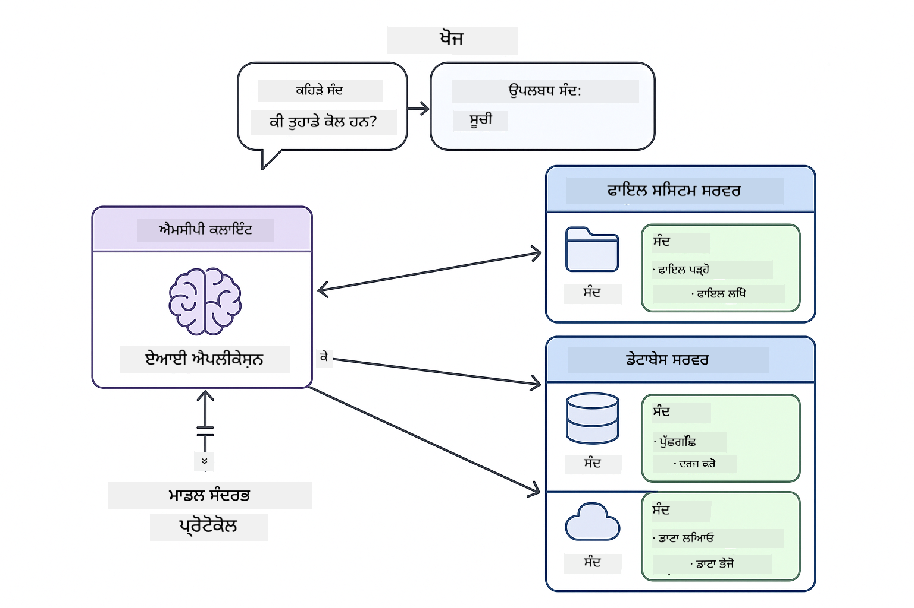

<!--
CO_OP_TRANSLATOR_METADATA:
{
  "original_hash": "c25ec1f10ef156c53e190cdf8b0711ab",
  "translation_date": "2025-12-13T17:47:50+00:00",
  "source_file": "05-mcp/README.md",
  "language_code": "pa"
}
-->
# ਮੋਡੀਊਲ 05: ਮਾਡਲ ਸੰਦਰਭ ਪ੍ਰੋਟੋਕੋਲ (MCP)

## ਸੂਚੀ

- [ਤੁਸੀਂ ਕੀ ਸਿੱਖੋਗੇ](../../../05-mcp)
- [MCP ਨੂੰ ਸਮਝਣਾ](../../../05-mcp)
- [MCP ਕਿਵੇਂ ਕੰਮ ਕਰਦਾ ਹੈ](../../../05-mcp)
  - [ਸਰਵਰ-ਕਲਾਇੰਟ ਆਰਕੀਟੈਕਚਰ](../../../05-mcp)
  - [ਟੂਲ ਖੋਜ](../../../05-mcp)
  - [ਟ੍ਰਾਂਸਪੋਰਟ ਮਕੈਨਿਜ਼ਮ](../../../05-mcp)
- [ਪੂਰਵ-ਆਵਸ਼ਕਤਾਵਾਂ](../../../05-mcp)
- [ਇਹ ਮੋਡੀਊਲ ਕੀ ਕਵਰ ਕਰਦਾ ਹੈ](../../../05-mcp)
- [ਤੁਰੰਤ ਸ਼ੁਰੂਆਤ](../../../05-mcp)
  - [ਉਦਾਹਰਨ 1: ਰਿਮੋਟ ਕੈਲਕੁਲੇਟਰ (ਸਟ੍ਰੀਮਏਬਲ HTTP)](../../../05-mcp)
  - [ਉਦਾਹਰਨ 2: ਫਾਇਲ ਓਪਰੇਸ਼ਨ (ਸਟਡਿਓ)](../../../05-mcp)
  - [ਉਦਾਹਰਨ 3: ਗਿਟ ਵਿਸ਼ਲੇਸ਼ਣ (ਡੋਕਰ)](../../../05-mcp)
- [ਮੁੱਖ ਧਾਰਣਾਵਾਂ](../../../05-mcp)
  - [ਟ੍ਰਾਂਸਪੋਰਟ ਚੋਣ](../../../05-mcp)
  - [ਟੂਲ ਖੋਜ](../../../05-mcp)
  - [ਸੈਸ਼ਨ ਪ੍ਰਬੰਧਨ](../../../05-mcp)
  - [ਕ੍ਰਾਸ-ਪਲੇਟਫਾਰਮ ਵਿਚਾਰ](../../../05-mcp)
- [MCP ਕਦੋਂ ਵਰਤਣਾ ਹੈ](../../../05-mcp)
- [MCP ਪਰਿਸਰ](../../../05-mcp)
- [ਵਧਾਈਆਂ!](../../../05-mcp)
  - [ਅਗਲਾ ਕੀ ਹੈ?](../../../05-mcp)
- [ਸਮੱਸਿਆ ਨਿਵਾਰਣ](../../../05-mcp)

## ਤੁਸੀਂ ਕੀ ਸਿੱਖੋਗੇ

ਤੁਸੀਂ ਗੱਲਬਾਤੀ AI ਬਣਾਈ ਹੈ, ਪ੍ਰਾਂਪਟਾਂ ਵਿੱਚ ਮਾਹਰ ਹੋ, ਦਸਤਾਵੇਜ਼ਾਂ ਵਿੱਚ ਜਵਾਬਾਂ ਨੂੰ ਅਧਾਰਿਤ ਕੀਤਾ ਹੈ, ਅਤੇ ਟੂਲਾਂ ਨਾਲ ਏਜੰਟ ਬਣਾਏ ਹਨ। ਪਰ ਇਹ ਸਾਰੇ ਟੂਲ ਤੁਹਾਡੇ ਖਾਸ ਐਪਲੀਕੇਸ਼ਨ ਲਈ ਕਸਟਮ ਬਣਾਏ ਗਏ ਸਨ। ਜੇ ਤੁਸੀਂ ਆਪਣੇ AI ਨੂੰ ਇੱਕ ਮਿਆਰੀ ਟੂਲ ਪਰਿਸਰ ਤੱਕ ਪਹੁੰਚ ਦੇ ਸਕਦੇ ਜੋ ਕੋਈ ਵੀ ਬਣਾ ਅਤੇ ਸਾਂਝਾ ਕਰ ਸਕਦਾ ਹੈ?

ਮਾਡਲ ਸੰਦਰਭ ਪ੍ਰੋਟੋਕੋਲ (MCP) ਬਿਲਕੁਲ ਇਹੀ ਪ੍ਰਦਾਨ ਕਰਦਾ ਹੈ - AI ਐਪਲੀਕੇਸ਼ਨਾਂ ਲਈ ਬਾਹਰੀ ਟੂਲਾਂ ਨੂੰ ਖੋਜਣ ਅਤੇ ਵਰਤਣ ਦਾ ਇੱਕ ਮਿਆਰੀ ਤਰੀਕਾ। ਹਰ ਡਾਟਾ ਸਰੋਤ ਜਾਂ ਸੇਵਾ ਲਈ ਕਸਟਮ ਇੰਟੀਗ੍ਰੇਸ਼ਨ ਲਿਖਣ ਦੀ ਬਜਾਏ, ਤੁਸੀਂ MCP ਸਰਵਰਾਂ ਨਾਲ ਜੁੜਦੇ ਹੋ ਜੋ ਆਪਣੀਆਂ ਸਮਰੱਥਾਵਾਂ ਨੂੰ ਇੱਕ ਸਥਿਰ ਫਾਰਮੈਟ ਵਿੱਚ ਪ੍ਰਗਟਾਉਂਦੇ ਹਨ। ਤੁਹਾਡਾ AI ਏਜੰਟ ਫਿਰ ਇਹ ਟੂਲ ਆਪਣੇ ਆਪ ਖੋਜ ਅਤੇ ਵਰਤ ਸਕਦਾ ਹੈ।


*MCP ਤੋਂ ਪਹਿਲਾਂ: ਜਟਿਲ ਪੌਇੰਟ-ਟੂ-ਪੌਇੰਟ ਇੰਟੀਗ੍ਰੇਸ਼ਨ। MCP ਤੋਂ ਬਾਅਦ: ਇੱਕ ਪ੍ਰੋਟੋਕੋਲ, ਅਨੰਤ ਸੰਭਾਵਨਾਵਾਂ।*

## MCP ਨੂੰ ਸਮਝਣਾ

MCP AI ਵਿਕਾਸ ਵਿੱਚ ਇੱਕ ਮੂਲ ਸਮੱਸਿਆ ਦਾ ਹੱਲ ਕਰਦਾ ਹੈ: ਹਰ ਇੰਟੀਗ੍ਰੇਸ਼ਨ ਕਸਟਮ ਹੁੰਦੀ ਹੈ। GitHub ਤੱਕ ਪਹੁੰਚ ਚਾਹੁੰਦੇ ਹੋ? ਕਸਟਮ ਕੋਡ। ਫਾਇਲਾਂ ਪੜ੍ਹਣੀਆਂ ਹਨ? ਕਸਟਮ ਕੋਡ। ਡੇਟਾਬੇਸ ਨੂੰ ਪੁੱਛਗਿੱਛ ਕਰਨੀ ਹੈ? ਕਸਟਮ ਕੋਡ। ਅਤੇ ਇਹਨਾਂ ਵਿੱਚੋਂ ਕੋਈ ਵੀ ਇੰਟੀਗ੍ਰੇਸ਼ਨ ਹੋਰ AI ਐਪਲੀਕੇਸ਼ਨਾਂ ਨਾਲ ਕੰਮ ਨਹੀਂ ਕਰਦੀ।

MCP ਇਸਨੂੰ ਮਿਆਰੀਕ੍ਰਿਤ ਕਰਦਾ ਹੈ। ਇੱਕ MCP ਸਰਵਰ ਟੂਲਾਂ ਨੂੰ ਸਾਫ਼ ਵਰਣਨ ਅਤੇ ਸਕੀਮਾਂ ਨਾਲ ਪ੍ਰਗਟਾਉਂਦਾ ਹੈ। ਕੋਈ ਵੀ MCP ਕਲਾਇੰਟ ਜੁੜ ਸਕਦਾ ਹੈ, ਉਪਲਬਧ ਟੂਲਾਂ ਨੂੰ ਖੋਜ ਸਕਦਾ ਹੈ, ਅਤੇ ਵਰਤ ਸਕਦਾ ਹੈ। ਇੱਕ ਵਾਰੀ ਬਣਾਓ, ਹਰ ਜਗ੍ਹਾ ਵਰਤੋ।



*ਮਾਡਲ ਸੰਦਰਭ ਪ੍ਰੋਟੋਕੋਲ ਆਰਕੀਟੈਕਚਰ - ਮਿਆਰੀਕ੍ਰਿਤ ਟੂਲ ਖੋਜ ਅਤੇ ਕਾਰਜਨਵਾਈ*

## MCP ਕਿਵੇਂ ਕੰਮ ਕਰਦਾ ਹੈ

**ਸਰਵਰ-ਕਲਾਇੰਟ ਆਰਕੀਟੈਕਚਰ**

MCP ਇੱਕ ਕਲਾਇੰਟ-ਸਰਵਰ ਮਾਡਲ ਵਰਤਦਾ ਹੈ। ਸਰਵਰ ਟੂਲ ਪ੍ਰਦਾਨ ਕਰਦੇ ਹਨ - ਫਾਇਲਾਂ ਪੜ੍ਹਨਾ, ਡੇਟਾਬੇਸ ਪੁੱਛਗਿੱਛ, API ਕਾਲ ਕਰਨਾ। ਕਲਾਇੰਟ (ਤੁਹਾਡੀ AI ਐਪਲੀਕੇਸ਼ਨ) ਸਰਵਰਾਂ ਨਾਲ ਜੁੜਦੇ ਹਨ ਅਤੇ ਉਹਨਾਂ ਦੇ ਟੂਲ ਵਰਤਦੇ ਹਨ।

**ਟੂਲ ਖੋਜ**

ਜਦੋਂ ਤੁਹਾਡਾ ਕਲਾਇੰਟ MCP ਸਰਵਰ ਨਾਲ ਜੁੜਦਾ ਹੈ, ਇਹ ਪੁੱਛਦਾ ਹੈ "ਤੁਹਾਡੇ ਕੋਲ ਕਿਹੜੇ ਟੂਲ ਹਨ?" ਸਰਵਰ ਉਪਲਬਧ ਟੂਲਾਂ ਦੀ ਸੂਚੀ ਦੇਂਦਾ ਹੈ, ਹਰ ਇੱਕ ਦੇ ਵਰਣਨ ਅਤੇ ਪੈਰਾਮੀਟਰ ਸਕੀਮਾਂ ਸਮੇਤ। ਤੁਹਾਡਾ AI ਏਜੰਟ ਫਿਰ ਉਪਭੋਗਤਾ ਦੀਆਂ ਬੇਨਤੀਆਂ ਦੇ ਆਧਾਰ 'ਤੇ ਇਹ ਫੈਸਲਾ ਕਰ ਸਕਦਾ ਹੈ ਕਿ ਕਿਹੜੇ ਟੂਲ ਵਰਤਣੇ ਹਨ।

**ਟ੍ਰਾਂਸਪੋਰਟ ਮਕੈਨਿਜ਼ਮ**

MCP ਦੋ ਟ੍ਰਾਂਸਪੋਰਟ ਮਕੈਨਿਜ਼ਮ ਪਰਿਭਾਸ਼ਿਤ ਕਰਦਾ ਹੈ: ਦੂਰ-ਦਰਾਜ ਸਰਵਰਾਂ ਲਈ HTTP, ਸਥਾਨਕ ਪ੍ਰਕਿਰਿਆਵਾਂ ਲਈ Stdio (ਜਿਸ ਵਿੱਚ Docker ਕੰਟੇਨਰ ਸ਼ਾਮਲ ਹਨ):


*MCP ਟ੍ਰਾਂਸਪੋਰਟ ਮਕੈਨਿਜ਼ਮ: ਦੂਰ-ਦਰਾਜ ਸਰਵਰਾਂ ਲਈ HTTP, ਸਥਾਨਕ ਪ੍ਰਕਿਰਿਆਵਾਂ ਲਈ Stdio (ਜਿਸ ਵਿੱਚ Docker ਕੰਟੇਨਰ ਸ਼ਾਮਲ ਹਨ)*

**ਸਟ੍ਰੀਮਏਬਲ HTTP** - [StreamableHttpDemo.java](../../../05-mcp/src/main/java/com/example/langchain4j/mcp/StreamableHttpDemo.java)

ਦੂਰ-ਦਰਾਜ ਸਰਵਰਾਂ ਲਈ। ਤੁਹਾਡੀ ਐਪਲੀਕੇਸ਼ਨ ਨੈੱਟਵਰਕ 'ਤੇ ਕਿਤੇ ਚੱਲ ਰਹੇ ਸਰਵਰ ਨੂੰ HTTP ਬੇਨਤੀਆਂ ਭੇਜਦੀ ਹੈ। ਰੀਅਲ-ਟਾਈਮ ਸੰਚਾਰ ਲਈ ਸਰਵਰ-ਸੈਂਟ ਇਵੈਂਟਸ ਵਰਤਦਾ ਹੈ।

```java
McpTransport httpTransport = new StreamableHttpMcpTransport.Builder()
    .url("http://localhost:3001/mcp")
    .timeout(Duration.ofSeconds(60))
    .logRequests(true)
    .logResponses(true)
    .build();
```

> **🤖 [GitHub Copilot](https://github.com/features/copilot) ਚੈਟ ਨਾਲ ਕੋਸ਼ਿਸ਼ ਕਰੋ:** [`StreamableHttpDemo.java`](../../../05-mcp/src/main/java/com/example/langchain4j/mcp/StreamableHttpDemo.java) ਖੋਲ੍ਹੋ ਅਤੇ ਪੁੱਛੋ:
> - "MCP ਸਿੱਧਾ ਟੂਲ ਇੰਟੀਗ੍ਰੇਸ਼ਨ ਨਾਲ ਕਿਵੇਂ ਵੱਖਰਾ ਹੈ ਜਿਵੇਂ ਮੋਡੀਊਲ 04 ਵਿੱਚ?"
> - "ਐਪਲੀਕੇਸ਼ਨਾਂ ਵਿੱਚ ਟੂਲ ਸਾਂਝਾ ਕਰਨ ਲਈ MCP ਵਰਤਣ ਦੇ ਕੀ ਫਾਇਦੇ ਹਨ?"
> - "MCP ਸਰਵਰਾਂ ਨਾਲ ਕਨੈਕਸ਼ਨ ਫੇਲ੍ਹ ਜਾਂ ਟਾਈਮਆਉਟ ਨੂੰ ਕਿਵੇਂ ਸੰਭਾਲਾਂ?"

**ਸਟਡਿਓ** - [StdioTransportDemo.java](../../../05-mcp/src/main/java/com/example/langchain4j/mcp/StdioTransportDemo.java)

ਸਥਾਨਕ ਪ੍ਰਕਿਰਿਆਵਾਂ ਲਈ। ਤੁਹਾਡੀ ਐਪਲੀਕੇਸ਼ਨ ਇੱਕ ਸਰਵਰ ਨੂੰ ਸਬਪ੍ਰੋਸੈਸ ਵਜੋਂ ਚਲਾਉਂਦੀ ਹੈ ਅਤੇ ਸਟੈਂਡਰਡ ਇਨਪੁੱਟ/ਆਉਟਪੁੱਟ ਰਾਹੀਂ ਸੰਚਾਰ ਕਰਦੀ ਹੈ। ਫਾਇਲਸਿਸਟਮ ਪਹੁੰਚ ਜਾਂ ਕਮਾਂਡ-ਲਾਈਨ ਟੂਲਾਂ ਲਈ ਲਾਭਦਾਇਕ।

```java
McpTransport stdioTransport = new StdioMcpTransport.Builder()
    .command(List.of(
        npmCmd, "exec",
        "@modelcontextprotocol/server-filesystem@0.6.2",
        resourcesDir
    ))
    .logEvents(false)
    .build();
```

> **🤖 [GitHub Copilot](https://github.com/features/copilot) ਚੈਟ ਨਾਲ ਕੋਸ਼ਿਸ਼ ਕਰੋ:** [`StdioTransportDemo.java`](../../../05-mcp/src/main/java/com/example/langchain4j/mcp/StdioTransportDemo.java) ਖੋਲ੍ਹੋ ਅਤੇ ਪੁੱਛੋ:
> - "ਸਟਡਿਓ ਟ੍ਰਾਂਸਪੋਰਟ ਕਿਵੇਂ ਕੰਮ ਕਰਦਾ ਹੈ ਅਤੇ HTTP ਨਾਲੋਂ ਕਦੋਂ ਵਰਤਣਾ ਚਾਹੀਦਾ ਹੈ?"
> - "LangChain4j MCP ਸਰਵਰ ਪ੍ਰਕਿਰਿਆਵਾਂ ਦੇ ਜੀਵਨਚੱਕਰ ਨੂੰ ਕਿਵੇਂ ਪ੍ਰਬੰਧਿਤ ਕਰਦਾ ਹੈ?"
> - "AI ਨੂੰ ਫਾਇਲ ਸਿਸਟਮ ਦੀ ਪਹੁੰਚ ਦੇਣ ਦੇ ਸੁਰੱਖਿਆ ਪ੍ਰਭਾਵ ਕੀ ਹਨ?"

**ਡੋਕਰ (ਸਟਡਿਓ ਵਰਤਦਾ ਹੈ)** - [GitRepositoryAnalyzer.java](../../../05-mcp/src/main/java/com/example/langchain4j/mcp/GitRepositoryAnalyzer.java)

ਕੰਟੇਨਰਾਈਜ਼ਡ ਸੇਵਾਵਾਂ ਲਈ। `docker run` ਰਾਹੀਂ ਡੋਕਰ ਕੰਟੇਨਰ ਨਾਲ ਸੰਚਾਰ ਕਰਨ ਲਈ ਸਟਡਿਓ ਟ੍ਰਾਂਸਪੋਰਟ ਵਰਤਦਾ ਹੈ। ਜਟਿਲ ਨਿਰਭਰਤਾਵਾਂ ਜਾਂ ਅਲੱਗ-ਥੱਲੇ ਵਾਤਾਵਰਣਾਂ ਲਈ ਚੰਗਾ।

```java
McpTransport dockerTransport = new StdioMcpTransport.Builder()
    .command(List.of(
        "docker", "run",
        "-e", "GITHUB_PERSONAL_ACCESS_TOKEN=" + System.getenv("GITHUB_TOKEN"),
        "-v", volumeMapping,
        "-i", "mcp/git"
    ))
    .logEvents(true)
    .build();
```

> **🤖 [GitHub Copilot](https://github.com/features/copilot) ਚੈਟ ਨਾਲ ਕੋਸ਼ਿਸ਼ ਕਰੋ:** [`GitRepositoryAnalyzer.java`](../../../05-mcp/src/main/java/com/example/langchain4j/mcp/GitRepositoryAnalyzer.java) ਖੋਲ੍ਹੋ ਅਤੇ ਪੁੱਛੋ:
> - "ਡੋਕਰ ਟ੍ਰਾਂਸਪੋਰਟ MCP ਸਰਵਰਾਂ ਨੂੰ ਕਿਵੇਂ ਅਲੱਗ ਕਰਦਾ ਹੈ ਅਤੇ ਇਸਦੇ ਕੀ ਫਾਇਦੇ ਹਨ?"
> - "ਹੋਸਟ ਅਤੇ MCP ਕੰਟੇਨਰਾਂ ਵਿਚਕਾਰ ਡਾਟਾ ਸਾਂਝਾ ਕਰਨ ਲਈ ਵੋਲਿਊਮ ਮਾਊਂਟ ਕਿਵੇਂ ਸੰਰਚਿਤ ਕਰਾਂ?"
> - "ਉਤਪਾਦਨ ਵਿੱਚ ਡੋਕਰ-ਆਧਾਰਿਤ MCP ਸਰਵਰ ਜੀਵਨਚੱਕਰ ਪ੍ਰਬੰਧਨ ਲਈ ਸਭ ਤੋਂ ਵਧੀਆ ਅਭਿਆਸ ਕੀ ਹਨ?"

## ਉਦਾਹਰਨ ਚਲਾਉਣਾ

### ਪੂਰਵ-ਆਵਸ਼ਕਤਾਵਾਂ

- ਜਾਵਾ 21+, ਮਾਵਨ 3.9+
- Node.js 16+ ਅਤੇ npm (MCP ਸਰਵਰਾਂ ਲਈ)
- **ਡੋਕਰ ਡੈਸਕਟਾਪ** - ਉਦਾਹਰਨ 3 ਲਈ **ਚੱਲ ਰਿਹਾ ਹੋਣਾ ਚਾਹੀਦਾ ਹੈ** (ਸਿਰਫ ਇੰਸਟਾਲ ਨਹੀਂ)
- GitHub ਨਿੱਜੀ ਪਹੁੰਚ ਟੋਕਨ `.env` ਫਾਇਲ ਵਿੱਚ ਸੰਰਚਿਤ (ਮੋਡੀਊਲ 00 ਤੋਂ)

> **ਨੋਟ:** ਜੇ ਤੁਸੀਂ ਆਪਣਾ GitHub ਟੋਕਨ ਅਜੇ ਤੱਕ ਸੈੱਟ ਨਹੀਂ ਕੀਤਾ, ਤਾਂ [ਮੋਡੀਊਲ 00 - ਤੁਰੰਤ ਸ਼ੁਰੂਆਤ](../00-quick-start/README.md) ਵੇਖੋ।

> **⚠️ ਡੋਕਰ ਵਰਤੋਂਕਾਰਾਂ ਲਈ:** ਉਦਾਹਰਨ 3 ਚਲਾਉਣ ਤੋਂ ਪਹਿਲਾਂ, `docker ps` ਨਾਲ ਡੋਕਰ ਡੈਸਕਟਾਪ ਚੱਲ ਰਿਹਾ ਹੈ ਜਾਂ ਨਹੀਂ ਜਾਂਚੋ। ਜੇ ਕਨੈਕਸ਼ਨ ਗਲਤੀਆਂ ਆਉਂਦੀਆਂ ਹਨ, ਡੋਕਰ ਡੈਸਕਟਾਪ ਸ਼ੁਰੂ ਕਰੋ ਅਤੇ ਲਗਭਗ 30 ਸਕਿੰਟ ਇੰਤਜ਼ਾਰ ਕਰੋ।

## ਤੁਰੰਤ ਸ਼ੁਰੂਆਤ

**VS ਕੋਡ ਵਰਤਦੇ ਹੋਏ:** ਕਿਸੇ ਵੀ ਡੈਮੋ ਫਾਇਲ 'ਤੇ ਰਾਈਟ-ਕਲਿੱਕ ਕਰੋ ਅਤੇ **"Run Java"** ਚੁਣੋ, ਜਾਂ ਰਨ ਅਤੇ ਡੀਬੱਗ ਪੈਨਲ ਤੋਂ ਲਾਂਚ ਸੰਰਚਨਾਵਾਂ ਵਰਤੋ (ਪਹਿਲਾਂ `.env` ਫਾਇਲ ਵਿੱਚ ਆਪਣਾ ਟੋਕਨ ਸ਼ਾਮਲ ਕਰਨਾ ਯਕੀਨੀ ਬਣਾਓ)।

**ਮਾਵਨ ਵਰਤਦੇ ਹੋਏ:** ਵਿਕਲਪ ਵਜੋਂ, ਤੁਸੀਂ ਹੇਠਾਂ ਦਿੱਤੇ ਉਦਾਹਰਨਾਂ ਨਾਲ ਕਮਾਂਡ ਲਾਈਨ ਤੋਂ ਚਲਾ ਸਕਦੇ ਹੋ।

**⚠️ ਮਹੱਤਵਪੂਰਨ:** ਕੁਝ ਉਦਾਹਰਨਾਂ ਲਈ ਪੂਰਵ-ਆਵਸ਼ਕਤਾਵਾਂ ਹਨ (ਜਿਵੇਂ MCP ਸਰਵਰ ਸ਼ੁਰੂ ਕਰਨਾ ਜਾਂ ਡੋਕਰ ਇਮੇਜ ਬਣਾਉਣਾ)। ਚਲਾਉਣ ਤੋਂ ਪਹਿਲਾਂ ਹਰ ਉਦਾਹਰਨ ਦੀਆਂ ਲੋੜਾਂ ਚੈੱਕ ਕਰੋ।

### ਉਦਾਹਰਨ 1: ਰਿਮੋਟ ਕੈਲਕੁਲੇਟਰ (ਸਟ੍ਰੀਮਏਬਲ HTTP)

ਇਹ ਨੈੱਟਵਰਕ-ਆਧਾਰਿਤ ਟੂਲ ਇੰਟੀਗ੍ਰੇਸ਼ਨ ਦਿਖਾਉਂਦਾ ਹੈ।

**⚠️ ਪੂਰਵ-ਆਵਸ਼ਕਤਾ:** ਤੁਹਾਨੂੰ ਪਹਿਲਾਂ MCP ਸਰਵਰ ਸ਼ੁਰੂ ਕਰਨਾ ਪਵੇਗਾ (ਹੇਠਾਂ ਟਰਮੀਨਲ 1 ਵੇਖੋ)।

**ਟਰਮੀਨਲ 1 - MCP ਸਰਵਰ ਸ਼ੁਰੂ ਕਰੋ:**

**ਬੈਸ਼:**
```bash
git clone https://github.com/modelcontextprotocol/servers.git
cd servers/src/everything
npm install
node dist/streamableHttp.js
```

**ਪਾਵਰਸ਼ੈੱਲ:**
```powershell
git clone https://github.com/modelcontextprotocol/servers.git
cd servers/src/everything
npm install
node dist/streamableHttp.js
```

**ਟਰਮੀਨਲ 2 - ਉਦਾਹਰਨ ਚਲਾਓ:**

**VS ਕੋਡ ਵਰਤਦੇ ਹੋਏ:** `StreamableHttpDemo.java` 'ਤੇ ਰਾਈਟ-ਕਲਿੱਕ ਕਰੋ ਅਤੇ **"Run Java"** ਚੁਣੋ।

**ਮਾਵਨ ਵਰਤਦੇ ਹੋਏ:**

**ਬੈਸ਼:**
```bash
export GITHUB_TOKEN=your_token_here
cd 05-mcp
mvn compile exec:java -Dexec.mainClass=com.example.langchain4j.mcp.StreamableHttpDemo
```

**ਪਾਵਰਸ਼ੈੱਲ:**
```powershell
$env:GITHUB_TOKEN=your_token_here
cd 05-mcp
mvn --% compile exec:java -Dexec.mainClass=com.example.langchain4j.mcp.StreamableHttpDemo
```

ਏਜੰਟ ਨੂੰ ਉਪਲਬਧ ਟੂਲ ਖੋਜਦੇ ਦੇਖੋ, ਫਿਰ ਜੋੜ ਕਰਨ ਲਈ ਕੈਲਕੁਲੇਟਰ ਵਰਤੋ।

### ਉਦਾਹਰਨ 2: ਫਾਇਲ ਓਪਰੇਸ਼ਨ (ਸਟਡਿਓ)

ਇਹ ਸਥਾਨਕ ਸਬਪ੍ਰੋਸੈਸ-ਆਧਾਰਿਤ ਟੂਲ ਦਿਖਾਉਂਦਾ ਹੈ।

**✅ ਕੋਈ ਪੂਰਵ-ਆਵਸ਼ਕਤਾ ਨਹੀਂ** - MCP ਸਰਵਰ ਆਪਣੇ ਆਪ ਚਲਾਇਆ ਜਾਂਦਾ ਹੈ।

**VS ਕੋਡ ਵਰਤਦੇ ਹੋਏ:** `StdioTransportDemo.java` 'ਤੇ ਰਾਈਟ-ਕਲਿੱਕ ਕਰੋ ਅਤੇ **"Run Java"** ਚੁਣੋ।

**ਮਾਵਨ ਵਰਤਦੇ ਹੋਏ:**

**ਬੈਸ਼:**
```bash
export GITHUB_TOKEN=your_token_here
cd 05-mcp
mvn compile exec:java -Dexec.mainClass=com.example.langchain4j.mcp.StdioTransportDemo
```

**ਪਾਵਰਸ਼ੈੱਲ:**
```powershell
$env:GITHUB_TOKEN=your_token_here
cd 05-mcp
mvn --% compile exec:java -Dexec.mainClass=com.example.langchain4j.mcp.StdioTransportDemo
```

ਐਪਲੀਕੇਸ਼ਨ ਆਪਣੇ ਆਪ ਫਾਇਲਸਿਸਟਮ MCP ਸਰਵਰ ਚਲਾਉਂਦਾ ਹੈ ਅਤੇ ਇੱਕ ਸਥਾਨਕ ਫਾਇਲ ਪੜ੍ਹਦਾ ਹੈ। ਧਿਆਨ ਦਿਓ ਕਿ ਸਬਪ੍ਰੋਸੈਸ ਪ੍ਰਬੰਧਨ ਤੁਹਾਡੇ ਲਈ ਕਿਵੇਂ ਸੰਭਾਲਿਆ ਜਾਂਦਾ ਹੈ।

**ਉਮੀਦ ਕੀਤੀ ਆਉਟਪੁੱਟ:**
```
Assistant response: The content of the file is "Kaboom!".
```

### ਉਦਾਹਰਨ 3: ਗਿਟ ਵਿਸ਼ਲੇਸ਼ਣ (ਡੋਕਰ)

ਇਹ ਕੰਟੇਨਰਾਈਜ਼ਡ ਟੂਲ ਸਰਵਰ ਦਿਖਾਉਂਦਾ ਹੈ।

**⚠️ ਪੂਰਵ-ਆਵਸ਼ਕਤਾਵਾਂ:**  
1. **ਡੋਕਰ ਡੈਸਕਟਾਪ ਚੱਲ ਰਿਹਾ ਹੋਣਾ ਚਾਹੀਦਾ ਹੈ** (ਸਿਰਫ ਇੰਸਟਾਲ ਨਹੀਂ)  
2. **ਵਿੰਡੋਜ਼ ਵਰਤੋਂਕਾਰ:** WSL 2 ਮੋਡ ਦੀ ਸਿਫਾਰਸ਼ ਕੀਤੀ ਜਾਂਦੀ ਹੈ (ਡੋਕਰ ਡੈਸਕਟਾਪ ਸੈਟਿੰਗਜ਼ → ਜਨਰਲ → "Use the WSL 2 based engine")। Hyper-V ਮੋਡ ਲਈ ਮੈਨੂਅਲ ਫਾਇਲ ਸਾਂਝਾ ਕਰਨ ਦੀ ਸੰਰਚਨਾ ਲੋੜੀਂਦੀ ਹੈ।  
3. ਤੁਹਾਨੂੰ ਪਹਿਲਾਂ ਡੋਕਰ ਇਮੇਜ ਬਣਾਉਣੀ ਪਵੇਗੀ (ਹੇਠਾਂ ਟਰਮੀਨਲ 1 ਵੇਖੋ)

**ਡੋਕਰ ਚੱਲ ਰਿਹਾ ਹੈ ਜਾਂ ਨਹੀਂ ਜਾਂਚੋ:**

**ਬੈਸ਼:**
```bash
docker ps  # ਕੰਟੇਨਰ ਸੂਚੀ ਦਿਖਾਉਣੀ ਚਾਹੀਦੀ ਹੈ, ਗਲਤੀ ਨਹੀਂ
```

**ਪਾਵਰਸ਼ੈੱਲ:**
```powershell
docker ps  # ਕੰਟੇਨਰ ਸੂਚੀ ਦਿਖਾਉਣੀ ਚਾਹੀਦੀ ਹੈ, ਗਲਤੀ ਨਹੀਂ
```

ਜੇ ਤੁਹਾਨੂੰ "Cannot connect to Docker daemon" ਜਾਂ "The system cannot find the file specified" ਵਰਗਾ ਐਰਰ ਮਿਲਦਾ ਹੈ, ਤਾਂ ਡੋਕਰ ਡੈਸਕਟਾਪ ਸ਼ੁਰੂ ਕਰੋ ਅਤੇ ਲਗਭਗ 30 ਸਕਿੰਟ ਇੰਤਜ਼ਾਰ ਕਰੋ।

**ਸਮੱਸਿਆ ਨਿਵਾਰਣ:**
- ਜੇ AI ਖਾਲੀ ਰਿਪੋਜ਼ਿਟਰੀ ਜਾਂ ਕੋਈ ਫਾਇਲਾਂ ਨਹੀਂ ਦਿਖਾਉਂਦਾ, ਤਾਂ ਵੋਲਿਊਮ ਮਾਊਂਟ (`-v`) ਕੰਮ ਨਹੀਂ ਕਰ ਰਿਹਾ।  
- **ਵਿੰਡੋਜ਼ Hyper-V ਵਰਤੋਂਕਾਰ:** ਪ੍ਰੋਜੈਕਟ ਡਾਇਰੈਕਟਰੀ ਨੂੰ ਡੋਕਰ ਡੈਸਕਟਾਪ ਸੈਟਿੰਗਜ਼ → ਰਿਸੋਰਸ → ਫਾਇਲ ਸਾਂਝਾ ਕਰਨ ਵਿੱਚ ਸ਼ਾਮਲ ਕਰੋ, ਫਿਰ ਡੋਕਰ ਡੈਸਕਟਾਪ ਰੀਸਟਾਰਟ ਕਰੋ।  
- **ਸਿਫਾਰਸ਼ੀ ਹੱਲ:** ਆਟੋਮੈਟਿਕ ਫਾਇਲ ਸਾਂਝਾ ਕਰਨ ਲਈ WSL 2 ਮੋਡ 'ਤੇ ਸਵਿੱਚ ਕਰੋ (ਸੈਟਿੰਗਜ਼ → ਜਨਰਲ → "Use the WSL 2 based engine" ਚਾਲੂ ਕਰੋ)।

**ਟਰਮੀਨਲ 1 - ਡੋਕਰ ਇਮੇਜ ਬਣਾਓ:**

**ਬੈਸ਼:**
```bash
cd servers/src/git
docker build -t mcp/git .
```

**ਪਾਵਰਸ਼ੈੱਲ:**
```powershell
cd servers/src/git
docker build -t mcp/git .
```

**ਟਰਮੀਨਲ 2 - ਵਿਸ਼ਲੇਸ਼ਕ ਚਲਾਓ:**

**VS ਕੋਡ ਵਰਤਦੇ ਹੋਏ:** `GitRepositoryAnalyzer.java` 'ਤੇ ਰਾਈਟ-ਕਲਿੱਕ ਕਰੋ ਅਤੇ **"Run Java"** ਚੁਣੋ।

**ਮਾਵਨ ਵਰਤਦੇ ਹੋਏ:**

**ਬੈਸ਼:**
```bash
export GITHUB_TOKEN=your_token_here
cd 05-mcp
mvn compile exec:java -Dexec.mainClass=com.example.langchain4j.mcp.GitRepositoryAnalyzer
```

**ਪਾਵਰਸ਼ੈੱਲ:**
```powershell
$env:GITHUB_TOKEN=your_token_here
cd 05-mcp
mvn --% compile exec:java -Dexec.mainClass=com.example.langchain4j.mcp.GitRepositoryAnalyzer
```

ਐਪਲੀਕੇਸ਼ਨ ਇੱਕ ਡੋਕਰ ਕੰਟੇਨਰ ਲਾਂਚ ਕਰਦਾ ਹੈ, ਤੁਹਾਡਾ ਰਿਪੋਜ਼ਿਟਰੀ ਮਾਊਂਟ ਕਰਦਾ ਹੈ, ਅਤੇ AI ਏਜੰਟ ਰਾਹੀਂ ਰਿਪੋਜ਼ਿਟਰੀ ਦੀ ਸੰਰਚਨਾ ਅਤੇ ਸਮੱਗਰੀ ਦਾ ਵਿਸ਼ਲੇਸ਼ਣ ਕਰਦਾ ਹੈ।

## ਮੁੱਖ ਧਾਰਣਾਵਾਂ

**ਟ੍ਰਾਂਸਪੋਰਟ ਚੋਣ**

ਆਪਣੇ ਟੂਲਾਂ ਦੀ ਸਥਿਤੀ ਦੇ ਅਧਾਰ 'ਤੇ ਚੁਣੋ:  
- ਦੂਰ-ਦਰਾਜ ਸੇਵਾਵਾਂ → ਸਟ੍ਰੀਮਏਬਲ HTTP  
- ਸਥਾਨਕ ਫਾਇਲ ਸਿਸਟਮ → ਸਟਡਿਓ  
- ਜਟਿਲ ਨਿਰਭਰਤਾਵਾਂ → ਡੋਕਰ  

**ਟੂਲ ਖੋਜ**

MCP ਕਲਾਇੰਟ ਜੁੜਦੇ ਸਮੇਂ ਆਪਣੇ ਆਪ ਉਪਲਬਧ ਟੂਲ ਖੋਜਦੇ ਹਨ। ਤੁਹਾਡਾ AI ਏਜੰਟ ਟੂਲ ਵਰਣਨ ਵੇਖਦਾ ਹੈ ਅਤੇ ਉਪਭੋਗਤਾ ਦੀ ਬੇਨਤੀ ਦੇ ਅਧਾਰ 'ਤੇ ਫੈਸਲਾ ਕਰਦਾ ਹੈ ਕਿ ਕਿਹੜੇ ਟੂਲ ਵਰਤਣੇ ਹਨ।

**ਸੈਸ਼ਨ ਪ੍ਰਬੰਧਨ**

ਸਟ੍ਰੀਮਏਬਲ HTTP ਟ੍ਰਾਂਸਪੋਰਟ ਸੈਸ਼ਨਾਂ ਨੂੰ ਬਣਾਈ ਰੱਖਦਾ ਹੈ, ਜੋ ਦੂਰ-ਦਰਾਜ ਸਰਵਰਾਂ ਨਾਲ ਸਥਿਤੀ-ਸੰਬੰਧੀ ਇੰਟਰੈਕਸ਼ਨ ਦੀ ਆਗਿਆ ਦਿੰਦਾ ਹੈ। ਸਟਡਿਓ ਅਤੇ ਡੋਕਰ ਟ੍ਰਾਂਸਪੋਰਟ ਆਮ ਤੌਰ 'ਤੇ ਸਥਿਤੀ-ਰਹਿਤ ਹੁੰਦੇ ਹਨ।

**ਕ੍ਰਾਸ-ਪਲੇਟਫਾਰਮ ਵਿਚਾਰ**

ਉਦਾਹਰਨਾਂ ਪਲੇਟਫਾਰਮ ਦੇ ਫਰਕਾਂ ਨੂੰ ਆਪਣੇ ਆਪ ਸੰਭਾਲਦੀਆਂ ਹਨ (ਵਿੰਡੋਜ਼ ਵਿਰੁੱਧ ਯੂਨਿਕਸ ਕਮਾਂਡ ਫਰਕ, ਡੋਕਰ ਲਈ ਪਾਥ ਰੂਪਾਂਤਰਣ)। ਇਹ ਵੱਖ-ਵੱਖ ਵਾਤਾਵਰਣਾਂ ਵਿੱਚ ਉਤਪਾਦਨ ਤਾਇਨਾਤੀ ਲਈ ਮਹੱਤਵਪੂਰਨ ਹੈ।

## MCP ਕਦੋਂ ਵਰਤਣਾ ਹੈ

**MCP ਵਰਤੋਂ ਜਦੋਂ:**  
- ਤੁਸੀਂ ਮੌਜੂਦਾ ਟੂਲ ਪਰਿਸਰਾਂ ਦਾ ਲਾਭ ਉਠਾਉਣਾ ਚਾਹੁੰਦੇ ਹੋ  
- ਐਸੇ ਟੂਲ ਬਣਾਉਂਦੇ ਹੋ ਜੋ ਕਈ ਐਪਲੀਕੇਸ਼ਨਾਂ ਵੱਲੋਂ ਵਰਤੇ ਜਾਣਗੇ  
- ਤੀਜੀ-ਪੱਖ ਸੇਵਾਵਾਂ ਨੂੰ ਮਿਆਰੀ ਪ੍ਰੋਟੋਕੋਲਾਂ ਨਾਲ ਜੋੜਨਾ ਹੈ  
- ਤੁਸੀਂ ਕੋਡ ਬਦਲਾਅ ਤੋਂ ਬਿਨਾਂ ਟੂਲ ਇੰਪਲੀਮੈਂਟੇਸ਼ਨ ਬਦਲਣਾ ਚਾਹੁੰਦੇ ਹੋ  

**ਕਸਟਮ ਟੂਲ (ਮੋਡੀਊਲ 04) ਵਰਤੋਂ ਜਦੋਂ:**  
- ਐਪਲੀਕੇਸ਼ਨ-ਖਾਸ ਫੰਕਸ਼ਨਾਲਿਟੀ ਬਣਾਉਂਦੇ ਹੋ  
- ਪ੍ਰਦਰਸ਼ਨ ਮਹੱਤਵਪੂਰਨ ਹੈ (MCP ਥੋੜ੍ਹਾ ਓਵਰਹੈੱਡ ਜੋੜਦਾ ਹੈ)  
- ਤੁਹਾਡੇ ਟੂਲ ਸਧਾਰਣ ਹਨ ਅਤੇ ਦੁਬਾਰਾ ਵਰਤੇ ਨਹੀਂ ਜਾਣਗੇ  
- ਤੁਹਾਨੂੰ ਕਾਰਜਨਵਾਈ 'ਤੇ ਪੂਰਾ ਨਿਯੰਤਰਣ ਚਾਹੀਦਾ ਹੈ  

## MCP ਪਰਿਸਰ

ਮਾਡਲ ਸੰਦਰਭ ਪ੍ਰੋਟੋਕੋਲ ਇੱਕ ਖੁੱਲਾ ਮਿਆਰ ਹੈ ਜਿਸਦਾ ਪਰਿਸਰ ਵਧ ਰਿਹਾ ਹੈ:

- ਆਮ ਕਾਰਜਾਂ ਲਈ ਅਧਿਕਾਰਤ MCP ਸਰਵਰ (ਫਾਇਲਸਿਸਟਮ, Git, ਡੇਟਾਬੇਸ)  
- ਵੱਖ-ਵੱਖ ਸੇਵਾਵਾਂ ਲਈ ਕਮਿਊਨਿਟੀ-ਯੋਗਦਾਨ ਵਾਲੇ ਸਰਵਰ  
- ਮਿਆਰੀਕ੍ਰਿਤ ਟੂਲ ਵਰਣਨ ਅਤੇ ਸਕੀਮਾਂ  
- ਕ੍ਰਾਸ-ਫਰੇਮਵਰਕ ਅਨੁਕੂਲਤਾ (ਕੋਈ ਵੀ MCP ਕਲਾਇੰਟ ਨਾਲ ਕੰਮ ਕਰਦਾ ਹੈ)  

ਇਹ ਮਿਆਰੀਕ੍ਰਿਤੀ ਮਤਲਬ ਹੈ ਕਿ ਇੱਕ AI ਐਪਲੀਕੇਸ਼ਨ ਲਈ ਬਣਾਏ ਗਏ ਟੂਲ ਹੋਰਾਂ ਨਾਲ ਵੀ ਕੰਮ ਕਰਦੇ ਹਨ, ਇੱਕ ਸਾਂਝਾ ਸਮਰੱਥਾ ਪਰਿਸਰ ਬਣਾਉਂਦੇ ਹਨ।

## ਵਧਾਈਆਂ!

ਤੁਸੀਂ LangChain4j ਫਾਰ ਬਿਗਿਨਰਜ਼ ਕੋਰਸ ਪੂਰਾ ਕਰ ਲਿਆ ਹੈ। ਤੁਸੀਂ ਸਿੱਖਿਆ:

- ਯਾਦਦਾਸ਼ਤ ਨਾਲ ਗੱਲਬਾਤੀ AI ਕਿਵੇਂ ਬਣਾਈਏ (ਮੋਡੀਊਲ 01)  
- ਵੱਖ-ਵੱਖ ਕਾਰਜਾਂ ਲਈ ਪ੍ਰਾਂਪਟ ਇੰਜੀਨੀਅਰਿੰਗ ਪੈਟਰਨ (ਮੋਡੀਊਲ 02)  
- RAG ਨਾਲ ਦਸਤਾਵੇਜ਼ਾਂ ਵਿੱਚ ਜਵਾਬਾਂ ਨੂੰ ਅਧਾਰਿਤ ਕਰਨਾ (ਮੋਡੀਊਲ 03)  
- ਕਸਟਮ ਟੂਲਾਂ ਨਾਲ AI ਏਜੰਟ ਬਣਾਉਣਾ (ਮੋਡੀਊਲ 04)  
- MCP ਰਾਹੀਂ ਮਿਆਰੀਕ੍ਰਿਤ ਟੂਲਾਂ ਨੂੰ ਜੋੜਨਾ (ਮੋਡੀਊਲ 05)  

ਹੁਣ ਤੁਹਾਡੇ ਕੋਲ ਉਤਪਾਦਨ AI ਐਪਲੀਕੇਸ਼ਨ ਬਣਾਉਣ ਦਾ ਬੁਨਿਆਦੀ ਢਾਂਚਾ ਹੈ। ਤੁਸੀਂ ਸਿੱਖੀਆਂ ਧਾਰਣਾਵਾਂ ਕਿਸੇ ਵੀ ਖਾਸ ਫਰੇਮਵਰਕ ਜਾਂ ਮਾਡਲ ਤੋਂ ਬਿਨਾਂ ਲਾਗੂ ਹੁੰਦੀਆਂ ਹਨ - ਇਹ AI ਇੰਜੀਨੀਅਰਿੰਗ ਵਿੱਚ ਮੂਲ ਪੈਟਰਨ ਹਨ।

### ਅਗਲਾ ਕੀ ਹੈ?

ਮੋਡੀਊਲ ਪੂਰੇ ਕਰਨ ਤੋਂ ਬਾਅਦ, [ਟੈਸਟਿੰਗ ਗਾਈਡ](../docs/TESTING.md) ਨੂੰ ਵੇਖੋ ਤਾਂ ਜੋ LangChain4j ਟੈਸਟਿੰਗ ਧਾਰਣਾਵਾਂ ਨੂੰ ਕਾਰਜ ਵਿੱਚ ਦੇਖ ਸਕੋ।

**ਅਧਿਕਾਰਤ ਸਰੋਤ:**  
- [LangChain4j ਦਸਤਾਵੇਜ਼](https://docs.langchain4j.dev/) - ਵਿਸਤ੍ਰਿਤ ਗਾਈਡ ਅਤੇ API ਸੰਦਰਭ  
- [LangChain4j GitHub](https://github.com/langchain4j/langchain4j) - ਸਰੋਤ ਕੋਡ ਅਤੇ ਉਦਾਹਰਨ  
- [LangChain4j ਟਿਊਟੋਰਿਯਲ](https://docs.langchain4j.dev/tutorials/) - ਵੱਖ-ਵੱਖ ਵਰਤੋਂ ਕੇਸਾਂ ਲਈ ਕਦਮ-ਦਰ-ਕਦਮ ਟਿਊਟੋਰਿਯਲ  

ਇਸ ਕੋਰਸ ਨੂੰ ਪੂਰਾ ਕਰਨ ਲਈ ਧੰਨਵਾਦ!

---

**ਨੈਵੀਗੇਸ਼ਨ:** [← ਪਿਛਲਾ: ਮੋਡੀਊਲ 04 - ਟੂਲ](../04-tools/README.md) | [ਮੁੱਖ ਸਫ਼ੇ ਤੇ ਵਾਪਸ](../README.md)

---

## ਸਮੱਸਿਆ ਨਿਵਾਰਣ

### ਪਾਵਰਸ਼ੈੱਲ ਮਾਵਨ ਕਮਾਂਡ ਸਿੰਟੈਕਸ
**ਮੁੱਦਾ**: Maven ਕਮਾਂਡਾਂ `Unknown lifecycle phase ".mainClass=..."` ਗਲਤੀ ਨਾਲ ਫੇਲ ਹੁੰਦੀਆਂ ਹਨ

**ਕਾਰਨ**: PowerShell `=` ਨੂੰ ਵੈਰੀਏਬਲ ਅਸਾਈਨਮੈਂਟ ਓਪਰੇਟਰ ਵਜੋਂ ਸਮਝਦਾ ਹੈ, ਜਿਸ ਨਾਲ Maven ਪ੍ਰਾਪਰਟੀ ਸਿੰਟੈਕਸ ਟੁੱਟ ਜਾਂਦਾ ਹੈ

**ਹੱਲ**: Maven ਕਮਾਂਡ ਤੋਂ ਪਹਿਲਾਂ stop-parsing ਓਪਰੇਟਰ `--%` ਦੀ ਵਰਤੋਂ ਕਰੋ:

**PowerShell:**
```powershell
mvn --% compile exec:java -Dexec.mainClass=com.example.langchain4j.mcp.StreamableHttpDemo
```

**Bash:**
```bash
mvn compile exec:java -Dexec.mainClass=com.example.langchain4j.mcp.StreamableHttpDemo
```

`--%` ਓਪਰੇਟਰ PowerShell ਨੂੰ ਸਾਰੇ ਬਾਕੀ ਦੇ ਆਰਗੁਮੈਂਟ ਬਿਨਾਂ ਕਿਸੇ ਵਿਆਖਿਆ ਦੇ ਸਿੱਧਾ Maven ਨੂੰ ਦੇਣ ਲਈ ਕਹਿੰਦਾ ਹੈ।

### Docker ਕਨੈਕਸ਼ਨ ਸਮੱਸਿਆਵਾਂ

**ਮੁੱਦਾ**: Docker ਕਮਾਂਡਾਂ "Cannot connect to Docker daemon" ਜਾਂ "The system cannot find the file specified" ਨਾਲ ਫੇਲ ਹੁੰਦੀਆਂ ਹਨ

**ਕਾਰਨ**: Docker Desktop ਚਾਲੂ ਨਹੀਂ ਹੈ ਜਾਂ ਪੂਰੀ ਤਰ੍ਹਾਂ ਸ਼ੁਰੂ ਨਹੀਂ ਹੋਇਆ

**ਹੱਲ**: 
1. Docker Desktop ਸ਼ੁਰੂ ਕਰੋ
2. ਪੂਰੀ ਤਰ੍ਹਾਂ ਸ਼ੁਰੂ ਹੋਣ ਲਈ ਲਗਭਗ 30 ਸਕਿੰਟ ਰੁਕੋ
3. `docker ps` ਨਾਲ ਜਾਂਚ ਕਰੋ (ਇਸ ਨੂੰ ਕੰਟੇਨਰ ਸੂਚੀ ਦਿਖਾਉਣੀ ਚਾਹੀਦੀ ਹੈ, ਗਲਤੀ ਨਹੀਂ)
4. ਫਿਰ ਆਪਣਾ ਉਦਾਹਰਨ ਚਲਾਓ

### Windows Docker ਵਾਲੀਅਮ ਮਾਊਂਟਿੰਗ

**ਮੁੱਦਾ**: Git ਰਿਪੋਜ਼ਿਟਰੀ ਵਿਸ਼ਲੇਸ਼ਕ ਖਾਲੀ ਰਿਪੋਜ਼ਿਟਰੀ ਜਾਂ ਕੋਈ ਫਾਈਲਾਂ ਨਹੀਂ ਦਿਖਾਉਂਦਾ

**ਕਾਰਨ**: ਫਾਈਲ ਸਾਂਝਾ ਕਰਨ ਦੀ ਸੰਰਚਨਾ ਕਾਰਨ ਵਾਲੀਅਮ ਮਾਊਂਟ (`-v`) ਕੰਮ ਨਹੀਂ ਕਰ ਰਿਹਾ

**ਹੱਲ**:
- **ਸਿਫਾਰਸ਼ੀ:** WSL 2 ਮੋਡ 'ਤੇ ਸਵਿੱਚ ਕਰੋ (Docker Desktop Settings → General → "Use the WSL 2 based engine")
- **ਵਿਕਲਪ (Hyper-V):** ਪ੍ਰੋਜੈਕਟ ਡਾਇਰੈਕਟਰੀ ਨੂੰ Docker Desktop Settings → Resources → File sharing ਵਿੱਚ ਸ਼ਾਮਲ ਕਰੋ, ਫਿਰ Docker Desktop ਨੂੰ ਰੀਸਟਾਰਟ ਕਰੋ

---

<!-- CO-OP TRANSLATOR DISCLAIMER START -->
**ਅਸਵੀਕਾਰੋਪੱਤਰ**:  
ਇਹ ਦਸਤਾਵੇਜ਼ AI ਅਨੁਵਾਦ ਸੇਵਾ [Co-op Translator](https://github.com/Azure/co-op-translator) ਦੀ ਵਰਤੋਂ ਕਰਕੇ ਅਨੁਵਾਦ ਕੀਤਾ ਗਿਆ ਹੈ। ਜਦੋਂ ਕਿ ਅਸੀਂ ਸਹੀਤਾ ਲਈ ਕੋਸ਼ਿਸ਼ ਕਰਦੇ ਹਾਂ, ਕਿਰਪਾ ਕਰਕੇ ਧਿਆਨ ਵਿੱਚ ਰੱਖੋ ਕਿ ਸਵੈਚਾਲਿਤ ਅਨੁਵਾਦਾਂ ਵਿੱਚ ਗਲਤੀਆਂ ਜਾਂ ਅਸਮਰਥਤਾਵਾਂ ਹੋ ਸਕਦੀਆਂ ਹਨ। ਮੂਲ ਦਸਤਾਵੇਜ਼ ਆਪਣੀ ਮੂਲ ਭਾਸ਼ਾ ਵਿੱਚ ਪ੍ਰਮਾਣਿਕ ਸਰੋਤ ਮੰਨਿਆ ਜਾਣਾ ਚਾਹੀਦਾ ਹੈ। ਮਹੱਤਵਪੂਰਨ ਜਾਣਕਾਰੀ ਲਈ, ਪੇਸ਼ੇਵਰ ਮਨੁੱਖੀ ਅਨੁਵਾਦ ਦੀ ਸਿਫਾਰਸ਼ ਕੀਤੀ ਜਾਂਦੀ ਹੈ। ਅਸੀਂ ਇਸ ਅਨੁਵਾਦ ਦੀ ਵਰਤੋਂ ਤੋਂ ਉਤਪੰਨ ਕਿਸੇ ਵੀ ਗਲਤਫਹਿਮੀ ਜਾਂ ਗਲਤ ਵਿਆਖਿਆ ਲਈ ਜ਼ਿੰਮੇਵਾਰ ਨਹੀਂ ਹਾਂ।
<!-- CO-OP TRANSLATOR DISCLAIMER END -->