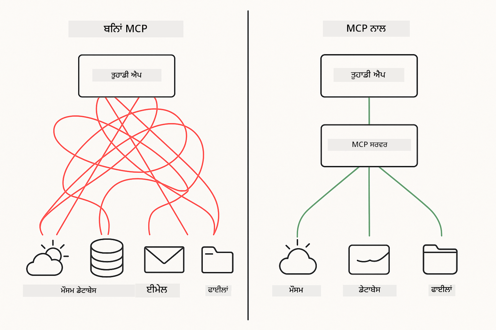
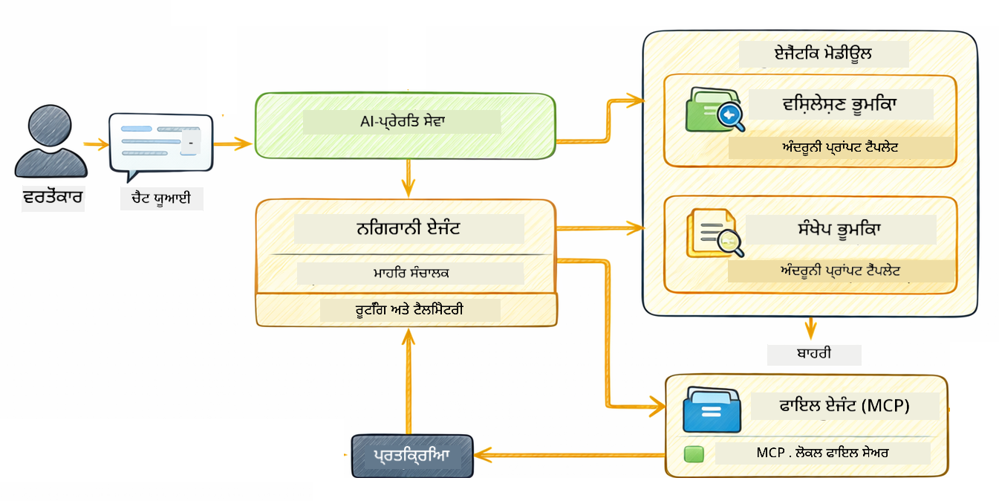

<!--
CO_OP_TRANSLATOR_METADATA:
{
  "original_hash": "f89f4c106d110e4943c055dd1a2f1dff",
  "translation_date": "2025-12-30T23:23:00+00:00",
  "source_file": "05-mcp/README.md",
  "language_code": "pa"
}
-->
# Module 05: Model Context Protocol (MCP)

## Table of Contents

- [ਤੁਸੀਂ ਕੀ ਸਿੱਖੋਗੇ](../../../05-mcp)
- [MCP ਕੀ ਹੈ?](../../../05-mcp)
- [MCP ਕਿਵੇਂ ਕੰਮ ਕਰਦਾ ਹੈ](../../../05-mcp)
- [ਏਜੈਂਟਿਕ ਮੋਡੀਊਲ](../../../05-mcp)
- [ਉਦਾਹਰਨ ਚਲਾਉਣਾ](../../../05-mcp)
  - [ਲੋੜੀਂਦੀਆਂ ਸ਼ਰਤਾਂ](../../../05-mcp)
- [ਤੁਰੰਤ ਸ਼ੁਰੂਆਤ](../../../05-mcp)
  - [ਫਾਈਲ ਓਪਰੇਸ਼ਨ (Stdio)](../../../05-mcp)
  - [ਸੁਪਰਵਾਈਜ਼ਰ ਏਜੈਂਟ](../../../05-mcp)
    - [ਆਉਟਪੁੱਟ ਸਮਝਣਾ](../../../05-mcp)
    - [ਏਜੈਂਟਿਕ ਮੋਡੀਊਲ ਫੀਚਰਾਂ ਦੀ ਵਿਆਖਿਆ](../../../05-mcp)
- [ਮੁੱਖ ਧਾਰਣਾ](../../../05-mcp)
- [ਵਧਾਈਆਂ!](../../../05-mcp)
  - [ਅਗਲਾ ਕੀ ਹੈ?](../../../05-mcp)

## What You'll Learn

ਤੁਸੀਂ ਗੱਲਬਾਤੀ ਏਆਈ ਬਣਾਇਆ, ਪ੍ਰాంపਟਾਂ ਵਿੱਚ ਨਿਪੁੰਨ ਹੋਏ, ਦਸਤਾਵੇਜ਼ਾਂ ਵਿੱਚ ਜਵਾਬਾਂ ਨੂੰ ਗਰਾਊਂਡ ਕੀਤਾ, ਅਤੇ ਟੂਲਾਂ ਨਾਲ ਏਜੈਂਟ ਬਣਾਏ। ਪਰ ਉਹ ਸਾਰੇ ਟੂਲ ਤੁਹਾਡੇ ਖਾਸ ਐਪਲੀਕੇਸ਼ਨ ਲਈ ਕਸਟਮ ਬਣਾਏ ਗਏ ਸਨ। ਸੋਚੋ ਜੇ ਤੁਸੀਂ ਆਪਣੀ ਏਆਈ ਨੂੰ ਇੱਕ ਸਟੈਂਡਰਡਾਈਜ਼ਡ ਟੂਲ ਪਰਿਸ਼ਰ (ecosystem) ਦੀ ਪਹੁੰਚ ਦੇ ਸਕਦੇ ਜੋ ਕੋਈ ਵੀ ਬਣਾਉ ਅਤੇ ਸਾਂਝਾ ਕਰ ਸਕੇ? ਇਸ ਮੋਡੀਊਲ ਵਿੱਚ, ਤੁਸੀਂ Model Context Protocol (MCP) ਅਤੇ LangChain4j ਦੀ agentic ਮੋਡੀਊਲ ਦੀ ਵਰਤੋਂ ਕਰਨਾ ਸਿੱਖੋਗੇ। ਅਸੀਂ ਪਹਿਲਾਂ ਇੱਕ ਸਧਾਰਣ MCP ਫਾਈਲ ਰੀਡਰ ਦਿਖਾਉਂਦੇ ਹਾਂ ਅਤੇ ਫਿਰ ਵੇਖਾਂਗੇ ਕਿ ਇਹ Supervisor Agent ਪੈਟਰਨ ਦੀ ਵਰਤੋਂ ਕਰਦੇ ਹੋਏ ਕਿਵੇਂ ਆਸਾਨੀ ਨਾਲ ਉन्नਤ agentic ਵਰਕਫ਼ਲੋਜ਼ ਵਿੱਚ ਸ਼ਾਮِل ਹੋ ਜਾਂਦਾ ਹੈ।

## What is MCP?

Model Context Protocol (MCP) ਬਿਲਕੁਲ ਇਹੀ ਮੁਹੱਈਆ ਕਰਵਾਉਂਦਾ ਹੈ — AI ਐਪਲੀਕੇਸ਼ਨਾਂ ਲਈ ਬਾਹਰੀ ਟੂਲਾਂ ਦੀ ਖੋਜ ਅਤੇ ਵਰਤੋਂ ਕਰਨ ਦਾ ਇੱਕ ਮਿਆਰੀ ਤਰੀਕਾ। ਹਰ ਡਾਟਾ ਸੋਰਸ ਜਾਂ ਸਰਵਿਸ ਲਈ ਕਸਟਮ ਇੰਟੀਗ੍ਰੇਸ਼ਨ ਲਿਖਣ ਦੀ ਥਾਂ, ਤੁਸੀਂ ਉਹਨਾਂ MCP ਸਰਵਰਾਂ ਨਾਲ ਜੁੜਦੇ ਹੋ ਜੋ ਆਪਣੀਆਂ ਸੁਵਿਧਾਵਾਂ ਇੱਕ ਸुसਪਸ਼ਟ ਫਾਰਮੈਟ ਵਿੱਚ ਪ੍ਰਗਟ ਕਰਦੇ ਹਨ। ਤੁਹਾਡਾ ਏਆਈ ਏਜੈਂਟ ਫਿਰ ਆਟੋਮੈਟਿਕ ਤੌਰ 'ਤੇ ਇਨ੍ਹਾਂ ਟੂਲਾਂ ਨੂੰ ਖੋਜ ਅਤੇ ਵਰਤ ਸਕਦਾ ਹੈ।



*MCP ਤੋਂ ਪਹਿਲਾਂ: ਜਟਿਲ ਬਿੰਦੂ-ਟੂ-ਬਿੰਦੂ ਇੰਟੀਗ੍ਰੇਸ਼ਨ। MCP ਤੋਂ ਬਾਅਦ: ਇੱਕ ਪ੍ਰੋਟੋਕੋਲ, ਅਨੰਤ ਸੰਭਾਵਨਾਵਾਂ।*

MCP AI ਵਿਕਾਸ ਵਿੱਚ ਇੱਕ ਮੂਲ ਸਮੱਸਿਆ ਦਾ ਹੱਲ ਕਰਦਾ ਹੈ: ਹਰ ਇੰਟੀਗ੍ਰੇਸ਼ਨ ਕਸਟਮ ਹੁੰਦੀ ਹੈ। GitHub ਤੱਕ ਪਹੁੰਚ ਕਰਨੀ ਹੈ? ਕਸਟਮ ਕੋਡ. ਫਾਈਲਾਂ ਪੜ੍ਹਨੀ ਹਨ? ਕਸਟਮ ਕੋਡ. ਡੇਟਾਬੇਸ ਨੂੰ ਕੁਏਰੀ ਕਰਨੀ ਹੈ? ਕਸਟਮ ਕੋਡ. ਅਤੇ ਇਹਨਾਂ ਵਿੱਚੋਂ ਕੋਈ ਵੀ ਇੰਟੀਗ੍ਰੇਸ਼ਨ ਹੋਰ AI ਐਪਲੀਕੇਸ਼ਨਾਂ ਨਾਲ ਕੰਮ ਨਹੀਂ ਕਰਦੇ।

MCP ਇਸ ਨੂੰ ਮਿਆਰੀਕਰਤ ਕਰਦਾ ਹੈ। ਇੱਕ MCP ਸਰਵਰ ਸਜ਼ਾ-ਵਰਣਨ ਅਤੇ ਸਕੀਮਾਂ ਦੇ ਨਾਲ ਟੂਲ ਪ੍ਰਗਟ ਕਰਦਾ ਹੈ। ਕੋਈ ਵੀ MCP ਕਸਟਮਰ ਕਨੈਕਟ ਕਰ ਸਕਦਾ ਹੈ, ਉਪਲਬਧ ਟੂਲਾਂ ਦੀ ਖੋਜ ਕਰ ਸਕਦਾ ਹੈ, ਅਤੇ ਉਹਨਾਂ ਦੀ ਵਰਤੋਂ ਕਰ ਸਕਦਾ ਹੈ। ਇੱਕ ਵਾਰ ਬਣਾਓ, ਹਰ ਜਗ੍ਹਾ ਵਰਤੋ।


*Model Context Protocol ਆਰਕੀਟੈਕਚਰ - ਮਿਆਰੀਕਰਤ ਟੂਲ ਖੋਜ ਅਤੇ ਐਕਸੇਕਿਊਸ਼ਨ*

## How MCP Works

**Server-Client Architecture**

MCP ਇੱਕ ਕਲਾਇਂਟ-ਸਰਵਰ ਮਾਡਲ ਵਰਤਦਾ ਹੈ। ਸਰਵਰ ਟੂਲ ਪ੍ਰਦਾਨ ਕਰਦੇ ਹਨ — ਫਾਈਲਾਂ ਪੜ੍ਹਨਾ, ਡੇਟਾਬੇਸ ਕੁਏਰੀ, API ਕਾਲ ਕਰਨਾ। ਕਲਾਇਂਟ (ਤੁਹਾਡੀ ਏਆਈ ਐਪਲੀਕੇਸ਼ਨ) ਸਰਵਰਾਂ ਨਾਲ ਜੁੜਦਾ ਹੈ ਅਤੇ ਉਹਨਾਂਦੇ ਟੂਲ ਵਰਤਦਾ ਹੈ।

To use MCP with LangChain4j, add this Maven dependency:

```xml
<dependency>
    <groupId>dev.langchain4j</groupId>
    <artifactId>langchain4j-mcp</artifactId>
    <version>${langchain4j.version}</version>
</dependency>
```

**Tool Discovery**

ਜੇ ਤੁਹਾਡਾ ਕਲਾਇਂਟ MCP ਸਰਵਰ ਨਾਲ ਜੁੜਦਾ ਹੈ, ਤਾਂ ਇਹ ਪੁੱਛਦਾ ਹੈ "ਤੁਹਾਡੇ ਕੋਲ ਕਿਹੜੇ ਟੂਲ ਹਨ?" ਸਰਵਰ ਉਪਲਬਧ ਟੂਲਾਂ ਦੀ ਸੂਚੀ ਦੇ ਕੇ ਜਵਾਬ ਦਿੰਦਾ ਹੈ, ਪ੍ਰਤੀਕ ਟੂਲ ਲਈ ਵਰਣਨ ਅਤੇ ਪੈਰਾਮੀਟਰ ਸਕੀਮਾਂ ਸਮੇਤ। ਤੁਹਾਡਾ ਏਆਈ ਏਜੈਂਟ ਫਿਰ ਯੂਜ਼ਰ ਦੀ ਬੇਨਤੀ ਦੇ ਅਧਾਰ 'ਤੇ ਫੈਸਲਾ ਕਰ ਸਕਦਾ ਹੈ ਕਿ ਕਿਹੜੇ ਟੂਲ ਵਰਤਣੇ ਹਨ।

**Transport Mechanisms**

MCP ਵੱਖ-ਵੱਖ ਟ੍ਰਾਂਸਪੋਰਟ ਮਕੈਨਿਜ਼ਮਾਂ ਨੂੰ ਸਹਿਯੋਗ ਦਿੰਦਾ ਹੈ। ਇਸ ਮੋਡੀਊਲ ਵਿੱਚ ਸਥਾਨਕ ਪ੍ਰੋਸੈਸਾਂ ਲਈ Stdio ਟ੍ਰਾਂਸਪੋਰਟ ਦਿਖਾਇਆ ਗਿਆ ਹੈ:


*MCP ਟ੍ਰਾਂਸਪੋਰਟ ਮਕੈਨਿਜ਼ਮ: ਰਿਮੋਟ ਸਰਵਰਾਂ ਲਈ HTTP, ਸਥਾਨਕ ਪ੍ਰੋਸੈਸਾਂ ਲਈ Stdio*

**Stdio** - [StdioTransportDemo.java](../../../05-mcp/src/main/java/com/example/langchain4j/mcp/StdioTransportDemo.java)

ਸਥਾਨਕ ਪ੍ਰੋਸੈਸਾਂ ਲਈ। ਤੁਹਾਡੀ ਐਪਲੀਕੇਸ਼ਨ ਇਕ ਸਰਵਰ ਨੂੰ ਏਕ ਸਬਪ੍ਰੋਸੇਸ ਵਜੋਂ ਚਲਾਉਂਦੀ ਹੈ ਅਤੇ ਸਟੈਂਡਰਡ ਇਨਪੁੱਟ/ਆਊਟਪੁੱਟ ਰਾਹੀਂ ਸੰਚਾਰ ਕਰਦੀ ਹੈ। ਫਾਈਲਸਿਸਟਮ ਪਹੁੰਚ ਜਾਂ ਕਮਾਂਡ-ਲਾਈਨ ਟੂਲਾਂ ਲਈ ਲਾਭਦਾਇਕ।

```java
McpTransport stdioTransport = new StdioMcpTransport.Builder()
    .command(List.of(
        npmCmd, "exec",
        "@modelcontextprotocol/server-filesystem@2025.12.18",
        resourcesDir
    ))
    .logEvents(false)
    .build();
```

> **🤖 Try with [GitHub Copilot](https://github.com/features/copilot) Chat:** Open [`StdioTransportDemo.java`](../../../05-mcp/src/main/java/com/example/langchain4j/mcp/StdioTransportDemo.java) and ask:
> - "Stdio ਟ੍ਰਾਂਸਪੋਰਟ ਕਿਵੇਂ ਕੰਮ ਕਰਦਾ ਹੈ ਅਤੇ ਮੈਂ ਇਸਨੂੰ HTTP ਦੀ ਥਾਂ ਕਦੋਂ ਵਰਤਾਂ?"
> - "LangChain4j ਜਨਰੇਟ ਕੀਤੇ MCP ਸਰਵਰ ਪ੍ਰੋਸੈਸਜ਼ ਦੀ ਲਾਈਫਸਾਈਕਲ ਨੂੰ ਕਿਵੇਂ ਸੰਭਾਲਦਾ ਹੈ?"
> - "ਏਆਈ ਨੂੰ ਫਾਈਲ ਸਿਸਟਮ ਦੀ ਪਹੁੰਚ ਦੇਣ ਦੇ ਸੁਰੱਖਿਆ ਨਤੀਜੇ ਕਿਹੜੇ ਹਨ?"

## The Agentic Module

While MCP provides standardized tools, LangChain4j's **agentic module** provides a declarative way to build agents that orchestrate those tools. The `@Agent` annotation and `AgenticServices` let you define agent behavior through interfaces rather than imperative code.

In this module, you'll explore the **Supervisor Agent** pattern — an advanced agentic AI approach where a "supervisor" agent dynamically decides which sub-agents to invoke based on user requests. We'll combine both concepts by giving one of our sub-agents MCP-powered file access capabilities.

To use the agentic module, add this Maven dependency:

```xml
<dependency>
    <groupId>dev.langchain4j</groupId>
    <artifactId>langchain4j-agentic</artifactId>
    <version>${langchain4j.mcp.version}</version>
</dependency>
```

> **⚠️ Experimental:** The `langchain4j-agentic` module is **experimental** and subject to change. The stable way to build AI assistants remains `langchain4j-core` with custom tools (Module 04).

## Running the Examples

### Prerequisites

- Java 21+, Maven 3.9+
- Node.js 16+ and npm (for MCP servers)
- Environment variables configured in `.env` file (from the root directory):
  - **For StdioTransportDemo:** `GITHUB_TOKEN` (GitHub Personal Access Token)
  - **For SupervisorAgentDemo:** `AZURE_OPENAI_ENDPOINT`, `AZURE_OPENAI_API_KEY`, `AZURE_OPENAI_DEPLOYMENT` (same as Modules 01-04)

> **Note:** If you haven't set up your environment variables yet, see [Module 00 - Quick Start](../00-quick-start/README.md) for instructions, or copy `.env.example` to `.env` in the root directory and fill in your values.

## Quick Start

**Using VS Code:** Explorer ਵਿੱਚ ਕਿਸੇ ਵੀ ਡੈਮੋ ਫਾਈਲ 'ਤੇ ਰਾਈਟ-ਕਲਿੱਕ ਕਰਕੇ **"Run Java"** ਚੁਣੋ, ਜਾਂ Run and Debug ਪੈਨਲ ਤੋਂ ਲੌਂਚ ਕੰਫਿਗਰੇਸ਼ਨ ਵਰਤੋ (ਸੁਨਿਸ਼ਚਿਤ ਕਰੋ ਕਿ ਪਹਿਲਾਂ ਤੁਸੀਂ ਆਪਣਾ ਟੋਕਨ `.env` ਫਾਈਲ ਵਿੱਚ ਸ਼ਾਮِل ਕੀਤਾ ਹੈ)।

**Using Maven:** ਵਿਕਲਪ ਵਜੋਂ, ਤੁਸੀਂ ਹੇਠਾਂ ਦਿੱਤੇ ਉਦਾਹਰਨਾਂ ਨਾਲ ਕਮਾਂਡ ਲਾਈਨ ਤੋਂ ਚਲਾ ਸਕਦੇ ਹੋ।

### File Operations (Stdio)

ਇਹ ਸਥਾਨਕ ਸਬਪ੍ਰੋਸੈਸ-ਅਧਾਰਤ ਟੂਲਾਂ ਦਾ ਪ੍ਰਦਰਸ਼ਨ ਕਰਦਾ ਹੈ।

**✅ ਕੋਈ מראש ਲੋੜ ਨਹੀਂ** - MCP ਸਰਵਰ ਆਪਣੇ ਆਪ ਸਪੌਨ ਹੋ ਜਾਂਦਾ ਹੈ।

**Using VS Code:** `StdioTransportDemo.java` 'ਤੇ ਰਾਈਟ-ਕਲਿੱਕ ਕਰੋ ਅਤੇ **"Run Java"** ਚੁਣੋ।

**Using Maven:**

**Bash:**
```bash
export GITHUB_TOKEN=your_token_here
cd 05-mcp
mvn compile exec:java -Dexec.mainClass=com.example.langchain4j.mcp.StdioTransportDemo
```

**PowerShell:**
```powershell
$env:GITHUB_TOKEN=your_token_here
cd 05-mcp
mvn --% compile exec:java -Dexec.mainClass=com.example.langchain4j.mcp.StdioTransportDemo
```

ਐਪਲੀਕੇਸ਼ਨ ਆਪਣੇ ਆਪ ਇੱਕ ਫਾਈਲਸਿਸਟਮ MCP ਸਰਵਰ ਸਪੌਨ ਕਰਦੀ ਹੈ ਅਤੇ ਇੱਕ ਸਥਾਨਕ ਫਾਈਲ ਪੜ੍ਹਦੀ ਹੈ। ਧਿਆਨ ਦੇਖੋ ਕਿ ਸਬਪ੍ਰੋਸੈਸ ਪ੍ਰਬੰਧਨ ਤੁਹਾਡੇ ਲਈ ਕਿਵੇਂ ਸੰਭਾਲਿਆ ਗਿਆ ਹੈ।

**Expected output:**
```
Assistant response: The file provides an overview of LangChain4j, an open-source Java library
for integrating Large Language Models (LLMs) into Java applications...
```

### Supervisor Agent




**Supervisor Agent ਪੈਟਰਨ** ਇੱਕ **ਲਚਕੀਲਾ** agentic AI ਰੂਪ ਹੈ। ਨਿਰਧਾਰਤ ਵਰਕਫ਼ਲੋਜ਼ (ਕ੍ਰਮਵਾਰ, ਲੂਪ, ਪੈਰਲੇਲ) ਦੇ ਉਲਟ, ਇੱਕ Supervisor ਇੱਕ LLM ਦਾ ਉਪਯੋਗ ਕਰਦਾ ਹੈ ਜੋ ਯੂਜ਼ਰ ਦੀ ਬੇਨਤੀ ਦੇ ਆਧਾਰ 'ਤੇ ਸਵੈ-ਚਾਲਤ ਤੌਰ 'ਤੇ ਇਹ ਫੈਸਲਾ ਕਰਦਾ ਹੈ ਕਿ ਕਿਹੜੇ ਸਭ-ਏਜੈਂਟ ਨੂੰ ਸੱਦਨਾ ਹੈ।

**Supervisor ਨੂੰ MCP ਨਾਲ ਜੋੜਨਾ:** ਇਸ ਉਦਾਹਰਨ ਵਿੱਚ, ਅਸੀਂ `FileAgent` ਨੂੰ MCP ਫਾਈਲ ਸਿਸਟਮ ਟੂਲਾਂ ਤੱਕ ਪਹੁੰਚ ਦਿੰਦੇ ਹਾਂ `toolProvider(mcpToolProvider)` ਰਾਹੀਂ। ਜਦੋਂ ਯੂਜ਼ਰ "ਫਾਈਲ ਪੜ੍ਹੋ ਅਤੇ ਵਿਸ਼ਲੇਸ਼ਣ ਕਰੋ" ਪੁੱਛਦਾ ਹੈ, Supervisor ਬੇਨਤੀ ਦਾ ਵਿਸ਼ਲੇਸ਼ਣ ਕਰਦਾ ਹੈ ਅਤੇ ਇੱਕ ਐਕਸੇਕਿਊਸ਼ਨ ਯੋਜਨਾ ਤਿਆਰ ਕਰਦਾ ਹੈ। ਫਿਰ ਇਹ ਬੇਨਤੀ ਨੂੰ `FileAgent` ਵੱਲ ਰੂਟ ਕਰਦਾ ਹੈ, ਜੋ MCP ਦਾ `read_file` ਟੂਲ ਵਰਤ ਕੇ ਸਮੱਗਰੀ ਪ੍ਰਾਪਤ ਕਰਦਾ ਹੈ। Supervisor ਉਹ ਸਮੱਗਰੀ `AnalysisAgent` ਨੂੰ ਵਿਵਚਨ ਲਈ ਪਾਸ ਕਰਦਾ ਹੈ, ਅਤੇ ਲੋੜ ਪੈਣ 'ਤੇ `SummaryAgent` ਨੂੰ ਨਤੀਜੇ ਸੰਖੇਪ ਕਰਨ ਲਈ ਬੁਲਾ ਸਕਦਾ ਹੈ।

ਇਹ ਦਿਖਾਉਂਦਾ ਹੈ ਕਿ MCP ਟੂਲ agentic ਵਰਕਫ਼ਲੋਜ਼ ਵਿੱਚ ਕਿਵੇਂ ਬਿਨਾਂ ਰੁਕਾਵਟ ਸ਼ਾਮِل ਹੋ ਜਾਂਦੇ ਹਨ — Supervisor ਨੂੰ ਇਹ ਪਤਾ ਹੋਣ ਦੀ ਜਰੂਰਤ ਨਹੀਂ ਕਿ ਫਾਈਲਾਂ ਕਿਵੇਂ ਪੜ੍ਹੀਆਂ ਜਾਂਦੀਆਂ ਹਨ, ਸਿਰਫ਼ ਇਹ ਜਾਣਨਾ ਚਾਹੀਦਾ ਹੈ ਕਿ `FileAgent` ਇਹ ਕਰ ਸਕਦਾ ਹੈ। Supervisor ਵੱਖ-ਵੱਖ ਕਿਸਮ ਦੀਆਂ ਬੇਨਤੀਆਂ ਦੇ ਮੁਕਾਬਲੇ ਵਿੱਚ ਗਤਿਸੀਲਤਾ ਨਾਲ ਅਨੁਕੂਲ ਹੋ ਜਾਂਦਾ ਹੈ ਅਤੇ ਅਖੀਰਕਾਰ ਆਖ਼ਰੀ ਏਜੈਂਟ ਦੇ ਜਵਾਬ ਜਾਂ ਸਾਰੇ ਆਪਰੇਸ਼ਨਾਂ ਦਾ ਸੰਖੇਪ ਵਾਪਸ ਕਰਦਾ ਹੈ।

**Start Scripts ਦੀ ਵਰਤੋਂ (ਸੁਝਾਅ):**

ਸਟਾਰਟ ਸਕ੍ਰਿਪਟਾਂ ਆਪਣੇ ਆਪ ਰੂਟ `.env` ਫਾਈਲ ਤੋਂ ਵਾਤਾਵਰਣ ਚਲਕਦੀਆਂ ਲੋਡ ਕਰ ਲੈਂਦੀਆਂ ਹਨ:

**Bash:**
```bash
cd 05-mcp
chmod +x start.sh
./start.sh
```

**PowerShell:**
```powershell
cd 05-mcp
.\start.ps1
```

**Using VS Code:** `SupervisorAgentDemo.java` 'ਤੇ ਰਾਈਟ-ਕਲਿੱਕ ਕਰੋ ਅਤੇ **"Run Java"** ਚੁਣੋ (ਯਕੀਨੀ ਬਣਾਓ ਕਿ ਤੁਹਾਡੀ `.env` ਫਾਈਲ ਸੰਰਚਿਤ ਹੈ)।

**Supervisor ਕਿਵੇਂ ਕੰਮ ਕਰਦਾ ਹੈ:**

```java
// ਨਿਰਧਾਰਤ ਸਮਰੱਥਾਵਾਂ ਵਾਲੇ ਕਈ ਏਜੰਟ ਪਰਿਭਾਸ਼ਤ ਕਰੋ
FileAgent fileAgent = AgenticServices.agentBuilder(FileAgent.class)
        .chatModel(model)
        .toolProvider(mcpToolProvider)  // MCP ਟੂਲ ਫਾਇਲ ਓਪਰੇਸ਼ਨਾਂ ਲਈ ਹਨ
        .build();

AnalysisAgent analysisAgent = AgenticServices.agentBuilder(AnalysisAgent.class)
        .chatModel(model)
        .build();

SummaryAgent summaryAgent = AgenticServices.agentBuilder(SummaryAgent.class)
        .chatModel(model)
        .build();

// ਇਹਨਾਂ ਏਜੰਟਾਂ ਨੂੰ ਸਮਨਵਿਤ ਕਰਨ ਵਾਲਾ ਇੱਕ ਸੁਪਰਵਾਇਜ਼ਰ ਬਣਾਓ
SupervisorAgent supervisor = AgenticServices.supervisorBuilder()
        .chatModel(model)  // "ਪਲੈਨਰ" ਮਾਡਲ
        .subAgents(fileAgent, analysisAgent, summaryAgent)
        .responseStrategy(SupervisorResponseStrategy.SUMMARY)
        .build();

// ਸੂਪਰਵਾਇਜ਼ਰ ਸਵੈਚਾਲਕ ਤੌਰ 'ਤੇ ਫੈਸਲਾ ਕਰਦਾ ਹੈ ਕਿ ਕਿਹੜੇ ਏਜੰਟਾਂ ਨੂੰ ਕਾਲ ਕਰਨਾ ਹੈ
// ਕੇਵਲ ਕੁਦਰਤੀ ਭਾਸ਼ਾ ਦੀ ਬੇਨਤੀ ਦਿਓ - LLM ਕਾਰਜਨਵਾਈ ਦੀ ਯੋਜਨਾ ਬਣਾਉਂਦਾ ਹੈ
String response = supervisor.invoke("Read the file at /path/file.txt and analyze it");
```

ਪੂਰਾ ਇੰਪਲੇਮੇਂਟੇਸ਼ਨ ਦੇਖਣ ਲਈ [SupervisorAgentDemo.java](../../../05-mcp/src/main/java/com/example/langchain4j/mcp/SupervisorAgentDemo.java) ਵੇਖੋ।

> **🤖 Try with [GitHub Copilot](https://github.com/features/copilot) Chat:** Open [`SupervisorAgentDemo.java`](../../../05-mcp/src/main/java/com/example/langchain4j/mcp/SupervisorAgentDemo.java) and ask:
> - "Supervisor ਇਹ ਨਿਰਣਾ ਕਿਵੇਂ ਲੈਂਦਾ ਹੈ ਕਿ ਕਿਹੜੇ ਏਜੈਂਟਸ ਸੱਦਣੇ ਹਨ?"
> - "Supervisor ਅਤੇ Sequential ਵਰਕਫ਼ਲੋ ਪੈਟਰਨਾਂ ਵਿੱਚ ਕੀ ਫ਼ਰਕ ਹੈ?"
> - "Supervisor ਦੀਯੋਜਨਾ ਬਣਾਉਣ ਵਾਲੀ ਵਿਹਾਰ (planning behavior) ਨੂੰ ਮੈਂ ਕਿਵੇਂ ਕਸਟਮਾਈਜ਼ ਕਰ ਸਕਦਾ/ਸਕਦੀ ਹਾਂ?"

#### Understanding the Output

ਜਦੋਂ ਤੁਸੀਂ ਡੈਮੋ ਚਲਾਵੋਗੇ, ਤਾਂ ਤੁਸੀਂ ਵੇਖੋਗੇ ਕਿ Supervisor ਕਿਵੇਂ ਕਈ ਏਜੈਂਟਾਂ ਦਾ ਇਕ ਢਾਂਚਾਬੱਧ ਦਿੱਖ-ਪਾਸਾ ਦਿਖਾਉਂਦਾ ਹੈ। ਹੇਠਾਂ ਹਰ ਇੱਕ ਭਾਗ ਦਾ ਅਰਥ ਦਿੱਤਾ ਗਿਆ ਹੈ:

```
======================================================================
  SUPERVISOR AGENT DEMO
======================================================================

This demo shows how a Supervisor Agent orchestrates multiple specialized agents.
The Supervisor uses an LLM to decide which agent to call based on the task.
```

**ਹੈਡਰ** ਡੈਮੋ ਦਾ ਪਰਿਚਯ ਕਰਵਾਉਂਦਾ ਹੈ ਅਤੇ ਮੁੱਖ ਧਾਰਨਾ ਸਮਝਾਉਂਦਾ ਹੈ: Supervisor ਨਿਰਧਾਰਤ ਨਿਯਮਾਂ ਦੀ ਥਾਂ ਇੱਕ LLM ਦਾ ਉਪਯੋਗ ਕਰਦਾ ਹੈ ਇਹ ਫੈਸਲਾ ਕਰਨ ਲਈ ਕਿ ਕਿਹੜੇ ਏਜੈਂਟਾਂ ਨੂੰ ਕਾਲ ਕਰਨਾ ਹੈ।

```
--- AVAILABLE AGENTS -------------------------------------------------
  [FILE]     FileAgent     - Reads files using MCP filesystem tools
  [ANALYZE]  AnalysisAgent - Analyzes content for structure, tone, and themes
  [SUMMARY]  SummaryAgent  - Creates concise summaries of content
```

**ਉਪਲਬਧ ਏਜੈਂਟਸ** ਤਿੰਨ ਵਿਸ਼ੇਸ਼ ਏਜੈਂਟਸ ਦਿਖਾਉਂਦਾ ਹੈ ਜੋ Supervisor ਚੁਣ ਸਕਦਾ ਹੈ। ਹਰ ਏਜੈਂਟ ਦੀ ਇੱਕ ਖਾਸ ਯੋਗਤਾ ਹੁੰਦੀ ਹੈ:
- **FileAgent** MCP ਟੂਲਾਂ ਦੀ ਵਰਤੋਂ ਕਰਕੇ ਫਾਈਲਾਂ ਪੜ੍ਹ ਸਕਦਾ ਹੈ (ਬਾਹਰੀ ਸਹਿਯੋਗ)
- **AnalysisAgent** ਸਮੱਗਰੀ ਦਾ ਵਿਸ਼ਲੇਸ਼ਣ ਕਰਦਾ ਹੈ (ਸਿਰਫ਼ LLM ਯੋਗਤਾ)
- **SummaryAgent** ਸੰਖੇਪ ਬਣਾਉਂਦਾ ਹੈ (ਸਿਰਫ਼ LLM ਯੋਗਤਾ)

```
--- USER REQUEST -----------------------------------------------------
  "Read the file at .../file.txt and analyze what it's about"
```

**ਯੂਜ਼ਰ ਦੀ ਬੇਨਤੀ** ਦਿਖਾਉਂਦਾ ਹੈ ਕਿ ਕੀ ਪੁੱਛਿਆ ਗਿਆ ਸੀ। Supervisor ਨੂੰ ਇਸ ਨੂੰ ਪਾਰਸ ਕਰਨਾ ਹੋਏਗਾ ਅਤੇ ਫੈਸਲਾ ਕਰਨਾ ਹੋਵੇਗਾ ਕਿ ਕਿਹੜੇ ਏਜੈਂਟਸ ਸੱਦੇ ਜਾਣ।

```
--- SUPERVISOR ORCHESTRATION -----------------------------------------
  The Supervisor will now decide which agents to invoke and in what order...

  +-- STEP 1: Supervisor chose -> FileAgent (reading file via MCP)
  |
  |   Input: .../file.txt
  |
  |   Result: LangChain4j is an open-source Java library designed to simplify...
  +-- [OK] FileAgent (reading file via MCP) completed

  +-- STEP 2: Supervisor chose -> AnalysisAgent (analyzing content)
  |
  |   Input: LangChain4j is an open-source Java library...
  |
  |   Result: Structure: The content is organized into clear paragraphs that int...
  +-- [OK] AnalysisAgent (analyzing content) completed
```

**Supervisor Orchestration** ਉੱਥੇ ਜਾਦੂ ਹੁੰਦਾ ਹੈ। ਦੇਖੋ ਕਿ:
1. Supervisor ਨੇ ਪਹਿਲਾਂ **FileAgent ਨੂੰ ਚੁਣਿਆ** ਕਿਉਂਕਿ ਬੇਨਤੀ ਵਿੱਚ "ਫਾਈਲ ਪੜ੍ਹੋ" ਦਰਜ ਸੀ
2. FileAgent ਨੇ MCP ਦਾ `read_file` ਟੂਲ ਵਰਤ ਕੇ ਫਾਈਲ ਸਮੱਗਰੀ ਪ੍ਰਾਪਤ ਕੀਤੀ
3. Supervisor ਨੇ ਫਿਰ **AnalysisAgent ਨੂੰ ਚੁਣਿਆ** ਅਤੇ ਫਾਈਲ ਸਮੱਗਰੀ ਉਸ ਨੂੰ ਸੌਂਪੀ
4. AnalysisAgent ਨੇ ਸੰਰਚਨਾ, ਟੋਨ ਅਤੇ ਥੀਮਾਂ ਦਾ ਵਿਸ਼ਲੇਸ਼ਣ ਕੀਤਾ

ਧਿਆਨ ਦਿਓ ਕਿ Supervisor ਨੇ ਯੂਜ਼ਰ ਦੀ ਬੇਨਤੀ ਦੇ ਅਧਾਰ 'ਤੇ ਇਹ ਫੈਸਲੇ **ਸਵੈਚਾਲਿਤ ਤੌਰ 'ਤੇ** ਕੀਤੇ — ਕੋਈ ਨਿਰਧਾਰਤ ਵਰਕਫ਼ਲੋ ਨਹੀਂ!

**Final Response** Supervisor ਦਾ ਸੰਮਿਲਿਤ ਜਵਾਬ ਹੈ, ਜੋ ਸਾਰੇ ਸੱਦੇ ਗਏ ਏਜੈਂਟਸ ਦੇ ਨਤੀਆਂ ਜੋੜਦਾ ਹੈ। ਉਦਾਹਰਨ agentic ਸਕੋਪ ਡੰਪ ਕਰਦਾ ਹੈ ਜਿੱਥੇ ਹਰ ਏਜੈਂਟ ਵੱਲੋਂ ਸਟੋਰ ਕੀਤੇ ਗਏ ਸੰਖੇਪ ਅਤੇ ਵਿਸ਼ਲੇਸ਼ਣ ਨਤੀਜੇ ਦਿਖਾਏ ਜਾਂਦੇ ਹਨ।

```
--- FINAL RESPONSE ---------------------------------------------------
I read the contents of the file and analyzed its structure, tone, and key themes.
The file introduces LangChain4j as an open-source Java library for integrating
large language models...

--- AGENTIC SCOPE (Shared Memory) ------------------------------------
  Agents store their results in a shared scope for other agents to use:
  * summary: LangChain4j is an open-source Java library...
  * analysis: Structure: The content is organized into clear paragraphs that in...
```

### Explanation of Agentic Module Features

ਉਦਾਹਰਨ agentic ਮੋਡੀਊਲ ਦੀਆਂ ਕਈ ਉੱਚ-ਸਤਹੀ ਸਮਰੱਥਾਵਾਂ ਦਿਖਾਉਂਦੀ ਹੈ। ਆਓ Agentic Scope ਅਤੇ Agent Listeners 'ਤੇ ਨੇੜੇ ਤੋਂ ਨਜ਼ਰ ਮਾਰਦੇ ਹਾਂ।

**Agentic Scope** ਸਾਂਝੀ ਮੈਮਰੀ ਦਿਖਾਉਂਦਾ ਹੈ ਜਿਥੇ ਏਜੈਂਟਸ ਨੇ `@Agent(outputKey="...")` ਦੀ ਵਰਤੋਂ ਕਰਕੇ ਆਪਣੇ ਨਤੀਜੇ ਸਟੋਰ ਕੀਤੇ ਹਨ। ਇਹ ਦੀ ਲਾਭਦਾਇਕਤਾ ਹੈ:
- ਬਾਅਦ ਵਾਲੇ ਏਜੈਂਟ ਪਹਿਲਾਂ ਵਾਲਿਆਂ ਦੇ ਆਉਟਪੁੱਟ ਤੱਕ ਪਹੁੰਚ ਸਕਦੇ ਹਨ
- Supervisor ਅਖੀਰਲਾ ਜਵਾਬ ਸੰਮਿਲਿਤ ਕਰ ਸਕਦਾ ਹੈ
- ਤੁਸੀਂ ਦੇਖ ਸਕਦੇ ਹੋ ਕਿ ਹਰ ਏਜੈਂਟ ਨੇ ਕੀ ਉਤਪਾਦਨ ਕੀਤਾ

```java
ResultWithAgenticScope<String> result = supervisor.invokeWithAgenticScope(request);
AgenticScope scope = result.agenticScope();
String story = scope.readState("story");
List<AgentInvocation> history = scope.agentInvocations("analysisAgent");
```

**Agent Listeners** ਏਜੈਂਟ ਐਕਸੇਕਿਊਸ਼ਨ ਦੀ ਮਾਨੀਟਰਿੰਗ ਅਤੇ ਡੀਬੱਗਿੰਗ ਯੋਗ ਬਣਾਉਂਦੇ ਹਨ। ਡੈਮੋ ਵਿੱਚ ਜੋ ਕਦਮ-ਦਰ-कਦਮ ਆਉਟਪੁੱਟ ਤੁਸੀਂ ਦੇਖਦੇ ਹੋ ਉਹ ਇੱਕ AgentListener ਤੋਂ ਆਉਂਦਾ ਹੈ ਜੋ ਹਰ ਏਜੈਂਟ ਕਾਲ ਵਿੱਚ ਹੂੱਕ (hook) ਕਰਦਾ ਹੈ:
- **beforeAgentInvocation** - ਜਦੋਂ Supervisor ਕਿਸੇ ਏਜੈਂਟ ਨੂੰ ਚੁਣਦਾ ਹੈ ਬੁਲਾਇਆ ਜਾਂਦਾ ਹੈ, ਜਿਸ ਨਾਲ ਤੁਸੀਂ ਦੇਖ ਸਕਦੇ ਹੋ ਕਿ ਕਿਹੜਾ ਏਜੈਂਟ ਚੁਣਿਆ ਗਿਆ ਅਤੇ ਕਿਉਂ
- **afterAgentInvocation** - ਜਦੋਂ ਇੱਕ ਏਜੈਂਟ ਪੂਰਾ ਹੁੰਦਾ ਹੈ ਤਾਂ ਬੁਲਾਇਆ ਜਾਂਦਾ ਹੈ, ਅਤੇ ਇਸਦਾ ਨਤੀਜਾ ਦਿਖਾਇਆ ਜਾਂਦਾ ਹੈ
- **inheritedBySubagents** - ਜੇ ਸਚ ਹੈ, ਤਾਂ ਲਿਸ਼ਨਰ ਹੈਰਾਰਕੀ ਵਿੱਚ ਸਾਰੇ ਏਜੈਂਟਾਂ ਦੀ ਨਿਗਰਾਨੀ ਕਰਦਾ ਹੈ

```java
AgentListener monitor = new AgentListener() {
    private int step = 0;
    
    @Override
    public void beforeAgentInvocation(AgentRequest request) {
        step++;
        System.out.println("  +-- STEP " + step + ": " + request.agentName());
    }
    
    @Override
    public void afterAgentInvocation(AgentResponse response) {
        System.out.println("  +-- [OK] " + response.agentName() + " completed");
    }
    
    @Override
    public boolean inheritedBySubagents() {
        return true; // ਸਾਰੇ ਉਪ-ਏਜੰਟਾਂ ਤੱਕ ਪ੍ਰਸਾਰਿਤ ਕਰੋ
    }
};
```

Beyond the Supervisor pattern, the `langchain4j-agentic` module provides several powerful workflow patterns and features:

| Pattern | Description | Use Case |
|---------|-------------|----------|
| **Sequential** | Execute agents in order, output flows to next | Pipelines: research → analyze → report |
| **Parallel** | Run agents simultaneously | Independent tasks: weather + news + stocks |
| **Loop** | Iterate until condition met | Quality scoring: refine until score ≥ 0.8 |
| **Conditional** | Route based on conditions | Classify → route to specialist agent |
| **Human-in-the-Loop** | Add human checkpoints | Approval workflows, content review |

## Key Concepts

**MCP** ਉਹ ਸਭ ਤੋਂ ਵਧੀਆ ਹੈ ਜਦ ਤੁਸੀਂ ਮੌਜੂਦਾ ਟੂਲ ਇਕੋਸਿਸਟਮਾਂ ਦਾ ਲਾਭ ਉਠਾਉਣਾ ਚਾਹੁੰਦੇ ਹੋ, ਉਹ ਟੂਲ ਬਣਾਉਣਾ ਚਾਹੁੰਦੇ ਹੋ ਜੋ ਕਈ ਐਪਲੀਕੇਸ਼ਨਾਂ ਦੁਆਰਾ ਸਾਂਝੇ ਕੀਤੇ ਜਾ ਸਕਣ, ਤੀਜੀ-ਪੱਖੀ ਸੇਵਾਵਾਂ ਨੂੰ ਮਿਆਰੀ ਪ੍ਰੋਟੋਕੋਲਾਂ ਨਾਲ ਇੰਟੀਗ੍ਰੇਟ ਕਰਨਾ, ਜਾਂ ਟੂਲ ਇੰਪਲੀਮੇੰਟੇਸ਼ਨ ਨੂੰ ਬਦਲਣਾ ਬਿਨਾਂ ਕੋਡ ਨੂੰ ਬਦਲੇ।

**ਏਜੈਂਟਿਕ ਮੋਡੀਊਲ** ਸਭ ਤੋਂ ਵਧੀਆ ਕੰਮ ਕਰਦਾ ਹੈ ਜਦ ਤੁਸੀਂ `@Agent` ਐਨੋਟੇਸ਼ਨਾਂ ਨਾਲ ਘੋਸ਼ਣਾਤਮਕ ਏਜੈਂਟ ਪਰਿਭਾਸ਼ਾਵਾਂ ਚਾਹੁੰਦੇ ਹੋ, ਵਰਕਫ਼ਲੋ ਓਰਕੈਸਟ੍ਰੇਸ਼ਨ ਦੀ ਲੋੜ ਹੋਵੇ (sequential, loop, parallel), ਇੰਟਰਫੇਸ-ਆਧਾਰਤ ਏਜੈਂਟ ਡਿਜ਼ਾਇਨ ਨੂੰ ਪ੍ਰੇਫਰ ਕਰੋ ਬਜਾਏ ਇੰਪੀਰੇਟਿਵ ਕੋਡ ਦੇ, ਜਾਂ ਜਦ ਤੁਸੀਂ ਕਈ ਏਜੈਂਟਸ ਨੂੰ ਜੋੜ ਰਹੇ ਹੋ ਜੋ `outputKey` ਰਾਹੀਂ ਨਤੀਜੇ ਸਾਂਝੇ ਕਰਦੇ ਹਨ।

**Supervisor Agent ਪੈਟਰਨ** ਉਹ ਵੇਲੇ ਚਮਕਦਾਰ ਹੁੰਦਾ ਹੈ ਜਦ ਵਰਕਫ਼ਲੋ ਪਹਿਲਾਂ ਤੋਂ ਪੂਰਵ-ਨਿਰਧਾਰਤ ਨਹੀਂ ਹੁੰਦਾ ਅਤੇ ਤੁਸੀਂ ਚਾਹੁੰਦੇ ਹੋ ਕਿ LLM ਫੈਸਲਾ ਲਵੇ, ਜਦ ਤੁਹਾਡੇ ਕੋਲ ਕਈ ਵਿਸ਼ੇਸ਼ ਏਜੈਂਟ ਹਨ ਜਿਨ੍ਹਾਂ ਨੂੰ ਗਤਿਸ਼ੀਲ ਢੰਗ ਨਾਲ ਓਰਕੈਸਟਰੇਟ ਕਰਨ ਦੀ ਲੋੜ ਹੁੰਦੀ ਹੈ, ਗੱਲਬਾਤੀ ਸਿਸਟਮ ਬਣਾਉਂਦੇ ਸਮੇਂ ਜੋ ਵੱਖ-ਵੱਖ ਸਮਰੱਥਾਵਾਂ ਵਲ ਰੂਟ ਕਰਦੇ ਹਨ, ਜਾਂ ਜਦ ਤੁਸੀਂ ਸਭ ਤੋਂ ਲਚਕੀਲਾ, ਅਨੁਕੂਲ ਏਜੈਂਟ ਵਿਹਾਰ ਚਾਹੁੰਦੇ ਹੋ।

## Congratulations!

ਤੁਸੀਂ LangChain4j for Beginners ਕੋਰਸ ਪੂਰਾ ਕਰ ਲਿਆ ਹੈ। ਤੁਸੀਂ ਸਿੱਖਿਆ:

- ਕਿਵੇਂ ਮੈਮੋਰੀ ਵਾਲੀ ਗੱਲਬਾਤੀ ਏਆਈ ਬਣਾਈਏ (Module 01)
- ਵੱਖ-ਵੱਖ ਕਾਰਜਾਂ ਲਈ ਪ੍ਰੈਂਪਟ ਇੰਜੀਨੀਅਰਿੰਗ ਪੈਟਰਨ (Module 02)
- RAG ਨਾਲ ਆਪਣੇ ਦਸਤਾਵੇਜ਼ਾਂ ਵਿੱਚ ਜਵਾਬਾਂ ਨੂੰ ਗਰਾਊਂਡ ਕਰਨਾ (Module 03)
- ਕਸਟਮ ਟੂਲਾਂ ਨਾਲ ਮੂਲ ਏਆਈ ਏਜੈਂਟ (ਸਹਾਇਕ) ਬਣਾਉਣਾ (Module 04)
- ਮਿਆਰੀਕ੍ਰਿਤ ਟੂਲਾਂ ਨੂੰ LangChain4j MCP ਅਤੇ Agentic ਮੋਡੀਊਲਾਂ (Module 05) ਨਾਲ ਜੋੜਨਾ

### ਅਗਲਾ ਕੀ ਹੈ?

ਮੋਡੀਊਲਾਂ ਨੂੰ ਪੂਰਾ ਕਰਨ ਤੋਂ ਬਾਅਦ, LangChain4j ਟੈਸਟਿੰਗ ਸੰਕਲਪਾਂ ਨੂੰ ਅਮਲ ਵਿੱਚ ਦੇਖਣ ਲਈ [ਟੈਸਟਿੰਗ ਗਾਈਡ](../docs/TESTING.md) ਵੇਖੋ।

**ਅਧਿਕਾਰਕ ਸਰੋਤ:**
- [LangChain4j Documentation](https://docs.langchain4j.dev/) - ਵਿਸਤ੍ਰਿਤ ਮਾਰਗਦਰਸ਼ਨ ਅਤੇ API ਰੈਫਰੰਸ
- [LangChain4j GitHub](https://github.com/langchain4j/langchain4j) - ਸੋర్స్ ਕੋਡ ਅਤੇ ਉਦਾਹਰਨਾਂ
- [LangChain4j Tutorials](https://docs.langchain4j.dev/tutorials/) - ਵੱਖ-ਵੱਖ ਉਪਯੋਗ ਕੇਸਾਂ ਲਈ ਕਦਮ-ਬ-ਕਦਮ ਟਿਊਟੋਰਿਯਲ

ਇਸ ਕੋਰਸ ਨੂੰ ਪੂਰਾ ਕਰਨ ਲਈ ਧੰਨਵਾਦ!

---

**ਨੈਵੀਗੇਸ਼ਨ:** [← ਪਿਛਲਾ: ਮੋਡੀਊਲ 04 - ਟੂਲਸ](../04-tools/README.md) | [ਮੁੱਖ ਸਫ਼ੇ ਤੇ ਵਾਪਸ](../README.md)

---

<!-- CO-OP TRANSLATOR DISCLAIMER START -->
ਜਵਾਬਦੇਹੀ ਤੋਂ ਇਨਕਾਰ:
ਇਸ ਦਸਤਾਵੇਜ਼ ਦਾ ਅਨੁਵਾਦ AI ਅਨੁਵਾਦ ਸੇਵਾ Co-op Translator (https://github.com/Azure/co-op-translator) ਦੀ ਵਰਤੋਂ ਕਰਕੇ ਕੀਤਾ ਗਿਆ ਹੈ। ਅਸੀਂ ਸ਼ੁੱਧਤਾ ਲਈ ਕੋਸ਼ਿਸ਼ ਕਰਦੇ ਹਾਂ, ਫਿਰ ਵੀ ਕਿਰਪਾ ਕਰਕੇ ਧਿਆਨ ਰੱਖੋ ਕਿ ਆਟੋਮੇਟਿਕ ਅਨੁਵਾਦਾਂ ਵਿੱਚ ਗਲਤੀਆਂ ਜਾਂ ਅਣਸਹੀਤਾਵਾਂ ਹੋ ਸਕਦੀਆਂ ਹਨ। ਮੂਲ ਭਾਸ਼ਾ ਵਿੱਚ ਮੌਜੂਦ ਦਸਤਾਵੇਜ਼ ਨੂੰ ਪ੍ਰਮਾਣਿਕ ਸਰੋਤ ਮੰਨਿਆ ਜਾਣਾ ਚਾਹੀਦਾ ਹੈ। ਅਹਿਮ ਜਾਣਕਾਰੀ ਲਈ, ਪੇਸ਼ੇਵਰ ਮਨੁੱਖੀ ਅਨੁਵਾਦ ਦੀ ਸਿਫਾਰਸ਼ ਕੀਤੀ ਜਾਂਦੀ ਹੈ। ਅਸੀਂ ਇਸ ਅਨੁਵਾਦ ਦੀ ਵਰਤੋਂ ਕਾਰਨ ਪੈਦਾ ਹੋਣ ਵਾਲੀਆਂ ਕਿਸੇ ਵੀ ਗਲਤਫਹਿਮੀਆਂ ਜਾਂ ਭੁੱਲ-ਤਫਸੀਰਾਂ ਲਈ ਜ਼ਿੰਮੇਵਾਰ ਨਹੀਂ ਹਾਂ।
<!-- CO-OP TRANSLATOR DISCLAIMER END -->