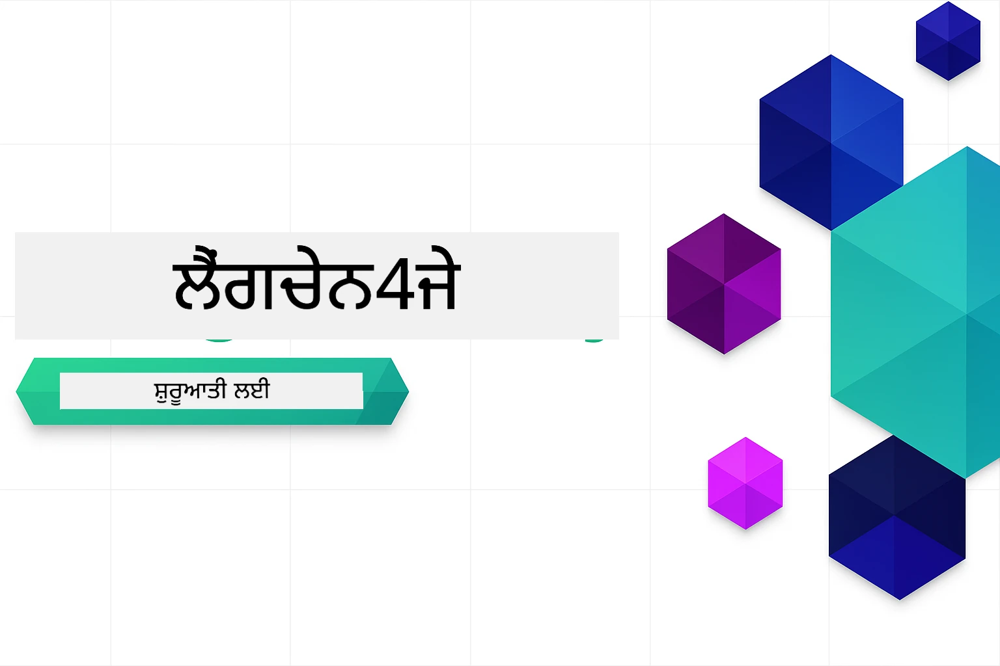

<!--
CO_OP_TRANSLATOR_METADATA:
{
  "original_hash": "6a3bd54fc243ce3dc79d18848d2b5413",
  "translation_date": "2026-01-05T22:50:09+00:00",
  "source_file": "README.md",
  "language_code": "pa"
}
-->


### 🌐 ਬਹੁ-ਭਾਸ਼ਾਈ ਸਮਰਥਨ

#### ਗਿੱਟਹੱਬ ਐਕਸ਼ਨ ਰਾਹੀਂ ਸਹਾਇਤਾ (ਆਟੋਮੈਟਿਕ ਅਤੇ ਸਦਾ ਅਪ-ਟੂ-ਡੇਟ)

<!-- CO-OP TRANSLATOR LANGUAGES TABLE START -->
[Arabic](../ar/README.md) | [Bengali](../bn/README.md) | [Bulgarian](../bg/README.md) | [Burmese (Myanmar)](../my/README.md) | [Chinese (Simplified)](../zh/README.md) | [Chinese (Traditional, Hong Kong)](../hk/README.md) | [Chinese (Traditional, Macau)](../mo/README.md) | [Chinese (Traditional, Taiwan)](../tw/README.md) | [Croatian](../hr/README.md) | [Czech](../cs/README.md) | [Danish](../da/README.md) | [Dutch](../nl/README.md) | [Estonian](../et/README.md) | [Finnish](../fi/README.md) | [French](../fr/README.md) | [German](../de/README.md) | [Greek](../el/README.md) | [Hebrew](../he/README.md) | [Hindi](../hi/README.md) | [Hungarian](../hu/README.md) | [Indonesian](../id/README.md) | [Italian](../it/README.md) | [Japanese](../ja/README.md) | [Kannada](../kn/README.md) | [Korean](../ko/README.md) | [Lithuanian](../lt/README.md) | [Malay](../ms/README.md) | [Malayalam](../ml/README.md) | [Marathi](../mr/README.md) | [Nepali](../ne/README.md) | [Nigerian Pidgin](../pcm/README.md) | [Norwegian](../no/README.md) | [Persian (Farsi)](../fa/README.md) | [Polish](../pl/README.md) | [Portuguese (Brazil)](../br/README.md) | [Portuguese (Portugal)](../pt/README.md) | [Punjabi (Gurmukhi)](./README.md) | [Romanian](../ro/README.md) | [Russian](../ru/README.md) | [Serbian (Cyrillic)](../sr/README.md) | [Slovak](../sk/README.md) | [Slovenian](../sl/README.md) | [Spanish](../es/README.md) | [Swahili](../sw/README.md) | [Swedish](../sv/README.md) | [Tagalog (Filipino)](../tl/README.md) | [Tamil](../ta/README.md) | [Telugu](../te/README.md) | [Thai](../th/README.md) | [Turkish](../tr/README.md) | [Ukrainian](../uk/README.md) | [Urdu](../ur/README.md) | [Vietnamese](../vi/README.md)

> **ਕੀ ਤੁਸੀਂ ਲੋਕਲ ਤੌਰ ਤੇ ਕਲੋਨ ਕਰਨਾ ਪਸੰਦ ਕਰਦੇ ਹੋ?**

> ਇਸ ਰੀਪੋਜ਼ਟਰੀ ਵਿੱਚ 50+ ਭਾਸ਼ਾ ਅਨੁਵਾਦ ਸ਼ਾਮਿਲ ਹਨ ਜੋ ਡਾਊਨਲੋਡ ਦੇ ਆਕਾਰ ਨੂੰ ਕਾਫੀ ਵਧਾਉਂਦੇ ਹਨ। ਅਨੁਵਾਦਾਂ ਦੇ ਬਿਨਾਂ ਕਲੋਨ ਕਰਨ ਲਈ, ਸਪਰਸ ਚੈਕਆਉਟ ਦੀ ਵਰਤੋਂ ਕਰੋ:
> ```bash
> git clone --filter=blob:none --sparse https://github.com/microsoft/LangChain4j-for-Beginners.git
> cd LangChain4j-for-Beginners
> git sparse-checkout set --no-cone '/*' '!translations' '!translated_images'
> ```
> ਇਸ ਨਾਲ ਤੁਹਾਨੂੰ ਬਹੁਤ ਤੇਜ਼ ਡਾਊਨਲੋਡ ਨਾਲ ਕੋਰਸ ਨੂੰ ਪੂਰਾ ਕਰਨ ਲਈ ਸਭ ਕੁਝ ਮਿਲਦਾ ਹੈ।
<!-- CO-OP TRANSLATOR LANGUAGES TABLE END -->

# LangChain4j ਸ਼ੁਰੂਆਤੀ ਲਈ

LangChain4j ਅਤੇ Azure OpenAI GPT-5 ਨਾਲ AI ਐਪਲੀਕੇਸ਼ਨਾਂ ਨੂੰ ਬਣਾਉਣ ਲਈ ਇੱਕ ਕੋਰਸ, ਸਧਾਰਣ ਚੈਟ ਤੋਂ ਲੈ ਕੇ AI ਏਜੰਟਾਂ ਤੱਕ।

**LangChain4j ਵਿੱਚ ਨਵਾਂ ਹੋ?** ਮੁੱਖ ਸ਼ਬਦਾਂ ਅਤੇ ਸਿਧਾਂਤਾਂ ਦੀ ਪਰਿਭਾਸ਼ਾ ਲਈ [ਸ਼ਬਦਾਵਲੀ](docs/GLOSSARY.md) ਵੇਖੋ।

## ਸਮੱਗਰੀ ਦੀ ਸੂਚੀ

1. [ਤੁਰੰਤ ਸ਼ੁਰੂਆਤ](00-quick-start/README.md) - LangChain4j ਨਾਲ ਸ਼ੁਰੂ ਕਰੋ
2. [ਪਰਿਚਯ](01-introduction/README.md) - LangChain4j ਦੇ ਮੂਲ ਤੱਤ ਸਿੱਖੋ
3. [ਪ੍ਰੰਪਟ ਇੰਜੀਨੀਅਰਿੰਗ](02-prompt-engineering/README.md) - ਪ੍ਰਭਾਵਸ਼ਾਲੀ ਪ੍ਰੰਪਟ ਡਿਜ਼ਾਈਨ ਮਾਹਰ ਬਣੋ
4. [RAG (ਰੀਟਰੀਵਲ-ਆਗਮੈਂਟਡ ਜਨਰੇਸ਼ਨ)](03-rag/README.md) - ਬੁੱਧਿਮਾਨ ਗਿਆਨ ਆਧਾਰਿਤ ਪ੍ਰਣਾਲੀਆਂ ਬਣਾਓ
5. [ਟੂਲਸ](04-tools/README.md) - ਬਾਹਰੀ ਸੰਦ ਅਤੇ ਸਰਲ ਸਹਾਇਕਾਂ ਨਾਲ ਇੰਟੀਗ੍ਰੇਟ ਕਰੋ
6. [MCP (ਮਾਡਲ ਕਾਂਟੈਕਸਟ ਪ੍ਰੋਟੋਕੋਲ)](05-mcp/README.md) - ਮਾਡਲ ਕਾਂਟੈਕਸਟ ਪ੍ਰੋਟੋਕੋਲ ਅਤੇ ਏਜੰਟਿਕ ਮਾਡਿਊਲਾਂ ਨਾਲ ਕੰਮ ਕਰੋ
---

## ਸਿੱਖਣ ਦਾ ਰਾਸ਼ਤਾ

> **ਤੁਰੰਤ ਸ਼ੁਰੂਆਤ**

1. ਇਸ ਰੀਪੋਜ਼ਟਰੀ ਨੂੰ ਆਪਣੇ GitHub ਖਾਤੇ ਤੇ ਫੋਰਕ ਕਰੋ
2. **Code** → **Codespaces** ਟੈਬ → **...** → **New with options...** 'ਤੇ ਕਲਿੱਕ ਕਰੋ
3. ਡਿਫ਼ਾਲਟਸ ਦੀ ਵਰਤੋਂ ਕਰੋ – ਇਸ ਨਾਲ ਇਸ ਕੋਰਸ ਲਈ ਬਣਾਇਆ ਗਿਆ ਡਿਵੈਲਪਮੈਂਟ ਕੰਟੇਨਰ ਚੁਣਿਆ ਜਾਏਗਾ
4. **Create codespace** 'ਤੇ ਕਲਿੱਕ ਕਰੋ
5. ਵਾਤਾਵਰਨ ਤਿਆਰ ਹੋਣ ਲਈ 5-10 ਮਿੰਟਾਂ ਦਾ ਇੰਤਜ਼ਾਰ ਕਰੋ
6. ਸ਼ੁਰੂ ਕਰਨ ਲਈ ਸਿੱਧਾ [ਤੁਰੰਤ ਸ਼ੁਰੂਆਤ](./00-quick-start/README.md) 'ਤੇ ਜਾਓ!

> **ਕੀ ਤੁਸੀਂ ਲੋਕਲ ਤੌਰ ਤੇ ਕਲੋਨ ਕਰਨਾ ਪਸੰਦ ਕਰਦੇ ਹੋ?**
>
> ਇਸ ਰੀਪੋਜ਼ਟਰੀ ਵਿੱਚ 50+ ਭਾਸ਼ਾ ਅਨੁਵਾਦ ਸ਼ਾਮਿਲ ਹਨ ਜੋ ਡਾਊਨਲੋਡ ਦੇ ਆਕਾਰ ਨੂੰ ਕਾਫੀ ਵਧਾਉਂਦੇ ਹਨ। ਅਨੁਵਾਦਾਂ ਦੇ ਬਿਨਾਂ ਕਲੋਨ ਕਰਨ ਲਈ, ਸਪਰਸ ਚੈਕਆਉਟ ਦੀ ਵਰਤੋਂ ਕਰੋ:
> ```bash
> git clone --filter=blob:none --sparse https://github.com/microsoft/LangChain4j-for-Beginners.git
> cd LangChain4j-for-Beginners
> git sparse-checkout set --no-cone '/*' '!translations' '!translated_images'
> ```
> ਇਸ ਨਾਲ ਤੁਹਾਨੂੰ ਬਹੁਤ ਤੇਜ਼ ਡਾਊਨਲੋਡ ਨਾਲ ਕੋਰਸ ਨੂੰ ਪੂਰਾ ਕਰਨ ਲਈ ਸਭ ਕੁਝ ਮਿਲਦਾ ਹੈ।

ਮਾਡਿਊਲਾਂ ਨੂੰ ਪੂਰਾ ਕਰਨ ਤੋਂ ਬਾਅਦ, LangChain4j ਟੈਸਟਿੰਗ ਸਿਧਾਂਤਾਂ ਨੂੰ ਦੇਖਣ ਲਈ [ਟੈਸਟਿੰਗ ਗਾਈਡ](docs/TESTING.md) ਦੀ ਜਾਂਚ ਕਰੋ।

> **ਨੋਟ:** ਇਹ ਤਾਲੀਮ GitHub ਮਾਡਲਾਂ ਅਤੇ Azure OpenAI ਦੋਹਾਂ ਦਾ ਇਸਤੇਮਾਲ ਕਰਦੀ ਹੈ। [ਤੁਰੰਤ ਸ਼ੁਰੂਆਤ](00-quick-start/README.md) ਮਾਡਿਊਲ GitHub ਮਾਡਲਾਂ ਨੂੰ ਵਰਤਦਾ ਹੈ (ਕੋਈ Azure ਸਬਸਕ੍ਰਿਪਸ਼ਨ ਦੀ ਲੋੜ ਨਹੀਂ), ਜਦਕਿ ਮਾਡਿਊਲ 1-5 ਵਿੱਚ Azure OpenAI ਦੀ ਵਰਤੋਂ ਕਰਦੇ ਹਨ।


## GitHub Copilot ਨਾਲ ਸਿੱਖਣਾ

ਤੁਰੰਤ ਕੋਡਿੰਗ ਸ਼ੁਰੂ ਕਰਨ ਲਈ, ਇਸ ਪ੍ਰੋਜੈਕਟ ਨੂੰ GitHub Codespace ਜਾਂ ਦਿਓਤੇ IDE ਵਿੱਚ devcontainer ਨਾਲ ਖੋਲ੍ਹੋ। ਇਸ ਕੋਰਸ ਵਿੱਚ ਵਰਤੀ ਗਈ devcontainer ਪਹਿਲਾਂ ਤੋਂ GitHub Copilot ਨਾਲ AI ਜੋੜੇ ਪ੍ਰੋਗ੍ਰਾਮਿੰਗ ਲਈ ਪੂਰਕ ਹੈ।

ਹਰ ਕੋਡ ਉਦਾਹਰਨ ਵਿੱਚ ਸੁਝਾਏ ਗਏ ਸਵਾਲ ਸ਼ਾਮਿਲ ਹਨ ਜੋ ਤੁਸੀਂ GitHub Copilot ਨੂੰ ਜਵਾਬਾਂ ਲਈ ਪੁੱਛ ਸਕਦੇ ਹੋ ਤਾਂ ਜੋ ਤੁਹਾਡੀ ਸਮਝ ਗਹਿਰਾਈ ਨਾਲ ਵਧੇ। 💡/🤖 ਪ੍ਰੰਪਟ ਲਈ ਧਿਆਨ ਦਿਓ:

- **Java ਫਾਈਲ ਹੈਡਰਲੇਖ** - ਹਰ ਉਦਾਹਰਨ ਲਈ ਖਾਸ ਸਵਾਲ
- **ਮਾਡਿਊਲ README ਡਾਕੂਮੈਂਟ** - ਕੋਡ ਉਦਾਹਰਣਾਂ ਤੋਂ ਬਾਅਦ ਖੋਜ ਪ੍ਰੰਪਟ

**ਕਿਵੇਂ ਵਰਤਣਾ ਹੈ:** ਕੋਈ ਵੀ ਕੋਡ ਫਾਈਲ ਖੋਲ੍ਹੋ ਅਤੇ Copilot ਨੂੰ ਸੁਝਾਏ ਗਏ ਸਵਾਲ ਪੁੱਛੋ। ਇਸ ਕੋਡਬੇਸ ਦਾ ਪੂਰਾ ਸੰਦਰਭ ਹੈ ਅਤੇ ਇਹ ਵਿਆਖਿਆ ਕਰ ਸਕਦਾ ਹੈ, ਵਧਾ ਸਕਦਾ ਹੈ, ਅਤੇ ਵਿਕਲਪ ਸੁਝਾ ਸਕਦਾ ਹੈ।

ਹੋਰ ਜਾਣਨਾ ਚਾਹੁੰਦੇ ਹੋ? [AI ਜੋੜੇ ਪ੍ਰੋਗ੍ਰਾਮਿੰਗ ਲਈ Copilot](https://aka.ms/GitHubCopilotAI) ਵੇਖੋ।


## ਹੋਰ ਸਾਧਨ

<!-- CO-OP TRANSLATOR OTHER COURSES START -->
### LangChain
[](https://aka.ms/langchain4j-for-beginners)
[](https://aka.ms/langchainjs-for-beginners?WT.mc_id=m365-94501-dwahlin)

---

### Azure / Edge / MCP / Agents
[](https://github.com/microsoft/AZD-for-beginners?WT.mc_id=academic-105485-koreyst)
[](https://github.com/microsoft/edgeai-for-beginners?WT.mc_id=academic-105485-koreyst)
[](https://github.com/microsoft/mcp-for-beginners?WT.mc_id=academic-105485-koreyst)
[](https://github.com/microsoft/ai-agents-for-beginners?WT.mc_id=academic-105485-koreyst)

---
 
### ਜਨਰੇਟਿਵ AI ਸੀਰੀਜ਼
[](https://github.com/microsoft/generative-ai-for-beginners?WT.mc_id=academic-105485-koreyst)
[-9333EA?style=for-the-badge&labelColor=E5E7EB&color=9333EA)](https://github.com/microsoft/Generative-AI-for-beginners-dotnet?WT.mc_id=academic-105485-koreyst)
[-C084FC?style=for-the-badge&labelColor=E5E7EB&color=C084FC)](https://github.com/microsoft/generative-ai-for-beginners-java?WT.mc_id=academic-105485-koreyst)
[-E879F9?style=for-the-badge&labelColor=E5E7EB&color=E879F9)](https://github.com/microsoft/generative-ai-with-javascript?WT.mc_id=academic-105485-koreyst)

---
 
### ਕੋਰ ਸਿੱਖਿਆ
[](https://aka.ms/ml-beginners?WT.mc_id=academic-105485-koreyst)
[](https://aka.ms/datascience-beginners?WT.mc_id=academic-105485-koreyst)
[](https://aka.ms/ai-beginners?WT.mc_id=academic-105485-koreyst)
[](https://github.com/microsoft/Security-101?WT.mc_id=academic-96948-sayoung)
[](https://aka.ms/webdev-beginners?WT.mc_id=academic-105485-koreyst)
[](https://aka.ms/iot-beginners?WT.mc_id=academic-105485-koreyst)
[](https://github.com/microsoft/xr-development-for-beginners?WT.mc_id=academic-105485-koreyst)

---
 
### ਕੋਪਾਇਲਟ ਸੀਰੀਜ਼
[](https://aka.ms/GitHubCopilotAI?WT.mc_id=academic-105485-koreyst)
[](https://github.com/microsoft/mastering-github-copilot-for-dotnet-csharp-developers?WT.mc_id=academic-105485-koreyst)
[](https://github.com/microsoft/CopilotAdventures?WT.mc_id=academic-105485-koreyst)
<!-- CO-OP TRANSLATOR OTHER COURSES END -->

## ਮਦਦ ਲੈਣਾ

ਜੇ ਤੁਸੀਂ ਫਸ ਜਾਂਦੇ ਹੋ ਜਾਂ AI ਐਪਸ ਬਣਾਉਣ ਬਾਰੇ ਕੋਈ ਸਵਾਲ ਹੋਵੇ, ਤਾਂ ਸ਼ਾਮਿਲ ਹੋਵੋ:

[](https://aka.ms/foundry/discord)

ਜੇ ਤੁਹਾਡੇ ਕੋਲ ਉਤਪਾਦ ਫ਼ੀਡਬੈਕ ਜਾਂ ਗਲਤੀਆਂ ਹਨ ਜੋ ਤਿਆਰ ਕਰਦੇ ਸਮੇਂ ਮਿਲਦੀਆਂ ਨੇ, ਤਾਂ ਜਾਓ:

[](https://aka.ms/foundry/forum)

## ਲਾਇਸੰਸ

MIT ਲਾਇਸੰਸ - ਵੇਰਵੇ ਲਈ [LICENSE](../../LICENSE) ਫਾਈਲ ਵੇਖੋ।

---

<!-- CO-OP TRANSLATOR DISCLAIMER START -->
**ਅਸਵੀਕਾਰਨ**:  
ਇਹ ਦਸਤਾਵੇਜ਼ AI ਅਨੁਵਾਦ ਸੇਵਾ [Co-op Translator](https://github.com/Azure/co-op-translator) ਦੀ ਵਰਤੋਂ ਕਰਕੇ ਅਨੁਵਾਦ ਕੀਤਾ ਗਿਆ ਹੈ। ਜਦੋਂ ਕਿ ਅਸੀਂ ਸਹੀਅਤ ਲਈ ਕੋਸ਼ਿਸ਼ ਕਰਦੇ ਹਾਂ, ਕਿਰਪਾ ਕਰਕੇ ਧਿਆਨ ਰੱਖੋ ਕਿ ਸਵੈਚਾਲਿਤ ਅਨੁਵਾਦਾਂ ਵਿੱਚ ਗਲਤੀਆਂ ਜਾਂ ਅਣਸਹਿਮਤੀਆਂ ਹੋ ਸਕਦੀਆਂ ਹਨ। ਮੂਲ ਦਸਤਾਵੇਜ਼ ਆਪਣੀ ਮੂਲ ਭਾਸ਼ਾ ਵਿੱਚ ਅਧਿਕਾਰਤ ਸਰੋਤ ਮੰਨਿਆ ਜਾਣਾ ਚਾਹੀਦਾ ਹੈ। ਅਹਮ ਜਾਣਕਾਰੀ ਲਈ, ਵਿਦਵਾਨ ਮਾਨਵ ਅਨੁਵਾਦ ਦੀ ਸਿਫਾਰਸ਼ ਕੀਤੀ ਜਾਂਦੀ ਹੈ। ਇਸ ਅਨੁਵਾਦ ਦੇ ਇਸਤੇਮਾਲ ਤੋਂ ਉਪਜਣ ਵਾਲੀਆਂ ਕਿਸੇ ਵੀ ਗਲਤਫਹਮੀਆਂ ਜਾਂ ਗਲਤ ਤਰਜਮਿਆਂ ਲਈ ਅਸੀਂ ਜ਼ਿੰਮੇਵਾਰ ਨਹੀਂ ਹਾਂ।
<!-- CO-OP TRANSLATOR DISCLAIMER END -->