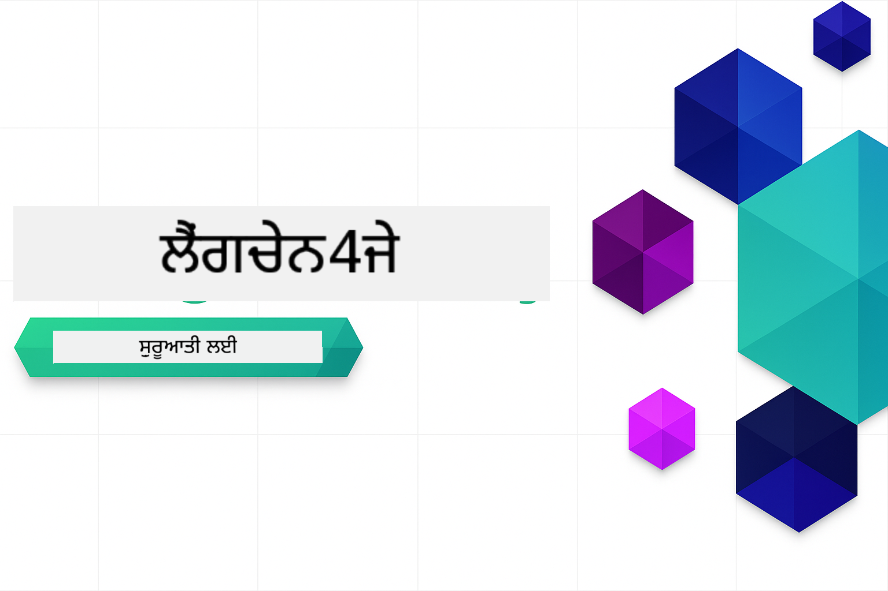

<!--
CO_OP_TRANSLATOR_METADATA:
{
  "original_hash": "d61ab6c245562094cc3dddecf08b50d3",
  "translation_date": "2025-12-30T23:18:07+00:00",
  "source_file": "README.md",
  "language_code": "pa"
}
-->


### 🌐 ਬਹੁ-ਭਾਸ਼ਾਈ ਸਮਰਥਨ

#### GitHub Action ਰਾਹੀਂ ਸਮਰਥਿਤ (ਸਵੈਚਾਲਿਤ ਅਤੇ ਹਮੇਸ਼ਾਂ ਨਵਾਂ)

<!-- CO-OP TRANSLATOR LANGUAGES TABLE START -->
[ਅਰਬੀ](../ar/README.md) | [ਬੰਗਾਲੀ](../bn/README.md) | [ਬੁਲਗੇਰੀ](../bg/README.md) | [ਬਰਮੀ (ਮਿਆਨਮਾਰ)](../my/README.md) | [ਚੀਨੀ (ਸਰਲ)](../zh/README.md) | [ਚੀਨੀ (ਰਵਾਇਤੀ, ਹਾਂਗਕਾਂਗ)](../hk/README.md) | [ਚੀਨੀ (ਰਵਾਇਤੀ, ਮਕਾਉ)](../mo/README.md) | [ਚੀਨੀ (ਰਵਾਇਤੀ, ਤਾਈਵਾਨ)](../tw/README.md) | [ਕ੍ਰੋਏਸ਼ੀਆਈ](../hr/README.md) | [ਚੈੱਕ](../cs/README.md) | [ਡੈਨਿਸ਼](../da/README.md) | [ਡੱਚ](../nl/README.md) | [ਐਸਟੋਨੀਅਨ](../et/README.md) | [ਫਿੰਨਿਸ਼](../fi/README.md) | [ਫਰਾਂਸੀਸੀ](../fr/README.md) | [ਜਰਮਨ](../de/README.md) | [ਯੂਨਾਨੀ](../el/README.md) | [ਹੀਬਰੂ](../he/README.md) | [ਹਿੰਦੀ](../hi/README.md) | [ਹੰਗੇਰੀ](../hu/README.md) | [ਇੰਡੋਨੇਸ਼ੀਆਈ](../id/README.md) | [ਇਤਾਲਵੀ](../it/README.md) | [ਜਪਾਨੀ](../ja/README.md) | [ਕੰਨੜ](../kn/README.md) | [ਕੋਰੀਅਨ](../ko/README.md) | [ਲਿਥੁਆਨੀਅਨ](../lt/README.md) | [ਮਲਯ](../ms/README.md) | [ਮਲਿਆਲਮ](../ml/README.md) | [ਮਰਾਠੀ](../mr/README.md) | [ਨੈਪਾਲੀ](../ne/README.md) | [ਨਾਈਜੀਰੀਆਈ ਪਿਡਜਿਨ](../pcm/README.md) | [ਨਾਰਵੇਜੀਆਈ](../no/README.md) | [ਫ਼ਾਰਸੀ (ਫਾਰਸੀ)](../fa/README.md) | [ਪੋਲਿਸ਼](../pl/README.md) | [ਪੁਰਤਗਾਲੀ (ਬਰਾਜ਼ੀਲ)](../br/README.md) | [ਪੁਰਤਗਾਲੀ (ਪੁਰਤਗਾਲ)](../pt/README.md) | [ਪੰਜਾਬੀ (ਗੁਰਮੁਖੀ)](./README.md) | [ਰੋਮਾਨੀਆਈ](../ro/README.md) | [ਰੂਸੀ](../ru/README.md) | [ਸਰਬੀਆਈ (ਸਿਰਿਲਿਕ)](../sr/README.md) | [ਸਲੋਵਾਕ](../sk/README.md) | [ਸਲੋਵੇਨੀਆਈ](../sl/README.md) | [ਸਪੇਨੀ](../es/README.md) | [ਸਵਾਹਿਲੀ](../sw/README.md) | [ਸਵੀਡਿਸ਼](../sv/README.md) | [ਟੈਗਾਲੋਗ (ਫਿਲੀਪੀਨੋ)](../tl/README.md) | [ਤਮੀਲ](../ta/README.md) | [ਤੈਲਗੂ](../te/README.md) | [ਥਾਈ](../th/README.md) | [ਤੁਰਕੀ](../tr/README.md) | [ਯੂਕਰੇਨੀਆਈ](../uk/README.md) | [ਉਰਦੂ](../ur/README.md) | [ਵਿਯਤਨਾਮੀ](../vi/README.md)
<!-- CO-OP TRANSLATOR LANGUAGES TABLE END -->

# LangChain4j ਸ਼ੁਰੂਆਤ ਲਈ

LangChain4j ਅਤੇ Azure OpenAI GPT-5 ਨਾਲ ਬੁਨਿਆਦੀ ਚੈਟ ਤੋਂ ਲੈ ਕੇ AI ਏਜੰਟ ਤੱਕ AI ਐਪਲੀਕੇਸ਼ਨ ਬਣਾਉਣ ਲਈ ਇੱਕ ਕੋਰਸ।

**LangChain4j ਵਿੱਚ ਨਵਾਂ?** ਮੁੱਖ ਸ਼ਬਦਾਂ ਅਤੇ ਧਾਰਣਾਵਾਂ ਦੀਆਂ ਪਰਿਭਾਸ਼ਾਵਾਂ ਲਈ [ਗਲੋਸਰੀ](docs/GLOSSARY.md) ਵੇਖੋ।

## ਵਿਸ਼ਿਆਂ ਦੀ ਸੂਚੀ

1. [ਤੁਰੰਤ ਸ਼ੁਰੂਆਤ](00-quick-start/README.md) - LangChain4j ਨਾਲ ਸ਼ੁਰੂਆਤ ਕਰੋ
2. [ਪਰਿਚਯ](01-introduction/README.md) - LangChain4j ਦੇ ਮੁਢਲੀ ਸਿਧਾਂਤ ਸਿੱਖੋ
3. [ਪ੍ਰਾਂਪਟ ਇੰਜੀਨੀਅਰਿੰਗ](02-prompt-engineering/README.md) - ਪ੍ਰਭਾਵਸ਼ਾਲੀ ਪ੍ਰਾਂਪਟ ਡਿਜ਼ਾਈਨ ਵਿੱਚ ਨਿਪੁੰਨ ਬਣੋ
4. [RAG (ਰੀਟ੍ਰੀਵਲ-ਆਗਮੈਂਟਡ ਜਨਰੇਸ਼ਨ)](03-rag/README.md) - ਹੋਸ਼ਿਆਰ ਗਿਆਨ-ਆਧਾਰਤ ਪ੍ਰਣਾਲੀਆਂ ਬਣਾਓ
5. [ਉਪਕਰਨ](04-tools/README.md) - ਬਾਹਰੀ ਉਪਕਰਨ ਅਤੇ ਸਧਾਰਣ ਸਹਾਇਕਾਂ ਨੂੰ ਏਕੀਕ੍ਰਿਤ ਕਰੋ
6. [MCP (ਮਾਡਲ ਸੰਦਰਭ ਪ੍ਰੋਟੋਕੋਲ)](05-mcp/README.md) - ਮਾਡਲ ਸੰਦਰਭ ਪ੍ਰੋਟੋਕੋਲ (MCP) ਅਤੇ ਏਜੰਟਿਕ ਮੋਡੀਊਲਾਂ ਨਾਲ ਕੰਮ ਕਰੋ
---

##  ਸਿੱਖਣ ਦਾ ਰਸਤਾ

> **ਤੁਰੰਤ ਸ਼ੁਰੂਆਤ**

1. ਇਸ ਰਿਪੋਜ਼ਟਰੀ ਨੂੰ ਆਪਣੇ GitHub ਖਾਤੇ 'ਤੇ Fork ਕਰੋ
2. Click **Code** → **Codespaces** tab → **...** → **New with options...**
3. ਡਿਫੌਲਟ ਵਰਤੋ – ਇਹ ਇਸ ਕੋਰਸ ਲਈ ਬਣਾਇਆ ਗਿਆ Development container ਚੁਣੇਗਾ
4. Click **Create codespace**
5. ਵਾਤਾਵਰਣ ਤਿਆਰ ਹੋਣ ਲਈ 5-10 ਮਿੰਟ ਦੀ ਉਡੀਕ ਕਰੋ
6. ਸਿੱਧਾ [ਤੁਰੰਤ ਸ਼ੁਰੂਆਤ](./00-quick-start/README.md) ਤੇ ਜਾ ਕੇ ਸ਼ੁਰੂ ਕਰੋ!

> **ਕੀ ਤੁਸੀਂ ਲੋਕਲ ਤੌਰ 'ਤੇ ਕਲੋਨ ਕਰਨਾ ਪਸੰਦ ਕਰੋਗੇ?**
>
> ਇਹ ਰਿਪੋਜ਼ਟਰੀ 50+ ਭਾਸ਼ਾਈ ਅਨੁਵਾਦ ਸ਼ਾਮਿਲ ਕਰਦੀ ਹੈ ਜੋ ਡਾਊਨਲੋਡ ਆਕਾਰ ਨੂੰ ਕਾਫੀ ਵਧਾ ਦਿੰਦੇ ਹਨ। ਅਨੁਵਾਦਾਂ ਤੋਂ ਬਿਨਾਂ ਕਲੋਨ ਕਰਨ ਲਈ, sparse checkout ਵਰਤੋ:
> ```bash
> git clone --filter=blob:none --sparse https://github.com/microsoft/LangChain4j-for-Beginners.git
> cd LangChain4j-for-Beginners
> git sparse-checkout set --no-cone '/*' '!translations' '!translated_images'
> ```
> ਇਹ ਤੁਹਾਨੂੰ ਕੋਰਸ ਮੁਕੰਮਲ ਕਰਨ ਲਈ ਲੋੜੀਂਦਾ ਸਭ ਕੁਝ ਇੱਕ ਬਹੁਤ ਤੇਜ਼ ਡਾਊਨਲੋਡ ਨਾਲ ਦਿੰਦਾ ਹੈ।

ਮੋਡੀਊਲਾਂ ਨੂੰ ਪੂਰਾ ਕਰਨ ਤੋਂ ਬਾਅਦ, LangChain4j ਦੀਆਂ ਟੈਸਟਿੰਗ ਧਾਰਨਾਵਾਂ ਨੂੰ ਕਾਰਜ ਵਿੱਚ ਦੇਖਣ ਲਈ [ਟੈਸਟਿੰਗ ਗਾਈਡ](docs/TESTING.md) ਦਾ ਅਧਿਐਨ ਕਰੋ।

> **ਨੋਟ:** ਇਹ ਟਰੇਨਿੰਗ ਦੋਹਾਂ GitHub Models ਅਤੇ Azure OpenAI ਦੀ ਵਰਤੋਂ ਕਰਦੀ ਹੈ। [ਤੁਰੰਤ ਸ਼ੁਰੂਆਤ](00-quick-start/README.md) ਅਤੇ [MCP](05-mcp/README.md) ਮੋਡੀਊਲ GitHub Models ਵਰਤਦੇ ਹਨ (Azure ਸਬਸਕ੍ਰਿਪਸ਼ਨ ਦੀ ਲੋੜ ਨਹੀਂ), ਜਦਕਿ ਮੋਡੀਊਲ 1-4 Azure OpenAI GPT-5 ਵਰਤਦੇ ਹਨ।

## GitHub Copilot ਨਾਲ ਸਿੱਖਣਾ

ਕੋਡਿੰਗ ਸ਼ੁਰੂ ਕਰਨ ਲਈ, ਇਸ ਪ੍ਰੋਜੈਕਟ ਨੂੰ GitHub Codespace ਜਾਂ ਪ੍ਰਦੱਤ devcontainer ਨਾਲ ਆਪਣੇ ਲੋਕਲ IDE ਵਿੱਚ ਖੋਲ੍ਹੋ। ਇਸ ਕੋਰਸ ਵਿੱਚ ਵਰਤਿਆ ਗਿਆ devcontainer GitHub Copilot ਨਾਲ AI ਜੋੜੀ ਪ੍ਰੋਗ੍ਰਾਮਿੰਗ ਲਈ ਪਹਿਲਾਂ ਤੋਂ ਸੰਰਚਿਤ ਆਉਂਦਾ ਹੈ।

ਹਰ ਕੋਡ ਉਦਾਹਰਣ ਵਿੱਚ ਸੁਝਾਏ ਗਏ ਪ੍ਰਸ਼ਨਾਂ ਸ਼ਾਮਿਲ ਹਨ ਜੋ ਤੁਸੀਂ ਆਪਣੀ ਸਮਝ ਨੂੰ ਗਹਿਰਾ ਕਰਨ ਲਈ GitHub Copilot ਨੂੰ ਪੁੱਛ ਸਕਦੇ ਹੋ। 💡/🤖 ਪ੍ਰਾਂਪਟ ਹੇਠ ਲਿਖੀਆਂ ਥਾਵਾਂ 'ਤੇ ਵੇਖੋ:

- **Java file headers** - ਹਰ ਉਦਾਹਰਣ ਲਈ ਵਿਸ਼ੇਸ਼ ਪ੍ਰਸ਼ਨ
- **Module README** - ਕੋਡ ਉਦਾਹਰਣਾਂ ਦੇ ਬਾਅਦ ਖੋਜ ਪ੍ਰਾਂਪਟ

**ਕਿਵੇਂ ਵਰਤਣਾ:** ਕਿਸੇ ਵੀ ਕੋਡ ਫਾਈਲ ਨੂੰ ਖੋਲ੍ਹੋ ਅਤੇ Copilot ਨੂੰ ਸੁਝਾਏ ਗਏ ਪ੍ਰਸ਼ਨਾਂ ਪੁੱਛੋ। ਇਸ ਕੋਡਬੇਸ ਦਾ ਪੂਰਾ ਸੰਦਰਭ ਹੈ ਅਤੇ ਇਹ ਵਿਆਖਿਆ ਕਰ ਸਕਦਾ ਹੈ, ਵਿਸਥਾਰ ਕਰ ਸਕਦਾ ਹੈ ਅਤੇ ਵਿਕਲਪ ਸੁਝਾ ਸਕਦਾ ਹੈ।

ਹੋਰ ਸਿੱਖਣਾ ਚਾਹੁੰਦੇ ਹੋ? ਵੇਖੋ [AI ਜੋੜੀ ਪ੍ਰੋਗ੍ਰਾਮਿੰਗ ਲਈ Copilot](https://aka.ms/GitHubCopilotAI).

## ਵਾਧੂ ਸਰੋਤ

<!-- CO-OP TRANSLATOR OTHER COURSES START -->
### LangChain
[](https://aka.ms/langchain4j-for-beginners)
[](https://aka.ms/langchainjs-for-beginners?WT.mc_id=m365-94501-dwahlin)

---

### Azure / Edge / MCP / ਏਜੰਟ
[](https://github.com/microsoft/AZD-for-beginners?WT.mc_id=academic-105485-koreyst)
[](https://github.com/microsoft/edgeai-for-beginners?WT.mc_id=academic-105485-koreyst)
[](https://github.com/microsoft/mcp-for-beginners?WT.mc_id=academic-105485-koreyst)
[](https://github.com/microsoft/ai-agents-for-beginners?WT.mc_id=academic-105485-koreyst)

---
 
### ਜਨਰੇਟਿਵ AI ਸੀਰੀਜ਼
[](https://github.com/microsoft/generative-ai-for-beginners?WT.mc_id=academic-105485-koreyst)
[-9333EA?style=for-the-badge&labelColor=E5E7EB&color=9333EA)](https://github.com/microsoft/Generative-AI-for-beginners-dotnet?WT.mc_id=academic-105485-koreyst)
[-C084FC?style=for-the-badge&labelColor=E5E7EB&color=C084FC)](https://github.com/microsoft/generative-ai-for-beginners-java?WT.mc_id=academic-105485-koreyst)
[-E879F9?style=for-the-badge&labelColor=E5E7EB&color=E879F9)](https://github.com/microsoft/generative-ai-with-javascript?WT.mc_id=academic-105485-koreyst)

---
 
### ਮੁੱਖ ਸਿੱਖਿਆ
[](https://aka.ms/ml-beginners?WT.mc_id=academic-105485-koreyst)
[](https://aka.ms/datascience-beginners?WT.mc_id=academic-105485-koreyst)
[](https://aka.ms/ai-beginners?WT.mc_id=academic-105485-koreyst)
[](https://github.com/microsoft/Security-101?WT.mc_id=academic-96948-sayoung)
[](https://aka.ms/webdev-beginners?WT.mc_id=academic-105485-koreyst)
[](https://aka.ms/iot-beginners?WT.mc_id=academic-105485-koreyst)
[](https://github.com/microsoft/xr-development-for-beginners?WT.mc_id=academic-105485-koreyst)

---
 
### Copilot ਸੀਰੀਜ਼
[](https://aka.ms/GitHubCopilotAI?WT.mc_id=academic-105485-koreyst)
[](https://github.com/microsoft/mastering-github-copilot-for-dotnet-csharp-developers?WT.mc_id=academic-105485-koreyst)
[](https://github.com/microsoft/CopilotAdventures?WT.mc_id=academic-105485-koreyst)
<!-- CO-OP TRANSLATOR OTHER COURSES END -->

## ਸਹਾਇਤਾ ਪ੍ਰਾਪਤ ਕਰੋ

ਜੇ ਤੁਸੀਂ ਫੱਸ ਜਾਂਦੇ ਹੋ ਜਾਂ AI ਐਪਸ ਬਣਾਉਣ ਬਾਰੇ ਤੁਹਾਡੇ ਕੋਲ ਕੋਈ ਪ੍ਰਸ਼ਨ ਹਨ, ਤਾਂ ਜੁੜੋ:

[](https://aka.ms/foundry/discord)

ਜੇ ਤੁਹਾਡੇ ਕੋਲ ਉਤਪਾਦ ਸੰਬੰਧੀ ਫੀਡਬੈਕ ਹੈ ਜਾਂ ਨਿਰਮਾਣ ਦੌਰਾਨ ਕੋਈ ਗਲਤੀਆਂ ਆਉਂਦੀਆਂ ਹਨ, ਤਾਂ ਜਾਓ:

[](https://aka.ms/foundry/forum)

## ਲਾਇਸੰਸ

MIT ਲਾਇਸੰਸ - ਵੇਰਵਿਆਂ ਲਈ [LICENSE](../../LICENSE) ਫਾਈਲ ਵੇਖੋ.

---

<!-- CO-OP TRANSLATOR DISCLAIMER START -->
ਅਸਵੀਕਾਰ (Disclaimer):
ਇਸ ਦਸਤਾਵੇਜ਼ ਦਾ ਅਨੁਵਾਦ AI ਅਨੁਵਾਦ ਸੇਵਾ [Co-op Translator](https://github.com/Azure/co-op-translator) ਦੀ ਵਰਤੋਂ ਕਰਕੇ ਕੀਤਾ ਗਿਆ ਹੈ। ਅਸੀਂ ਸ਼ੁੱਧਤਾ ਲਈ ਕੋਸ਼ਿਸ਼ ਕਰਦੇ ਹਾਂ, ਪਰ ਕਿਰਪਾ ਕਰਕੇ ਧਿਆਨ ਰੱਖੋ ਕਿ ਆਟੋਮੈਟਿਕ ਅਨੁਵਾਦਾਂ ਵਿੱਚ ਗਲਤੀਆਂ ਜਾਂ ਅਸਥਿਰਤਾਵਾਂ ਹੋ ਸਕਦੀਆਂ ਹਨ। ਮੂਲ ਭਾਸ਼ਾ ਵਿੱਚ ਦਿੱਤਾ ਗਿਆ ਦਸਤਾਵੇਜ਼ ਅਧਿਕਾਰਕ ਸਰੋਤ ਮੰਨਿਆ ਜਾਣਾ ਚਾਹੀਦਾ ਹੈ। ਮਹੱਤਵਪੂਰਨ ਜਾਣਕਾਰੀ ਲਈ, ਪੇਸ਼ੇਵਰ ਮਨੁੱਖੀ ਅਨੁਵਾਦ ਦੀ ਸਿਫ਼ਾਰਿਸ਼ ਕੀਤੀ ਜਾਂਦੀ ਹੈ। ਅਸੀਂ ਇਸ ਅਨੁਵਾਦ ਦੀ ਵਰਤੋਂ ਤੋਂ ਉਤਪੰਨ ਹੋਣ ਵਾਲੀਆਂ ਕਿਸੇ ਵੀ ਗਲਤ ਫਹਿਮੀਆਂ ਜਾਂ ਗਲਤ ਵਿਆਖਿਆਵਾਂ ਲਈ ਜ਼ਿੰਮੇਵਾਰ ਨਹੀਂ ਹਾਂ।
<!-- CO-OP TRANSLATOR DISCLAIMER END -->