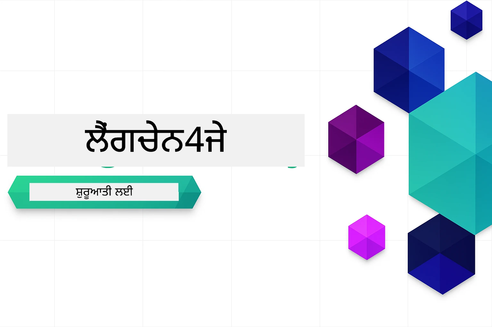

# ਸ਼ੁਰੂਆਤੀ ਲਈ LangChain4j

LangChain4j ਅਤੇ Azure OpenAI GPT-5.2 ਨਾਲ AI ਐਪਲੀਕੇਸ਼ਨ ਬਣਾਉਣ ਲਈ ਇੱਕ ਕੋਰਸ, ਬੇਸਿਕ ਚੈਟ ਤੋਂ ਲੈ ਕੇ AI ਏਜੰਟ ਤੱਕ।

### 🌐 ਬਹੁਭਾਸ਼ੀ ਸਹਿਯੋਗ

#### GitHub ਐਕਸ਼ਨ ਰਾਹੀਂ ਸਮਰਥਿਤ (ਸਵੈਚਾਲਿਤ ਅਤੇ ਹਮੇਸ਼ਾ ਅਪ-ਟੂ-ਡੇਟ)

<!-- CO-OP TRANSLATOR LANGUAGES TABLE START -->
[Arabic](../ar/README.md) | [Bengali](../bn/README.md) | [Bulgarian](../bg/README.md) | [Burmese (Myanmar)](../my/README.md) | [Chinese (Simplified)](../zh-CN/README.md) | [Chinese (Traditional, Hong Kong)](../zh-HK/README.md) | [Chinese (Traditional, Macau)](../zh-MO/README.md) | [Chinese (Traditional, Taiwan)](../zh-TW/README.md) | [Croatian](../hr/README.md) | [Czech](../cs/README.md) | [Danish](../da/README.md) | [Dutch](../nl/README.md) | [Estonian](../et/README.md) | [Finnish](../fi/README.md) | [French](../fr/README.md) | [German](../de/README.md) | [Greek](../el/README.md) | [Hebrew](../he/README.md) | [Hindi](../hi/README.md) | [Hungarian](../hu/README.md) | [Indonesian](../id/README.md) | [Italian](../it/README.md) | [Japanese](../ja/README.md) | [Kannada](../kn/README.md) | [Khmer](../km/README.md) | [Korean](../ko/README.md) | [Lithuanian](../lt/README.md) | [Malay](../ms/README.md) | [Malayalam](../ml/README.md) | [Marathi](../mr/README.md) | [Nepali](../ne/README.md) | [Nigerian Pidgin](../pcm/README.md) | [Norwegian](../no/README.md) | [Persian (Farsi)](../fa/README.md) | [Polish](../pl/README.md) | [Portuguese (Brazil)](../pt-BR/README.md) | [Portuguese (Portugal)](../pt-PT/README.md) | [Punjabi (Gurmukhi)](./README.md) | [Romanian](../ro/README.md) | [Russian](../ru/README.md) | [Serbian (Cyrillic)](../sr/README.md) | [Slovak](../sk/README.md) | [Slovenian](../sl/README.md) | [Spanish](../es/README.md) | [Swahili](../sw/README.md) | [Swedish](../sv/README.md) | [Tagalog (Filipino)](../tl/README.md) | [Tamil](../ta/README.md) | [Telugu](../te/README.md) | [Thai](../th/README.md) | [Turkish](../tr/README.md) | [Ukrainian](../uk/README.md) | [Urdu](../ur/README.md) | [Vietnamese](../vi/README.md)

> **ਸਥਾਨਕ ਕਲੋਨ ਕਰਨਾ ਪਸੰਦ ਕਰੋ?**
>
> ਇਸ ਰਿਪੋਜ਼ਟਰੀ ਵਿੱਚ 50+ ਭਾਸ਼ਾ ਅਨੁਵਾਦ ਸ਼ਾਮਲ ਹਨ ਜੋ ਡਾਊਨਲੋਡ ਦਾ ਆਕਾਰ ਕਾਫੀ ਵਧਾ ਦਿੰਦੇ ਹਨ। ਅਨੁਵਾਦਾਂ ਤੋਂ ਬਿਨਾਂ ਕਲੋਨ ਕਰਨ ਲਈ sparse checkout ਵਰਤੋ:
>
> **Bash / macOS / Linux:**
> ```bash
> git clone --filter=blob:none --sparse https://github.com/microsoft/LangChain4j-for-Beginners.git
> cd LangChain4j-for-Beginners
> git sparse-checkout set --no-cone '/*' '!translations' '!translated_images'
> ```
>
> **CMD (Windows):**
> ```cmd
> git clone --filter=blob:none --sparse https://github.com/microsoft/LangChain4j-for-Beginners.git
> cd LangChain4j-for-Beginners
> git sparse-checkout set --no-cone "/*" "!translations" "!translated_images"
> ```
>
> ਇਹ ਤੁਹਾਨੂੰ ਕੋਰਸ ਪੂਰਾ ਕਰਨ ਲਈ ਸਭ ਕੁਝ ਦੇਵੇਗਾ ਬਹੁਤ ਤੇਜ਼ ਡਾਊਨਲੋਡ ਨਾਲ।
<!-- CO-OP TRANSLATOR LANGUAGES TABLE END -->

## ਸੂਚੀ ਸਿਰਲੇਖ

1. [ਰੂਪਰੇਖਾ](01-introduction/README.md) - LangChain4j ਦੇ ਮੂਲ ਸਿਖੋ
2. [ਪ੍ਰੋਮਪਟ ਇੰਜੀਨੀਅਰਿੰਗ](02-prompt-engineering/README.md) - ਪ੍ਰਭਾਵਸ਼ਾਲੀ ਪ੍ਰੋਮਪਟ ਡਿਜ਼ਾਈਨ ਮਾਹਰ ਬਣੋ
3. [RAG (ਰਿਕਵਲੀਉਲ-ਅਗਮੈਂਟਡ ਜਨੇਰੇਸ਼ਨ)](03-rag/README.md) - ਸਮਾਰਟ ਗਿਆਨ ਅਧਾਰਿਤ ਪ੍ਰਣਾਲੀਆਂ ਬਣਾਓ
4. [ਟੂਲ](04-tools/README.md) - ਬਾਹਰੀ ਯੰਤਰਾਂ ਅਤੇ ਸਾਦਾ ਸਹਾਇਕਾਂ ਨੂੰ ਜੋੜੋ
5. [MCP (ਮਾਡਲ ਸੰਦਰਭ ਪ੍ਰੋਟੋਕੋਲ)](05-mcp/README.md) - ਮਾਡਲ ਸੰਦਰਭ ਪ੍ਰੋਟੋਕੋਲ (MCP) ਅਤੇ ਏਜੈਂਟਿਕ ਮਾਡਿਊਲ ਨਾਲ ਕੰਮ ਕਰੋ

### ਵੀਡੀਓ ਵਾਕਥਰੂਜ਼

ਹਰ ਮਾਡਿਊਲ ਦਾ ਇੱਕ ਸਾਥੀ ਲਾਈਵ ਸੈਸ਼ਨ ਹੁੰਦਾ ਹੈ ਜਿੱਥੇ ਅਸੀਂ ਤੱਤਾਂ ਅਤੇ ਕੋਡ ਨੂੰ ਕਦਮ ਦਰ ਕਦਮ ਸਮਝਾਉਂਦੇ ਹਾਂ।

| ਮਾਡਿਊਲ | ਵੀਡੀਓ |
|--------|-------|
| 01 - ਰੂਪਰੇਖਾ | [LangChain4j ਨਾਲ ਸ਼ੁਰੂਆਤ](https://www.youtube.com/live/nl_troDm8rQ) |
| 02 - ਪ੍ਰੋਮਪਟ ਇੰਜੀਨੀਅਰਿੰਗ | [LangChain4j ਨਾਲ ਪ੍ਰੋਮਪਟ ਇੰਜੀਨੀਅਰਿੰਗ](https://www.youtube.com/live/PJ6aBaE6bog) |
| 03 - RAG | [LangChain4j ਨਾਲ RAG](https://www.youtube.com/watch?v=_olq75ZH_eY) |
| 04 - ਟੂਲ ਅਤੇ 05 - MCP | [ਟੂਲ ਅਤੇ MCP ਨਾਲ AI ਏਜੰਟ](https://www.youtube.com/watch?v=O_J30kZc0rw) |

---

## ਸਿੱਖਣ ਦਾ ਰਸਤਾ

**LangChain4j ਵਿੱਚ ਨਵਾਂ ਹੋ?** ਮੁੱਖ ਸ਼ਬਦਾਂ ਅਤੇ ਵਿਚਾਰਾਂ ਲਈ [ਸ਼ਬਦਾਵਲੀ](docs/GLOSSARY.md) ਵੇਖੋ।

> **ਤੁਰੰਤ ਸ਼ੁਰੂਆਤ**

1. ਇਸ ਰਿਪੋਜ਼ਟਰੀ ਨੂੰ ਆਪਣੇ GitHub ਖਾਤੇ 'ਤੇ ਫੋਰਕ ਕਰੋ
2. **Code** → **Codespaces** ਟੈਬ → **...** → **ਨਵਾਂ ਵਿਕਲਪਾਂ ਨਾਲ...** ’ਤੇ ਕਲਿੱਕ ਕਰੋ
3. ਡਿਫੌਲਟ ਵਰਤੋਂ – ਇਹ ਕੋਰਸ ਲਈ ਬਣਾਏ ਗਏ ਵਿਕਾਸ ਕੰਟੇਨਰ ਦੀ ਚੋਣ ਕਰੇਗਾ
4. **ਕੋਡਸਪੇਸ ਬਣਾਓ** ’ਤੇ ਕਲਿੱਕ ਕਰੋ
5. ਵਾਤਾਵਰਣ ਤਿਆਰ ਹੋਣ ਲਈ 5-10 ਮਿੰਟ ਉਡੀਕ ਕਰੋ
6. ਸ਼ੁਰੂਆਤ ਲਈ ਸਿੱਧਾ [ਰੂਪਰੇਖਾ](./01-introduction/README.md) 'ਤੇ ਜਾਓ!

ਮਾਡਿਊਲ ਪੂਰੇ ਕਰਨ ਤੋਂ ਬਾਅਦ, LangChain4j ਟੈਸਟਿੰਗ ਸੰਕਲਪਾਂ ਦੇਖਣ ਲਈ [ਟੈਸਟਿੰਗ ਗਾਈਡ](docs/TESTING.md) ਦੀ ਜਾਂਚ ਕਰੋ।

> **ਨੋਟ:** ਇਹ ਪ੍ਰਸ਼ਿਖਣ Azure OpenAI ਵਰਤਦਾ ਹੈ। ਜੇ ਤੁਹਾਡੇ ਕੋਲ ਨਵਾਂ ਖਾਤਾ ਨਹੀਂ ਹੈ ਤਾਂ [ਮੁਫਤ Azure ਖਾਤਾ](https://aka.ms/azure-free-account) ਦਿਵਾਇਆ ਜਾ ਸਕਦਾ ਹੈ।


## GitHub Copilot ਨਾਲ ਸਿੱਖਣਾ

ਤੇਜ਼ੀ ਨਾਲ ਕੋਡਿੰਗ ਸ਼ੁਰੂ ਕਰਨ ਲਈ, ਇਸ ਪ੍ਰੋਜੈਕਟ ਨੂੰ GitHub Codespace ਜਾਂ ਆਪਣੇ ਸਥਾਨਕ IDE ਵਿੱਚ ਪ੍ਰਦਾਨ ਕੀਤੇ ਗਏ devcontainer ਨਾਲ ਖੋਲ੍ਹੋ। ਇਸ ਕੋਰਸ ਵਿਚ ਵਰਤਿਆ ਗਿਆ devcontainer GitHub Copilot ਨਾਲ ਪੂਰਵ-ਕੰਫਿਗਰਡ ਹੈ ਜੋ AI ਜੋੜੀ ਪ੍ਰੋਗ੍ਰਾਮਿੰਗ ਲਈ ਹੈ।

ਹਰ ਕੋਡ ਉਦਾਹਰਨ ਵਿੱਚ GitHub Copilot ਨੂੰ ਪੁੱਛ ਸਕਦੇ ਪ੍ਰਸਤਾਵਿਤ ਸਵਾਲ ਸ਼ਾਮਲ ਹਨ ਤਾਂ ਜੋ ਤੁਸੀਂ ਆਪਣੀ ਸਮਝ ਨੂੰ ਵਧਾ ਸਕੋ। ટીਪਾਂ ਲਈ 💡/🤖 ਨੂੰ ਵੇਖੋ:

- **Java ਫਾਇਲ ਹੈਡਰ** - ਹਰ ਉਦਾਹਰਨ ਲਈ ਵਿਸ਼ੇਸ਼ ਸਵਾਲ
- **ਮਾਡਿਊਲ README** - ਕੋਡ ਉਦਾਹਰਨਾਂ ਬਾਅਦ ਖੋਜਣ ਵਾਲੇ ਪ੍ਰਸ਼ਨ

**ਕਿਵੇਂ ਵਰਤਣਾ ਹੈ:** ਕੋਈ ਵੀ ਕੋਡ ਫਾਇਲ ਖੋਲ੍ਹੋ ਅਤੇ Copilot ਨੂੰ ਪ੍ਰਸਤਾਵਿਤ ਸਵਾਲ ਪੁੱਛੋ। ਇਹ ਕੋਡਬੇਸ ਦਾ ਪੂਰਾ ਸੰਦਰਭ ਜਾਣਦਾ ਹੈ ਅਤੇ ਵਿਆਖਿਆ ਕਰ ਸਕਦਾ ਹੈ, ਵਧਾ ਸਕਦਾ ਹੈ, ਅਤੇ ਵਿਕਲਪ ਸੁਝਾ ਸਕਦਾ ਹੈ।

ਹੋਰ ਸਿੱਖਣਾ ਚਾਹੁੰਦੇ ਹੋ? [AI ਜੋੜੀ ਪ੍ਰੋਗ੍ਰਾਮਿੰਗ ਲਈ Copilot](https://aka.ms/GitHubCopilotAI) ਵੇਖੋ।


## ਵਾਤਾਵਰਣ ਸਮੱਗਰੀ

<!-- CO-OP TRANSLATOR OTHER COURSES START -->
### LangChain
[](https://aka.ms/langchain4j-for-beginners)
[](https://aka.ms/langchainjs-for-beginners?WT.mc_id=m365-94501-dwahlin)
[](https://github.com/microsoft/langchain-for-beginners?WT.mc_id=m365-94501-dwahlin)
---

### Azure / Edge / MCP / Agents
[](https://github.com/microsoft/AZD-for-beginners?WT.mc_id=academic-105485-koreyst)
[](https://github.com/microsoft/edgeai-for-beginners?WT.mc_id=academic-105485-koreyst)
[](https://github.com/microsoft/mcp-for-beginners?WT.mc_id=academic-105485-koreyst)
[](https://github.com/microsoft/ai-agents-for-beginners?WT.mc_id=academic-105485-koreyst)

---
 
### Generative AI Series
[](https://github.com/microsoft/generative-ai-for-beginners?WT.mc_id=academic-105485-koreyst)
[-9333EA?style=for-the-badge&labelColor=E5E7EB&color=9333EA)](https://github.com/microsoft/Generative-AI-for-beginners-dotnet?WT.mc_id=academic-105485-koreyst)
[-C084FC?style=for-the-badge&labelColor=E5E7EB&color=C084FC)](https://github.com/microsoft/generative-ai-for-beginners-java?WT.mc_id=academic-105485-koreyst)
[-E879F9?style=for-the-badge&labelColor=E5E7EB&color=E879F9)](https://github.com/microsoft/generative-ai-with-javascript?WT.mc_id=academic-105485-koreyst)

---
 
### ਕੋਰ ਸਿੱਖਿਆ
[](https://aka.ms/ml-beginners?WT.mc_id=academic-105485-koreyst)
[](https://aka.ms/datascience-beginners?WT.mc_id=academic-105485-koreyst)
[](https://aka.ms/ai-beginners?WT.mc_id=academic-105485-koreyst)
[](https://github.com/microsoft/Security-101?WT.mc_id=academic-96948-sayoung)

[](https://aka.ms/webdev-beginners?WT.mc_id=academic-105485-koreyst)
[](https://aka.ms/iot-beginners?WT.mc_id=academic-105485-koreyst)
[](https://github.com/microsoft/xr-development-for-beginners?WT.mc_id=academic-105485-koreyst)

---
 
### ਕੋਪਾਇਲਟ ਸੀਰੀਜ਼
[](https://aka.ms/GitHubCopilotAI?WT.mc_id=academic-105485-koreyst)
[](https://github.com/microsoft/mastering-github-copilot-for-dotnet-csharp-developers?WT.mc_id=academic-105485-koreyst)
[](https://github.com/microsoft/CopilotAdventures?WT.mc_id=academic-105485-koreyst)
<!-- CO-OP TRANSLATOR OTHER COURSES END -->

## ਮਦਦ ਲੈਣਾ

ਜੇ ਤੁਸੀਂ ਅਟਕ ਜਾਂਦੇ ਹੋ ਜਾਂ AI ਐਪਸ ਬਣਾਉਣ ਬਾਰੇ ਕੋਈ ਸਵਾਲ ਹੈ, ਤਾਂ ਜੁੜੋ:

[](https://aka.ms/foundry/discord)

ਜੇ ਤੁਹਾਡੇ ਕੋਲ ਉਤਪਾਦ ਬਾਰੇ ਫੀਡਬੈਕ ਹੈ ਜਾਂ ਬਣਾਉਣ ਸਮੇਂ ਕੋਈ ਗਲਤੀ ਆਈ ਹੈ ਤਾਂ ਦੌਰਾ ਕਰੋ:

[](https://aka.ms/foundry/forum)

## ਲਾਇਸੈਂਸ

MIT ਲਾਇਸੈਂਸ - ਵੇਰਵੇ ਲਈ [LICENSE](../../LICENSE) ਫਾਈਲ ਦੇਖੋ।

---

<!-- CO-OP TRANSLATOR DISCLAIMER START -->
**ਅਸਵੀਕਾਰੋਪਣ**:
ਇਸ ਦਸਤਾਵੇਜ਼ ਦਾ ਅਨੁਵਾਦ ਏਆਈ ਅਨੁਵਾਦ ਸੇਵਾ [Co-op Translator](https://github.com/Azure/co-op-translator) ਦੀ ਵਰਤੋਂ ਕਰਕੇ ਕੀਤਾ ਗਿਆ ਹੈ। ਜਦੋਂ ਕਿ ਅਸੀਂ ਸਹੀਤਾਵਾਂ ਲਈ ਯਤਨਸ਼ੀਲ ਹਾਂ, ਕਿਰਪਾ ਕਰਕੇ ਧਿਆਨ ਰੱਖੋ ਕਿ ਸਵੈਚਾਲਿਤ ਅਨੁਵਾਦਾਂ ਵਿੱਚ ਗਲਤੀਆਂ ਜਾਂ ਅਸਮੱਤਿਆਵਾਂ ਹੋ ਸਕਦੀਆਂ ਹਨ। ਮੂਲ ਦਸਤਾਵੇਜ਼ ਆਪਣੀ ਮੂਲ ਭਾਸ਼ਾ ਵਿੱਚ ਅਧਿਕਾਰਕ ਸਰੋਤ ਮੰਨਿਆ ਜਾਣਾ ਚਾਹੀਦਾ ਹੈ। ਜਰੂਰੀ ਜਾਣਕਾਰੀ ਲਈ, ਪੇਸ਼ੇਵਰ ਮਨੁੱਖੀ ਅਨੁਵਾਦ ਦੀ ਸਿਫ਼ਾਰਸ਼ ਕੀਤੀ ਜਾਂਦੀ ਹੈ। ਅਸੀਂ ਇਸ ਅਨੁਵਾਦ ਦੇ ਉਪਯੋਗ ਤੋਂ ਪੈਦਾ ਹੋਣ ਵਾਲੀਆਂ ਕਿਸੇ ਵੀ ਗਲਤਫਹਿਮੀਆਂ ਜਾਂ ਗਲਤ ਵਿਆਖਿਆਵਾਂ ਲਈ ਜਵਾਬਦੇਹ ਨਹੀਂ ਹਾਂ।
<!-- CO-OP TRANSLATOR DISCLAIMER END -->