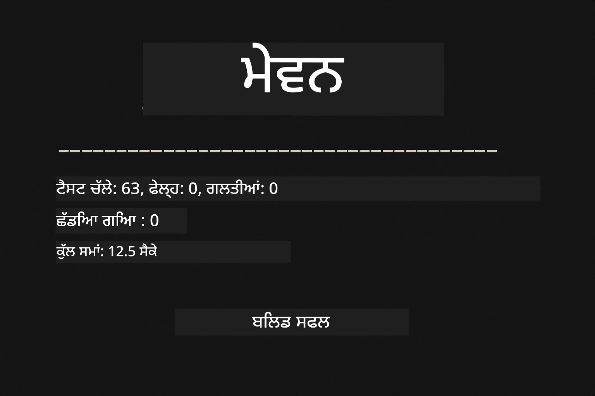
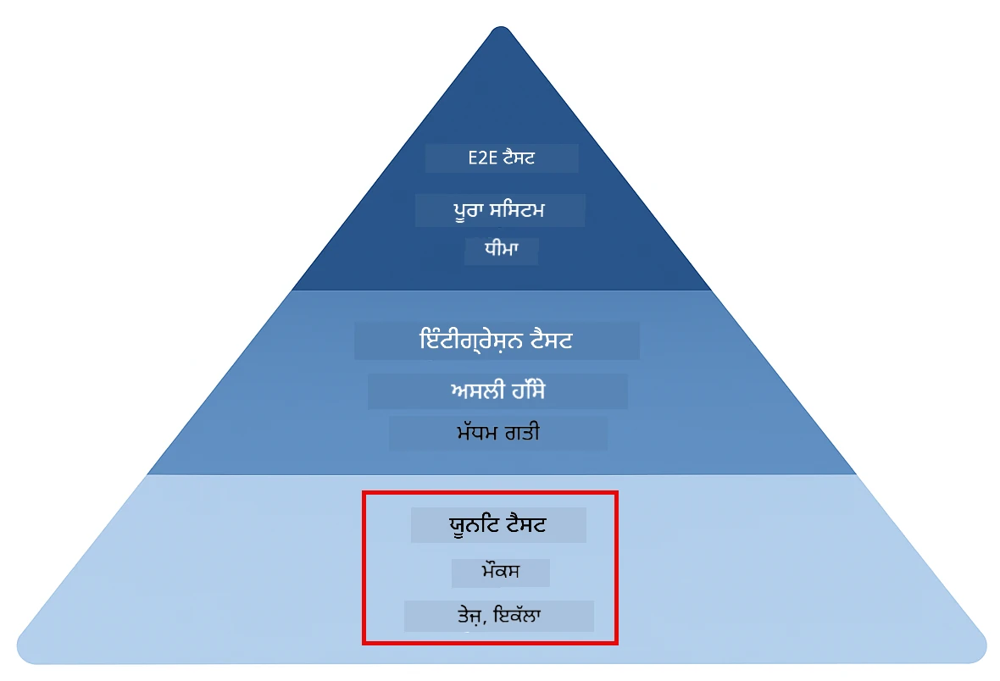
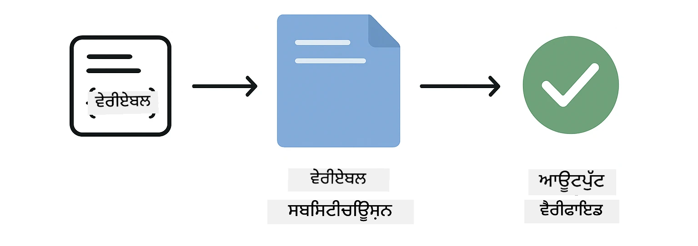
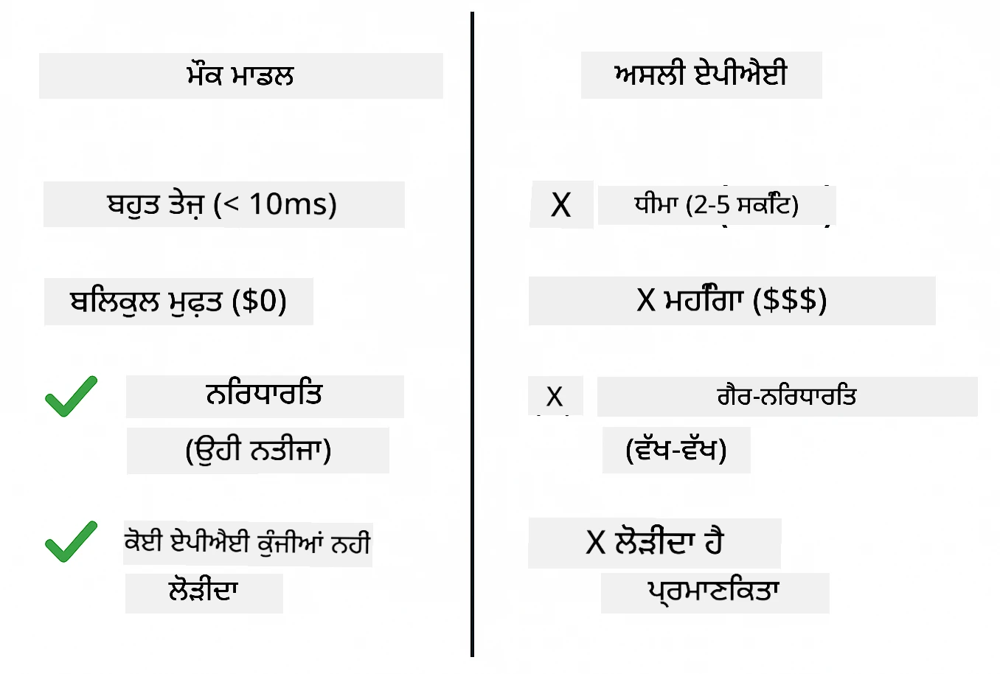
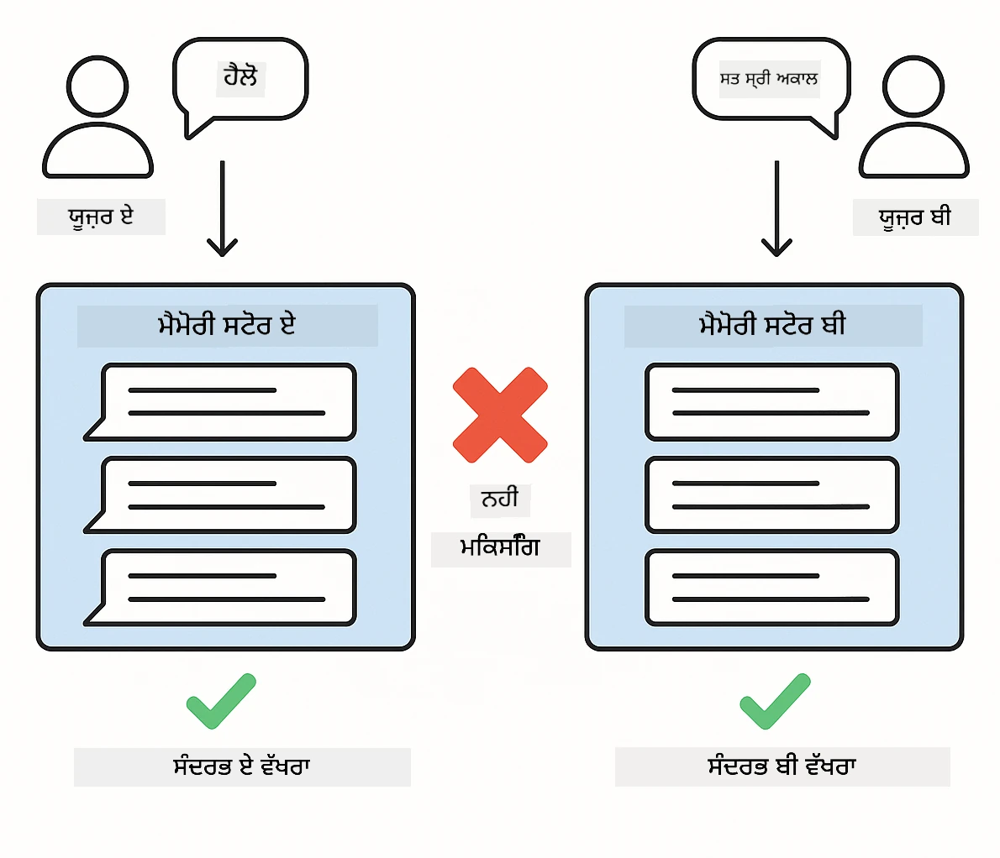
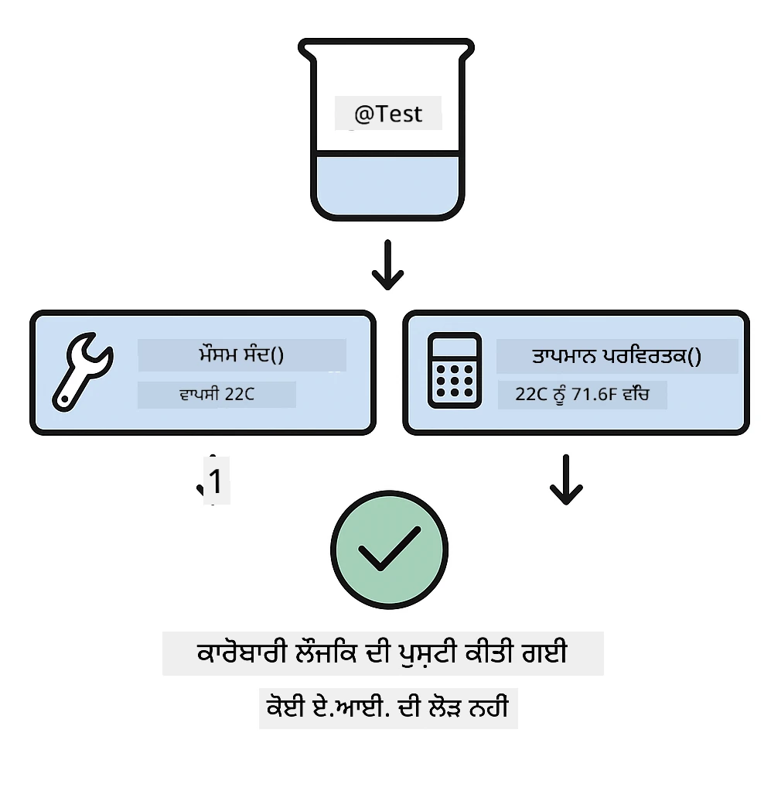
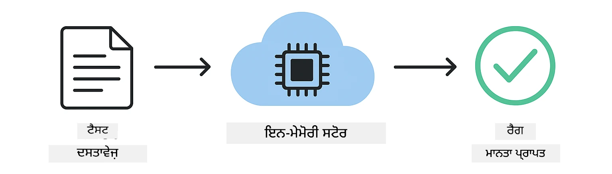

<!--
CO_OP_TRANSLATOR_METADATA:
{
  "original_hash": "ed93b3c14d58734ac10162967da958c1",
  "translation_date": "2025-12-30T23:33:28+00:00",
  "source_file": "docs/TESTING.md",
  "language_code": "pa"
}
-->
# LangChain4j ਐਪਲੀਕੇਸ਼ਨਾਂ ਦੀ ਟੈਸਟਿੰਗ

## ਸੂਚੀ

- [ਤੁਰੰਤ ਸ਼ੁਰੂਆਤ](../../../docs)
- [ਟੈਸਟ ਕੀ-ਕੀ ਕਵਰ ਕਰਦੇ ਹਨ](../../../docs)
- [ਟੈਸਟ ਚਲਾਉਣਾ](../../../docs)
- [VS Code ਵਿੱਚ ਟੈਸਟ ਚਲਾਉਣਾ](../../../docs)
- [ਟੈਸਟਿੰਗ ਪੈਟਰਨ](../../../docs)
- [ਟੈਸਟਿੰਗ ਫਿਲਾਸਫੀ](../../../docs)
- [ਅਗਲੇ ਕਦਮ](../../../docs)

ਇਹ ਮਾਰਗਦਰਸ਼ਿਕ ਤੁਹਾਨੂੰ ਉਹ ਟੈਸਟ ਦਿਖਾਉਂਦੀ ਹੈ ਜੋ ਇਹ ਦਰਸਾਉਂਦੇ ਹਨ ਕਿ AI ਐਪਲੀਕੇਸ਼ਨਾਂ ਦੀ ਟੈਸਟਿੰਗ ਕਿਵੇਂ ਕੀਤੀ ਜਾਵੇ, ਬਿਨਾਂ API ਕੀਜ਼ ਜਾਂ ਕਿਸੇ ਬਾਹਰੀ ਸੇਵਾ ਦੀ ਲੋੜ ਦੇ।

## ਤੁਰੰਤ ਸ਼ੁਰੂਆਤ

ਰੂਟ ਤੋਂ ਸਾਰੇ ਟੈਸਟ ਇੱਕ ਹੀ ਕਮਾਂਡ ਨਾਲ ਚਲਾਓ:

**Bash:**
```bash
mvn test
```

**PowerShell:**
```powershell
mvn --% test
```



*ਸਾਰੇ ਟੈਸਟ ਪਾਸ ਹੋਣ ਨਾਲ ਸ਼ੂਨ੍ਯ ਫੇਲਿਓਰ ਦਰਸਾਉਂਦਾ ਸਫਲ ਟੈਸਟ ਚਲਾਉਣਾ*

## ਟੈਸਟ ਕੀ-ਕੀ ਕਵਰ ਕਰਦੇ ਹਨ

ਇਹ ਕੋਰਸ ਉਹਨਾਂ **ਯੂਨਿਟ ਟੈਸਟਾਂ** 'ਤੇ ਕੇਂਦ੍ਰਿਤ ਹੈ ਜੋ ਸਥਾਨਕ ਤੌਰ 'ਤੇ ਚਲਦੀਆਂ ਹਨ। ਹਰ ਟੈਸਟ ਇੱਕ ਨਿਰਾਲੀ LangChain4j ਧਾਰਨਾ ਨੂੰ ਅਲੱਗ ਤੌਰ 'ਤੇ ਦਰਸਾਉਂਦਾ ਹੈ।



*ਟੈਸਟਿੰਗ ਪਿਰਾਮਿਡ ਜਿਸ ਵਿੱਚ ਯੂਨਿਟ ਟੈਸਟ (ਤੇਜ਼, ਅਲੱਗ), ਇਨਟੀਿਗ੍ਰੇਸ਼ਨ ਟੈਸਟ (ਅਸਲ ਕੰਪੋਨੈਂਟ) ਅਤੇ ਏਂਡ-ਟੂ-ਏਂਡ ਟੈਸਟ ਵਿੱਚ ਸਤੁਲਤਾ ਦਿਖਾਈ ਗਈ ਹੈ। ਇਹ ਪ੍ਰਸ਼িক্ষਣ ਯੂਨਿਟ ਟੈਸਟਿੰਗ ਨੂੰ ਕਵਰ ਕਰਦਾ ਹੈ।*

| ਮੋਡੀਊਲ | ਟੈਸਟਾਂ | ਧਿਆਨ | ਮੁੱਖ ਫਾਈਲਾਂ |
|--------|-------|-------|-----------|
| **00 - ਤੁਰੰਤ ਸ਼ੁਰੂਆਤ** | 6 | ਪ੍ਰੋੰਪਟ ਟੈਮਪਲੇਟ ਅਤੇ ਵੇਰੀਏਬਲ ਬਦਲਾਅ | `SimpleQuickStartTest.java` |
| **01 - ਪਰਿਚਯ** | 8 | ਗੱਲਬਾਤ ਯਾਦਦਾਸ਼ਤ ਅਤੇ ਸਟੇਟਫੁਲ ਚੈਟ | `SimpleConversationTest.java` |
| **02 - ਪ੍ਰੋੰਪਟ ਇੰਜੀਨੀਅਰਿੰਗ** | 12 | GPT-5 ਪੈਟਰਨ, ਉਤਸਾਹ ਪੱਧਰ, ਢਾਂਚਾਬੱਧ ਆਉਟਪੁੱਟ | `SimpleGpt5PromptTest.java` |
| **03 - RAG** | 10 | ਦਸਤਾਵੇਜ਼ ਇਨਗੈਸ਼ਨ, ਐਂਬੇਡਿੰਗਜ਼, ਸਮਾਨਤਾ ਖੋਜ | `DocumentServiceTest.java` |
| **04 - ਟੂਲਜ਼** | 12 | ਫੰਕਸ਼ਨ ਕਾਲਿੰਗ ਅਤੇ ਟੂਲ ਚੇਨਿੰਗ | `SimpleToolsTest.java` |
| **05 - MCP** | 8 | Model Context Protocol with Stdio transport | `SimpleMcpTest.java` |

## ਟੈਸਟ ਚਲਾਉਣਾ

**ਰੂਟ ਤੋਂ ਸਾਰੇ ਟੈਸਟ ਚਲਾਓ:**

**Bash:**
```bash
mvn test
```

**PowerShell:**
```powershell
mvn --% test
```

**ਕਿਸੇ ਵਿਸ਼ੇਸ਼ ਮੋਡੀਊਲ ਲਈ ਟੈਸਟ ਚਲਾਓ:**

**Bash:**
```bash
cd 01-introduction && mvn test
# ਜਾਂ ਰੂਟ ਤੋਂ
mvn test -pl 01-introduction
```

**PowerShell:**
```powershell
cd 01-introduction; mvn --% test
# ਜਾਂ ਰੂਟ ਤੋਂ
mvn --% test -pl 01-introduction
```

**ਇੱਕ ਹੀ ਟੈਸਟ ਕਲਾਸ ਚਲਾਓ:**

**Bash:**
```bash
mvn test -Dtest=SimpleConversationTest
```

**PowerShell:**
```powershell
mvn --% test -Dtest=SimpleConversationTest
```

**ਕਿਸੇ ਖਾਸ ਟੈਸਟ ਮੈਥਡ ਚਲਾਓ:**

**Bash:**
```bash
mvn test -Dtest=SimpleConversationTest#ਗੱਲਬਾਤ ਦਾ ਇਤਿਹਾਸ ਸੰਭਾਲਣਾ ਚਾਹੀਦਾ ਹੈ
```

**PowerShell:**
```powershell
mvn --% test -Dtest=SimpleConversationTest#ਗੱਲਬਾਤ ਦਾ ਇਤਿਹਾਸ ਰੱਖਣਾ ਚਾਹੀਦਾ ਹੈ
```

## VS Code ਵਿੱਚ ਟੈਸਟ ਚਲਾਉਣਾ

ਜੇ ਤੁਸੀਂ Visual Studio Code ਵਰਤ ਰਹੇ ਹੋ, ਤਾਂ Test Explorer ਟੈਸਟਾਂ ਨੂੰ ਚਲਾਉਣ ਅਤੇ ਡੀਬੱਗ ਕਰਨ ਲਈ ਗ੍ਰਾਫਿਕਲ ਇੰਟਰਫੇਸ ਪ੍ਰਦਾਨ ਕਰਦਾ ਹੈ।


*VS Code Test Explorer ਟੈਸਟ ਟ੍ਰੀ ਦਿਖਾ ਰਿਹਾ ਹੈ ਜਿਸ ਵਿੱਚ ਸਾਰੀਆਂ Java ਟੈਸਟ ਕਲਾਸਾਂ ਅਤੇ ਵਿਅਕਤੀਗਤ ਟੈਸਟ ਮੈਥਡ ਹਨ*

**VS Code ਵਿੱਚ ਟੈਸਟ ਚਲਾਉਣ ਲਈ:**

1. ਐਕਟਿਵਿਟੀ ਬਾਰ ਵਿੱਚ ਬੀਕਰ ਆਈਕਨ 'ਤੇ ਕਲਿੱਕ ਕਰਕੇ Test Explorer ਖੋਲ੍ਹੋ
2. ਸਾਰੇ ਮੋਡੀਊਲ ਅਤੇ ਟੈਸਟ ਕਲਾਸਾਂ ਵੇਖਣ ਲਈ ਟੈਸਟ ਟ੍ਰੀ ਨੂੰ ਵਧਾਓ
3. ਕਿਸੇ ਵੀ ਟੈਸਟ ਦੇ ਕੋਲ ਪਲੇ ਬਟਨ 'ਤੇ ਕਲਿੱਕ ਕਰਕੇ ਉਸਨੂੰ ਅਲੱਗ ਤੌਰ 'ਤੇ ਚਲਾਓ
4. ਸਾਰੀ ਸੁਈਟ ਚਲਾਉਣ ਲਈ "Run All Tests" 'ਤੇ ਕਲਿੱਕ ਕਰੋ
5. ਕਿਸੇ ਵੀ ਟੈਸਟ 'ਤੇ ਰਾਈਟ-ਕਲਿੱਕ ਕਰਕੇ "Debug Test" ਚੁਣੋ ਤਾਂ ਜੋ ਤੁਸੀਂ ਬ੍ਰੇਕਪੌਇੰਟ ਲਗਾਕੇ ਕੋਡ ਨੂੰ ਸਟੀਪ-ਥਰੂ ਕਰ ਸਕੋ

Test Explorer ਪਾਸ ਹੋਏ ਟੈਸਟਾਂ ਲਈ ਹਰੇ ਚੈਕਮਾਰਕ ਦਿਖਾਂਦਾ ਹੈ ਅਤੇ ਜਦੋਂ ਟੈਸਟ ਫੇਲ ਹੁੰਦੇ ਹਨ ਤਾਂ ਵਿਸਤ੍ਰਿਤ ਫੇਲਯੂਰ ਸੁਨੇਹੇ ਦਿੰਦਾ ਹੈ।

## ਟੈਸਟਿੰਗ ਪੈਟਰਨ

### ਪੈਟਰਨ 1: ਪ੍ਰੋੰਪਟ ਟੈਮਪਲੇਟ ਦੀ ਟੈਸਟਿੰਗ

ਸਭ ਤੋਂ ਸਧਾਰਣ ਪੈਟਰਨ ਪ੍ਰੋੰਪਟ ਟੈਮਪਲੇਟਾਂ ਨੂੰ AI ਮਾਡਲ ਨੂੰ ਕਾਲ ਕੀਤੇ ਬਿਨਾਂ ਟੈਸਟ ਕਰਦਾ ਹੈ। ਤੁਸੀਂ ਜਾਂਚਦੇ ਹੋ ਕਿ ਵੇਰੀਏਬਲ ਸਬਸਟੀਟਿਊਸ਼ਨ ਠੀਕ ਤਰ੍ਹਾਂ ਕੰਮ ਕਰਦੀ ਹੈ ਅਤੇ ਪ੍ਰੋੰਪਟ ਉਮੀਦ ਅਨੁਸਾਰ ਫਾਰਮੇਟ ਹੋਏ ਹਨ।



*ਪ੍ਰੋੰਪਟ ਟੈਮਪਲੇਟ ਦੀ ਟੈਸਟਿੰਗ ਦਿਖਾਉਂਦਾ ਹੈ ਕਿ ਕਿਵੇਂ ਟੈਮਪਲੇਟ (ਪਲੇਸਹੋਲਡਰ) → ਮੁੱਲ ਲਾਗੂ ਕੀਤੇ ਜਾਂਦੇ ਹਨ → ਆਖਰੀ ਫਾਰਮੇਟ ਕੀਤਾ ਆਉਟਪੁੱਟ ਜਾਂਚਿਆ ਜਾਂਦਾ ਹੈ*

```java
@Test
@DisplayName("Should format prompt template with variables")
void testPromptTemplateFormatting() {
    PromptTemplate template = PromptTemplate.from(
        "Best time to visit {{destination}} for {{activity}}?"
    );
    
    Prompt prompt = template.apply(Map.of(
        "destination", "Paris",
        "activity", "sightseeing"
    ));
    
    assertThat(prompt.text()).isEqualTo("Best time to visit Paris for sightseeing?");
}
```

ਇਹ ਟੈਸਟ `00-quick-start/src/test/java/com/example/langchain4j/quickstart/SimpleQuickStartTest.java` ਵਿੱਚ ਮੌਜੂਦ ਹੈ।

**ਇਸ ਨੂੰ ਚਲਾਓ:**

**Bash:**
```bash
cd 00-quick-start && mvn test -Dtest=SimpleQuickStartTest#ਟੈਸਟ ਪ੍ਰਾਂਪਟ ਟੈਮਪਲੇਟ ਫਾਰਮੈਟਿੰਗ
```

**PowerShell:**
```powershell
cd 00-quick-start; mvn --% test -Dtest=SimpleQuickStartTest#ਟੈਸਟ ਪ੍ਰਾਂਪਟ ਟੈਮਪਲੇਟ ਫਾਰਮੈਟਿੰਗ
```

### ਪੈਟਰਨ 2: ਭਾਸ਼ਾ ਮਾਡਲਾਂ ਦੀ ਮੌਕਿੰਗ

ਗੱਲਬਾਤ ਲੋਜਿਕ ਦੀ ਜਾਂਚ ਕਰਦੇ ਵੇਲੇ, Mockito ਵਰਤ ਕੇ ਨਕਲੀ ਮਾਡਲ ਬਣਾਓ ਜੋ ਪਹਿਲਾਂ ਤੋਂ ਨਿਰਧਾਰਤ ਜਵਾਬ ਵਾਪਸ ਦਿੰਦੇ ਹੋਣ। ਇਸ ਨਾਲ ਟੈਸਟ ਤੇਜ਼, ਮੁਫ਼ਤ ਅਤੇ ਨਿਰਣਾ੍ਹਕ ਬਣ ਜਾਂਦੇ ਹਨ।



*ਤੁਲਨਾ ਦਿਖਾਉਂਦੀ ਹੈ ਕਿ ਟੈਸਟਿੰਗ ਲਈ ਮੌਕ ਕਿਉਂ ਪਸੰਦ ਕੀਤੇ ਜਾਂਦੇ ਹਨ: ਉਹ ਤੇਜ਼, ਮੁਫਤ, ਨਿਰਣਾ੍ਹਕ ਹਨ ਅਤੇ API ਕੁੰਜੀਆਂ ਦੀ ਲੋੜ ਨਹੀਂ ਰੱਖਦੇ*

```java
@ExtendWith(MockitoExtension.class)
class SimpleConversationTest {
    
    private ConversationService conversationService;
    
    @Mock
    private OpenAiOfficialChatModel mockChatModel;
    
    @BeforeEach
    void setUp() {
        ChatResponse mockResponse = ChatResponse.builder()
            .aiMessage(AiMessage.from("This is a test response"))
            .build();
        when(mockChatModel.chat(anyList())).thenReturn(mockResponse);
        
        conversationService = new ConversationService(mockChatModel);
    }
    
    @Test
    void shouldMaintainConversationHistory() {
        String conversationId = conversationService.startConversation();
        
        ChatResponse mockResponse1 = ChatResponse.builder()
            .aiMessage(AiMessage.from("Response 1"))
            .build();
        ChatResponse mockResponse2 = ChatResponse.builder()
            .aiMessage(AiMessage.from("Response 2"))
            .build();
        ChatResponse mockResponse3 = ChatResponse.builder()
            .aiMessage(AiMessage.from("Response 3"))
            .build();
        
        when(mockChatModel.chat(anyList()))
            .thenReturn(mockResponse1)
            .thenReturn(mockResponse2)
            .thenReturn(mockResponse3);

        conversationService.chat(conversationId, "First message");
        conversationService.chat(conversationId, "Second message");
        conversationService.chat(conversationId, "Third message");

        List<ChatMessage> history = conversationService.getHistory(conversationId);
        assertThat(history).hasSize(6); // 3 ਉਪਭੋਗਤਾ + 3 ਏਆਈ ਸੁਨੇਹੇ
    }
}
```

ਇਹ ਪੈਟਰਨ `01-introduction/src/test/java/com/example/langchain4j/service/SimpleConversationTest.java` ਵਿੱਚ ਦਿੱਤਾ ਗਿਆ ਹੈ। ਮੌਕ ਇੱਕਸਾਰ ਵਿਹਾਰ ਯਕੀਨੀ ਬਣਾਉਂਦਾ ਹੈ ਤਾਂ ਜੋ ਤੁਸੀਂ ਯਾਦਦਾਸ਼ਤ ਪ੍ਰਬੰਧਨ ਨੂੰ ਠੀਕ ਤਰੀਕੇ ਨਾਲ ਸੱਚ ਕਰ ਸਕੋ।

### ਪੈਟਰਨ 3: ਗੱਲਬਾਤ ਵਿਭੇਦਕਤਾ ਦੀ ਟੈਸਟਿੰਗ

ਗੱਲਬਾਤ ਯਾਦਦਾਸ਼ਤ ਨੂੰ ਕਈ ਯੂਜ਼ਰਾਂ ਲਈ ਅਲੱਗ ਰੱਖਣਾ ਚਾਹੀਦਾ ਹੈ। ਇਹ ਟੈਸਟ ਇਹ ਯਕੀਨੀ ਬਣਾਉਂਦਾ ਹੈ ਕਿ ਗੱਲਬਾਤਾਂ ਦੇ ਸੰਦਰਭ ਮਿਲ੍ਹ ਨਾ ਜਾਣ।



*ਗੱਲਬਾਤ ਵਿਭੇਦਕਤਾ ਦੀ ਟੈਸਟਿੰਗ ਦਿਖਾਉਂਦੀ ਹੈ ਕਿ ਵੱਖ-ਵੱਖ ਯੂਜ਼ਰਾਂ ਲਈ ਅਲੱਗ ਯਾਦਦਾਸ਼ਤ ਸਟੋਰ ਹੋਣੇ ਚਾਹੀਦੇ ਹਨ ਤਾਂ ਕਿ ਸੰਦਰਭ ਮਿਲੇ ਨਾ*

```java
@Test
void shouldIsolateConversationsByid() {
    String conv1 = conversationService.startConversation();
    String conv2 = conversationService.startConversation();
    
    ChatResponse mockResponse = ChatResponse.builder()
        .aiMessage(AiMessage.from("Response"))
        .build();
    when(mockChatModel.chat(anyList())).thenReturn(mockResponse);

    conversationService.chat(conv1, "Message for conversation 1");
    conversationService.chat(conv2, "Message for conversation 2");

    List<ChatMessage> history1 = conversationService.getHistory(conv1);
    List<ChatMessage> history2 = conversationService.getHistory(conv2);
    
    assertThat(history1).hasSize(2);
    assertThat(history2).hasSize(2);
}
```

ਹਰ ਗੱਲਬਾਤ ਆਪਣਾ ਸਵੈ-ਨਿਰਭਰ ਇਤਿਹਾਸ ਰੱਖਦੀ ਹੈ। ਉਤਪਾਦਨ ਸਿਸਟਮਾਂ ਵਿੱਚ ਇਹ ਵਿਭੇਦਕਤਾ ਬਹੁਤ ਜਰੂਰੀ ਹੁੰਦੀ ਹੈ ਬਹੁ-ਯੂਜ਼ਰ ਐਪਲੀਕੇਸ਼ਨਾਂ ਲਈ।

### ਪੈਟਰਨ 4: ਟੂਲਜ਼ ਦੀ ਇਨਡੀਪੈਂਡੈਂਟ ਟੈਸਟਿੰਗ

ਟੂਲਜ਼ ਉਹ ਫੰਕਸ਼ਨ ਹਨ ਜੋ AI ਕਾਲ ਕਰ ਸਕਦਾ ਹੈ। ਉਨ੍ਹਾਂ ਨੂੰ ਸਿੱਧਾ ਟੈਸਟ ਕਰੋ ਤਾਂ ਜੋ ਇਹ ਯਕੀਨੀ ਬਣ ਸਕੇ ਕਿ ਉਹ AI ਦੇ ਫੈਸਲਿਆਂ ਤੋਂ ਬਿਨਾਂ ਠੀਕ ਕੰਮ ਕਰਦੇ ਹਨ।



*ਟੂਲਜ਼ ਨੂੰ ਅਜ਼ਾਦ ਤੌਰ 'ਤੇ ਟੈਸਟ ਕਰਨਾ ਦਿਖਾਉਂਦਾ ਹੈ ਕਿ mock ਟੂਲ ਐਗਜ਼ਿਕਿਊਸ਼ਨ ਬਿਨਾਂ AI ਕਾਲ ਦੇ ਕਾਰੋਬਾਰੀ ਲੋਜਿਕ ਦੀ ਪੁਸ਼ਟੀ ਕਰਦੀ ਹੈ*

```java
@Test
void shouldConvertCelsiusToFahrenheit() {
    TemperatureTool tempTool = new TemperatureTool();
    String result = tempTool.celsiusToFahrenheit(25.0);
    assertThat(result).containsPattern("77[.,]0°F");
}

@Test
void shouldDemonstrateToolChaining() {
    WeatherTool weatherTool = new WeatherTool();
    TemperatureTool tempTool = new TemperatureTool();

    String weatherResult = weatherTool.getCurrentWeather("Seattle");
    assertThat(weatherResult).containsPattern("\\d+°C");

    String conversionResult = tempTool.celsiusToFahrenheit(22.0);
    assertThat(conversionResult).containsPattern("71[.,]6°F");
}
```

ਇਹ ਟੈਸਟ `04-tools/src/test/java/com/example/langchain4j/agents/tools/SimpleToolsTest.java` ਤੋਂ ਹਨ ਜੋ AI ਸ਼ਾਮਲ ਹੋਣ ਦੇ ਬਿਨਾਂ ਟੂਲ ਲੋਜਿਕ ਦੀ ਜਾਂਚ ਕਰਦੇ ਹਨ। ਚੇਨਿੰਗ ਉਦਾਹਰਨ ਦਿਖਾਉਂਦੀ ਹੈ ਕਿ ਇਕ ਟੂਲ ਦਾ ਆਉਟਪੁੱਟ ਕਿਸ ਤਰ੍ਹਾਂ ਦੂਜੇ ਦਾ ਇਨਪੁੱਟ ਬਣਦਾ ਹੈ।

### ਪੈਟਰਨ 5: ਇਨ-ਮੈਮੋਰੀ RAG ਟੈਸਟਿੰਗ

RAG ਸਿਸਟਮ ਆਮ ਤੌਰ 'ਤੇ ਵੇਕਟਰ ਡੇਟਾਬੇਸ ਅਤੇ ਐਂਬੇਡਿੰਗ ਸੇਵਾਵਾਂ ਦੀ ਲੋੜ ਰੱਖਦੇ ਹਨ। ਇਨ-ਮੈਮੋਰੀ ਪੈਟਰਨ ਤੁਹਾਨੂੰ ਬਿਨਾਂ ਬਾਹਰੀ ਨਿਰਭਰਤਾਵਾਂ ਦੇ ਪੂਰੇ ਪਾਈਪਲਾਈਨ ਦੀ ਜਾਂਚ ਕਰਨ ਦੀ ਆਗਿਆ ਦਿੰਦਾ ਹੈ।



*ਇਨ-ਮੈਮੋਰੀ RAG ਟੈਸਟਿੰਗ ਵਰਕਫਲੋ ਦਿਖਾਉਂਦਾ ਹੈ ਜਿਸ ਵਿੱਚ ਦਸਤਾਵੇਜ਼ ਪਾਰਸਿੰਗ, ਐਂਬੇਡਿੰਗ ਸਟੋਰੇਜ ਅਤੇ ਸਮਾਨਤਾ ਖੋਜ ਸ਼ਾਮਲ ਹਨ, ਬਿਨਾਂ ਕਿਸੇ ਡੇਟਾਬੇਸ ਦੀ ਲੋੜ ਤੋਂ*

```java
@Test
void testProcessTextDocument() {
    String content = "This is a test document.\nIt has multiple lines.";
    InputStream inputStream = new ByteArrayInputStream(content.getBytes(StandardCharsets.UTF_8));
    
    DocumentService.ProcessedDocument result = 
        documentService.processDocument(inputStream, "test.txt");

    assertNotNull(result);
    assertTrue(result.segments().size() > 0);
    assertEquals("test.txt", result.segments().get(0).metadata().getString("filename"));
}
```

ਇਹ ਟੈਸਟ `03-rag/src/test/java/com/example/langchain4j/rag/service/DocumentServiceTest.java` ਤੋਂ ਹੈ ਜੋ ਮੈਮੋਰੀ ਵਿੱਚ ਇੱਕ ਦਸਤਾਵੇਜ਼ ਬਣਾਂਦਾ ਹੈ ਅਤੇ ਚੰਕਿੰਗ ਅਤੇ ਮੈਟਾ ਡੇਟਾ ਹੈਂਡਲਿੰਗ ਦੀ ਪੁਸ਼ਟੀ ਕਰਦਾ ਹੈ।

### ਪੈਟਰਨ 6: MCP ਇਨਟੀਗ੍ਰੇਸ਼ਨ ਟੈਸਟਿੰਗ

MCP ਮੋਡੀਊਲ Model Context Protocol ਇਨਟੀਗ੍ਰੇਸ਼ਨ ਨੂੰ stdio ਟਰਾਂਸਪੋਰਟ ਦੀ ਵਰਤੋਂ ਕਰਕੇ ਟੈਸਟ ਕਰਦਾ ਹੈ। ਇਹ ਟੈਸਟ ਯਕੀਨੀ ਬਣਾਉਂਦੇ ਹਨ ਕਿ ਤੁਹਾਡੀ ਐਪਲੀਕੇਸ਼ਨ MCP ਸਰਵਰਾਂ ਨੂੰ subprocess ਵਜੋਂ spawn ਕਰ ਸਕਦੀ ਅਤੇ ਉਨਾਂ ਨਾਲ ਸੰਚਾਰ ਕਰ ਸਕਦੀ ਹੈ।

ਇਹ ਟੈਸਟ `05-mcp/src/test/java/com/example/langchain4j/mcp/SimpleMcpTest.java` ਵਿੱਚ MCP ਕਲਾਇੰਟ ਵਿਹਾਰ ਦੀ ਪੁਸ਼ਟੀ ਕਰਦੇ ਹਨ।

**ਇਨ੍ਹਾਂ ਨੂੰ ਚਲਾਓ:**

**Bash:**
```bash
cd 05-mcp && mvn test
```

**PowerShell:**
```powershell
cd 05-mcp; mvn --% test
```

## ਟੈਸਟਿੰਗ ਫਿਲਾਸਫੀ

ਆਪਣੇ ਕੋਡ ਦੀ ਟੈਸਟ ਕਰੋ, AI ਦੀ ਨਹੀਂ। ਤੁਹਾਡੇ ਟੈਸਟਾਂ ਨੂੰ ਉਹ ਕੋਡ ਵੈਰੀਫਾਈ ਕਰਨਾ ਚਾਹੀਦਾ ਹੈ ਜੋ ਤੁਸੀਂ ਲਿਖਦੇ ਹੋ — ਜਿਵੇਂ ਕਿ ਪ੍ਰੋੰਪਟ ਕਿਵੇਂ ਬਣਦੇ ਹਨ, ਯਾਦਦਾਸ਼ਤ ਕਿਵੇਂ ਪ੍ਰਬੰਧਿਤ ਕੀਤੀ ਜਾਂਦੀ ਹੈ, ਅਤੇ ਟੂਲ ਕਿਵੇਂ ਚੱਲਦੇ ਹਨ। AI ਜਵਾਬ ਵੱਖ-ਵੱਖ ਹੋ ਸਕਦੇ ਹਨ ਅਤੇ ਉਹਨਾਂ ਨੂੰ ਟੈਸਟ ਦਾਅਵਿਆਂ ਦਾ ਹਿੱਸਾ ਨਹੀਂ ਬਣਾਉਣਾ ਚਾਹੀਦਾ। ਆਪਣੇ ਆਪ ਤੋਂ ਪੁੱਛੋ ਕਿ ਕੀ ਤੁਹਾਡਾ ਪ੍ਰੋੰਪਟ ਟੈਮਪਲੇਟ ਸਹੀ ਤਰੀਕੇ ਨਾਲ ਵੇਰੀਏਬਲ ਸਬਸਟੀਟਿਊਸ਼ਨ ਕਰਦਾ ਹੈ, ਨਾ ਕਿ ਇਹ ਕਿ AI ਸਹੀ ਉੱਤਰ ਦਿੰਦਾ ਹੈ ਕਿ ਨਹੀਂ।

ਭਾਸ਼ਾ ਮਾਡਲਾਂ ਲਈ ਮੌਕ ਵਰਤੋ। ਉਹ ਬਾਹਰੀ ਨਿਰਭਰਤਾਵਾਂ ਹਨ ਜੋ ਹੌਲੇ, ਮਹਿੰਗੇ ਅਤੇ ਗੈਰ-ਨਿਰਣਾ੍ਹਕ ਹੁੰਦੇ ਹਨ। ਮੌਕਿੰਗ ਨਾਲ ਟੈਸਟ਼ ਮਿਲੀ-ਸਕਿੰਟ ਵਿੱਚ ਤੇਜ਼ ਹੋ ਜਾਂਦੇ ਹਨ, ਕੋਈ API ਖਰਚ ਨਹੀਂ ਹੁੰਦਾ, ਅਤੇ ਨਤੀਜੇ ਹਰ ਵਾਰੀ ਇਕੋ ਜਿਹੇ ਹੁੰਦੇ ਹਨ।

ਟੈਸਟਾਂ ਨੂੰ ਅਜ਼ਾਦ ਰੱਖੋ। ਹਰ ਟੈਸਟ ਨੂੰ ਆਪਣਾ ਡੇਟਾ ਸੈਟਅਪ ਕਰਨਾ ਚਾਹੀਦਾ ਹੈ, ਦੂਜੇ ਟੈਸਟਾਂ 'ਤੇ ਨਿਰਭਰ ਨਹੀਂ ਹੋਣਾ ਚਾਹੀਦਾ ਅਤੇ ਆਪਣੇ ਆਪ ਨੂੰ ਸਾਫ਼ ਕਰਨਾ ਚਾਹੀਦਾ ਹੈ। ਟੈਸਟ ਚਲਾਓ ਤਾਂ ਭੀ ਉਹ ਅਜ਼ਾਦ ਰੂਪ ਵਿੱਚ ਪਾਸ ਹੋਣੇ ਚਾਹੀਦੇ ਹਨ।

ਖੁਸ਼ੀ ਵਾਲੇ ਮਾਰਗ ਤੋਂ ਅੱਗੇ ਦੇ ਕੈਸਾਂ ਦੀ ਜਾਂਚ ਕਰੋ। ਖਾਲੀ ਇਨਪੁੱਟ, ਬਹੁਤ ਵੱਡੇ ਇਨਪੁੱਟ, ਖਾਸ ਅੱਖਰ, ਅਮਾਨਯ ਪੈਰਾਮੀਟਰ ਅਤੇ ਬਾਰਡਰ ਕੰਡੀਸ਼ਨ ਦੀ ਕੋਸ਼ਿਸ਼ ਕਰੋ। ਇਹ ਅਕਸਰ ਉਹ ਬੱਗ ਖੋਲ੍ਹਦੇ ਹਨ ਜੋ ਆਮ ਵਰਤੋਂ ਪ੍ਰਭਾਵ ਨਹੀ ਦਿਖਾਉਂਦੇ।

ਵਰਣਨਾਤਮਕ ਨਾਮ ਵਰਤੋ। `shouldMaintainConversationHistoryAcrossMultipleMessages()` ਦੀ ਤੁਲਨਾ `test1()` ਨਾਲ ਕਰੋ। ਪਹਿਲਾ ਨਾਂ ਤੁਹਾਨੂੰ ਬਹੁਤ ਸਹੀ ਦੱਸਦਾ ਹੈ ਕਿ ਕੀ ਟੈਸਟ ਕੀਤਾ ਜਾ ਰਿਹਾ ਹੈ, ਜਿਸ ਨਾਲ ਅਣਗੌਚਿਤ ਨਾਕਾਮੀਆਂ ਨੂੰ ਡੀਬੱਗ ਕਰਨਾ ਆਸਾਨ ਹੋ ਜਾਂਦਾ ਹੈ।

## ਅਗਲੇ ਕਦਮ

ਹੁਣ ਜਦੋਂ ਤੁਹਾਨੂੰ ਟੈਸਟਿੰਗ ਪੈਟਰਨਾਂ ਦੀ ਸਮਝ ਹੋ ਗਈ ਹੈ, ਹਰ ਮੋਡੀਊਲ ਵਿੱਚ ਗਹਿਰਾਈ ਨਾਲ ਜਾਓ:

- **[00 - ਤੁਰੰਤ ਸ਼ੁਰੂਆਤ](../00-quick-start/README.md)** - ਪ੍ਰੋੰਪਟ ਟੈਮਪਲੇਟ ਦੀਆਂ ਬੁਨਿਆਦੀਆਂ ਨਾਲ ਸ਼ੁਰੂ ਕਰੋ
- **[01 - ਪਰਿਚਯ](../01-introduction/README.md)** - ਗੱਲਬਾਤ ਯਾਦਦਾਸ਼ਤ ਪ੍ਰਬੰਧਨ ਸਿੱਖੋ
- **[02 - ਪ੍ਰੋੰਪਟ ਇੰਜੀਨੀਅਰਿੰਗ](../02-prompt-engineering/README.md)** - GPT-5 ਪ੍ਰੋੰਪਟਿੰਗ ਪੈਟਰਨ ਮਾਹਿਰ ਬਣੋ
- **[03 - RAG](../03-rag/README.md)** - retrieval-augmented generation ਸਿਸਟਮ ਬਣਾਓ
- **[04 - ਟੂਲਜ਼](../04-tools/README.md)** - ਫੰਕਸ਼ਨ ਕਾਲਿੰਗ ਅਤੇ ਟੂਲ ਚੇਨ ਹਨ ਕਰਨਾ ਸਿੱਖੋ
- **[05 - MCP](../05-mcp/README.md)** - Model Context Protocol ਨਾਲ ਇਨਟੀਗਰੇਟ ਕਰੋ

ਹਰ ਮੋਡੀਊਲ ਦਾ README ਇੱਥੇ ਟੈਸਟ ਕੀਤੀਆਂ ਧਾਰਨਾਵਾਂ ਦੀ ਵਿਸਤ੍ਰਿਤ ਵਿਆਖਿਆ ਦਿੰਦਾ ਹੈ।

---

**ਨੈਵੀਗੇਸ਼ਨ:** [← ਮੁੱਖ ਪੰਨੇ 'ਤੇ ਵਾਪਸ](../README.md)

---

<!-- CO-OP TRANSLATOR DISCLAIMER START -->
ਅਸਵੀਕਾਰਨ:
ਇਹ ਦਸਤਾਵੇਜ਼ AI ਅਨੁਵਾਦ ਸੇਵਾ [Co-op Translator](https://github.com/Azure/co-op-translator) ਦੀ ਵਰਤੋਂ ਕਰਕੇ ਅਨੁਵਾਦ ਕੀਤਾ ਗਿਆ ਹੈ। ਅਸੀਂ ਸਹੀਤਾ ਲਈ ਯਤਨ ਕਰਦੇ ਹਾਂ, ਪਰ ਕਿਰਪਾ ਕਰਕੇ ਧਿਆਨ ਰੱਖੋ ਕਿ ਆਟੋਮੇਟਿਕ ਅਨੁਵਾਦਾਂ ਵਿੱਚ ਗਲਤੀਆਂ ਜਾਂ ਖਾਮੀਆਂ ਹੋ ਸਕਦੀਆਂ ਹਨ। ਮੂਲ ਦਸਤਾਵੇਜ਼ ਨੂੰ ਇਸ ਦੀ ਮੂਲ ਭਾਸ਼ਾ ਵਿੱਚ ਅਧਿਕਾਰਤ ਸਰੋਤ ਮੰਨਿਆ ਜਾਣਾ ਚਾਹੀਦਾ ਹੈ। ਮਹੱਤਵਪੂਰਨ ਜਾਣਕਾਰੀ ਲਈ ਪੇਸ਼ੇਵਰ ਮਨੁੱਖੀ ਅਨੁਵਾਦ ਦੀ ਸਿਫ਼ਾਰਿਸ਼ ਕੀਤੀ ਜਾਂਦੀ ਹੈ। ਅਸੀਂ ਇਸ ਅਨੁਵਾਦ ਦੀ ਵਰਤੋਂ ਕਾਰਨ ਪੈਦੇ ਹੋਣ ਵਾਲੀਆਂ ਕਿਸੇ ਵੀ ਗਲਤਫਹਮੀ ਜਾਂ ਭੁੱਲ-ਵਿਆਖਿਆ ਲਈ ਜ਼ਿੰਮੇਵਾਰ ਨਹੀਂ ਹਾਂ।
<!-- CO-OP TRANSLATOR DISCLAIMER END -->