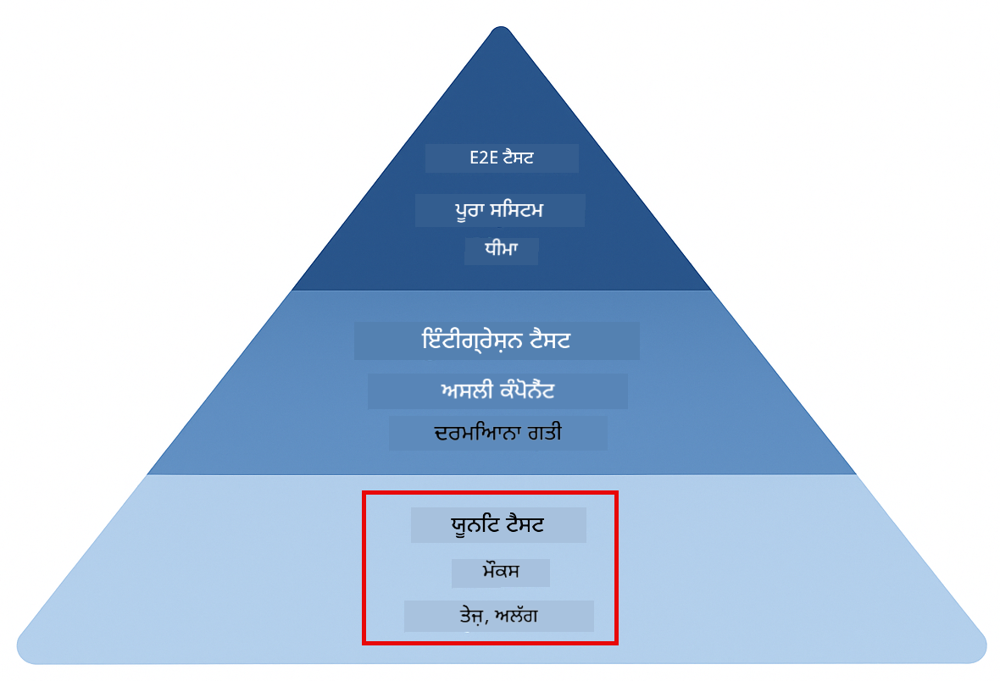
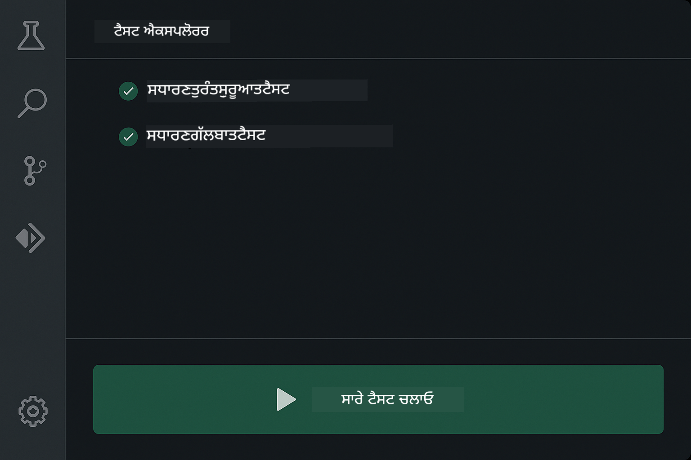
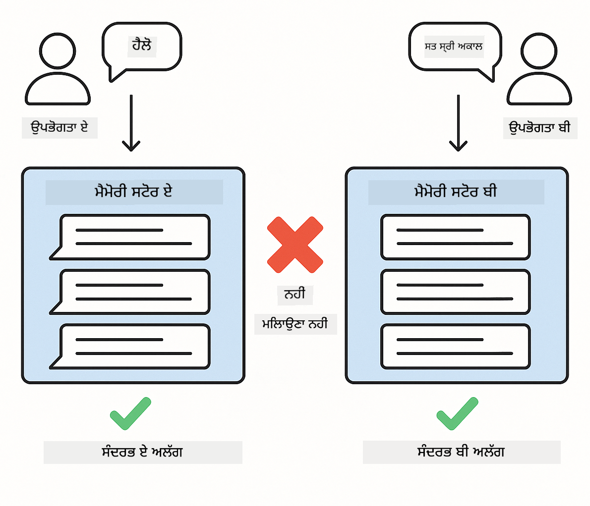
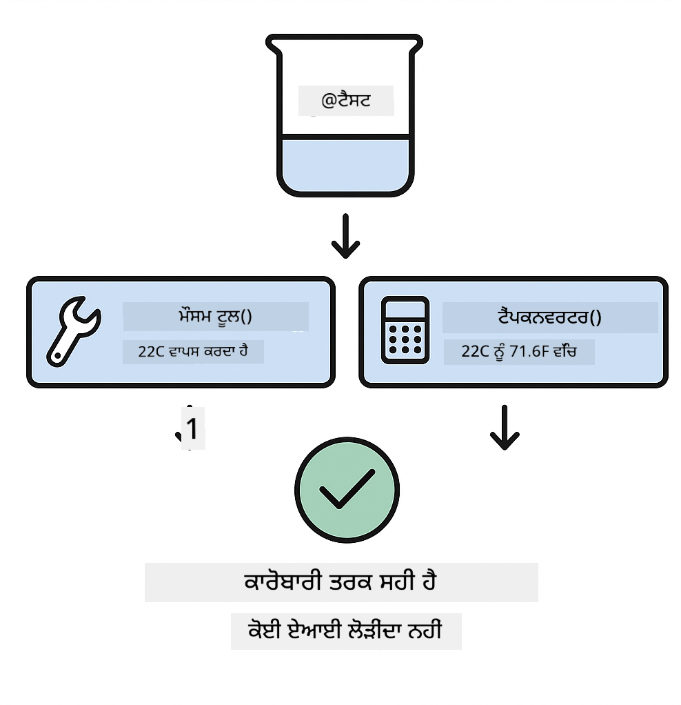
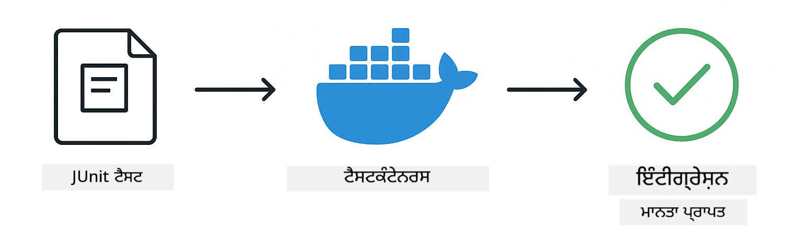

<!--
CO_OP_TRANSLATOR_METADATA:
{
  "original_hash": "b975537560c404d5f254331832811e78",
  "translation_date": "2025-12-13T20:54:47+00:00",
  "source_file": "docs/TESTING.md",
  "language_code": "pa"
}
-->
# LangChain4j ਐਪਲੀਕੇਸ਼ਨਾਂ ਦੀ ਟੈਸਟਿੰਗ

## ਸੂਚੀ

- [ਤੁਰੰਤ ਸ਼ੁਰੂਆਤ](../../../docs)
- [ਟੈਸਟ ਕੀ ਕਵਰ ਕਰਦੇ ਹਨ](../../../docs)
- [ਟੈਸਟ ਚਲਾਉਣਾ](../../../docs)
- [VS ਕੋਡ ਵਿੱਚ ਟੈਸਟ ਚਲਾਉਣਾ](../../../docs)
- [ਟੈਸਟਿੰਗ ਪੈਟਰਨ](../../../docs)
- [ਟੈਸਟਿੰਗ ਫਿਲਾਸਫੀ](../../../docs)
- [ਅਗਲੇ ਕਦਮ](../../../docs)

ਇਹ ਗਾਈਡ ਤੁਹਾਨੂੰ ਉਹ ਟੈਸਟ ਦਿਖਾਉਂਦੀ ਹੈ ਜੋ ਬਿਨਾਂ API ਕੁੰਜੀਆਂ ਜਾਂ ਬਾਹਰੀ ਸੇਵਾਵਾਂ ਦੀ ਲੋੜ ਦੇ AI ਐਪਲੀਕੇਸ਼ਨਾਂ ਦੀ ਟੈਸਟਿੰਗ ਕਿਵੇਂ ਕਰਨੀ ਹੈ।

## ਤੁਰੰਤ ਸ਼ੁਰੂਆਤ

ਸਾਰੇ ਟੈਸਟ ਇੱਕ ਕਮਾਂਡ ਨਾਲ ਚਲਾਓ:

**Bash:**
```bash
mvn test
```

**PowerShell:**
```powershell
mvn --% test
```


*ਸਾਰੇ ਟੈਸਟ ਸਫਲ ਹੋਣ ਨਾਲ ਜ਼ੀਰੋ ਫੇਲਿਊਰ ਦਿਖਾਉਂਦਾ ਸਫਲ ਟੈਸਟ ਚਲਾਉਣਾ*

## ਟੈਸਟ ਕੀ ਕਵਰ ਕਰਦੇ ਹਨ

ਇਹ ਕੋਰਸ **ਯੂਨਿਟ ਟੈਸਟਾਂ** 'ਤੇ ਧਿਆਨ ਕੇਂਦਰਿਤ ਕਰਦਾ ਹੈ ਜੋ ਸਥਾਨਕ ਤੌਰ 'ਤੇ ਚਲਦੇ ਹਨ। ਹਰ ਟੈਸਟ ਇੱਕ ਵਿਸ਼ੇਸ਼ LangChain4j ਸੰਕਲਪ ਨੂੰ ਅਲੱਗ ਦਿਖਾਉਂਦਾ ਹੈ।



*ਟੈਸਟਿੰਗ ਪਿਰਾਮਿਡ ਜੋ ਯੂਨਿਟ ਟੈਸਟਾਂ (ਤੇਜ਼, ਅਲੱਗ), ਇੰਟੀਗ੍ਰੇਸ਼ਨ ਟੈਸਟਾਂ (ਅਸਲੀ ਕੰਪੋਨੈਂਟ), ਅਤੇ ਐਂਡ-ਟੂ-ਐਂਡ ਟੈਸਟਾਂ (ਡੋਕਰ ਨਾਲ ਪੂਰਾ ਸਿਸਟਮ) ਵਿਚ ਸੰਤੁਲਨ ਦਿਖਾਉਂਦਾ ਹੈ। ਇਹ ਟ੍ਰੇਨਿੰਗ ਯੂਨਿਟ ਟੈਸਟਿੰਗ ਨੂੰ ਕਵਰ ਕਰਦੀ ਹੈ।*

| ਮੋਡੀਊਲ | ਟੈਸਟ | ਧਿਆਨ | ਮੁੱਖ ਫਾਈਲਾਂ |
|--------|-------|-------|-----------|
| **00 - ਤੁਰੰਤ ਸ਼ੁਰੂਆਤ** | 6 | ਪ੍ਰਾਂਪਟ ਟੈਮਪਲੇਟ ਅਤੇ ਵੈਰੀਏਬਲ ਬਦਲਾਅ | `SimpleQuickStartTest.java` |
| **01 - ਪਰਿਚਯ** | 8 | ਗੱਲਬਾਤ ਮੈਮੋਰੀ ਅਤੇ ਸਟੇਟਫੁਲ ਚੈਟ | `SimpleConversationTest.java` |
| **02 - ਪ੍ਰਾਂਪਟ ਇੰਜੀਨੀਅਰਿੰਗ** | 12 | GPT-5 ਪੈਟਰਨ, ਉਤਸ਼ਾਹ ਪੱਧਰ, ਸੰਰਚਿਤ ਆਉਟਪੁੱਟ | `SimpleGpt5PromptTest.java` |
| **03 - RAG** | 10 | ਦਸਤਾਵੇਜ਼ ਇੰਜੈਸ਼ਨ, ਐਮਬੈਡਿੰਗ, ਸਮਾਨਤਾ ਖੋਜ | `DocumentServiceTest.java` |
| **04 - ਟੂਲਜ਼** | 12 | ਫੰਕਸ਼ਨ ਕਾਲਿੰਗ ਅਤੇ ਟੂਲ ਚੇਨਿੰਗ | `SimpleToolsTest.java` |
| **05 - MCP** | 15 | ਮਾਡਲ ਕਾਂਟੈਕਸਟ ਪ੍ਰੋਟੋਕੋਲ ਡੋਕਰ ਨਾਲ | `SimpleMcpTest.java`, `McpDockerTransportTest.java` |

## ਟੈਸਟ ਚਲਾਉਣਾ

**ਰੂਟ ਤੋਂ ਸਾਰੇ ਟੈਸਟ ਚਲਾਓ:**

**Bash:**
```bash
mvn test
```

**PowerShell:**
```powershell
mvn --% test
```

**ਕਿਸੇ ਖਾਸ ਮੋਡੀਊਲ ਲਈ ਟੈਸਟ ਚਲਾਓ:**

**Bash:**
```bash
cd 01-introduction && mvn test
# ਜਾਂ ਰੂਟ ਤੋਂ
mvn test -pl 01-introduction
```

**PowerShell:**
```powershell
cd 01-introduction; mvn --% test
# ਜਾਂ ਰੂਟ ਤੋਂ
mvn --% test -pl 01-introduction
```

**ਇੱਕ ਟੈਸਟ ਕਲਾਸ ਚਲਾਓ:**

**Bash:**
```bash
mvn test -Dtest=SimpleConversationTest
```

**PowerShell:**
```powershell
mvn --% test -Dtest=SimpleConversationTest
```

**ਕਿਸੇ ਖਾਸ ਟੈਸਟ ਮੈਥਡ ਨੂੰ ਚਲਾਓ:**

**Bash:**
```bash
mvn test -Dtest=SimpleConversationTest#ਗੱਲਬਾਤ ਦਾ ਇਤਿਹਾਸ ਬਰਕਰਾਰ ਰੱਖਣਾ ਚਾਹੀਦਾ ਹੈ
```

**PowerShell:**
```powershell
mvn --% test -Dtest=SimpleConversationTest#ਗੱਲਬਾਤ ਦਾ ਇਤਿਹਾਸ ਬਰਕਰਾਰ ਰੱਖਣਾ ਚਾਹੀਦਾ ਹੈ
```

## VS ਕੋਡ ਵਿੱਚ ਟੈਸਟ ਚਲਾਉਣਾ

ਜੇ ਤੁਸੀਂ Visual Studio Code ਵਰਤ ਰਹੇ ਹੋ, ਤਾਂ Test Explorer ਟੈਸਟ ਚਲਾਉਣ ਅਤੇ ਡੀਬੱਗ ਕਰਨ ਲਈ ਗ੍ਰਾਫਿਕਲ ਇੰਟਰਫੇਸ ਪ੍ਰਦਾਨ ਕਰਦਾ ਹੈ।



*VS ਕੋਡ ਟੈਸਟ ਐਕਸਪਲੋਰਰ ਸਾਰੇ ਜਾਵਾ ਟੈਸਟ ਕਲਾਸਾਂ ਅਤੇ ਵਿਅਕਤੀਗਤ ਟੈਸਟ ਮੈਥਡਾਂ ਨਾਲ ਟੈਸਟ ਟ੍ਰੀ ਦਿਖਾਉਂਦਾ ਹੈ*

**VS ਕੋਡ ਵਿੱਚ ਟੈਸਟ ਚਲਾਉਣ ਲਈ:**

1. ਐਕਟਿਵਿਟੀ ਬਾਰ ਵਿੱਚ ਬੀਕਰ ਆਈਕਨ 'ਤੇ ਕਲਿੱਕ ਕਰਕੇ Test Explorer ਖੋਲ੍ਹੋ
2. ਸਾਰੇ ਮੋਡੀਊਲ ਅਤੇ ਟੈਸਟ ਕਲਾਸਾਂ ਦੇਖਣ ਲਈ ਟੈਸਟ ਟ੍ਰੀ ਵਧਾਓ
3. ਕਿਸੇ ਵੀ ਟੈਸਟ ਦੇ ਨਾਲ ਖੇਡ ਬਟਨ 'ਤੇ ਕਲਿੱਕ ਕਰਕੇ ਉਸਨੂੰ ਅਲੱਗ ਚਲਾਓ
4. "Run All Tests" 'ਤੇ ਕਲਿੱਕ ਕਰਕੇ ਪੂਰੀ ਸੂਟ ਚਲਾਓ
5. ਕਿਸੇ ਵੀ ਟੈਸਟ 'ਤੇ ਰਾਈਟ-ਕਲਿੱਕ ਕਰਕੇ "Debug Test" ਚੁਣੋ ਤਾਂ ਜੋ ਬ੍ਰੇਕਪੌਇੰਟ ਸੈੱਟ ਕਰਕੇ ਕੋਡ ਵਿੱਚ ਕਦਮ-ਦਰ-ਕਦਮ ਜਾਓ

ਟੈਸਟ ਐਕਸਪਲੋਰਰ ਪਾਸ ਹੋ ਰਹੇ ਟੈਸਟਾਂ ਲਈ ਹਰੇ ਚੈੱਕਮਾਰਕ ਦਿਖਾਉਂਦਾ ਹੈ ਅਤੇ ਜਦੋਂ ਟੈਸਟ ਫੇਲ ਹੁੰਦੇ ਹਨ ਤਾਂ ਵਿਸਥਾਰਪੂਰਕ ਫੇਲਿਊਰ ਸੁਨੇਹੇ ਦਿੰਦਾ ਹੈ।

## ਟੈਸਟਿੰਗ ਪੈਟਰਨ


*LangChain4j ਐਪਲੀਕੇਸ਼ਨਾਂ ਲਈ ਛੇ ਟੈਸਟਿੰਗ ਪੈਟਰਨ: ਪ੍ਰਾਂਪਟ ਟੈਮਪਲੇਟ, ਮੌਕਿੰਗ ਮਾਡਲ, ਗੱਲਬਾਤ ਅਲੱਗਾਵ, ਟੂਲਜ਼ ਟੈਸਟਿੰਗ, ਇਨ-ਮੇਮੋਰੀ RAG, ਅਤੇ ਡੋਕਰ ਇੰਟੀਗ੍ਰੇਸ਼ਨ*

### ਪੈਟਰਨ 1: ਪ੍ਰਾਂਪਟ ਟੈਮਪਲੇਟ ਦੀ ਟੈਸਟਿੰਗ

ਸਭ ਤੋਂ ਸਧਾਰਣ ਪੈਟਰਨ ਪ੍ਰਾਂਪਟ ਟੈਮਪਲੇਟਾਂ ਦੀ ਟੈਸਟਿੰਗ ਕਰਦਾ ਹੈ ਬਿਨਾਂ ਕਿਸੇ AI ਮਾਡਲ ਨੂੰ ਕਾਲ ਕੀਤੇ। ਤੁਸੀਂ ਜਾਂਚਦੇ ਹੋ ਕਿ ਵੈਰੀਏਬਲ ਬਦਲਾਅ ਸਹੀ ਤਰ੍ਹਾਂ ਕੰਮ ਕਰਦਾ ਹੈ ਅਤੇ ਪ੍ਰਾਂਪਟ ਉਮੀਦ ਅਨੁਸਾਰ ਫਾਰਮੈਟ ਕੀਤੇ ਗਏ ਹਨ।


*ਪ੍ਰਾਂਪਟ ਟੈਮਪਲੇਟ ਟੈਸਟਿੰਗ ਦਿਖਾਉਂਦਾ ਹੈ ਵੈਰੀਏਬਲ ਬਦਲਾਅ ਦਾ ਪ੍ਰਵਾਹ: ਟੈਮਪਲੇਟ ਵਿੱਚ ਪਲੇਸਹੋਲਡਰ → ਮੁੱਲ ਲਾਗੂ ਕੀਤੇ → ਫਾਰਮੈਟ ਕੀਤਾ ਆਉਟਪੁੱਟ ਜਾਂਚਿਆ*

```java
@Test
@DisplayName("Should format prompt template with variables")
void testPromptTemplateFormatting() {
    PromptTemplate template = PromptTemplate.from(
        "Best time to visit {{destination}} for {{activity}}?"
    );
    
    Prompt prompt = template.apply(Map.of(
        "destination", "Paris",
        "activity", "sightseeing"
    ));
    
    assertThat(prompt.text()).isEqualTo("Best time to visit Paris for sightseeing?");
}
```

ਇਹ ਟੈਸਟ `00-quick-start/src/test/java/com/example/langchain4j/quickstart/SimpleQuickStartTest.java` ਵਿੱਚ ਹੈ।

**ਇਸਨੂੰ ਚਲਾਓ:**

**Bash:**
```bash
cd 00-quick-start && mvn test -Dtest=SimpleQuickStartTest#ਟੈਸਟ ਪ੍ਰਾਂਪਟ ਟੈਮਪਲੇਟ ਫਾਰਮੈਟਿੰਗ
```

**PowerShell:**
```powershell
cd 00-quick-start; mvn --% test -Dtest=SimpleQuickStartTest#ਟੈਸਟ ਪ੍ਰਾਂਪਟ ਟੈਮਪਲੇਟ ਫਾਰਮੈਟਿੰਗ
```

### ਪੈਟਰਨ 2: ਭਾਸ਼ਾ ਮਾਡਲਾਂ ਦੀ ਮੌਕਿੰਗ

ਗੱਲਬਾਤ ਲਾਜਿਕ ਦੀ ਟੈਸਟਿੰਗ ਕਰਦਿਆਂ, Mockito ਵਰਤੋਂ ਕਰਕੇ ਨਕਲੀ ਮਾਡਲ ਬਣਾਓ ਜੋ ਪਹਿਲਾਂ ਤੋਂ ਨਿਰਧਾਰਤ ਜਵਾਬ ਦਿੰਦੇ ਹਨ। ਇਸ ਨਾਲ ਟੈਸਟ ਤੇਜ਼, ਮੁਫ਼ਤ ਅਤੇ ਨਿਰਧਾਰਿਤ ਹੁੰਦੇ ਹਨ।


*ਤੁਲਨਾ ਦਿਖਾਉਂਦੀ ਹੈ ਕਿ ਟੈਸਟਿੰਗ ਲਈ ਮੌਕ ਕਿਉਂ ਪਸੰਦ ਕੀਤੇ ਜਾਂਦੇ ਹਨ: ਇਹ ਤੇਜ਼, ਮੁਫ਼ਤ, ਨਿਰਧਾਰਿਤ ਹਨ ਅਤੇ ਕਿਸੇ API ਕੁੰਜੀ ਦੀ ਲੋੜ ਨਹੀਂ*

```java
@ExtendWith(MockitoExtension.class)
class SimpleConversationTest {
    
    private ConversationService conversationService;
    
    @Mock
    private OpenAiOfficialChatModel mockChatModel;
    
    @BeforeEach
    void setUp() {
        ChatResponse mockResponse = ChatResponse.builder()
            .aiMessage(AiMessage.from("This is a test response"))
            .build();
        when(mockChatModel.chat(anyList())).thenReturn(mockResponse);
        
        conversationService = new ConversationService(mockChatModel);
    }
    
    @Test
    void shouldMaintainConversationHistory() {
        String conversationId = conversationService.startConversation();
        
        ChatResponse mockResponse1 = ChatResponse.builder()
            .aiMessage(AiMessage.from("Response 1"))
            .build();
        ChatResponse mockResponse2 = ChatResponse.builder()
            .aiMessage(AiMessage.from("Response 2"))
            .build();
        ChatResponse mockResponse3 = ChatResponse.builder()
            .aiMessage(AiMessage.from("Response 3"))
            .build();
        
        when(mockChatModel.chat(anyList()))
            .thenReturn(mockResponse1)
            .thenReturn(mockResponse2)
            .thenReturn(mockResponse3);

        conversationService.chat(conversationId, "First message");
        conversationService.chat(conversationId, "Second message");
        conversationService.chat(conversationId, "Third message");

        List<ChatMessage> history = conversationService.getHistory(conversationId);
        assertThat(history).hasSize(6); // 3 ਯੂਜ਼ਰ + 3 ਏਆਈ ਸੁਨੇਹੇ
    }
}
```

ਇਹ ਪੈਟਰਨ `01-introduction/src/test/java/com/example/langchain4j/service/SimpleConversationTest.java` ਵਿੱਚ ਹੈ। ਮੌਕ ਯਕੀਨੀ ਬਣਾਉਂਦਾ ਹੈ ਕਿ ਵਿਹਾਰ ਸਥਿਰ ਹੈ ਤਾਂ ਜੋ ਤੁਸੀਂ ਯਾਦਦਾਸ਼ਤ ਪ੍ਰਬੰਧਨ ਸਹੀ ਤਰ੍ਹਾਂ ਕੰਮ ਕਰਦਾ ਹੈ ਜਾਂ ਨਹੀਂ ਜਾਂਚ ਸਕੋ।

### ਪੈਟਰਨ 3: ਗੱਲਬਾਤ ਅਲੱਗਾਵ ਦੀ ਟੈਸਟਿੰਗ

ਗੱਲਬਾਤ ਮੈਮੋਰੀ ਨੂੰ ਕਈ ਉਪਭੋਗਤਾਵਾਂ ਨੂੰ ਅਲੱਗ ਰੱਖਣਾ ਚਾਹੀਦਾ ਹੈ। ਇਹ ਟੈਸਟ ਜਾਂਚਦਾ ਹੈ ਕਿ ਗੱਲਬਾਤਾਂ ਦੇ ਸੰਦਰਭ ਮਿਲਦੇ ਨਹੀਂ।



*ਗੱਲਬਾਤ ਅਲੱਗਾਵ ਟੈਸਟਿੰਗ ਦਿਖਾਉਂਦਾ ਹੈ ਵੱਖ-ਵੱਖ ਉਪਭੋਗਤਾਵਾਂ ਲਈ ਅਲੱਗ ਮੈਮੋਰੀ ਸਟੋਰ ਤਾਂ ਜੋ ਸੰਦਰਭ ਮਿਲਾਪ ਨਾ ਹੋਵੇ*

```java
@Test
void shouldIsolateConversationsByid() {
    String conv1 = conversationService.startConversation();
    String conv2 = conversationService.startConversation();
    
    ChatResponse mockResponse = ChatResponse.builder()
        .aiMessage(AiMessage.from("Response"))
        .build();
    when(mockChatModel.chat(anyList())).thenReturn(mockResponse);

    conversationService.chat(conv1, "Message for conversation 1");
    conversationService.chat(conv2, "Message for conversation 2");

    List<ChatMessage> history1 = conversationService.getHistory(conv1);
    List<ChatMessage> history2 = conversationService.getHistory(conv2);
    
    assertThat(history1).hasSize(2);
    assertThat(history2).hasSize(2);
}
```

ਹਰ ਗੱਲਬਾਤ ਆਪਣਾ ਸੁਤੰਤਰ ਇਤਿਹਾਸ ਰੱਖਦੀ ਹੈ। ਉਤਪਾਦਨ ਸਿਸਟਮਾਂ ਵਿੱਚ, ਇਹ ਅਲੱਗਾਵ ਬਹੁ-ਉਪਭੋਗਤਾ ਐਪਲੀਕੇਸ਼ਨਾਂ ਲਈ ਅਹੰਕਾਰਪੂਰਕ ਹੈ।

### ਪੈਟਰਨ 4: ਟੂਲਜ਼ ਦੀ ਸੁਤੰਤਰ ਟੈਸਟਿੰਗ

ਟੂਲਜ਼ ਉਹ ਫੰਕਸ਼ਨ ਹਨ ਜੋ AI ਕਾਲ ਕਰ ਸਕਦਾ ਹੈ। ਉਨ੍ਹਾਂ ਨੂੰ ਸਿੱਧਾ ਟੈਸਟ ਕਰੋ ਤਾਂ ਜੋ ਇਹ ਯਕੀਨੀ ਬਣੇ ਕਿ ਉਹ AI ਫੈਸਲਿਆਂ ਤੋਂ ਬਿਨਾਂ ਸਹੀ ਕੰਮ ਕਰਦੇ ਹਨ।



*ਟੂਲਜ਼ ਦੀ ਸੁਤੰਤਰ ਟੈਸਟਿੰਗ ਦਿਖਾਉਂਦੀ ਹੈ ਮੌਕ ਟੂਲ ਚਲਾਉਣਾ ਬਿਨਾਂ AI ਕਾਲਾਂ ਦੇ ਤਾਂ ਜੋ ਕਾਰੋਬਾਰੀ ਲਾਜਿਕ ਦੀ ਜਾਂਚ ਹੋ ਸਕੇ*

```java
@Test
void shouldConvertCelsiusToFahrenheit() {
    TemperatureTool tempTool = new TemperatureTool();
    String result = tempTool.celsiusToFahrenheit(25.0);
    assertThat(result).containsPattern("77[.,]0°F");
}

@Test
void shouldDemonstrateToolChaining() {
    WeatherTool weatherTool = new WeatherTool();
    TemperatureTool tempTool = new TemperatureTool();

    String weatherResult = weatherTool.getCurrentWeather("Seattle");
    assertThat(weatherResult).containsPattern("\\d+°C");

    String conversionResult = tempTool.celsiusToFahrenheit(22.0);
    assertThat(conversionResult).containsPattern("71[.,]6°F");
}
```

ਇਹ ਟੈਸਟ `04-tools/src/test/java/com/example/langchain4j/agents/tools/SimpleToolsTest.java` ਤੋਂ ਹਨ ਜੋ AI ਸ਼ਾਮਲ ਨਾ ਹੋਣ ਦੇ ਬਾਵਜੂਦ ਟੂਲ ਲਾਜਿਕ ਦੀ ਪੁਸ਼ਟੀ ਕਰਦੇ ਹਨ। ਚੇਨਿੰਗ ਉਦਾਹਰਨ ਦਿਖਾਉਂਦੀ ਹੈ ਕਿ ਇੱਕ ਟੂਲ ਦਾ ਆਉਟਪੁੱਟ ਦੂਜੇ ਦੇ ਇਨਪੁੱਟ ਵਿੱਚ ਕਿਵੇਂ ਫੀਡ ਹੁੰਦਾ ਹੈ।

### ਪੈਟਰਨ 5: ਇਨ-ਮੇਮੋਰੀ RAG ਟੈਸਟਿੰਗ

RAG ਸਿਸਟਮ ਆਮ ਤੌਰ 'ਤੇ ਵੈਕਟਰ ਡੇਟਾਬੇਸ ਅਤੇ ਐਮਬੈਡਿੰਗ ਸੇਵਾਵਾਂ ਦੀ ਲੋੜ ਹੁੰਦੇ ਹਨ। ਇਨ-ਮੇਮੋਰੀ ਪੈਟਰਨ ਤੁਹਾਨੂੰ ਬਿਨਾਂ ਬਾਹਰੀ ਨਿਰਭਰਤਾਵਾਂ ਦੇ ਪੂਰੀ ਪਾਈਪਲਾਈਨ ਦੀ ਟੈਸਟਿੰਗ ਕਰਨ ਦਿੰਦਾ ਹੈ।


*ਇਨ-ਮੇਮੋਰੀ RAG ਟੈਸਟਿੰਗ ਵਰਕਫਲੋ ਦਿਖਾਉਂਦਾ ਹੈ ਦਸਤਾਵੇਜ਼ ਪਾਰਸਿੰਗ, ਐਮਬੈਡਿੰਗ ਸਟੋਰੇਜ, ਅਤੇ ਸਮਾਨਤਾ ਖੋਜ ਬਿਨਾਂ ਡੇਟਾਬੇਸ ਦੀ ਲੋੜ ਦੇ*

```java
@Test
void testProcessTextDocument() {
    String content = "This is a test document.\nIt has multiple lines.";
    InputStream inputStream = new ByteArrayInputStream(content.getBytes(StandardCharsets.UTF_8));
    
    DocumentService.ProcessedDocument result = 
        documentService.processDocument(inputStream, "test.txt");

    assertNotNull(result);
    assertTrue(result.segments().size() > 0);
    assertEquals("test.txt", result.segments().get(0).metadata().getString("filename"));
}
```

ਇਹ ਟੈਸਟ `03-rag/src/test/java/com/example/langchain4j/rag/service/DocumentServiceTest.java` ਤੋਂ ਹੈ ਜੋ ਮੈਮੋਰੀ ਵਿੱਚ ਦਸਤਾਵੇਜ਼ ਬਣਾਉਂਦਾ ਹੈ ਅਤੇ ਚੰਕਿੰਗ ਅਤੇ ਮੈਟਾਡੇਟਾ ਹੈਂਡਲਿੰਗ ਦੀ ਪੁਸ਼ਟੀ ਕਰਦਾ ਹੈ।

### ਪੈਟਰਨ 6: ਡੋਕਰ ਨਾਲ ਇੰਟੀਗ੍ਰੇਸ਼ਨ ਟੈਸਟਿੰਗ

ਕੁਝ ਫੀਚਰਾਂ ਨੂੰ ਅਸਲੀ ਢਾਂਚਾ ਚਾਹੀਦਾ ਹੈ। MCP ਮੋਡੀਊਲ Testcontainers ਵਰਤਦਾ ਹੈ ਡੋਕਰ ਕੰਟੇਨਰ ਚਲਾਉਣ ਲਈ ਇੰਟੀਗ੍ਰੇਸ਼ਨ ਟੈਸਟਾਂ ਵਿੱਚ। ਇਹ ਤੁਹਾਡੇ ਕੋਡ ਨੂੰ ਅਸਲੀ ਸੇਵਾਵਾਂ ਨਾਲ ਕੰਮ ਕਰਨ ਦੀ ਪੁਸ਼ਟੀ ਕਰਦੇ ਹਨ ਜਦਕਿ ਟੈਸਟ ਅਲੱਗਾਵ ਬਰਕਰਾਰ ਰੱਖਦੇ ਹਨ।



*MCP ਇੰਟੀਗ੍ਰੇਸ਼ਨ ਟੈਸਟਿੰਗ Testcontainers ਨਾਲ ਦਿਖਾਉਂਦਾ ਹੈ ਆਟੋਮੇਟਿਕ ਕੰਟੇਨਰ ਲਾਈਫਸਾਈਕਲ: ਸ਼ੁਰੂ, ਟੈਸਟ ਚਲਾਉਣਾ, ਰੋਕਣਾ, ਅਤੇ ਸਾਫ਼-ਸਫਾਈ*

`05-mcp/src/test/java/com/example/langchain4j/mcp/McpDockerTransportTest.java` ਵਿੱਚ ਟੈਸਟਾਂ ਲਈ ਡੋਕਰ ਚੱਲ ਰਿਹਾ ਹੋਣਾ ਜ਼ਰੂਰੀ ਹੈ।

**ਇਹਨਾਂ ਨੂੰ ਚਲਾਓ:**

**Bash:**
```bash
cd 05-mcp && mvn test
```

**PowerShell:**
```powershell
cd 05-mcp; mvn --% test
```

## ਟੈਸਟਿੰਗ ਫਿਲਾਸਫੀ

ਆਪਣਾ ਕੋਡ ਟੈਸਟ ਕਰੋ, AI ਨੂੰ ਨਹੀਂ। ਤੁਹਾਡੇ ਟੈਸਟ ਉਹ ਕੋਡ ਵੈਰੀਫਾਈ ਕਰਨੇ ਚਾਹੀਦੇ ਹਨ ਜੋ ਤੁਸੀਂ ਲਿਖਦੇ ਹੋ, ਜਿਵੇਂ ਕਿ ਪ੍ਰਾਂਪਟ ਕਿਵੇਂ ਬਣਾਏ ਜਾਂਦੇ ਹਨ, ਮੈਮੋਰੀ ਕਿਵੇਂ ਸੰਭਾਲੀ ਜਾਂਦੀ ਹੈ, ਅਤੇ ਟੂਲਜ਼ ਕਿਵੇਂ ਚਲਦੇ ਹਨ। AI ਦੇ ਜਵਾਬ ਵੱਖ-ਵੱਖ ਹੋ ਸਕਦੇ ਹਨ ਅਤੇ ਟੈਸਟ ਦਾਅਵਿਆਂ ਦਾ ਹਿੱਸਾ ਨਹੀਂ ਹੋਣੇ ਚਾਹੀਦੇ। ਆਪਣੇ ਆਪ ਨੂੰ ਪੁੱਛੋ ਕਿ ਕੀ ਤੁਹਾਡਾ ਪ੍ਰਾਂਪਟ ਟੈਮਪਲੇਟ ਸਹੀ ਤਰ੍ਹਾਂ ਵੈਰੀਏਬਲ ਬਦਲਦਾ ਹੈ, ਨਾ ਕਿ AI ਸਹੀ ਜਵਾਬ ਦਿੰਦਾ ਹੈ ਜਾਂ ਨਹੀਂ।

ਭਾਸ਼ਾ ਮਾਡਲਾਂ ਲਈ ਮੌਕ ਵਰਤੋਂ। ਇਹ ਬਾਹਰੀ ਨਿਰਭਰਤਾਵਾਂ ਹਨ ਜੋ ਧੀਮੇ, ਮਹਿੰਗੇ ਅਤੇ ਗੈਰ-ਨਿਰਧਾਰਿਤ ਹੁੰਦੇ ਹਨ। ਮੌਕਿੰਗ ਨਾਲ ਟੈਸਟ ਸੈਕਿੰਡਾਂ ਦੀ ਬਜਾਏ ਮਿਲੀਸੈਕਿੰਡਾਂ ਵਿੱਚ ਤੇਜ਼, ਮੁਫ਼ਤ ਅਤੇ ਨਿਰਧਾਰਿਤ ਬਣ ਜਾਂਦੇ ਹਨ।

ਟੈਸਟਾਂ ਨੂੰ ਸੁਤੰਤਰ ਰੱਖੋ। ਹਰ ਟੈਸਟ ਆਪਣਾ ਡਾਟਾ ਸੈੱਟ ਕਰੇ, ਦੂਜੇ ਟੈਸਟਾਂ 'ਤੇ ਨਿਰਭਰ ਨਾ ਹੋਵੇ, ਅਤੇ ਆਪਣੇ ਆਪ ਨੂੰ ਸਾਫ਼ ਕਰੇ। ਟੈਸਟ ਚਲਾਉਣ ਦੇ ਕ੍ਰਮ ਤੋਂ ਬਿਨਾਂ ਪਾਸ ਹੋਣੇ ਚਾਹੀਦੇ ਹਨ।

ਖੁਸ਼ਹਾਲ ਰਸਤੇ ਤੋਂ ਬਾਹਰ ਦੇ ਕੇਸਾਂ ਦੀ ਟੈਸਟਿੰਗ ਕਰੋ। ਖਾਲੀ ਇਨਪੁੱਟ, ਬਹੁਤ ਵੱਡੇ ਇਨਪੁੱਟ, ਖਾਸ ਅੱਖਰ, ਗਲਤ ਪੈਰਾਮੀਟਰ, ਅਤੇ ਸੀਮਾ ਸਥਿਤੀਆਂ ਦੀ ਕੋਸ਼ਿਸ਼ ਕਰੋ। ਇਹ ਅਕਸਰ ਬੱਗਾਂ ਨੂੰ ਬਿਆਨ ਕਰਦੇ ਹਨ ਜੋ ਆਮ ਵਰਤੋਂ ਵਿੱਚ ਨਹੀਂ ਦਿਖਾਈ ਦਿੰਦੀਆਂ।

ਵਰਣਨਾਤਮਕ ਨਾਮ ਵਰਤੋਂ। `shouldMaintainConversationHistoryAcrossMultipleMessages()` ਦੀ ਤੁਲਨਾ `test1()` ਨਾਲ ਕਰੋ। ਪਹਿਲਾ ਤੁਹਾਨੂੰ ਸਹੀ ਦੱਸਦਾ ਹੈ ਕਿ ਕੀ ਟੈਸਟ ਕੀਤਾ ਜਾ ਰਿਹਾ ਹੈ, ਜਿਸ ਨਾਲ ਫੇਲਿਊਰ ਡੀਬੱਗ ਕਰਨਾ ਬਹੁਤ ਆਸਾਨ ਹੁੰਦਾ ਹੈ।

## ਅਗਲੇ ਕਦਮ

ਹੁਣ ਜਦੋਂ ਤੁਸੀਂ ਟੈਸਟਿੰਗ ਪੈਟਰਨ ਸਮਝ ਗਏ ਹੋ, ਹਰ ਮੋਡੀਊਲ ਵਿੱਚ ਹੋਰ ਡੂੰਘਾਈ ਨਾਲ ਜਾਓ:

- **[00 - ਤੁਰੰਤ ਸ਼ੁਰੂਆਤ](../00-quick-start/README.md)** - ਪ੍ਰਾਂਪਟ ਟੈਮਪਲੇਟ ਬੁਨਿਆਦਾਂ ਨਾਲ ਸ਼ੁਰੂ ਕਰੋ
- **[01 - ਪਰਿਚਯ](../01-introduction/README.md)** - ਗੱਲਬਾਤ ਮੈਮੋਰੀ ਪ੍ਰਬੰਧਨ ਸਿੱਖੋ
- **[02 - ਪ੍ਰਾਂਪਟ ਇੰਜੀਨੀਅਰਿੰਗ](../02-prompt-engineering/README.md)** - GPT-5 ਪ੍ਰਾਂਪਟਿੰਗ ਪੈਟਰਨ ਮਾਹਰ ਬਣੋ
- **[03 - RAG](../03-rag/README.md)** - ਰੀਟਰੀਵਲ-ਆਗਮੈਂਟਡ ਜਨਰੇਸ਼ਨ ਸਿਸਟਮ ਬਣਾਓ
- **[04 - ਟੂਲਜ਼](../04-tools/README.md)** - ਫੰਕਸ਼ਨ ਕਾਲਿੰਗ ਅਤੇ ਟੂਲ ਚੇਨਜ਼ ਲਾਗੂ ਕਰੋ
- **[05 - MCP](../05-mcp/README.md)** - ਮਾਡਲ ਕਾਂਟੈਕਸਟ ਪ੍ਰੋਟੋਕੋਲ ਡੋਕਰ ਨਾਲ ਇੰਟੀਗ੍ਰੇਟ ਕਰੋ

ਹਰ ਮੋਡੀਊਲ ਦੀ README ਇੱਥੇ ਟੈਸਟ ਕੀਤੇ ਗਏ ਸੰਕਲਪਾਂ ਦੀ ਵਿਸਥਾਰਪੂਰਕ ਵਿਆਖਿਆ ਦਿੰਦੀ ਹੈ।

---

**ਨੈਵੀਗੇਸ਼ਨ:** [← ਮੁੱਖ ਪੰਨੇ ਤੇ ਵਾਪਸ](../README.md)

---

<!-- CO-OP TRANSLATOR DISCLAIMER START -->
**ਅਸਵੀਕਾਰੋਪੱਤਰ**:  
ਇਹ ਦਸਤਾਵੇਜ਼ AI ਅਨੁਵਾਦ ਸੇਵਾ [Co-op Translator](https://github.com/Azure/co-op-translator) ਦੀ ਵਰਤੋਂ ਕਰਕੇ ਅਨੁਵਾਦ ਕੀਤਾ ਗਿਆ ਹੈ। ਜਦੋਂ ਕਿ ਅਸੀਂ ਸਹੀਤਾ ਲਈ ਕੋਸ਼ਿਸ਼ ਕਰਦੇ ਹਾਂ, ਕਿਰਪਾ ਕਰਕੇ ਧਿਆਨ ਵਿੱਚ ਰੱਖੋ ਕਿ ਸਵੈਚਾਲਿਤ ਅਨੁਵਾਦਾਂ ਵਿੱਚ ਗਲਤੀਆਂ ਜਾਂ ਅਸਮਰਥਤਾਵਾਂ ਹੋ ਸਕਦੀਆਂ ਹਨ। ਮੂਲ ਦਸਤਾਵੇਜ਼ ਆਪਣੀ ਮੂਲ ਭਾਸ਼ਾ ਵਿੱਚ ਪ੍ਰਮਾਣਿਕ ਸਰੋਤ ਮੰਨਿਆ ਜਾਣਾ ਚਾਹੀਦਾ ਹੈ। ਮਹੱਤਵਪੂਰਨ ਜਾਣਕਾਰੀ ਲਈ, ਪੇਸ਼ੇਵਰ ਮਨੁੱਖੀ ਅਨੁਵਾਦ ਦੀ ਸਿਫਾਰਸ਼ ਕੀਤੀ ਜਾਂਦੀ ਹੈ। ਅਸੀਂ ਇਸ ਅਨੁਵਾਦ ਦੀ ਵਰਤੋਂ ਤੋਂ ਉਤਪੰਨ ਕਿਸੇ ਵੀ ਗਲਤਫਹਿਮੀ ਜਾਂ ਗਲਤ ਵਿਆਖਿਆ ਲਈ ਜ਼ਿੰਮੇਵਾਰ ਨਹੀਂ ਹਾਂ।
<!-- CO-OP TRANSLATOR DISCLAIMER END -->