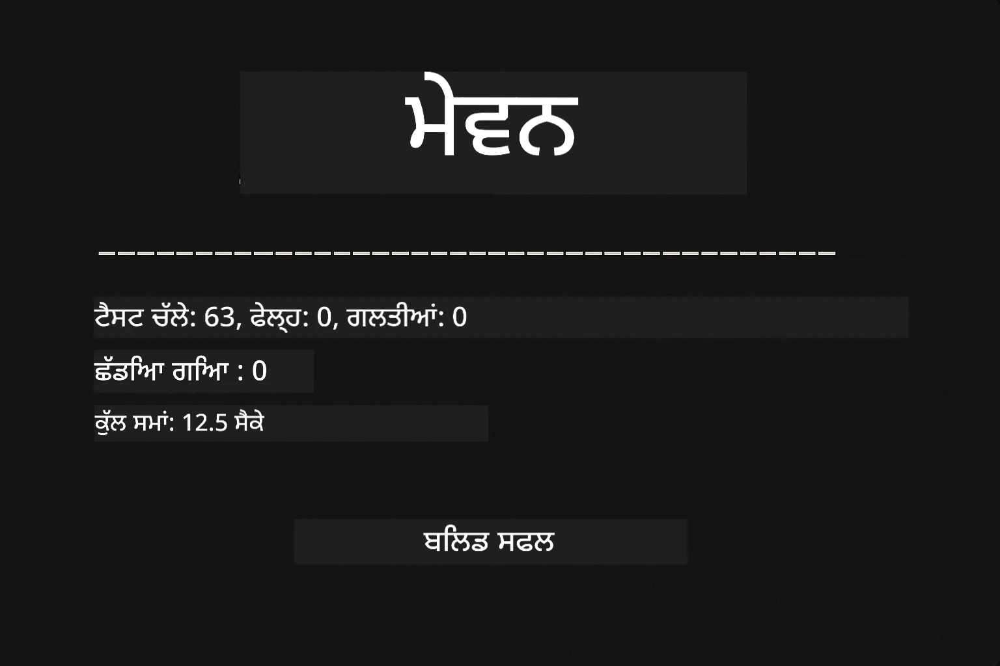
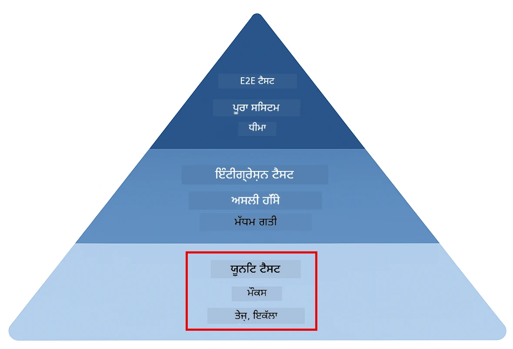
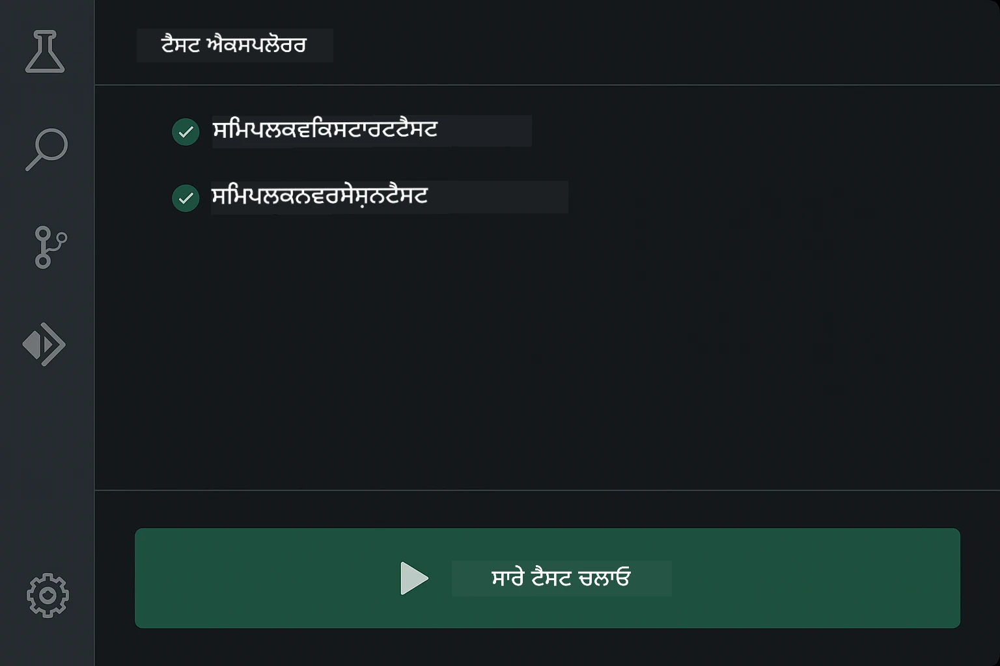
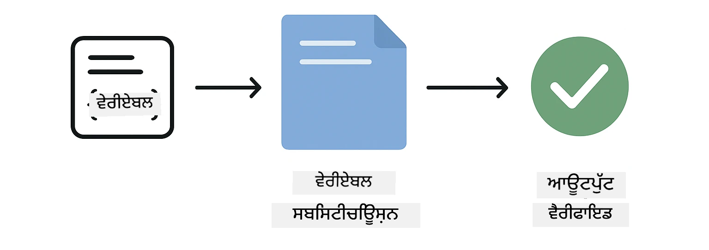
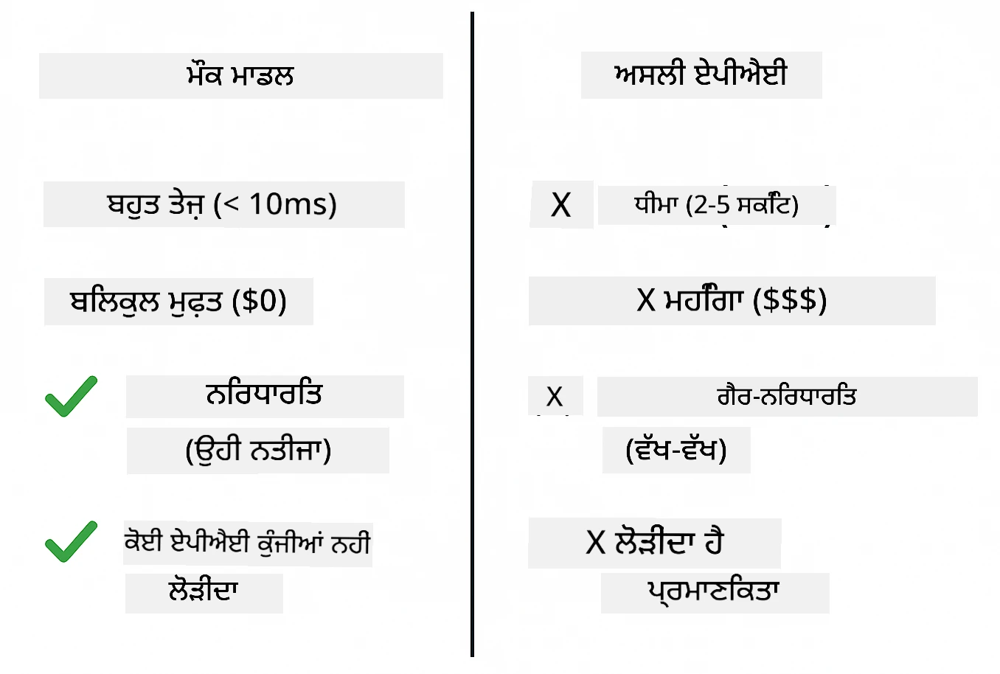
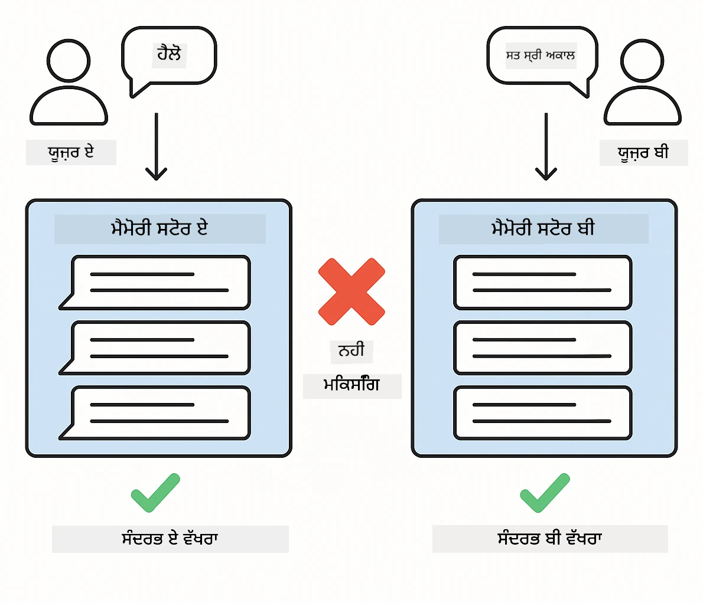
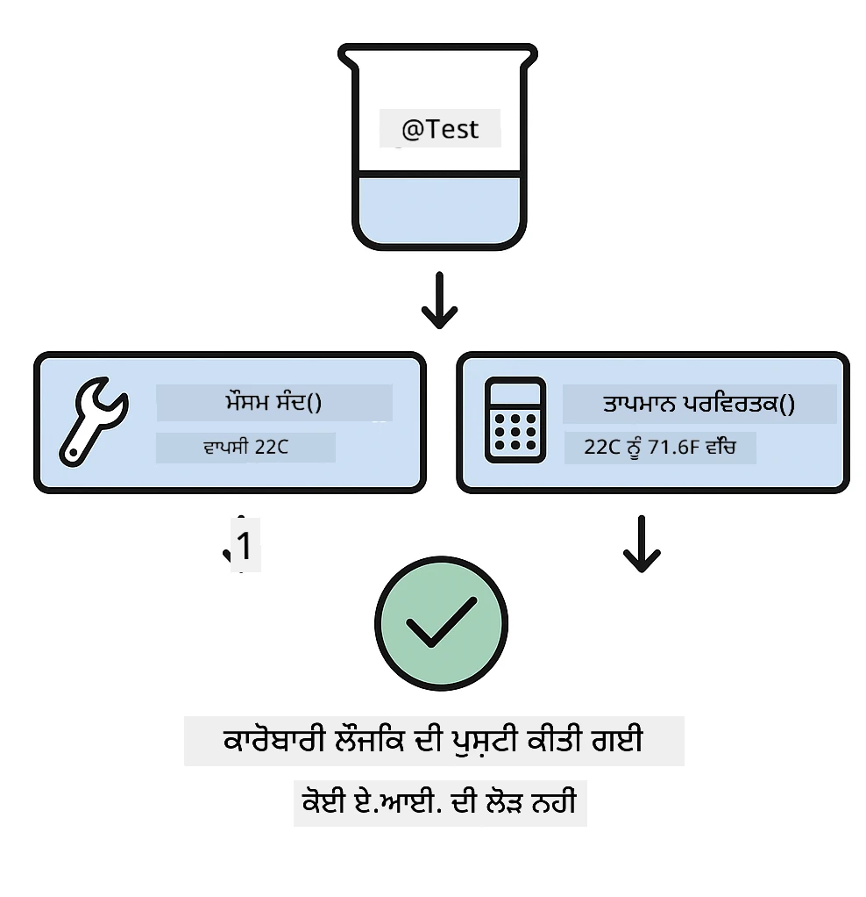
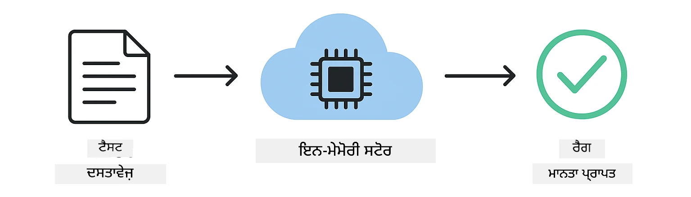

# LangChain4j ਐਪਲੀਕੇਸ਼ਨਾਂ ਦੀ ਟੈਸਟਿੰਗ

## ਸੂਚੀ ਸਾਰਣੀ

- [ਕੁਇੱਕ ਸਟਾਰਟ](#ਕੁਇੱਕ-ਸਟਾਰਟ)
- [ਟੈਸਟ ਕਿਵੇਂ ਕਵਰ ਕਰਦੇ ਹਨ](#ਟੈਸਟ-ਕਿਵੇਂ-ਕਵਰ-ਕਰਦੇ-ਹਨ)
- [ਟੈਸਟ ਚਲਾਉਣਾ](#ਟੈਸਟ-ਚਲਾਉਣਾ)
- [VS ਕੋਡ ਵਿੱਚ ਟੈਸਟ ਚਲਾਉਣਾ](#vs-ਕੋਡ-ਵਿੱਚ-ਟੈਸਟ-ਚਲਾਉਣਾ)
- [ਟੈਸਟਿੰਗ ਪੈਟਰਨ](#ਟੈਸਟਿੰਗ-ਪੈਟਰਨ)
- [ਟੈਸਟਿੰਗ ਫ਼ਿਲਾਸਫ਼ੀ](#ਟੈਸਟਿੰਗ-ਫ਼ਿਲਾਸਫ਼ੀ)
- [ਅਗਲੇ ਕਦਮ](#ਅਗਲੇ-ਕਦਮ)

ਇਹ ਗਾਈਡ ਤੁਹਾਨੂੰ ਉਹਨਾਂ ਟੈਸਟਾਂ ਨਾਲ ਵਾਕਿਫ ਕਰਵਾਉਂਦੀ ਹੈ ਜੋ ਬਿਨਾਂ API ਕੁੰਜੀਆਂ ਜਾਂ ਬਾਹਰੀ ਸੇਵਾਵਾਂ ਦੀ ਲੋੜ ਦੇ AI ਐਪਲੀਕੇਸ਼ਨਾਂ ਨੂੰ ਟੈਸਟ ਕਰਨਾ ਵੇਖਾਉਂਦੀਆਂ ਹਨ।

## ਕੁਇੱਕ ਸਟਾਰਟ

ਸਾਰੇ ਟੈਸਟ ਇੱਕ ਕਮਾਂਡ ਨਾਲ ਚਲਾਓ:

**Bash:**
```bash
mvn test
```

**PowerShell:**
```powershell
mvn --% test
```

ਜਦੋਂ ਸਾਰੇ ਟੈਸਟ ਪਾਸ ਹੋ ਜਾਣ, ਤਾਹੀਂ ਤੁਹਾਨੂੰ ਹੇਠਾਂ ਦਿੱਤੀ ਸਕ੍ਰੀਨਸ਼ਾਟ ਵਰਗਾ ਆਉਟਪੁੱਟ ਵੇਖਣ ਨੂੰ ਮਿਲੇਗਾ — ਸਾਰੇ ਟੈਸਟ ਬਿਨਾਂ ਕਿਸੇ ਅਸਫਲਤਾ ਦੇ ਚਲ ਰਹੇ ਹਨ।



*ਸਫਲ ਟੈਸਟ ਐਗਜ਼ੀਕਿਊਸ਼ਨ ਜਿਸ ਵਿੱਚ ਸਾਰੇ ਟੈਸਟ ਬਿਨਾਂ ਅਸਫਲਤਾ ਦੇ ਪਾਸ ਹੋ ਰਹੇ ਹਨ*

## ਟੈਸਟ ਕਿਵੇਂ ਕਵਰ ਕਰਦੇ ਹਨ

ਇਹ ਕੋਰਸ **ਯੂਨਿਟ ਟੈਸਟਾਂ** ’ਤੇ ਧਿਆਨ ਕੇਂਦਰਿਤ ਕਰਦਾ ਹੈ ਜੋ ਸਥਾਨਕ ਤੌਰ ’ਤੇ ਚਲਦੇ ਹਨ। ਹਰ ਟੈਸਟ LangChain4j ਦੇ ਇੱਕ ਖਾਸ ਸੰਕਲਪ ਨੂੰ ਅਲੱਗ ਕਰਕੇ ਦਰਸਾਉਂਦਾ ਹੈ। ਹੇਠਾਂ ਦਿੱਤਾ ਟੈਸਟਿੰਗ ਪਿਰਾਮਿਡ ਯੂਨਿਟ ਟੈਸਟਾਂ ਦੀ ਸਥਿਤੀ ਦਿਖਾਉਂਦਾ ਹੈ — ਇਹ ਤੇਜ਼, ਭਰੋਸੇਯੋਗ ਬੁਨਿਆਦ ਬਣਾਂਦੇ ਹਨ ਜਿਸ ’ਤੇ ਤੁਹਾਡੀ ਹੋਰ ਟੈਸਟ रणनीਤੀ ਨਿਰਭਰ ਕਰਦੀ ਹੈ।



*ਟੈਸਟਿੰਗ ਪਿਰਾਮਿਡ ਜੋ ਯੂਨਿਟ ਟੈਸਟਾਂ (ਤੇਜ਼, ਅਲੱਗ) ਅਤੇ ਇੰਟੀਗ੍ਰੇਸ਼ਨ ਟੈਸਟਾਂ (ਅਸਲੀ ਕੰਪੋਨੈਂਟ) ਅਤੇ ਏਂਡ-ਟੂ-ਏਂਡ ਟੈਸਟਾਂ ਦੇ ਬਰਾਬਰੀ ਵੇਖਾਉਂਦਾ ਹੈ। ਇਹ ਤਾਲੀਮ ਯੂਨਿਟ ਟੈਸਟਿੰਗ ’ਤੇ ਕਵਰ ਕਰਦੀ ਹੈ।*

| ਮੋਡੀਊਲ | ਟੈਸਟ | ਧਿਆਨ | ਮੁੱਖ ਫਾਈਲਾਂ |
|--------|-------|-------|-----------|
| **01 - ਪਰਿਚਯ** | 8 | ਗੱਲਬਾਤ ਨੂੰ ਯਾਦ ਰੱਖਣਾ ਅਤੇ ਸਟੇਟਫੁਲ ਚੈਟ | `SimpleConversationTest.java` |
| **02 - ਪ੍ਰਾਂਪਟ ਇੰਜੀਨੀਅਰਿੰਗ** | 12 | GPT-5.2 ਪੈਟਰਨ, ਉਤਸ਼ਾਹ ਦੇ ਪੱਧਰ, ਸੰਰਚਿਤ ਆਉਟਪੁੱਟ | `SimpleGpt5PromptTest.java` |
| **03 - RAG** | 10 | ਦਸਤਾਵੇਜ਼ ਸ਼ਮੂਲੀਅਤ, ਐਂਬੈਡਿੰਗ, ਸਮਾਨਤਾ ਖੋਜ | `DocumentServiceTest.java` |
| **04 - ਟੂਲਜ਼** | 12 | ਫੰਕਸ਼ਨ ਕਾਲਿੰਗ ਅਤੇ ਟੂਲ ਚੇਨਿੰਗ | `SimpleToolsTest.java` |
| **05 - MCP** | 8 | ਮਾਡਲ ਸੰਦਰਭ ਪ੍ਰੋਟੋਕੋਲ ਸਟਡਿਓ ਟ੍ਰਾਂਸਪੋਰਟ ਨਾਲ | `SimpleMcpTest.java` |

## ਟੈਸਟ ਚਲਾਉਣਾ

**ਰੂਟ ਤੋਂ ਸਾਰੇ ਟੈਸਟ ਚਲਾਓ:**

**Bash:**
```bash
mvn test
```

**PowerShell:**
```powershell
mvn --% test
```

**ਕਿਸੇ ਖਾਸ ਮੋਡੀਊਲ ਲਈ ਟੈਸਟ ਚਲਾਓ:**

**Bash:**
```bash
cd 01-introduction && mvn test
# ਜਾਂ ਰੂਟ ਤੋਂ
mvn test -pl 01-introduction
```

**PowerShell:**
```powershell
cd 01-introduction; mvn --% test
# ਜਾਂ ਰੂਟ ਤੋਂ
mvn --% test -pl 01-introduction
```

**ਇੱਕ ਅਕੇਲਾ ਟੈਸਟ ਕਲਾਸ ਚਲਾਓ:**

**Bash:**
```bash
mvn test -Dtest=SimpleConversationTest
```

**PowerShell:**
```powershell
mvn --% test -Dtest=SimpleConversationTest
```

**ਕਿਸੇ ਖਾਸ ਟੈਸਟ ਮੇਥਡ ਨੂੰ ਚਲਾਓ:**

**Bash:**
```bash
mvn test -Dtest=SimpleConversationTest#ਗੱਲਬਾਤ ਦੀ ਇਤਿਹਾਸਕ ਰੱਖਿਆ ਜਾਰੀ ਰੱਖਣੀ ਚਾਹੀਦੀ ਹੈ
```

**PowerShell:**
```powershell
mvn --% test -Dtest=SimpleConversationTest#ਗੱਲਬਾਤ ਦੇ ਇਤਿਹਾਸ ਨੂੰ ਬਣਾਈ ਰੱਖਣਾ ਚਾਹੀਦਾ ਹੈ
```

## VS ਕੋਡ ਵਿੱਚ ਟੈਸਟ ਚਲਾਉਣਾ

ਜੇ ਤੁਸੀਂ Visual Studio Code ਵਰਤ ਰਹੇ ਹੋ, ਤਾਂ ਟੈਸਟ ਐਕਸਪਲੋਰਰ ਟੈਸਟ ਚਲਾਉਣ ਅਤੇ ਡਿਬੱਗ ਕਰਨ ਲਈ ਗ੍ਰਾਫਿਕਲ ਇੰਟਰਫੇਸ ਮੁਹੱਈਆ ਕਰਵਾਉਂਦਾ ਹੈ।



*VS ਕੋਡ ਟੈਸਟ ਐਕਸਪਲੋਰਰ ਸਾਰਾ ਜਾਵਾ ਟੈਸਟ ਕਲਾਸਾਂ ਅਤੇ ਇਕੱਲੇ ਟੈਸਟ ਮੇਥਡਾਂ ਨਾਲ ਟੈਸਟ ਟ్రీ ਦਿਖਾ ਰਿਹਾ ਹੈ*

**VS ਕੋਡ ਵਿੱਚ ਟੈਸਟ ਚਲਾਉਣ ਲਈ:**

1. ਐਕਟਿਵਿਟੀ ਬਾਰ ਵਿੱਚ ਬੀਕਰ ਆਈਕਨ ’ਤੇ ਕਲਿੱਕ ਕਰਕੇ ਟੈਸਟ ਐਕਸਪਲੋਰਰ ਖੋਲ੍ਹੋ
2. ਸਾਰੇ ਮੋਡੀਊਲ ਅਤੇ ਟੈਸਟ ਕਲਾਸਾਂ ਵੇਖਣ ਲਈ ਟੈਸਟ ਟ੍ਰੀ ਖੋਲ੍ਹੋ
3. ਕਿਸੇ ਵੀ ਟੈਸਟ ਦੇ ਨਜ਼ਦੀਕ ਪਲੇ ਬਟਨ ’ਤੇ ਕਲਿੱਕ ਕਰਕੇ ਇੱਕੱਲਾ ਟੈਸਟ ਚਲਾਓ
4. "Run All Tests" ’ਤੇ ਕਲਿੱਕ ਕਰਕੇ ਸਾਰੀ ਸੂਟ ਚਲਾਓ
5. ਕਿਸੇ ਵੀ ਟੈਸਟ ’ਤੇ ਰਾਈਟ-ਕਲਿੱਕ ਕਰਕੇ "Debug Test" ਚੁਣੋ, ਬ੍ਰੇਕਪੋਇੰਟ ਸੈੱਟ ਕਰੋ ਅਤੇ ਕੋਡ ਨੂੰ ਕਦਮ-ਕਦਮ ਕਰਕੇ ਚਲਾਓ

ਟੈਸਟ ਐਕਸਪਲੋਰਰ ਪਾਸ ਹੋਏ ਟੈਸਟਾਂ ਲਈ ਹਰੇ ਚੈਕਮਾਰਕ ਦਿਖਾਉਂਦਾ ਹੈ ਅਤੇ ਜਦੋਂ ਟੈਸਟ ਫੇਲ ਹੁੰਦੇ ਹਨ ਤਾਂ ਵਿਸਥਾਰਪੂਰਕ ਅਸਫਲਤਾ ਸੁਨੇਹੇ ਦਿੰਦੈ ਹੈ।

## ਟੈਸਟਿੰਗ ਪੈਟਰਨ

### ਪੈਟਰਨ 1: ਪ੍ਰਾਂਪਟ ਟੈਂਪਲੇਟ ਦੀ ਟੈਸਟਿੰਗ

ਸਭ ਤੋਂ ਸਧਾਰਣ ਪੈਟਰਨ ਪ੍ਰਾਂਪਟ ਟੈਂਪਲੇਟਾਂ ਨੂੰ ਟੈਸਟ ਕਰਦਾ ਹੈ ਬਿਨਾਂ ਕਿਸੇ AI ਮਾਡਲ ਨੂੰ ਕਾਲ ਕੀਤੇ। ਤੁਸੀਂ ਇਹ ਪੜਤਾਲ ਕਰਦੇ ਹੋ ਕਿ ਵੈਰੀਏਬਲ ਸਬਸਟੀਚਿਊਸ਼ਨ ਸਹੀ ਤਰ੍ਹਾਂ ਕੰਮ ਕਰਦਾ ਹੈ ਅਤੇ ਪ੍ਰਾਂਪਟ ਉਮੀਦ ਮੁਤਾਬਕ ਫਾਰਮੈਟ ਕੀਤੇ ਗਏ ਹਨ।



*ਪ੍ਰਾਂਪਟ ਟੈਂਪਲੇਟ ਟੈਸਟਿੰਗ ਦਿਖਾਉਂਦਾ ਹੈ ਵੈਰੀਏਬਲ ਸਬਸਟੀਚਿਊਸ਼ਨ ਦਾ ਪ੍ਰਵਾਹ: ਟੈਂਪਲੇਟ ਵਿੱਚ ਪਲੇਸਹੋਲਡਰ → ਵੈਲਿਊਜ਼ ਲਾਗੂ → ਫਾਰਮੈਟ ਕੀਤਾ ਗਿਆ ਆਉਟਪੁੱਟ ਅਨੁਸ਼ੀਲਨ*

```java
@Test
@DisplayName("Should format prompt template with variables")
void testPromptTemplateFormatting() {
    PromptTemplate template = PromptTemplate.from(
        "Best time to visit {{destination}} for {{activity}}?"
    );
    
    Prompt prompt = template.apply(Map.of(
        "destination", "Paris",
        "activity", "sightseeing"
    ));
    
    assertThat(prompt.text()).isEqualTo("Best time to visit Paris for sightseeing?");
}
```

ਇਹ ਪੈਟਰਨ ਸਬੂਤ ਕਰਦਾ ਹੈ ਕਿ ਵੈਰੀਏਬਲ ਸਬਸਟੀਚਿਊਸ਼ਨ ਸਹੀ ਤਰ੍ਹਾਂ ਕਾਰਜ ਕਰਦਾ ਹੈ ਅਤੇ ਪ੍ਰਾਂਪਟ ਉਮੀਦ ਮੁਤਾਬਕ ਫਾਰਮੈਟ ਕੀਤੇ ਗਏ ਹਨ — ਕੋਈ API ਕੁੰਜੀ ਜਾਂ ਮਾਡਲ ਕਾਲ ਦੀ ਲੋੜ ਨਹੀਂ।

### ਪੈਟਰਨ 2: ਭਾਸ਼ਾ ਮਾਡਲਾਂ ਦਾ ਮੌਕਿੰਗ

ਜਦੋਂ ਗੱਲਬਾਤ ਲਾਜਿਕ ਦੀ ਟੈਸਟਿੰਗ ਕਰਨੀ ਹੁੰਦੀ ਹੈ, ਤਾਂ Mockito ਵਰਤ ਕੇ ਨਕਲੀ ਮਾਡਲ ਬਣਾਓ ਜੋ ਨਿਰਧਾਰਿਤ ਜਵਾਬ ਵਾਪਸ ਦਿੰਦੇ ਹਨ। ਇਸ ਨਾਲ ਟੈਸਟ ਤੇਜ਼, ਮੁਫ਼ਤ ਅਤੇ ਨਿਰਣਾਇਤਮਕ ਬਣ ਜਾਂਦੇ ਹਨ।



*ਤੁਲਨਾ ਦਿਖਾਈ ਗਈ ਹੈ ਕਿ ਟੈਸਟਿੰਗ ਲਈ ਮੌਕ ਕਿਉਂ ਵਧੀਆ ਹਨ: ਇਹ ਤੇਜ਼, ਮੁਫ਼ਤ, ਨਿਰਣਾਇਤਮਕ ਹਨ ਅਤੇ API ਕੁੰਜੀਆਂ ਦੀ ਲੋੜ ਨਹੀਂ*

```java
@ExtendWith(MockitoExtension.class)
class SimpleConversationTest {
    
    private ConversationService conversationService;
    
    @Mock
    private OpenAiOfficialChatModel mockChatModel;
    
    @BeforeEach
    void setUp() {
        ChatResponse mockResponse = ChatResponse.builder()
            .aiMessage(AiMessage.from("This is a test response"))
            .build();
        when(mockChatModel.chat(anyList())).thenReturn(mockResponse);
        
        conversationService = new ConversationService(mockChatModel);
    }
    
    @Test
    void shouldMaintainConversationHistory() {
        String conversationId = conversationService.startConversation();
        
        ChatResponse mockResponse1 = ChatResponse.builder()
            .aiMessage(AiMessage.from("Response 1"))
            .build();
        ChatResponse mockResponse2 = ChatResponse.builder()
            .aiMessage(AiMessage.from("Response 2"))
            .build();
        ChatResponse mockResponse3 = ChatResponse.builder()
            .aiMessage(AiMessage.from("Response 3"))
            .build();
        
        when(mockChatModel.chat(anyList()))
            .thenReturn(mockResponse1)
            .thenReturn(mockResponse2)
            .thenReturn(mockResponse3);

        conversationService.chat(conversationId, "First message");
        conversationService.chat(conversationId, "Second message");
        conversationService.chat(conversationId, "Third message");

        List<ChatMessage> history = conversationService.getHistory(conversationId);
        assertThat(history).hasSize(6); // 3 ਉਪਭੋਗਤਾ + 3 ਏਆਈ ਸੁਨੇਹੇ
    }
}
```

ਇਹ ਪੈਟਰਨ `01-introduction/src/test/java/com/example/langchain4j/service/SimpleConversationTest.java` ਵਿੱਚ ਮਿਲਦਾ ਹੈ। ਮੌਕ ਯਕੀਨੀ ਬਣਾਉਂਦਾ ਹੈ ਕਿ ਅਪਮੈਮੋਰੀ ਪ੍ਰਬੰਧਨ ਸਹੀ ਤਰ੍ਹਾਂ ਕੰਮ ਕਰਦਾ ਹੈ।

### ਪੈਟਰਨ 3: ਗੱਲਬਾਤ ਦੀ ਅਲੱਗਾਵਟ ਦੀ ਟੈਸਟਿੰਗ

ਗੱਲਬਾਤ ਦੀ ਯਾਦ ਵਿੱਚ ਕਈ ਉਪਭੋਗਤਿਆਂ ਨੂੰ ਅਲੱਗ ਰੱਖਣਾ ਲਾਜ਼ਮੀ ਹੈ। ਇਹ ਟੈਸਟ ਯਕੀਨੀ ਬਣਾਉਂਦਾ ਹੈ ਕਿ ਗੱਲਬਾਤਾਂ ਵਿੱਚ ਹਾਲਤਾਂ ਮਿਲਦੀਆਂ-ਜੁਲਦੀਆਂ ਨਹੀਂ।



*ਗੱਲਬਾਤ ਦੀ ਅਲੱਗਾਵਟ ਦੀ ਟੈਸਟਿੰਗ ਦਿਖਾਉਂਦੀ ਹੈ ਕਿ ਵੱਖ-ਵੱਖ ਉਪਭੋਗਤਿਆਂ ਲਈ ਅਲੱਗ ਯਾਦ ਸੰਗ੍ਰਹਿਤ ਕੀਤੀ ਜਾਂਦੀ ਹੈ ਤਾਂ ਜੋ ਸੰਦਰਭ ਮਿਸਮੈਚ ਨਾ ਹੋਵੇ*

```java
@Test
void shouldIsolateConversationsByid() {
    String conv1 = conversationService.startConversation();
    String conv2 = conversationService.startConversation();
    
    ChatResponse mockResponse = ChatResponse.builder()
        .aiMessage(AiMessage.from("Response"))
        .build();
    when(mockChatModel.chat(anyList())).thenReturn(mockResponse);

    conversationService.chat(conv1, "Message for conversation 1");
    conversationService.chat(conv2, "Message for conversation 2");

    List<ChatMessage> history1 = conversationService.getHistory(conv1);
    List<ChatMessage> history2 = conversationService.getHistory(conv2);
    
    assertThat(history1).hasSize(2);
    assertThat(history2).hasSize(2);
}
```

ਹਰ ਗੱਲਬਾਤ ਆਪਣੀ ਸੁਤੰਤਰ ਇਤਿਹਾਸ ਰੱਖਦੀ ਹੈ। ਉਤਪਾਦਨ ਪ੍ਰਣਾਲੀਆਂ ਵਿੱਚ, ਇਹ ਅਲੱਗਾਵਟ ਬਹੁ-ਉਪਭੋਗਤਾ ਐਪਲੀਕੇਸ਼ਨਾਂ ਲਈ ਜ਼ਰੂਰੀ ਹੁੰਦੀ ਹੈ।

### ਪੈਟਰਨ 4: ਸਵਤੰਤਰ ਟੂਲਜ਼ ਦੀ ਟੈਸਟਿੰਗ

ਟੂਲਜ਼ ਉਹ ਫੰਕਸ਼ਨ ਹਨ ਜੋ AI ਕਾਲ ਕਰ ਸਕਦਾ ਹੈ। ਉਹਨਾਂ ਨੂੰ ਸਿੱਧਾ ਟੈਸਟ ਕਰੋ ਤਾਂ ਜੋ ਇਹ ਯਕੀਨੀ ਬਣੇ ਕਿ AI ਦੇ ਫੈਸਲਿਆਂ ਤੋਂ ਬਿਨਾਂ ਉਹ ਸਹੀ ਤਰੀਕੇ ਨਾਲ ਕੰਮ ਕਰਦੇ ਹਨ।



*ਸਵਤੰਤਰ ਟੂਲ ਟੈਸਟਿੰਗ ਦਿਖਾਉਂਦੀ ਹੈ ਮੌਕ ਟੂਲ निष्पਾਦਨ ਬਿਨਾਂ AI ਕਾਲ ਦੇ, ਕਾਰੋਬਾਰੀ ਲਾਜ਼ਿਕ ਪਰਖਣ ਲਈ*

```java
@Test
void shouldConvertCelsiusToFahrenheit() {
    TemperatureTool tempTool = new TemperatureTool();
    String result = tempTool.celsiusToFahrenheit(25.0);
    assertThat(result).containsPattern("77[.,]0°F");
}

@Test
void shouldDemonstrateToolChaining() {
    WeatherTool weatherTool = new WeatherTool();
    TemperatureTool tempTool = new TemperatureTool();

    String weatherResult = weatherTool.getCurrentWeather("Seattle");
    assertThat(weatherResult).containsPattern("\\d+°C");

    String conversionResult = tempTool.celsiusToFahrenheit(22.0);
    assertThat(conversionResult).containsPattern("71[.,]6°F");
}
```

ਇਹ ਟੈਸਟ `04-tools/src/test/java/com/example/langchain4j/agents/tools/SimpleToolsTest.java` ਤੋਂ ਹਨ ਜੋ ਟੂਲ ਲਾਜਿਕ ਨੂੰ ਬਿਨਾਂ AI ਦੇ ਹਿੱਸੇ ਦੇ ਪਰਖਦੇ ਹਨ। ਚੇਨਿੰਗ ਉਦਾਹਰਨ ਦਿਖਾਉਂਦੀ ਹੈ ਕਿ ਇੱਕ ਟੂਲ ਦਾ ਆਉਟਪੁੱਟ ਕਿਵੇਂ ਦੂਜੇ ਦਾ ਇਨਪੁੱਟ ਬਣਦਾ ਹੈ।

### ਪੈਟਰਨ 5: ਇਨ-ਮੇਮੋਰੀ RAG ਟੈਸਟਿੰਗ

RAG ਪ੍ਰਣਾਲੀਆਂ ਆਮ ਤੌਰ ’ਤੇ ਵੈਕਟਰ ਡੇਟਾਬੇਸ ਅਤੇ ਐਂਬੈਡਿੰਗ ਸੇਵਾਵਾਂ ਮੰਗਦੀਆਂ ਹਨ। ਇਨ-ਮੇਮੋਰੀ ਪੈਟਰਨ ਤੁਹਾਡੇ ਸਾਰੇ ਪਾਈਪਲਾਈਨ ਨੂੰ ਬਿਨਾਂ ਬਾਹਰੀ ਨਿਰਭਰਤਾਵਾਂ ਦੇ ਟੈਸਟ ਕਰਨ ਦਿੰਦਾ ਹੈ।



*ਇਨ-ਮੇਮੋਰੀ RAG ਟੈਸਟਿੰਗ ਵਰਕਫਲੋ ਦਿਖਾਉਂਦੀ ਹੈ ਦਸਤਾਵੇਜ਼ ਪਾਰਸਿੰਗ, ਐਂਬੈਡਿੰਗ ਸਟੋਰੇਜ ਅਤੇ ਸਮਾਨਤਾ ਖੋਜ ਬਿਨਾਂ ਕਿਸੇ ਡੇਟਾਬੇਸ ਦੀ ਲੋੜ ਦੇ*

```java
@Test
void testProcessTextDocument() {
    String content = "This is a test document.\nIt has multiple lines.";
    InputStream inputStream = new ByteArrayInputStream(content.getBytes(StandardCharsets.UTF_8));
    
    DocumentService.ProcessedDocument result = 
        documentService.processDocument(inputStream, "test.txt");

    assertNotNull(result);
    assertTrue(result.segments().size() > 0);
    assertEquals("test.txt", result.segments().get(0).metadata().getString("filename"));
}
```

ਇਹ ਟੈਸਟ `03-rag/src/test/java/com/example/langchain4j/rag/service/DocumentServiceTest.java` ਤੋਂ ਹੈ ਜੋ ਮੈਮੋਰੀ ਵਿੱਚ ਦਸਤਾਵੇਜ਼ ਬਣਾਦਾ ਹੈ ਅਤੇ ਚੰਕਿੰਗ ਅਤੇ ਮੈਟਾਡੇਟਾ ਹੇਠਾਂ ਹੱਲ ਕਰਦਾ ਹੈ।

### ਪੈਟਰਨ 6: MCP ਇੰਟੀਗ੍ਰੇਸ਼ਨ ਟੈਸਟਿੰਗ

MCP ਮੋਡੀਊਲ ਮਾਡਲ ਸੰਦਰਭ ਪ੍ਰੋਟੋਕੋਲ ਦੀ ਇੰਟੀਗ੍ਰੇਸ਼ਨ stdio ਟ੍ਰਾਂਸਪੋਰਟ ਨਾਲ ਟੈਸਟ ਕਰਦਾ ਹੈ। ਇਹ ਟੈਸਟ ਯਕੀਨੀ ਬਣਾਉਂਦੇ ਹਨ ਕਿ ਤੁਹਾਡੀ ਐਪਲੀਕੇਸ਼ਨ MCP ਸਰਵਰਾਂ ਨੂੰ ਸਬਪ੍ਰੋਸੈਸ ਵਜੋਂ ਚਲਾ ਸਕਦੀ ਹੈ ਅਤੇ ਚਾਰਚਾ ਕਰ ਸਕਦੀ ਹੈ।

`05-mcp/src/test/java/com/example/langchain4j/mcp/SimpleMcpTest.java` ਦੇ ਟੈਸਟ MCP ਕਲਾਇੰਟ ਵਿਹਾਰ ਦੀ ਪੁਸ਼ਟੀ ਕਰਦੇ ਹਨ।

**ਉਹਨਾਂ ਨੂੰ ਚਲਾਓ:**

**Bash:**
```bash
cd 05-mcp && mvn test
```

**PowerShell:**
```powershell
cd 05-mcp; mvn --% test
```

## ਟੈਸਟਿੰਗ ਫ਼ਿਲਾਸਫ਼ੀ

ਆਪਣੇ ਕੋਡ ਦੀ ਟੈਸਟਿੰਗ ਕਰੋ, AI ਦੀ ਨਹੀਂ। ਤੁਹਾਡੇ ਟੈਸਟ ਉਹ ਕੋਡ ਵੈਰੀਫਾਈ ਕਰਣੇ ਚਾਹੀਦੇ ਹਨ ਜੋ ਤੁਸੀਂ ਲਿਖਦੇ ਹੋ, ਇਹ ਜਾਂਚ ਕੇ ਕਿ ਪ੍ਰਾਂਪਟ ਕਿਵੇਂ ਬਣਾਏ ਗਏ ਹਨ, ਯਾਦ ਰੱਖਣ ਕਿਵੇਂ ਸੰਭਾਲੀ ਜਾਂਦੀ ਹੈ, ਅਤੇ ਟੂਲ ਕਿਵੇਂ ਚਲਦੇ ਹਨ। AI ਦੇ ਜਵਾਬ ਬਦਲ ਸਕਦੇ ਹਨ ਅਤੇ ਉਹ ਟੈਸਟ ਦਾਅਵਿਆਂ ਦਾ ਹਿੱਸਾ ਨਹੀਂ ਹੋਣੇ ਚਾਹੀਦੇ। ਆਪਣੇ ਆਪ ਨੂੰ ਪੁੱਛੋ ਕਿ ਕੀ ਤੁਹਾਡਾ ਪ੍ਰਾਂਪਟ ਟੈਂਪਲੇਟ ਸਹੀ ਤਰੀਕੇ ਨਾਲ ਵੈਰੀਏਬਲ ਸਬਸਟੀਚਿਊਟ ਕਰਦਾ ਹੈ, ਨਾ ਕਿ AI ਸਹੀ ਜਵਾਬ ਦਿੰਦਾ ਹੈ।

ਭਾਸ਼ਾ ਮਾਡਲਾਂ ਲਈ ਮੌਕਜ਼ ਦੀ ਵਰਤੋਂ ਕਰੋ। ਉਹ ਬਾਹਰੀ ਨਿਰਭਰਤਾਵਾਂ ਹਨ ਜੋ ਧੀਮੇ, ਮਹਿੰਗੇ ਅਤੇ ਗੈਰ-ਨਿਰਣਾਇਤਮਕ ਹੁੰਦੇ ਹਨ। ਮੌਕਿੰਗ ਨਾਲ ਟੈਸਟ ਤੇਜ਼ ਹੁੰਦੇ ਹਨ, ਮਿਲੀਸੈਕੰਡਾਂ ਵਿੱਚ, ਮੁਫ਼ਤ ਹੁੰਦੇ ਹਨ ਬਿਨਾਂ ਕਿਸੇ API ਖ਼ਰਚ ਦੇ, ਅਤੇ ਨਿਰਣਾਇਤਮਕ ਹੁੰਦੇ ਹਨ ਜੇਹੜੇ ਹਰ ਵਾਰੀ ਉਦੋਂਹੀ ਨਤੀਜੇ ਦਿੰਦੈ ਹਨ।

ਟੈਸਟਾਂ ਨੂੰ ਸਵਤੰਤਰ ਰੱਖੋ। ਹਰ ਟੈਸਟ ਆਪਣਾ ਡਾਟਾ ਸੈਟਅੱਪ ਕਰੇ, ਦੂਜੇ ਟੈਸਟਾਂ ’ਤੇ ਨਿਰਭਰ ਨਾ ਕਰੇ, ਅਤੇ ਆਪਣੇ ਆਪ ਨੂੰ ਸਾਫ਼ ਕਰੇ। ਟੈਸਟ ਕਿਸੇ ਵੀ ਕ੍ਰਮ ਵਿੱਚ ਚੱਲਣ 'ਤੇ ਪਾਸ ਹੋਣੇ ਚਾਹੀਦੇ ਹਨ।

ਖੁਸ਼ਹਾਲ ਰਸਤੇ ਤੋਂ ਬਾਹਰ ਵੀ ਟੈਸਟ ਕਰੋ। ਖਾਲੀ ਇਨਪੁੱਟ, ਬਹੁਤ ਵੱਡੇ ਇਨਪੁੱਟ, ਵਿਸ਼ੇਸ਼ ਅੱਖਰ, ਗਲਤ ਪੈਰਾਮੀਟਰ, ਅਤੇ ਸੀਮਾ ਵਾਲੀਆਂ ਸਥਿਤੀਆਂ ਟੈਸਟ ਕਰੋ। ਇਹ ਅਕਸਰ ਉਹ ਬੱਗਜ਼ ਦਿਖਾਉਂਦੇ ਹਨ ਜੋ ਆਮ ਵਰਤੋਂ ਕਰਮ ਵਿੱਚ ਨਹੀਂ ਮਿਲਦੇ।

ਵੇਰਵਾ ਵਾਲੇ ਨਾਮ ਵਰਤੋਂ। `shouldMaintainConversationHistoryAcrossMultipleMessages()` ਨਾਲ `test1()` ਦੀ ਤੁਲਨਾ ਕਰੋ। ਪਹਿਲਾ ਨਾਮ ਦੱਸਦਾ ਹੈ ਕਿ ਕੀ ਟੈਸਟ ਕੀਤਾ ਜਾ ਰਿਹਾ ਹੈ, ਜਿਸ ਨਾਲ ਫੇਲ ਹੋਣ 'ਤੇ ਡਿਬੱਗ ਕਰਨਾ ਬਹੁਤ ਆਸਾਨ ਹੁੰਦਾ ਹੈ।

## ਅਗਲੇ ਕਦਮ

ਹੁਣ ਜਦੋਂ ਤੁਸੀਂ ਟੈਸਟਿੰਗ ਪੈਟਰਨ ਸਮਝ ਗਏ ਹੋ, ਤਾਂ ਹਰ ਮੋਡੀਊਲ ਵਿਚ ਹੋਰ ਗਹਿਰਾਈ ’ਚ ਜਾਵੋ:

- **[01 - ਪਰਿਚਯ](../01-introduction/README.md)** - ਗੱਲਬਾਤ ਯਾਦ ਮੈਨੇਜਮੈਂਟ ਸਿੱਖੋ
- **[02 - ਪ੍ਰਾਂਪਟ ਇੰਜੀਨੀਅਰਿੰਗ](../02-prompt-engineering/README.md)** - GPT-5.2 ਪ੍ਰਾਂਪਟਿੰਗ ਪੈਟਰਨ ਮਾਹਿਰ ਬਣੋ
- **[03 - RAG](../03-rag/README.md)** - ਰੀਟ੍ਰੀਵਲ-ਆਗਮੈਂਟਿਡ ਜਨਰੇਸ਼ਨ ਸਿਸਟਮ ਬਣਾਓ
- **[04 - ਟੂਲਜ਼](../04-tools/README.md)** - ਫੰਕਸ਼ਨ ਕਾਲਿੰਗ ਅਤੇ ਟੂਲ ਚੇਨ ਬਣਾਓ
- **[05 - MCP](../05-mcp/README.md)** - ਮਾਡਲ ਸੰਦਰਭ ਪ੍ਰੋਟੋਕੋਲ ਨੂੰ ਇਕੱਠਾ ਕਰੋ

ਹਰ ਮੋਡੀਊਲ ਦੀ README ਇਸ ਸਥਾਨ ‘ਤੇ ਟੈਸਟ ਕੀਤੇ ਸੰਕਲਪਾਂ ਦੀ ਵਿਸਥਾਰਪੂਰਕ ਵਿਆਖਿਆ ਮੁਹੱਈਆ ਕਰਦੀ ਹੈ।

---

**ਨੈਵੀਗੇਸ਼ਨ:** [← ਮੁੱਖ ਤੇ ਵਾਪਸ](../README.md)

---

<!-- CO-OP TRANSLATOR DISCLAIMER START -->
**ਅਸਵੀਕਾਰੋਪਣ**:
ਇਸ ਦਸਤਾਵੇਜ਼ ਦਾ ਅਨੁਵਾਦ ਏਆਈ ਅਨੁਵਾਦ ਸੇਵਾ [Co-op Translator](https://github.com/Azure/co-op-translator) ਦੀ ਵਰਤੋਂ ਕਰਕੇ ਕੀਤਾ ਗਿਆ ਹੈ। ਜਦੋਂ ਕਿ ਅਸੀਂ ਸਹੀਤਾਵਾਂ ਲਈ ਯਤਨਸ਼ੀਲ ਹਾਂ, ਕਿਰਪਾ ਕਰਕੇ ਧਿਆਨ ਰੱਖੋ ਕਿ ਸਵੈਚਾਲਿਤ ਅਨੁਵਾਦਾਂ ਵਿੱਚ ਗਲਤੀਆਂ ਜਾਂ ਅਸਮੱਤਿਆਵਾਂ ਹੋ ਸਕਦੀਆਂ ਹਨ। ਮੂਲ ਦਸਤਾਵੇਜ਼ ਆਪਣੀ ਮੂਲ ਭਾਸ਼ਾ ਵਿੱਚ ਅਧਿਕਾਰਕ ਸਰੋਤ ਮੰਨਿਆ ਜਾਣਾ ਚਾਹੀਦਾ ਹੈ। ਜਰੂਰੀ ਜਾਣਕਾਰੀ ਲਈ, ਪੇਸ਼ੇਵਰ ਮਨੁੱਖੀ ਅਨੁਵਾਦ ਦੀ ਸਿਫ਼ਾਰਸ਼ ਕੀਤੀ ਜਾਂਦੀ ਹੈ। ਅਸੀਂ ਇਸ ਅਨੁਵਾਦ ਦੇ ਉਪਯੋਗ ਤੋਂ ਪੈਦਾ ਹੋਣ ਵਾਲੀਆਂ ਕਿਸੇ ਵੀ ਗਲਤਫਹਿਮੀਆਂ ਜਾਂ ਗਲਤ ਵਿਆਖਿਆਵਾਂ ਲਈ ਜਵਾਬਦੇਹ ਨਹੀਂ ਹਾਂ।
<!-- CO-OP TRANSLATOR DISCLAIMER END -->