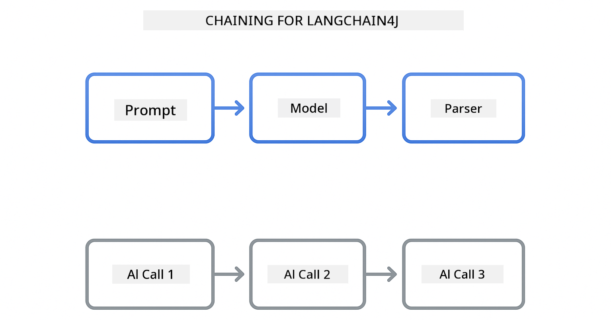
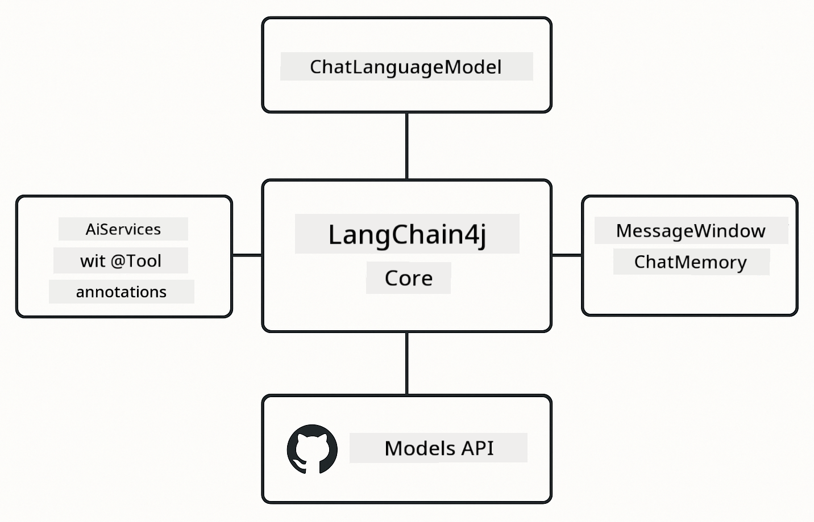

<!--
CO_OP_TRANSLATOR_METADATA:
{
  "original_hash": "377b3e3e6f8d02965bf0fbbc9ccb45c5",
  "translation_date": "2025-12-13T15:30:48+00:00",
  "source_file": "00-quick-start/README.md",
  "language_code": "pcm"
}
-->
# Module 00: Quick Start

## Table of Contents

- [Introduction](../../../00-quick-start)
- [Wet na LangChain4j?](../../../00-quick-start)
- [LangChain4j Dependencies](../../../00-quick-start)
- [Prerequisites](../../../00-quick-start)
- [Setup](../../../00-quick-start)
  - [1. Get Your GitHub Token](../../../00-quick-start)
  - [2. Set Your Token](../../../00-quick-start)
- [Run the Examples](../../../00-quick-start)
  - [1. Basic Chat](../../../00-quick-start)
  - [2. Prompt Patterns](../../../00-quick-start)
  - [3. Function Calling](../../../00-quick-start)
  - [4. Document Q&A (RAG)](../../../00-quick-start)
- [Wet Each Example Dey Show](../../../00-quick-start)
- [Next Steps](../../../00-quick-start)
- [Troubleshooting](../../../00-quick-start)

## Introduction

Dis quickstart na to make you fit start use LangChain4j sharp sharp. E cover di basic tins wey you need sabi to build AI apps wit LangChain4j and GitHub Models. For di next modules, you go use Azure OpenAI wit LangChain4j to build beta apps.

## Wet na LangChain4j?

LangChain4j na Java library wey make e easy to build AI-powered apps. Instead make you dey deal wit HTTP clients and JSON parsing, you go dey use clean Java APIs.

Di "chain" for LangChain mean say you fit join plenty components together - you fit join prompt to model to parser, or join many AI calls where one output go become next input. Dis quick start na to teach di basics before you go enter complex chains.



*Chaining components for LangChain4j - building blocks wey connect to create strong AI workflows*

We go use three main components:

**ChatLanguageModel** - Na di interface for AI model interactions. You go call `model.chat("prompt")` and e go give you response string. We dey use `OpenAiOfficialChatModel` wey dey work wit OpenAI-compatible endpoints like GitHub Models.

**AiServices** - E dey create type-safe AI service interfaces. You go define methods, put `@Tool` annotation for dem, and LangChain4j go handle di orchestration. Di AI go automatically call your Java methods when e need am.

**MessageWindowChatMemory** - E dey keep conversation history. Without am, each request na separate one. Wit am, di AI go remember previous messages and keep context for many turns.



*LangChain4j architecture - main components wey dey work together to power your AI apps*

## LangChain4j Dependencies

Dis quick start dey use two Maven dependencies for di [`pom.xml`](../../../00-quick-start/pom.xml):

```xml
<!-- Core LangChain4j library -->
<dependency>
    <groupId>dev.langchain4j</groupId>
    <artifactId>langchain4j</artifactId> <!-- Inherited from BOM in root pom.xml -->
</dependency>

<!-- OpenAI integration (works with GitHub Models) -->
<dependency>
    <groupId>dev.langchain4j</groupId>
    <artifactId>langchain4j-open-ai-official</artifactId> <!-- Inherited from BOM in root pom.xml -->
</dependency>
```

Di `langchain4j-open-ai-official` module dey provide di `OpenAiOfficialChatModel` class wey connect to OpenAI-compatible APIs. GitHub Models dey use di same API format, so no special adapter dey needed - just point di base URL to `https://models.github.ai/inference`.

## Prerequisites

**You dey use Dev Container?** Java and Maven don already dey installed. You only need GitHub Personal Access Token.

**Local Development:**
- Java 21+, Maven 3.9+
- GitHub Personal Access Token (instructions dey below)

> **Note:** Dis module dey use `gpt-4.1-nano` from GitHub Models. No change di model name for di code - e don set to work wit GitHub models wey dey available.

## Setup

### 1. Get Your GitHub Token

1. Go [GitHub Settings → Personal Access Tokens](https://github.com/settings/personal-access-tokens)
2. Click "Generate new token"
3. Put descriptive name (e.g., "LangChain4j Demo")
4. Set expiration (7 days na beta)
5. Under "Account permissions", find "Models" and set am to "Read-only"
6. Click "Generate token"
7. Copy and save your token - you no go see am again

### 2. Set Your Token

**Option 1: Using VS Code (Recommended)**

If you dey use VS Code, add your token to di `.env` file for project root:

If `.env` file no dey, copy `.env.example` to `.env` or create new `.env` file for project root.

**Example `.env` file:**
```bash
# Inside /workspaces/LangChain4j-for-Beginners/.env
GITHUB_TOKEN=your_token_here
```

Then you fit just right-click any demo file (e.g., `BasicChatDemo.java`) for Explorer and select **"Run Java"** or use launch configurations from Run and Debug panel.

**Option 2: Using Terminal**

Set di token as environment variable:

**Bash:**
```bash
export GITHUB_TOKEN=your_token_here
```

**PowerShell:**
```powershell
$env:GITHUB_TOKEN=your_token_here
```

## Run the Examples

**Using VS Code:** Just right-click any demo file for Explorer and select **"Run Java"**, or use launch configurations from Run and Debug panel (make sure say you don add your token to `.env` file first).

**Using Maven:** Or you fit run from command line:

### 1. Basic Chat

**Bash:**
```bash
mvn compile exec:java -Dexec.mainClass=com.example.langchain4j.quickstart.BasicChatDemo
```

**PowerShell:**
```powershell
mvn --% compile exec:java -Dexec.mainClass=com.example.langchain4j.quickstart.BasicChatDemo
```

### 2. Prompt Patterns

**Bash:**
```bash
mvn compile exec:java -Dexec.mainClass=com.example.langchain4j.quickstart.PromptEngineeringDemo
```

**PowerShell:**
```powershell
mvn --% compile exec:java -Dexec.mainClass=com.example.langchain4j.quickstart.PromptEngineeringDemo
```

E dey show zero-shot, few-shot, chain-of-thought, and role-based prompting.

### 3. Function Calling

**Bash:**
```bash
mvn compile exec:java -Dexec.mainClass=com.example.langchain4j.quickstart.ToolIntegrationDemo
```

**PowerShell:**
```powershell
mvn --% compile exec:java -Dexec.mainClass=com.example.langchain4j.quickstart.ToolIntegrationDemo
```

AI go automatically call your Java methods when e need am.

### 4. Document Q&A (RAG)

**Bash:**
```bash
mvn compile exec:java -Dexec.mainClass=com.example.langchain4j.quickstart.SimpleReaderDemo
```

**PowerShell:**
```powershell
mvn --% compile exec:java -Dexec.mainClass=com.example.langchain4j.quickstart.SimpleReaderDemo
```

Ask questions about wet dey inside `document.txt`.

## Wet Each Example Dey Show

**Basic Chat** - [BasicChatDemo.java](../../../00-quick-start/src/main/java/com/example/langchain4j/quickstart/BasicChatDemo.java)

Start here to see LangChain4j for e simplest form. You go create `OpenAiOfficialChatModel`, send prompt wit `.chat()`, and get response back. Dis one dey show di foundation: how to initialize models wit custom endpoints and API keys. Once you sabi dis pattern, everything else go build on top.

```java
ChatLanguageModel model = OpenAiOfficialChatModel.builder()
    .baseUrl("https://models.github.ai/inference")
    .apiKey(System.getenv("GITHUB_TOKEN"))
    .modelName("gpt-4.1-nano")
    .build();

String response = model.chat("What is LangChain4j?");
System.out.println(response);
```

> **🤖 Try wit [GitHub Copilot](https://github.com/features/copilot) Chat:** Open [`BasicChatDemo.java`](../../../00-quick-start/src/main/java/com/example/langchain4j/quickstart/BasicChatDemo.java) and ask:
> - "How I go switch from GitHub Models to Azure OpenAI for dis code?"
> - "Wetin be other parameters wey I fit configure for OpenAiOfficialChatModel.builder()?"
> - "How I go add streaming responses instead of waiting for full response?"

**Prompt Engineering** - [PromptEngineeringDemo.java](../../../00-quick-start/src/main/java/com/example/langchain4j/quickstart/PromptEngineeringDemo.java)

Now wey you sabi how to talk to model, make we check wet you dey talk. Dis demo dey use same model setup but e show four different prompting patterns. Try zero-shot prompts for direct instructions, few-shot prompts wey learn from examples, chain-of-thought prompts wey show reasoning steps, and role-based prompts wey set context. You go see how same model fit give different results based on how you frame your request.

```java
PromptTemplate template = PromptTemplate.from(
    "What's the best time to visit {{destination}} for {{activity}}?"
);

Prompt prompt = template.apply(Map.of(
    "destination", "Paris",
    "activity", "sightseeing"
));

String response = model.chat(prompt.text());
```

> **🤖 Try wit [GitHub Copilot](https://github.com/features/copilot) Chat:** Open [`PromptEngineeringDemo.java`](../../../00-quick-start/src/main/java/com/example/langchain4j/quickstart/PromptEngineeringDemo.java) and ask:
> - "Wetin be difference between zero-shot and few-shot prompting, and when I suppose use each?"
> - "How temperature parameter dey affect model responses?"
> - "Wetin be some ways to stop prompt injection attacks for production?"
> - "How I fit create reusable PromptTemplate objects for common patterns?"

**Tool Integration** - [ToolIntegrationDemo.java](../../../00-quick-start/src/main/java/com/example/langchain4j/quickstart/ToolIntegrationDemo.java)

Na here LangChain4j dey powerful. You go use `AiServices` to create AI assistant wey fit call your Java methods. Just put `@Tool("description")` annotation for methods and LangChain4j go handle di rest - AI go automatically decide when to use each tool based on wet user ask. Dis one dey show function calling, key technique to build AI wey fit take action, no be only answer questions.

```java
@Tool("Performs addition of two numeric values")
public double add(double a, double b) {
    return a + b;
}

MathAssistant assistant = AiServices.create(MathAssistant.class, model);
String response = assistant.chat("What is 25 plus 17?");
```

> **🤖 Try wit [GitHub Copilot](https://github.com/features/copilot) Chat:** Open [`ToolIntegrationDemo.java`](../../../00-quick-start/src/main/java/com/example/langchain4j/quickstart/ToolIntegrationDemo.java) and ask:
> - "How @Tool annotation dey work and wet LangChain4j dey do wit am behind di scenes?"
> - "Fit AI call many tools one after di other to solve complex problems?"
> - "Wetin happen if tool throw exception - how I suppose handle errors?"
> - "How I go integrate real API instead of dis calculator example?"

**Document Q&A (RAG)** - [SimpleReaderDemo.java](../../../00-quick-start/src/main/java/com/example/langchain4j/quickstart/SimpleReaderDemo.java)

Here you go see di foundation of RAG (retrieval-augmented generation). Instead make you rely on model training data, you go load content from [`document.txt`](../../../00-quick-start/document.txt) and put am inside prompt. AI go answer based on your document, no be im general knowledge. Dis na first step to build systems wey fit work wit your own data.

```java
Document document = FileSystemDocumentLoader.loadDocument("document.txt");
String content = document.text();

String prompt = "Based on this document: " + content + 
                "\nQuestion: What is the main topic?";
String response = model.chat(prompt);
```

> **Note:** Dis simple way dey load whole document inside prompt. For big files (>10KB), you go pass context limits. Module 03 go cover chunking and vector search for production RAG systems.

> **🤖 Try wit [GitHub Copilot](https://github.com/features/copilot) Chat:** Open [`SimpleReaderDemo.java`](../../../00-quick-start/src/main/java/com/example/langchain4j/quickstart/SimpleReaderDemo.java) and ask:
> - "How RAG dey prevent AI hallucinations compared to using model training data?"
> - "Wetin be difference between dis simple way and using vector embeddings for retrieval?"
> - "How I go scale dis to handle many documents or bigger knowledge bases?"
> - "Wetin be best practices to structure prompt to make sure AI use only di context wey you provide?"

## Debugging

Di examples get `.logRequests(true)` and `.logResponses(true)` to show API calls for console. Dis go help troubleshoot authentication errors, rate limits, or unexpected responses. Remove dis flags for production to reduce log noise.

## Next Steps

**Next Module:** [01-introduction - Getting Started with LangChain4j and gpt-5 on Azure](../01-introduction/README.md)

---

**Navigation:** [← Back to Main](../README.md) | [Next: Module 01 - Introduction →](../01-introduction/README.md)

---

## Troubleshooting

### First-Time Maven Build

**Issue**: First time `mvn clean compile` or `mvn package` go take long time (10-15 minutes)

**Cause**: Maven need download all project dependencies (Spring Boot, LangChain4j libraries, Azure SDKs, etc.) for first build.

**Solution**: Dis na normal behavior. Next builds go fast well well as dependencies go dey cached locally. Download time depend on your network speed.

### PowerShell Maven Command Syntax

**Issue**: Maven commands dey fail wit error `Unknown lifecycle phase ".mainClass=..."`

**Cause**: PowerShell dey interpret `=` as variable assignment operator, e dey break Maven property syntax

**Solution**: Use stop-parsing operator `--%` before Maven command:

**PowerShell:**
```powershell
mvn --% compile exec:java -Dexec.mainClass=com.example.langchain4j.quickstart.BasicChatDemo
```

**Bash:**
```bash
mvn compile exec:java -Dexec.mainClass=com.example.langchain4j.quickstart.BasicChatDemo
```

Di `--%` operator dey tell PowerShell to pass all remaining arguments literally to Maven without interpretation.

### Windows PowerShell Emoji Display

**Issue**: AI responses dey show garbage characters (e.g., `????` or `â??`) instead of emojis for PowerShell

**Cause**: PowerShell default encoding no support UTF-8 emojis

**Solution**: Run dis command before you run Java apps:
```cmd
chcp 65001
```

Dis one go force UTF-8 encoding for terminal. Alternatively, use Windows Terminal wey get better Unicode support.

---

<!-- CO-OP TRANSLATOR DISCLAIMER START -->
**Disclaimer**:
Dis document don translate wit AI translation service [Co-op Translator](https://github.com/Azure/co-op-translator). Even though we dey try make am correct, abeg sabi say automated translation fit get some mistakes or no too correct. Di original document wey e dey for im own language na di correct one. If na serious matter, e better make human professional translate am. We no go responsible for any misunderstanding or wrong meaning wey fit come from dis translation.
<!-- CO-OP TRANSLATOR DISCLAIMER END -->