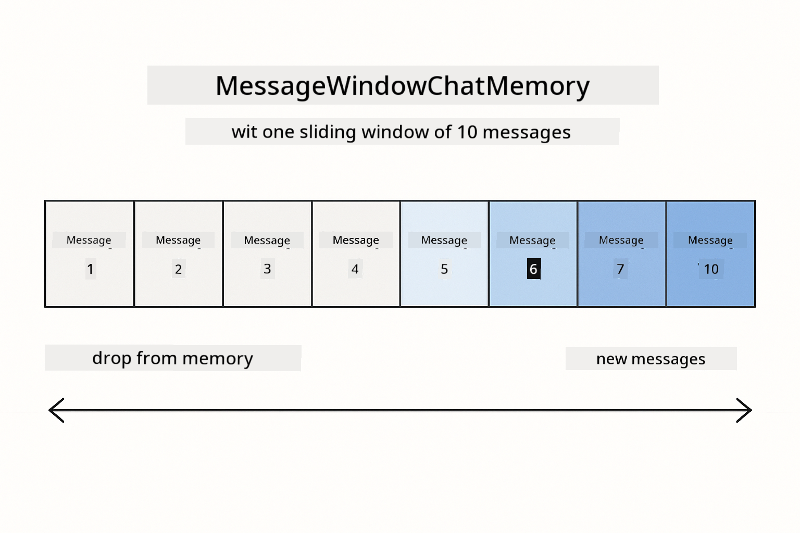
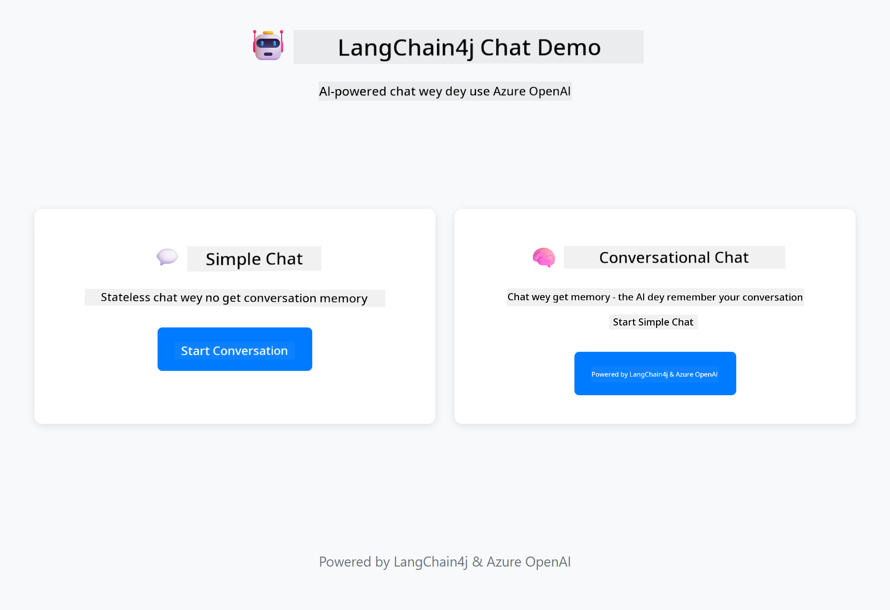
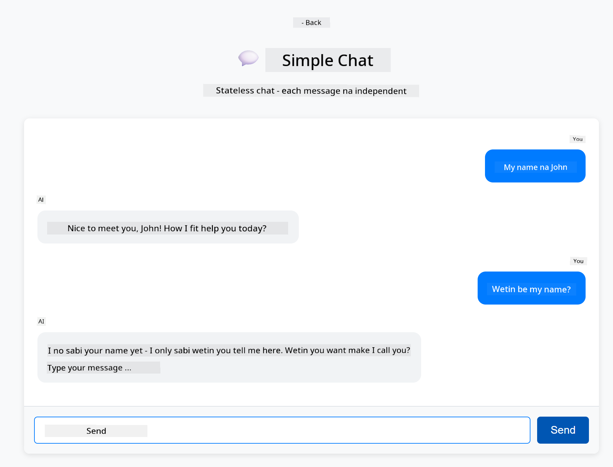
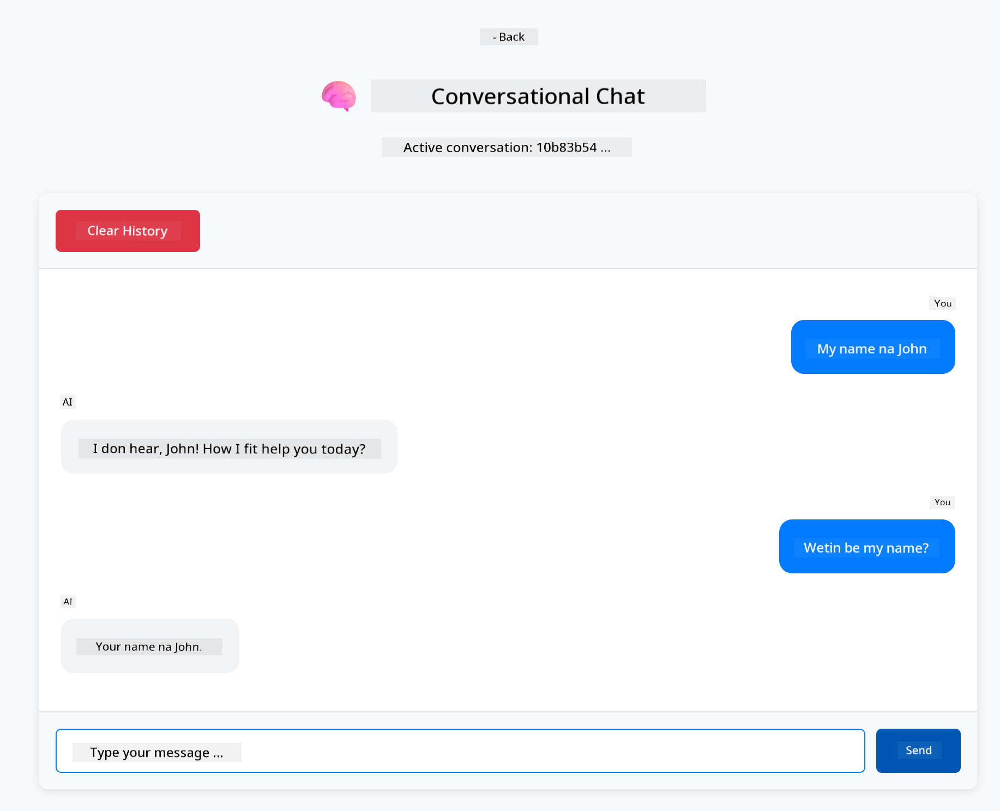

<!--
CO_OP_TRANSLATOR_METADATA:
{
  "original_hash": "c3e07ca58d0b8a3f47d3bf5728541e0a",
  "translation_date": "2025-12-13T14:19:26+00:00",
  "source_file": "01-introduction/README.md",
  "language_code": "pcm"
}
-->
# Module 01: Getting Started with LangChain4j

## Table of Contents

- [Wetyn You Go Learn](../../../01-introduction)
- [Wetyn You Need Before](../../../01-introduction)
- [Understanding the Core Problem](../../../01-introduction)
- [Understanding Tokens](../../../01-introduction)
- [How Memory Dey Work](../../../01-introduction)
- [How This One Dey Use LangChain4j](../../../01-introduction)
- [Deploy Azure OpenAI Infrastructure](../../../01-introduction)
- [Run the Application Locally](../../../01-introduction)
- [Using the Application](../../../01-introduction)
  - [Stateless Chat (Left Panel)](../../../01-introduction)
  - [Stateful Chat (Right Panel)](../../../01-introduction)
- [Next Steps](../../../01-introduction)

## Wetyn You Go Learn

If you don finish the quick start, you don see how to send prompts and get responses. Na dat be the foundation, but real applications need more. This module go teach you how to build conversational AI wey dey remember context and dey maintain state - na the difference between one-time demo and production-ready application.

We go use Azure OpenAI GPT-5 throughout this guide because e get advanced reasoning skills wey make the behavior of different patterns clear. When you add memory, you go clearly see the difference. This one go make am easy to understand wetin each component dey bring to your application.

You go build one application wey go show both patterns:

**Stateless Chat** - Every request na independent. The model no get memory of previous messages. Na the pattern wey you use for the quick start.

**Stateful Conversation** - Every request get conversation history. The model dey maintain context across many turns. Na wetin production applications need.

## Wetyn You Need Before

- Azure subscription wey get Azure OpenAI access
- Java 21, Maven 3.9+ 
- Azure CLI (https://learn.microsoft.com/en-us/cli/azure/install-azure-cli)
- Azure Developer CLI (azd) (https://learn.microsoft.com/en-us/azure/developer/azure-developer-cli/install-azd)

> **Note:** Java, Maven, Azure CLI and Azure Developer CLI (azd) don already dey installed for the devcontainer wey dem provide.

> **Note:** This module dey use GPT-5 for Azure OpenAI. The deployment dey configured automatically with `azd up` - no change the model name for the code.

## Understanding the Core Problem

Language models no get state. Every API call na independent. If you send "My name is John" then ask "What's my name?", the model no go sabi say you just introduce yourself. E go treat every request like na the first conversation wey you ever get.

This one good for simple Q&A but e no work for real applications. Customer service bots need to remember wetin you talk. Personal assistants need context. Any multi-turn conversation need memory.


*The difference between stateless (independent calls) and stateful (context-aware) conversations*

## Understanding Tokens

Before you enter conversations, e important to understand tokens - na the basic units of text wey language models dey process:


*Example of how text dey break into tokens - "I love AI!" become 4 separate processing units*

Tokens na how AI models dey measure and process text. Words, punctuation, and even spaces fit be tokens. Your model get limit on how many tokens e fit process at once (400,000 for GPT-5, with up to 272,000 input tokens and 128,000 output tokens). Understanding tokens go help you manage conversation length and costs.

## How Memory Dey Work

Chat memory dey solve the stateless problem by maintaining conversation history. Before you send your request to the model, the framework go add relevant previous messages front. When you ask "What's my name?", the system go actually send the whole conversation history, so the model fit see say you talk "My name is John" before.

LangChain4j get memory implementations wey dey handle this automatically. You go choose how many messages to keep and the framework go manage the context window.



*MessageWindowChatMemory dey maintain sliding window of recent messages, e dey automatically drop old ones*

## How This One Dey Use LangChain4j

This module extend the quick start by joining Spring Boot and adding conversation memory. Na so the pieces dey fit together:

**Dependencies** - Add two LangChain4j libraries:

```xml
<dependency>
    <groupId>dev.langchain4j</groupId>
    <artifactId>langchain4j</artifactId> <!-- Inherited from BOM in root pom.xml -->
</dependency>
<dependency>
    <groupId>dev.langchain4j</groupId>
    <artifactId>langchain4j-open-ai-official</artifactId> <!-- Inherited from BOM in root pom.xml -->
</dependency>
```

**Chat Model** - Configure Azure OpenAI as Spring bean ([LangChainConfig.java](../../../01-introduction/src/main/java/com/example/langchain4j/config/LangChainConfig.java)):

```java
@Bean
public OpenAiOfficialChatModel openAiOfficialChatModel() {
    return OpenAiOfficialChatModel.builder()
            .baseUrl(azureEndpoint)
            .apiKey(azureApiKey)
            .modelName(deploymentName)
            .timeout(Duration.ofMinutes(5))
            .maxRetries(3)
            .build();
}
```

The builder dey read credentials from environment variables wey `azd up` set. Setting `baseUrl` to your Azure endpoint make the OpenAI client work with Azure OpenAI.

**Conversation Memory** - Track chat history with MessageWindowChatMemory ([ConversationService.java](../../../01-introduction/src/main/java/com/example/langchain4j/service/ConversationService.java)):

```java
ChatMemory memory = MessageWindowChatMemory.withMaxMessages(10);

memory.add(UserMessage.from("My name is John"));
memory.add(AiMessage.from("Nice to meet you, John!"));

memory.add(UserMessage.from("What's my name?"));
AiMessage aiMessage = chatModel.chat(memory.messages()).aiMessage();
memory.add(aiMessage);
```

Create memory with `withMaxMessages(10)` to keep the last 10 messages. Add user and AI messages with typed wrappers: `UserMessage.from(text)` and `AiMessage.from(text)`. Retrieve history with `memory.messages()` and send am to the model. The service dey store separate memory instances per conversation ID, so multiple users fit chat at the same time.

> **🤖 Try with [GitHub Copilot](https://github.com/features/copilot) Chat:** Open [`ConversationService.java`](../../../01-introduction/src/main/java/com/example/langchain4j/service/ConversationService.java) and ask:
> - "How MessageWindowChatMemory dey decide which messages to drop when the window full?"
> - "Fit I implement custom memory storage using database instead of in-memory?"
> - "How I go add summarization to compress old conversation history?"

The stateless chat endpoint no use memory at all - just `chatModel.chat(prompt)` like the quick start. The stateful endpoint dey add messages to memory, retrieve history, and include that context with every request. Same model configuration, different patterns.

## Deploy Azure OpenAI Infrastructure

**Bash:**
```bash
cd 01-introduction
azd up  # Chọs subscription and location (eastus2 na di best)
```

**PowerShell:**
```powershell
cd 01-introduction
azd up  # Chọs subscription and location (eastus2 na di best)
```

> **Note:** If you see timeout error (`RequestConflict: Cannot modify resource ... provisioning state is not terminal`), just run `azd up` again. Azure resources fit still dey provision for background, and retrying go allow deployment to finish once resources reach terminal state.

This one go:
1. Deploy Azure OpenAI resource with GPT-5 and text-embedding-3-small models
2. Automatically generate `.env` file for project root with credentials
3. Set up all required environment variables

**Get deployment wahala?** Check [Infrastructure README](infra/README.md) for detailed troubleshooting including subdomain name conflicts, manual Azure Portal deployment steps, and model configuration tips.

**Verify deployment succeed:**

**Bash:**
```bash
cat ../.env  # E suppose show AZURE_OPENAI_ENDPOINT, API_KEY, and oda tins.
```

**PowerShell:**
```powershell
Get-Content ..\.env  # E suppose show AZURE_OPENAI_ENDPOINT, API_KEY, and oda tins.
```

> **Note:** The `azd up` command dey automatically generate `.env` file. If you need update am later, you fit either edit `.env` file manually or regenerate am by running:
>
> **Bash:**
> ```bash
> cd ..
> bash .azd-env.sh
> ```
>
> **PowerShell:**
> ```powershell
> cd ..
> .\.azd-env.ps1
> ```

## Run the Application Locally

**Verify deployment:**

Make sure `.env` file dey root directory with Azure credentials:

**Bash:**
```bash
cat ../.env  # E suppose show AZURE_OPENAI_ENDPOINT, API_KEY, DEPLOYMENT
```

**PowerShell:**
```powershell
Get-Content ..\.env  # E suppose show AZURE_OPENAI_ENDPOINT, API_KEY, DEPLOYMENT
```

**Start the applications:**

**Option 1: Using Spring Boot Dashboard (Recommended for VS Code users)**

The dev container get Spring Boot Dashboard extension, wey dey provide visual interface to manage all Spring Boot applications. You fit find am for Activity Bar for left side of VS Code (look for Spring Boot icon).

From Spring Boot Dashboard, you fit:
- See all available Spring Boot applications for workspace
- Start/stop applications with one click
- View application logs in real-time
- Monitor application status

Just click the play button beside "introduction" to start this module, or start all modules at once.


**Option 2: Using shell scripts**

Start all web applications (modules 01-04):

**Bash:**
```bash
cd ..  # From root directory
./start-all.sh
```

**PowerShell:**
```powershell
cd ..  # From root directory
.\start-all.ps1
```

Or start just this module:

**Bash:**
```bash
cd 01-introduction
./start.sh
```

**PowerShell:**
```powershell
cd 01-introduction
.\start.ps1
```

Both scripts dey automatically load environment variables from root `.env` file and go build the JARs if dem no dey.

> **Note:** If you want build all modules manually before you start:
>
> **Bash:**
> ```bash
> cd ..  # Go to root directory
> mvn clean package -DskipTests
> ```
>
> **PowerShell:**
> ```powershell
> cd ..  # Go to root directory
> mvn clean package -DskipTests
> ```

Open http://localhost:8080 for your browser.

**To stop:**

**Bash:**
```bash
./stop.sh  # Dis module only
# Or
cd .. && ./stop-all.sh  # All di modules
```

**PowerShell:**
```powershell
.\stop.ps1  # Dis module only
# Or
cd ..; .\stop-all.ps1  # All di modules
```

## Using the Application

The application get web interface with two chat implementations side-by-side.



*Dashboard wey show both Simple Chat (stateless) and Conversational Chat (stateful) options*

### Stateless Chat (Left Panel)

Try this one first. Ask "My name is John" then immediately ask "What's my name?" The model no go remember because every message na independent. This one dey show the core problem with basic language model integration - no conversation context.



*AI no remember your name from the previous message*

### Stateful Chat (Right Panel)

Now try the same thing here. Ask "My name is John" then "What's my name?" This time e remember. The difference na MessageWindowChatMemory - e dey maintain conversation history and include am with every request. Na so production conversational AI dey work.



*AI remember your name from earlier for the conversation*

Both panels dey use the same GPT-5 model. The only difference na memory. This one make am clear wetin memory dey bring to your application and why e important for real use cases.

## Next Steps

**Next Module:** [02-prompt-engineering - Prompt Engineering with GPT-5](../02-prompt-engineering/README.md)

---

**Navigation:** [← Previous: Module 00 - Quick Start](../00-quick-start/README.md) | [Back to Main](../README.md) | [Next: Module 02 - Prompt Engineering →](../02-prompt-engineering/README.md)

---

<!-- CO-OP TRANSLATOR DISCLAIMER START -->
**Disclaimer**:
Dis document don translate wit AI translation service [Co-op Translator](https://github.com/Azure/co-op-translator). Even though we dey try make am correct, abeg sabi say automated translation fit get some mistakes or no too correct. Di original document wey e dey for im own language na di correct one. If na serious matter, e better make human professional translate am. We no go responsible for any misunderstanding or wrong meaning wey fit come from dis translation.
<!-- CO-OP TRANSLATOR DISCLAIMER END -->