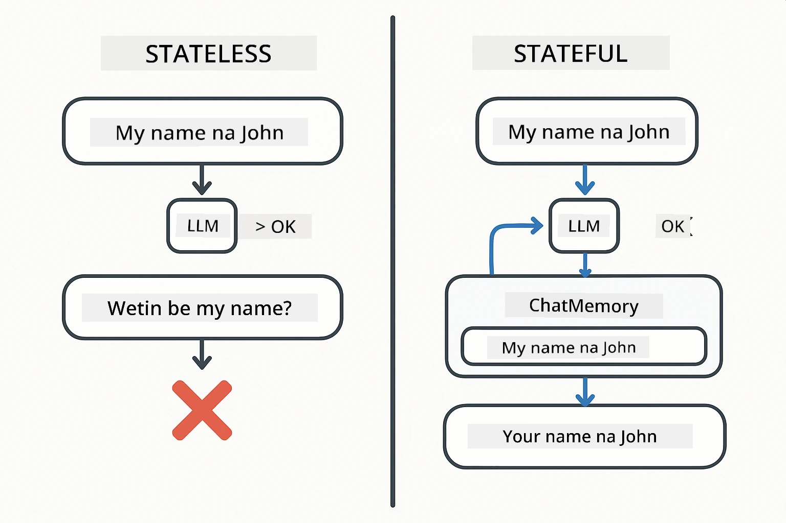
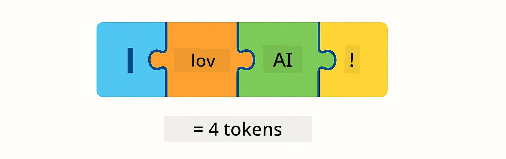
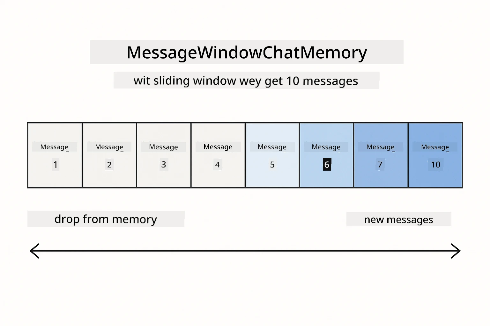
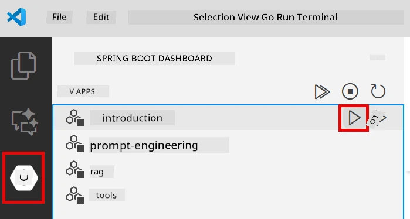
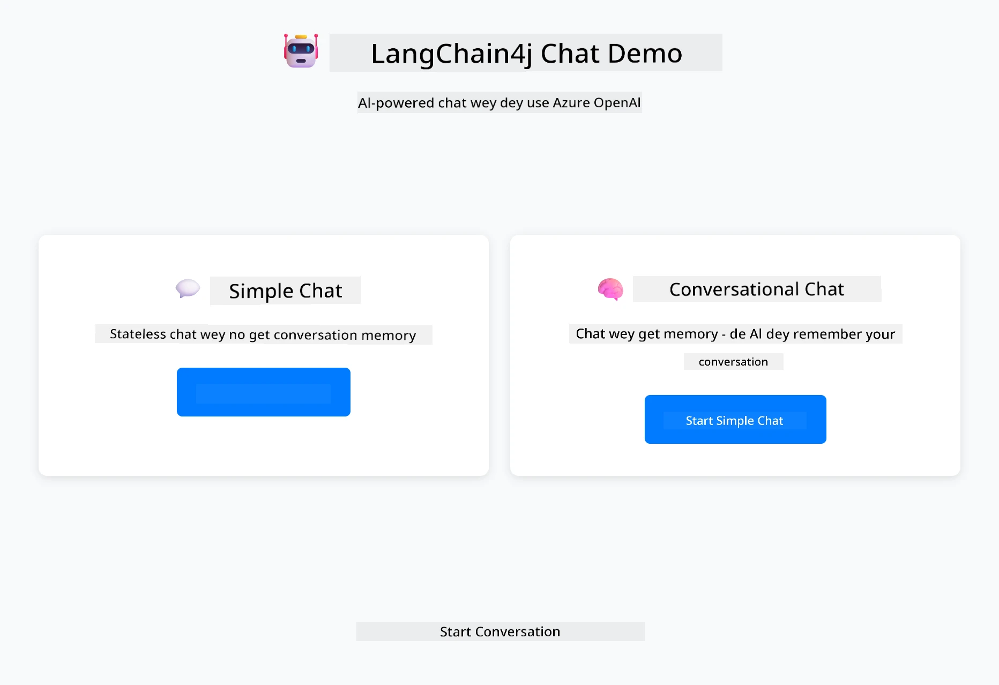
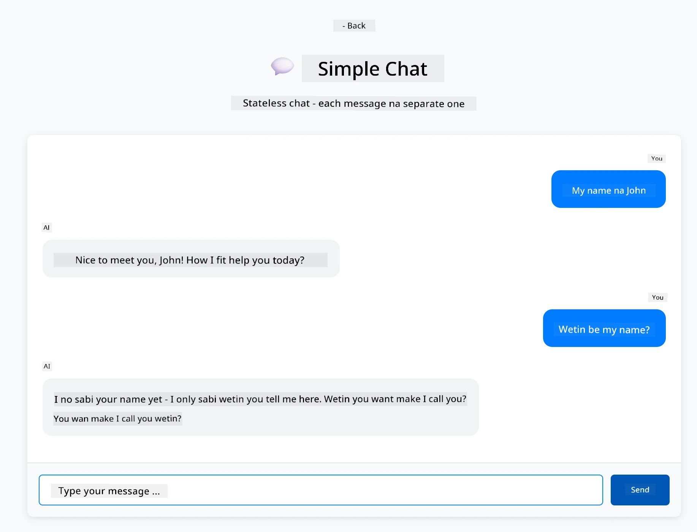
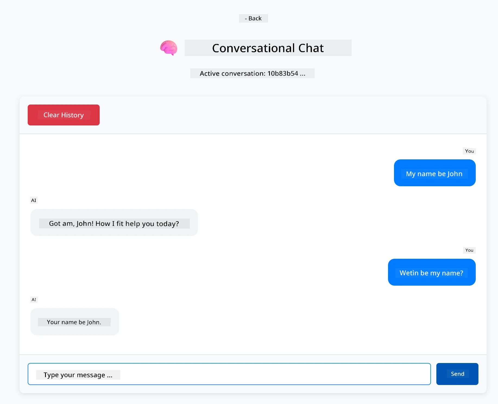

# Module 01: Getting Started wit LangChain4j

## Table of Contents

- [Video Walkthrough](#video-walkthrough)
- [Wetìn You Go Learn](#wetìn-you-go-learn)
- [Wetìn You Go Need](#wetìn-you-go-need)
- [Undastand Di Main Wahala](#undastand-di-main-wahala)
- [Undastand Tokens](#undastand-tokens)
- [How Memory Dey Work](#how-memory-dey-work)
- [How Dis One Take Use LangChain4j](#how-dis-one-take-use-langchain4j)
- [Deploy Azure OpenAI Infrastructure](#deploy-azure-openai-infrastructure)
- [Run Di Application for Your Local](#run-di-application-for-your-local)
- [How to Use Di Application](#how-to-use-di-application)
  - [Stateless Chat (Left Panel)](#stateless-chat-left-panel)
  - [Stateful Chat (Right Panel)](#stateful-chat-right-panel)
- [Wetìn to Do Next](#wetìn-to-do-next)

## Video Walkthrough

Watch dis live session wey explain how you go start wit dis module:

<a href="https://www.youtube.com/live/nl_troDm8rQ?si=6b85S8xGjWnT2fX9"></a>

## Wetìn You Go Learn

Dis na your start point wit LangChain4j and Azure OpenAI. We go start wit di basics and begin build production-style applications. Dis module na for conversational AI wey dey remember context and dey maintain state — di basic tins wey every later module go build on top.

We go use Azure OpenAI GPT-5.2 throughout dis guide because im strong reasoning fit make di different patterns clear well well. When you add memory, you go clearly sabi di difference. Dis one go make am easy to understand wetin each part dey bring to your application.

You go build one application wey go show both patterns:

**Stateless Chat** - Each request na separate tin. Di model no get memory of wetin you talk before. Na di simplest starting point be dis.

**Stateful Conversation** - Each request get conversation history join. Di model dey maintain context across plenty turns. Na wetin production applications need.

## Wetìn You Go Need

- Azure subscription wey get Azure OpenAI access
- Java 21, Maven 3.9+
- Azure CLI (https://learn.microsoft.com/en-us/cli/azure/install-azure-cli)
- Azure Developer CLI (azd) (https://learn.microsoft.com/en-us/azure/developer/azure-developer-cli/install-azd)

> **Note:** Java, Maven, Azure CLI and Azure Developer CLI (azd) don already dey inside di devcontainer wey dem provide.

> **Note:** Dis module dey use GPT-5.2 for Azure OpenAI. Di deployment dey automatic with `azd up` - no change di model name for di code.

## Undastand Di Main Wahala

Language models no get memory. Each API call na separate tin. If you send "My name is John" and then ask "What's my name?", di model no go sabi say you don yarn yourself before. E go treat every request like na di first conversation wey you don ever get.

Dis one good for simple Q&A but e no work for real applications. Customer service bots need to remember wetin you talk before. Personal assistants need context. Any multi-turn conversation need memory.

Di diagram wey follow below compare di two different ways — for left na stateless call wey dey forget your name; for right na stateful call wey get ChatMemory wey dey remember am.



*Di difference between stateless (calls wey independent) and stateful (calls wey sabi context) conversations*

## Undastand Tokens

Before you begin talk for conversation, e important to sabi tokens - di basic units of text wey language models dey use:



*Example how text dey break for tokens - "I love AI!" go be 4 separate processing units*

Tokens na how AI models take measure and process text. Words, punctuation, and even spaces fit be tokens. Your model get limit on how many tokens e fit process for one time (400,000 for GPT-5.2, wit up to 272,000 input tokens and 128,000 output tokens). To sabi tokens go help you manage conversation length and cost.

## How Memory Dey Work

Chat memory na di solution for di stateless wahala by maintaining conversation history. Before you send your request go di model, di framework go add previous messages wey dey relevant before di new one. When you ask "What's my name?", di system go send di whole conversation history, so di model go fit see say you don talk "My name is John" before.

LangChain4j dey provide memory implementations wey dey do dis one automatically. You go choose how many messages to keep and di framework go manage context window. Di diagram wey below show how MessageWindowChatMemory dey maintain sliding window of recent messages.



*MessageWindowChatMemory dey keep sliding window of recent messages, dey drop old ones automatically*

## How Dis One Take Use LangChain4j

Dis module join Spring Boot and add conversation memory. See how di parts dem link together:

**Dependencies** - Add two LangChain4j libraries:

```xml
<dependency>
    <groupId>dev.langchain4j</groupId>
    <artifactId>langchain4j</artifactId> <!-- Inherited from BOM in root pom.xml -->
</dependency>
<dependency>
    <groupId>dev.langchain4j</groupId>
    <artifactId>langchain4j-open-ai-official</artifactId> <!-- Inherited from BOM in root pom.xml -->
</dependency>
```

**Chat Model** - Configure Azure OpenAI as Spring bean ([LangChainConfig.java](../../../01-introduction/src/main/java/com/example/langchain4j/config/LangChainConfig.java)):

```java
@Bean
public OpenAiOfficialChatModel openAiOfficialChatModel() {
    return OpenAiOfficialChatModel.builder()
            .baseUrl(azureEndpoint)
            .apiKey(azureApiKey)
            .modelName(deploymentName)
            .timeout(Duration.ofMinutes(5))
            .maxRetries(3)
            .build();
}
```

Di builder go read credentials from environment variables wey `azd up` set. If you set `baseUrl` to your Azure endpoint, OpenAI client go work with Azure OpenAI.

**Conversation Memory** - Track chat history wit MessageWindowChatMemory ([ConversationService.java](../../../01-introduction/src/main/java/com/example/langchain4j/service/ConversationService.java)):

```java
ChatMemory memory = MessageWindowChatMemory.withMaxMessages(10);

memory.add(UserMessage.from("My name is John"));
memory.add(AiMessage.from("Nice to meet you, John!"));

memory.add(UserMessage.from("What's my name?"));
AiMessage aiMessage = chatModel.chat(memory.messages()).aiMessage();
memory.add(aiMessage);
```

Create memory wit `withMaxMessages(10)` to keep last 10 messages. Add user and AI messages wit typed wrappers: `UserMessage.from(text)` and `AiMessage.from(text)`. To get history, use `memory.messages()` and send am to di model. Di service dey store separate memory for each conversation ID, so multiple users fit dey chat at di same time.

> **🤖 Try wit [GitHub Copilot](https://github.com/features/copilot) Chat:** Open [`ConversationService.java`](../../../01-introduction/src/main/java/com/example/langchain4j/service/ConversationService.java) and ask:
> - "How MessageWindowChatMemory dey decide which messages to drop when window ful?"
> - "Fit I implement custom memory storage using database instead of memory?"
> - "How I go add summarization to compress old conversation history?"

Di stateless chat endpoint no use memory at all - na just `chatModel.chat(prompt)` like quick start. Di stateful endpoint add messages to memory, retrieve history, and join am with each request. Same model configuration, different patterns.

## Deploy Azure OpenAI Infrastructure

**Bash:**
```bash
cd 01-introduction
azd up  # Select subscription and location (eastus2 dem recommend)
```

**PowerShell:**
```powershell
cd 01-introduction
azd up  # Chọs subscription and location (eastus2 dey recommended)
```

> **Note:** If you see timeout error (`RequestConflict: Cannot modify resource ... provisioning state is not terminal`), jus run `azd up` again. Azure resources fit still dey provision inside background, to try again go allow di deployment finish when resource dem reach terminal state.

This one go:
1. Deploy Azure OpenAI resource wit GPT-5.2 and text-embedding-3-small models
2. Automatically generate `.env` file for project root wit credentials
3. Setup all required environment variables

**If deployment get problem?** Check [Infrastructure README](infra/README.md) for troubleshooting like subdomain name wahala, manual Azure Portal deployment steps, and model configuration guide.

**Make sure deployment succeed:**

**Bash:**
```bash
cat ../.env  # E suppose show AZURE_OPENAI_ENDPOINT, API_KEY, anoda tin dem.
```

**PowerShell:**
```powershell
Get-Content ..\.env  # E for show AZURE_OPENAI_ENDPOINT, API_KEY, etc.
```

> **Note:** `azd up` command dey automatically generate `.env` file. If you want update am later, you fit either edit `.env` file manual or regenerate am by running:
>
> **Bash:**
> ```bash
> cd ..
> bash .azd-env.sh
> ```
>
> **PowerShell:**
> ```powershell
> cd ..
> .\.azd-env.ps1
> ```

## Run Di Application for Your Local

**Make sure deployment ready:**

Ensure `.env` file dey root directory wit Azure credentials. Run dis from module directory (`01-introduction/`):

**Bash:**
```bash
cat ../.env  # E suppose show AZURE_OPENAI_ENDPOINT, API_KEY, DEPLOYMENT
```

**PowerShell:**
```powershell
Get-Content ..\.env  # E suppose show AZURE_OPENAI_ENDPOINT, API_KEY, DEPLOYMENT
```

**Start di applications:**

**Option 1: Using Spring Boot Dashboard (Better for VS Code users)**

Di dev container get Spring Boot Dashboard extension, wey go give you visual interface to manage all Spring Boot applications. You fit find am for Activity Bar wey dey left side of VS Code (look for Spring Boot icon).

From Spring Boot Dashboard, you fit:
- See all Spring Boot apps for workspace
- Start/stop applications wit one click
- View application logs live
- Monitor application status

Just click play button next to "introduction" to start dis module, or start all modules together.



*Spring Boot Dashboard for VS Code — start, stop, and monitor all modules for one place*

**Option 2: Using shell scripts**

Start all web applications (modules 01-04):

**Bash:**
```bash
cd ..  # From di root directory
./start-all.sh
```

**PowerShell:**
```powershell
cd ..  # From root directory
.\start-all.ps1
```

Or start only dis module:

**Bash:**
```bash
cd 01-introduction
./start.sh
```

**PowerShell:**
```powershell
cd 01-introduction
.\start.ps1
```

Both scripts go automatically load environment variables from root `.env` file, and go build JARs if dem never dey.

> **Note:** If you prefer build all modules yourself before you start:
>
> **Bash:**
> ```bash
> cd ..  # Go to root directory
> mvn clean package -DskipTests
> ```
>
> **PowerShell:**
> ```powershell
> cd ..  # Go to root directory
> mvn clean package -DskipTests
> ```

Open http://localhost:8080 for your browser.

**To stop:**

**Bash:**
```bash
./stop.sh  # Dis module only
# Or
cd .. && ./stop-all.sh  # All modules
```

**PowerShell:**
```powershell
.\stop.ps1  # Dis moduul only
# Or
cd ..; .\stop-all.ps1  # All moduuls
```

## How to Use Di Application

Di application get web interface wit two chat implementations side by side.



*Dashboard wey show both Simple Chat (stateless) and Conversational Chat (stateful) options*

### Stateless Chat (Left Panel)

Try dis one first. Ask "My name is John" then immediately ask "What's my name?" Di model no go remember because each message na different tin. Dis one show di core wahala with basic language model join - no conversation context.



*AI no remember your name from previous message*

### Stateful Chat (Right Panel)

Now try same thing here. Ask "My name is John" then "What's my name?" This time e remember. Di difference na MessageWindowChatMemory - e maintain conversation history and add am with each request. Na so production conversational AI dey work.



*AI dey remember your name from earlier conversation*

Both panels dey use same GPT-5.2 model. Di only difference na memory. Dis one clear how memory dey help your application and why e important for real use case dem.

## Wetìn to Do Next

**Next Module:** [02-prompt-engineering - Prompt Engineering wit GPT-5.2](../02-prompt-engineering/README.md)

---

**Navigation:** [← Back to Main](../README.md) | [Next: Module 02 - Prompt Engineering →](../02-prompt-engineering/README.md)

---

<!-- CO-OP TRANSLATOR DISCLAIMER START -->
**Disclaimer**:
Dis document don translate wit AI translation service [Co-op Translator](https://github.com/Azure/co-op-translator). Even tho we dey try make am correct, abeg make you know say automated translation fit get errors or mistakes. Di original document for dia own language na im be di correct source. For important info, make person wey sabi human translation do am. We no go responsible for any misunderstanding or wrong understanding wey fit happen because of dis translation.
<!-- CO-OP TRANSLATOR DISCLAIMER END -->