# Module 02: Prompt Engineering wit GPT-5

## Table of Contents

- [Wetyn You Go Learn](../../../02-prompt-engineering)
- [Prerequisites](../../../02-prompt-engineering)
- [Understanding Prompt Engineering](../../../02-prompt-engineering)
- [How This Uses LangChain4j](../../../02-prompt-engineering)
- [The Core Patterns](../../../02-prompt-engineering)
- [Using Existing Azure Resources](../../../02-prompt-engineering)
- [Application Screenshots](../../../02-prompt-engineering)
- [Exploring the Patterns](../../../02-prompt-engineering)
  - [Low vs High Eagerness](../../../02-prompt-engineering)
  - [Task Execution (Tool Preambles)](../../../02-prompt-engineering)
  - [Self-Reflecting Code](../../../02-prompt-engineering)
  - [Structured Analysis](../../../02-prompt-engineering)
  - [Multi-Turn Chat](../../../02-prompt-engineering)
  - [Step-by-Step Reasoning](../../../02-prompt-engineering)
  - [Constrained Output](../../../02-prompt-engineering)
- [Wetyn You Really Dey Learn](../../../02-prompt-engineering)
- [Next Steps](../../../02-prompt-engineering)

## Wetyn You Go Learn

For di previous module, you don see how memory dey enable conversational AI and you use GitHub Models for basic interactions. Now we go focus on how you dey ask questions - di prompts demself - using Azure OpenAI GPT-5. Di way wey you structure your prompts go affect di quality of di answers wey you go get.

We go use GPT-5 because e get reasoning control - you fit tell di model how much thinking e go do before e answer. Dis one dey make different prompting strategies clear and e go help you sabi when to use each approach. We go also benefit from Azure wey get less rate limits for GPT-5 compared to GitHub Models.

## Prerequisites

- You don finish Module 01 (Azure OpenAI resources don deploy)
- `.env` file dey root directory wit Azure credentials (wey `azd up` for Module 01 create)

> **Note:** If you never finish Module 01, abeg follow di deployment instructions wey dey there first.

## Understanding Prompt Engineering

Prompt engineering na about how you go design input text wey go always give you di results wey you need. E no be only to dey ask questions - na to structure di requests so di model go understand exactly wetin you want and how e go deliver am.

Think am like you dey give instruction to your colleague. "Fix di bug" no clear. "Fix di null pointer exception for UserService.java line 45 by adding null check" clear well well. Language models dey work like dat - specificity and structure matter.

## How This Uses LangChain4j

Dis module dey show advanced prompting patterns using di same LangChain4j foundation from previous modules, but e focus on prompt structure and reasoning control.


*How LangChain4j dey connect your prompts to Azure OpenAI GPT-5*

**Dependencies** - Module 02 dey use dis langchain4j dependencies wey dem define for `pom.xml`:
```xml
<dependency>
    <groupId>dev.langchain4j</groupId>
    <artifactId>langchain4j</artifactId> <!-- Inherited from BOM in root pom.xml -->
</dependency>
<dependency>
    <groupId>dev.langchain4j</groupId>
    <artifactId>langchain4j-open-ai-official</artifactId> <!-- Inherited from BOM in root pom.xml -->
</dependency>
```

**OpenAiOfficialChatModel Configuration** - [LangChainConfig.java](../../../02-prompt-engineering/src/main/java/com/example/langchain4j/prompts/config/LangChainConfig.java)

Di chat model na manually configured as Spring bean using di OpenAI Official client, wey support Azure OpenAI endpoints. Di main difference from Module 01 na how we dey structure di prompts wey we send to `chatModel.chat()`, no be di model setup itself.

**System and User Messages** - [Gpt5PromptService.java](../../../02-prompt-engineering/src/main/java/com/example/langchain4j/prompts/service/Gpt5PromptService.java)

LangChain4j dey separate message types for clarity. `SystemMessage` dey set di AI behavior and context (like "You be code reviewer"), while `UserMessage` get di actual request. Dis separation dey help you maintain consistent AI behavior for different user queries.

```java
SystemMessage systemMsg = SystemMessage.from(
    "You are a helpful Java programming expert."
);

UserMessage userMsg = UserMessage.from(
    "Explain what a List is in Java"
);

String response = chatModel.chat(systemMsg, userMsg);
```

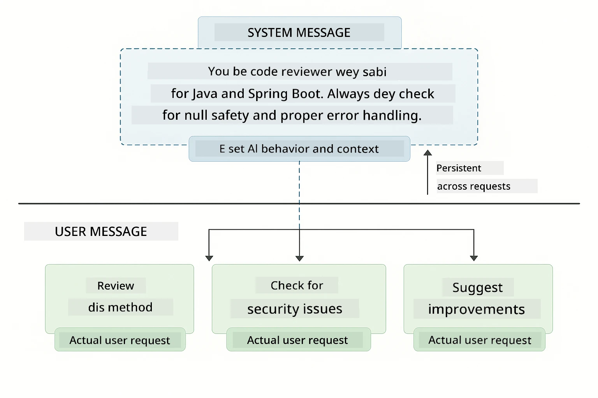

*SystemMessage dey provide persistent context while UserMessages get individual requests*

**MessageWindowChatMemory for Multi-Turn** - For di multi-turn conversation pattern, we dey reuse `MessageWindowChatMemory` from Module 01. Each session get im own memory instance wey dem store for `Map<String, ChatMemory>`, dis one dey allow multiple conversations to dey run at the same time without context mixing.

**Prompt Templates** - Di real focus here na prompt engineering, no be new LangChain4j APIs. Each pattern (low eagerness, high eagerness, task execution, etc.) dey use di same `chatModel.chat(prompt)` method but with carefully structured prompt strings. Di XML tags, instructions, and formatting na all part of di prompt text, no be LangChain4j features.

**Reasoning Control** - GPT-5 reasoning effort dey controlled through prompt instructions like "maximum 2 reasoning steps" or "explore thoroughly". Dem be prompt engineering techniques, no be LangChain4j configurations. Di library just dey deliver your prompts to di model.

Di main takeaway: LangChain4j dey provide di infrastructure (model connection via [LangChainConfig.java](../../../02-prompt-engineering/src/main/java/com/example/langchain4j/prompts/config/LangChainConfig.java), memory, message handling via [Gpt5PromptService.java](../../../02-prompt-engineering/src/main/java/com/example/langchain4j/prompts/service/Gpt5PromptService.java)), while dis module dey teach you how to craft effective prompts inside dat infrastructure.

## The Core Patterns

No be all problems need di same approach. Some questions need quick answers, others need deep thinking. Some need visible reasoning, others just need results. Dis module cover eight prompting patterns - each one optimized for different scenarios. You go try all of dem to learn when each approach dey work best.

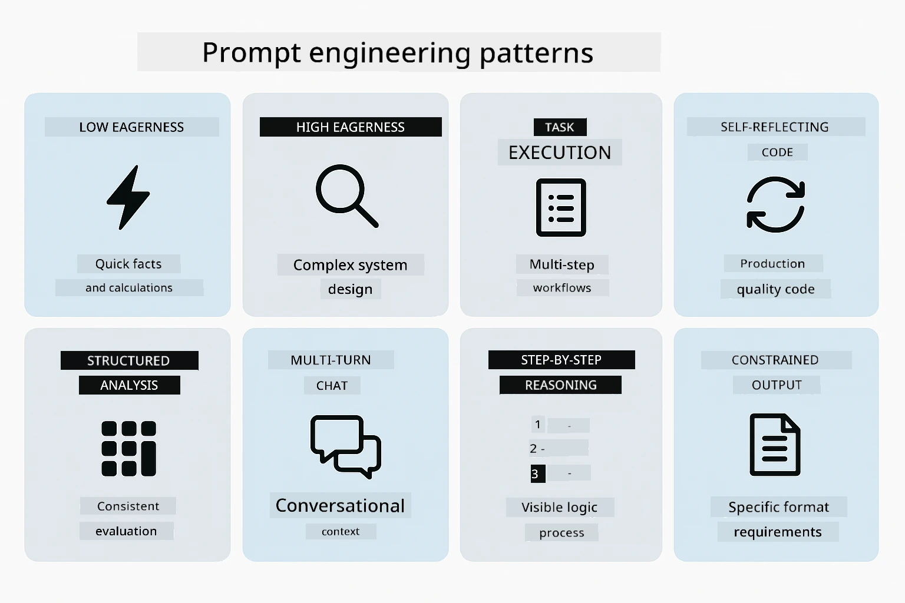

*Overview of di eight prompt engineering patterns and their use cases*

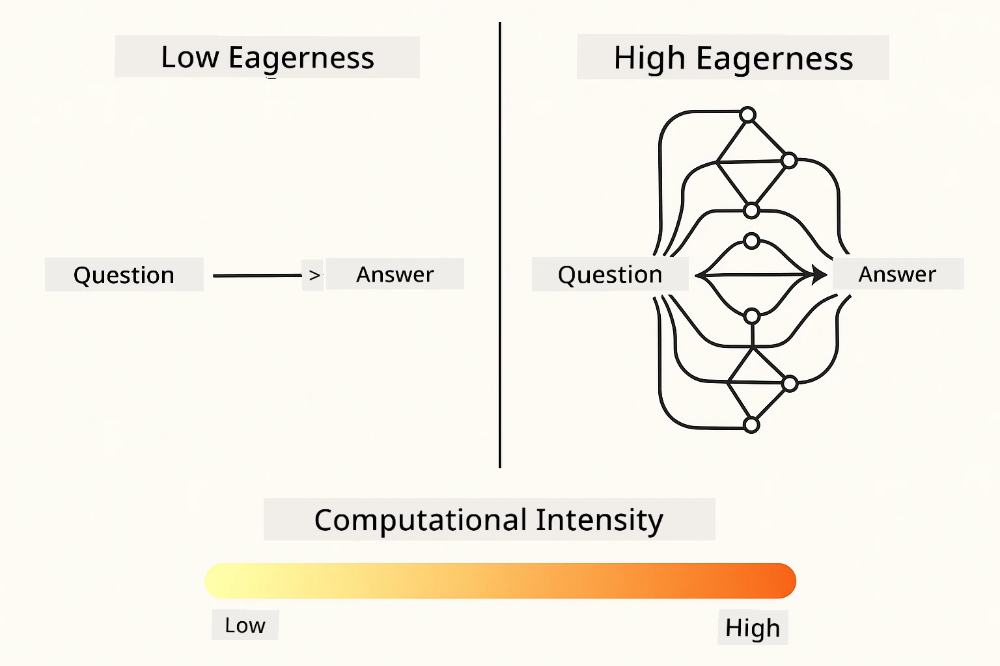

*Low eagerness (fast, direct) vs High eagerness (thorough, exploratory) reasoning approaches*

**Low Eagerness (Quick & Focused)** - For simple questions wey you want fast, direct answers. Di model dey do minimal reasoning - maximum 2 steps. Use dis one for calculations, lookups, or straightforward questions.

```java
String prompt = """
    <reasoning_effort>low</reasoning_effort>
    <instruction>maximum 2 reasoning steps</instruction>
    
    What is 15% of 200?
    """;

String response = chatModel.chat(prompt);
```

> 💡 **Explore wit GitHub Copilot:** Open [`Gpt5PromptService.java`](../../../02-prompt-engineering/src/main/java/com/example/langchain4j/prompts/service/Gpt5PromptService.java) and ask:
> - "Wetyn be di difference between low eagerness and high eagerness prompting patterns?"
> - "How di XML tags for prompts dey help structure di AI response?"
> - "When I suppose use self-reflection patterns vs direct instruction?"

**High Eagerness (Deep & Thorough)** - For complex problems wey you want comprehensive analysis. Di model go explore well well and show detailed reasoning. Use dis one for system design, architecture decisions, or complex research.

```java
String prompt = """
    <reasoning_effort>high</reasoning_effort>
    <instruction>explore thoroughly, show detailed reasoning</instruction>
    
    Design a caching strategy for a high-traffic REST API.
    """;

String response = chatModel.chat(prompt);
```

**Task Execution (Step-by-Step Progress)** - For multi-step workflows. Di model go provide upfront plan, narrate each step as e dey work, then give summary. Use dis one for migrations, implementations, or any multi-step process.

```java
String prompt = """
    <task>Create a REST endpoint for user registration</task>
    <preamble>Provide an upfront plan</preamble>
    <narration>Narrate each step as you work</narration>
    <summary>Summarize what was accomplished</summary>
    """;

String response = chatModel.chat(prompt);
```

Chain-of-Thought prompting dey explicitly ask di model to show im reasoning process, e dey improve accuracy for complex tasks. Di step-by-step breakdown dey help both humans and AI understand di logic.

> **🤖 Try wit [GitHub Copilot](https://github.com/features/copilot) Chat:** Ask about dis pattern:
> - "How I go adapt di task execution pattern for long-running operations?"
> - "Wetin be best practices for structuring tool preambles for production applications?"
> - "How I fit capture and display intermediate progress updates for UI?"


*Plan → Execute → Summarize workflow for multi-step tasks*

**Self-Reflecting Code** - For generating production-quality code. Di model go generate code, check am against quality criteria, then improve am step by step. Use dis one when you dey build new features or services.

```java
String prompt = """
    <task>Create an email validation service</task>
    <quality_criteria>
    - Correct logic and error handling
    - Best practices (clean code, proper naming)
    - Performance optimization
    - Security considerations
    </quality_criteria>
    <instruction>Generate code, evaluate against criteria, improve iteratively</instruction>
    """;

String response = chatModel.chat(prompt);
```


*Iterative improvement loop - generate, evaluate, identify issues, improve, repeat*

**Structured Analysis** - For consistent evaluation. Di model go review code using fixed framework (correctness, practices, performance, security). Use dis one for code reviews or quality assessments.

```java
String prompt = """
    <code>
    public List getUsers() {
        return database.query("SELECT * FROM users");
    }
    </code>
    
    <framework>
    Evaluate using these categories:
    1. Correctness - Logic and functionality
    2. Best Practices - Code quality
    3. Performance - Efficiency concerns
    4. Security - Vulnerabilities
    </framework>
    """;

String response = chatModel.chat(prompt);
```

> **🤖 Try wit [GitHub Copilot](https://github.com/features/copilot) Chat:** Ask about structured analysis:
> - "How I fit customize di analysis framework for different types of code reviews?"
> - "Wetin be di best way to parse and act on structured output programmatically?"
> - "How I go make sure say severity levels dey consistent across different review sessions?"


*Four-category framework for consistent code reviews with severity levels*

**Multi-Turn Chat** - For conversations wey need context. Di model go remember previous messages and build on top. Use dis one for interactive help sessions or complex Q&A.

```java
ChatMemory memory = MessageWindowChatMemory.withMaxMessages(10);

memory.add(UserMessage.from("What is Spring Boot?"));
AiMessage aiMessage1 = chatModel.chat(memory.messages()).aiMessage();
memory.add(aiMessage1);

memory.add(UserMessage.from("Show me an example"));
AiMessage aiMessage2 = chatModel.chat(memory.messages()).aiMessage();
memory.add(aiMessage2);
```

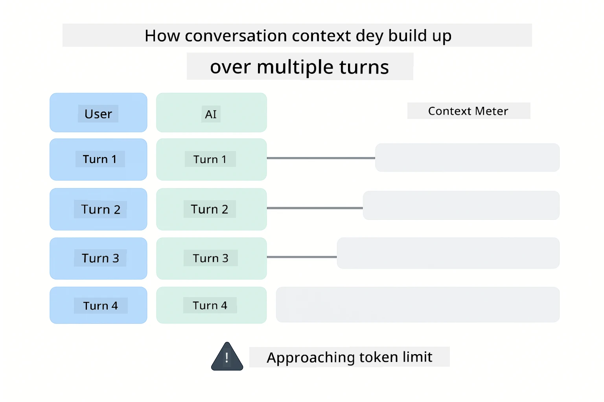

*How conversation context dey accumulate over multiple turns until e reach token limit*

**Step-by-Step Reasoning** - For problems wey need visible logic. Di model go show explicit reasoning for each step. Use dis one for math problems, logic puzzles, or when you want understand di thinking process.

```java
String prompt = """
    <instruction>Show your reasoning step-by-step</instruction>
    
    If a train travels 120 km in 2 hours, then stops for 30 minutes,
    then travels another 90 km in 1.5 hours, what is the average speed
    for the entire journey including the stop?
    """;

String response = chatModel.chat(prompt);
```

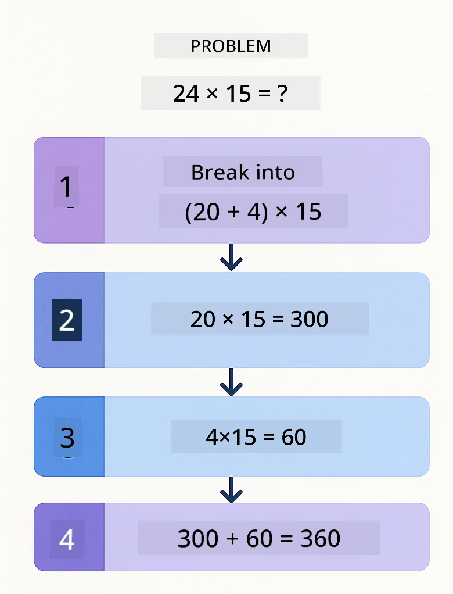

*Breaking down problems into explicit logical steps*

**Constrained Output** - For responses wey get specific format requirements. Di model go strictly follow format and length rules. Use dis one for summaries or when you want precise output structure.

```java
String prompt = """
    <constraints>
    - Exactly 100 words
    - Bullet point format
    - Technical terms only
    </constraints>
    
    Summarize the key concepts of machine learning.
    """;

String response = chatModel.chat(prompt);
```

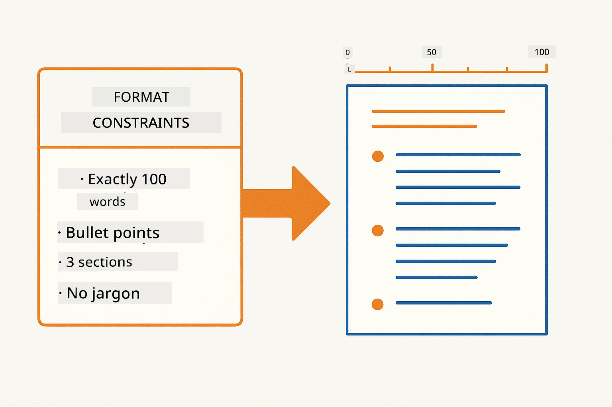

*Enforcing specific format, length, and structure requirements*

## Using Existing Azure Resources

**Verify deployment:**

Make sure say `.env` file dey root directory wit Azure credentials (wey dem create for Module 01):
```bash
cat ../.env  # E suppose show AZURE_OPENAI_ENDPOINT, API_KEY, DEPLOYMENT
```

**Start di application:**

> **Note:** If you don start all applications using `./start-all.sh` from Module 01, dis module don dey run for port 8083. You fit skip di start commands below and go straight to http://localhost:8083.

**Option 1: Using Spring Boot Dashboard (Recommended for VS Code users)**

Di dev container get Spring Boot Dashboard extension, wey dey provide visual interface to manage all Spring Boot applications. You fit find am for Activity Bar for left side of VS Code (look for di Spring Boot icon).

From di Spring Boot Dashboard, you fit:
- See all available Spring Boot applications for workspace
- Start/stop applications wit one click
- View application logs in real-time
- Monitor application status

Just click di play button beside "prompt-engineering" to start dis module, or start all modules at once.

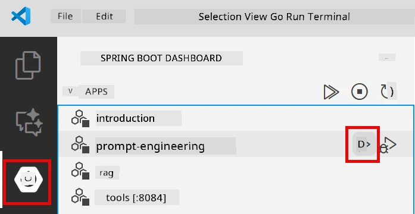

**Option 2: Using shell scripts**

Start all web applications (modules 01-04):

**Bash:**
```bash
cd ..  # From root directory
./start-all.sh
```

**PowerShell:**
```powershell
cd ..  # From root directory
.\start-all.ps1
```

Or start just dis module:

**Bash:**
```bash
cd 02-prompt-engineering
./start.sh
```

**PowerShell:**
```powershell
cd 02-prompt-engineering
.\start.ps1
```

Both scripts go automatically load environment variables from root `.env` file and go build di JARs if dem no dey.

> **Note:** If you prefer to build all modules manually before starting:
>
> **Bash:**
> ```bash
> cd ..  # Go to root directory
> mvn clean package -DskipTests
> ```
>
> **PowerShell:**
> ```powershell
> cd ..  # Go to root directory
> mvn clean package -DskipTests
> ```

Open http://localhost:8083 for your browser.

**To stop:**

**Bash:**
```bash
./stop.sh  # Dis module only
# Or
cd .. && ./stop-all.sh  # All di modules
```

**PowerShell:**
```powershell
.\stop.ps1  # Dis module only
# Or
cd ..; .\stop-all.ps1  # All di modules
```

## Application Screenshots

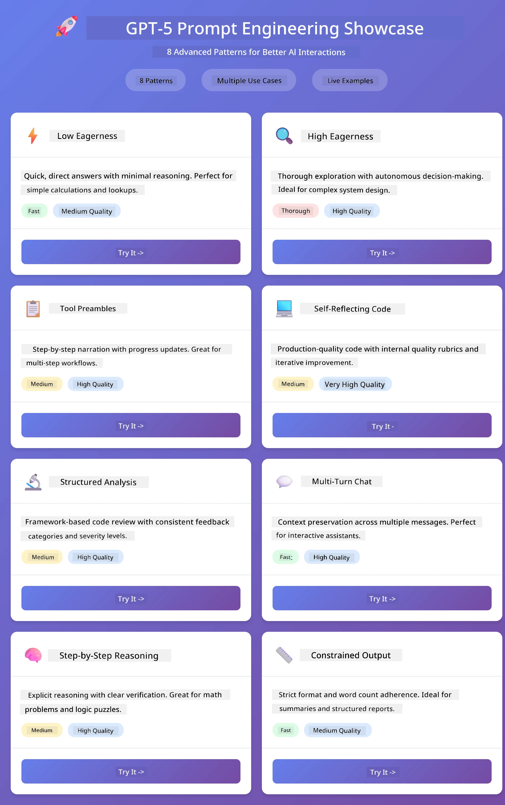

*Di main dashboard wey dey show all 8 prompt engineering patterns wit their characteristics and use cases*

## Exploring the Patterns

Di web interface go let you experiment wit different prompting strategies. Each pattern dey solve different problems - try dem to see when each approach dey shine.

### Low vs High Eagerness

Ask simple question like "Wetin be 15% of 200?" using Low Eagerness. You go get instant, direct answer. Now ask something complex like "Design caching strategy for high-traffic API" using High Eagerness. Watch how di model slow down and provide detailed reasoning. Na same model, same question structure - but di prompt dey tell am how much thinking to do.

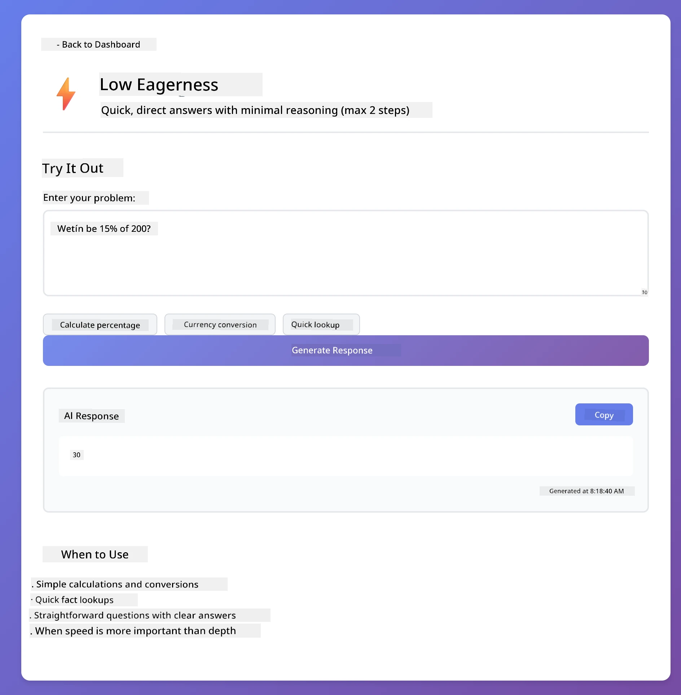
*Quick calculation wit small reasoning*

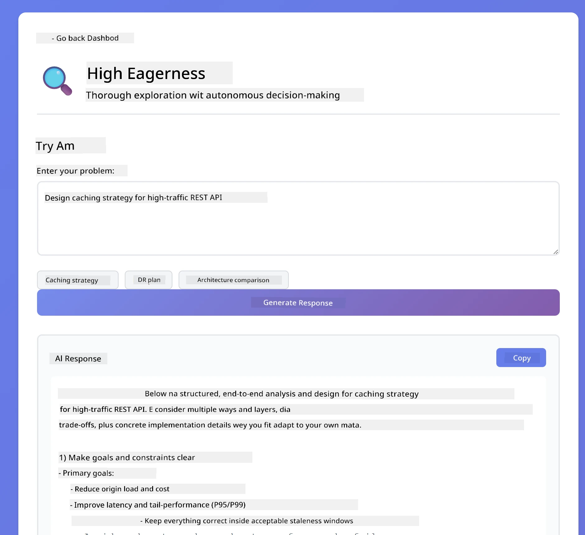

*Comprehensive caching strategy (2.8MB)*

### Task Execution (Tool Preambles)

Multi-step workflows dey benefit from upfront planning and progress narration. Di model dey explain wetin e go do, dey talk each step, den summarize results.

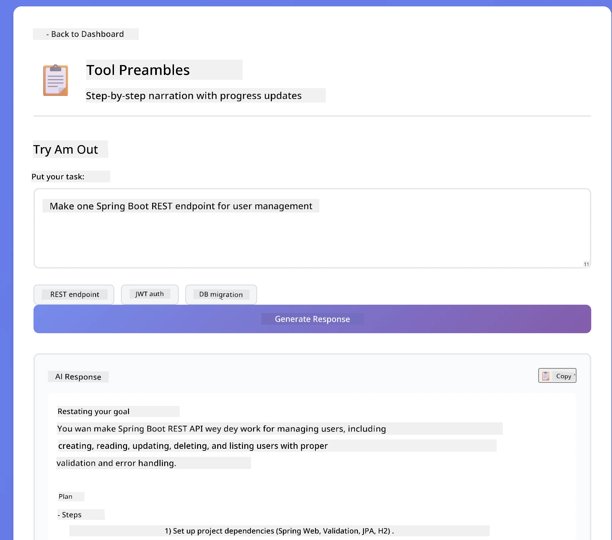

*Creating a REST endpoint wit step-by-step narration (3.9MB)*

### Self-Reflecting Code

Try "Create an email validation service". Instead of just generating code and stop, di model go generate, check am against quality criteria, find wahala, and improve. You go see am dey try until di code reach production standards.

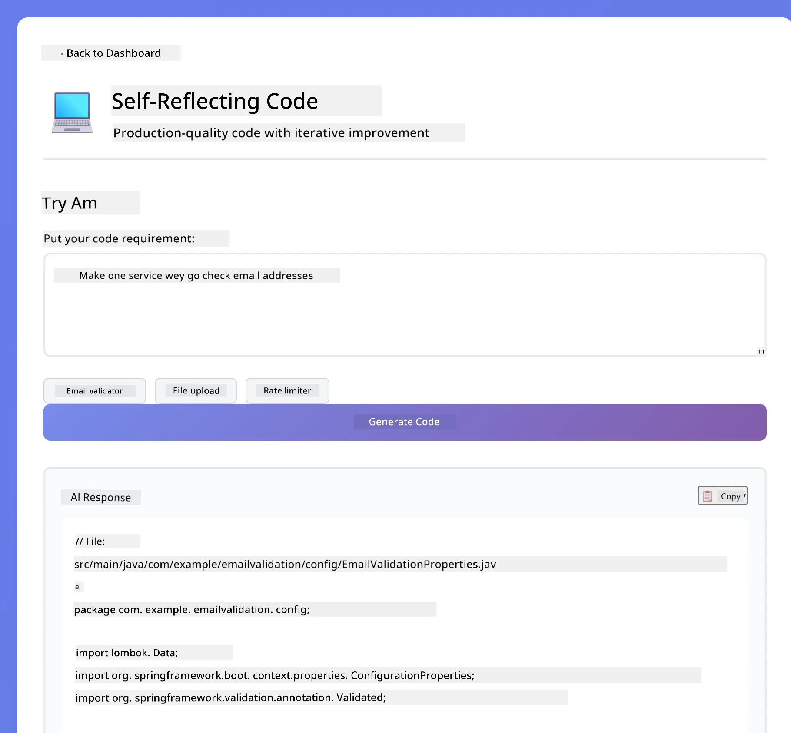

*Complete email validation service (5.2MB)*

### Structured Analysis

Code reviews need consistent evaluation frameworks. Di model dey analyze code using fixed categories (correctness, practices, performance, security) wit severity levels.

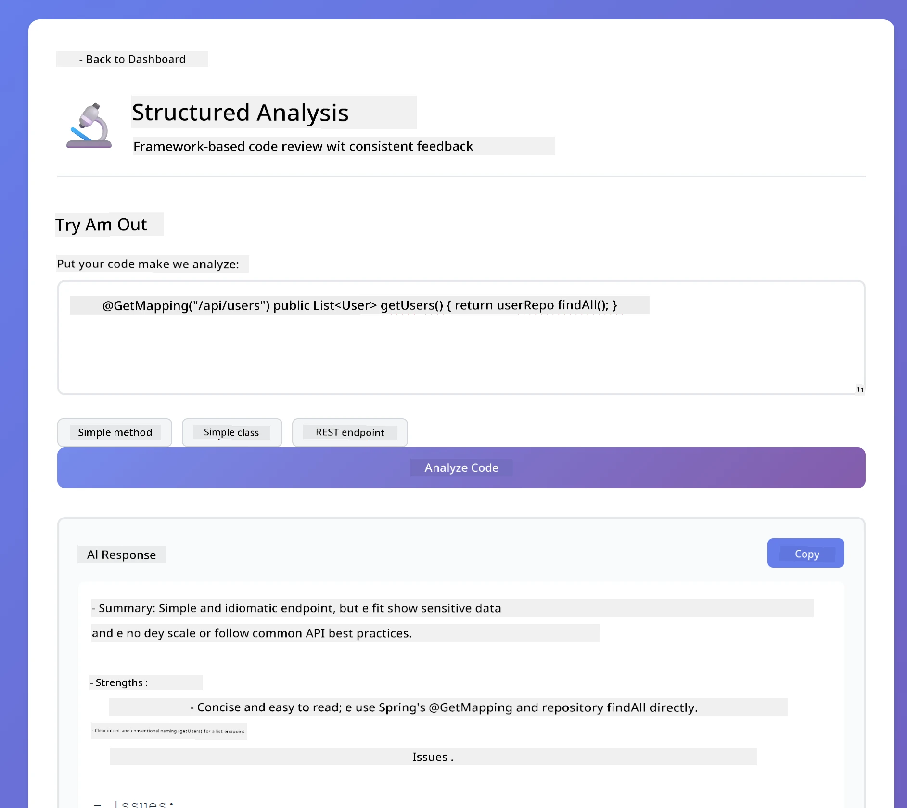

*Framework-based code review*

### Multi-Turn Chat

Ask "Wetin be Spring Boot?" then immediately follow up wit "Show me example". Di model go remember your first question and give you Spring Boot example specially. Without memory, dat second question go too vague.

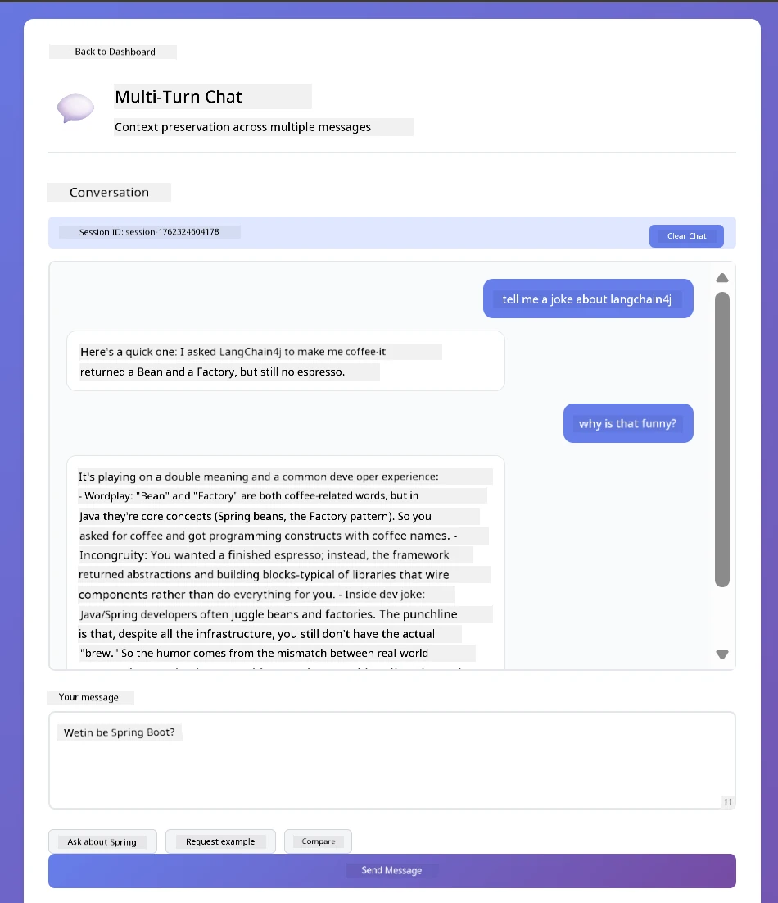

*Context preservation across questions*

### Step-by-Step Reasoning

Pick math problem and try am wit both Step-by-Step Reasoning and Low Eagerness. Low eagerness just give you di answer - fast but no clear. Step-by-step go show you every calculation and decision.

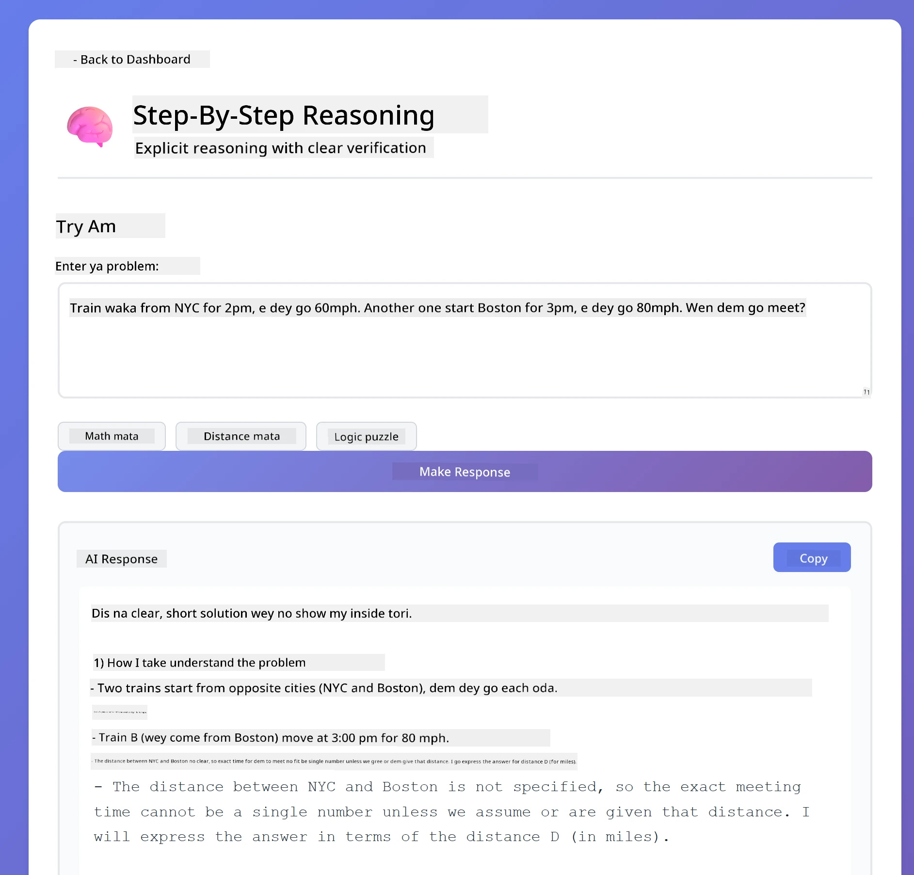

*Math problem wit explicit steps*

### Constrained Output

When you need specific formats or word counts, dis pattern dey enforce strict adherence. Try generate summary wit exactly 100 words for bullet point format.

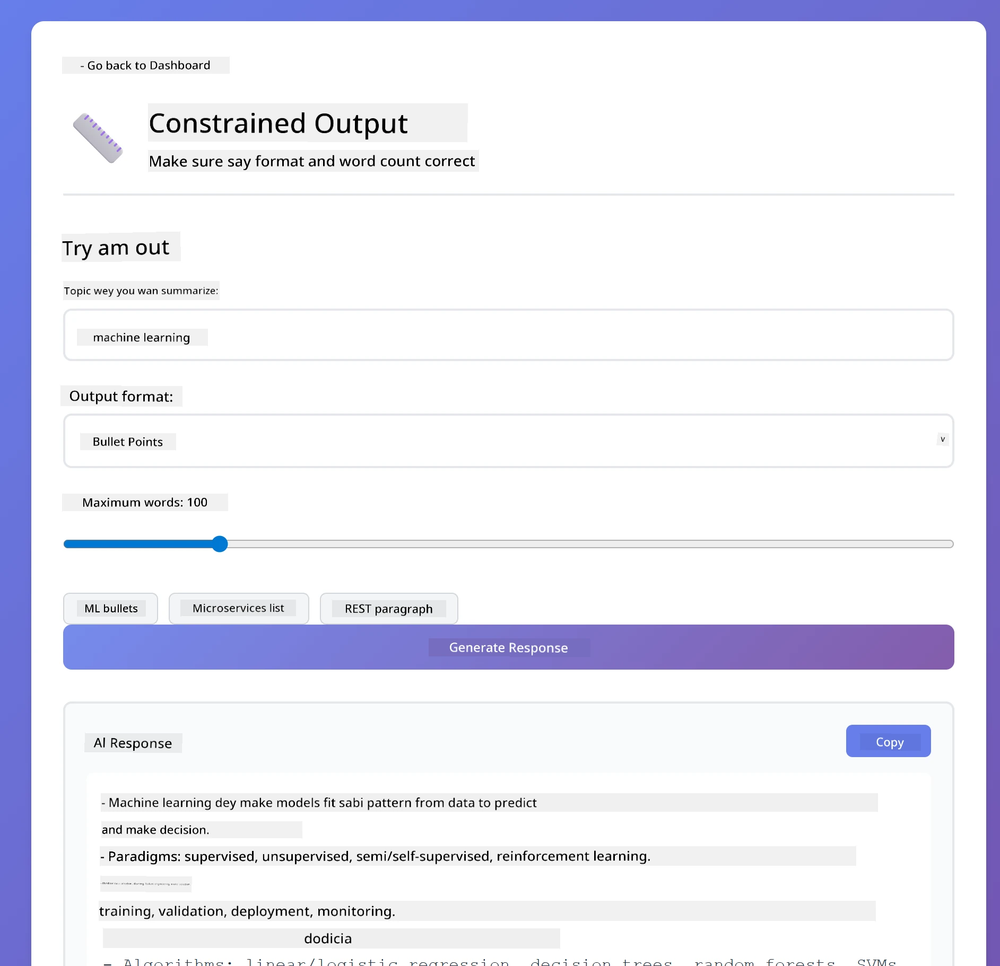

*Machine learning summary wit format control*

## Wetin You Really Dey Learn

**Reasoning Effort Dey Change Everything**

GPT-5 let you control computational effort through your prompts. Low effort mean fast responses wit small exploration. High effort mean di model go take time to think well well. You dey learn to match effort to task complexity - no waste time on simple questions, but no rush complex decisions too.

**Structure Dey Guide Behavior**

You see di XML tags for di prompts? Dem no be decoration. Models dey follow structured instructions more reliable than freeform text. When you need multi-step processes or complex logic, structure dey help di model track where e dey and wetin go next.

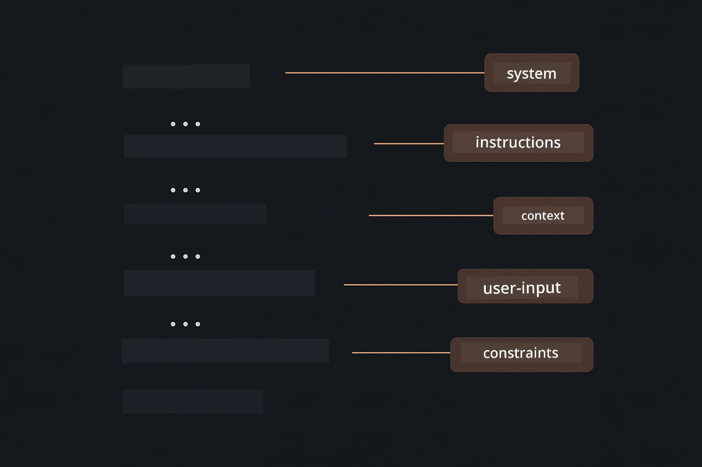

*Anatomy of well-structured prompt wit clear sections and XML-style organization*

**Quality Through Self-Evaluation**

Di self-reflecting patterns dey work by making quality criteria explicit. Instead of hoping di model "go do am right", you go tell am exactly wetin "right" mean: correct logic, error handling, performance, security. Di model fit then evaluate im own output and improve. Dis go turn code generation from lottery to process.

**Context Na Limited**

Multi-turn conversations dey work by including message history wit each request. But e get limit - every model get maximum token count. As conversations dey grow, you go need strategies to keep relevant context without reach dat limit. Dis module go show you how memory dey work; later you go learn when to summarize, when to forget, and when to retrieve.

## Next Steps

**Next Module:** [03-rag - RAG (Retrieval-Augmented Generation)](../03-rag/README.md)

---

**Navigation:** [← Previous: Module 01 - Introduction](../01-introduction/README.md) | [Back to Main](../README.md) | [Next: Module 03 - RAG →](../03-rag/README.md)

---

<!-- CO-OP TRANSLATOR DISCLAIMER START -->
**Disclaimer**:
Dis document don translate wit AI translation service [Co-op Translator](https://github.com/Azure/co-op-translator). Even though we dey try make am correct, abeg sabi say automated translation fit get some errors or wahala. Di original document wey dey im own language na di correct one. If na serious matter, e better make human professional translate am. We no go responsible for any misunderstanding or wrong meaning wey fit come from dis translation.
<!-- CO-OP TRANSLATOR DISCLAIMER END -->