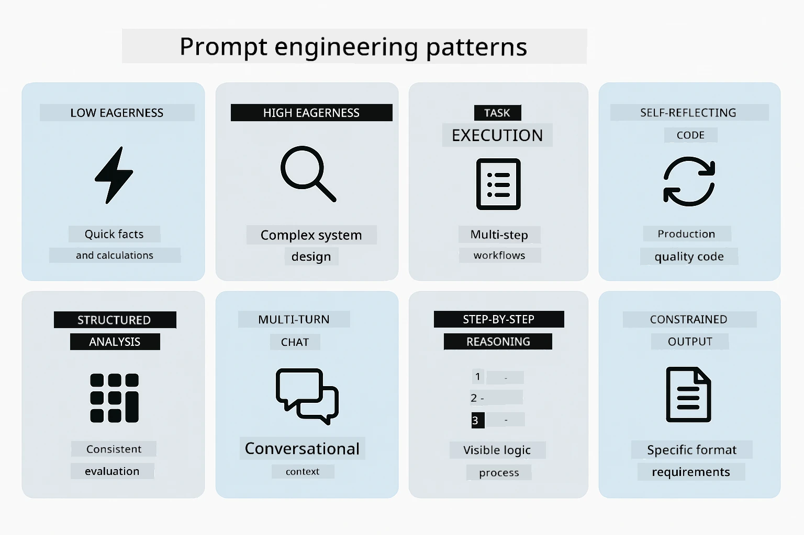
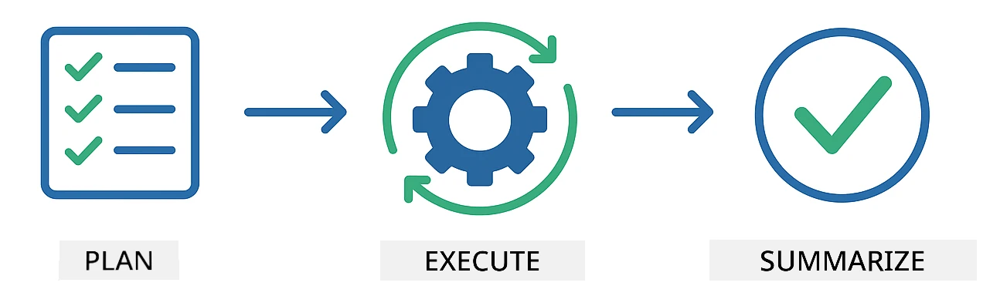
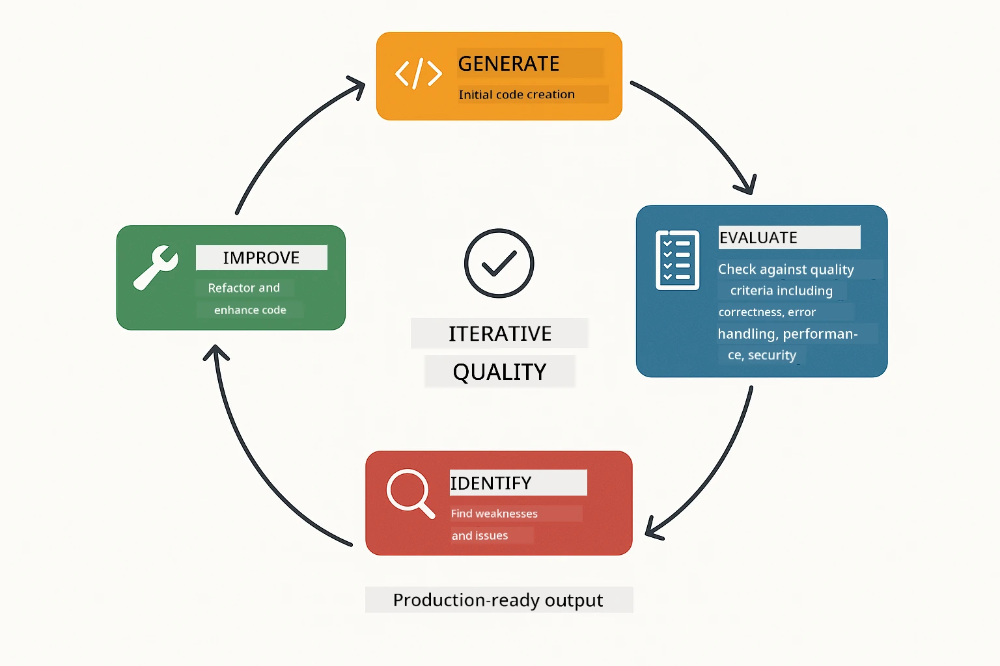
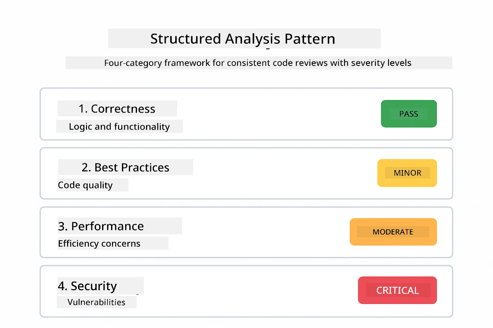
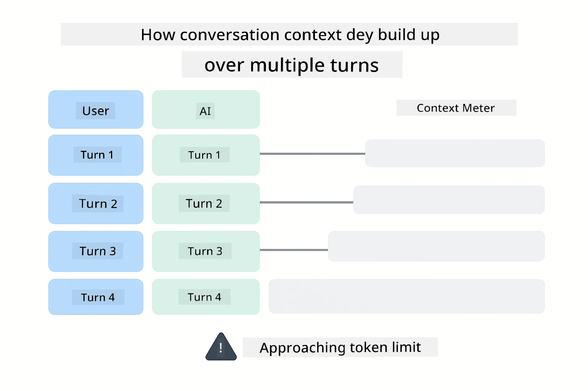
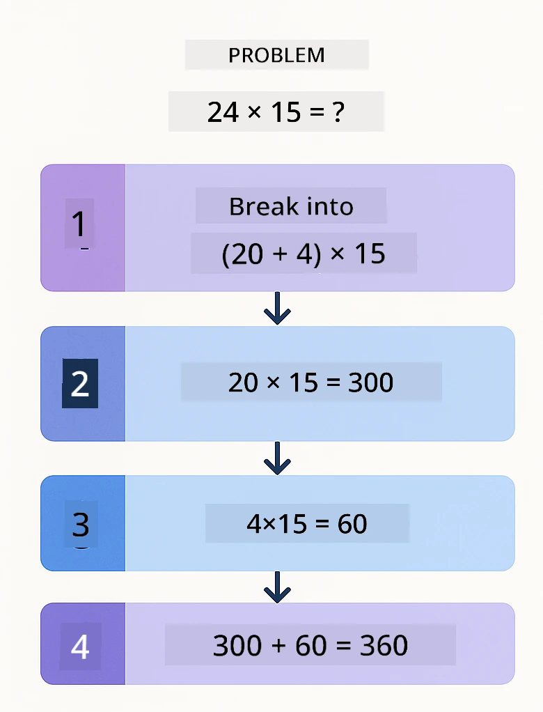
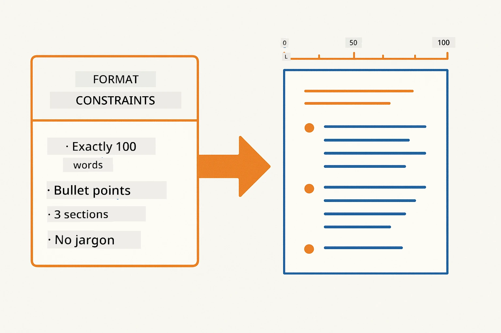
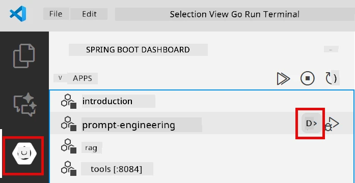
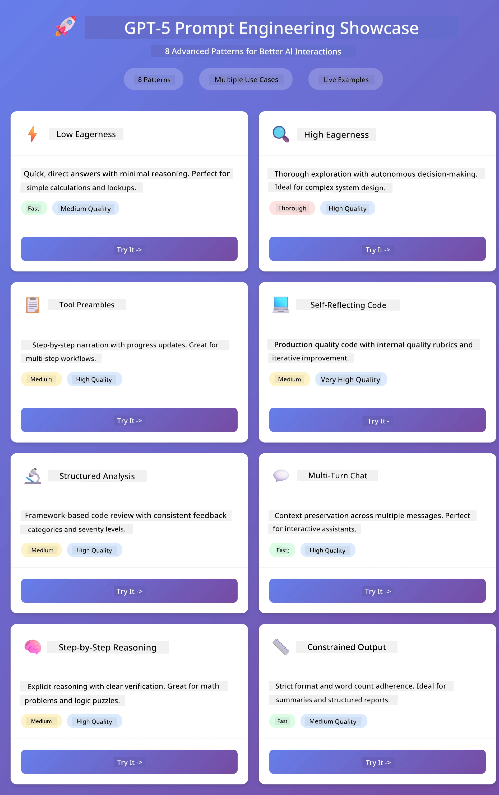
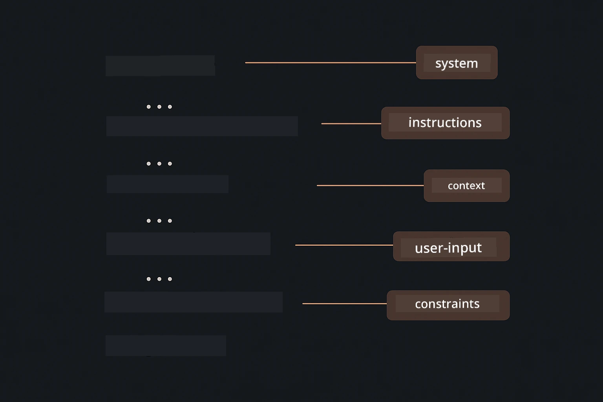

# Module 02: Prompt Engineering wit GPT-5.2

## Table of Contents

- [Video Walkthrough](#video-walkthrough)
- [Wet tin You Go Learn](#wet-tin-you-go-learn)
- [Prerequisites](#prerequisites)
- [Understanding Prompt Engineering](#understanding-prompt-engineering)
- [Prompt Engineering Fundamentals](#prompt-engineering-fundamentals)
  - [Zero-Shot Prompting](#zero-shot-prompting)
  - [Few-Shot Prompting](#few-shot-prompting)
  - [Chain of Thought](#chain-of-thought)
  - [Role-Based Prompting](#role-based-prompting)
  - [Prompt Templates](#prompt-templates)
- [Advanced Patterns](#advanced-patterns)
- [Run the Application](#run-the-application)
- [Application Screenshots](#application-screenshots)
- [Exploring the Patterns](#exploring-the-patterns)
  - [Low vs High Eagerness](#low-vs-high-eagerness)
  - [Task Execution (Tool Preambles)](#task-execution-tool-preambles)
  - [Self-Reflecting Code](#self-reflecting-code)
  - [Structured Analysis](#structured-analysis)
  - [Multi-Turn Chat](#multi-turn-chat)
  - [Step-by-Step Reasoning](#step-by-step-reasoning)
  - [Constrained Output](#constrained-output)
- [Wet You Really Dey Learn](#what-youre-really-learning)
- [Next Steps](#next-steps)

## Video Walkthrough

Watch dis live session wey dey explain how to start dis module:

<a href="https://www.youtube.com/live/PJ6aBaE6bog?si=LDshyBrTRodP-wke"></a>

## Wet tin You Go Learn

The diagram wey follow show the main topics and skills wey you go develop for dis module — from how to make prompts better reach the step-by-step workflow wey you go follow.


For the last module, you see how memory dey enable conversational AI wit Azure OpenAI. Now we go focus on how you dey ask questions — di prompts themselves — using Azure OpenAI GPT-5.2. How you take arrange your prompts get serious effect on the kind answer you go get. We go start wit di basic prompt techniques, then go enter eight advanced patterns wey make full use of GPT-5.2 features.

We go use GPT-5.2 because e get reasoning control - you fit tell di model how much thinking e suppose do before e answer. Dis one dey make different prompt strategies clear and e go help you understand when to use which approach.

## Prerequisites

- You go don finish Module 01 (Azure OpenAI resources don deploy)
- `.env` file dey your root folder wit Azure credentials (e dey created by `azd up` for Module 01)

> **Note:** If you never finish Module 01, make you follow deployment instructions inside there first.

## Understanding Prompt Engineering

For inside, prompt engineering na di difference between instructions wey no clear and instructions wey clear well well, as di comparison below dey show.


Prompt engineering na about how you dey design input text wey go always give you di correct answer wey you need. E no be only to ask questions - na how you dey arrange your request make di model understand exactly wetin you want and how e go deliver am.

Make you think am like you dey give instruction to your padi for work. "Fix the bug" no clear. "Fix the null pointer exception for UserService.java line 45 by adding a null check" clear well. Language models dey work like that too - clear instruction and arrangement dey matter.

Di diagram below show how LangChain4j take fit inside di picture — e dey connect your prompt patterns go di model through SystemMessage and UserMessage building blocks.


LangChain4j na di infrastructure — model connections, memory, and message types — but prompt patterns na carefully arranged text wey you dey send through dat infrastructure. Di main building blocks na `SystemMessage` (wey dey set di AI style and role) and `UserMessage` (wey carry your actual request).

## Prompt Engineering Fundamentals

The five core techniques wey dey below na di foundation for any good prompt engineering work. Each one dey handle different part of how you take dey communicate wit language model.


Before we start di advanced patterns for dis module, make we review five basic prompting techniques. Dem na di building blocks all prompt engineers suppose sabi.

### Zero-Shot Prompting

Di simplest way: you just give di model direct instruction without any example. Di model go depend fully on wetin e learn before to understand and do di task. Dis one dey work well for easy requests wey di expected way clear.


*Direct instruction wey no get example — di model go understand task from only di instruction*

```java
String prompt = "Classify this sentiment: 'I absolutely loved the movie!'";
String response = model.chat(prompt);
// Response: "Positiv"
```

**When to use:** Simple classifications, direct questions, translations, or any task di model fit do without extra guide.

### Few-Shot Prompting

You give example wey show di pattern wey you want di model follow. Di model go learn di input-output style from your examples and then apply am for new inputs. Dis one dey improve how consistent di model dey when di format or behavior no clear obviously.


*Learning from example — di model go find di pattern and apply am for new inputs*

```java
String prompt = """
    Classify the sentiment as positive, negative, or neutral.
    
    Examples:
    Text: "This product exceeded my expectations!" → Positive
    Text: "It's okay, nothing special." → Neutral
    Text: "Waste of money, very disappointed." → Negative
    
    Now classify this:
    Text: "Best purchase I've made all year!"
    """;
String response = model.chat(prompt);
```

**When to use:** Custom classifications, consistent formatting, domain-specific tasks, or when zero-shot results no dey consistent.

### Chain of Thought

Ask di model make e show how e reason step by step. Instead of just giving one answer quick quick, di model go break di problem down and solve each part clearly. Dis dey increase accuracy for math, logic, and tasks wey get many steps.


*Step by step reasoning — breaking complex problems into clear logical steps*

```java
String prompt = """
    Problem: A store has 15 apples. They sell 8 apples and then 
    receive a shipment of 12 more apples. How many apples do they have now?
    
    Let's solve this step-by-step:
    """;
String response = model.chat(prompt);
// Di model dey show: 15 - 8 = 7, den 7 + 12 = 19 apples
```

**When to use:** Math wahala, logic puzzle, debugging, or any task wey showing how you reason go improve accuracy and trust.

### Role-Based Prompting

Set persona or role for di AI before you ask your question. Dis dey give context wey go affect how di AI go yan, di level and kind of answer e go give. "Software architect" go give different advice pass "junior developer" or "security auditor".


*Setting context and persona — di same question fit get different answer depending on role wey you set*

```java
String prompt = """
    You are an experienced software architect reviewing code.
    Provide a brief code review for this function:
    
    def calculate_total(items):
        total = 0
        for item in items:
            total = total + item['price']
        return total
    """;
String response = model.chat(prompt);
```

**When to use:** Code reviews, tutoring, domain-specific analysis, or when you want answers wey fit specific expertise level or perspective.

### Prompt Templates

Make reusable prompts wey get variable placeholders. Instead of you dey write new prompt every time, you go define one template and fill different values. LangChain4j `PromptTemplate` class dey make dis easy wit `{{variable}}` syntax.


*Reusable prompts wit variable placeholders — one template, many uses*

```java
PromptTemplate template = PromptTemplate.from(
    "What's the best time to visit {{destination}} for {{activity}}?"
);

Prompt prompt = template.apply(Map.of(
    "destination", "Paris",
    "activity", "sightseeing"
));

String response = model.chat(prompt.text());
```

**When to use:** Repeated queries wit different inputs, batch processing, building reusable AI workflows, or any time wey di prompt structure remain but di data change.

---

Dis five fundamentals go give you strong toolkit for most prompt tasks. Di rest of dis module go build on dem wit **eight advanced patterns** wey use GPT-5.2 reasoning control, self-evaluation, and structured output features.

## Advanced Patterns

Since fundamentals don done, make we enter di eight advanced patterns wey make dis module special. Not all problems need same approach. Some questions need quick answer, others need deep thinking. Some need reasoning wey you fit see, others just want result. Each pattern below dey optimized for different thing — and GPT-5.2 reasoning control dey make di difference clear well well.



*Overview of di eight prompt engineering patterns and their use cases*

GPT-5.2 add one more dimension to dis patterns: *reasoning control*. Di slider below dey show how you fit adjust di model thinking effort — from quick direct answers to deep thorough analysis.


*GPT-5.2 reasoning control let you choose how much thinking di model go do — from fast direct answers to deep exploration*

**Low Eagerness (Quick & Focused)** - For simple questions wey you want quick, direct answers. Di model no go reason too much - maximum 2 steps. Use am for calculation, lookups, or simple questions.

```java
String prompt = """
    <context_gathering>
    - Search depth: very low
    - Bias strongly towards providing a correct answer as quickly as possible
    - Usually, this means an absolute maximum of 2 reasoning steps
    - If you think you need more time, state what you know and what's uncertain
    </context_gathering>
    
    Problem: What is 15% of 200?
    
    Provide your answer:
    """;

String response = chatModel.chat(prompt);
```

> 💡 **Explore wit GitHub Copilot:** Open [`Gpt5PromptService.java`](../../../02-prompt-engineering/src/main/java/com/example/langchain4j/prompts/service/Gpt5PromptService.java) and ask:
> - "Wet different dey between low eagerness and high eagerness prompting patterns?"
> - "How di XML tags for prompts dey help arrange AI response?"
> - "When I go use self-reflection patterns vs direct instruction?"

**High Eagerness (Deep & Thorough)** - For complex problems wey you want full analysis. Di model go reason well and show detailed steps. Use am for system design, architecture decisions, or heavy research.

```java
String prompt = """
    Analyze this problem thoroughly and provide a comprehensive solution.
    Consider multiple approaches, trade-offs, and important details.
    Show your analysis and reasoning in your response.
    
    Problem: Design a caching strategy for a high-traffic REST API.
    """;

String response = chatModel.chat(prompt);
```

**Task Execution (Step-by-Step Progress)** - For workflows wey get many steps. Di model go give plan upfront, tell you each step as e dey do, then give summary. Use am for migrations, implementations, or any multi-step process.

```java
String prompt = """
    <task_execution>
    1. First, briefly restate the user's goal in a friendly way
    
    2. Create a step-by-step plan:
       - List all steps needed
       - Identify potential challenges
       - Outline success criteria
    
    3. Execute each step:
       - Narrate what you're doing
       - Show progress clearly
       - Handle any issues that arise
    
    4. Summarize:
       - What was completed
       - Any important notes
       - Next steps if applicable
    </task_execution>
    
    <tool_preambles>
    - Always begin by rephrasing the user's goal clearly
    - Outline your plan before executing
    - Narrate each step as you go
    - Finish with a distinct summary
    </tool_preambles>
    
    Task: Create a REST endpoint for user registration
    
    Begin execution:
    """;

String response = chatModel.chat(prompt);
```

Chain-of-Thought prompting dey explicitly ask di model to show how e reason, e dey improve accuracy for complex tasks. Di step by step breakdown dey help both human and AI understand di logic.

> **🤖 Try wit [GitHub Copilot](https://github.com/features/copilot) Chat:** Ask about dis pattern:
> - "How I go change di task execution pattern for long-running operations?"
> - "Wetin be best practices for arranging tool preambles for production apps?"
> - "How I fit capture and show in-between progress updates for UI?"

Di diagram below dey show dis Plan → Execute → Summarize workflow.



*Plan → Execute → Summarize workflow for multi-step tasks*

**Self-Reflecting Code** - For generating code wey production quality. Di model go generate code following production standards wit proper error handling. Use am when you wan build new features or services.

```java
String prompt = """
    Generate Java code with production-quality standards: Create an email validation service
    Keep it simple and include basic error handling.
    """;

String response = chatModel.chat(prompt);
```

Di diagram below show dis iterative improvement loop — generate, evaluate, find wahala, and improve until code reach production standard.



*Iterative improvement loop - generate, evaluate, find problems, improve, repeat*

**Structured Analysis** - For consistent evaluation. Di model go review code using fixed framework (correctness, practices, performance, security, maintainability). Use am for code review or quality check.

```java
String prompt = """
    <analysis_framework>
    You are an expert code reviewer. Analyze the code for:
    
    1. Correctness
       - Does it work as intended?
       - Are there logical errors?
    
    2. Best Practices
       - Follows language conventions?
       - Appropriate design patterns?
    
    3. Performance
       - Any inefficiencies?
       - Scalability concerns?
    
    4. Security
       - Potential vulnerabilities?
       - Input validation?
    
    5. Maintainability
       - Code clarity?
       - Documentation?
    
    <output_format>
    Provide your analysis in this structure:
    - Summary: One-sentence overall assessment
    - Strengths: 2-3 positive points
    - Issues: List any problems found with severity (High/Medium/Low)
    - Recommendations: Specific improvements
    </output_format>
    </analysis_framework>
    
    Code to analyze:
    ```
    public List getUsers() {
        return database.query("SELECT * FROM users");
    }
    ```
    Provide your structured analysis:
    """;

String response = chatModel.chat(prompt);
```

> **🤖 Try wit [GitHub Copilot](https://github.com/features/copilot) Chat:** Ask about structured analysis:
> - "How I fit customize di analysis framework for different code reviews?"
> - "Wetin be best way to parse and handle structured output inside program?"
> - "How I fit maintain consistency for severity levels across different review sessions?"

Di diagram below show how dis structured framework fit organize code review into steady categories wit severity levels.



*Framework for steady code reviews wit severity levels*

**Multi-Turn Chat** - For conversation wey need context. Di model dey remember previous messages and build on top. Use am for interactive help sessions or complex Q&A.

```java
ChatMemory memory = MessageWindowChatMemory.withMaxMessages(10);

memory.add(UserMessage.from("What is Spring Boot?"));
AiMessage aiMessage1 = chatModel.chat(memory.messages()).aiMessage();
memory.add(aiMessage1);

memory.add(UserMessage.from("Show me an example"));
AiMessage aiMessage2 = chatModel.chat(memory.messages()).aiMessage();
memory.add(aiMessage2);
```

Di diagram below dey show how conversation context dey build up every turn and how e take relate to di model token limit.



*How conversation context dey increase every turn till e reach token limit*

**Step-by-Step Reasoning** - For problems wey need visible logic. Di model go show clear thinking for each step. Use am for math problems, logic puzzles, or when you want understand di thinking method.

```java
String prompt = """
    <instruction>Show your reasoning step-by-step</instruction>
    
    If a train travels 120 km in 2 hours, then stops for 30 minutes,
    then travels another 90 km in 1.5 hours, what is the average speed
    for the entire journey including the stop?
    """;

String response = chatModel.chat(prompt);
```

Di diagram below dey show how di model dey break problems into clear, numbered logical steps.


*Breaking down problems into explicit logical steps*

**Constrained Output** - For responses wey get specific format requirements. Di model go strictly follow format and length rules. Use dis one for summaries or wen you need correct output structure.

```java
String prompt = """
    <constraints>
    - Exactly 100 words
    - Bullet point format
    - Technical terms only
    </constraints>
    
    Summarize the key concepts of machine learning.
    """;

String response = chatModel.chat(prompt);
```
  
Di diagram wey dey below dey show how constraints dey guide di model to produce output wey strictly follow your format and length requirements.



*Enforcing specific format, length, and structure requirements*

## Run the Application

**Verify deployment:**

Make sure say `.env` file dey for the root directory with Azure credentials (wey dem create for Module 01). Run am from the module directory (`02-prompt-engineering/`):

**Bash:**  
```bash
cat ../.env  # E for show AZURE_OPENAI_ENDPOINT, API_KEY, DEPLOYMENT
```
  
**PowerShell:**  
```powershell
Get-Content ..\.env  # E suppose show AZURE_OPENAI_ENDPOINT, API_KEY, DEPLOYMENT
```
  
**Start the application:**

> **Note:** If you don start all applications using `./start-all.sh` from the root directory (as dem talk for Module 01), this module don dey run already for port 8083. You fit skip the start commands wey dey below and waka straight go http://localhost:8083.

**Option 1: Using Spring Boot Dashboard (Recommended for VS Code users)**

Di dev container get the Spring Boot Dashboard extension wey dey provide visual interface to manage all Spring Boot applications. You fit find am for the Activity Bar for the left side of VS Code (look for di Spring Boot icon).

From the Spring Boot Dashboard, you fit:  
- See all di Spring Boot applications wey dey the workspace  
- Start/stop applications with one click  
- View application logs for real-time  
- Monitor application status  

Just click di play button wey dey next to "prompt-engineering" to start this module, or start all modules at once.



*The Spring Boot Dashboard wey dey VS Code — start, stop, and monitor all modules for one place*

**Option 2: Using shell scripts**

Start all web applications (modules 01-04):

**Bash:**  
```bash
cd ..  # From root directory
./start-all.sh
```
  
**PowerShell:**  
```powershell
cd ..  # From root directory
.\start-all.ps1
```
  
Or start just this module:

**Bash:**  
```bash
cd 02-prompt-engineering
./start.sh
```
  
**PowerShell:**  
```powershell
cd 02-prompt-engineering
.\start.ps1
```
  
Both scripts go automatically load environment variables from the root `.env` file and go build the JARs if dem no dey.

> **Note:** If you prefer to build all modules manually before you start:  
>  
> **Bash:**  
> ```bash
> cd ..  # Go to root directory
> mvn clean package -DskipTests
> ```
  
> **PowerShell:**  
> ```powershell
> cd ..  # Go to root directory
> mvn clean package -DskipTests
> ```
  
Open http://localhost:8083 for your browser.

**To stop:**

**Bash:**  
```bash
./stop.sh  # Dis module only
# Or
cd .. && ./stop-all.sh  # All modules
```
  
**PowerShell:**  
```powershell
.\stop.ps1  # Dis module only
# Or
cd ..; .\stop-all.ps1  # All modules
```
  
## Application Screenshots

Here na di main interface of di prompt engineering module, wey you fit experiment with all di eight patterns side by side.



*The main dashboard wey dey show all 8 prompt engineering patterns wit their characteristics and use cases*

## Exploring the Patterns

Di web interface make you try different prompting strategies. Each pattern solve different problems - try dem to see when each one sharp.

> **Note: Streaming vs Non-Streaming** — Every pattern page get two buttons: **🔴 Stream Response (Live)** and one **Non-streaming** option. Streaming na Server-Sent Events (SSE) wey dey show tokens as di model dey generate am, so you go see progress sharp sharp. Non-streaming option go wait till the whole response ready before e show. For prompts wey need deep thinking (like High Eagerness, Self-Reflecting Code), non-streaming call fit take long time — sometimes na minutes — and no feedback go show. **Use streaming when you dey try complex prompts** so you fit see the model work and no go think say the request don time out.  
>  
> **Note: Browser Requirement** — Di streaming feature dey use Fetch Streams API (`response.body.getReader()`) wey need full browser (Chrome, Edge, Firefox, Safari). E no dey work for VS Code's Simple Browser because e no get support for ReadableStream API. If you dey use Simple Browser, non-streaming buttons still go work normal — na only streaming buttons wey go no work. Open `http://localhost:8083` for external browser to get full experience.

### Low vs High Eagerness

Ask simple question like "Wetín be 15% of 200?" using Low Eagerness. You go get answer sharp sharp, direct. Now ask something wey complex like "Design caching strategy for high-traffic API" with High Eagerness. Click **🔴 Stream Response (Live)** and watch how model go reason well token by token. Same model, same question format - but di prompt dey tell am how much to think.

### Task Execution (Tool Preambles)

Multi-step workflows better if you plan before and yarn progress step by step. Di model go talk wetin e go do, yarn each step, then summarize results.

### Self-Reflecting Code

Try "Create email validation service". Instead of just write code then stop, di model go generate code, check am based on quality criteria, find weak points, then improve. You go see am dey do iteration till code meet production standard.

### Structured Analysis

Code review need consistent framework for evaluation. Di model dey use fixed categories (correctness, practices, performance, security) with severity levels to analyze code.

### Multi-Turn Chat

Ask "Wetín be Spring Boot?" then quickly follow up wit "Show me example". Di model go remember your first question and give you Spring Boot example specially. Without memory, the second question go too vague.

### Step-by-Step Reasoning

Pick math problem and try am with Step-by-Step Reasoning and Low Eagerness. Low eagerness just give you answer fast but e no clear. Step-by-step go show you every calculation and decision.

### Constrained Output

When you need specific formats or word counts, this pattern go enforce strict adherence. Try generate summary with exactly 100 words for bullet point format.

## What You're Really Learning

**Reasoning Effort Changes Everything**

GPT-5.2 make you control how much effort model go put through your prompts. Low effort mean fast responses with little exploration. High effort mean model go take time to think deep. You dey learn how to match effort to how hard the task be - no waste time on simple questions, and no rush complex decisions too.

**Structure Guides Behavior**

You see di XML tags for the prompts? No be decoration. Models dey follow structured instructions better than freeform text. When you need multi-step processes or complex logic, structure dey help the model know where e dey and wetin next. Di diagram below breakdown well-structured prompt, showing how tags like `<system>`, `<instructions>`, `<context>`, `<user-input>`, and `<constraints>` dey organize your instructions into clear sections.



*Anatomy of well-structured prompt with clear sections and XML-style organization*

**Quality Through Self-Evaluation**

Self-reflecting patterns dey work by making quality criteria explicit. Instead of hope say model go "do am right", you talk exactly what "right" mean: correct logic, error handling, performance, security. Model fit evaluate own output then improve. E turn code generation to process no be lottery.

**Context Is Finite**

Multi-turn conversations work by including message history for each request. But limit dey - every model get max token count. As conversation grow, you need strategies to keep relevant context without pass that limit. This module show you how memory works; later you go learn when to summarize, when to forget, and when to retrieve.

## Next Steps

**Next Module:** [03-rag - RAG (Retrieval-Augmented Generation)](../03-rag/README.md)

---

**Navigation:** [← Previous: Module 01 - Introduction](../01-introduction/README.md) | [Back to Main](../README.md) | [Next: Module 03 - RAG →](../03-rag/README.md)

---

<!-- CO-OP TRANSLATOR DISCLAIMER START -->
**Disclaimer**:
Dis document don translate wit AI translation service [Co-op Translator](https://github.com/Azure/co-op-translator). Even tho we dey try make am correct, abeg make you know say automated translation fit get errors or mistakes. Di original document for dia own language na im be di correct source. For important info, make person wey sabi human translation do am. We no go responsible for any misunderstanding or wrong understanding wey fit happen because of dis translation.
<!-- CO-OP TRANSLATOR DISCLAIMER END -->