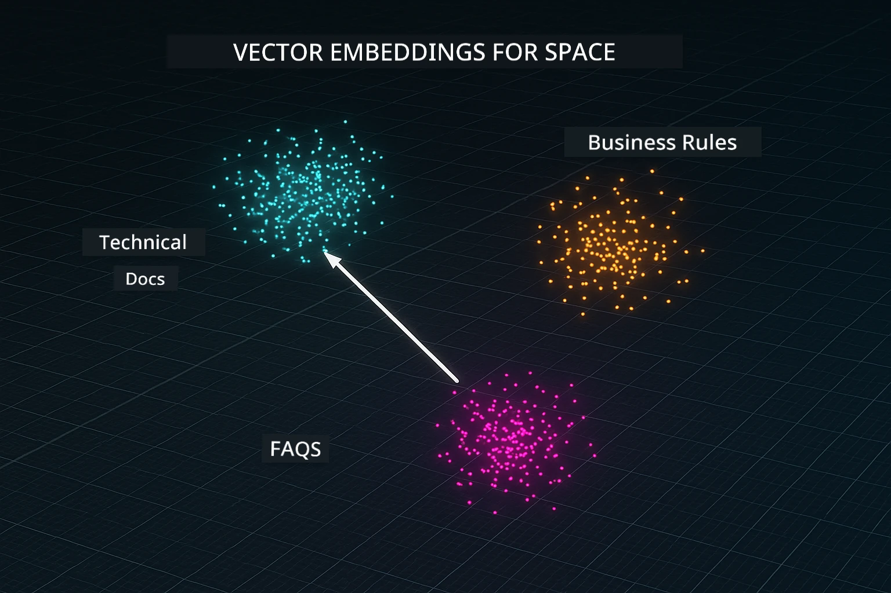
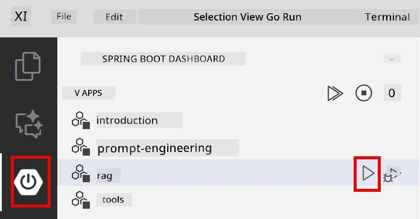
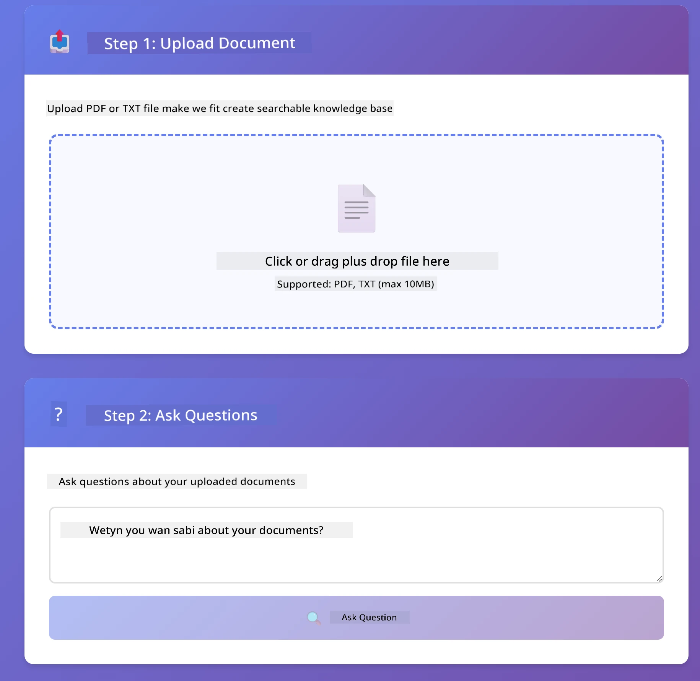
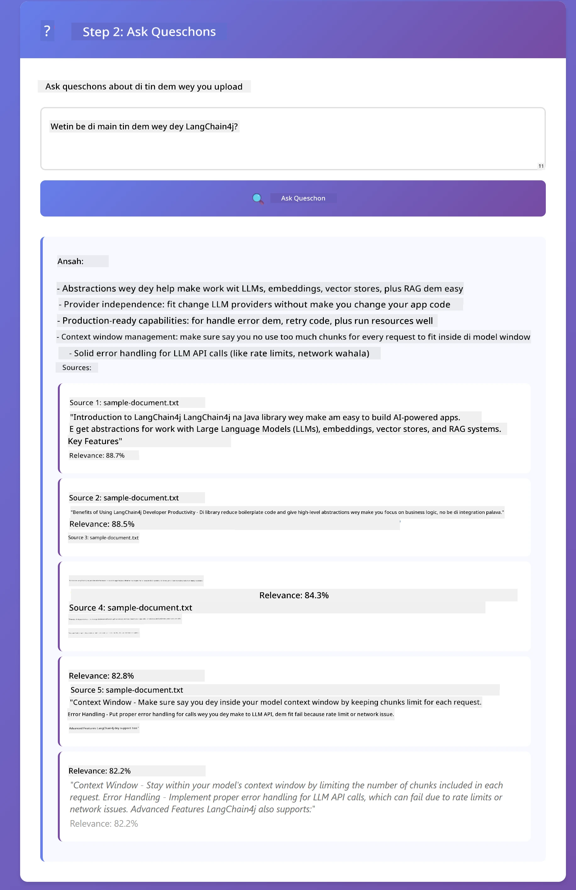

# Module 03: RAG (Retrieval-Augmented Generation)

## Table of Contents

- [Wetin You Go Learn](../../../03-rag)
- [Prerequisites](../../../03-rag)
- [Understanding RAG](../../../03-rag)
- [How E Dey Work](../../../03-rag)
  - [Document Processing](../../../03-rag)
  - [Creating Embeddings](../../../03-rag)
  - [Semantic Search](../../../03-rag)
  - [Answer Generation](../../../03-rag)
- [Run the Application](../../../03-rag)
- [Using the Application](../../../03-rag)
  - [Upload a Document](../../../03-rag)
  - [Ask Questions](../../../03-rag)
  - [Check Source References](../../../03-rag)
  - [Experiment with Questions](../../../03-rag)
- [Key Concepts](../../../03-rag)
  - [Chunking Strategy](../../../03-rag)
  - [Similarity Scores](../../../03-rag)
  - [In-Memory Storage](../../../03-rag)
  - [Context Window Management](../../../03-rag)
- [When RAG Matters](../../../03-rag)
- [Next Steps](../../../03-rag)

## What You'll Learn

For di modules wen you don pass, you don learn how to talk with AI and arrange your prompts well well. But one gbege dey: language models only sabi wetin dem learn wen dem train am. Dem no fit answer questions about your company policy, your project documents, or any info wey dem no train on.

RAG (Retrieval-Augmented Generation) fit solve dis problem. Instead make you try teach the model your info (wey dey costly and no too realistic), you go give am power to find tins for your documents. When person ask question, di system go find di relevant info and put am inside di prompt. Di model then go answer based on dat info wey e find.

Think am like say you give di model one koko book library. When you ask question, di system go:

1. **User Query** - You ask question
2. **Embedding** - E change your question to one vector
3. **Vector Search** - E find similar document chunks
4. **Context Assembly** - E add di correct chunks to the prompt
5. **Response** - LLM generate answer based on di context

Dis one make di model answer base on your actual data no be only di training knowledge or just normal answer e go make up.


*RAG workflow - from user query to semantic search to contextual answer generation*

## Prerequisites

- You don finish Module 01 (Azure OpenAI resources don deploy)
- `.env` file dey root directory with Azure credentials (wey `azd up` for Module 01 create)

> **Note:** If you never finish Module 01, make you follow di deployment instructions for there first.


## How It Works

### Document Processing

[DocumentService.java](../../../03-rag/src/main/java/com/example/langchain4j/rag/service/DocumentService.java)

When you upload document, di system go break am into chunks - small pieces wey fit inside di model context window well well. Chunks dem go also overlap small so you no lose di context for di edges.

```java
Document document = FileSystemDocumentLoader.loadDocument("sample-document.txt");

DocumentSplitter splitter = DocumentSplitters
    .recursive(300, 30, new OpenAiTokenizer());

List<TextSegment> segments = splitter.split(document);
```

> **🤖 Try with [GitHub Copilot](https://github.com/features/copilot) Chat:** Open [`DocumentService.java`](../../../03-rag/src/main/java/com/example/langchain4j/rag/service/DocumentService.java) and ask:
> - "How does LangChain4j split documents into chunks and why is overlap important?"
> - "What's the optimal chunk size for different document types and why?"
> - "How do I handle documents in multiple languages or with special formatting?"

### Creating Embeddings

[LangChainRagConfig.java](../../../03-rag/src/main/java/com/example/langchain4j/rag/config/LangChainRagConfig.java)

Every chunk go turn to number representation wey dem dey call embedding - e be like math fingerprint wey dey capture wetin di text mean. Similar text go get similar embeddings.

```java
@Bean
public EmbeddingModel embeddingModel() {
    return OpenAiOfficialEmbeddingModel.builder()
        .baseUrl(azureOpenAiEndpoint)
        .apiKey(azureOpenAiKey)
        .modelName(azureEmbeddingDeploymentName)
        .build();
}

EmbeddingStore<TextSegment> embeddingStore = 
    new InMemoryEmbeddingStore<>();
```



*Documents represented as vectors in embedding space - similar content clusters together*

### Semantic Search

[RagService.java](../../../03-rag/src/main/java/com/example/langchain4j/rag/service/RagService.java)

When you ask question, your question go also become embedding. Di system go compare your question embedding with all di document chunks embeddings. E go find di chunks wey get closest meaning - no be only keywords, but real semantic similarity.

```java
Embedding queryEmbedding = embeddingModel.embed(question).content();

List<EmbeddingMatch<TextSegment>> matches = 
    embeddingStore.findRelevant(queryEmbedding, 5, 0.7);

for (EmbeddingMatch<TextSegment> match : matches) {
    String relevantText = match.embedded().text();
    double score = match.score();
}
```

> **🤖 Try with [GitHub Copilot](https://github.com/features/copilot) Chat:** Open [`RagService.java`](../../../03-rag/src/main/java/com/example/langchain4j/rag/service/RagService.java) and ask:
> - "How does similarity search work with embeddings and what determines the score?"
> - "What similarity threshold should I use and how does it affect results?"
> - "How do I handle cases where no relevant documents are found?"

### Answer Generation

[RagService.java](../../../03-rag/src/main/java/com/example/langchain4j/rag/service/RagService.java)

The chunks wey get most relevance go enter di prompt give di model. Di model go read those chunks dem come answer your question based on dat info. Dis one dey stop make model no dey waka talk yawa - e fit only answer based on wetin dey front am.

## Run the Application

**Make sure deployment dey:**

Check say `.env` file dey root directory with Azure credentials (wey dem create inside Module 01):
```bash
cat ../.env  # E suppose show AZURE_OPENAI_ENDPOINT, API_KEY, DEPLOYMENT
```

**Start di application:**

> **Note:** If you don start all di applications before with `./start-all.sh` from Module 01, dis module don already dey run for port 8081. You fit skip all di start commands below come enter direct for http://localhost:8081.

**Option 1: Using Spring Boot Dashboard (Better if you dey use VS Code)**

The dev container get Spring Boot Dashboard extension, wey get visual interface to manage all Spring Boot apps. You fit see am for Activity Bar for left side of VS Code (look for Spring Boot icon).

For Spring Boot Dashboard, you fit:
- See all the Spring Boot apps wey dey workspace
- Start/stop apps with one click
- Check app logs in real-time
- Monitor app status

Just click di play button near "rag" to start dis module, or start all modules at once.



**Option 2: Using shell scripts**

Start all web apps (modules 01-04):

**Bash:**
```bash
cd ..  # From di root directory
./start-all.sh
```

**PowerShell:**
```powershell
cd ..  # From root directory itself
.\start-all.ps1
```

Or start just dis module:

**Bash:**
```bash
cd 03-rag
./start.sh
```

**PowerShell:**
```powershell
cd 03-rag
.\start.ps1
```

Both di scripts go load environment variables from root `.env` file automatically and if JARs no dey, e go build am.

> **Note:** If you want build all modules by yourself before you start:
>
> **Bash:**
> ```bash
> cd ..  # Go to root directory
> mvn clean package -DskipTests
> ```
>
> **PowerShell:**
> ```powershell
> cd ..  # Go to root directory
> mvn clean package -DskipTests
> ```

Open http://localhost:8081 for your browser.

**To stop:**

**Bash:**
```bash
./stop.sh  # Dis module only
# Or
cd .. && ./stop-all.sh  # All di modules
```

**PowerShell:**
```powershell
.\stop.ps1  # Dis module only
# Or
cd ..; .\stop-all.ps1  # All di modules
```

## Using the Application

Di app get web interface for document upload and question ask.

<a href="images/rag-homepage.png"></a>

*The RAG application interface - upload documents and ask questions*

### Upload a Document

Start by uploading document - TXT files dey best for testing. Sample-document.txt dey for dis folder wey get info about LangChain4j features, RAG implementation, and best practices - good for testing di system.

Di system go process your document, break am into chunks, then create embeddings for every chunk. E dey automatic once you upload.

### Ask Questions

Now fit ask specific questions about di matter inside di document. Try ask factual tins wey clear for di document. System go find relevant chunks, include am for prompt, then generate answer.

### Check Source References

You go see say every answer carry source references with similarity scores. Dem scores (0 to 1) dey show how relevant each chunk be to your question. Higher score mean better match. Dis one go help you confirm di answer vs di source material.

<a href="images/rag-query-results.png"></a>

*Query results showing answer with source references and relevance scores*

### Experiment with Questions

Try diff types of questions:
- Specific facts: "Wetin be di main topic?"
- Comparisons: "Wetin be di difference between X and Y?"
- Summaries: "Summarize di key points about Z"

Watch how di relevance scores change based on how well your question match di document content.

## Key Concepts

### Chunking Strategy

Documents dey split into 300-token chunks with 30 tokens overlap. Dis balance make each chunk get enough context to make sense and still small to fit multiple chunks for prompt.

### Similarity Scores

Scores dey from 0 to 1:
- 0.7-1.0: Dem dey highly relevant, exact match
- 0.5-0.7: Relevant, good context
- Under 0.5: Filtered out, too different

System go only collect chunks wey meet minimum threshold to guarantee quality.

### In-Memory Storage

Dis module dey use in-memory storage for simplicity. If you restart di app, uploaded documents go lost. For production, people dey use persistent vector databases like Qdrant or Azure AI Search.

### Context Window Management

Every model get max context window. You no fit put every chunk from big document. System go collect top N relevant chunks (default na 5) to fit inside di limits and still provide enough context for correct answers.

## When RAG Matters

**Use RAG when:**
- You dey answer questions about your own documents
- Info dey change quick quick (policies, prices, specs)
- You want accurate answer wey get source
- Content too big to fit one prompt
- You want answer wey you fit verify for ground truth

**No use RAG when:**
- Questions na general knowledge wey model sabi already
- You need real-time data (RAG work on uploaded docs)
- Content small well to put directly inside prompts

## Next Steps

**Next Module:** [04-tools - AI Agents with Tools](../04-tools/README.md)

---

**Navigation:** [← Previous: Module 02 - Prompt Engineering](../02-prompt-engineering/README.md) | [Back to Main](../README.md) | [Next: Module 04 - Tools →](../04-tools/README.md)

---

<!-- CO-OP TRANSLATOR DISCLAIMER START -->
**Disclaimer**:  
Dis document dem translate am wit AI translation service [Co-op Translator](https://github.com/Azure/co-op-translator). Even tho we try make e correct, abeg sabi say automated translation fit get some errors or mistakes. Di original document wey dey im own language na di correct one. If na important information, better make person wey sabi translate am well well do am. We no go responsible if people no understand well or if dem misinterpret from dis translation.
<!-- CO-OP TRANSLATOR DISCLAIMER END -->