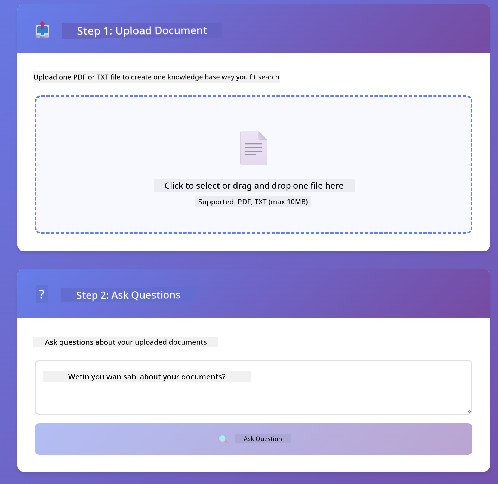

<!--
CO_OP_TRANSLATOR_METADATA:
{
  "original_hash": "f538a51cfd13147d40d84e936a0f485c",
  "translation_date": "2025-12-13T17:29:09+00:00",
  "source_file": "03-rag/README.md",
  "language_code": "pcm"
}
-->
# Module 03: RAG (Retrieval-Augmented Generation)

## Table of Contents

- [Wetyn You Go Learn](../../../03-rag)
- [Wetyn You Need Before](../../../03-rag)
- [Understanding RAG](../../../03-rag)
- [How E Dey Work](../../../03-rag)
  - [Document Processing](../../../03-rag)
  - [Creating Embeddings](../../../03-rag)
  - [Semantic Search](../../../03-rag)
  - [Answer Generation](../../../03-rag)
- [Run the Application](../../../03-rag)
- [Using the Application](../../../03-rag)
  - [Upload a Document](../../../03-rag)
  - [Ask Questions](../../../03-rag)
  - [Check Source References](../../../03-rag)
  - [Experiment with Questions](../../../03-rag)
- [Key Concepts](../../../03-rag)
  - [Chunking Strategy](../../../03-rag)
  - [Similarity Scores](../../../03-rag)
  - [In-Memory Storage](../../../03-rag)
  - [Context Window Management](../../../03-rag)
- [When RAG Matters](../../../03-rag)
- [Next Steps](../../../03-rag)

## Wetyn You Go Learn

For di modules wey you don do before, you don learn how to yarn with AI and how to arrange your prompts well well. But one kain wahala dey: language models sabi only wetin dem learn during training. Dem no fit answer questions about your company policies, your project documents, or any info wey dem no train on.

RAG (Retrieval-Augmented Generation) na di solution for dis problem. Instead make you try teach di model your info (wey dey expensive and no too possible), you go give am power to search your documents. When pesin ask question, di system go find correct info and put am for di prompt. Di model go then answer based on di info wey e find.

Think am like say RAG dey give di model one reference library. When you ask question, di system go:

1. **User Query** - You ask question
2. **Embedding** - E convert your question to vector
3. **Vector Search** - E find document chunks wey resemble
4. **Context Assembly** - E add di correct chunks to di prompt
5. **Response** - LLM go generate answer based on di context

Dis one dey ground di model answer for your real data instead of to rely on wetin e learn or to just make answer.


*RAG workflow - from user query to semantic search to contextual answer generation*

## Wetyn You Need Before

- You don finish Module 01 (Azure OpenAI resources don deploy)
- `.env` file dey root directory with Azure credentials (wey `azd up` create for Module 01)

> **Note:** If you never finish Module 01, abeg follow di deployment instructions wey dey there first.


## How E Dey Work

**Document Processing** - [DocumentService.java](../../../03-rag/src/main/java/com/example/langchain4j/rag/service/DocumentService.java)

When you upload document, di system go break am into chunks - small small pieces wey fit well inside di model context window. Di chunks dey overlap small so you no go lose context for di edges.

```java
Document document = FileSystemDocumentLoader.loadDocument("sample-document.txt");

DocumentSplitter splitter = DocumentSplitters
    .recursive(300, 30, new OpenAiTokenizer());

List<TextSegment> segments = splitter.split(document);
```

> **🤖 Try with [GitHub Copilot](https://github.com/features/copilot) Chat:** Open [`DocumentService.java`](../../../03-rag/src/main/java/com/example/langchain4j/rag/service/DocumentService.java) and ask:
> - "How does LangChain4j split documents into chunks and why is overlap important?"
> - "What's the optimal chunk size for different document types and why?"
> - "How do I handle documents in multiple languages or with special formatting?"

**Creating Embeddings** - [LangChainRagConfig.java](../../../03-rag/src/main/java/com/example/langchain4j/rag/config/LangChainRagConfig.java)

Each chunk go convert to number wey dem dey call embedding - na like mathematical fingerprint wey capture di meaning of di text. Text wey resemble go get similar embeddings.

```java
@Bean
public EmbeddingModel embeddingModel() {
    return OpenAiOfficialEmbeddingModel.builder()
        .baseUrl(azureOpenAiEndpoint)
        .apiKey(azureOpenAiKey)
        .modelName(azureEmbeddingDeploymentName)
        .build();
}

EmbeddingStore<TextSegment> embeddingStore = 
    new InMemoryEmbeddingStore<>();
```


*Documents represented as vectors in embedding space - similar content clusters together*

**Semantic Search** - [RagService.java](../../../03-rag/src/main/java/com/example/langchain4j/rag/service/RagService.java)

When you ask question, your question go also become embedding. Di system go compare your question embedding with all di document chunks embeddings. E go find di chunks wey get di closest meaning - no be only matching keywords, but real semantic similarity.

```java
Embedding queryEmbedding = embeddingModel.embed(question).content();

List<EmbeddingMatch<TextSegment>> matches = 
    embeddingStore.findRelevant(queryEmbedding, 5, 0.7);

for (EmbeddingMatch<TextSegment> match : matches) {
    String relevantText = match.embedded().text();
    double score = match.score();
}
```

> **🤖 Try with [GitHub Copilot](https://github.com/features/copilot) Chat:** Open [`RagService.java`](../../../03-rag/src/main/java/com/example/langchain4j/rag/service/RagService.java) and ask:
> - "How does similarity search work with embeddings and what determines the score?"
> - "What similarity threshold should I use and how does it affect results?"
> - "How do I handle cases where no relevant documents are found?"

**Answer Generation** - [RagService.java](../../../03-rag/src/main/java/com/example/langchain4j/rag/service/RagService.java)

Di chunks wey get most relevance go enter di prompt wey model go use. Di model go read those chunks and answer your question based on dat info. Dis one dey prevent hallucination - di model fit only answer from wetin dey front of am.

## Run the Application

**Make sure say deployment dey:**

Make sure `.env` file dey root directory with Azure credentials (wey dem create for Module 01):
```bash
cat ../.env  # E suppose show AZURE_OPENAI_ENDPOINT, API_KEY, DEPLOYMENT
```

**Start di application:**

> **Note:** If you don start all applications before with `./start-all.sh` from Module 01, dis module don dey run for port 8081. You fit skip di start commands below and go straight to http://localhost:8081.

**Option 1: Using Spring Boot Dashboard (Better for VS Code users)**

Di dev container get Spring Boot Dashboard extension, wey get visual interface to manage all Spring Boot applications. You fit find am for Activity Bar for left side of VS Code (look for Spring Boot icon).

From Spring Boot Dashboard, you fit:
- See all Spring Boot applications wey dey workspace
- Start/stop applications with one click
- View application logs for real-time
- Monitor application status

Just click di play button wey dey next to "rag" to start dis module, or start all modules at once.


**Option 2: Using shell scripts**

Start all web applications (modules 01-04):

**Bash:**
```bash
cd ..  # From root directory
./start-all.sh
```

**PowerShell:**
```powershell
cd ..  # From root directory
.\start-all.ps1
```

Or start only dis module:

**Bash:**
```bash
cd 03-rag
./start.sh
```

**PowerShell:**
```powershell
cd 03-rag
.\start.ps1
```

Both scripts go automatically load environment variables from root `.env` file and go build di JARs if dem no dey.

> **Note:** If you want build all modules manually before you start:
>
> **Bash:**
> ```bash
> cd ..  # Go to root directory
> mvn clean package -DskipTests
> ```
>
> **PowerShell:**
> ```powershell
> cd ..  # Go to root directory
> mvn clean package -DskipTests
> ```

Open http://localhost:8081 for your browser.

**To stop:**

**Bash:**
```bash
./stop.sh  # Dis module only
# Or
cd .. && ./stop-all.sh  # All di modules
```

**PowerShell:**
```powershell
.\stop.ps1  # Dis module only
# Or
cd ..; .\stop-all.ps1  # All di modules
```

## Using the Application

Di application get web interface for document upload and question asking.

<a href="images/rag-homepage.png"></a>

*Di RAG application interface - upload documents and ask questions*

**Upload a Document**

Start by uploading document - TXT files dey best for testing. One `sample-document.txt` dey this directory wey get info about LangChain4j features, RAG implementation, and best practices - perfect for testing di system.

Di system go process your document, break am into chunks, and create embeddings for each chunk. Dis one dey automatic when you upload.

**Ask Questions**

Now ask specific questions about di document content. Try ask something wey dey factual and clear for di document. Di system go search for relevant chunks, put dem for di prompt, and generate answer.

**Check Source References**

You go see say each answer get source references with similarity scores. Di scores (0 to 1) dey show how relevant each chunk be to your question. Higher scores mean better match. Dis one go help you check di answer against di source material.

<a href="images/rag-query-results.png"></a>

*Query results wey show answer with source references and relevance scores*

**Experiment with Questions**

Try different kain questions:
- Specific facts: "Wetin be di main topic?"
- Comparisons: "Wetin be di difference between X and Y?"
- Summaries: "Summarize di key points about Z"

Watch how di relevance scores dey change based on how well your question match di document content.

## Key Concepts

**Chunking Strategy**

Documents dey split into 300-token chunks with 30 tokens overlap. Dis balance make sure each chunk get enough context to make sense but still small enough to fit many chunks inside one prompt.

**Similarity Scores**

Scores dey from 0 to 1:
- 0.7-1.0: Highly relevant, exact match
- 0.5-0.7: Relevant, good context
- Below 0.5: Filtered out, too dissimilar

Di system go only retrieve chunks wey pass di minimum threshold to make sure quality dey.

**In-Memory Storage**

Dis module dey use in-memory storage to keep am simple. When you restart di application, uploaded documents go lost. For production, dem dey use persistent vector databases like Qdrant or Azure AI Search.

**Context Window Management**

Each model get maximum context window. You no fit put every chunk from big document. Di system go retrieve top N most relevant chunks (default na 5) to stay within di limit but still give enough context for correct answers.

## When RAG Matters

**Use RAG when:**
- You dey answer questions about proprietary documents
- Info dey change often (policies, prices, specifications)
- You need accuracy with source attribution
- Content too big to fit inside one prompt
- You want verifiable, grounded answers

**No use RAG when:**
- Questions need general knowledge wey model already get
- You need real-time data (RAG dey work on uploaded documents)
- Content small enough to put directly inside prompts

## Next Steps

**Next Module:** [04-tools - AI Agents with Tools](../04-tools/README.md)

---

**Navigation:** [← Previous: Module 02 - Prompt Engineering](../02-prompt-engineering/README.md) | [Back to Main](../README.md) | [Next: Module 04 - Tools →](../04-tools/README.md)

---

<!-- CO-OP TRANSLATOR DISCLAIMER START -->
**Disclaimer**:
Dis document na AI translation service [Co-op Translator](https://github.com/Azure/co-op-translator) wey translate am. Even though we dey try make am correct, abeg sabi say automated translation fit get some mistakes or no too correct. The original document wey e dey for im own language na the correct one. If na serious matter, e better make person wey sabi translate am well do am. We no go responsible if person no understand well or if dem use dis translation do wrong thing.
<!-- CO-OP TRANSLATOR DISCLAIMER END -->